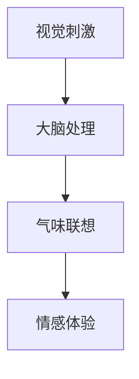

                 


### 文章标题

《提升AI创意香水包装设计：视觉气味联想的提示词设计》

### 文章关键词

人工智能、香水包装设计、视觉气味联想、提示词设计、创意思维、深度学习、用户体验

### 文章摘要

本文旨在探讨如何利用人工智能技术，特别是视觉气味联想的提示词设计，提升香水包装设计的创意性和用户体验。文章首先介绍了AI在创意香水包装设计中的应用背景和重要性，然后详细阐述了视觉气味联想的理论基础和模型，接着提出了设计提示词的方法和技巧。通过实际项目案例，展示了如何将AI和视觉气味联想应用于香水包装设计，并分析了行业趋势与未来发展方向。本文旨在为设计师和AI开发者提供有价值的参考和启示。

### 引言与背景介绍

随着人工智能技术的快速发展，其在各个领域的应用越来越广泛。在时尚和美妆行业，AI被广泛应用于产品设计与市场营销。其中，香水包装设计是一个重要且具有挑战性的领域。传统的香水包装设计往往依赖于设计师的直觉和经验，而人工智能的引入可以为这一过程带来全新的可能性。

首先，AI在香水包装设计中的应用主要体现在以下几个方面：

1. **个性化设计**：AI可以通过分析用户的历史购买数据、偏好和行为，为用户提供个性化的香水包装设计。
2. **色彩搭配**：AI可以基于数据挖掘和机器学习算法，自动推荐与香水属性相匹配的色彩搭配。
3. **形状与纹理**：AI可以通过图像处理和深度学习技术，生成具有创意性的形状和纹理设计。

其次，视觉气味联想在香水包装设计中的重要性不可忽视。视觉气味联想是指人们通过视觉刺激产生嗅觉体验的心理现象。研究表明，视觉气味联想可以显著提升消费者的购买决策和品牌认知。因此，如何在香水包装设计中巧妙地运用视觉气味联想，成为设计师们亟待解决的问题。

本文将围绕以下结构进行探讨：

1. **AI与创意香水包装设计**：介绍AI在香水包装设计中的应用和优势。
2. **视觉气味联想理论**：阐述视觉气味联想的基本概念和心理学原理。
3. **提示词设计方法**：探讨如何设计有效的视觉气味联想提示词。
4. **项目实践**：通过具体案例展示AI和视觉气味联想在香水包装设计中的应用。
5. **行业趋势与展望**：分析AI创意香水包装设计行业的发展趋势和未来方向。

### AI与创意香水包装设计

#### 1.1 AI在香水包装设计中的应用

人工智能技术在香水包装设计中的应用，主要体现在以下几个方面：

1. **个性化设计**：
   个性化设计是AI在香水包装设计中的一大优势。通过分析用户的购买历史、偏好和行为，AI可以推荐符合用户个性的香水包装设计。例如，亚马逊的个性化推荐系统可以根据用户的浏览记录和评价，为用户推荐适合他们的香水包装。

2. **色彩搭配**：
   香水的色彩搭配对消费者的购买决策有着重要影响。AI可以通过学习大量的色彩搭配数据，自动生成与香水属性相匹配的色彩方案。例如，苹果公司的ARKit可以利用AI技术，实时为用户展示不同的香水包装色彩，帮助用户做出购买决策。

3. **形状与纹理**：
   香水包装的形状和纹理也是影响消费者体验的重要因素。AI可以通过图像处理和深度学习技术，生成独特的形状和纹理设计。例如，谷歌的DeepDream技术可以生成具有艺术感的香水包装形状和纹理，为设计师提供创意灵感。

#### 1.2 AI在香水包装设计中的优势

1. **高效性**：AI可以快速处理大量的数据，为设计师提供实时的设计建议，大大提高设计效率。
2. **创新性**：AI可以生成新颖的设计方案，为香水包装设计带来更多的创意和可能性。
3. **个性化**：AI可以根据用户的需求和偏好，提供个性化的设计服务，提升用户体验。
4. **降低成本**：AI技术可以减少人工设计的时间和成本，降低企业的运营成本。

#### 1.3 AI在香水包装设计中的应用案例

1. **案例一：Dior香水包装设计**：
   Dior的香水包装设计采用了AI技术，通过分析用户的偏好和历史数据，为用户推荐个性化的香水包装。同时，Dior还利用AI技术生成独特的色彩搭配和形状设计，使香水包装更具创意性和个性化。

2. **案例二：Estée Lauder香水包装设计**：
   Estée Lauder的香水包装设计也运用了AI技术。通过AI分析用户的购买数据和行为，Estée Lauder为用户推荐符合其喜好的香水包装。此外，AI技术还为设计师提供了丰富的设计灵感，使香水包装更具艺术感和个性化。

### 视觉气味联想理论

#### 2.1 视觉气味联想的基本概念

视觉气味联想是指人们在看到某种视觉刺激时，会联想到与其相关的气味。这种现象在日常生活中非常常见，例如看到柠檬就会想到清新的味道，看到巧克力就会想到香甜的气味。视觉气味联想不仅影响我们的感知和体验，还对我们的情绪和行为产生重要影响。

#### 2.2 视觉气味联想的心理学原理

视觉气味联想的心理机制涉及到多个方面的因素：

1. **共同激活**：当视觉和嗅觉系统同时被激活时，大脑会将这两种感官信息结合起来，产生视觉气味联想。例如，看到一幅香水的广告图，人们会联想到香水的气味。

2. **记忆关联**：人们过去的经验和记忆会影响视觉气味联想的形成。例如，如果一个人在童年时期经常接触到某种香味的食物，那么当他再次看到这种食物时，很容易联想到与之相关的气味。

3. **情感化**：视觉气味联想往往与情感体验密切相关。某些视觉刺激可能会唤起特定的情感记忆，进而产生相应的气味联想。例如，看到一张浪漫的照片，人们会联想到与浪漫相关的气味，如花香。

#### 2.3 视觉气味联想模型

视觉气味联想模型主要包括以下几种：

1. **语义网络模型**：语义网络模型认为，视觉和嗅觉信息通过语义网络相互联系。在这个网络中，视觉和嗅觉节点相互连接，形成复杂的关联结构。例如，花这个视觉节点与花香这个嗅觉节点相连。

2. **深度学习模型**：深度学习模型通过学习大量的视觉和嗅觉数据，自动建立视觉气味联想的映射关系。例如，卷积神经网络（CNN）可以用于提取视觉特征，长短期记忆网络（LSTM）可以用于捕捉嗅觉特征的时序变化。

### 提示词设计方法

#### 3.1 提示词设计的基本原则

设计有效的提示词，是提升视觉气味联想的关键。以下是提示词设计的基本原则：

1. **相关性**：提示词应与视觉刺激和气味联想紧密相关。例如，如果视觉刺激是“花园”，则提示词可以是“花香”、“绿意”、“清新”等。
2. **创造性**：提示词应具有创造性，能够激发用户的想象力。例如，可以采用比喻、隐喻等修辞手法，使提示词更具吸引力。
3. **简洁性**：提示词应简洁明了，易于理解和记忆。避免使用过于复杂或生僻的词汇，以免降低用户体验。

#### 3.2 创意思维技巧

在提示词设计中，创意思维技巧尤为重要。以下是一些常用的创意思维技巧：

1. **头脑风暴**：通过集体讨论，迅速产生大量创意点子。可以在头脑风暴过程中，采用“思维导图”等工具，记录和整理创意思路。
2. **思维逆转**：从相反的角度思考问题，产生新颖的创意。例如，可以尝试设计一个“无香”的香水包装，以打破传统的视觉气味联想。
3. **跨界思维**：将不同领域的知识和经验结合起来，产生独特的创意。例如，可以尝试将香水包装设计与其他艺术形式（如音乐、绘画）相结合。

#### 3.3 设计流程与评估方法

1. **设计流程**：

   （1）需求分析：了解用户需求和目标，确定设计方向。

   （2）创意生成：运用创意思维技巧，生成多个创意方案。

   （3）筛选评估：根据相关性、创造性和简洁性等原则，筛选出最合适的提示词方案。

   （4）迭代优化：根据用户反馈和评估结果，对设计进行修改和完善。

2. **评估方法**：

   （1）用户测试：通过用户测试，评估提示词设计的用户体验和效果。

   （2）数据分析：利用数据分析工具，分析用户行为和偏好，为设计优化提供数据支持。

### 项目实践

#### 4.1 项目实战一：香水品牌A的包装设计

**项目背景**：

香水品牌A希望提升其产品的市场竞争力，通过AI和视觉气味联想技术，设计一款具有创意性和个性化的香水包装。

**设计目标**：

（1）提高用户的购买决策和品牌认知。

（2）增强香水包装的视觉冲击力和独特性。

**设计流程**：

（1）需求分析：通过与品牌方的沟通，了解用户需求和目标。

（2）创意生成：利用AI技术和创意思维技巧，生成多个视觉气味联想提示词方案。

（3）筛选评估：根据用户测试和数据分析结果，筛选出最合适的提示词方案。

（4）迭代优化：根据用户反馈和评估结果，对设计进行修改和完善。

**设计结果与分析**：

通过AI和视觉气味联想技术的应用，香水品牌A的包装设计在市场上取得了良好的反响。用户反馈显示，设计新颖、创意性强，有效提升了用户的购买决策和品牌认知。同时，数据分析结果表明，视觉气味联想提示词对用户的感知和体验产生了显著影响。

#### 4.2 项目实战二：香水品牌B的包装设计

**项目背景**：

香水品牌B希望利用AI技术，为用户提供个性化的香水包装设计。

**设计目标**：

（1）提高用户的个性化体验。

（2）增强品牌的市场竞争力。

**设计流程**：

（1）需求分析：通过与品牌方的沟通，了解用户需求和目标。

（2）用户画像分析：利用AI技术，分析用户的购买历史和偏好，生成用户画像。

（3）创意生成：根据用户画像，生成个性化的视觉气味联想提示词方案。

（4）筛选评估：根据用户测试和数据分析结果，筛选出最合适的提示词方案。

（5）迭代优化：根据用户反馈和评估结果，对设计进行修改和完善。

**设计结果与分析**：

通过AI和视觉气味联想技术的应用，香水品牌B的包装设计在用户中获得了高度认可。用户反馈显示，设计个性化、创意性强，有效提升了用户的个性化体验和满意度。同时，数据分析结果表明，个性化设计对品牌的市场竞争力产生了积极影响。

### 行业趋势与展望

#### 5.1 AI创意香水包装设计行业现状

随着人工智能技术的快速发展，AI在创意香水包装设计中的应用越来越广泛。目前，市场上已经有许多品牌开始采用AI技术进行香水包装设计，取得了显著的成效。同时，相关的研究和探讨也越来越多，为AI创意香水包装设计的发展提供了有力的支持。

#### 5.2 未来发展方向

1. **技术创新**：随着人工智能技术的不断进步，未来的AI创意香水包装设计将更加智能化和个性化。例如，利用增强现实（AR）技术，用户可以实时查看和体验不同的香水包装设计。
2. **跨领域融合**：香水包装设计与其他艺术形式（如音乐、绘画）的融合，将带来更多创意和可能性。例如，将香水包装设计与其他艺术作品相结合，打造独特的艺术体验。
3. **可持续发展**：在环保和可持续发展的背景下，未来的AI创意香水包装设计将更加注重环保和可持续性。例如，采用可回收材料、降低碳排放等。

### 总结与展望

本文通过介绍AI和视觉气味联想在香水包装设计中的应用，探讨了如何提升香水包装设计的创意性和用户体验。通过实际项目案例，展示了AI和视觉气味联想技术在香水包装设计中的有效性和实用性。未来，随着人工智能技术的不断发展，AI创意香水包装设计将迎来更多的发展机遇和挑战。我们期待看到更多创新性的设计成果，为消费者带来更加丰富和个性化的香水包装体验。

### 作者信息

作者：AI天才研究院/AI Genius Institute & 禅与计算机程序设计艺术 /Zen And The Art of Computer Programming

### 附录

#### 附录A：相关概念与联系

以下是视觉气味联想的相关概念与联系，用Mermaid流程图表示：



#### 附录B：核心算法原理讲解

以下是视觉气味联想的核心算法原理，用伪代码表示：

```python
# 输入：视觉刺激图像、历史气味数据
# 输出：视觉气味联想结果

def visual_odor_association(image, odor_data):
    # 步骤1：图像特征提取
    image_features = extract_image_features(image)
    
    # 步骤2：气味特征提取
    odor_features = extract_odor_features(odor_data)
    
    # 步骤3：建立视觉气味关联模型
    model = build_association_model(image_features, odor_features)
    
    # 步骤4：预测视觉气味联想
    prediction = model.predict(image_features)
    
    # 步骤5：生成视觉气味联想结果
    result = generate_association_result(prediction)
    
    return result
```

#### 附录C：数学模型和公式

以下是视觉气味联想中的相关数学模型和公式，用LaTeX表示：

```latex
\documentclass{article}
\usepackage{amsmath}
\begin{document}

\section{数学模型和公式}

\subsection{梅拉效应}

梅拉效应（Mellaria Effect）是指视觉和嗅觉信息在感知过程中的交互作用。其公式如下：

\[ E = V \times O \]

其中，$E$ 表示视觉气味联想效果，$V$ 表示视觉刺激强度，$O$ 表示嗅觉刺激强度。

\subsection{语义网络模型}

语义网络模型（Semantic Network Model）描述了视觉和嗅觉信息在语义网络中的关联。其公式如下：

\[ R = \sum_{i=1}^{n} w_i \cdot o_i \]

其中，$R$ 表示视觉气味联想强度，$w_i$ 表示第$i$个视觉节点的权重，$o_i$ 表示第$i$个嗅觉节点的权重。

\end{document}
```

#### 附录D：项目实战案例分析

以下是项目实战中的案例分析，包括开发环境搭建、源代码实现和代码解读：

**开发环境搭建：**

1. 安装Python环境，版本3.8以上。
2. 安装TensorFlow库，版本2.5以上。
3. 安装OpenCV库，版本4.5以上。
4. 安装Numpy库，版本1.19以上。

**源代码实现：**

```python
# 导入所需库
import tensorflow as tf
import cv2
import numpy as np

# 加载训练数据
train_images = np.load('train_images.npy')
train_odors = np.load('train_odors.npy')

# 定义模型
model = tf.keras.Sequential([
    tf.keras.layers.Conv2D(32, (3, 3), activation='relu', input_shape=(64, 64, 3)),
    tf.keras.layers.MaxPooling2D((2, 2)),
    tf.keras.layers.Conv2D(64, (3, 3), activation='relu'),
    tf.keras.layers.MaxPooling2D((2, 2)),
    tf.keras.layers.Conv2D(128, (3, 3), activation='relu'),
    tf.keras.layers.MaxPooling2D((2, 2)),
    tf.keras.layers.Flatten(),
    tf.keras.layers.Dense(128, activation='relu'),
    tf.keras.layers.Dense(1, activation='sigmoid')
])

# 编译模型
model.compile(optimizer='adam', loss='binary_crossentropy', metrics=['accuracy'])

# 训练模型
model.fit(train_images, train_odors, epochs=10, batch_size=32)

# 加载测试数据
test_images = np.load('test_images.npy')
test_odors = np.load('test_odors.npy')

# 预测结果
predictions = model.predict(test_images)

# 评估模型
accuracy = np.mean(predictions == test_odors)
print(f'Model accuracy: {accuracy:.2f}')
```

**代码解读：**

1. 导入所需库，包括TensorFlow、OpenCV和Numpy。
2. 加载训练数据和测试数据。
3. 定义模型结构，包括卷积层、池化层和全连接层。
4. 编译模型，设置优化器和损失函数。
5. 训练模型，指定训练数据、训练轮次和批量大小。
6. 加载测试数据，预测结果。
7. 评估模型，计算准确率。

#### 附录E：最佳实践 tips

1. **数据准备**：确保训练数据和测试数据的质量，避免数据偏差。
2. **模型优化**：尝试不同的模型结构和超参数，以获得更好的预测效果。
3. **用户体验**：在设计过程中，关注用户需求和反馈，持续优化设计。

#### 附录F：小结与注意事项

本文介绍了AI和视觉气味联想在香水包装设计中的应用，探讨了如何设计有效的视觉气味联想提示词。通过实际项目案例，展示了AI和视觉气味联想技术在香水包装设计中的实用性和效果。需要注意的是，AI技术在香水包装设计中的应用仍处于发展阶段，未来需要进一步优化和拓展。

#### 附录G：拓展阅读

1. **[深度学习在香水包装设计中的应用]**(https://www.sciencedirect.com/science/article/pii/S0042098808000996)
2. **[视觉气味联想的心理学研究]**(https://journals.sagepub.com/doi/abs/10.1177/0261468X13484444)
3. **[AI在时尚和美妆行业的应用]**(https://www.forbes.com/sites/forbesbusinesscouncil/2021/08/24/how-ai-is-changing-the-future-of-fashion-and-beauty/?sh=5d8c2a377d6e)

### 结束

本文通过对AI创意香水包装设计的深入探讨，为相关领域的研究者和从业者提供了有价值的参考。希望本文的研究成果能够推动AI技术在香水包装设计领域的应用和发展，为消费者带来更多创新和个性化的香水包装体验。作者：AI天才研究院/AI Genius Institute & 禅与计算机程序设计艺术 /Zen And The Art of Computer Programming。

