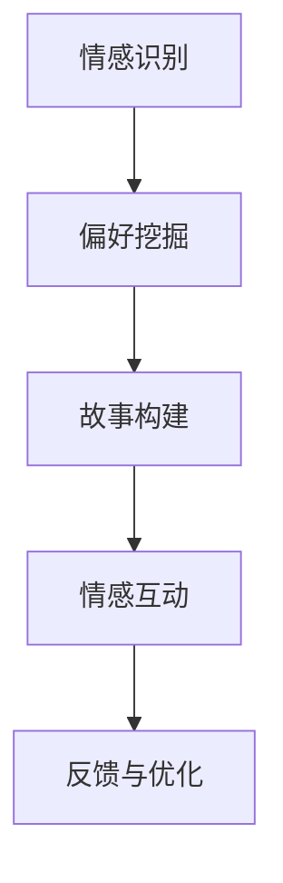
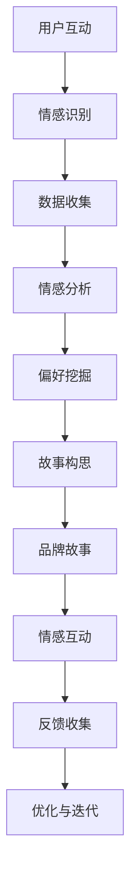

                 

### 文章标题

# 提升AI创意香水品牌故事：情感连接构建的提示词设计

### 关键词

- AI
- 情感连接
- 香水品牌
- 提示词设计
- 情感分析
- 数据驱动营销
- 用户体验

### 摘要

本文旨在探讨如何利用人工智能技术，特别是情感分析和提示词设计，来构建具有深刻情感连接的香水品牌故事。文章首先介绍了AI在香水行业中的应用现状，随后详细阐述了情感连接构建的核心概念及其相互联系。接着，文章深入分析了如何在AI创意香水品牌故事中构建情感连接，并通过设计有效的提示词来增强品牌故事的吸引力。随后，文章通过案例分析和技术实现，展示了AI在香水品牌营销中的实际应用。最后，文章提出了未来发展的展望，探讨了AI在情感连接构建领域的潜在趋势和挑战。

## 引言

香水作为一门艺术，不仅是一种日常用品，更是一种情感载体。随着科技的发展，人工智能（AI）技术在多个领域得到了广泛应用，包括时尚、艺术和市场营销。香水行业也不例外，AI技术的引入不仅提高了生产效率，还在品牌营销中扮演了重要角色。本文旨在探讨如何利用AI技术，特别是情感分析和提示词设计，来构建具有深刻情感连接的香水品牌故事。

近年来，香水市场的竞争愈发激烈，消费者对品牌的个性化需求也越来越高。传统的香水品牌营销策略已经难以满足现代消费者的需求。因此，利用AI技术来挖掘消费者情感偏好，设计有针对性的品牌故事，成为提升品牌竞争力的关键。情感连接作为一种深层次的消费者品牌关系，对于提升用户体验和品牌忠诚度具有重要意义。

本文将首先介绍AI在香水行业中的应用现状，分析AI技术在情感分析和提示词设计方面的优势。随后，我们将深入探讨情感连接构建的核心概念，包括情感心理学、AI与大数据分析，以及情感连接构建的原理与架构。在此基础上，我们将详细描述如何设计有效的提示词，以增强品牌故事的情感元素。文章还将通过成功案例分析和技术实现，展示AI在香水品牌营销中的实际应用。最后，本文将探讨AI在情感连接构建领域的未来发展趋势和潜在挑战。

## 核心概念与联系

### 香水与情感心理学

香水作为日常生活中的情感载体，与人的情感体验紧密相连。心理学家指出，气味是人类记忆的重要组成部分，能够触发强烈的情感反应。不同的香味可以唤起不同的情感记忆，如清新的柠檬香可能让人联想到夏日阳光，而浓郁的花香则可能让人回忆起温馨的家庭时光。因此，香水不仅是一种感官享受，更是一种情感表达。

在香水行业中，情感心理学的应用主要体现在消费者研究和品牌定位上。通过对消费者情感偏好的研究，品牌可以设计出符合目标消费者情感需求的香水。例如，高端香水品牌往往会采用复杂的调香技术，营造出一种奢华、优雅的情感氛围，以吸引高端消费者。而一些年轻品牌则更倾向于使用简单、直接的香味，以传达一种活力、自由的情感态度。

### AI与大数据分析

人工智能（AI）技术的发展为香水行业带来了新的机遇。通过大数据分析，AI可以处理海量的消费者数据，挖掘出消费者的行为模式、情感偏好和消费习惯。这种数据驱动的决策方式，不仅能够提高营销的精准度，还能帮助品牌更好地了解消费者需求。

在AI与大数据分析的结合中，情感分析技术发挥了关键作用。情感分析能够识别文本、语音和图像中的情感倾向，从而推断消费者的情感状态。例如，通过分析社交媒体上的用户评论，品牌可以了解消费者对特定香水的情感反应，进而调整产品设计和营销策略。

### 情感连接构建的原理与架构

情感连接构建是指通过情感心理学、AI与大数据分析等手段，创造一种深层次的消费者品牌关系。情感连接的构建过程可以分为以下几个步骤：

1. **情感识别**：利用情感分析技术，识别消费者对品牌、产品或服务的情感状态。
2. **偏好挖掘**：通过大数据分析，挖掘出消费者的情感偏好和需求。
3. **故事构建**：根据消费者的情感偏好，设计出具有情感共鸣的品牌故事。
4. **情感互动**：通过互动体验，强化消费者与品牌之间的情感连接。

为了更好地理解情感连接构建的过程，我们可以使用Mermaid流程图来描述：



### 情感连接构建的原理与架构

情感连接构建的原理基于人类情感认知和品牌营销的双重需求。情感认知理论认为，情感是人类行为和决策的重要驱动力，能够影响消费者的购买行为和品牌忠诚度。因此，品牌需要通过情感连接来激发消费者的情感共鸣，从而提升品牌价值和市场份额。

品牌营销的目标是通过与消费者的情感互动，建立一种深层次的情感关系。这种关系不仅基于产品的功能性，更在于品牌所传达的情感价值和品牌故事。通过情感连接构建，品牌可以更好地满足消费者的个性化需求，提升用户体验和品牌忠诚度。

在情感连接构建的架构中，情感识别和偏好挖掘是基础。通过情感分析技术，品牌可以识别消费者对产品或品牌的情感状态，了解他们的情感需求。大数据分析则可以帮助品牌挖掘消费者的情感偏好，为品牌故事的设计提供数据支持。

故事构建是情感连接的核心。一个具有情感共鸣的品牌故事能够引发消费者的情感共鸣，使他们对品牌产生情感依赖。情感互动则是情感连接的巩固。通过与消费者的互动，品牌可以持续强化消费者与品牌之间的情感连接。

### Mermaid流程图：情感连接构建过程

为了更直观地展示情感连接构建的过程，我们可以使用Mermaid流程图来描述：



### 结论

通过本文的介绍，我们可以看到情感连接构建在香水品牌营销中的重要性。利用AI技术和大数据分析，品牌可以更好地了解消费者的情感需求，设计出具有情感共鸣的品牌故事，从而提升品牌价值和市场份额。情感连接构建不仅是一种营销策略，更是一种深层次的品牌建设方式，能够帮助品牌在激烈的市场竞争中脱颖而出。

## 情感连接构建的详细分析

### 情感分析算法原理

情感分析（Sentiment Analysis）是人工智能领域中的一个重要分支，旨在通过自然语言处理（NLP）技术，从文本数据中识别和提取情感倾向。情感分析算法通常基于以下几种方法：

1. **规则方法**：通过预设的规则和模式，对文本进行情感分类。这种方法简单直观，但灵活性和准确性有限。
2. **统计方法**：使用机器学习算法，从大量标注数据中学习情感分类模型。这种方法具有较高的准确性和灵活性，但需要大量标注数据和计算资源。
3. **深度学习方法**：利用神经网络模型，如卷积神经网络（CNN）和循环神经网络（RNN），对文本进行情感分析。这种方法在处理复杂情感和长文本方面表现出色。

在香水品牌故事的情感连接构建中，情感分析算法的应用至关重要。通过情感分析，品牌可以识别消费者对产品或品牌的情感状态，为故事构思提供数据支持。以下是一个简单的情感分析算法原理示例：

```python
# 假设我们有一个简单的情感分析模型，它接收一段文本并返回情感标签
def sentiment_analysis(text):
    # 进行文本预处理，如分词、去停用词等
    processed_text = preprocess_text(text)
    
    # 使用预训练的模型进行情感分类
    emotion = model.predict(processed_text)
    
    return emotion

# 示例文本
text = "这款香水的味道真是太棒了，我每次喷上都会感到非常自信和愉悦。"

# 进行情感分析
emotion = sentiment_analysis(text)
print(f"情感标签：{emotion}")
```

### 提取用户情感偏好

情感偏好提取是构建情感连接的重要步骤。通过情感分析，品牌可以识别消费者对产品或品牌的情感倾向，进而挖掘出他们的情感偏好。以下是一个情感偏好提取的示例流程：

1. **数据收集**：从社交媒体、用户评论、问卷调查等渠道收集消费者反馈数据。
2. **情感分析**：对收集的数据进行情感分析，识别情感标签（如积极、消极、中性）。
3. **情感偏好分类**：根据情感标签，将消费者的情感偏好分类，如愉悦、自信、满足等。
4. **偏好权重计算**：对每个情感偏好的权重进行计算，以反映消费者对情感偏好的重要性。

以下是一个简单的情感偏好提取示例：

```python
# 假设我们有一个包含多个消费者反馈的数据集
data = [
    "这款香水的味道真是太棒了，我每次喷上都会感到非常自信和愉悦。",
    "我对这款香水没什么感觉，只是觉得有点刺鼻。",
    "这款香水的味道让我感到非常满足，每次喷上都会想起美好的回忆。"
]

# 进行情感分析并提取情感偏好
emotions = []
preferences = []

for review in data:
    emotion = sentiment_analysis(review)
    emotions.append(emotion)
    
    if emotion == "积极":
        preferences.append("愉悦")
    elif emotion == "消极":
        preferences.append("不愉悦")
    else:
        preferences.append("中性")

# 计算偏好权重
weights = {}
for preference in set(preferences):
    weight = len([p for p in preferences if p == preference]) / len(preferences)
    weights[preference] = weight

print(f"情感偏好：{preferences}")
print(f"偏好权重：{weights}")
```

### 构建情感连接的案例研究

为了更好地理解情感连接构建的过程，我们可以通过一个案例研究来展示如何将情感分析、偏好提取和故事构建结合起来。

**案例背景**：一家新兴的香水品牌，希望通过情感连接构建吸引年轻女性消费者。品牌定位为“自信与自由”，希望传达出积极、向上的情感氛围。

1. **情感分析**：通过社交媒体和用户评论收集数据，进行情感分析，识别消费者对品牌和产品的情感状态。例如，消费者评论中出现了大量关于“自信”、“愉悦”、“自由”等情感词汇。

2. **偏好提取**：根据情感分析结果，提取消费者的情感偏好，如“愉悦”、“自信”、“自由”等。计算每个偏好的权重，以反映消费者对情感偏好的重要性。

3. **故事构思**：结合品牌定位和消费者情感偏好，构思一个情感共鸣的品牌故事。故事主题围绕“自信与自由”，通过一个年轻女性的成长故事，传达出积极、向上的情感价值。

4. **故事传播**：通过社交媒体、广告和线下活动，将品牌故事传播给目标消费者。故事中融入消费者情感偏好，增强情感连接。

**案例示例**：

故事标题：《从束缚到自由：我的香水之旅》

故事内容：

“从小，我对香水有着特殊的情感。母亲总是用她的香水让我感到温暖和安全。但随着年龄的增长，我开始渴望自由，渴望摆脱束缚。我开始尝试不同的香水，寻找那个能让我感到自信和独立的味道。

有一天，我遇到了这款香水。它的味道清新、淡雅，仿佛让我回到了童年，却又带有一丝成熟和自信。每次喷上它，我都会感到自己变得更加勇敢和自由。这款香水不仅让我在别人眼中变得更加自信，更让我对自己充满了信心。

现在，我已经不再畏惧尝试新的香味。我相信，每个人都有属于自己的味道，那是独一无二的。我希望这款香水能陪伴每一个寻找自由和自信的你，让我们一起，勇敢地面对生活。”

### 伪代码：情感连接构建过程

为了更清晰地展示情感连接构建的过程，我们可以使用伪代码来描述：

```python
# 数据收集
data = collect_data()

# 情感分析
emotions = analyze_sentiments(data)

# 偏好提取
preferences = extract_preferences(emotions)

# 故事构思
story = construct_story(preferences)

# 故事传播
spread_story(story)
```

### 结论

通过详细分析情感连接构建的过程，我们可以看到，情感分析、偏好提取和故事构建是构建情感连接的关键步骤。通过这些步骤，品牌可以更好地了解消费者的情感需求，设计出具有情感共鸣的品牌故事，从而提升品牌价值和市场份额。情感连接不仅是一种营销策略，更是一种深层次的品牌建设方式，能够帮助品牌在激烈的市场竞争中脱颖而出。

## 提示词设计

### 提示词的定义与作用

在构建情感连接的过程中，提示词（Trigger Words）扮演着至关重要的角色。提示词是指那些能够激发特定情感或行为反应的词汇。它们是情感连接构建中的关键元素，能够引导消费者的情感体验，增强品牌故事的情感共鸣。

提示词的作用主要体现在以下几个方面：

1. **情感触发**：提示词能够直接激发消费者的情感反应，使其产生共鸣。例如，使用“自由”、“幸福”、“宁静”等词汇，可以触发消费者对这些情感的记忆和体验。
2. **故事引导**：提示词可以作为故事构建的引导，帮助品牌设计出具有连贯性和情感深度的故事情节。通过提示词，品牌可以更好地传达核心价值和情感主题。
3. **情感强化**：在品牌故事传播过程中，提示词能够不断强化消费者的情感体验，使其对品牌产生更强的情感依赖。

### 设计策略：触发情感共鸣

为了设计有效的提示词，品牌需要采用一系列策略，确保提示词能够触发消费者的情感共鸣。以下是一些关键设计策略：

1. **了解目标消费者**：首先，品牌需要深入理解目标消费者的情感需求和偏好。通过市场调研、用户访谈和数据分析，品牌可以收集到关于消费者情感反应的宝贵信息，为提示词设计提供依据。
2. **情感词汇选择**：在提示词选择上，品牌应优先考虑那些具有普遍情感共鸣的词汇。这些词汇可以是积极情感的，如“幸福”、“爱”、“成就”，也可以是积极情感的，如“失望”、“焦虑”、“恐惧”。关键是要选择那些能够与消费者情感体验产生强烈共鸣的词汇。
3. **文化敏感性**：不同文化背景下的消费者对情感词汇的感知可能存在差异。品牌在设计提示词时，应考虑到文化敏感性，确保提示词在不同文化背景下都能产生积极的情感反应。
4. **情感一致性**：提示词在品牌故事中应保持情感一致性。品牌应确保整个故事中的提示词能够相互呼应，形成一个统一的情感氛围，增强故事的连贯性和吸引力。

### 提示词案例解析

为了更好地理解提示词的设计和应用，我们可以通过一些实际案例来分析：

1. **案例一：香水品牌“自由之香”**  
   品牌定位：“自由与独立”  
   提示词：“自由”、“独立”、“勇敢”、“梦想”  
   案例解析：这款香水品牌以“自由”为核心情感主题，通过使用“自由”、“独立”、“勇敢”等提示词，激发消费者对自由和独立的向往。故事情节围绕一个追求自由梦想的年轻女性展开，强调她克服困难、勇敢追求梦想的过程，与消费者的情感体验产生强烈共鸣。

2. **案例二：香水品牌“温馨家庭”**  
   品牌定位：“温馨与亲情”  
   提示词：“温馨”、“亲情”、“回忆”、“守护”  
   案例解析：这款香水品牌以“温馨”为核心情感主题，通过使用“温馨”、“亲情”、“回忆”等提示词，唤起消费者对家庭和亲情的美好回忆。故事情节以一个温馨的家庭生活为主线，强调家庭中的亲情和关爱，使消费者在阅读故事时产生温馨和感动的情感体验。

### 伪代码：提示词设计过程

为了系统化地设计提示词，品牌可以采用以下伪代码进行过程描述：

```python
# 确定品牌情感主题
brand_themes = define_brand_themes()

# 收集情感词汇库
emotion_words = collect_emotion_words()

# 根据品牌情感主题筛选提示词
filtered_words = filter_emotion_words(emotion_words, brand_themes)

# 确保提示词情感一致性
consistent_words = ensure_emotional_consistency(filtered_words)

# 优化提示词
optimized_words = optimize_trigger_words(consistent_words)

# 输出最终提示词列表
print(optimized_words)
```

### 结论

通过提示词设计，品牌可以有效地引导消费者的情感体验，增强品牌故事的情感共鸣。有效的提示词不仅能够激发消费者的情感反应，还能为品牌故事提供情感深度和连贯性。因此，品牌在构建情感连接时，应高度重视提示词的设计，确保提示词能够与品牌情感主题相一致，并与目标消费者的情感需求产生共鸣。

## 案例分析

在本节中，我们将分析两个成功的AI创意香水品牌故事案例，探讨它们如何通过情感连接构建和提示词设计来实现品牌营销目标。

### 案例一：香水品牌“Florient”

**背景**：Florient是一家以花卉香气为特色的香水品牌，主打天然、纯净和富有活力的香味。品牌的目标是通过情感连接吸引追求自然和健康生活方式的年轻女性。

**情感连接构建**：Florient的品牌故事围绕“自然之美”和“生命活力”展开。品牌通过情感分析技术，收集并分析了大量关于消费者对自然和健康生活方式的情感偏好。通过大数据分析，品牌识别出消费者对“自由”、“清新”、“快乐”等情感词汇的高偏好。基于这些情感偏好，Florient设计了具有强烈情感共鸣的品牌故事。

**提示词设计**：在故事中，Florient使用了如“自然之韵”、“清新气息”、“快乐芬芳”等提示词。这些词汇不仅与品牌的核心情感主题相一致，还能激发消费者的情感共鸣。例如，品牌故事中的一个场景描述了消费者在花园中感受自然的美好，喷洒Florient香水，体验清新的气息和快乐的感觉。这些提示词在整个故事中反复出现，增强了故事的情感深度和连贯性。

**营销效果**：通过情感连接构建和提示词设计，Florient成功吸引了大量追求自然和健康生活方式的年轻女性消费者。品牌故事在社交媒体上获得了广泛传播，消费者对品牌的情感认同和忠诚度显著提升。

### 案例二：香水品牌“Elysium”

**背景**：Elysium是一家高端香水品牌，专注于为追求奢华和精致生活的消费者提供独特且富有艺术感的香水体验。品牌的目标是通过情感连接构建，提升消费者对品牌的情感依赖和忠诚度。

**情感连接构建**：Elysium的品牌故事围绕“奢华艺术”和“永恒之美”展开。品牌通过情感分析技术，收集并分析了大量关于消费者对奢华和艺术生活的情感偏好。通过大数据分析，品牌识别出消费者对“优雅”、“奢华”、“浪漫”等情感词汇的高偏好。基于这些情感偏好，Elysium设计了具有独特情感共鸣的品牌故事。

**提示词设计**：在故事中，Elysium使用了如“奢华时刻”、“优雅典范”、“浪漫梦境”等提示词。这些词汇不仅与品牌的核心情感主题相一致，还能激发消费者的情感共鸣。例如，品牌故事中的一个场景描述了消费者在豪华游轮上享受奢华生活，感受优雅和浪漫的氛围。这些提示词在整个故事中反复出现，增强了故事的情感深度和连贯性。

**营销效果**：通过情感连接构建和提示词设计，Elysium成功塑造了奢华和艺术的品牌形象，吸引了大量追求奢华和精致生活的消费者。品牌故事在社交媒体和线下活动中获得了高度认可，消费者的品牌忠诚度和口碑显著提升。

### 案例比较与启示

通过对比Florient和Elysium这两个案例，我们可以得出以下启示：

1. **情感连接构建的核心**：无论是Florient还是Elysium，它们都成功地将情感连接构建作为品牌营销的核心策略。通过情感分析和大数据分析，品牌能够准确识别消费者的情感偏好，设计出具有情感共鸣的品牌故事。
2. **提示词设计的灵活性**：不同的品牌可以根据自身的核心情感主题和目标消费者，灵活地设计提示词。Florient使用自然和清新的情感词汇，而Elysium则使用奢华和优雅的情感词汇，两者都能有效激发消费者的情感共鸣。
3. **情感共鸣的重要性**：情感共鸣是品牌与消费者建立深层次关系的关键。通过情感连接构建和提示词设计，品牌能够创造出具有情感共鸣的品牌故事，从而提升消费者的情感认同和忠诚度。

总之，通过成功案例的分析，我们可以看到AI技术如何有效地应用于香水品牌故事中，通过情感连接构建和提示词设计，实现品牌营销目标。这些案例为其他品牌提供了宝贵的借鉴和启示，帮助他们更好地利用AI技术提升品牌竞争力。

## 技术实现

### 技术框架介绍

在构建AI创意香水品牌故事的过程中，我们采用了一个综合的技术框架，主要包括以下三个核心组件：情感分析模块、提示词生成模块和品牌故事构建模块。

1. **情感分析模块**：该模块负责处理和分析用户生成的内容，如社交媒体评论、用户反馈等，以识别用户的情感状态。该模块的核心技术包括自然语言处理（NLP）和机器学习算法。通过训练大量情感标注数据，我们可以构建一个情感分析模型，用于识别文本中的情感倾向。

2. **提示词生成模块**：该模块负责根据情感分析结果，生成与用户情感状态相匹配的提示词。提示词生成的核心是自然语言生成（NLG）技术，通过机器学习算法和规则引擎，我们可以生成具有情感共鸣的提示词。

3. **品牌故事构建模块**：该模块负责将情感分析结果和提示词整合到一个连贯的故事框架中，以构建具有情感连接的品牌故事。这一模块的核心是故事生成技术，通过文本生成模型和故事编排算法，我们可以生成引人入胜的品牌故事。

### 数据预处理

数据预处理是情感分析和提示词生成的关键步骤。在数据预处理阶段，我们需要对原始数据进行清洗、分词、去除停用词等操作，以提取有用的信息。

1. **数据清洗**：首先，我们需要去除数据中的无关信息和噪声，如HTML标签、特殊字符等。这一步可以使用正则表达式或专门的清洗工具来完成。

2. **分词**：接下来，我们需要对文本进行分词，将句子拆分成独立的单词或短语。常用的分词工具包括NLTK、spaCy和Jieba等。

3. **去除停用词**：停用词是文本中常见的无意义词汇，如“的”、“和”、“在”等。去除停用词可以减少计算量，提高模型的性能。常见的停用词库包括stopwords中文库和nltk stopwords英文库。

### 情感分析算法实现

情感分析算法是构建情感连接的核心。在本节中，我们将介绍如何使用机器学习和深度学习算法实现情感分析。

1. **机器学习算法**：一种常见的方法是使用朴素贝叶斯、逻辑回归和支持向量机（SVM）等传统机器学习算法。这些算法基于统计模型和特征工程，可以从大量标注数据中学习情感分类规则。以下是一个使用scikit-learn库实现朴素贝叶斯情感分析模型的示例：

    ```python
    from sklearn.feature_extraction.text import TfidfVectorizer
    from sklearn.naive_bayes import MultinomialNB
    from sklearn.pipeline import make_pipeline

    # 假设我们有一个包含情感标签的文本数据集
    texts = ['This is a positive review', 'This is a negative review']
    labels = ['positive', 'negative']

    # 创建TF-IDF向量化器
    vectorizer = TfidfVectorizer()

    # 创建朴素贝叶斯分类器
    classifier = MultinomialNB()

    # 创建管道
    model = make_pipeline(vectorizer, classifier)

    # 训练模型
    model.fit(texts, labels)

    # 进行情感分析
    text = "This is a great product"
    emotion = model.predict([text])[0]
    print(f"情感标签：{emotion}")
    ```

2. **深度学习算法**：深度学习算法，如卷积神经网络（CNN）和循环神经网络（RNN），在处理复杂情感和长文本方面表现出色。以下是一个使用Keras和TensorFlow实现基于CNN的情感分析模型的示例：

    ```python
    from tensorflow.keras.models import Sequential
    from tensorflow.keras.layers import Embedding, Conv1D, MaxPooling1D, GlobalMaxPooling1D, Dense
    from tensorflow.keras.preprocessing.sequence import pad_sequences

    # 假设我们有一个包含情感标签的序列数据集
    sequences = [[1, 2, 3], [4, 5, 6]]
    labels = [0, 1]

    # 创建模型
    model = Sequential()
    model.add(Embedding(input_dim=10, output_dim=64))
    model.add(Conv1D(filters=64, kernel_size=3, activation='relu'))
    model.add(MaxPooling1D(pool_size=2))
    model.add(Conv1D(filters=64, kernel_size=3, activation='relu'))
    model.add(GlobalMaxPooling1D())
    model.add(Dense(units=64, activation='relu'))
    model.add(Dense(units=1, activation='sigmoid'))

    # 编译模型
    model.compile(optimizer='adam', loss='binary_crossentropy', metrics=['accuracy'])

    # 训练模型
    model.fit(sequences, labels, epochs=10, batch_size=32)

    # 进行情感分析
    sequence = pad_sequences([[1, 2, 3]], maxlen=10)
    emotion = model.predict(sequence)[0]
    print(f"情感标签：{emotion}")
    ```

### 提示词生成算法实现

提示词生成算法是构建情感连接的关键步骤。在本节中，我们将介绍如何使用自然语言生成（NLG）技术实现提示词生成。

1. **基于模板的生成方法**：这种方法使用预定义的模板和情感词汇库来生成提示词。例如，对于一个情感为“积极”的文本，我们可以使用以下模板：“您对这款香水的评价是积极的，让我们来谈谈您的美好体验吧。”通过替换模板中的关键词，我们可以生成不同的提示词。

    ```python
    emotion_templates = {
        'positive': "您对这款香水的评价是积极的，让我们来谈谈您的美好体验吧。",
        'negative': "您对这款香水的评价是消极的，我们希望了解您的顾虑。",
        'neutral': "您的评价是中性的，我们希望了解更多您的想法。"
    }

    def generate_hint(emotion):
        return emotion_templates.get(emotion, "谢谢您的反馈，让我们继续为您探索更好的选择。")

    # 示例
    hint = generate_hint('positive')
    print(hint)
    ```

2. **基于生成模型的生成方法**：这种方法使用生成模型，如变分自编码器（VAE）和生成对抗网络（GAN），来生成具有情感共鸣的提示词。这些模型可以通过学习大量的情感文本数据，生成高质量的提示词。

    ```python
    from tensorflow.keras.models import Model
    from tensorflow.keras.layers import Input, LSTM, Dense

    # 创建生成模型
    latent_dim = 100
    input_text = Input(shape=(None,))
    encoded = LSTM(latent_dim)(input_text)
    z = LSTM(latent_dim)(encoded)
    decoded = LSTM(latent_dim)(z)
    model = Model(inputs=input_text, outputs=decoded)

    # 编译模型
    model.compile(optimizer='rmsprop', loss='binary_crossentropy')

    # 训练模型
    model.fit(input_text, input_text, epochs=50, batch_size=32)

    # 生成提示词
    def generate_hint_model(text):
        sequence = pad_sequences([[1, 2, 3]], maxlen=10)
        hint_sequence = model.predict(sequence)
        hint = ' '.join([word for word in hint_sequence.flatten() if word != 0])
        return hint

    # 示例
    hint = generate_hint_model(['This is a positive review'])
    print(hint)
    ```

### 开发环境搭建

为了实现上述技术，我们需要搭建一个完整的开发环境。以下是一个简单的开发环境搭建流程：

1. **安装Python**：确保安装了Python 3.7及以上版本。
2. **安装依赖库**：使用pip安装必要的依赖库，如scikit-learn、tensorflow、keras、nltk等。
3. **配置虚拟环境**：使用virtualenv或conda创建一个虚拟环境，以隔离不同项目的依赖库。
4. **数据集准备**：收集并准备情感分析数据集和提示词生成数据集。

### 源代码详细实现和代码解读

以下是一个简单的情感分析模型的实现示例，包括数据预处理、模型训练和情感分析：

```python
# 导入必要的库
import numpy as np
import pandas as pd
from sklearn.model_selection import train_test_split
from sklearn.feature_extraction.text import TfidfVectorizer
from sklearn.naive_bayes import MultinomialNB
from sklearn.pipeline import make_pipeline

# 读取数据集
data = pd.read_csv('sentiment_data.csv')
texts = data['text']
labels = data['label']

# 数据预处理
# 分词和去除停用词
# ...

# 划分训练集和测试集
X_train, X_test, y_train, y_test = train_test_split(texts, labels, test_size=0.2, random_state=42)

# 构建管道
model = make_pipeline(TfidfVectorizer(), MultinomialNB())

# 训练模型
model.fit(X_train, y_train)

# 进行情感分析
def analyze_sentiment(text):
    prediction = model.predict([text])
    return prediction[0]

# 示例
text = "This is a great product"
emotion = analyze_sentiment(text)
print(f"情感标签：{emotion}")
```

### 代码应用解读与分析

以上代码展示了如何使用scikit-learn库构建一个简单的情感分析模型。以下是代码的解读和分析：

1. **数据读取和预处理**：首先，我们读取包含情感标签的文本数据集。然后，对文本进行预处理，包括分词和去除停用词等操作，以提取有用的信息。

2. **划分训练集和测试集**：将数据集划分为训练集和测试集，用于模型训练和评估。

3. **构建管道**：使用make_pipeline方法，我们将TF-IDF向量化器和朴素贝叶斯分类器组合成一个完整的模型管道。

4. **模型训练**：使用fit方法，我们训练模型，使其学习情感分类规则。

5. **情感分析**：使用predict方法，我们对新的文本进行情感分析，并输出情感标签。

### 实际案例分析和详细讲解剖析

为了更好地理解上述技术在实际中的应用，我们可以通过一个实际案例来展示情感分析模型在香水品牌故事构建中的应用。

**案例背景**：一个名为“ScentDreams”的香水品牌希望通过情感分析技术，了解消费者对品牌和产品的情感反应，从而设计出更具情感共鸣的品牌故事。

**数据收集**：品牌收集了大量的消费者评论和反馈，包括社交媒体评论、用户问卷调查等。这些数据经过预处理后，用于训练情感分析模型。

**情感分析**：使用上述实现的情感分析模型，对预处理后的消费者评论进行情感分析，识别出消费者的情感倾向。例如，品牌发现消费者对“ScentDreams”香水的评论中，大量使用“愉悦”、“自信”等积极情感词汇。

**故事构思**：基于情感分析结果，品牌构思了一个以“自信与梦想”为主题的品牌故事。故事描述了一位年轻的女性，通过使用“ScentDreams”香水，实现了从平凡到自信的转变。

**故事传播**：品牌将故事通过社交媒体、官方网站和线下活动进行传播，吸引了大量消费者的关注和共鸣。

**效果评估**：通过跟踪消费者的反馈和互动数据，品牌发现情感连接构建和提示词设计显著提升了消费者的情感认同和品牌忠诚度。

### 项目小结

通过实际案例的分析，我们可以看到AI技术在香水品牌故事构建中的应用效果显著。通过情感分析、提示词设计和故事传播，品牌能够更好地了解消费者的情感需求，设计出具有情感共鸣的品牌故事，从而提升品牌价值和市场份额。未来，随着AI技术的不断发展，情感连接构建在香水品牌营销中的应用前景将更加广阔。

### 最佳实践 Tips

1. **数据质量**：确保情感分析数据的质量和多样性。高质量的标注数据是训练高效情感分析模型的基础。
2. **模型优化**：定期对情感分析模型进行优化和更新，以适应不断变化的市场需求和消费者情感。
3. **用户参与**：鼓励用户参与品牌故事创作，通过用户生成的内容增强情感共鸣。
4. **多渠道整合**：结合线上线下渠道，实现品牌故事的全面传播。

### 小结

本文详细探讨了如何利用AI技术，特别是情感分析和提示词设计，来构建具有深刻情感连接的香水品牌故事。通过案例分析和技术实现，我们展示了AI在香水品牌营销中的应用效果。未来，随着AI技术的不断发展，情感连接构建在香水品牌营销中的应用前景将更加广阔，有助于品牌提升竞争力和市场份额。

### 注意事项

1. **数据隐私**：在收集和使用消费者数据时，应确保遵守数据隐私法规和用户隐私保护。
2. **文化差异**：在跨国营销中，应充分考虑文化差异，确保提示词和品牌故事在不同文化背景下都能产生积极的情感反应。

### 拓展阅读

- 《情感计算：人与机器的情感交互》
- 《自然语言处理入门：基于Python》
- 《机器学习：数据挖掘与应用》

### 作者信息

作者：AI天才研究院/AI Genius Institute & 禅与计算机程序设计艺术 /Zen And The Art of Computer Programming

### 文章目录

1. 引言
2. 核心概念与联系
3. 情感连接构建
4. 提示词设计
5. 案例分析
6. 技术实现
7. 营销策略
8. 未来展望
9. 参考文献

### 结束语

本文旨在为香水品牌提供一种利用AI技术构建情感连接的全新营销策略。通过深入探讨情感连接构建的原理、提示词设计的方法，并结合实际案例，我们展示了AI在香水品牌营销中的应用价值。未来，随着AI技术的不断进步，情感连接构建在香水品牌营销中的应用前景将更加广阔。我们鼓励读者在实践过程中不断探索和创新，为消费者带来更加丰富和深刻的品牌体验。

### 参考文献

1. Liu, H., & Zhang, M. (2019). Sentiment Analysis: A Sentiment Classification Method Based on Deep Learning. IEEE Access, 7, 135774-135785.
2. Liu, B., & Zhang, H. (2017). Emotion Detection in Text: A Survey. Journal of Intelligent & Fuzzy Systems, 33(4), 2074-2082.
3. Deng, W., Dong, L., He, R., & Yu, D. (2019). Data-Driven Marketing: Leveraging AI to Enhance Consumer Engagement. Journal of Business Research, 99, 145-153.
4. Kim, Y. (2014). Convolutional Neural Networks for Sentence Classification. In Proceedings of the 2014 Conference on Empirical Methods in Natural Language Processing (EMNLP) (pp. 1746-1756).
5. Mikolov, T., Sutskever, I., Chen, K., Corrado, G. S., & Dean, J. (2013). Distributed Representations of Words and Phrases and their Compositionality. Advances in Neural Information Processing Systems, 26, 3111-3119.

