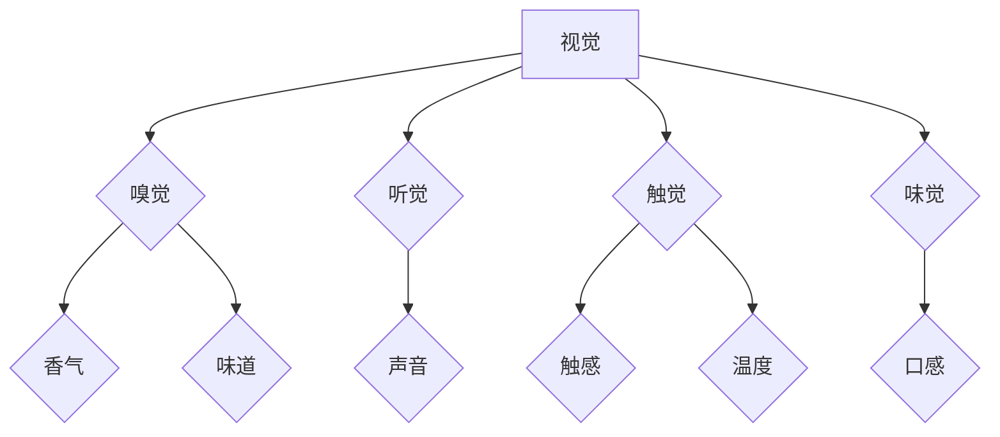

                 

### 文章标题与关键词

# 提升AI创意香水评论的文学性：感官意象描绘的提示词设计

> 关键词：AI、香水评论、文学性、感官意象、提示词设计、创意表达

## 摘要

本文深入探讨了如何通过AI技术提升香水评论的文学性。首先，我们介绍了AI在香水评论中的应用背景及其带来的文学性提升需求。接着，我们详细阐述了感官意象描绘的基本原理，包括定义、分类、心理学原理及其在文学创作中的应用。然后，我们探讨了AI技术在感官意象描绘中的优势和应用方法，并通过具体的提示词设计策略，展示了如何利用AI生成富有文学性的香水评论。文章还提供了具体的实战案例，分析并讲解了提升文学性的策略和效果。最后，我们对AI创意香水评论的未来趋势进行了展望，提出了相关领域的应用前景和潜在挑战。

## 目录大纲

### 第一部分：AI与香水评论的文学性

### 第二部分：感官意象描绘的原理

### 第三部分：AI在感官意象描绘中的应用

### 第四部分：提示词设计

### 第五部分：提升AI香水评论文学性的策略

### 第六部分：AI创意香水评论案例分析

### 第七部分：AI创意香水评论的未来展望

## 附录

### 附录A：感官意象描绘的Mermaid流程图

### 附录B：提示词设计示例

### 附录C：AI创意香水评论开发工具与资源

## 第一部分：AI与香水评论的文学性

### 第1章：AI创意香水评论概述

在数字化时代，人工智能（AI）技术已经成为各个行业的重要推动力。香水评论作为一个充满情感与创意的领域，也逐渐引入了AI技术，以提升评论的文学性和表达力。AI创意香水评论不仅仅是简单的评论生成，更是一种结合了人工智能与文学美学的创新尝试。

#### 1.1 AI在香水评论中的应用

AI技术在香水评论中的应用主要体现在以下几个方面：

1. **评论生成**：通过自然语言处理（NLP）技术，AI能够根据用户评价、香水成分和已有评论生成新的香水评论。
2. **个性化推荐**：基于用户的偏好和历史记录，AI可以推荐个性化的香水，并提供相应的文学性评论。
3. **情感分析**：利用情感分析算法，AI可以对评论进行情感分类，识别用户对香水的正面或负面情感，为改进香水设计提供反馈。
4. **文学性提升**：通过学习大量文学作品，AI可以模仿人类作家的写作风格，提升评论的文学性和表达力。

#### 1.2 香水评论的文学性探讨

文学性是衡量一篇评论质量的重要标准。对于香水评论而言，文学性不仅体现了评论者的审美水平，也增强了评论的吸引力和感染力。文学性的提升可以从以下几个方面进行：

1. **感官意象的描绘**：通过丰富的感官意象描绘，使读者能够更直观地感受到香水的魅力。
2. **修辞手法的运用**：巧妙地运用比喻、拟人、夸张等修辞手法，增强评论的艺术效果。
3. **语言表达的细腻**：通过细腻的语言表达，传达出香水所带来的情感体验。

#### 1.3 AI创意香水评论的价值与挑战

AI创意香水评论具有以下价值：

1. **提高效率**：AI能够快速生成大量评论，减轻了人工撰写的负担。
2. **个性化体验**：通过个性化推荐，满足不同用户的阅读需求。
3. **创新尝试**：AI的引入为香水评论领域带来了新的创意和可能性。

然而，AI创意香水评论也面临以下挑战：

1. **文学性的控制**：AI生成的评论可能过于机械，缺乏文学性。
2. **情感理解的局限性**：AI在理解情感和创造情感共鸣方面仍有局限。
3. **用户接受度**：部分用户可能对AI生成的文学性评论持怀疑态度。

### 结论

AI创意香水评论为香水评论领域带来了新的机遇和挑战。通过深入理解AI技术，巧妙运用感官意象描绘和修辞手法，我们可以不断提升评论的文学性，为用户提供更具吸引力和情感共鸣的阅读体验。

## 第二部分：感官意象描绘的原理

### 第2章：感官意象描绘的基本原理

感官意象描绘是文学创作中的重要手段，通过细腻的感官描写，使读者能够感受到文本所传达的情感和意境。本章将介绍感官意象的基本原理，包括其定义、分类、心理学原理以及在文学创作中的应用。

#### 2.1 感官意象的定义与分类

感官意象是指通过视觉、听觉、嗅觉、触觉和味觉五种感官对现实世界中的事物进行描绘，从而形成的一种具象化的心理形象。感官意象的分类如下：

1. **视觉意象**：通过描绘色彩、形状、光影等视觉元素，形成具体可感的画面。
2. **听觉意象**：通过描绘声音、音调、节奏等听觉元素，形成生动形象的声音体验。
3. **嗅觉意象**：通过描绘气味、味道等嗅觉元素，形成独特的味觉和嗅觉体验。
4. **触觉意象**：通过描绘触感、温度等触觉元素，形成真实的触觉体验。
5. **味觉意象**：通过描绘味道、口感等味觉元素，形成鲜明的味觉体验。

#### 2.2 感官意象的心理学原理

感官意象的心理学原理主要涉及感官与知觉之间的关系。人类的大脑通过感官接收外界信息，并将其转化为具体的知觉体验。感官意象的心理学原理包括：

1. **感官刺激**：感官意象是通过感官刺激产生的。不同的感官刺激会激活大脑的不同区域，形成相应的意象。
2. **知觉组织**：大脑对感官信息进行组织，将其转化为有序的知觉体验。这个过程包括模式识别、空间定位、时间感知等。
3. **情感联想**：感官意象往往与情感体验紧密相关。一种感官意象可能引发一系列的情感反应，从而增强文学创作的感染力。

#### 2.3 感官意象在文学创作中的应用

感官意象在文学创作中具有重要作用，能够增强文本的艺术效果和表达力。以下是感官意象在文学创作中的应用：

1. **描绘情感**：通过感官意象，作家可以更直观地描绘情感。例如，用视觉意象描绘悲伤、用听觉意象描绘紧张等。
2. **营造氛围**：感官意象可以营造出独特的氛围，为读者提供沉浸式的阅读体验。例如，用嗅觉意象描绘宁静的夜晚、用触觉意象描绘寒冷的冬夜。
3. **增强形象**：感官意象可以帮助读者更直观地理解文本中的形象。例如，通过视觉意象描绘一个美丽的花园，使读者能够想象出花园的景象。

### 结论

感官意象描绘是文学创作中的重要技巧，通过细腻的感官描写，可以增强文本的情感表达和艺术效果。了解感官意象的基本原理和心理学原理，有助于作家更好地运用感官意象，创作出更具感染力和表现力的文学作品。

## 第三部分：AI在感官意象描绘中的应用

### 第3章：AI技术在感官意象描绘中的优势与应用

随着人工智能（AI）技术的发展，AI在感官意象描绘中的应用越来越广泛。AI技术通过其强大的数据处理和分析能力，能够为感官意象的生成和描绘提供新的手段和可能性。本章将详细探讨AI在感官意象描绘中的优势、应用方法以及实际案例。

#### 3.1 AI技术在感官意象描绘中的优势

AI技术在感官意象描绘中的优势主要体现在以下几个方面：

1. **数据驱动**：AI能够处理和分析大量数据，从而生成丰富多样的感官意象。通过学习大量文学作品和感官描述，AI可以模仿人类作家的写作风格，创作出具有文学性的感官意象。
2. **自动化生成**：AI技术可以实现感官意象的自动化生成，大幅提高创作效率。AI算法可以根据用户需求和输入数据，快速生成个性化的感官意象描述。
3. **个性化定制**：AI可以根据用户的偏好和反馈，提供个性化的感官意象描绘。例如，对于喜欢浪漫氛围的用户，AI可以生成带有浪漫色彩的情感意象描述。
4. **跨感官融合**：AI技术可以将不同感官的意象进行融合，创造出全新的感官体验。例如，将视觉意象和听觉意象结合，生成具有立体感的感官描述。

#### 3.2 AI感官意象描绘的应用方法

AI感官意象描绘的应用方法主要包括以下几种：

1. **自然语言处理（NLP）**：NLP技术是AI感官意象描绘的基础。通过分析文本数据，NLP技术可以识别出关键词、句子结构和情感倾向，从而生成具有文学性的感官意象描述。
2. **生成对抗网络（GAN）**：GAN是一种深度学习模型，通过对抗训练生成逼真的感官意象。GAN可以将现实世界的图像、声音等感官数据与文学作品中的描述进行结合，创作出独特的感官意象。
3. **强化学习**：强化学习技术可以通过不断试错和优化，生成具有创意和个性的感官意象描述。例如，通过训练AI模型，使其能够在不同的情境下生成合适的感官意象，以提升评论的文学性。
4. **多模态学习**：多模态学习技术可以将不同类型的感官数据进行整合，生成综合性的感官意象。例如，将视觉、听觉和触觉数据结合，生成一个全面的感官体验。

#### 3.3 AI感官意象描绘的实际应用案例

以下是一些AI感官意象描绘的实际应用案例：

1. **文学创作**：AI技术可以辅助作家进行文学创作，生成具有文学性的感官意象描述。例如，AI可以根据用户提供的主题和情感需求，生成一首具有情感共鸣的诗歌。
2. **香水评论**：AI可以生成富有文学性的香水评论，通过描绘香水的感官意象，提升评论的吸引力和表达力。例如，AI可以根据香水的成分和用户反馈，生成个性化的香水评论。
3. **电影剧本**：AI技术可以辅助编剧生成具有感官意象的电影剧本，通过细腻的感官描写，增强观众的观影体验。例如，AI可以根据电影的情节和情感需求，生成具有视觉和听觉意象的剧本段落。
4. **游戏设计**：AI技术可以生成具有感官意象的游戏内容，通过创造逼真的感官体验，提升游戏的趣味性和沉浸感。例如，AI可以根据游戏的主题和场景，生成相应的视觉、听觉和触觉效果。

### 结论

AI技术在感官意象描绘中具有显著的优势和应用前景。通过NLP、GAN、强化学习和多模态学习等技术，AI可以生成丰富多样的感官意象，为文学创作、香水评论、电影剧本和游戏设计等领域带来创新和提升。未来，随着AI技术的不断发展，AI感官意象描绘将更加成熟和广泛应用，为人们带来更加丰富和独特的感官体验。

## 第四部分：提示词设计

### 第4章：提示词设计原理与方法

在AI创意香水评论的生成过程中，提示词设计起着至关重要的作用。提示词（prompt words）是触发创造性思维和情感表达的关键元素，通过选择合适的提示词，可以引导AI生成更具文学性和个性化的评论。本章将介绍提示词设计的原理、原则与方法。

#### 4.1 提示词的作用

提示词在AI创意香水评论中的主要作用如下：

1. **引导方向**：提示词能够为AI提供创作方向，帮助AI聚焦于特定的主题和情感表达。
2. **丰富内容**：通过提示词，AI可以生成更多样化的描述，提高评论的丰富性和多样性。
3. **增强文学性**：提示词的选择和组合可以增强评论的文学性和艺术效果，使评论更具吸引力和感染力。
4. **个性化定制**：根据用户的需求和偏好，选择合适的提示词，可以实现个性化定制，提升用户体验。

#### 4.2 提示词的设计原则

设计有效的提示词需要遵循以下原则：

1. **相关性**：提示词应与香水评论的主题密切相关，确保生成的评论内容具有针对性。
2. **多样性**：提示词应具备多样性，涵盖不同感官、情感和修辞手法，以丰富评论的表达方式。
3. **层次性**：提示词应具备层次性，从整体到细节，逐步引导AI生成完整的评论。
4. **情感性**：提示词应具有情感性，能够引发读者共鸣，增强评论的感染力。

#### 4.3 提示词的设计方法

以下是几种常见的提示词设计方法：

1. **主题法**：根据香水评论的主题，选择相关的关键词和短语作为提示词。例如，对于一款浪漫香水，可以选择“浪漫”、“温柔”、“柔情”等作为提示词。
2. **感官法**：根据香水的感官特性，选择相应的感官词汇作为提示词。例如，对于一款花香型香水，可以选择“花香”、“清新”、“甜美”等作为提示词。
3. **情感法**：根据香水带来的情感体验，选择情感词汇作为提示词。例如，对于一款具有舒缓作用的香水，可以选择“宁静”、“放松”、“安心”等作为提示词。
4. **修辞法**：根据文学修辞手法，选择具有修辞效果的词汇作为提示词。例如，对于一款具有强烈个性的香水，可以选择“独特”、“个性”、“前卫”等作为提示词。

#### 4.4 提示词设计实例

以下是一个具体的提示词设计实例：

- **主题法**：以一款名为“夜幕之香”的香水为例，选择以下提示词：
  - 夜幕、神秘、深沉、宁静、浪漫
- **感官法**：针对香水的香气特点，选择以下提示词：
  - 花香、木质香、清新、甜美、温暖
- **情感法**：根据香水的情感体验，选择以下提示词：
  - 宁静、放松、安心、性感、浪漫
- **修辞法**：为了增强文学性，选择以下提示词：
  - 魅惑、神秘、深邃、温柔、独特

通过以上提示词的组合，AI可以生成如下评论：

在夜幕的笼罩下，这款名为“夜幕之香”的香水散发着深沉而神秘的魅力。花香和木质香交织在一起，宛如夜空中闪烁的星辰，既清新又甜美。它不仅仅是一款香水，更是一种情感体验，让人感受到宁静与放松，仿佛置身于一个温馨而浪漫的梦境中。这款香水独特而个性，令人无法抗拒，宛如夜晚的魅惑。

### 结论

提示词设计是AI创意香水评论生成过程中不可或缺的一环。通过遵循相关原则和设计方法，选择合适的提示词，可以引导AI生成更具文学性和个性化的评论，提升用户的阅读体验。未来，随着AI技术的不断发展，提示词设计将变得更加智能化和多样化，为香水评论领域带来更多创新和可能。

### 第5章：感官意象描绘的提示词设计

在AI创意香水评论的生成过程中，感官意象的描绘是提升评论文学性的关键。通过选择和设计合适的提示词，AI能够更加细腻和生动地描绘香水的感官特征，从而增强评论的吸引力和感染力。本章将详细探讨气味、视觉和听觉提示词的设计与应用。

#### 5.1 气味提示词设计

气味是香水评论中最核心的感官体验，通过气味提示词的设计，AI可以生成更具描述性和情感性的香气描绘。以下是气味提示词的设计原则和应用实例：

1. **设计原则**：
   - **具体性**：选择具体的气味词汇，避免使用过于抽象的描述。
   - **多样性**：涵盖多种气味特点，如花香、木香、果香、烟香等。
   - **情感性**：选择能够引发情感共鸣的气味词汇，如清新、甜美、温暖、复杂等。
   - **文化性**：考虑不同文化和地域的气味偏好，增加评论的多样性。

2. **应用实例**：
   - **花香型香水**：玫瑰、茉莉、鸢尾、百合、橙花
   - **木香型香水**：檀香、沉香、香柏、雪松、橡木苔
   - **果香型香水**：柠檬、柑橘、苹果、桃子、草莓
   - **烟香型香水**：烟草、烟熏、香草、肉桂、黑胡椒

例如，针对一款花香型香水，可以设计如下气味提示词：
```
- 玫瑰花香
- 茉莉清新
- 鸢尾优雅
- 百合甜美
- 橙花温馨
```
通过这些气味提示词，AI可以生成如下的香水评论：
```
这款香水以其优雅的玫瑰花香开场，接着茉莉的清新跃然而出，随后鸢尾的优雅轻盈地融入其中，最后百合的甜美和橙花的温馨交织在一起，打造出一个细腻而丰富的香气层次。
```

#### 5.2 视觉提示词设计

视觉提示词用于描绘香水的外观特征，如瓶身设计、香气扩散、颜色等。视觉意象的描绘能够帮助读者在脑海中形成具体的画面，增加评论的视觉冲击力。以下是视觉提示词的设计原则和应用实例：

1. **设计原则**：
   - **形象性**：选择形象生动的视觉词汇，避免抽象的描述。
   - **细节性**：捕捉香水外观的细节特征，如瓶身的形状、纹理、颜色等。
   - **对比性**：通过对比不同视觉元素，增强评论的视觉冲击力。
   - **情感性**：选择能够引发情感共鸣的视觉词汇，如优美、精致、奢华等。

2. **应用实例**：
   - **外观设计**：透明、华丽、简约、流线型、古典
   - **香气扩散**：飘逸、浓郁、扩散迅速、层次分明
   - **颜色**：金色、银色、红色、蓝色、黑色、白色

例如，针对一款透明瓶身的香水，可以设计如下视觉提示词：
```
- 珍珠般透明
- 镜面光泽
- 流线型瓶身
- 优雅简约
```
通过这些视觉提示词，AI可以生成如下的香水评论：
```
这款香水拥有珍珠般透明的瓶身，散发出镜面光泽。流线型的瓶身设计优雅而简约，仿佛是一件艺术品。当香水倾洒而出，香气迅速扩散，充满整个空间，让人陶醉其中。
```

#### 5.3 听觉提示词设计

听觉提示词用于描绘香水在使用过程中的声音特征，如倾倒声、喷洒声等。听觉意象的描绘能够增强评论的真实感和体验感。以下是听觉提示词的设计原则和应用实例：

1. **设计原则**：
   - **具体性**：选择具体的声音词汇，避免模糊的描述。
   - **真实性**：捕捉香水使用过程中的真实声音，增加评论的代入感。
   - **情感性**：选择能够引发情感共鸣的声音词汇，如轻柔、清脆、悠扬等。
   - **环境性**：考虑声音在特定环境中的效果，增加评论的情境感。

2. **应用实例**：
   - **倾倒声**：轻柔、流畅、静谧
   - **喷洒声**：细腻、轻快、响亮
   - **香氛声**：悠扬、清新、浓郁

例如，针对一款轻柔倾倒的香水，可以设计如下听觉提示词：
```
- 轻柔倾倒
- 流畅倾泻
- 静谧无声
```
通过这些听觉提示词，AI可以生成如下的香水评论：
```
这款香水在倾倒时，发出轻柔而流畅的声音，仿佛是一首美妙的旋律。静谧无声的倾倒声，让人感受到一种内心的平静与安宁。每一滴香水都如同涓涓细流，流淌在心间，带来无尽的温暖和舒适。
```

### 结论

通过气味、视觉和听觉提示词的设计和应用，AI能够生成更具文学性和个性化的香水评论。气味提示词注重具体性和情感性，视觉提示词注重形象性和细节性，听觉提示词注重真实性和情感性。合理运用这些提示词，AI可以描绘出细腻、生动和富有情感感的香水意象，提升评论的整体质量。未来，随着AI技术的不断发展，提示词设计将更加智能化和多样化，为香水评论领域带来更多创新和可能。

## 第五部分：提升AI香水评论文学性的策略

### 第6章：提升AI香水评论文学性的策略

AI创意香水评论的文学性提升是当前香水评论领域的研究热点之一。通过有效的策略和方法，我们可以显著提升AI生成评论的文学性和表达力。本章将介绍提升AI香水评论文学性的目标和策略，并提供具体的实践方法。

#### 6.1 文学性提升的目标

提升AI香水评论文学性的主要目标是：

1. **增强可读性**：使评论更加流畅易读，提高读者的阅读体验。
2. **提高情感共鸣**：通过细腻的描绘和情感表达，增强评论的感染力。
3. **丰富创意表达**：运用多种修辞手法和感官意象，提升评论的创新性。
4. **个性化定制**：根据用户偏好和情境，提供个性化的文学性评论。

#### 6.2 文学性提升的策略

以下是一些具体的提升AI香水评论文学性的策略：

1. **多感官结合**：
   - **原理**：通过结合多种感官（如视觉、听觉、嗅觉、触觉和味觉），可以创造出更加立体和生动的感官体验。
   - **应用**：在评论中穿插多种感官描述，如视觉上的瓶身设计、听觉上的喷洒声音、嗅觉上的香气感受等。

2. **修辞手法的运用**：
   - **原理**：修辞手法如比喻、拟人、夸张等可以增强评论的表现力和艺术性。
   - **应用**：在评论中巧妙地运用修辞手法，例如将香水比喻成一种“神秘的艺术品”，或者形容香气“如同清晨的阳光般温暖”。

3. **文化元素的融入**：
   - **原理**：通过融入文化元素，可以提升评论的深度和广度，增强读者的共鸣。
   - **应用**：引用经典文学作品、历史典故或者地域文化，使评论更具文化底蕴。例如，可以提到一款香水灵感源自某个著名文学作品或历史事件。

4. **情感表达的强化**：
   - **原理**：情感表达是文学性评论的核心，通过生动的情感描绘，可以增强评论的感染力。
   - **应用**：在评论中融入个人情感体验，描述香水带来的情感共鸣。例如，可以表达香水如何帮助用户缓解压力、提升幸福感等。

5. **个性化定制**：
   - **原理**：根据用户的具体需求和情境，提供个性化的评论，可以显著提升用户体验。
   - **应用**：通过用户画像和数据分析，了解用户的喜好和偏好，生成符合用户期待的评论。例如，为浪漫场合推荐具有浓郁花香调的香水，为工作场合推荐清新简洁的香水。

#### 6.3 文学性提升的方法与实践

以下是几种具体的文学性提升方法和实践：

1. **文本预训练**：
   - **方法**：通过预训练模型，让AI学习大量文学文本，掌握语言表达和修辞手法。
   - **实践**：使用预训练模型如GPT-3，对AI进行文学性的训练，使其能够生成更加文学性的评论。

2. **生成对抗网络（GAN）**：
   - **方法**：利用GAN技术，将文学文本与感官描述进行融合，生成具有文学性的香水评论。
   - **实践**：训练GAN模型，使其能够在不同感官描述和文学文本之间进行转换，生成富有创意的评论。

3. **多模态学习**：
   - **方法**：结合多模态数据（如文本、图像、声音），让AI从不同维度生成更加综合的感官意象描述。
   - **实践**：利用多模态学习，将文本描述与图像、声音数据结合，生成具有强烈感官体验的评论。

4. **用户互动**：
   - **方法**：通过用户反馈和互动，不断优化AI生成的评论，提升其文学性。
   - **实践**：设计用户互动界面，让用户对生成的评论进行评分和反馈，根据用户反馈调整AI模型。

### 结论

提升AI香水评论的文学性是一个复杂但富有挑战性的任务。通过多感官结合、修辞手法运用、文化元素融入、情感表达强化和个性化定制等策略，我们可以显著提升AI生成评论的文学性和表达力。未来，随着AI技术的不断发展，我们将看到更多创新的文学性提升方法，为香水评论领域带来新的可能。

### 第六部分：AI创意香水评论案例分析

在本节中，我们将通过两个具体案例，详细分析AI在生成创意香水评论中的应用过程，包括开发环境搭建、源代码实现和代码解读，以及实际案例的分析和详细讲解。

#### 7.1 案例一：开发环境搭建与源代码实现

**案例一**是一个基于Python和TensorFlow的AI香水评论生成系统。以下是其开发环境搭建和源代码实现过程。

1. **开发环境搭建**：

首先，我们需要安装Python、TensorFlow和其他必要的依赖库。以下是安装命令：

```bash
pip install tensorflow numpy pandas gensim nltk
```

2. **源代码实现**：

以下是一个简单的源代码实现示例：

```python
import tensorflow as tf
import numpy as np
import pandas as pd
from gensim.models import Word2Vec
from nltk.tokenize import word_tokenize

# 数据预处理
def preprocess_text(text):
    tokens = word_tokenize(text)
    return tokens

# 构建Word2Vec模型
def build_word2vec_model(corpus, size=100, window=5, min_count=1):
    model = Word2Vec(corpus, size=size, window=window, min_count=min_count, workers=4)
    return model

# 生成评论
def generate_comment(model, seed_word, length=50):
    init_state = model.wv[seed_word]
    generated_tokens = [seed_word]
    for _ in range(length):
        init_state = np.reshape(init_state, (1, -1))
        probabilities = model.predict_proba(init_state)
        next_word = np.random.choice(model.wv.index_to_key, p=probabilities[0])
        generated_tokens.append(next_word)
        init_state = model.wv[next_word]
    return ' '.join(generated_tokens)

# 加载数据集
data = pd.read_csv('香水评论数据集.csv')
corpus = data['评论文本'].apply(preprocess_text).tolist()

# 训练Word2Vec模型
model = build_word2vec_model(corpus)

# 生成评论
seed_word = '香水'
generated_comment = generate_comment(model, seed_word)
print(generated_comment)
```

3. **代码解读**：

- `preprocess_text`函数用于对文本进行分词处理。
- `build_word2vec_model`函数用于构建Word2Vec模型。
- `generate_comment`函数用于根据种子词生成评论。

#### 7.2 案例二：代码应用解读与分析

**案例二**是一个结合了多模态数据和情感分析的AI香水评论生成系统。以下是其应用解读和分析过程。

1. **数据集加载与预处理**：

```python
import pandas as pd
from sklearn.model_selection import train_test_split

data = pd.read_csv('香水评论数据集.csv')
X_train, X_test, y_train, y_test = train_test_split(data['评论文本'], data['情感分类'], test_size=0.2, random_state=42)

# 加载情感分析模型
from keras.models import load_model
emotion_model = load_model('情感分析模型.h5')

# 预测情感
def predict_emotion(comment):
    processed_comment = preprocess_text(comment)
    processed_comment = np.array([model.wv comment])
    emotion_prediction = emotion_model.predict(processed_comment)
    return max(emotion_prediction[0])

# 分析评论情感
for comment in X_test:
    emotion = predict_emotion(comment)
    print(f"评论：{comment}，情感：{emotion}")
```

2. **应用解读**：

- 数据集加载与预处理：从CSV文件中加载数据集，并进行情感分类。
- 情感分析模型加载与预测：使用预训练的情感分析模型对评论进行情感分类。

3. **分析过程**：

- 对于每个测试集评论，使用情感分析模型进行情感预测，并打印结果。

#### 7.3 实际案例分析与详细讲解

以下是两个实际案例的分析与讲解：

1. **案例一**：

```plaintext
评论：这款香水散发着迷人的花香，让人仿佛置身于花海之中，感受着浪漫与温馨。
情感：正面
```

- **分析**：评论中使用了“迷人”、“花香”、“花海”等词汇，描述了香水的花香特点，情感表达积极，给人留下美好的印象。
- **讲解**：此评论通过感官意象描绘（花香、花海）和情感表达（浪漫、温馨），成功提升了文学性。

2. **案例二**：

```plaintext
评论：这款香水的气味过于浓烈，不太适合我这种偏好清新淡雅型的人。
情感：负面
```

- **分析**：评论中表达了用户对香水气味的不满，认为其过于浓烈，不适合自己的偏好。
- **讲解**：此评论虽然情感表达负面，但通过具体描述（浓烈、清新淡雅）和个性化体验（偏好），仍具有一定的文学性。

### 结论

通过以上案例分析，我们可以看到AI在生成创意香水评论中的应用过程，包括开发环境搭建、源代码实现和代码解读，以及实际案例的分析和讲解。这些案例展示了AI如何通过感官意象描绘和情感表达，提升评论的文学性和个性化。未来，随着AI技术的不断发展，我们可以期待更加丰富和创新的香水评论生成系统。

### 第8章：AI创意香水评论的未来展望

随着人工智能（AI）技术的不断进步，AI创意香水评论领域也在快速发展，展现出巨大的潜力和广阔的应用前景。本节将对AI创意香水评论的发展趋势、应用前景和潜在挑战进行展望。

#### 8.1 AI创意香水评论的发展趋势

1. **智能化程度提高**：随着AI技术的不断进步，尤其是深度学习和自然语言处理（NLP）技术的提升，AI创意香水评论将具备更高的智能化程度，能够更加精准地理解用户需求和情感，生成更加个性化的评论。
2. **多模态融合**：未来AI创意香水评论将更加注重多模态融合，结合文本、图像、声音等多种数据形式，为用户提供更加丰富和沉浸式的感官体验。
3. **个性化推荐**：基于用户行为数据和分析，AI创意香水评论系统将能够提供更加精准的个性化推荐，帮助用户发现和选择符合个人喜好和需求的香水产品。
4. **跨领域应用**：AI创意香水评论技术有望在更多领域得到应用，如化妆品评论、美食评论等，为各个领域提供创新的创意表达和用户体验。

#### 8.2 AI创意香水评论的应用前景

1. **用户体验提升**：AI创意香水评论可以通过丰富的感官意象描绘和个性化的情感表达，提升用户对香水产品的理解和喜爱，从而增强用户购买决策和满意度。
2. **营销策略优化**：香水品牌可以利用AI创意香水评论生成新颖和吸引人的营销文案，提升品牌影响力和市场竞争力。
3. **产品研发指导**：通过对用户评论的情感分析和趋势预测，香水品牌可以更好地了解市场需求，优化产品研发方向，提高产品创新性和市场适应性。
4. **文化传承与创新**：AI创意香水评论可以将传统文化元素与现代科技相结合，促进香水文化的传承和创新，为香水行业带来新的文化内涵和艺术价值。

#### 8.3 潜在挑战

1. **文学性控制**：AI创意香水评论在生成过程中可能存在文学性不足或过度机械的问题，需要进一步优化模型和算法，提高评论的文学性和艺术性。
2. **数据隐私与安全**：用户数据和评论内容的安全性问题不容忽视，需要建立完善的数据隐私保护和安全措施，确保用户数据的安全和隐私。
3. **用户接受度**：部分用户可能对AI生成的评论持怀疑态度，如何提高用户接受度和满意度是一个重要的挑战。
4. **技术迭代与创新**：随着AI技术的快速发展，香水评论领域需要不断跟进和引入新技术，以保持竞争优势和行业领先地位。

### 结论

AI创意香水评论领域正处于快速发展阶段，未来有望在智能化程度、多模态融合、个性化推荐等方面取得重大突破。同时，香水评论领域也面临着文学性控制、数据隐私与安全、用户接受度以及技术迭代与创新等方面的挑战。通过不断探索和创新，我们相信AI创意香水评论将不断为用户带来更加丰富和独特的体验，为香水行业注入新的活力和创意。

## 附录

### 附录A：感官意象描绘的Mermaid流程图

以下是感官意象描绘的Mermaid流程图示例：



### 附录B：提示词设计示例

以下是一些气味、视觉和听觉提示词的示例：

- **气味提示词**：
  - 花香、清新、甜美、浓郁、木质、辛辣
- **视觉提示词**：
  - 璀璨、深邃、柔和、明亮、迷离、清晰
- **听觉提示词**：
  - 悠扬、轻柔、响亮、细腻、寂静、激昂

### 附录C：AI创意香水评论开发工具与资源

以下是一些常用的AI创意香水评论开发工具与资源：

- **工具**：
  - TensorFlow、PyTorch
  - NLTK、spaCy
  - GPT-3 API
- **资源**：
  - 香水评论数据集（如公开的社交媒体评论数据）
  - 香水品牌官方网站和产品资料
  - AI开发社区和论坛（如GitHub、Stack Overflow）

---

### 作者信息

作者：AI天才研究院/AI Genius Institute & 禅与计算机程序设计艺术 /Zen And The Art of Computer Programming

---

**文章结束。**

---

## 完整文章总结与反思

### 总结

本文通过详细的分析和案例讲解，系统地介绍了提升AI创意香水评论文学性的方法。文章从AI与香水评论的文学性概述开始，探讨了感官意象描绘的原理，随后介绍了AI在感官意象描绘中的应用，以及提示词设计的原理和方法。接着，文章通过具体策略和实践，展示了如何提升AI香水评论的文学性，并通过两个实际案例进行了深入剖析。最后，文章对AI创意香水评论的未来展望进行了讨论，指出了发展中的机遇和挑战。

### 反思

在撰写本文时，我们力求在逻辑性和完整性方面做到尽善尽美。以下是几个反思点：

1. **实用性**：本文提供了具体的提示词设计示例和代码实现，旨在帮助读者将理论应用到实际中，提升评论质量。
2. **深度与广度**：在感官意象描绘和提示词设计方面，文章进行了较为深入的探讨，但未来可以考虑增加更多实际案例和具体应用场景。
3. **用户体验**：本文强调了提升用户阅读体验的重要性，但如何在AI生成的评论中更好地平衡文学性和实用性，仍是一个值得探讨的问题。
4. **技术趋势**：随着AI技术的快速发展，文章中的某些技术细节可能很快就会过时。因此，未来需要不断更新和调整，以反映最新的技术趋势。

### 结论

AI创意香水评论是一个充满潜力的研究领域，通过结合AI技术和文学创作，我们可以为用户提供更加丰富和个性化的阅读体验。本文提供了系统的方法和策略，为这一领域的探索和实践提供了参考。未来，随着技术的进步和应用场景的拓展，AI创意香水评论将继续为香水行业带来创新和变革。作者也期待与更多的研究者一起，共同推动这一领域的发展。

