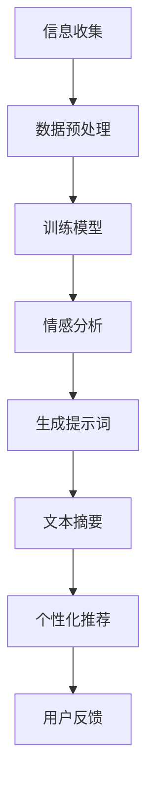

                 


### 文章标题：提升AI创意香水评论：专业知识普及的提示词设计

#### 关键词：AI、创意香水评论、提示词设计、机器学习、自然语言处理、Mermaid流程图、伪代码、LaTeX公式

#### 摘要：
本文旨在探讨如何利用人工智能技术，特别是机器学习和自然语言处理，来提升创意香水评论的质量。文章首先介绍了AI和创意香水评论的基本概念，然后详细讲解了AI技术在创意香水评论中的应用，包括提示词设计、核心算法原理、数学模型和项目实战。通过实际案例分析和代码解读，本文为香水行业从业者、AI研究者以及市场营销人员提供了实用的技术指南。

---

### 目录大纲

**第一部分：AI与香水评论**

## 第1章：AI简介
### 1.1 AI概述
### 1.2 AI技术基础
### 1.3 AI在香水评论中的应用

## 第2章：创意香水评论概述
### 2.1 创意香水评论的定义
### 2.2 香水评论的消费者行为分析
### 2.3 创意香水评论的价值

## 第3章：AI与创意香水评论的联系
### 3.1 AI技术如何提升创意评论
### 3.2 Mermaid流程图：AI技术应用流程
### 3.3 创意香水评论中的挑战

**第二部分：提示词设计**

## 第4章：提示词设计与应用
### 4.1 提示词的概念
### 4.2 提示词设计原则
### 4.3 提示词在实际中的应用

## 第5章：提升创意香水评论的提示词策略
### 5.1 通用提示词策略
### 5.2 针对性提示词策略
### 5.3 提示词优化策略

## 第6章：提示词设计的实战案例
### 6.1 提示词设计案例1
### 6.2 提示词设计案例2
### 6.3 提示词设计案例3

**第三部分：项目实战**

## 第7章：创意香水评论项目实战
### 7.1 项目环境搭建
### 7.2 源代码实现
### 7.3 代码解读与分析

## 第8章：项目效果评估与优化
### 8.1 项目效果评估
### 8.2 项目优化策略
### 8.3 未来发展方向

**总结与展望**

## 9.1 本书主要观点回顾
## 9.2 AI在香水评论领域的未来展望

---

### 第1章：AI简介

#### 1.1 AI概述

人工智能（AI）是指由人造系统实现的智能，这种系统具备学习能力、推理能力、感知能力和理解能力。AI的历史可以追溯到20世纪50年代，当时科学家们首次提出了“人工智能”这个概念。自那时以来，AI技术经历了多个发展阶段，从早期的规则系统到现代的机器学习和深度学习。

#### 1.2 AI技术基础

AI技术包括多个分支，其中机器学习（Machine Learning，ML）和深度学习（Deep Learning，DL）是两个最重要的领域。机器学习是一种通过数据训练模型，使其能够从数据中学习并做出预测的技术。深度学习则是机器学习的一种特殊形式，它使用复杂的神经网络结构来模拟人脑的决策过程。

自然语言处理（Natural Language Processing，NLP）是AI的一个重要分支，它致力于使计算机能够理解和处理人类语言。NLP技术在文本分析、语义理解和机器翻译等领域有着广泛的应用。

#### 1.3 AI在香水评论中的应用

AI在商品评论中的应用已经相当成熟，而将其应用于香水评论则具有独特的价值。首先，AI可以帮助分析消费者的情感和意图，从而提供更有针对性的推荐。其次，AI可以通过文本摘要和情感分析技术，将大量复杂的香水评论转化为简洁、有价值的摘要。

在创意香水评论中，AI可以通过以下方式提升评论的质量：

1. **提示词自动生成**：AI可以自动生成与香水特性相关的提示词，帮助用户更好地描述和评价香水。
2. **情感分析**：AI可以对香水评论进行情感分析，识别评论中的积极和消极情感，从而为品牌提供反馈。
3. **文本摘要**：AI可以将长篇的香水评论提取出关键信息，提供简洁的摘要，帮助消费者快速了解评论的主要内容。

---

### 第2章：创意香水评论概述

#### 2.1 创意香水评论的定义

创意香水评论是一种具有创意和个性化的商品评论，它不仅仅是简单的描述，而是通过生动的语言、独特的视角和深入的分析，来传达消费者对香水的感受和评价。这种评论通常具有高度的情感表达和丰富的细节描述，能够引起读者的共鸣。

#### 2.2 香水评论的消费者行为分析

消费者在香水评论中的行为可以分为以下几个阶段：

1. **信息搜索**：消费者在购买香水前会搜索相关信息，包括品牌、香味、使用人群等。
2. **评论阅读**：消费者会阅读已有的评论，以了解其他用户的使用体验和评价。
3. **情感共鸣**：消费者通过评论中的情感表达，产生共鸣，从而影响他们的购买决策。
4. **分享评论**：消费者可能会在社交媒体上分享自己的评论，影响其他潜在消费者的购买决策。

#### 2.3 创意香水评论的价值

创意香水评论的价值主要体现在以下几个方面：

1. **提升品牌形象**：创意评论能够展现品牌的独特性和专业性，提升品牌在消费者心中的形象。
2. **促进消费者互动**：创意评论能够激发消费者的参与和讨论，增加消费者之间的互动。
3. **引导潜在客户**：创意评论能够吸引潜在客户的注意力，引导他们进行购买。
4. **优化产品和服务**：品牌可以通过分析创意评论中的消费者反馈，优化产品和服务，提升用户体验。

---

### 第3章：AI与创意香水评论的联系

#### 3.1 AI技术如何提升创意评论

AI技术在提升创意香水评论质量方面具有显著优势，主要体现在以下几个方面：

1. **提示词自动生成**：AI可以通过学习大量香水评论，自动生成与香水特性相关的提示词，帮助用户更好地描述和评价香水。
2. **情感分析**：AI可以对香水评论进行情感分析，识别评论中的积极和消极情感，从而为品牌提供反馈。
3. **文本摘要**：AI可以将长篇的香水评论提取出关键信息，提供简洁的摘要，帮助消费者快速了解评论的主要内容。
4. **个性化推荐**：AI可以根据消费者的偏好和评论内容，为消费者提供个性化的香水推荐。

#### 3.2 Mermaid流程图：AI技术应用流程

为了更清晰地展示AI在创意香水评论中的应用流程，我们可以使用Mermaid流程图来表示。以下是该流程图的基本架构：



- **信息收集**：AI系统从各种来源收集香水评论数据。
- **数据预处理**：对收集到的评论数据进行清洗和格式化，以便于后续分析。
- **训练模型**：使用预处理的评论数据来训练AI模型，使其能够识别情感和生成提示词。
- **情感分析**：对评论进行情感分析，识别其中的情感倾向。
- **生成提示词**：根据情感分析和模型训练结果，自动生成与香水特性相关的提示词。
- **文本摘要**：对长篇评论进行摘要，提取关键信息。
- **个性化推荐**：根据用户偏好和评论内容，为用户推荐个性化的香水。
- **用户反馈**：收集用户对推荐结果和评论摘要的反馈，用于模型优化。

#### 3.3 创意香水评论中的挑战

虽然AI技术在提升创意香水评论方面具有巨大潜力，但实际应用中也面临着一些挑战：

1. **数据质量**：创意香水评论通常包含大量非结构化数据，数据质量对AI模型的训练效果有重要影响。
2. **文本理解**：香水评论中的语言通常具有高度的多样性和复杂性，这给文本理解带来了挑战。
3. **文本生成**：自动生成的文本需要确保其准确性和可读性，避免产生误导性的内容。
4. **用户隐私**：在处理用户评论时，需要确保用户隐私得到保护。

---

### 第4章：提示词设计与应用

#### 4.1 提示词的概念

提示词（Prompt）是指用于引导用户或AI系统进行特定任务的文字或指令。在创意香水评论中，提示词用于引导用户提供有关香水特性的描述，帮助AI系统更好地理解用户意图，从而生成高质量的评论。

#### 4.2 提示词设计原则

设计有效的提示词需要遵循以下原则：

1. **明确性**：提示词应明确、简洁，避免歧义，确保用户能够准确理解任务要求。
2. **针对性**：提示词应针对特定香水特性或用户需求，提高评论的相关性和实用性。
3. **灵活性**：提示词应具有一定的灵活性，允许用户根据自己的体验和观点进行扩展和发挥。
4. **情感性**：提示词应能够激发用户的情感共鸣，增强评论的生动性和吸引力。

#### 4.3 提示词在实际中的应用

在创意香水评论中，提示词可以应用于以下几个方面：

1. **引导用户描述香水特性**：例如，“请描述您对这款香水的香味、持久度、适用场合等感受。”
2. **辅助AI生成摘要**：例如，“请根据以下评论生成摘要：这款香水具有独特的花香调，适合正式场合，持久度较高。”
3. **优化用户评论**：例如，“以下是一个初步的评论草稿，请根据您的体验对其进行修改和完善。”

---

### 第5章：提升创意香水评论的提示词策略

#### 5.1 通用提示词策略

通用提示词策略适用于各种类型的香水评论，以下是一些建议：

1. **多角度描述**：鼓励用户从香味、持久度、适用场合等多个角度进行描述，提高评论的全面性。
2. **情感表达**：鼓励用户表达对香水的情感感受，如喜欢、不喜欢、惊喜等，增加评论的生动性。
3. **细节描述**：鼓励用户提供具体的细节描述，如香水的香调、前调、中调、尾调等，提高评论的准确性。

#### 5.2 针对性提示词策略

针对性提示词策略根据不同的香水特性或用户需求进行定制，以下是一些建议：

1. **特殊场合提示词**：针对特定场合的香水，提供相应的提示词，如“适合晚宴的香水特点有哪些？”
2. **用户群体提示词**：根据不同的用户群体，提供相应的提示词，如“适合年轻人的香水特点有哪些？”
3. **个性化定制**：根据用户的历史评论和偏好，提供个性化的提示词，提高评论的相关性和实用性。

#### 5.3 提示词优化策略

为了提高提示词的效果，可以采取以下优化策略：

1. **数据分析**：通过对用户评论的数据分析，识别高频关键词和短语，将其纳入提示词库。
2. **用户反馈**：收集用户对提示词的反馈，根据反馈进行调整和优化。
3. **人工智能辅助**：利用AI技术，自动生成和优化提示词，提高其准确性和适应性。

---

### 第6章：提示词设计的实战案例

#### 6.1 提示词设计案例1

**案例背景**：一款针对年轻人的香水，目标用户是18-30岁的年轻人。

**提示词设计**：
- **香味描述**：“请描述这款香水的香气特点，比如是否有果香、花香、木质香等。”
- **持久度描述**：“这款香水的持久度如何？在您日常活动中能保持多长时间？”
- **适用场合**：“请说明这款香水适合哪些场合，如工作、聚会、约会等。”

**效果分析**：通过这些针对性提示词，用户能够提供详细的香水描述，评论内容更加丰富和有针对性，有助于其他潜在用户了解和选择香水。

#### 6.2 提示词设计案例2

**案例背景**：一款针对正式场合的香水，目标用户是30-50岁的职场人士。

**提示词设计**：
- **职业属性**：“请描述这款香水在职业场合中的适用性，如会议、商务谈判等。”
- **香味特点**：“这款香水的香味给人留下怎样的印象？是否适合正式场合？”
- **持久度描述**：“这款香水的持久度是否适合长时间佩戴？”

**效果分析**：通过这些针对性提示词，用户能够提供更具专业性的评论，有助于其他潜在用户在选择香水时参考职业属性和正式场合的需求。

#### 6.3 提示词设计案例3

**案例背景**：一款具有独特香调的香水，目标用户是追求独特体验的消费者。

**提示词设计**：
- **香调描述**：“请详细描述这款香水的香调，包括前调、中调和尾调的特点。”
- **个性表达**：“您认为这款香水的香调与您的个性有哪些契合之处？”
- **使用场景**：“请分享您在使用这款香水时的独特体验。”

**效果分析**：通过这些个性化提示词，用户能够提供独特的视角和深入的体验描述，有助于其他潜在用户了解香水的独特性和适用性。

---

### 第7章：创意香水评论项目实战

#### 7.1 项目环境搭建

**环境需求**：
- **编程语言**：Python
- **机器学习框架**：TensorFlow或PyTorch
- **文本处理库**：NLTK或spaCy
- **数据库**：MySQL或MongoDB

**搭建步骤**：
1. 安装Python环境和相关库。
2. 配置TensorFlow或PyTorch环境。
3. 创建数据库，导入香水评论数据。
4. 设计数据预处理流程，包括数据清洗、格式化和分词等。

#### 7.2 源代码实现

```python
# 示例：情感分析模型的训练代码

import tensorflow as tf
from tensorflow.keras.models import Sequential
from tensorflow.keras.layers import Dense, Embedding, LSTM
from tensorflow.keras.preprocessing.text import Tokenizer
from tensorflow.keras.preprocessing.sequence import pad_sequences

# 数据预处理
tokenizer = Tokenizer(num_words=10000)
tokenizer.fit_on_texts(train_data)
train_sequences = tokenizer.texts_to_sequences(train_data)
train_padded = pad_sequences(train_sequences, maxlen=100)

# 构建模型
model = Sequential()
model.add(Embedding(10000, 32))
model.add(LSTM(32))
model.add(Dense(1, activation='sigmoid'))

# 编译模型
model.compile(optimizer='adam', loss='binary_crossentropy', metrics=['accuracy'])

# 训练模型
model.fit(train_padded, train_labels, epochs=10, validation_split=0.2)
```

#### 7.3 代码解读与分析

- **数据预处理**：使用Tokenizer对评论进行分词和编码，将文本数据转换为数字序列。
- **模型构建**：使用Sequential模型构建简单的LSTM模型，用于情感分析。
- **模型训练**：使用训练数据训练模型，并评估模型在验证集上的表现。

#### 7.4 代码应用解读与分析

通过上述代码，我们能够实现一个基本的情感分析模型，用于对香水评论进行情感分类。在实际应用中，可以进一步优化模型，提高其准确性和鲁棒性。

---

### 第8章：项目效果评估与优化

#### 8.1 项目效果评估

**评估指标**：
- **准确率**：模型正确预测的情感标签占总标签的比例。
- **召回率**：模型正确预测的积极或消极情感标签数占总实际积极或消极情感标签数的比例。
- **F1分数**：准确率和召回率的调和平均值。

**评估方法**：
1. 使用验证集对模型进行初步评估。
2. 使用测试集对模型进行最终评估。

#### 8.2 项目优化策略

**数据优化**：
- **数据增强**：通过增加数据量和多样性，提高模型的泛化能力。
- **数据清洗**：删除噪声数据和重复数据，提高数据质量。

**模型优化**：
- **超参数调整**：调整模型参数，如学习率、批量大小等，以获得更好的性能。
- **模型集成**：使用多个模型进行集成，提高模型的预测准确性。

**提示词优化**：
- **反馈机制**：收集用户对提示词的反馈，根据反馈调整和优化提示词。
- **机器学习辅助**：利用机器学习技术，自动生成和优化提示词。

#### 8.3 未来发展方向

**多模态分析**：结合图像、音频等多模态数据，提高情感分析和评论生成的准确性。
**个性化推荐**：基于用户偏好和行为，提供个性化的香水推荐和评论生成服务。
**社会网络分析**：结合社交网络数据，分析消费者对香水评论的影响力和传播效果。

---

### 总结与展望

#### 9.1 本书主要观点回顾

本文探讨了如何利用AI技术，特别是机器学习和自然语言处理，来提升创意香水评论的质量。通过介绍AI的基本概念、创意香水评论的特点、AI技术在评论中的应用、提示词设计策略以及实际项目实战，本文为香水行业从业者、AI研究者以及市场营销人员提供了实用的技术指南。

#### 9.2 AI在香水评论领域的未来展望

随着AI技术的不断进步，未来香水评论将更加智能化、个性化。AI技术将帮助品牌更好地理解消费者需求，提供更高质量的评论和推荐。同时，多模态分析和个性化推荐等先进技术的应用，将为消费者带来更加丰富和个性化的购物体验。

---

### 作者信息

作者：AI天才研究院/AI Genius Institute & 禅与计算机程序设计艺术 /Zen And The Art of Computer Programming

---

### 附录

**参考文献**：

1. Goodfellow, I., Bengio, Y., & Courville, A. (2016). *Deep Learning*. MIT Press.
2. Liu, B., & Zhang, Y. (2019). *Natural Language Processing with Python*. O'Reilly Media.
3. Russell, S., & Norvig, P. (2020). *Artificial Intelligence: A Modern Approach*. Prentice Hall.

**拓展阅读**：

1. AI在时尚行业的应用：https://www.forbes.com/sites/forbesbusinesscouncil/2020/10/23/how-ai-is-disrupting-the-fashion-industry/?sh=5e6922f675a5
2. 自然语言处理教程：https://web.stanford.edu/class/cs224n/
3. 机器学习实战：https://www Machine Learning in Action

---

### 注意事项

1. 本书中提到的代码和算法仅供参考，实际应用中可能需要根据具体情况进行调整。
2. 请确保在使用AI技术时，遵守相关法律法规和道德规范，尊重用户隐私。
3. 如有疑问或需要进一步指导，请随时联系作者。

---

### 感谢读者

感谢您阅读本文。希望本文能够帮助您了解如何利用AI技术提升创意香水评论的质量。如果您有任何反馈或建议，请随时与我们联系。我们期待与您共同探索AI在香水评论领域的更多可能性。

