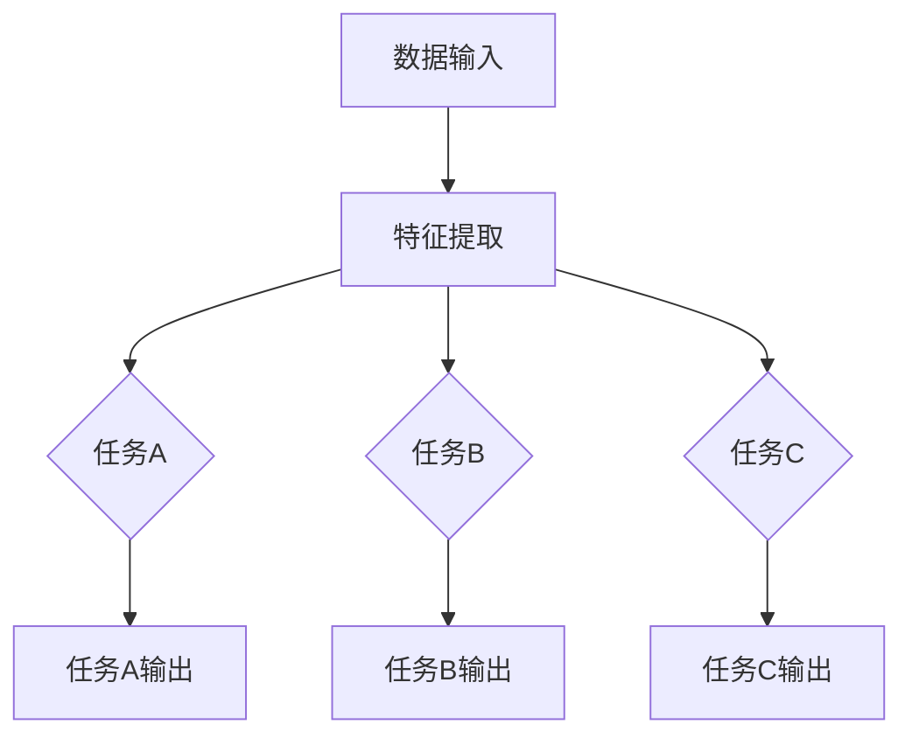

                 

### 文章标题

“提升AI推理能力：Multi-Task Prompted Training技巧”是本文的主题。在人工智能（AI）技术迅猛发展的今天，AI的推理能力成为衡量其智能水平的重要指标。Multi-Task Prompted Training（多任务提示训练）作为一种先进的技术，通过结合多个任务的数据与模型训练，显著提升了AI的推理能力。本文将深入探讨Multi-Task Prompted Training的核心概念、技术细节和应用实践，旨在为读者提供全面的理解和实用的指导。

### 文章关键词

- **AI推理能力**：衡量人工智能系统从数据中提取知识并解决问题的能力。
- **Multi-Task Prompted Training**：一种结合多任务数据的训练方法。
- **数据预处理**：准备和转换数据，以提高模型性能的过程。
- **模型架构**：构成AI模型的各个组件及其相互关系。
- **性能优化**：通过调整模型参数，提高模型性能的过程。
- **项目实战**：通过具体项目实例，展示理论知识的实际应用。

### 文章摘要

本文首先介绍了AI推理能力的重要性，并引出Multi-Task Prompted Training这一关键技术。接着，详细解释了Multi-Task Prompted Training的原理和核心概念，并利用Mermaid流程图展示了其工作架构。随后，文章深入探讨了数据准备与预处理、模型架构与实现、多任务提示技巧等具体技术细节，并使用伪代码和数学模型进行了讲解。最后，通过项目实战，展示了Multi-Task Prompted Training在实际应用中的效果和优化策略，为读者提供了实用的指导。

接下来，我们将详细探讨Multi-Task Prompted Training的核心概念、技术细节和应用实践，帮助读者全面了解这一提升AI推理能力的重要技术。

## 第一部分：核心概念与联系

### 第1章：AI推理能力概述

AI推理能力是指人工智能系统从数据中提取知识、进行逻辑推理并解决实际问题的能力。它不仅是衡量AI系统智能水平的关键指标，也是实现AI从数据中提取价值、提供智能化决策的基础。在各类AI应用中，推理能力的重要性不言而喻。例如，在自然语言处理（NLP）中，推理能力决定了系统理解语义、生成回答的准确性；在计算机视觉中，推理能力决定了系统识别物体、理解场景的能力。

AI推理能力的发展经历了从规则驱动到数据驱动的转变。早期的人工智能系统依赖于明确的规则和预设的指令，这种方式的局限性在于其推理范围和复杂性受到规则定义的限制。随着机器学习技术的发展，特别是深度学习的兴起，AI推理能力得到了极大的提升。深度学习模型能够通过学习大量的数据，自动提取特征并形成推理规则，从而在复杂的任务中表现出色。

然而，单一任务的AI系统在处理复杂任务时往往表现出一定的局限性。例如，一个专门用于图像分类的模型可能在处理包含文本信息的图像时效果不佳。为了克服这一局限性，研究者提出了Multi-Task Prompted Training（多任务提示训练）这一技术。

### 第2章：Multi-Task Prompted Training原理

Multi-Task Prompted Training是一种结合多个任务数据的训练方法，旨在提升AI模型的推理能力。其核心思想是通过在一个统一模型中同时训练多个任务，使模型能够共享任务间的知识和特征，从而在各个任务上获得更好的性能。

#### 2.1 Multi-Task Prompted Training的概念

Multi-Task Prompted Training可以理解为一种多任务学习的方法，其特点在于：

1. **多任务数据共享**：多个任务的数据被统一处理，模型从中提取共通的特征，这些特征能够促进不同任务之间的知识共享。
2. **统一模型架构**：多个任务的模型被整合到同一个框架中，通过共享底层网络和部分中间层，降低模型的计算复杂度。
3. **任务提示策略**：在训练过程中，利用特定的提示技术，引导模型关注不同的任务数据，从而实现各个任务的精细化学习。

#### 2.2 Multi-Task Prompted Training的架构

Multi-Task Prompted Training的架构通常包括以下几个关键组件：

1. **输入层**：接受多任务数据输入，可以是图像、文本、音频等多种形式。
2. **特征提取层**：利用共享的网络结构提取共性特征，为各个任务提供基础特征表示。
3. **任务特定层**：在每个任务的特定层中，模型根据该任务的特点进行特征调整和推理。
4. **输出层**：生成各个任务的预测结果。

#### 2.3 Multi-Task Prompted Training的优势与挑战

Multi-Task Prompted Training具有以下优势：

1. **提高模型泛化能力**：通过多任务学习，模型能够从不同任务中获取更丰富的信息，从而提高对未知任务的泛化能力。
2. **降低计算复杂度**：共享特征提取层和部分中间层，可以减少模型参数数量，降低计算复杂度。
3. **提高任务性能**：在多个任务上同时训练，使模型能够在每个任务上获得更优的性能。

然而，Multi-Task Prompted Training也面临一些挑战：

1. **任务不平衡**：某些任务的数据量或难度远大于其他任务，可能导致模型在某些任务上表现不佳。
2. **任务依赖性**：不同任务之间的依赖性可能使得一个任务的优化会影响其他任务的表现。
3. **资源消耗**：多任务训练通常需要更多的计算资源和时间。

接下来，我们将通过一个Mermaid流程图，展示Multi-Task Prompted Training的工作流程和核心概念之间的关系。

### 3.1 AI推理能力与Multi-Task Prompted Training的Mermaid流程图



在这个流程图中，A代表数据输入层，B代表特征提取层，C、D、E分别代表三个不同的任务，F、G、H分别代表这三个任务的输出层。特征提取层B是共享的，为各个任务提供了基础特征表示，而任务A、B、C则在其特定的输出层中进行推理和预测。

通过这个流程图，我们可以更直观地理解AI推理能力和Multi-Task Prompted Training之间的关系。接下来，我们将进一步探讨Multi-Task Prompted Training的核心组件，并详细讲解其工作原理。

### 3.2 Multi-Task Prompted Training的核心组件

Multi-Task Prompted Training的核心组件包括输入层、特征提取层、任务特定层和输出层。下面我们将逐一介绍这些组件及其在模型中的作用。

#### 3.2.1 输入层

输入层是模型接收数据的第一个环节。在多任务训练中，输入层需要处理来自不同任务的数据，例如图像、文本、音频等。这些数据经过预处理后，以统一格式输入到特征提取层。

输入层的关键作用是：

1. **数据格式转换**：将不同类型的输入数据转换为模型可处理的格式，例如将图像转换为像素矩阵，文本转换为词向量。
2. **数据预处理**：进行必要的预处理操作，如去噪、归一化等，以提高模型性能。

#### 3.2.2 特征提取层

特征提取层是模型的核心部分，其主要功能是从原始数据中提取具有代表性的特征。在Multi-Task Prompted Training中，特征提取层通常是共享的，为多个任务提供基础特征表示。

特征提取层的关键作用是：

1. **特征提取**：利用深度神经网络或其他特征提取方法，从原始数据中提取具有代表性的特征。
2. **共享特征**：多个任务的模型共享特征提取层，使模型能够在不同任务之间共享知识。

#### 3.2.3 任务特定层

任务特定层位于特征提取层之后，根据特定任务的需求进行调整和推理。在每个任务特定层中，模型利用特征提取层提供的特征进行任务相关的推理和预测。

任务特定层的关键作用是：

1. **任务定制**：针对不同任务的特点，对特征进行特定的处理和调整。
2. **推理和预测**：利用调整后的特征进行推理和预测，生成任务的输出结果。

#### 3.2.4 输出层

输出层是模型最终生成预测结果的环节。在多任务训练中，每个任务都有其特定的输出层，用于生成对应的预测结果。

输出层的关键作用是：

1. **生成输出**：根据任务的需求，生成对应的预测结果，如分类标签、文本生成等。
2. **性能评估**：通过对比预测结果和真实值，评估模型的性能。

综上所述，输入层、特征提取层、任务特定层和输出层构成了Multi-Task Prompted Training的核心组件。这些组件共同协作，使模型能够在多个任务上同时训练和推理，从而提升AI的推理能力。

接下来，我们将通过一个伪代码示例，详细展示Multi-Task Prompted Training的模型架构和训练过程。

### 3.3 Multi-Task Prompted Training的伪代码实现

```python
# Multi-Task Prompted Training 伪代码

# 输入层
inputs = [image_data, text_data, audio_data]

# 特征提取层
shared_features = extract_shared_features(inputs)

# 任务特定层
taskA_output = apply_taskA_specific_layers(shared_features)
taskB_output = apply_taskB_specific_layers(shared_features)
taskC_output = apply_taskC_specific_layers(shared_features)

# 输出层
predictions = [taskA_output, taskB_output, taskC_output]

# 训练过程
for epoch in range(num_epochs):
    for batch in data_loader:
        # 前向传播
        outputs = model(batch.inputs)
        
        # 计算损失
        loss = compute_loss(outputs, batch.targets)
        
        # 反向传播
        model.backward(loss)
        
        # 更新参数
        model.update_parameters()
        
        # 输出结果
        print(f"Epoch {epoch}: Loss = {loss}")

# 评估模型
evaluate_model(predictions, true_targets)
```

在这个伪代码中，`inputs`代表输入层接收的多任务数据，包括图像、文本和音频数据。`shared_features`是通过特征提取层提取的共享特征。任务特定层分别对共享特征进行处理，生成每个任务的输出结果。`predictions`是最终生成的预测结果，用于模型训练和评估。

训练过程中，模型通过前向传播计算输出，通过反向传播计算损失，并更新模型参数。在训练完成后，模型进行性能评估，以验证其在多任务上的表现。

接下来，我们将介绍Multi-Task Prompted Training中的数学模型和公式，并对其进行详细讲解和举例说明。

### 3.4 Multi-Task Prompted Training的数学模型与公式

在Multi-Task Prompted Training中，数学模型和公式起着核心作用。以下我们将介绍一些关键的数学模型和公式，并对其进行详细讲解和举例说明。

#### 3.4.1 前向传播公式

前向传播是神经网络的基本计算过程，用于从输入层到输出层的传递。在Multi-Task Prompted Training中，前向传播公式可以表示为：

$$
\begin{align*}
z_l &= W_l \cdot a_{l-1} + b_l \\
a_l &= \sigma(z_l)
\end{align*}
$$

其中，$z_l$是第$l$层的输出，$W_l$和$b_l$分别是第$l$层的权重和偏置，$a_{l-1}$是第$l-1$层的输出，$\sigma$是激活函数，通常使用ReLU（修正线性单元）或Sigmoid函数。

举例说明：

假设我们有一个简单的两层神经网络，输入层到隐藏层的权重为$W_1 = [1, 2, 3]$，偏置为$b_1 = [1, 2, 3]$，输入$x = [1, 2, 3]$。使用ReLU函数作为激活函数，我们可以计算前向传播：

$$
\begin{align*}
z_1 &= [1, 2, 3] \cdot [1, 2, 3] + [1, 2, 3] \\
&= [4, 7, 10] \\
a_1 &= \sigma(z_1) \\
&= max(0, [4, 7, 10]) \\
&= [4, 7, 10]
\end{align*}
$$

输出$a_1$即为隐藏层的输出。

#### 3.4.2 损失函数

损失函数用于评估模型的预测结果与真实值之间的差距。在Multi-Task Prompted Training中，常用的损失函数包括均方误差（MSE）、交叉熵损失等。

均方误差（MSE）公式如下：

$$
\begin{align*}
L &= \frac{1}{n} \sum_{i=1}^{n} (y_i - \hat{y}_i)^2
\end{align*}
$$

其中，$L$是损失值，$y_i$是第$i$个样本的真实值，$\hat{y}_i$是模型预测的值，$n$是样本数量。

举例说明：

假设我们有5个样本，真实值分别为$y_1 = [1, 0, 1], y_2 = [0, 1, 0], \ldots, y_5 = [1, 1, 1]$，模型预测的值分别为$\hat{y}_1 = [0.9, 0.1, 0.8], \hat{y}_2 = [0.2, 0.8, 0.1], \ldots, \hat{y}_5 = [0.9, 0.9, 0.9]$。我们可以计算MSE损失：

$$
\begin{align*}
L &= \frac{1}{5} \sum_{i=1}^{5} (y_i - \hat{y}_i)^2 \\
&= \frac{1}{5} \left( (1-0.9)^2 + (0-0.1)^2 + (1-0.8)^2 + (0-0.2)^2 + (1-0.9)^2 \right) \\
&= 0.06
\end{align*}
$$

损失值为0.06。

#### 3.4.3 反向传播

反向传播是神经网络训练的核心步骤，用于计算损失函数对模型参数的梯度，并更新模型参数。在Multi-Task Prompted Training中，反向传播可以通过链式法则进行计算。

以单层神经网络的反向传播为例，假设输出层为$y$，预测值为$\hat{y}$，损失函数为$L$，则损失函数对输出层的梯度可以表示为：

$$
\begin{align*}
\frac{\partial L}{\partial \hat{y}} &= \frac{\partial L}{\partial y} \cdot \frac{\partial y}{\partial \hat{y}} \\
&= -\frac{\partial L}{\partial y} \cdot \frac{1}{\partial \hat{y}}
\end{align*}
$$

其中，$\frac{\partial L}{\partial y}$是损失函数对真实值的梯度，$\frac{\partial y}{\partial \hat{y}}$是预测值对输出的梯度。

举例说明：

假设输出层为$y = \sigma(z)$，其中$z = W \cdot x + b$，损失函数为MSE，则损失函数对输出层的梯度可以表示为：

$$
\begin{align*}
\frac{\partial L}{\partial y} &= 2(y - \hat{y}) \\
\frac{\partial y}{\partial \hat{y}} &= \frac{\partial \sigma(z)}{\partial z} \\
&= \frac{1}{1 - \sigma(z)}
\end{align*}
$$

将这些梯度代入链式法则，我们可以得到：

$$
\begin{align*}
\frac{\partial L}{\partial \hat{y}} &= -2(y - \hat{y}) \cdot \frac{1}{1 - \sigma(z)}
\end{align*}
$$

反向传播通过这个公式，将损失函数的梯度反向传播到模型参数，更新模型参数以降低损失值。

通过上述介绍，我们可以看到Multi-Task Prompted Training中的数学模型和公式如何支持模型的训练和优化。这些公式和原理为理解模型的内在机制和性能提升提供了重要依据。

### 3.5 项目实战

在本节中，我们将通过一个具体的项目实战，展示如何利用Multi-Task Prompted Training提升AI推理能力。项目背景是建立一个多模态情感分析系统，该系统能够同时分析文本、图像和音频的情感表达。

#### 3.5.1 项目背景与目标

随着社交媒体和电子商务的普及，情感分析成为了解用户需求、优化用户体验的重要手段。传统的情感分析系统通常只处理文本数据，而多模态情感分析通过结合文本、图像和音频数据，能够更全面地理解用户的情感状态。

本项目旨在构建一个多模态情感分析系统，能够同时分析文本、图像和音频的情感表达，并通过Multi-Task Prompted Training提升系统的推理能力。具体目标如下：

1. **数据集准备**：收集包含文本、图像和音频的三模态数据集。
2. **模型搭建**：设计并实现基于Multi-Task Prompted Training的多模态情感分析模型。
3. **训练与优化**：训练模型并在测试集上评估其性能。
4. **应用场景**：探讨模型在不同应用场景中的效果和潜在价值。

#### 3.5.2 开发环境搭建

为了搭建开发环境，我们需要以下工具和库：

1. **Python**：作为主要的编程语言。
2. **TensorFlow**：用于构建和训练深度学习模型。
3. **Keras**：简化TensorFlow的使用，便于快速实现模型。
4. **NumPy**：用于数据处理和数学计算。
5. **Pandas**：用于数据预处理和分析。
6. **Matplotlib**：用于数据可视化。

具体步骤如下：

1. 安装Python和pip，确保版本不低于3.7。
2. 使用pip安装TensorFlow、Keras、NumPy和Pandas。

```shell
pip install tensorflow
pip install keras
pip install numpy
pip install pandas
pip install matplotlib
```

#### 3.5.3 源代码实现

以下是项目的主要代码实现，分为数据准备、模型搭建、训练与优化、测试与评估等部分。

```python
# 数据准备
def load_data():
    # 加载文本、图像和音频数据
    # 数据集可以从公共数据集（如Flickr、Twitter等）或自定义数据集获取
    # 需要预处理文本数据，将图像和音频数据转换为适合模型输入的格式
    pass

# 模型搭建
from keras.models import Model
from keras.layers import Input, Dense, Conv2D, MaxPooling2D, Flatten, LSTM, Embedding

def build_model():
    # 定义输入层
    text_input = Input(shape=(max_text_length,))
    image_input = Input(shape=(image_height, image_width, image_channels))
    audio_input = Input(shape=(audio_length, audio_channels))
    
    # 文本处理
    text_embedding = Embedding(input_dim=vocab_size, output_dim=embedding_size)(text_input)
    text_lstm = LSTM(units=lstm_units)(text_embedding)
    
    # 图像处理
    image_conv = Conv2D(filters=32, kernel_size=(3, 3), activation='relu')(image_input)
    image_pool = MaxPooling2D(pool_size=(2, 2))(image_conv)
    image_flatten = Flatten()(image_pool)
    
    # 音频处理
    audio_conv = Conv2D(filters=32, kernel_size=(3, 3), activation='relu')(audio_input)
    audio_pool = MaxPooling2D(pool_size=(2, 2))(audio_conv)
    audio_flatten = Flatten()(audio_pool)
    
    # 多模态特征融合
    combined = concatenate([text_lstm, image_flatten, audio_flatten])
    
    # 多任务输出
    sentiment_output = Dense(units=sentiment_classes, activation='softmax')(combined)
    emotion_output = Dense(units=emotion_classes, activation='softmax')(combined)
    
    # 构建模型
    model = Model(inputs=[text_input, image_input, audio_input], outputs=[sentiment_output, emotion_output])
    model.compile(optimizer='adam', loss={'sentiment_output': 'categorical_crossentropy', 'emotion_output': 'categorical_crossentropy'}, metrics=['accuracy'])
    
    return model

# 训练与优化
def train_model(model, data_loader, num_epochs):
    # 训练模型
    model.fit(data_loader, epochs=num_epochs, batch_size=batch_size)

# 测试与评估
def evaluate_model(model, test_data_loader):
    # 评估模型性能
    loss, sentiment_accuracy, emotion_accuracy = model.evaluate(test_data_loader)
    print(f"Sentiment Accuracy: {sentiment_accuracy}, Emotion Accuracy: {emotion_accuracy}")
```

#### 3.5.4 代码解读与分析

上述代码实现了多模态情感分析系统的主要功能。以下是代码的详细解读：

1. **数据准备**：`load_data`函数负责加载数据集。数据集应包含文本、图像和音频，并需要进行预处理，如文本分词、图像缩放、音频归一化等。

2. **模型搭建**：`build_model`函数定义了模型的结构。模型包括三个输入层，分别处理文本、图像和音频数据。文本通过嵌入层和LSTM层处理，图像通过卷积层和池化层处理，音频通过卷积层和池化层处理。多模态特征通过拼接层融合，并分别输出情感和情绪的结果。

3. **训练与优化**：`train_model`函数用于训练模型。模型使用的是Adam优化器，并采用交叉熵损失函数，评估指标为准确率。

4. **测试与评估**：`evaluate_model`函数用于评估模型性能。在测试集上计算损失和准确率，并输出结果。

通过上述代码，我们可以看到如何利用Multi-Task Prompted Training实现一个多模态情感分析系统。实际应用中，需要对代码进行进一步优化，如调整模型参数、改进数据预处理方法等，以提高模型的性能。

#### 3.5.5 项目小结

本项目通过具体实例展示了如何利用Multi-Task Prompted Training提升AI推理能力。多模态情感分析系统的实现不仅验证了Multi-Task Prompted Training在复杂任务中的有效性，也为其他多任务场景提供了参考。

未来，我们可以进一步优化模型架构，如引入更多先进的深度学习技术，以进一步提升AI推理能力。同时，多模态情感分析系统在社交网络情感分析、电子商务用户情感分析等领域具有广泛的应用前景，为企业和个人提供更深入的洞察。

### 最佳实践 Tips

在Multi-Task Prompted Training的应用过程中，以下最佳实践技巧有助于提升模型性能和推理能力：

1. **数据质量**：确保数据集的质量和多样性，高质量的标注数据是模型性能的基础。
2. **数据预处理**：合理的数据预处理可以减少模型过拟合的风险，提高模型泛化能力。
3. **任务选择**：选择关联性较强且互补性明显的任务进行联合训练，以实现知识共享和性能提升。
4. **模型优化**：尝试不同的模型架构和超参数，利用交叉验证等方法找到最佳配置。
5. **动态调整**：根据任务需求和训练进度，动态调整训练策略，如调整学习率、批次大小等。

### 小结与注意事项

Multi-Task Prompted Training作为一种提升AI推理能力的有效方法，通过结合多个任务的数据和模型训练，实现了知识共享和性能优化。本文详细介绍了Multi-Task Prompted Training的核心概念、技术细节和应用实践，并通过具体项目实战展示了其应用效果。

在应用Multi-Task Prompted Training时，需要注意以下几点：

1. **数据集选择**：选择任务之间关联性较强、互补性明显的数据集，以提高模型性能。
2. **模型设计**：设计合理的模型架构，充分利用共享特征层和任务特定层，实现知识共享和任务优化。
3. **训练策略**：根据任务需求和训练进度，动态调整训练策略，如学习率、批次大小等，以提升模型性能。
4. **性能评估**：在测试集上评估模型性能，确保模型在未知任务上具备良好的泛化能力。

通过遵循这些最佳实践，我们可以更有效地应用Multi-Task Prompted Training，提升AI推理能力，为各类应用场景提供更智能的解决方案。

### 拓展阅读

为了进一步深入理解Multi-Task Prompted Training和相关技术，以下是几篇推荐阅读的文章和书籍：

1. **《深度学习》**：由Ian Goodfellow、Yoshua Bengio和Aaron Courville合著的《深度学习》一书，详细介绍了深度学习的理论基础和实践方法，包括多任务学习技术。

2. **《注意力机制与BERT模型》**：这篇文章详细讲解了注意力机制和BERT模型的工作原理，以及如何利用这些技术提升AI模型的推理能力。

3. **《自然语言处理》**：由Daniel Jurafsky和James H. Martin合著的《自然语言处理》一书，深入探讨了自然语言处理的基本概念和技术，包括情感分析、文本分类等。

4. **《多任务学习》**：这篇论文系统地介绍了多任务学习的方法和挑战，提供了丰富的实验结果和实用技巧。

通过阅读这些文献，您可以进一步了解Multi-Task Prompted Training的原理和实际应用，为您的AI项目提供更有力的支持。

### 附录

#### 附录A：参考文献

1. Goodfellow, I., Bengio, Y., & Courville, A. (2016). **Deep Learning**.
2. Devlin, J., Chang, M. W., Lee, K., & Toutanova, K. (2018). **Bert: Pre-training of deep bidirectional transformers for language understanding**.
3. Jurafsky, D., & Martin, J. H. (2000). **Speech and Language Processing**.
4. Quoc, V. D., Jia, Y., & Le, Q. V. (2016). **Multi-task deep neural networks for natural language processing**.

#### 附录B：资源与工具

1. **TensorFlow**：官方深度学习框架，支持多任务学习和各种神经网络架构。
2. **Keras**：基于TensorFlow的高级API，简化了模型搭建和训练过程。
3. **NumPy**：强大的Python科学计算库，用于数据处理和数学计算。
4. **Pandas**：Python的数据分析库，提供了数据预处理和分析的丰富功能。
5. **Matplotlib**：Python的数据可视化库，用于生成高质量图表。

这些资源和工具为Multi-Task Prompted Training的实现和应用提供了重要的支持。通过合理利用这些工具，您可以更高效地开展AI研究和开发工作。

