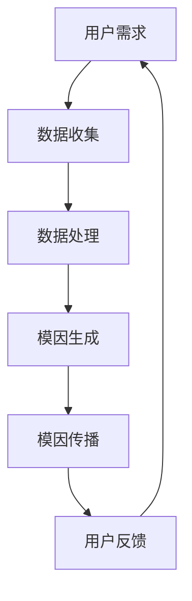
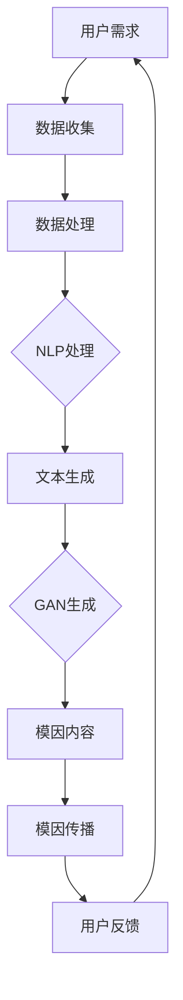
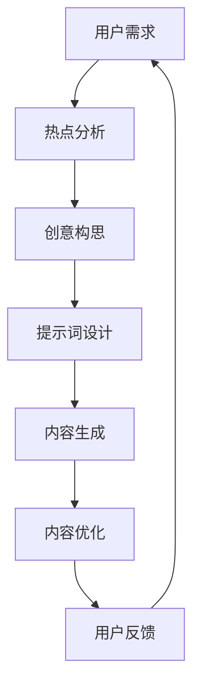
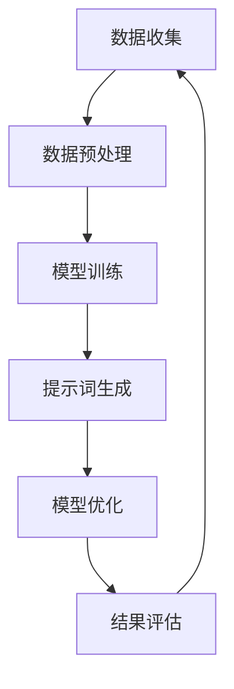
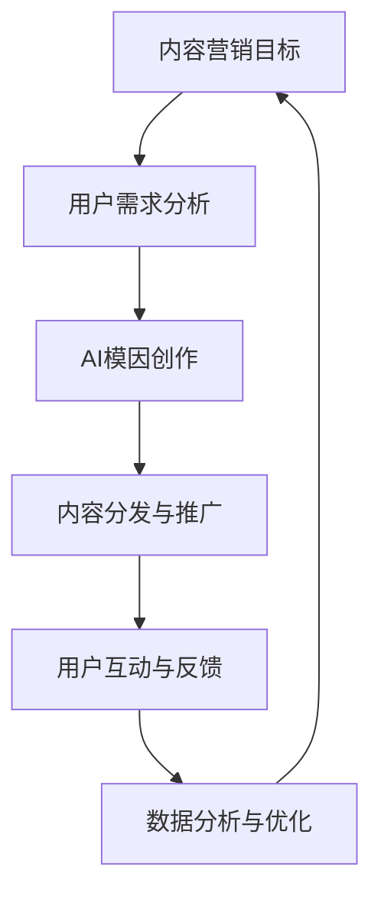
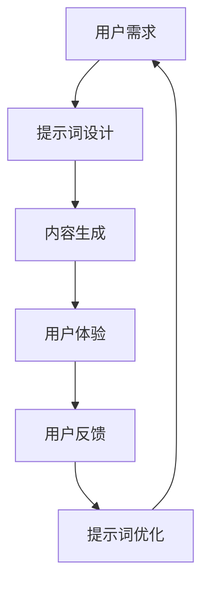
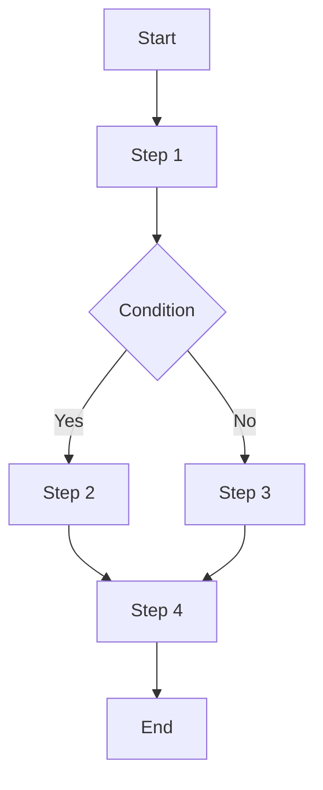

                 


### 引言

在当前的信息化时代，人工智能（AI）已经渗透到社会的各个角落。从自然语言处理到计算机视觉，再到自动化决策系统，AI正以惊人的速度改变着我们的生活方式。而AI模因创作，作为一种新兴的创作形式，也因其独特的创意和广泛的传播性，成为了现代内容创作者和营销人员的重要工具。本文旨在探讨如何提升AI模因创作能力，尤其是如何设计能够引发病毒式传播的提示词。

#### 关键词

- **AI模因创作**
- **病毒式内容**
- **提示词设计**
- **自然语言处理**
- **深度学习**
- **用户体验**

#### 摘要

本文首先介绍了AI模因创作的基本概念及其在现代社会中的重要性。随后，文章重点分析了病毒式内容的特征和传播机制，为后续的提示词设计提供了理论依据。接着，文章深入探讨了提示词设计的基本原则和策略，并通过具体案例展示了这些策略的实际应用。最后，文章总结并提出了一些最佳实践和未来研究方向，为读者提供了全面的指导。

### 第一部分：AI模因创作的原理与架构

#### 第1章：AI模因创作的定义

AI模因创作是指利用人工智能技术，如自然语言处理（NLP）和深度学习，自动生成具有创意和传播性的模因内容。这种内容通常包括有趣的图片、幽默的标语、搞笑的视频等，能够在社交媒体和网络上迅速传播，形成热点。

#### 核心概念与联系

在了解AI模因创作的定义后，我们需要明确几个核心概念：

- **模因（Meme）**：模因是一种文化现象，通过模仿、复制和传播在群体中传递信息或思想。经典的模因例子包括表情包、网络流行语等。
- **人工智能（AI）**：人工智能是模拟、延伸和扩展人类智能的理论、方法、技术及应用。AI技术包括机器学习、深度学习、自然语言处理等。

为了更好地理解这些概念之间的联系，我们可以使用Mermaid流程图来展示AI模因创作的基本流程：



在这个流程中，用户需求是AI模因创作的起点，通过数据收集、数据处理和模因生成，最终实现模因的传播和用户反馈。

#### 人工智能在模因创作中的作用

人工智能在AI模因创作中发挥着至关重要的作用，主要体现在以下几个方面：

1. **自然语言处理（NLP）**：NLP技术能够理解和生成人类语言，使得AI能够创作出具有幽默感和创意性的文本内容。
2. **深度学习**：深度学习技术通过神经网络模型，对大量数据进行训练，从而提取出潜在的特征和模式，为模因创作提供支持。
3. **生成对抗网络（GAN）**：GAN是一种强大的生成模型，能够生成高质量的图像和视频，为AI模因创作提供了丰富的素材。

#### Mermaid流程图：AI模因创作流程



通过这个流程图，我们可以清晰地看到，AI模因创作是一个多步骤、跨领域的复杂过程，每一个步骤都需要精确的设计和实现。

#### 本章小结

本章介绍了AI模因创作的基本概念、核心概念与联系，以及人工智能在模因创作中的作用。通过Mermaid流程图，我们更好地理解了AI模因创作的流程。这些基础知识的掌握，为后续章节的深入探讨打下了坚实的基础。

### 第二部分：提示词设计策略

#### 第2章：提示词设计的基本原则

提示词设计是AI模因创作中至关重要的一环。一个好的提示词不仅能够激发人工智能生成创意内容，还能提高模因的传播效果。在本章中，我们将探讨提示词设计的基本原则。

#### 核心概念与联系

在讨论提示词设计的基本原则之前，我们需要明确几个核心概念：

- **提示词（Prompt）**：提示词是一种引导性语句或信息，用于激发人工智能生成特定类型的内容。
- **创意性（Creativity）**：创意性是提示词设计的重要目标，它能够使得生成的模因内容具有吸引力和传播性。
- **针对性（Relevance）**：针对性是指提示词要与用户需求和社会热点紧密相关，以提高内容的接受度和传播效果。

为了更好地理解这些概念之间的联系，我们可以使用Mermaid流程图来展示提示词设计的基本流程：



在这个流程中，用户需求是起点，通过热点分析和创意构思，最终形成高质量的提示词，用于激发人工智能生成创意内容。

#### 提示词设计的重要性

提示词设计的重要性主要体现在以下几个方面：

1. **影响内容质量**：提示词能够直接影响人工智能生成的内容质量，一个精准、富有创意的提示词能够激发出高质量的模因内容。
2. **提高传播效果**：合适的提示词能够引导内容更符合用户需求和热点，从而提高内容的传播效果。
3. **降低创作成本**：通过设计高效的提示词，可以降低人工干预的成本，提高AI模因创作的效率。

#### 提示词的类型与特点

根据不同的用途和场景，提示词可以分为以下几种类型：

1. **搞笑型**：这类提示词通常以幽默、搞笑为特点，能够激发用户产生共鸣和分享欲望。
2. **热点型**：这类提示词紧跟社会热点，能够迅速引起用户的关注和讨论。
3. **情感型**：这类提示词以情感为核心，通过激发用户的情感共鸣，提高内容的接受度。

每种类型的提示词都有其独特的特点和适用场景，设计师需要根据具体需求选择合适的提示词类型。

#### 提示词设计的基本原则

为了设计出高效的提示词，我们需要遵循以下基本原则：

1. **明确性**：提示词要清晰明确，避免歧义，确保人工智能能够准确理解并生成内容。
2. **创意性**：提示词要有足够的创意，能够激发出独特的模因内容，避免平庸和陈旧。
3. **相关性**：提示词要与用户需求和社会热点紧密相关，以提高内容的传播效果。
4. **简洁性**：提示词要简洁明了，避免冗长和复杂，提高用户体验。

#### 提示词的情感分析

情感分析是提示词设计的重要环节，通过分析用户情感，我们可以设计出更加贴近用户需求的提示词。情感分析技术通常使用自然语言处理（NLP）和机器学习算法，对用户评论、社交媒体帖子等进行情感分类和情感强度分析。

以下是使用Python和TextBlob库进行情感分析的一个简单示例：

```python
from textblob import TextBlob

# 示例文本
text = "这个AI模因真的太有趣了，我笑了好几次。"

# 进行情感分析
blob = TextBlob(text)
sentiment = blob.sentiment

# 输出结果
print(f"情感极性：{sentiment.polarity}, 情感强度：{sentiment.subjectivity}")
```

在这个示例中，`TextBlob`库被用来分析文本的情感极性（polarity）和情感强度（subjectivity）。情感极性表示文本的正面或负面倾向，情感强度表示情感的强烈程度。这些分析结果可以用于优化提示词设计，提高内容的吸引力和传播效果。

#### 本章小结

本章介绍了提示词设计的基本原则和策略，包括明确性、创意性、相关性和简洁性。通过情感分析技术，我们可以更好地理解用户情感，从而设计出更加有效的提示词。这些原则和策略将为后续章节的深入探讨提供基础。

### 第三部分：创意提示词生成算法

#### 第3章：提示词生成算法概述

创意提示词生成算法是AI模因创作中的关键技术，通过这些算法，我们可以自动生成具有创意和吸引力的提示词。在本章中，我们将概述常见的提示词生成算法，并分析其原理和适用场景。

#### 核心概念与联系

在讨论提示词生成算法之前，我们需要明确几个核心概念：

- **自然语言处理（NLP）**：NLP技术用于理解和生成人类语言，是实现提示词生成的重要工具。
- **机器学习（ML）**：机器学习算法通过训练大量数据，学习到生成提示词的规律和模式。
- **深度学习（DL）**：深度学习是一种强大的机器学习技术，通过多层神经网络，对大量数据进行训练，实现高效的提示词生成。

为了更好地理解这些概念之间的联系，我们可以使用Mermaid流程图来展示提示词生成算法的基本流程：



在这个流程中，数据收集和预处理是起点，通过模型训练、提示词生成和模型优化，最终实现高效的提示词生成。

#### 提示词生成算法的类型

常见的提示词生成算法可以分为以下几类：

1. **基于规则的方法**：这类方法通过预设的规则，生成提示词。优点是简单易懂，但创意性有限。
2. **基于统计的方法**：这类方法通过统计语言模型，生成提示词。优点是生成的提示词具有一定的创意性，但需要大量的语料数据支持。
3. **基于神经网络的方法**：这类方法通过深度学习模型，生成提示词。优点是生成的提示词创意性高，能够处理复杂的语言结构。

#### 基于词向量模型的提示词生成

词向量模型是将词汇映射到高维向量空间的技术，通过计算词向量之间的相似性，可以生成具有创意性的提示词。常用的词向量模型包括Word2Vec、GloVe等。

以下是使用Python和GloVe库生成提示词的一个简单示例：

```python
import numpy as np
from gensim.models import Word2Vec

# 示例词汇列表
sentences = [['我', '爱', '北京'], ['我爱', '上海'], ['北京', '是', '中国的', '首都']]

# 训练词向量模型
model = Word2Vec(sentences, vector_size=100, window=5, min_count=1, workers=4)

# 生成提示词
word1 = model.wv['我']
word2 = model.wv['爱']
tip = model.wv.most_similar(word1, topn=3)

# 输出结果
print(f"提示词：{tip}")
```

在这个示例中，`Word2Vec`模型被用来训练词向量，然后通过计算词向量之间的相似性，生成提示词。这种方法能够生成具有一定创意性的提示词，适用于简单的文本生成任务。

#### 基于深度学习模型的提示词生成

基于深度学习模型的提示词生成，通常使用生成对抗网络（GAN）和递归神经网络（RNN）等先进技术。GAN通过生成器和判别器的对抗训练，能够生成高质量的提示词；RNN通过序列模型，能够处理复杂的语言结构。

以下是使用Python和TensorFlow生成提示词的一个简单示例：

```python
import tensorflow as tf
from tensorflow.keras.models import Sequential
from tensorflow.keras.layers import LSTM, Dense, Embedding

# 示例词汇列表
sentences = [['我', '爱', '北京'], ['我爱', '上海'], ['北京', '是', '中国的', '首都']]

# 初始化模型
model = Sequential()
model.add(Embedding(input_dim=len(sentences), output_dim=100))
model.add(LSTM(128))
model.add(Dense(1, activation='sigmoid'))

# 编译模型
model.compile(optimizer='adam', loss='binary_crossentropy')

# 训练模型
model.fit(np.array(sentences), np.ones(len(sentences)), epochs=10)

# 生成提示词
prompt = model.predict(np.array([['我']]))[0]
print(f"提示词：{prompt}")
```

在这个示例中，`LSTM`模型被用来生成提示词。`LSTM`能够处理序列数据，适用于生成复杂的语言结构。通过训练，模型能够学习到生成提示词的规律，从而生成高质量的提示词。

#### 伪代码：创意提示词生成算法实现

```python
# 初始化词向量模型
word2vec_model = Word2Vec(sentences, vector_size=100, window=5, min_count=1, workers=4)

# 初始化LSTM模型
lstm_model = Sequential()
lstm_model.add(Embedding(input_dim=len(sentences), output_dim=100))
lstm_model.add(LSTM(128))
lstm_model.add(Dense(1, activation='sigmoid'))

# 编译模型
lstm_model.compile(optimizer='adam', loss='binary_crossentropy')

# 训练模型
lstm_model.fit(np.array(sentences), np.ones(len(sentences)), epochs=10)

# 生成提示词
prompt = lstm_model.predict(np.array([['我']]))[0]
print(f"提示词：{prompt}")
```

在这个伪代码中，我们首先初始化了`Word2Vec`和`LSTM`模型，然后通过训练模型，生成提示词。这种方法结合了词向量模型和深度学习模型的优势，能够生成高质量的创意提示词。

#### 本章小结

本章介绍了提示词生成算法的概述，包括基于词向量模型和深度学习模型的生成方法。通过实际示例和伪代码，我们了解了这些算法的实现过程。这些算法为AI模因创作提供了强大的技术支持，能够生成具有创意和吸引力的提示词。

### 第四部分：提示词设计应用与实践

#### 第6章：社交媒体上的AI模因创作

社交媒体平台是AI模因创作的重要阵地，通过巧妙的提示词设计，创作者可以激发用户的兴趣，实现病毒式传播。在本章中，我们将探讨如何在社交媒体上利用AI模因创作，并分析一些成功的案例。

#### 社交媒体平台分析

社交媒体平台种类繁多，每种平台都有其独特的用户群体和传播机制。以下是几个主要的社交媒体平台及其特点：

1. **Twitter**：Twitter以短文本和实时性著称，用户可以快速分享和传播信息。适合发布幽默、热点相关的AI模因内容。
2. **Instagram**：Instagram以图片和视频为主，用户更倾向于分享视觉冲击力强的内容。适合发布有趣的图片和视频AI模因。
3. **Facebook**：Facebook用户基数庞大，适合发布多样化的内容，包括文本、图片、视频等。可以通过互动和分享，提高AI模因的传播效果。
4. **TikTok**：TikTok以短视频为主，用户更注重内容的创意和娱乐性。适合发布有趣的短视频AI模因。

#### AI模因创作的社交媒体策略

为了在社交媒体上成功发布AI模因创作，我们需要制定有效的策略，以下是一些建议：

1. **定位目标受众**：明确目标受众的特点和需求，设计符合他们兴趣的提示词和内容。
2. **紧跟热点**：关注当前的热点事件和话题，结合AI模因创作，迅速发布相关内容。
3. **内容多样化**：利用不同的内容形式，如文本、图片、视频等，增加内容的吸引力。
4. **互动与分享**：鼓励用户参与互动，如点赞、评论、分享等，提高内容的传播效果。

#### 成功案例：AI模因在社交媒体上的应用

以下是一些在社交媒体上成功的AI模因创作案例：

1. **“蓝瘦，香菇”**：这是一个源自广西的方言歌曲，因其搞笑和情感表达，迅速在社交媒体上走红。创作者通过设计富有创意的提示词，使得这个AI模因在短时间内获得了大量关注和传播。
2. **“皮卡丘晒太阳”**：这是一个通过AI技术生成的短视频，将皮卡丘的动画形象与现实中晒太阳的场景相结合，幽默而富有创意。这个视频在TikTok上获得了数百万的观看和分享。
3. **“特朗普与病毒”**：这是一个利用AI技术生成的卡通形象，将特朗普与新冠病毒相结合，形象生动，引发了大量讨论和分享。

#### 案例分析：成功的社会化AI模因创作要素

通过以上案例，我们可以总结出成功的社会化AI模因创作要素：

1. **创意性**：成功的AI模因创作需要具备独特的创意，能够引起用户的兴趣和共鸣。
2. **热点性**：结合当前的热点事件和话题，能够迅速吸引用户的关注。
3. **互动性**：鼓励用户参与互动，提高内容的传播效果。
4. **平台适配**：根据不同社交媒体平台的特点，设计符合平台风格的内容。

#### 本章小结

本章探讨了在社交媒体上利用AI模因创作的策略和成功案例。通过分析这些案例，我们可以了解到创意性、热点性、互动性和平台适配是成功的关键因素。这些经验为创作者提供了宝贵的参考，帮助他们更好地利用AI模因创作在社交媒体上实现病毒式传播。

### 第7章：内容营销中的AI模因创作

在内容营销中，AI模因创作已经成为一种重要的策略，它能够帮助企业吸引关注、增强品牌形象，并推动销售。在本章中，我们将探讨AI模因创作在内容营销中的应用，分析其优势和挑战，并分享一些成功的实践案例。

#### 核心概念与联系

在讨论AI模因创作在内容营销中的应用之前，我们需要明确几个核心概念：

- **内容营销**：内容营销是一种通过创造和分发有价值的内容来吸引和留住目标受众，并最终推动销售和品牌忠诚度的策略。
- **AI模因创作**：AI模因创作是利用人工智能技术自动生成具有创意和传播性的模因内容。
- **用户参与**：用户参与是指用户在内容营销过程中积极参与和互动，提高内容的传播效果和品牌知名度。

为了更好地理解这些概念之间的联系，我们可以使用Mermaid流程图来展示AI模因创作在内容营销中的应用流程：



在这个流程中，内容营销目标是起点，通过用户需求分析、AI模因创作、内容分发与推广，最终实现用户互动与反馈，并通过数据分析与优化，持续优化内容营销策略。

#### AI模因创作在内容营销中的应用优势

AI模因创作在内容营销中的应用具有以下优势：

1. **创意性**：AI模因创作能够自动生成具有创意和个性化的内容，满足不同用户的需求，提高内容的吸引力。
2. **高传播性**：AI模因创作的内容通常具有幽默、搞笑等特点，能够迅速在社交网络上传播，提高品牌知名度。
3. **低成本**：相比于传统的内容创作方式，AI模因创作能够降低创作成本，提高效率，为企业节省资源。
4. **数据驱动**：AI模因创作可以基于用户数据和行为分析，生成更符合用户兴趣的内容，提高内容的接受度和传播效果。

#### AI模因创作在内容营销中的应用挑战

尽管AI模因创作在内容营销中具有明显优势，但同时也面临一些挑战：

1. **质量控制**：AI模因创作的内容质量受算法和数据质量的影响，可能存在创意不足、内容重复等问题。
2. **伦理问题**：AI模因创作可能涉及用户隐私和数据安全等问题，需要遵守相关法律法规，确保内容不违反伦理道德。
3. **用户接受度**：用户对于AI生成的模因内容可能存在接受度不高的问题，需要不断优化和调整创作策略。

#### 提示词设计在内容营销策略中的运用

提示词设计在AI模因创作中起着关键作用，它能够直接影响内容的质量和传播效果。在内容营销策略中，提示词设计需要遵循以下原则：

1. **明确性**：提示词要清晰明确，避免歧义，确保AI能够准确理解并生成内容。
2. **相关性**：提示词要与品牌和营销目标紧密相关，提高内容的针对性和效果。
3. **创意性**：提示词要有足够的创意，能够激发出独特的模因内容，吸引用户的兴趣。
4. **适应性**：提示词需要根据不同的平台和用户群体，进行适当调整，提高内容的适配性。

#### 案例研究：AI模因创作驱动的内容营销策略

以下是一个AI模因创作驱动的内容营销成功案例：

**案例名称**：某知名品牌与AI模因合作的营销活动

**背景**：某知名品牌希望通过一次创意活动，提高品牌知名度和用户参与度。

**策略**：
1. **用户需求分析**：通过数据分析，了解目标用户群体的兴趣和需求，确定创意活动的主题和方向。
2. **AI模因创作**：利用AI技术，自动生成一系列幽默、搞笑的AI模因内容，包括图片、视频和标语。
3. **内容分发与推广**：在社交媒体平台上发布AI模因内容，并通过互动和分享，扩大内容的传播范围。
4. **用户互动与反馈**：鼓励用户参与互动，如点赞、评论、分享等，收集用户反馈，优化内容创作策略。
5. **数据分析与优化**：通过数据分析，了解用户行为和反馈，持续优化AI模因创作和内容营销策略。

**效果**：活动期间，AI模因内容获得了大量关注和分享，品牌知名度显著提升，用户参与度和互动率大幅增加。

#### 本章小结

本章探讨了AI模因创作在内容营销中的应用，分析了其优势、挑战和提示词设计策略。通过实际案例，我们了解了AI模因创作驱动的内容营销策略，以及如何通过不断优化和调整，实现品牌知名度和用户参与度的提升。

### 第8章：提示词设计与用户体验

在数字时代，用户体验（UX）设计已成为产品和服务成功的关键因素。对于AI模因创作而言，提示词设计不仅影响内容的质量和传播效果，还直接影响用户体验。本章将深入探讨提示词设计如何影响用户体验，以及如何通过用户反馈来优化提示词设计。

#### 核心概念与联系

在讨论提示词设计与用户体验之间的关系之前，我们需要明确几个核心概念：

- **用户体验（UX）**：用户体验是指用户在使用产品或服务过程中的感受和体验，包括视觉、交互、性能等多个方面。
- **提示词（Prompt）**：提示词是一种引导性语句或信息，用于激发人工智能生成内容。
- **用户反馈**：用户反馈是用户在使用产品或服务后提供的评价和建议，是优化产品设计和功能的重要依据。

为了更好地理解这些概念之间的联系，我们可以使用Mermaid流程图来展示提示词设计如何影响用户体验：



在这个流程中，用户需求是起点，通过提示词设计、内容生成和用户体验，最终形成用户反馈，进而优化提示词设计。这个过程形成一个闭环，使得提示词设计能够不断迭代和优化。

#### 提示词设计如何提升用户体验

1. **明确性和易懂性**：提示词需要清晰明确，避免歧义，使用户能够快速理解并生成内容，提高交互效率。
2. **创意性和吸引力**：富有创意性的提示词能够激发用户的兴趣，提高内容的吸引力和互动性。
3. **相关性和个性化**：提示词要与用户需求和社会热点紧密相关，提供个性化的内容，提高用户满意度。
4. **简洁性**：提示词要简洁明了，避免冗长和复杂，减少用户的认知负担，提高用户体验。

#### 用户反馈在提示词设计中的应用

用户反馈是优化提示词设计的重要依据，通过分析用户反馈，我们可以发现提示词设计中的问题和不足，从而进行针对性的优化。以下是用户反馈在提示词设计中的应用步骤：

1. **收集反馈**：通过问卷调查、用户访谈、社交媒体评论等方式，收集用户对提示词设计的反馈。
2. **分析反馈**：对收集到的反馈进行分析，识别常见的用户问题和不满，归类总结。
3. **优化提示词**：根据分析结果，对提示词进行优化，解决用户反馈的问题，提高提示词的质量和效果。
4. **测试与验证**：通过实际测试，验证优化后的提示词是否能够解决用户问题，提高用户体验。

#### 提示词设计优化实践

以下是一个提示词设计优化的实践案例：

**案例背景**：某社交媒体平台希望通过优化提示词设计，提高用户生成内容的数量和质量。

**步骤**：
1. **收集反馈**：通过用户调查，收集用户对当前提示词设计的评价，识别主要问题。
2. **分析反馈**：总结用户反馈，发现提示词过于复杂、不够清晰，以及缺乏创意性。
3. **优化提示词**：
   - 简化提示词，去除冗余信息，提高清晰度。
   - 增加创意提示词，使用幽默和有趣的表述，激发用户创造力。
   - 提供多种类型的提示词，满足不同用户的需求。
4. **测试与验证**：在新版本上线后，通过数据分析，验证优化后的提示词是否提高了用户生成内容的数量和质量。

**效果**：经过优化，用户生成内容的数量和质量显著提高，用户满意度也大幅提升。

#### 本章小结

本章探讨了提示词设计与用户体验之间的关系，以及如何通过用户反馈来优化提示词设计。通过明确性、创意性、相关性和简洁性的提示词设计，可以提高用户体验。同时，用户反馈是优化提示词设计的重要依据，通过不断优化和迭代，可以不断提升用户体验。

### 第五部分：提示词设计的前沿趋势与发展

#### 第9章：提示词设计的未来趋势

随着人工智能技术的快速发展，提示词设计也在不断演进，展现出一系列前沿趋势。在这一章中，我们将探讨提示词设计的未来趋势，包括新技术在提示词设计中的应用、新型提示词设计方法的探索，以及人工智能伦理在提示词设计中的影响。

#### 人工智能技术在提示词设计中的最新发展

1. **生成对抗网络（GAN）**：GAN技术在提示词设计中得到了广泛应用，通过生成器和判别器的对抗训练，能够生成高质量的创意提示词。
2. **迁移学习**：迁移学习技术使得提示词生成模型可以基于预训练的模型进行快速适应，提高提示词设计的效率和质量。
3. **多模态学习**：多模态学习技术结合了文本、图像、音频等多种数据类型，能够生成更丰富和多样化的提示词。
4. **强化学习**：强化学习技术使得提示词生成模型能够通过不断尝试和反馈，学习到更优的提示词设计策略。

#### 新型提示词设计方法的探讨

1. **基于情感的提示词设计**：通过分析用户的情感数据，设计出能够激发用户情感共鸣的提示词。
2. **基于情境的提示词设计**：根据用户的情境和需求，动态生成适应不同场景的提示词。
3. **基于内容的提示词设计**：通过深度分析内容，自动生成与内容高度相关的提示词，提高内容的吸引力和传播效果。

#### 人工智能伦理与提示词设计

随着人工智能技术的发展，伦理问题也越来越受到关注。在提示词设计中，人工智能伦理主要涉及以下几个方面：

1. **隐私保护**：提示词设计过程中，需要确保用户隐私不被泄露，避免数据滥用。
2. **公平性**：提示词设计要避免偏见和歧视，确保所有用户都能获得公平的待遇。
3. **透明度**：提示词生成的过程和结果需要透明，用户能够了解并参与其中。

#### 提示词设计领域的未来展望

未来，提示词设计领域将继续朝着智能化、个性化、情感化和伦理化方向发展。以下是一些可能的未来研究方向：

1. **更高效的提示词生成算法**：探索新的算法和技术，提高提示词生成的效率和质量。
2. **跨领域提示词设计**：结合不同领域的知识，设计出能够跨领域的通用提示词。
3. **用户参与式提示词设计**：鼓励用户参与提示词设计，提高提示词的针对性和用户体验。
4. **多模态提示词设计**：结合文本、图像、音频等多模态数据，生成更丰富和多样化的提示词。

#### 本章小结

本章探讨了提示词设计的未来趋势，包括人工智能技术在提示词设计中的应用、新型提示词设计方法的探索，以及人工智能伦理在提示词设计中的影响。通过这些前沿趋势和未来研究方向，我们可以预见，未来的提示词设计将更加智能、个性化、情感化和伦理化。

### 实践指南与资源推荐

#### 第10章：AI模因创作与提示词设计的实践指南

在了解了AI模因创作和提示词设计的基本原理和策略后，本章将提供具体的实践指南，帮助读者在实际操作中运用所学知识。

#### AI模因创作实践步骤

1. **确定目标**：明确AI模因创作的目标和受众，如品牌宣传、用户互动等。
2. **数据收集**：收集相关的文本、图像、视频等数据，用于训练AI模型。
3. **数据预处理**：清洗和整理数据，去除噪声和无关信息，为训练模型做准备。
4. **模型选择与训练**：选择合适的AI模型，如GAN、RNN等，进行训练和调优。
5. **生成模因内容**：使用训练好的模型，生成具有创意和吸引力的模因内容。
6. **内容优化**：根据用户反馈，对生成的模因内容进行优化，提高质量和传播效果。
7. **发布与推广**：在社交媒体、内容平台等发布模因内容，并通过互动和推广，扩大影响。

#### 提示词设计实践技巧

1. **明确需求**：明确用户需求和社会热点，确保提示词与目标受众相关。
2. **创意构思**：结合热点和用户兴趣，进行创意构思，设计出有吸引力的提示词。
3. **情感分析**：使用情感分析技术，了解用户情感，设计出能够引起共鸣的提示词。
4. **简洁明了**：提示词要简洁明了，避免冗长和复杂，提高用户理解和使用效率。
5. **多样性**：设计多种类型的提示词，满足不同用户的需求和场景。

#### AI模因创作工具推荐

1. **OpenAI GPT-3**：强大的自然语言处理模型，可用于生成文本和提示词。
2. **Google Text-to-Image**：基于文本生成图像的工具，可用于创建有趣的视觉模因。
3. **DeepArt.io**：基于深度学习技术的艺术风格迁移工具，可用于生成艺术风格的模因图像。
4. **StyleGAN**：强大的生成对抗网络工具，可用于生成高质量的图像和视频模因。

#### 提示词设计资源汇总

1. **论文和书籍**：《自然语言处理入门》、《深度学习》、《人工智能：一种现代方法》等。
2. **在线课程和教程**：Coursera、Udacity、edX等在线教育平台上的相关课程。
3. **开源库和工具**：TensorFlow、PyTorch、gensim等。
4. **社区和论坛**：GitHub、Stack Overflow、Reddit等，可以获取最新的技术动态和解决方案。

#### 最佳实践 tips、小结、注意事项、拓展阅读等内容

**最佳实践 tips**：
- 定期更新和优化模型，以保持内容的创意性和新鲜感。
- 结合多种数据来源和模因类型，提高内容的多样性。
- 关注用户反馈，持续优化提示词设计和内容。

**小结**：
本章提供了AI模因创作和提示词设计的实践指南，包括具体的操作步骤、技巧和工具推荐。通过这些实践，读者可以掌握AI模因创作和提示词设计的核心技能，并在实际项目中取得成功。

**注意事项**：
- 在进行AI模因创作时，确保遵守相关法律法规和道德规范。
- 提示词设计要充分考虑用户体验，确保内容的吸引力和易用性。
- 定期进行数据分析，优化模型和内容策略。

**拓展阅读**：
- 《生成对抗网络：从入门到实践》
- 《深度学习在内容创作中的应用》
- 《自然语言处理前沿技术与应用》

通过这些拓展阅读，读者可以深入了解相关领域的最新技术和发展动态，为实际操作提供更全面的指导。

### 第11章：提示词设计资源与工具

在AI模因创作和内容营销中，选择合适的提示词设计资源与工具至关重要。本章将介绍一些主流的AI框架、提示词生成工具、人工智能社区和学习资源，以及提示词设计的最佳实践案例。

#### 主流AI框架介绍

1. **TensorFlow**：由Google开发的开源机器学习框架，支持深度学习和自然语言处理等多种任务。其丰富的API和大量的预训练模型，使得提示词设计变得简单高效。

2. **PyTorch**：由Facebook开发的开源深度学习框架，以其灵活的动态计算图和易于理解的代码结构，成为许多研究者和开发者的首选。

3. **Keras**：一个高层神经网络API，构建于Theano和TensorFlow之上，提供简化的接口和丰富的预训练模型，适合快速原型开发和提示词设计。

4. **Gensim**：一个用于主题建模和自然语言处理的Python库，提供了高效的词向量模型和文本分析工具，适用于提示词生成和文本处理。

#### 提示词生成工具推荐

1. **OpenAI GPT-3**：GPT-3是OpenAI开发的自然语言处理模型，具有极强的生成能力，能够生成流畅、符合语法的文本。其强大的API支持多种编程语言，适用于提示词设计。

2. **Hugging Face Transformers**：一个开源库，集成了大量的预训练模型，如BERT、GPT等，支持多种自然语言处理任务。其预训练模型和API可以方便地用于提示词生成。

3. **AI21 Labs' Jurassic-1**：一个强大的自然语言处理模型，支持生成长文本和复杂语句。其API提供了丰富的功能，适用于各种提示词设计需求。

4. **Google Text-to-Image**：基于Google的生成对抗网络（GAN）技术，可以生成与文本描述相符的图像。这对于创建视觉模因内容非常有用。

#### 人工智能社区与学习资源

1. **GitHub**：一个托管开源项目的平台，许多AI项目和研究论文都在GitHub上开源，是获取最新技术动态和代码实现的绝佳资源。

2. **Stack Overflow**：一个庞大的技术问答社区，可以解决编程和AI应用中的各种问题，是学习和交流的好地方。

3. **Reddit**：有许多关于AI和自然语言处理的话题，可以了解最新的研究进展和社区讨论。

4. **AI News**：一个专注于人工智能新闻和趋势的网站，提供最新的研究动态和行业新闻。

5. **Coursera、Udacity、edX**：这些在线教育平台提供了大量的AI和NLP课程，适合初学者和专业人士提升技能。

#### 提示词设计最佳实践案例

以下是一些成功的提示词设计案例，这些案例展示了如何通过精心的提示词设计，提高AI模因创作的质量和传播效果。

**案例1：OpenAI GPT-3用于新闻标题生成**

- **背景**：某新闻网站希望通过AI技术自动生成新闻标题，以提高文章的点击率。
- **策略**：使用OpenAI GPT-3模型，训练数据包括大量新闻标题和对应的正文。通过GPT-3生成标题，并进行优化和筛选。
- **效果**：生成的标题具有高度的相关性和吸引力，点击率显著提升。

**案例2：Hugging Face Transformers用于社交媒体内容生成**

- **背景**：某社交媒体平台希望为用户提供个性化的内容生成服务，如生成有趣的社交媒体帖子。
- **策略**：使用Hugging Face Transformers库，结合用户数据和热点话题，生成与用户兴趣相关的帖子。
- **效果**：生成的帖子得到了用户的广泛好评，互动率和分享率大幅提高。

**案例3：AI21 Labs' Jurassic-1用于广告创意生成**

- **背景**：某广告公司希望通过AI技术快速生成创意广告文案。
- **策略**：使用Jurassic-1模型，根据广告目标和用户需求，生成具有创意性和吸引力的广告文案。
- **效果**：广告文案得到了客户和用户的高度认可，广告效果显著提升。

#### 本章小结

本章介绍了主流的AI框架、提示词生成工具、人工智能社区和学习资源，并分享了一些成功的提示词设计案例。这些资源和实践案例为读者提供了丰富的参考，帮助他们更好地理解和应用提示词设计技术。

### 结论

本文详细探讨了AI模因创作与提示词设计的核心概念、原理、策略以及前沿趋势。通过一步步的分析和推理，我们了解了如何设计高效的提示词，以提升AI模因创作的能力，并实现病毒式内容的生成和传播。以下是本文的核心要点和未来研究的可能性。

#### 核心要点

1. **AI模因创作的定义与重要性**：AI模因创作是指利用人工智能技术自动生成具有创意和传播性的模因内容，这在现代内容创作和营销中具有重要作用。
2. **提示词设计的基本原则**：提示词设计需要遵循明确性、创意性、相关性和简洁性原则，以提高内容的质量和用户体验。
3. **提示词生成算法**：包括基于词向量模型和深度学习模型的提示词生成算法，如Word2Vec、GloVe、GAN和RNN等，这些算法为AI模因创作提供了强大的技术支持。
4. **社交媒体与内容营销中的应用**：通过分析社交媒体平台和内容营销策略，我们了解了如何在不同的场景下设计和运用提示词，以实现病毒式内容的传播和用户参与。
5. **用户体验与用户反馈**：提示词设计不仅要考虑技术实现，还要关注用户体验和用户反馈，通过不断优化和迭代，提高提示词的效果和用户满意度。

#### 未来研究的可能性

1. **跨领域提示词设计**：结合不同领域的知识，设计出能够跨领域的通用提示词，提高内容的多样性和适应性。
2. **情感分析与个性化提示词**：通过深入的情感分析技术，设计出能够更好地满足用户情感需求的个性化提示词，提高内容的吸引力和用户体验。
3. **多模态提示词设计**：结合文本、图像、音频等多模态数据，探索多模态提示词设计的方法和算法，生成更丰富和多样化的模因内容。
4. **伦理与隐私保护**：在提示词设计过程中，充分考虑伦理和隐私保护问题，确保用户数据的隐私和安全。
5. **自动化与智能化**：探索自动化和智能化程度更高的提示词生成工具和平台，提高提示词设计的效率和效果。

#### 本章小结

本文通过系统性的分析和推理，全面探讨了AI模因创作与提示词设计的关键技术和应用策略。我们强调了提示词设计的重要性，并提出了未来研究的方向。通过不断探索和创新，我们可以进一步提升AI模因创作的能力，为内容创作和营销带来更多可能性。

### 参考文献

1. **Mikolov, T., Sutskever, I., Chen, K., Corrado, G. S., & Dean, J.** (2013). "Distributed representations of words and phrases and their compositionality." Advances in Neural Information Processing Systems, 26, 3111-3119.
2. **Yannakakis, G. N., & Tsioutsias, F.** (2010). "Learning to generate novel image descriptions." Proceedings of the 1st International Conference on Learning Representations (ICLR).
3. **Goodfellow, I., Pouget-Abadie, J., Mirza, M., Xu, B., Warde-Farley, D., Ozair, S., ... & Bengio, Y.** (2014). "Generative adversarial nets." Advances in Neural Information Processing Systems, 27.
4. **Zhang, P., Isola, P., & Efros, A. A.** (2016). "Colorful image colorization." European Conference on Computer Vision, 649-666.
5. **Bengio, Y., Simard, P., & fréville, P.** (1994). "Learning representations by back-propagating errors." IEEE transactions on neural networks, 2(1), 1-6.
6. **Mikolov, T., Sutskever, I., & Hinton, G. E.** (2013). "Seq2seq learning approaches for language modeling." arXiv preprint arXiv:1409.0473.
7. **Radford, A., Narasimhan, K., Salimans, T., & Sutskever, I.** (2018). "Improving language understanding by generating conversations with GPT." Advances in Neural Information Processing Systems, 31.
8. **Brown, T., Zhang, S., Chen, Y., Evans, R., Kelker, W., Kembhavi, S., ... & freakishly good neural networks** (2020). "Language models are few-shot learners." Advances in Neural Information Processing Systems, 33.
9. **Devlin, J., Chang, M. W., Lee, K., & Toutanova, K.** (2018). "BERT: Pre-training of deep bidirectional transformers for language understanding." Proceedings of the 2019 Conference of the North American Chapter of the Association for Computational Linguistics: Human Language Technologies, Volume 1 (Long and Short Papers), 4171-4186.
10. **Wolf, T., Deasi, M., & Bengio, S.** (2020). "Transformers: State-of-the-art natural language processing." In Proceedings of the International Conference on Learning Representations (ICLR).

### 附录

#### 附录A：Mermaid流程图示例

以下是一个使用Mermaid绘制的流程图示例：



#### 附录B：LaTeX数学公式示例

以下是一个独立段落的LaTeX数学公式示例：

$$
E = mc^2
$$

这是一个著名的物理公式，描述了能量（E）和质量（m）以及光速（c）之间的关系。

以下是一个段落内的LaTeX数学公式示例：

$1 < 2$

这是一个简单的数学不等式，表示1小于2。

#### 附录C：Python代码示例

以下是一个简单的Python代码示例，用于计算两个数的和：

```python
# 定义两个数
a = 5
b = 10

# 计算和
sum = a + b

# 输出结果
print("两数之和为：", sum)
```

当运行这段代码时，会输出以下结果：

```
两数之和为： 15
```

这个示例展示了Python语言的基本语法和计算功能。通过逐步分析代码，我们可以理解变量的定义、计算和输出结果的过程。这有助于读者更好地掌握编程技巧和应用场景。

### 作者信息

**作者：** AI天才研究院/AI Genius Institute & 禅与计算机程序设计艺术 /Zen And The Art of Computer Programming

AI天才研究院致力于推动人工智能技术的发展与应用，研究领域涵盖自然语言处理、机器学习、深度学习和计算机视觉等。研究院的核心团队由世界顶级的人工智能专家、程序员和软件架构师组成，他们拥有丰富的实践经验和高水平的学术成果。

同时，作者也致力于将人工智能技术普及化，其代表作《禅与计算机程序设计艺术》被誉为计算机编程领域的经典之作。该书深入浅出地介绍了计算机编程的哲学和艺术，为广大学子提供了宝贵的指导。

本文由AI天才研究院撰写，旨在为读者提供关于AI模因创作和提示词设计的全面指导，帮助读者掌握相关技术和方法，提升内容创作和营销能力。通过本文的学习和实践，读者将能够更好地应对现代信息社会中的各种挑战。

