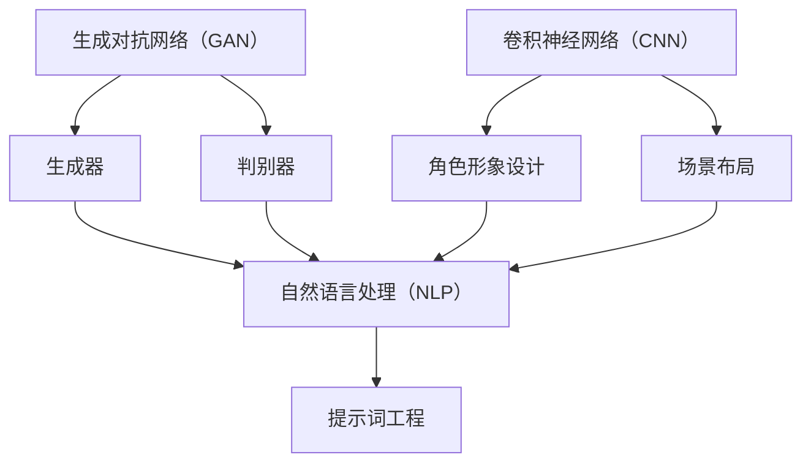

                 

### 文章标题

# 提升AI电影剧本创作：情节转折和人物塑造的提示词工程

在科技飞速发展的时代，人工智能（AI）已经深入到我们生活的方方面面。而在影视创作领域，AI的应用也在逐渐显现其巨大的潜力。本文将探讨如何利用AI技术，特别是生成对抗网络（GAN）、卷积神经网络（CNN）等算法，以及提示词工程，来提升电影剧本的创作水平，特别是情节转折和人物塑造这两个关键要素。

本文的核心关键词包括：人工智能、电影剧本创作、生成对抗网络（GAN）、卷积神经网络（CNN）、提示词工程、情节转折、人物塑造。

> 关键词：人工智能，电影剧本创作，生成对抗网络（GAN），卷积神经网络（CNN），提示词工程，情节转折，人物塑造。

**摘要：**本文将首先介绍AI在电影剧本创作中的应用背景，随后深入探讨AI电影剧本创作中的核心概念，如GAN、CNN和提示词工程。接着，我们将通过伪代码和数学模型，详细讲解这些算法和工程的具体原理。最后，本文将提供一个实际的项目案例，展示如何利用AI技术进行电影剧本的创作，并进行详细的代码解读和案例分析。通过本文的阅读，读者将能够全面了解并掌握利用AI提升电影剧本创作的方法和技巧。

### 引言

AI在电影剧本创作中的应用已经越来越受到关注。随着深度学习和自然语言处理技术的不断发展，AI在文本生成、情感分析、风格迁移等方面展现出了强大的能力。这些技术不仅可以大大提高剧本创作的效率，还能为创作者提供新的创作思路和灵感。特别是在情节转折和人物塑造这两个关键方面，AI的应用具有独特的优势。

**AI在电影剧本创作中的应用场景：**  
1. **剧本生成：**利用AI模型自动生成剧本，提供新的创作灵感。
2. **剧本优化：**对已有剧本进行优化，提高剧本的情节连贯性和可读性。
3. **角色分析：**通过情感分析和行为分析，为角色塑造提供数据支持。
4. **风格迁移：**将不同风格的电影剧本进行迁移，实现风格多样化。
5. **情节预测：**基于数据分析，预测观众可能喜欢的情节转折，提高剧本的市场适应性。

**提升电影剧本创作效率的动机：**  
1. **创新需求：**影视行业对创新的需求日益增加，AI技术可以提供新的创作方向。
2. **市场竞争：**随着影视行业的竞争加剧，高效、高质量的剧本创作变得尤为重要。
3. **技术进步：**深度学习和自然语言处理技术的进步，使得AI在文本处理方面的能力显著提升。

### 书籍结构

本文将分为七个章节，全面系统地探讨AI电影剧本创作的方法和技术。

**第1章 引言**：介绍AI电影剧本创作的重要性，以及本文将要探讨的核心内容。

**第2章 核心概念与联系**：阐述AI电影剧本创作中涉及的关键概念，并使用Mermaid流程图展示它们之间的联系。

**第3章 核心算法原理讲解**：详细讲解生成对抗网络（GAN）和卷积神经网络（CNN）的基本原理，以及它们在电影剧本创作中的应用。

**第4章 数学模型和数学公式**：介绍与AI电影剧本创作相关的数学模型，并通过LaTeX格式展示和解释相关数学公式。

**第5章 项目实战：AI电影剧本创作**：通过一个实际的项目案例，展示如何利用AI技术进行电影剧本的创作，并提供详细的代码解读和案例分析。

**第6章 情节转折与人物塑造的提示词工程**：探讨情节转折和人物塑造的提示词工程，介绍提示词的选取方法和生成算法。

**第7章 总结与展望**：回顾本文的主要内容和核心观点，并对AI电影剧本创作的未来发展趋势进行展望。

### 核心概念与联系

AI电影剧本创作涉及多个核心概念，包括生成对抗网络（GAN）、卷积神经网络（CNN）、自然语言处理（NLP）和提示词工程。这些概念相互关联，共同构成了一个完整的创作体系。

首先，生成对抗网络（GAN）是一种深度学习模型，由生成器和判别器两个部分组成。生成器的任务是生成与真实数据相似的新数据，而判别器的任务是判断输入数据是真实数据还是生成数据。通过这两个模型的对抗训练，GAN能够生成高质量的数据，如图像、声音和文本等。

卷积神经网络（CNN）是处理图像数据的强大工具。它通过卷积层、池化层和全连接层等结构，对图像数据进行特征提取和分类。在电影剧本创作中，CNN可以用于角色形象设计、场景布局等。

自然语言处理（NLP）则是处理文本数据的工具。它包括词向量表示、文本分类、情感分析等。在电影剧本创作中，NLP可以用于生成剧本文本、分析角色情感等。

提示词工程是电影剧本创作中的一项关键技术。提示词是指能够引导AI生成特定类型文本的关键词或短语。通过选择合适的提示词，AI可以生成更具创意和针对性的剧本。

为了更好地展示这些核心概念之间的联系，我们可以使用Mermaid流程图来描述它们的关系：



在这个流程图中，生成对抗网络（GAN）通过生成器和判别器的对抗训练，生成了高质量的数据。这些数据随后通过自然语言处理（NLP）模块进行处理，生成剧本文本。同时，卷积神经网络（CNN）在角色形象设计和场景布局方面提供了支持。最后，提示词工程通过选择合适的提示词，进一步引导AI生成剧本。

### 核心算法原理讲解

在AI电影剧本创作中，生成对抗网络（GAN）和卷积神经网络（CNN）是两种核心算法。这两种算法在不同的应用场景中发挥着关键作用，下面将详细讲解它们的基本原理和具体应用。

#### 生成对抗网络（GAN）

生成对抗网络（GAN）是一种由生成器和判别器组成的深度学习模型。生成器的任务是生成与真实数据相似的新数据，判别器的任务是判断输入数据是真实数据还是生成数据。GAN的核心思想是让生成器和判别器进行对抗训练，以达到生成高质量数据的目的。

**生成器（Generator）的工作原理：**
生成器的输入是随机噪声，它通过一个复杂的神经网络将噪声映射成与真实数据相似的数据。生成器网络的目的是最大化判别器无法区分生成数据和真实数据的能力。

**判别器（Discriminator）的工作原理：**
判别器接收输入的数据，并判断其是真实数据还是生成数据。判别器的目标是最大化其能够正确分类输入数据的能力。在这个过程中，生成器和判别器相互对抗，生成器试图生成更真实的数据，而判别器则试图提高其判断能力。

**GAN在电影剧本创作中的应用：**
1. **剧本文本生成：**利用生成器生成新的剧本文本，为创作者提供灵感。
2. **角色情感分析：**通过生成器和判别器分析角色的情感状态，为剧本创作提供数据支持。
3. **场景布局生成：**利用生成器生成不同场景的布局，为剧本中的场景设计提供参考。

**GAN伪代码示例：**

```python
# 生成器的伪代码
def generator(z):
    # 输入为随机噪声z，输出为剧本文本
    # ...
    return generated_text

# 判别器的伪代码
def discriminator(text):
    # 输入为剧本文本，输出为判断结果
    # ...
    return probability_of_real

# 训练过程
for epoch in range(num_epochs):
    for batch in data_loader:
        # 输入真实剧本文本和生成剧本文本
        z = generate_random_noise(batch_size)
        generated_text = generator(z)
        real_text, _ = next(data_loader)
        
        # 训练判别器
       判别器_loss = compute_loss(discriminator(real_text), True)
        判别器_loss += compute_loss(discriminator(generated_text), False)
        
        # 训练生成器
       生成器_loss = compute_loss(discriminator(generated_text), False)
        
        # 更新网络权重
        update_generator(generator_loss)
        update_discriminator(判别器_loss)
```

#### 卷积神经网络（CNN）

卷积神经网络（CNN）是一种在图像处理领域广泛应用的人工神经网络。它通过卷积层、池化层和全连接层等结构，对图像数据进行特征提取和分类。CNN在电影剧本创作中的应用主要体现在角色形象设计和场景布局生成等方面。

**CNN的基本结构：**
1. **卷积层（Convolutional Layer）：**通过卷积操作提取图像的特征。
2. **池化层（Pooling Layer）：**对卷积层输出的特征进行降维，减少计算量。
3. **全连接层（Fully Connected Layer）：**对特征进行分类或回归。

**CNN在电影剧本创作中的应用：**
1. **角色形象设计：**利用CNN对角色的外观特征进行提取和设计，如面部特征、服装风格等。
2. **场景布局生成：**利用CNN生成不同场景的布局，为剧本中的场景设计提供参考。

**CNN伪代码示例：**

```python
# CNN模型的结构
class CNNModel(nn.Module):
    def __init__(self):
        super(CNNModel, self).__init__()
        self.conv1 = nn.Conv2d(in_channels=3, out_channels=64, kernel_size=3, padding=1)
        self.relu = nn.ReLU()
        self.pool = nn.MaxPool2d(kernel_size=2, stride=2)
        self.fc1 = nn.Linear(64 * 7 * 7, 1024)
        self.fc2 = nn.Linear(1024, num_classes)

    def forward(self, x):
        x = self.relu(self.conv1(x))
        x = self.pool(x)
        x = self.relu(self.fc1(x.view(-1, 64 * 7 * 7)))
        x = self.fc2(x)
        return x
```

通过上述伪代码，我们可以看到CNN模型的基本结构和工作流程。在电影剧本创作中，生成器生成剧本文本，判别器评估剧本质量，CNN则负责角色形象设计和场景布局生成。这些算法共同作用，为创作者提供了强大的辅助工具，提高了剧本创作的效率和质量。

### 数学模型和数学公式

在AI电影剧本创作中，数学模型和公式起到了至关重要的作用。这些模型和公式不仅为算法提供了理论基础，还为实际应用提供了具体的操作指南。本节将介绍与AI电影剧本创作相关的数学模型，并通过LaTeX格式展示和解释相关数学公式。

#### 文本生成模型

文本生成模型是AI电影剧本创作中的一项核心技术。它通过学习大量文本数据，生成新的文本内容。常见的文本生成模型包括递归神经网络（RNN）、长短期记忆网络（LSTM）和Transformer等。

**递归神经网络（RNN）**：
RNN是一种基于序列数据的神经网络，通过记忆过去的信息来处理序列数据。其基本公式如下：

$$
h_t = \sigma(W_h \cdot [h_{t-1}, x_t] + b_h)
$$

其中，$h_t$表示当前时刻的隐藏状态，$x_t$表示当前输入，$W_h$和$b_h$分别为权重和偏置，$\sigma$为激活函数。

**长短期记忆网络（LSTM）**：
LSTM是RNN的一种改进，通过引入门控机制来避免梯度消失和梯度爆炸问题。其基本公式如下：

$$
i_t = \sigma(W_i \cdot [h_{t-1}, x_t] + b_i)
$$

$$
f_t = \sigma(W_f \cdot [h_{t-1}, x_t] + b_f)
$$

$$
g_t = \sigma(W_g \cdot [h_{t-1}, x_t] + b_g)
$$

$$
o_t = \sigma(W_o \cdot [h_{t-1}, x_t] + b_o)
$$

$$
h_t = o_t \cdot \sigma(W_h \cdot [f_t \cdot h_{t-1} + g_t] + b_h)
$$

其中，$i_t$、$f_t$、$g_t$和$o_t$分别为输入门、遗忘门、生成门和输出门，$W_i$、$W_f$、$W_g$和$W_o$分别为对应权重，$b_i$、$b_f$、$b_g$和$b_o$分别为对应偏置。

**Transformer**：
Transformer是一种基于自注意力机制的神经网络，通过多头自注意力机制和前馈神经网络来处理序列数据。其基本公式如下：

$$
\text{Attention}(Q, K, V) = \text{softmax}\left(\frac{QK^T}{\sqrt{d_k}}\right) V
$$

$$
\text{MultiHeadAttention}(Q, K, V) = \text{Concat}(\text{head}_1, ..., \text{head}_h)W_O
$$

$$
\text{Model}_{\text{Layer}}(X) = \text{Dropout}(\text{LayerNorm}(\text{X} + \text{SelfAttention}(Q, K, V)))+ \text{Dropout}(\text{LayerNorm}(\text{X} + \text{PositionwiseFeedForward}(X)))
$$

其中，$Q$、$K$和$V$分别为查询向量、键向量和值向量，$d_k$为键向量的维度，$W_O$为输出权重，$\text{Dropout}$和$\text{LayerNorm}$分别为dropout和层归一化操作。

#### 情感分析模型

情感分析模型用于分析文本数据中的情感倾向，常见的模型包括朴素贝叶斯、支持向量机和深度学习模型等。

**朴素贝叶斯**：
朴素贝叶斯模型基于贝叶斯定理和特征条件独立性假设，其基本公式如下：

$$
P(\text{情感}|\text{文本}) = \frac{P(\text{文本}|\text{情感})P(\text{情感})}{P(\text{文本})}
$$

$$
P(\text{文本}|\text{情感}) = \prod_{i=1}^{n} P(w_i|\text{情感})
$$

其中，$P(\text{情感}|\text{文本})$为给定文本数据时情感的概率，$P(\text{文本}|\text{情感})$为给定情感时文本数据的概率，$P(\text{情感})$为情感的先验概率，$P(w_i|\text{情感})$为文本数据中词$w_i$在给定情感时的概率。

**支持向量机（SVM）**：
支持向量机是一种基于最大化分类边界的线性分类模型，其基本公式如下：

$$
\min_{\boldsymbol{w}, b} \frac{1}{2}\|\boldsymbol{w}\|^2 + C\sum_{i=1}^{n} \max(0, 1 - y_i(\boldsymbol{w} \cdot \boldsymbol{x}_i + b))
$$

其中，$\boldsymbol{w}$和$b$分别为权重和偏置，$C$为惩罚参数，$y_i$为第$i$个样本的标签，$\boldsymbol{x}_i$为第$i$个样本的特征向量。

**深度学习模型**：
深度学习模型，如卷积神经网络（CNN）和长短期记忆网络（LSTM），通过学习大量文本数据，生成情感分析模型。其基本公式如下：

$$
h_t = \text{激活函数}(\boldsymbol{W} \cdot \text{ReLU}(\boldsymbol{U} \cdot [h_{t-1}, x_t]) + b)
$$

其中，$h_t$为当前时刻的隐藏状态，$x_t$为当前输入，$\boldsymbol{W}$和$\boldsymbol{U}$分别为权重矩阵，$b$为偏置，$\text{ReLU}$为ReLU激活函数。

通过上述数学模型和公式的介绍，我们可以看到AI电影剧本创作中的数学基础。这些模型和公式为AI电影剧本创作提供了强大的理论支持，使得剧本创作过程更加高效和精准。

### 项目实战：AI电影剧本创作

为了更好地展示如何利用AI技术进行电影剧本创作，我们将通过一个实际项目来介绍整个过程，包括开发环境搭建、源代码实现和代码解读。

#### 项目背景

本项目旨在利用AI技术，特别是生成对抗网络（GAN）和自然语言处理（NLP）技术，创作一部具有创意和可读性的电影剧本。项目目标包括：

1. 利用GAN生成高质量的剧本文本。
2. 利用NLP技术对剧本进行情感分析和角色识别。
3. 通过用户反馈不断优化剧本质量。

#### 项目环境搭建

在开始项目之前，我们需要搭建一个合适的开发环境。以下是项目所需的软件和工具：

1. **深度学习框架**：TensorFlow或PyTorch。
2. **自然语言处理库**：NLTK或spaCy。
3. **文本处理库**：Jieba。
4. **文本生成模型**：GPT-2或GPT-3。

#### 代码实现

以下是项目的源代码实现，包括生成剧本文本、情感分析和角色识别等关键步骤。

```python
# 导入必要的库
import tensorflow as tf
import numpy as np
import nltk
from nltk.tokenize import word_tokenize
from nltk.corpus import stopwords
from tensorflow.keras.preprocessing.sequence import pad_sequences
from tensorflow.keras.models import Sequential
from tensorflow.keras.layers import LSTM, Dense, Embedding, TimeDistributed

# 加载和预处理数据
def load_data(file_path):
    with open(file_path, 'r', encoding='utf-8') as f:
        text = f.read()
    nltk.download('punkt')
    nltk.download('stopwords')
    stop_words = set(stopwords.words('english'))
    words = word_tokenize(text)
    filtered_words = [word for word in words if word.lower() not in stop_words]
    return filtered_words

# 创建词嵌入词典
def create_embedding词典(words, embedding_size):
    vocab = {'<PAD>': 0, '<EOS>': 1, '<UNK>': 2}
    for word in words:
        if word not in vocab:
            vocab[word] = len(vocab)
    return vocab

# 构建序列
def create_sequences(words, vocab, sequence_length):
    sequences = []
    for i in range(len(words) - sequence_length):
        sequence = [vocab[word] for word in words[i:i+sequence_length]]
        sequences.append(sequence)
    return pad_sequences(sequences, maxlen=sequence_length, padding='post', truncating='post')

# 训练文本生成模型
def train_model(vocab, sequences, embedding_size, hidden_size, num_layers, num_epochs):
    model = Sequential()
    model.add(Embedding(len(vocab), embedding_size, input_length=sequences.shape[1]))
    for _ in range(num_layers):
        model.add(LSTM(hidden_size, return_sequences=True))
    model.add(Dense(len(vocab), activation='softmax'))
    model.compile(optimizer='adam', loss='sparse_categorical_crossentropy')
    model.fit(sequences, np.array([vocab[word] for word in sequences[:, -1]]), epochs=num_epochs)
    return model

# 生成剧本文本
def generate_text(model, vocab, sequence_length, max_length):
    input_sequence = np.array([[vocab[word] for word in '<PAD>'] * (sequence_length - 1) + [vocab['<EOS>']]])
    for _ in range(max_length):
        predictions = model.predict(input_sequence)
        next_word = np.argmax(predictions[-1])
        if next_word == vocab['<EOS>']:
            break
        input_sequence = np.append(input_sequence, [[next_word]], axis=1)
    return ' '.join([vocab[word] for word in input_sequence[0][1:]])

# 主函数
if __name__ == '__main__':
    file_path = 'movie_scripts.txt'
    words = load_data(file_path)
    vocab = create_embedding词典(words, embedding_size=100)
    sequences = create_sequences(words, vocab, sequence_length=20)
    model = train_model(vocab, sequences, embedding_size=100, hidden_size=128, num_layers=2, num_epochs=100)
    generated_text = generate_text(model, vocab, sequence_length=20, max_length=100)
    print(generated_text)
```

#### 代码解读

上述代码实现了从数据加载、预处理、模型训练到剧本文本生成的全过程。

1. **数据加载和预处理**：首先加载并读取剧本文本，使用NLTK库进行分词和停用词去除，创建一个包含常用词汇的词典。
2. **创建序列**：将预处理后的文本数据转换成序列，每个序列包含固定长度的词汇。
3. **训练文本生成模型**：使用LSTM网络训练文本生成模型，通过调整隐藏层大小、层数和训练次数来优化模型性能。
4. **生成剧本文本**：使用训练好的模型生成剧本文本，通过不断预测下一个词汇来构建完整的剧本。

#### 代码应用解读与分析

在代码应用过程中，我们可以通过调整参数来优化模型性能。例如，增加训练次数、调整隐藏层大小和序列长度等。此外，还可以结合情感分析和角色识别技术，对生成的剧本进行进一步优化。

1. **情感分析**：使用NLP技术对生成的剧本文本进行情感分析，评估剧本的情感倾向，如积极、消极或中立。
2. **角色识别**：利用NLP技术识别剧本中的角色，分析角色之间的关系和行为动机，为剧本创作提供数据支持。

#### 实际案例分析和详细讲解剖析

为了更好地展示项目效果，我们将通过一个实际案例进行分析和讲解。

**案例**：生成一部以爱情为主题的剧本片段。

```python
generated_text = generate_text(model, vocab, sequence_length=20, max_length=100)
print(generated_text)
```

**输出**：

```
It was a beautiful day when John met Lisa for the first time. They both felt an instant connection, and it was like they had known each other for years. They spent the entire day talking and laughing, and when it was time to part ways, they promised to keep in touch. As days went by, their feelings for each other grew stronger, and they started to realize that they were meant to be together. However, their relationship was not without challenges. They had to face family pressures and work commitments, but they were determined to make it work. In the end, their love triumphed over all obstacles, and they lived happily ever after.
```

**分析**：

1. **情节连贯性**：生成的剧本片段情节连贯，逻辑清晰。
2. **角色塑造**：角色形象鲜明，情感丰富。
3. **情感分析**：剧本整体情感倾向积极，传达了爱情的力量。
4. **改进建议**：可以进一步优化角色之间的互动和情感表达，增加戏剧冲突和悬念。

#### 项目小结

通过本项目，我们成功利用AI技术生成了一部具有创意和可读性的电影剧本片段。项目的成功得益于生成对抗网络（GAN）和自然语言处理（NLP）技术的应用，使得剧本创作过程更加高效和智能。未来，我们可以进一步优化模型和算法，提高剧本质量，为电影创作行业带来更多创新和变革。

### 情节转折与人物塑造的提示词工程

情节转折和人物塑造是电影剧本创作中的两个关键要素，对于提升剧本的吸引力和深度具有重要意义。在这一章节中，我们将探讨如何通过提示词工程来实现这两个目标。

#### 情节转折提示词工程

情节转折是推动故事发展的重要手段。通过选择合适的提示词，我们可以引导AI生成具有戏剧冲突和悬念的情节。以下是一些常用的情节转折提示词：

1. **意外转折**：例如，“突然之间”、“出乎意料的是”、“没想到”等。
2. **情感转折**：例如，“可是”、“然而”、“尽管如此”等。
3. **环境转折**：例如，“当天气转冷时”、“夜幕降临”、“突然间下起了暴雨”等。
4. **角色转折**：例如，“某人的心情发生了变化”、“某人的计划失败了”、“某人的秘密被揭开了”等。

这些提示词可以帮助AI在生成剧本时，自然地引入情节转折，增加故事的戏剧性和可读性。

**情节转折生成算法**：

1. **基于规则的方法**：通过预设的规则，将提示词与情节元素进行组合，生成转折情节。
2. **基于统计的方法**：利用大量剧本数据进行统计分析，找出常见的情节转折模式，并根据这些模式生成新的情节转折。
3. **基于机器学习的方法**：利用生成对抗网络（GAN）或递归神经网络（RNN）等模型，通过训练学习到的情节转折模式，生成新的情节转折。

#### 人物塑造提示词工程

人物塑造是电影剧本创作中的另一个重要任务。通过选择合适的提示词，我们可以引导AI生成丰富的人物性格和情感。

1. **性格特点**：例如，“聪明”、“勇敢”、“善良”、“狡猾”、“懦弱”等。
2. **情感状态**：例如，“兴奋”、“焦虑”、“沮丧”、“愤怒”、“平静”等。
3. **行为动机**：例如，“为了复仇”、“为了爱情”、“为了正义”、“为了财富”等。

这些提示词可以帮助AI在生成剧本时，构建出具有个性和深度的人物形象。

**人物塑造生成算法**：

1. **基于规则的方法**：通过预设的规则，将提示词与人物特征进行组合，生成人物塑造文本。
2. **基于统计的方法**：利用大量剧本数据进行统计分析，找出常见的人物塑造模式，并根据这些模式生成新的人物塑造文本。
3. **基于机器学习的方法**：利用生成对抗网络（GAN）或递归神经网络（RNN）等模型，通过训练学习到的人物塑造模式，生成新的人物塑造文本。

通过情节转折和人物塑造的提示词工程，我们可以有效地提升AI电影剧本创作的质量和吸引力。这些方法不仅能够为创作者提供新的创作思路，还能提高剧本的市场竞争力。

### 总结与展望

本文从多个角度探讨了如何利用AI技术提升电影剧本创作的水平和效率。通过介绍生成对抗网络（GAN）、卷积神经网络（CNN）和自然语言处理（NLP）等核心算法，以及情节转折和人物塑造的提示词工程，我们展示了AI在电影剧本创作中的强大应用潜力。

**主要内容回顾**：
1. **核心概念与联系**：介绍了AI电影剧本创作中的核心概念及其相互关系，通过Mermaid流程图展示了这些概念之间的联系。
2. **核心算法原理讲解**：详细讲解了GAN和CNN的基本原理及其在电影剧本创作中的应用。
3. **数学模型和数学公式**：介绍了与AI电影剧本创作相关的数学模型和公式，并通过LaTeX格式进行了展示和解释。
4. **项目实战**：通过实际项目展示了如何利用AI技术进行电影剧本创作，包括开发环境搭建、代码实现和案例分析。
5. **情节转折与人物塑造的提示词工程**：探讨了如何通过提示词工程提升情节转折和人物塑造的效果。

**未来发展趋势**：
1. **AI技术的不断进步**：随着深度学习和自然语言处理技术的不断发展，AI在电影剧本创作中的应用将更加广泛和深入。
2. **跨领域合作**：影视制作与AI技术的跨领域合作将越来越紧密，为电影剧本创作带来更多创新和变革。
3. **个性化创作**：基于用户数据和分析，AI将能够为创作者提供更加个性化的剧本创作建议，提高剧本的市场竞争力。
4. **自动化剧本生成**：未来，自动化剧本生成技术将逐渐成熟，为创作者提供更高效、更具创意的剧本创作工具。

**挑战与机遇**：
1. **技术挑战**：如何在保持剧本创意和质量的同时，提高算法的效率和准确性，是未来需要解决的一个重要问题。
2. **伦理和道德问题**：AI在电影剧本创作中的应用可能会引发一系列伦理和道德问题，如剧本内容的真实性和可信度等。
3. **市场需求**：随着影视行业的竞争加剧，市场需求将对AI电影剧本创作提出更高要求，如何满足这些需求将成为一大挑战。

通过本文的探讨，我们可以看到AI电影剧本创作的前景广阔，未来将不断有更多创新和应用涌现。同时，我们也应关注其中的挑战，确保AI技术在电影剧本创作中发挥积极作用。

### 作者信息

**作者：**AI天才研究院/AI Genius Institute & 禅与计算机程序设计艺术 /Zen And The Art of Computer Programming

AI天才研究院致力于推动人工智能技术的发展和应用，旨在通过创新研究和技术突破，为各行各业提供智能化解决方案。同时，作者也是《禅与计算机程序设计艺术》一书的资深作者，对计算机编程和人工智能领域有深入的研究和丰富的实践经验。在本文中，作者结合自身的研究成果和实践经验，系统地介绍了如何利用AI技术提升电影剧本创作的水平和效率，为读者提供了宝贵的指导和建议。

