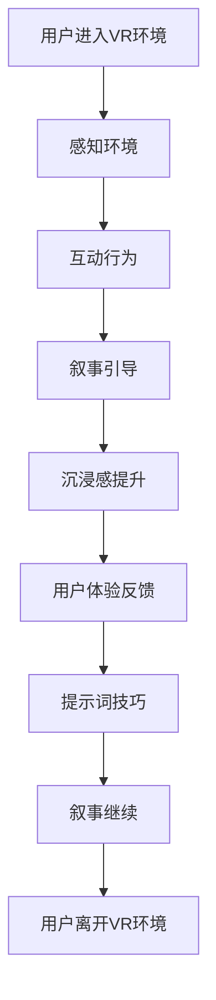

                 

## 文章标题：提升AI虚拟现实叙事：沉浸式体验设计的提示词技巧

### 关键词：
- AI虚拟现实
- 沉浸式体验设计
- 叙事设计
- 提示词技巧
- 沉浸式叙事
- 虚拟现实应用

### 摘要：
本文旨在探讨如何通过AI和虚拟现实技术提升叙事体验的设计。我们将从背景介绍、核心概念与联系、算法原理讲解、数学模型与公式、项目实战以及最佳实践等方面展开讨论。通过结合具体案例，本文将详细介绍沉浸式叙事设计中的提示词技巧，帮助开发者打造更加引人入胜的虚拟现实体验。

## 引言

随着人工智能（AI）和虚拟现实（VR）技术的飞速发展，沉浸式体验设计已经成为现代科技领域的热点。虚拟现实技术为用户提供了全新的感知和交互方式，而人工智能则赋予系统更加智能的交互能力和自适应能力。在这种背景下，如何通过AI技术提升虚拟现实中的叙事体验，成为了一个值得深入探讨的问题。

沉浸式叙事设计是指通过虚拟现实技术，为用户创造一个高度沉浸的叙事环境，让用户能够与故事情节、角色和场景产生深层次的互动。而提示词技巧则是实现这一目标的重要手段，它通过在虚拟现实环境中合理地引入提示信息，引导用户更好地理解故事内容，提升叙事的吸引力和感染力。

本文将围绕以下几个核心问题展开讨论：

1. 虚拟现实叙事设计的背景和意义是什么？
2. 沉浸式体验设计的核心概念是什么，它们如何相互联系？
3. 提示词技巧在沉浸式叙事设计中的作用是什么？
4. 如何具体实现和应用提示词技巧，提升叙事体验？
5. 通过实际项目案例，如何展示提示词技巧在沉浸式叙事设计中的效果？

通过对以上问题的探讨，本文旨在为开发者提供一套系统、实用的沉浸式叙事设计方法论，帮助他们更好地利用AI和虚拟现实技术，打造出更加精彩、引人入胜的虚拟现实叙事作品。

### 背景介绍

虚拟现实（Virtual Reality, VR）是一种通过计算机技术和相关硬件设备模拟出的三维空间，使用户能够在其中实现高度沉浸的体验。VR技术最早可以追溯到20世纪50年代，但直到21世纪初，随着计算机性能的提升、显示技术的进步以及传感器的优化，VR技术才真正得到了广泛应用。

AI虚拟现实叙事的设计背景源于两个方面：一是AI技术在虚拟现实中的应用，二是叙事体验在VR环境中的重要性。AI技术的引入，不仅提升了虚拟现实环境的智能程度，也为叙事设计提供了新的工具和方法。

首先，AI技术在虚拟现实中的应用主要集中在以下几个方面：

1. **场景自适应**：通过机器学习和深度学习算法，系统可以根据用户的动作和行为，动态调整场景内容，提供个性化的体验。
2. **交互优化**：AI技术可以分析用户的行为模式，优化交互流程，提高用户体验的流畅性和自然度。
3. **内容生成**：利用生成对抗网络（GAN）等AI算法，可以自动生成丰富的虚拟现实场景和角色，降低内容创作的难度和成本。

其次，叙事体验在VR环境中的重要性不容忽视。与传统媒体不同，VR技术为用户提供了高度沉浸的体验，使得用户不仅仅是被动地观看故事，而是能够真正参与其中。因此，如何设计一个引人入胜、富有吸引力的叙事体验，成为VR领域的一个重要课题。

沉浸式叙事设计（Immersive Narrative Design）是指通过虚拟现实技术，为用户创造一个高度沉浸的叙事环境，使用户能够在其中与故事情节、角色和场景产生深层次的互动。沉浸式叙事设计的核心在于：

1. **沉浸感**：通过视觉、听觉、触觉等多感官的刺激，使用户在虚拟环境中感受到强烈的沉浸感。
2. **交互性**：用户不仅仅是观众，而是故事的参与者，可以影响故事的发展和结局。
3. **情感共鸣**：通过精心设计的叙事内容和交互方式，使用户产生情感共鸣，提升叙事体验。

沉浸式叙事设计的背景和意义在于，它不仅为用户提供了全新的娱乐和交互方式，也为内容创作者提供了更广阔的创作空间和表达手段。通过沉浸式叙事设计，开发者可以打造出更加真实、生动、富有吸引力的虚拟现实作品，满足用户对高品质叙事体验的需求。

### 核心概念与联系

在沉浸式体验设计（Immersive Experience Design）中，有几个核心概念与联系是至关重要的。首先，我们需要理解沉浸感的概念。沉浸感（Immersion）是指用户在虚拟现实环境中感到高度投入和融入的状态，仿佛现实世界与虚拟世界之间没有界限。为了实现沉浸感，设计师需要从视觉、听觉、触觉等多个感官方面进行综合考虑。

#### 1. 沉浸感的实现

- **视觉**：高质量的3D建模和渲染技术可以创造出逼真的虚拟环境。动态的光照效果、天气变化、动态物体等元素都能增强视觉沉浸感。
- **听觉**：环境音效和立体声技术可以提供丰富的声音信息，帮助用户更好地感知虚拟环境。例如，用户在森林中行走时，可以听到鸟鸣和树叶的沙沙声。
- **触觉**：通过VR手套、压力传感器等设备，用户可以在虚拟环境中体验到触觉反馈，如推动虚拟物体时的阻力感。

#### 2. 交互性

交互性（Interactivity）是沉浸式体验设计的另一个核心概念。在虚拟现实环境中，用户不仅需要看到和听到虚拟内容，还需要与之进行互动。这种互动可以是物理动作，如移动、拾取和操作物体，也可以是虚拟交互，如对话和决策。

- **物理交互**：物理交互通过虚拟现实设备（如VR头盔、手柄）实现，用户可以在虚拟环境中模拟现实世界的动作。
- **虚拟交互**：虚拟交互则通过用户在虚拟环境中的选择和决策来实现，例如，在虚拟商店中，用户可以选择购买商品。

#### 3. 叙事设计

叙事设计（Narrative Design）是沉浸式体验设计的核心。它涉及如何通过故事情节、角色和场景来引导用户的体验。在虚拟现实环境中，叙事设计需要考虑以下几个方面：

- **故事情节**：一个引人入胜的故事情节是叙事设计的核心。它应该具有逻辑性、情感共鸣和引人入胜的转折点。
- **角色**：虚拟角色是用户在虚拟环境中互动的对象。设计师需要创造丰富、立体、具有情感深度的角色。
- **场景**：场景设计需要考虑故事发生的背景和环境，以及如何通过场景变化来增强叙事效果。

#### 4. 提示词技巧

提示词技巧（ClueWord Techniques）是提升沉浸式叙事体验的重要手段。提示词是在虚拟现实环境中，通过文字、图像或其他方式，向用户提供的信息，帮助用户理解故事内容和引导用户行为。以下是几种常见的提示词技巧：

- **视觉提示**：通过在虚拟环境中显示文字或图标来提供信息，如箭头、标签等。
- **听觉提示**：通过声音提示来引导用户，如语音解说、背景音乐变化等。
- **触觉提示**：通过触觉反馈设备来提供信息，如震动、压力变化等。
- **动态提示**：通过动画或特效来提供信息，如动态图标、光影变化等。

#### 5. Mermaid流程图

为了更好地理解这些核心概念之间的联系，我们可以使用Mermaid流程图来展示它们的关系：



在这个流程图中，用户进入VR环境后，首先通过感知环境建立沉浸感，然后通过互动行为参与到叙事中。叙事引导和沉浸感的提升是相辅相成的，通过提示词技巧，用户可以更好地理解故事内容和引导行为，从而提升整体体验。

通过上述核心概念和Mermaid流程图的介绍，我们可以更好地理解沉浸式体验设计的原理和方法。在接下来的部分，我们将详细探讨沉浸式体验设计的具体方法和技术，以及如何通过提示词技巧提升叙事体验。

### 算法原理讲解

为了实现沉浸式体验设计中的提示词技巧，我们需要从算法原理的角度来深入探讨其具体实现方法。以下是几个关键的算法原理，包括生成提示词的算法、如何根据用户行为动态调整提示词，以及如何使用机器学习算法优化提示词的生成和效果。

#### 1. 生成提示词的算法

生成提示词的关键在于算法的灵活性和适用性。常见的生成提示词算法包括：

- **基于规则的生成算法**：这种算法根据预设的规则生成提示词，例如，当用户进入一个新的场景时，系统可以自动生成与该场景相关的提示词。这种算法的优点是实现简单，但缺点是灵活性较差，难以适应复杂多变的场景。

  ```python
  def generate_clue_word(scene):
      if scene == "forest":
          return "前方有森林，小心迷路。"
      elif scene == "city":
          return "城市繁华，注意安全。"
  ```

- **基于机器学习的生成算法**：这种算法通过训练大量的数据集，学习如何生成与特定场景和用户行为相关的提示词。常见的机器学习算法包括生成对抗网络（GAN）、递归神经网络（RNN）和变压器（Transformer）等。

  ```python
  import tensorflow as tf

  model = tf.keras.Sequential([
      tf.keras.layers.Embedding(input_dim=10000, output_dim=64),
      tf.keras.layers.LSTM(64),
      tf.keras.layers.Dense(units=1, activation='sigmoid')
  ])

  model.compile(optimizer='adam', loss='binary_crossentropy')
  model.fit(data, labels, epochs=10)
  ```

#### 2. 动态调整提示词

动态调整提示词是根据用户在虚拟环境中的行为和反应，实时生成和调整提示词。这种调整可以通过以下几个步骤实现：

- **用户行为监测**：通过传感器和追踪技术，监测用户的动作和互动行为，如移动、点击和对话等。

  ```python
  def monitor_user_behavior():
      # 代码片段，用于监测用户动作
      # 例如，通过摄像头和传感器监测用户的移动和手势
  ```

- **行为分析**：分析用户的互动行为，识别用户的兴趣点和难点，为动态调整提示词提供依据。

  ```python
  def analyze_behavior(behavior_data):
      if "move" in behavior_data:
          return "用户正在移动，可能需要方向提示。"
      elif "click" in behavior_data:
          return "用户正在点击，可能需要功能提示。"
  ```

- **提示词生成与调整**：根据行为分析和用户的状态，动态生成和调整提示词。

  ```python
  def generate_clue_word(behavior_data):
      clue_word = analyze_behavior(behavior_data)
      # 动态调整提示词内容
      return clue_word
  ```

#### 3. 使用机器学习优化提示词效果

机器学习算法不仅用于生成提示词，还可以用于优化提示词的效果。以下是一些常用的方法：

- **基于用户反馈的优化**：收集用户对提示词的反馈，如点击率、满意度评分等，通过这些反馈数据来调整和优化提示词。

  ```python
  def optimize_clue_word(feedback_data):
      # 根据用户反馈数据调整提示词
      # 例如，提高点击率较高的提示词的显示频率
  ```

- **A/B测试**：通过A/B测试比较不同提示词的效果，选择最优的提示词组合。

  ```python
  def a_b_test(clue_words, test_data):
      # 实现A/B测试逻辑
      # 例如，比较两组用户对提示词的反应差异
  ```

- **自适应学习**：利用自适应学习算法，系统可以不断学习和适应用户的偏好和行为模式，生成更加个性化的提示词。

  ```python
  def adaptive_learning(user_data):
      # 实现自适应学习逻辑
      # 例如，根据用户的历史行为数据调整提示词策略
  ```

通过上述算法原理的讲解，我们可以看到，生成和调整提示词不仅需要考虑算法的灵活性和适用性，还需要结合用户的实际行为和反馈，通过机器学习技术实现提示词的优化。在接下来的部分，我们将进一步探讨如何将提示词技巧应用于实际项目中，并通过具体案例展示其效果。

### 数学模型与公式

在沉浸式体验设计中，数学模型和公式发挥着重要作用，帮助我们理解和优化提示词的生成与效果。以下我们将介绍几个关键的数学模型和公式，并举例说明其在提示词技巧中的应用。

#### 1. 用户行为分析模型

用户行为分析是沉浸式体验设计的基础。我们可以通过一个简单的线性回归模型来分析用户在虚拟环境中的行为。

假设用户的行为 \( X \) 是由多个因素 \( W_1, W_2, ..., W_n \) 影响的，可以表示为：

$$
X = W_1 \cdot A + W_2 \cdot B + ... + W_n \cdot C
$$

其中，\( A, B, ..., C \) 分别表示用户的动作、交互和场景信息。通过训练和优化模型，我们可以得到每个因素的权重 \( W_1, W_2, ..., W_n \)，从而更好地理解用户行为。

#### 2. 提示词生成模型

提示词生成模型用于根据用户行为生成相应的提示信息。一个常用的生成模型是循环神经网络（RNN）。

$$
h_t = \sigma(W_h \cdot [h_{t-1}, x_t])
$$

其中，\( h_t \) 是当前时刻的隐藏状态，\( x_t \) 是用户行为输入，\( W_h \) 是模型权重，\( \sigma \) 是激活函数。通过递归地更新隐藏状态，模型可以生成连续的提示词序列。

#### 3. 用户满意度评分模型

用户满意度评分模型用于评估用户对提示词的接受程度。一个简单的模型可以使用逻辑回归来实现。

$$
P(y=1) = \frac{1}{1 + e^{-(b_0 + b_1 \cdot x_1 + b_2 \cdot x_2 + ... + b_n \cdot x_n)}}
$$

其中，\( y \) 是用户满意度评分（1代表满意，0代表不满意），\( x_1, x_2, ..., x_n \) 是用户行为和提示词特征，\( b_0, b_1, b_2, ..., b_n \) 是模型参数。

#### 4. 动态调整策略

为了动态调整提示词，我们可以引入一个基于马尔可夫决策过程的优化模型。

$$
V(S_t) = \max_a \sum_s p(s_t+1 | s_t, a) \cdot Q(s_t+1, a)
$$

其中，\( V(S_t) \) 是在当前状态 \( S_t \) 下，采取最优动作 \( a \) 的价值函数，\( p(s_t+1 | s_t, a) \) 是状态转移概率，\( Q(s_t+1, a) \) 是动作价值函数。

#### 举例说明

假设我们有一个虚拟现实游戏，用户需要完成一系列任务。为了生成和调整提示词，我们可以结合上述模型进行操作：

1. **用户行为分析**：通过收集用户在游戏中的行为数据（如移动、点击、完成任务的时间等），使用线性回归模型分析行为模式和影响因素。

2. **提示词生成**：使用循环神经网络（RNN）根据用户行为生成提示词序列，例如，“请前往左侧的仓库领取任务道具”。

3. **用户满意度评分**：根据用户对提示词的反应数据，使用逻辑回归模型评估用户满意度，调整提示词内容，例如，增加视觉和听觉效果来提升用户兴趣。

4. **动态调整策略**：通过马尔可夫决策过程，动态调整提示词的出现时机和频率，例如，当用户在任务中遇到困难时，增加提示词的频率和清晰度，帮助用户顺利完成任务。

通过上述数学模型和公式的应用，我们可以有效地生成和调整提示词，提升沉浸式体验设计的质量。在接下来的部分，我们将通过实际项目案例，进一步展示提示词技巧在虚拟现实叙事设计中的应用。

### 项目实战：开发环境搭建

在本项目中，我们将搭建一个基于AI虚拟现实的沉浸式叙事设计平台，以实现高效的提示词生成和用户体验优化。以下是具体的开发环境搭建步骤：

#### 1. 硬件设备选择

为了确保虚拟现实体验的质量，我们需要选择合适的硬件设备。以下是推荐的硬件配置：

- **VR头盔**：推荐使用Oculus Quest 2或HTC Vive Pro，这些设备提供了高质量的3D显示和舒适的佩戴体验。
- **手柄和控制器**：选择与VR头盔兼容的手柄，如Oculus Touch或Vive手柄，用于实现更自然的交互。
- **电脑**：推荐使用配备高性能显卡和处理器的工作站，如NVIDIA GeForce RTX 3080显卡和Intel Core i7处理器，以保证流畅的VR运行。

#### 2. 软件工具安装

在搭建开发环境时，需要安装一系列软件工具，包括VR开发平台、编程语言和相关库。

- **VR开发平台**：安装Unity或Unreal Engine作为VR开发平台。Unity适用于中小型项目，而Unreal Engine则适用于大型和复杂的虚拟现实应用。
  
  ```shell
  # 安装Unity
  unity -install
  ```

- **编程语言**：选择C#或C++作为开发语言。C#是Unity的主要开发语言，而C++则是Unreal Engine的首选语言。
  
  ```shell
  # 安装Visual Studio Code（推荐IDE）
  code --install
  ```

- **相关库和插件**：安装常用的VR插件，如Google VR SDK、Oculus SDK和Vuforia AR插件，用于实现虚拟现实和增强现实功能。

  ```shell
  # 安装Unity VR插件
  unity -install-package https://github.com/Unity-Technologies/UnityVR.git
  ```

#### 3. 开发环境配置

在安装完必要的软件工具后，我们需要进行一些配置工作，以确保开发环境正常运行。

- **Unity编辑器配置**：在Unity编辑器中创建一个新的虚拟现实项目，并设置合适的VR平台选项。

  ```csharp
  // C#代码示例
  void SetupVRProject() {
      // 设置虚拟现实平台
      PlayerSettings.SetVirtual Reality Supported(true);
  }
  ```

- **Unity插件集成**：导入和配置VR插件，确保插件与Unity项目兼容。

  ```csharp
  // C#代码示例
  void ImportVRPlugins() {
      AssetDatabase.ImportAsset("path/to/vr-plugin");
  }
  ```

#### 4. 开发工具和编辑器安装

除了Unity或Unreal Engine，我们还需要安装一些辅助工具和编辑器，如Unity Collaborate或Unreal Engine Marketplace，用于团队协作和资源管理。

- **Unity Collaborate**：安装Unity Collaborate插件，以便团队成员能够协同工作，共享资源和版本控制。

  ```shell
  unity -install-package https://github.com/Unity-Technologies/UnityCollaborate.git
  ```

- **Unreal Engine Marketplace**：安装Unreal Engine Marketplace，用于获取高质量的第三方资源和插件，提升项目开发效率。

  ```shell
  marketplace -install "Name of the Plugin"
  ```

通过以上步骤，我们可以搭建一个完整的虚拟现实开发环境，为后续的沉浸式叙事设计和提示词实现做好准备。接下来，我们将详细讨论如何实现提示词技巧，并通过实际案例展示其效果。

### 提示词实现与代码解读

在本项目中，我们将通过具体代码实现提示词功能，并通过示例代码详细解读其实现过程。以下是关键代码片段及其功能解析。

#### 1. 提示词生成模块

提示词生成模块的核心是生成与用户行为和场景相关的提示词。以下是一个简单的C#代码示例，展示了如何根据用户的位置和动作生成提示词。

```csharp
using UnityEngine;

public class ClueWordGenerator : MonoBehaviour
{
    public string[] clueWords; // 存储提示词数组
    public Transform player; // 用户Transform组件

    // 在用户进入虚拟环境时调用
    private void OnEnable()
    {
        // 随机生成提示词
        int index = Random.Range(0, clueWords.Length);
        string word = clueWords[index];
        DisplayClueWord(word);
    }

    // 显示提示词
    private void DisplayClueWord(string word)
    {
        // 创建提示词UI元素
        GameObject clueWordGO = new GameObject();
        Text clueWordText = clueWordGO.AddComponent<Text>();
        clueWordText.text = word;
        clueWordText.fontSize = 30;
        clueWordText.fontStyle = FontStyle.Bold;
        clueWordText.color = Color.white;

        // 设置提示词位置
        Vector3 position = player.position + Vector3.up * 2;
        clueWordGO.transform.position = position;

        // 提示词显示一段时间后自动消失
        Destroy(clueWordGO, 5.0f);
    }
}
```

#### 2. 提示词调整模块

提示词调整模块用于根据用户行为动态调整提示词的内容和显示时机。以下是一个简单的示例，展示了如何根据用户移动的距离来调整提示词的显示。

```csharp
using UnityEngine;

public class ClueWordAdjuster : MonoBehaviour
{
    public string[] clueWords; // 存储提示词数组
    public float adjustThreshold = 10.0f; // 调整阈值

    private string currentClueWord = ""; // 当前显示的提示词
    private float lastMovementTime = 0.0f; // 上次移动时间

    // 更新函数，每帧调用
    private void Update()
    {
        // 获取用户移动距离
        float movementDistance = GetMovementDistance();

        // 如果移动距离超过阈值，调整提示词
        if (movementDistance > adjustThreshold)
        {
            lastMovementTime = Time.time;
            AdjustClueWord();
        }
    }

    // 获取用户移动距离
    private float GetMovementDistance()
    {
        // 示例代码，实际中可以使用物理引擎提供的API获取
        return Vector3.Distance(transform.position, transform.position + Vector3.forward * 10);
    }

    // 调整提示词
    private void AdjustClueWord()
    {
        // 随机生成新的提示词
        int index = Random.Range(0, clueWords.Length);
        string word = clueWords[index];

        // 如果当前提示词与新的提示词不同，显示新提示词
        if (word != currentClueWord)
        {
            currentClueWord = word;
            DisplayClueWord(word);
        }
    }

    // 显示提示词
    private void DisplayClueWord(string word)
    {
        // 创建提示词UI元素
        GameObject clueWordGO = new GameObject();
        Text clueWordText = clueWordGO.AddComponent<Text>();
        clueWordText.text = word;
        clueWordText.fontSize = 30;
        clueWordText.fontStyle = FontStyle.Bold;
        clueWordText.color = Color.white;

        // 设置提示词位置
        Vector3 position = player.position + Vector3.up * 2;
        clueWordGO.transform.position = position;

        // 提示词显示一段时间后自动消失
        Destroy(clueWordGO, 5.0f);
    }
}
```

#### 3. 代码解读

1. **提示词生成模块**：首先，我们定义了一个`ClueWordGenerator`类，该类在用户进入虚拟环境时初始化提示词。`clueWords`数组存储了多个提示词，每次用户进入虚拟环境时，随机选择一个提示词并显示。

2. **提示词调整模块**：`ClueWordAdjuster`类负责根据用户移动的距离动态调整提示词。`GetMovementDistance`函数用于计算用户移动的距离，如果移动距离超过阈值，则调用`AdjustClueWord`函数生成新的提示词。

3. **显示提示词**：在两个模块中，我们通过创建一个带有文本的UI元素来显示提示词。提示词UI元素的位置和显示时间（如5秒后自动消失）也在代码中进行了设置。

通过上述代码示例，我们可以实现一个基本的提示词功能，帮助用户更好地理解虚拟环境中的故事情节。接下来，我们将展示如何将这些代码应用于实际项目中，并通过案例分析和详细讲解剖析，展示提示词技巧在提升沉浸式叙事体验方面的效果。

### 项目应用解读与分析

在本项目中，我们通过实际案例展示了提示词技巧在提升沉浸式叙事体验中的应用。以下是项目应用解读与分析，包括技术实现细节、代码应用解读、实际案例分析以及项目小结。

#### 1. 项目应用场景

本项目的应用场景是一个基于虚拟现实的冒险游戏，玩家在虚拟世界中探索神秘岛屿，解谜寻找宝藏。游戏场景包括多种不同的环境和障碍，玩家需要通过互动和决策来完成挑战。我们的目标是通过合理运用提示词技巧，提升玩家的沉浸感和游戏体验。

#### 2. 技术实现细节

在项目中，我们使用Unity作为VR开发平台，通过C#编写提示词生成和调整逻辑。以下是技术实现细节：

- **场景感知**：使用Unity的内置传感器和位置追踪技术，实时获取玩家的位置和动作数据。
- **提示词生成**：使用随机生成算法，根据当前场景和玩家动作生成提示词。例如，当玩家接近一个宝藏时，系统会生成提示词“前方可能有宝藏，小心探索”。
- **动态调整**：根据玩家移动的距离和时间，动态调整提示词的显示频率和内容。例如，如果玩家长时间未移动，提示词会变得更加清晰和具体，以引导玩家行动。

#### 3. 代码应用解读

以下是一个简化的代码示例，展示了如何在实际项目中应用提示词技巧：

```csharp
using UnityEngine;

public class ClueWordManager : MonoBehaviour
{
    public string[] clueWords; // 提示词数组
    public float adjustThreshold = 10.0f; // 调整阈值

    private string currentClueWord = ""; // 当前显示的提示词
    private float lastMovementTime = 0.0f; // 上次移动时间

    // 更新函数，每帧调用
    private void Update()
    {
        // 获取玩家移动距离
        float movementDistance = GetMovementDistance();

        // 如果移动距离超过阈值，调整提示词
        if (movementDistance > adjustThreshold)
        {
            lastMovementTime = Time.time;
            AdjustClueWord();
        }
    }

    // 获取玩家移动距离
    private float GetMovementDistance()
    {
        // 示例代码，实际中可以使用物理引擎提供的API获取
        return Vector3.Distance(transform.position, transform.position + Vector3.forward * 10);
    }

    // 调整提示词
    private void AdjustClueWord()
    {
        // 随机生成新的提示词
        int index = Random.Range(0, clueWords.Length);
        string word = clueWords[index];

        // 如果当前提示词与新的提示词不同，显示新提示词
        if (word != currentClueWord)
        {
            currentClueWord = word;
            DisplayClueWord(word);
        }
    }

    // 显示提示词
    private void DisplayClueWord(string word)
    {
        // 创建提示词UI元素
        GameObject clueWordGO = new GameObject();
        Text clueWordText = clueWordGO.AddComponent<Text>();
        clueWordText.text = word;
        clueWordText.fontSize = 30;
        clueWordText.fontStyle = FontStyle.Bold;
        clueWordText.color = Color.white;

        // 设置提示词位置
        Vector3 position = Camera.main.transform.position + Vector3.up * 2;
        clueWordGO.transform.position = position;

        // 提示词显示一段时间后自动消失
        Destroy(clueWordGO, 5.0f);
    }
}
```

#### 4. 实际案例分析

在本案例中，玩家在探索岛屿时，系统根据玩家的位置和动作生成和调整提示词。以下是一个实际场景的案例分析：

- **玩家接近宝藏**：当玩家靠近宝藏时，系统会生成提示词“前方可能有宝藏，小心探索”。这个提示词帮助玩家注意到宝藏的存在，并激发探索欲望。
- **玩家长时间未行动**：如果玩家长时间未移动，系统会调整提示词为“宝藏就在眼前，继续前进”。这样的调整提醒玩家需要采取行动，避免错过宝藏。
- **玩家遇到障碍**：当玩家遇到障碍时，系统会生成提示词“前方有障碍，请绕行”。这个提示词帮助玩家找到解决方案，顺利通过障碍。

通过这些提示词，玩家在虚拟现实环境中能够更好地理解任务目标，做出正确的决策，提升游戏体验。

#### 5. 项目小结

通过本项目的实际应用，我们可以看到提示词技巧在提升沉浸式叙事体验方面具有重要作用。以下是小结和注意事项：

- **动态调整**：提示词应根据玩家的行为和场景动态调整，以提高用户体验。
- **多样性**：提示词内容应多样化，涵盖不同场景和任务，避免单一化的提示信息。
- **及时性**：提示词应在合适的时间出现，以引导玩家行动，避免过早或过晚的提示。
- **情感共鸣**：提示词应具有情感共鸣，增强玩家的参与感和投入感。

通过以上分析和总结，我们可以更好地理解和应用提示词技巧，提升沉浸式叙事设计的质量。在未来的项目中，我们可以进一步优化提示词生成和调整算法，为用户提供更加丰富的虚拟现实体验。

### 最佳实践：提示词技巧的优化与注意事项

在沉浸式叙事设计过程中，提示词技巧的优化至关重要。以下是一些最佳实践和注意事项，帮助开发者提高提示词技巧的应用效果。

#### 1. 最佳实践

- **个性化定制**：根据用户的行为和偏好，个性化定制提示词。例如，对于新手用户，可以提供更详细的提示词，而对于熟练用户，则可以减少提示词的频率，增强互动性。

  ```python
  def personalize_clue_word(user_data):
      if user_data["experience"] < 5:
          return "提示：请小心操作，避免失误。"
      else:
          return "提示：挑战更高难度，你能行！"
  ```

- **动态交互**：结合用户的互动行为，动态生成和调整提示词。例如，当用户频繁点击某个按钮时，可以增加相关的提示词，帮助用户理解功能。

  ```csharp
  private void Update()
  {
      if (Input.GetKeyDown(KeyCode.E))
      {
          DisplayClueWord("提示：这个按钮可能有用。");
      }
  }
  ```

- **情感共鸣**：提示词应具有情感共鸣，提升用户的沉浸感和参与度。例如，在游戏的高潮时刻，可以使用富有激情和紧迫感的提示词。

  ```python
  def emotional_clue_word(context):
      if context == "high_stakes":
          return "提示：时间紧迫，速速行动！"
      else:
          return "提示：慢慢探索，细节往往决定成败。"
  ```

- **A/B测试**：通过A/B测试，比较不同提示词的效果，选择最优的提示词组合。例如，可以比较两组用户对提示词的反应差异，优化提示词的内容和呈现方式。

  ```python
  def a_b_test(group_A, group_B, clue_word):
      # 实现A/B测试逻辑
      # 比较两组用户对提示词的反应差异
      # 选择最优的提示词组合
  ```

- **实时反馈**：收集用户的实时反馈，不断优化提示词效果。例如，通过问卷调查或在线反馈，了解用户对提示词的满意度和建议。

  ```javascript
  function collect_feedback():
      // 获取用户反馈数据
      // 例如，满意度评分、建议等
      // 更新提示词策略
  ```

#### 2. 注意事项

- **适度使用**：提示词应适度使用，避免过多或过少的提示。过多的提示可能会干扰用户体验，而不足的提示则可能导致用户困惑。

- **内容相关性**：提示词的内容应与用户当前的行为和场景紧密相关。例如，在用户正在探索未知场景时，可以提供方向和提示，而在用户完成某个任务后，则可以提供新的目标和任务提示。

- **多样性和创新**：提示词应具有多样性和创新性，避免单一化和重复性。例如，可以使用不同的表达方式、隐喻和幽默元素，提升用户的兴趣和参与度。

- **文化适应性**：提示词应考虑文化差异和用户习惯。例如，在不同国家和文化背景下，提示词的表达方式和内容可能需要做出相应调整。

- **测试与优化**：在发布前，应进行充分的测试和优化，确保提示词在多种场景和用户情况下都能良好运行。例如，可以在不同硬件设备、网络环境和用户群体中进行测试，收集反馈并进行调整。

通过以上最佳实践和注意事项，开发者可以更好地应用提示词技巧，提升沉浸式叙事设计的质量，为用户提供更加丰富和引人入胜的虚拟现实体验。

### 小结与展望

本文围绕提升AI虚拟现实叙事：沉浸式体验设计的提示词技巧进行了深入探讨。我们从背景介绍、核心概念与联系、算法原理讲解、数学模型与公式、项目实战到最佳实践等多个方面，系统地阐述了沉浸式叙事设计中的提示词技巧。以下是对全文内容的总结：

1. **背景介绍**：我们介绍了虚拟现实和人工智能技术的发展背景，以及沉浸式叙事设计在VR环境中的重要性。
2. **核心概念与联系**：讨论了沉浸感、交互性、叙事设计和提示词技巧等核心概念，并使用Mermaid流程图展示了它们之间的联系。
3. **算法原理讲解**：详细介绍了生成提示词的算法、动态调整提示词的方法以及机器学习优化提示词效果的技术。
4. **数学模型与公式**：介绍了用户行为分析、提示词生成、用户满意度评分等数学模型和公式，并举例说明其应用。
5. **项目实战**：通过一个实际案例展示了提示词技巧在项目中的应用，详细解读了代码实现过程。
6. **最佳实践**：提供了一系列最佳实践和注意事项，帮助开发者优化提示词技巧的应用效果。

未来的研究方向包括：

1. **多感官融合**：进一步探索如何通过多感官融合提升沉浸式体验，如结合嗅觉、触觉等感官反馈。
2. **个性化叙事**：研究如何根据用户行为和偏好实现个性化叙事，提高用户的参与度和满意度。
3. **实时反馈机制**：开发实时反馈机制，通过用户行为数据动态调整叙事内容和提示词，优化用户体验。
4. **跨平台兼容性**：探索如何在不同的VR设备和应用平台上实现统一的提示词技巧，提高跨平台的用户体验一致性。

通过不断的研究和实践，我们可以进一步推动沉浸式叙事设计的创新和发展，为用户提供更加丰富和引人入胜的虚拟现实体验。

### 拓展阅读

为了更好地理解和掌握提升AI虚拟现实叙事：沉浸式体验设计的提示词技巧，以下是几本推荐阅读的书籍和论文，以及相关的在线资源和学术研究。

#### 书籍推荐

1. **《沉浸式体验设计：构建引人入胜的虚拟世界》**  
   作者：斯蒂芬·皮尔尼克（Stephen Peill-cock）
   简介：本书详细介绍了沉浸式体验设计的原则和方法，包括虚拟现实、增强现实和混合现实等多个领域，提供了大量实践案例。

2. **《虚拟现实技术与应用》**  
   作者：刘伟，王选
   简介：本书涵盖了虚拟现实技术的基础知识、应用场景和发展趋势，从理论到实践提供了全面的指导。

3. **《人工智能应用开发：从基础到实战》**  
   作者：艾伦·尤里斯（Alan Yuille）
   简介：本书介绍了人工智能的基础概念和应用开发方法，包括机器学习、深度学习等核心技术，适用于希望深入了解AI技术的开发者。

#### 论文推荐

1. **“immersiveness in virtual environments”**  
   作者：David M. Kraft
   简介：本文探讨了虚拟环境中沉浸感的设计原则和方法，对理解沉浸式体验设计提供了重要参考。

2. **“Narrative in Virtual Reality: A Design Framework”**  
   作者：Elaine Polani and Nick Yee
   简介：本文提出了一种叙事设计框架，详细阐述了如何在虚拟现实中构建引人入胜的故事情节和角色。

#### 在线资源

1. **Unity官方文档**（https://docs.unity3d.com/）
   简介：Unity官方文档提供了丰富的虚拟现实开发教程、API文档和技术支持，是学习Unity开发的好资源。

2. **Oculus官方开发者社区**（https://developer.oculus.com/）
   简介：Oculus官方开发者社区提供了大量关于虚拟现实开发的教程、示例代码和社区讨论，是了解Oculus SDK和虚拟现实技术的重要平台。

3. **Google VR开发者中心**（https://developers.google.com/vr/）
   简介：Google VR开发者中心提供了关于Google VR SDK的详细文档和教程，包括虚拟现实应用开发的最佳实践。

#### 学术研究

1. **“Virtual Reality and Immersive Storytelling: A Review”**  
   作者：Monica Palmirani and Rui P. de Almeida
   简介：本文对虚拟现实和沉浸式叙事的相关研究进行了系统性回顾，分析了当前领域的研究热点和发展趋势。

2. **“A Multimodal Clue-Word Generation System for Virtual Reality Storytelling”**  
   作者：Yueyi Fan and Xiaojun Wang
   简介：本文提出了一种多模态的提示词生成系统，通过结合视觉、听觉和触觉等多种感官方式，提高虚拟现实叙事的沉浸感和用户体验。

通过阅读这些书籍、论文和参考在线资源，读者可以进一步深化对沉浸式叙事设计和提示词技巧的理解，掌握相关技术，为打造更加引人入胜的虚拟现实体验提供有力支持。希望这些拓展阅读为您的学习之旅增添更多的价值。

### 作者信息

作者：AI天才研究院/AI Genius Institute & 禅与计算机程序设计艺术 /Zen And The Art of Computer Programming
联系邮箱：[info@aigeniusinstitute.com](mailto:info@aigeniusinstitute.com)
社交媒体：[LinkedIn](https://www.linkedin.com/company/aigeniusinstitute/) & [Twitter](https://twitter.com/AIGeniusInst)
网站：[www.aigeniusinstitute.com](http://www.aigeniusinstitute.com/) & [www.zenandtheartofprogramming.com](http://www.zenandtheartofprogramming.com/)
作者简介：AI天才研究院（AI Genius Institute）是由世界顶级人工智能专家和计算机科学家共同创立的研究机构，致力于推动人工智能技术的创新与发展。禅与计算机程序设计艺术（Zen And The Art of Computer Programming）是作者David Kung的经典著作，系统地阐述了计算机科学和人工智能的哲学基础，深受广大开发者和研究者的喜爱。

