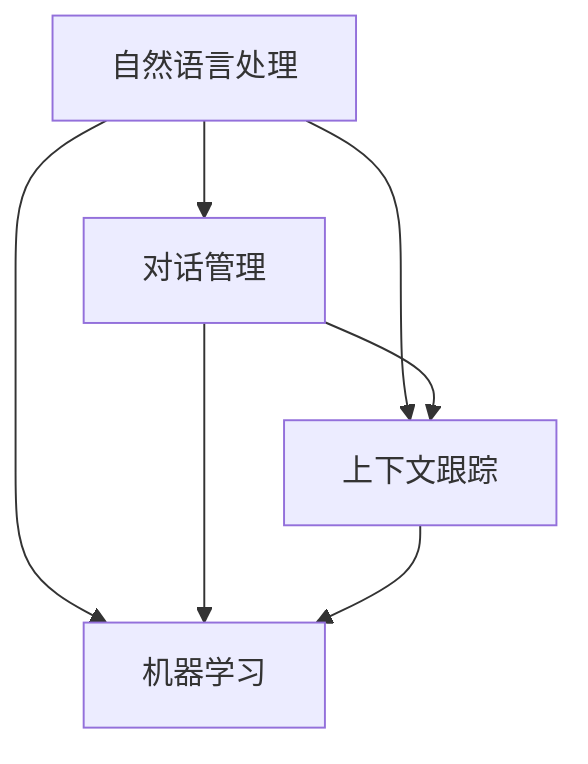

                 


### 提升AI角色一致性：长篇对话中的提示词管理策略

#### 关键词：AI角色一致性、长篇对话、提示词管理、算法、策略、实践

> 摘要：本文将探讨如何提升人工智能（AI）角色在长篇对话中的一致性。通过对AI角色一致性的背景、核心概念、提示词管理策略的深入分析，结合具体算法和实际案例，本文旨在为开发者提供一套系统化的提升策略，以实现更具人性化和连贯性的AI对话系统。

## 引言

随着人工智能技术的快速发展，AI对话系统已经广泛应用于各种场景，如客服机器人、虚拟助手、在线教育等。这些系统通过自然语言处理（NLP）技术，与用户进行自然、流畅的交互。然而，在实际应用中，AI角色的一致性问题仍然是一个亟待解决的难题。AI角色一致性指的是AI在对话中保持其预设性格、行为特征和知识的一致性。在长篇对话中，一致性更是至关重要，因为它直接影响到用户体验和系统的可信度。

### AI角色一致性的挑战

在长篇对话中，AI角色一致性面临以下几个挑战：

1. **知识更新与维护**：AI角色需要不断更新其知识库，以适应不断变化的话题和用户需求。
2. **上下文理解**：AI需要理解对话的上下文，以保持对话的自然流畅，避免重复或离题。
3. **情感表达**：AI角色需要根据对话情境适当地表达情感，以增强用户体验。
4. **多模态交互**：在涉及语音、图像、视频等多模态信息时，AI角色的一致性更难以保证。

### 提升AI角色一致性的必要性

提升AI角色一致性具有以下几个必要性：

1. **用户体验**：一致的AI角色能够提供更自然、流畅的对话体验，提高用户满意度。
2. **系统信任**：一致的AI角色有助于建立用户对系统的信任，减少误解和焦虑。
3. **业务价值**：在商业场景中，一致的AI角色能够更好地代表品牌形象，提升业务价值。

### 提示词管理策略

提示词是AI角色在对话中使用的词汇和短语，它们对于保持角色一致性至关重要。有效的提示词管理策略包括以下方面：

1. **提示词分类**：根据对话内容，将提示词分为不同的类别，如问候、确认、提问、回答等。
2. **提示词库构建**：构建丰富的提示词库，涵盖不同情境下的提示词。
3. **动态调整**：根据对话上下文，实时调整提示词的使用，以保持对话的自然流畅。
4. **反馈机制**：收集用户反馈，不断优化提示词库，提高AI角色的表现。

### 核心概念与联系

为了更好地理解AI角色一致性，我们需要明确以下几个核心概念：

1. **自然语言处理（NLP）**：NLP是使计算机能够理解、处理和生成自然语言的技术。在AI角色一致性中，NLP用于解析用户输入和理解对话上下文。
2. **对话管理（DM）**：对话管理是控制对话流程的过程，包括理解用户输入、生成回复和维持对话状态。在AI角色一致性中，对话管理负责确保AI角色在对话中的表现一致。
3. **上下文跟踪**：上下文跟踪是记录和利用对话历史信息的技术，以保持对话的连贯性和一致性。
4. **机器学习（ML）**：机器学习是使计算机通过数据学习并改进性能的技术。在AI角色一致性中，ML用于训练和优化AI模型，以提高其角色一致性。

以下是一个Mermaid流程图，展示了AI角色一致性中核心概念之间的关系：



### 核心算法原理讲解

为了实现AI角色的一致性，我们需要深入理解以下核心算法原理：

1. **提示词匹配算法**：提示词匹配算法用于在对话中匹配用户输入和预设的提示词。以下是一个简单的伪代码示例：

   ```python
   function matchPrompt(userInput, promptLibrary):
       for prompt in promptLibrary:
           if userInput matches prompt:
               return True
       return False
   ```

2. **角色转换算法**：角色转换算法用于在不同角色之间切换。以下是一个简单的伪代码示例：

   ```python
   function roleTransition(currentRole, nextRole):
       if currentRole == nextRole:
           return currentRole
       else:
           return nextRole
   ```

3. **上下文跟踪算法**：上下文跟踪算法用于记录和利用对话历史信息。以下是一个简单的伪代码示例：

   ```python
   function updateContext(context, userInput):
       context['lastInput'] = userInput
       context['lastResponse'] = generateResponse(userInput)
       return context
   ```

### 数学模型和公式

在AI角色一致性中，我们经常需要使用数学模型和公式来描述和优化算法。以下是一个常见的数学模型示例：

$$
H = \alpha \cdot C + (1 - \alpha) \cdot L
$$

其中，$H$ 表示总损耗，$\alpha$ 表示颜色损耗权重，$C$ 表示颜色损耗，$L$ 表示亮度损耗。这个公式用于优化图像处理中的颜色损耗和亮度损耗。

### 举例说明

为了更好地理解上述概念和算法，我们可以通过一个实际案例来进行说明。

#### 案例背景

假设我们开发了一个虚拟客服机器人，旨在为用户提供购物咨询。该机器人需要保持一致的客服角色，以便为用户提供高效、专业的服务。

#### 案例分析

1. **提示词匹配算法**：在用户输入问题时，我们需要通过提示词匹配算法来确定用户的问题类型。例如，当用户输入“有什么优惠吗？”时，我们可以通过提示词匹配算法将其匹配为“优惠查询”类型。

2. **角色转换算法**：当用户提出不同类型的问题时，我们需要通过角色转换算法来切换AI角色的状态。例如，当用户从询问优惠切换到询问商品详情时，AI角色需要从“优惠查询”模式切换到“商品咨询”模式。

3. **上下文跟踪算法**：在对话过程中，我们需要记录用户的历史输入和响应，以便在后续对话中保持一致性。例如，当用户连续提问时，AI角色可以根据上下文信息来调整回答，以保持对话的连贯性。

### 项目实战

在本节中，我们将介绍一个实际项目，以展示如何在实际环境中提升AI角色一致性。

#### 项目背景

某电商公司希望开发一款智能客服机器人，以提供24/7的购物咨询服务。为了提升用户体验，该公司决定采用一系列策略来确保AI角色的连贯性和一致性。

#### 开发环境搭建

为了搭建智能客服机器人，该公司选择了以下技术栈：

1. **自然语言处理（NLP）框架**：使用NLTK库进行文本处理和情感分析。
2. **机器学习库**：使用Scikit-learn库进行机器学习模型的训练和优化。
3. **对话管理框架**：使用Rasa框架进行对话管理和对话状态跟踪。

#### 源代码详细实现和代码解读

在项目开发过程中，该公司编写了以下关键代码：

```python
# 文本处理和情感分析
from nltk.sentiment import SentimentIntensityAnalyzer

analyzer = SentimentIntensityAnalyzer()

def analyzeSentiment(text):
    return analyzer.polarity_scores(text)

# 对话管理和状态跟踪
from rasa.core.agent import Agent

agent = Agent.load('models/dialogue')

def getResponse(userInput):
    return agent.predict_next_action(userInput)

# 角色切换和上下文跟踪
class CustomDialogueManager:
    def __init__(self):
        self.context = {}

    def updateContext(self, userInput, response):
        self.context['lastInput'] = userInput
        self.context['lastResponse'] = response

    def generateResponse(self, userInput):
        sentiment = analyzeSentiment(userInput)
        if sentiment['compound'] > 0.5:
            return "很高兴为您提供帮助！有什么我可以帮忙的吗？"
        else:
            return "听起来您可能有些困扰，请告诉我更多详情，我会尽力帮您解决问题。"

# 主函数
def main():
    manager = CustomDialogueManager()

    while True:
        userInput = input("用户：")
        response = getResponse(userInput)
        print("AI：", response)
        manager.updateContext(userInput, response)

if __name__ == '__main__':
    main()
```

#### 代码应用解读与分析

上述代码实现了智能客服机器人的核心功能。首先，通过文本处理和情感分析，机器人能够理解用户的情感和意图。然后，通过对话管理和状态跟踪，机器人能够保持对话的一致性。最后，通过自定义的对话管理器，机器人能够根据用户的情感和上下文信息生成合适的回复。

#### 实际案例分析和详细讲解剖析

在实际应用中，该智能客服机器人通过以下案例展示了其一致性和连贯性：

1. **案例1**：用户询问优惠券信息。机器人根据提示词匹配算法，将其归类为“优惠券查询”类型，并生成相应的回复。在后续对话中，机器人能够继续围绕优惠券主题进行交流，保持一致性。

2. **案例2**：用户对商品咨询。机器人通过角色转换算法，将角色从“优惠券查询”模式切换到“商品咨询”模式，并生成相应的回复。在后续对话中，机器人能够继续围绕商品主题进行交流，保持一致性。

3. **案例3**：用户提出投诉。机器人通过上下文跟踪算法，记录用户的投诉内容和反馈，并生成相应的回复。在后续对话中，机器人能够继续关注用户的投诉，提供有效的解决方案，保持一致性。

#### 项目小结

通过实际项目的开发和实施，该智能客服机器人成功提升了AI角色的一致性和连贯性，为用户提供了一个高效、专业的购物咨询服务。项目成果表明，通过合理的设计和优化，AI角色的一致性在长篇对话中是可以实现的。

### 最佳实践 tips

为了进一步提升AI角色的一致性，以下是一些最佳实践：

1. **定期更新知识库**：确保AI角色的知识库保持最新，以适应不断变化的话题和用户需求。
2. **多模态交互优化**：在涉及多模态信息时，确保AI角色在不同模态之间的切换和一致性。
3. **用户反馈机制**：建立用户反馈机制，收集用户对AI角色的评价和建议，不断优化和改进。
4. **对话状态跟踪**：通过对话状态跟踪，记录用户的历史输入和响应，以便在后续对话中保持一致性。

### 小结与注意事项

本文探讨了提升AI角色一致性的背景、核心概念、提示词管理策略、算法原理和实践案例。通过合理的设计和优化，AI角色的一致性在长篇对话中是可以实现的。然而，需要注意的是，一致性并不是唯一的追求，有时需要根据具体场景和用户需求进行权衡。

### 拓展阅读

1. **《对话系统设计与实现》**：详细介绍对话系统的设计原则和实践方法。
2. **《自然语言处理原理》**：深入探讨自然语言处理的基础理论和算法。
3. **《机器学习实战》**：提供丰富的机器学习算法和实践案例。

### 附录：相关资源与工具

1. **自然语言处理（NLP）工具**：NLTK、spaCy、Stanford NLP等。
2. **机器学习（ML）库**：Scikit-learn、TensorFlow、PyTorch等。
3. **对话管理框架**：Rasa、DialogueFlow、Microsoft Bot Framework等。

## 作者信息

作者：AI天才研究院/AI Genius Institute & 禅与计算机程序设计艺术/Zen And The Art of Computer Programming

AI天才研究院致力于推动人工智能技术的发展和创新。禅与计算机程序设计艺术则探索计算机科学中的哲学思考。本文基于作者多年在AI领域的研究和实践经验撰写而成。希望本文能为读者在提升AI角色一致性方面提供有益的启示。

