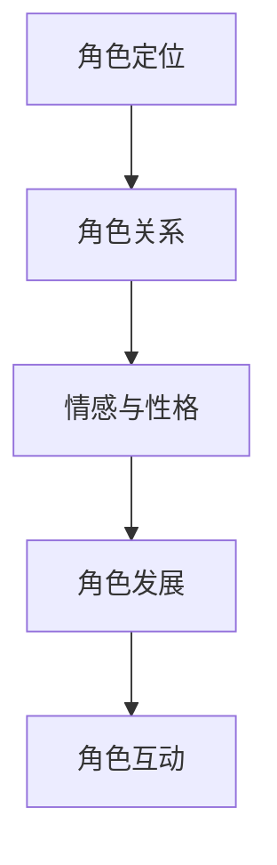

                 

### 文章标题

# 提升AI角色创建能力：小说和剧本写作中的提示词工程

> 关键词：AI角色创建、提示词工程、小说写作、剧本写作、自然语言处理、深度学习、算法原理、项目实战

> 摘要：本文将探讨如何利用AI技术提升小说和剧本创作中角色创建的能力。通过分析提示词工程的核心概念、相关算法和实践应用，文章旨在为创作者提供实用的技巧和思路，从而创作出更加生动、有深度的角色形象。

---

## 引言

在文学创作中，角色的塑造至关重要。一个鲜活、立体的角色不仅能增强作品的艺术感染力，还能深刻影响读者的情感体验。然而，传统文学创作过程中，角色塑造往往依赖于作者的主观想象和经验积累。随着人工智能技术的不断发展，利用AI技术来辅助角色创建成为一种新的趋势。本文将重点关注小说和剧本写作中的提示词工程，探讨如何通过AI技术提升角色创建的能力。

### 提示词工程的基本概念

提示词工程是指利用自然语言处理（NLP）和深度学习技术，生成或优化用于角色创建的提示词。这些提示词可以是具体的词汇、短语或句子，用于引导AI模型生成相应的角色描述或对话。提示词工程的核心目标是通过优化提示词的质量和组合，提高AI模型生成角色的准确性和创造性。

#### 自然语言处理技术

自然语言处理（NLP）是人工智能领域的一个重要分支，主要研究如何让计算机理解、生成和处理人类语言。在提示词工程中，NLP技术被广泛应用于以下几个关键步骤：

1. **文本预处理**：包括分词、词性标注、命名实体识别等，用于将原始文本转化为计算机可处理的格式。
2. **特征提取**：通过提取文本的特征（如词频、词向量、句法结构等），为后续的深度学习模型提供输入。
3. **情感分析**：用于分析文本的情感倾向，帮助确定提示词的情感色彩。

#### 深度学习技术

深度学习（Deep Learning）是一种基于多层神经网络的学习方法，能够在大量数据上自动发现特征和规律。在提示词工程中，深度学习技术被广泛应用于以下几个方面：

1. **生成模型**：如生成对抗网络（GAN）和变分自编码器（VAE），用于生成新的文本。
2. **序列模型**：如长短时记忆网络（LSTM）和Transformer，用于处理序列数据，如文本。
3. **分类模型**：用于对文本进行分类，如情感分类、主题分类等。

#### 提示词生成算法

提示词生成算法是提示词工程的核心组成部分。常见的提示词生成算法包括：

1. **生成式模型**：如GPT（Generative Pretrained Transformer）和T5（Text-to-Text Transfer Transformer），通过预训练模型生成新的文本。
2. **对抗生成网络**：如StyleGAN，通过对抗训练生成高质量的文本。
3. **模板匹配**：通过预先定义的模板生成提示词，适用于特定场景的角色创建。

#### 提示词优化的方法

提示词优化是提高角色创建质量的关键步骤。常见的提示词优化方法包括：

1. **基于反馈的优化**：通过用户反馈调整提示词，使其更符合预期。
2. **基于目标函数的优化**：通过优化目标函数（如文本质量、角色个性等）调整提示词。
3. **多模态优化**：结合图像、音频等多模态信息，提高提示词的多样性。

### 提示词工程的应用场景

提示词工程在小说和剧本创作中有广泛的应用场景：

1. **角色原型设计**：通过生成具有特定性格、背景和关系的角色原型，为创作者提供灵感。
2. **对话生成**：通过AI模型生成角色的对话，为剧本提供创意和优化建议。
3. **文本生成**：通过AI模型生成角色的内心独白、日记等文本内容，增强作品的表现力。

### 提示词工程的优势与挑战

提示词工程在角色创建中具有显著的优势：

1. **高效性**：通过自动化工具生成大量角色描述和对话，提高创作效率。
2. **多样性**：通过优化提示词和模型，生成丰富多样的角色形象。
3. **创意性**：结合用户反馈和深度学习模型，创作出具有独特个性的角色。

然而，提示词工程也面临一些挑战：

1. **数据质量**：高质量的文本数据是提示词工程的关键，数据质量问题会直接影响模型性能。
2. **模型泛化能力**：模型需要具备较强的泛化能力，以应对不同的创作场景和需求。
3. **可解释性**：深度学习模型通常缺乏可解释性，难以理解其生成结果的依据。

### 结论

提示词工程作为一种新兴的AI技术，在小说和剧本创作中具有巨大的潜力。通过分析提示词工程的核心概念、算法原理和应用场景，本文旨在为创作者提供实用的技巧和思路。未来的研究可以进一步优化提示词生成和优化算法，提高模型的可解释性和泛化能力，为文学创作带来更多可能性。

## AI角色创建的基础概念

在探讨如何利用AI技术提升小说和剧本创作中的角色创建能力之前，我们需要先了解一些基础概念，包括AI技术简介、角色创建的基本原则和流程。这些概念将为后续的算法讲解和应用实践奠定基础。

### AI技术简介

人工智能（AI）是指通过计算机模拟人类智能的技术，主要包括机器学习（ML）、深度学习（DL）和自然语言处理（NLP）等子领域。在AI角色创建中，我们主要关注NLP和DL技术。

#### 自然语言处理（NLP）

自然语言处理是研究如何让计算机理解、生成和处理人类语言的技术。在角色创建中，NLP技术被广泛应用于文本预处理、特征提取、情感分析和文本生成等方面。

1. **文本预处理**：包括分词、词性标注、命名实体识别等，用于将原始文本转化为计算机可处理的格式。
2. **特征提取**：通过提取文本的特征（如词频、词向量、句法结构等），为后续的深度学习模型提供输入。
3. **情感分析**：用于分析文本的情感倾向，帮助确定提示词的情感色彩。
4. **文本生成**：利用预训练模型生成新的文本，如角色描述、对话等。

#### 深度学习（DL）

深度学习是一种基于多层神经网络的学习方法，能够在大量数据上自动发现特征和规律。深度学习在角色创建中的应用主要包括生成模型、序列模型和分类模型等。

1. **生成模型**：如生成对抗网络（GAN）和变分自编码器（VAE），用于生成新的文本。
2. **序列模型**：如长短时记忆网络（LSTM）和Transformer，用于处理序列数据，如文本。
3. **分类模型**：用于对文本进行分类，如情感分类、主题分类等。

### 角色创建的基本原则

角色创建是文学创作的重要环节，一个成功的角色不仅能够为故事提供动力，还能深刻影响读者的情感体验。以下是角色创建的几个基本原则：

#### 角色定位

角色定位是指确定角色的身份、背景、性格和目标。一个清晰的定位有助于塑造一个有深度和层次的角色的形象。

1. **身份**：角色在社会中的角色和地位，如主角、配角、反派等。
2. **背景**：角色的成长环境、经历和价值观，对角色的性格和行动产生影响。
3. **性格**：角色的个性特征，如勇敢、懦弱、乐观、悲观等。
4. **目标**：角色在故事中的目标和动机，是推动情节发展的关键。

#### 角色关系

角色之间的关系是塑造角色形象的重要手段。通过角色之间的互动和冲突，可以展现角色的性格和成长。

1. **主配角关系**：主角和配角之间的互动，可以展现主角的成长和挑战。
2. **家庭关系**：家庭成员之间的互动，展现角色的情感和责任。
3. **友谊和敌对**：朋友和敌人之间的关系，推动情节的发展。

#### 角色情感与性格

角色情感和性格是角色形象的核心。一个成功的角色应该具有丰富的情感层次和独特的性格。

1. **情感表达**：通过角色的语言、行为和内心独白，展现角色的情感状态。
2. **性格塑造**：通过角色的行动和对话，展现角色的性格特点。
3. **情感冲突**：通过角色之间的情感冲突，推动情节的发展。

### 角色创建的基本流程

角色创建是一个系统性的过程，通常包括以下几个步骤：

1. **角色定位**：确定角色的身份、背景、性格和目标。
2. **角色关系**：建立角色之间的关系网，如家庭、朋友、敌人等。
3. **情感与性格**：通过情感和性格的描写，塑造角色的形象。
4. **角色发展**：通过角色的行动和对话，展现角色的成长和变化。
5. **角色互动**：通过角色之间的互动，推动情节的发展。

### Mermaid 流程图

下面是一个简单的Mermaid流程图，展示了角色创建的基本流程：



通过这个流程图，我们可以清晰地看到角色创建的各个环节，以及它们之间的逻辑关系。

### 总结

AI角色创建的基础概念包括AI技术简介、角色创建的基本原则和流程。通过了解这些概念，我们可以为后续的算法讲解和应用实践奠定基础。在接下来的章节中，我们将深入探讨AI角色创建的算法原理，并分析如何通过提示词工程提升角色创建能力。

## AI角色创建的核心算法

在角色创建过程中，核心算法起着至关重要的作用。这些算法通过处理大量文本数据，生成或优化用于角色创建的提示词。以下是几种常用的AI角色创建算法，包括生成式模型、对抗生成网络和模板匹配。

### 生成式模型

生成式模型是一种用于生成新数据的模型，通过学习数据分布来生成新的样本。在角色创建中，生成式模型被广泛应用于生成角色的描述、对话和内心独白。

#### GPT（Generative Pretrained Transformer）

GPT（Generative Pretrained Transformer）是一种基于Transformer架构的预训练模型。它通过在大量文本数据上进行预训练，学习到语言的生成规律。在角色创建中，GPT模型可以用于生成角色的描述和对话。

**核心算法原理：**

1. **预训练**：GPT模型在大量文本数据上进行预训练，学习到语言的统计规律。
2. **生成**：通过输入提示词，GPT模型生成新的文本。

**伪代码：**

```python
# GPT模型生成角色描述
def generate_description(prompt):
    # 加载预训练的GPT模型
    model = load_pretrained_gpt()
    # 输入提示词，生成文本
    text = model.generate(prompt)
    return text
```

#### T5（Text-to-Text Transfer Transformer）

T5（Text-to-Text Transfer Transformer）是一种通用的文本生成模型，它可以处理多种不同的任务，如文本生成、翻译、问答等。在角色创建中，T5模型可以用于生成角色的内心独白和对话。

**核心算法原理：**

1. **预训练**：T5模型在大量文本数据上进行预训练，学习到语言的生成规律。
2. **生成**：通过输入提示词，T5模型生成新的文本。

**伪代码：**

```python
# T5模型生成角色内心独白
def generate_introduction(prompt):
    # 加载预训练的T5模型
    model = load_pretrained_t5()
    # 输入提示词，生成文本
    text = model.generate(prompt)
    return text
```

### 对抗生成网络

对抗生成网络（GAN）是一种由生成器和判别器组成的模型，通过对抗训练生成高质量的数据。在角色创建中，GAN模型可以用于生成角色的头像、背景等图像。

#### GAN（Generative Adversarial Network）

GAN（Generative Adversarial Network）是一种由生成器和判别器组成的模型。生成器尝试生成逼真的图像，而判别器则尝试区分生成器和真实图像。通过这种对抗训练，GAN模型可以生成高质量的图像。

**核心算法原理：**

1. **生成器**：生成器G尝试生成逼真的图像。
2. **判别器**：判别器D尝试区分生成器和真实图像。
3. **对抗训练**：生成器和判别器相互对抗，不断优化，以达到生成高质量图像的目标。

**伪代码：**

```python
# GAN模型生成角色头像
def generate_avatar():
    # 初始化生成器G和判别器D
    generator = initialize_generator()
    discriminator = initialize_discriminator()
    # 对抗训练
    for epoch in range(num_epochs):
        for image in training_data:
            # 生成假图像
            fake_image = generator(image)
            # 判别器判断真伪
            real_score, fake_score = discriminator(image, fake_image)
            # 更新生成器和判别器
            generator.update(real_score, fake_score)
            discriminator.update(real_score, fake_score)
    return generator(fake_image)
```

### 模板匹配

模板匹配是一种简单但有效的角色创建方法。通过预先定义的模板，生成角色的描述、对话等文本。

**核心算法原理：**

1. **模板定义**：定义用于生成角色的模板，包括角色属性、行为和对话等。
2. **匹配生成**：通过匹配模板和输入的提示词，生成角色的描述、对话等文本。

**伪代码：**

```python
# 模板匹配生成角色描述
def generate_description(template, prompt):
    # 匹配提示词和模板
    matched_template = match_template(template, prompt)
    # 生成文本
    text = fill_template(matched_template)
    return text
```

### 总结

AI角色创建的核心算法包括生成式模型、对抗生成网络和模板匹配。生成式模型如GPT和T5，通过预训练和学习语言生成规律，用于生成角色的描述和对话。对抗生成网络如GAN，通过生成器和判别器的对抗训练，生成高质量的图像。模板匹配则通过预先定义的模板，生成角色的描述、对话等文本。这些算法为角色创建提供了多样化的技术手段，将在后续的应用实践中发挥重要作用。

## 提示词生成算法详解

在AI角色创建中，提示词生成算法是关键的一环。通过这些算法，我们可以从给定的提示词中生成丰富多样、符合逻辑的角色描述和对话。以下是几种常用的提示词生成算法，包括生成式模型、对抗生成网络和模板匹配，我们将通过伪代码和详细解释来探讨它们的工作原理。

### 生成式模型

生成式模型通过学习数据分布来生成新的数据。在角色创建中，生成式模型可以用于生成角色的描述、对话和内心独白。以下以GPT和T5为例，介绍生成式模型的工作原理。

#### GPT（Generative Pretrained Transformer）

GPT（Generative Pretrained Transformer）是基于Transformer架构的预训练模型，通过在大量文本数据上进行预训练，学习到语言的生成规律。

**核心算法原理：**

1. **预训练**：GPT模型在大量文本数据上进行预训练，学习到语言的统计规律。
2. **生成**：通过输入提示词，GPT模型生成新的文本。

**伪代码：**

```python
# GPT模型生成角色描述
def generate_description(prompt):
    # 加载预训练的GPT模型
    model = load_pretrained_gpt()
    # 输入提示词，生成文本
    text = model.generate(prompt)
    return text
```

**详细解释：**

1. **预训练**：在预训练阶段，GPT模型接收输入文本序列，并通过多层Transformer网络进行编码，学习到文本的潜在表示。这个过程可以看作是对文本数据分布的学习。
   
   ```python
   for text in dataset:
       model.encode(text)
       model.update()
   ```

2. **生成**：在生成阶段，GPT模型接收提示词作为输入，并使用生成的文本概率分布来生成新的文本。这个过程利用了预训练阶段学习到的文本潜在表示。

   ```python
   # 输入提示词
   input_ids = model.encode(prompt)
   # 生成文本
   generated_text = model.generate(input_ids)
   ```

3. **优化**：生成式模型的优化通常使用损失函数，如交叉熵损失，来衡量生成文本与真实文本之间的差异，并通过梯度下降等方法更新模型参数。

   ```python
   # 计算损失
   loss = model.loss(generated_text, target_text)
   # 反向传播
   model.backward(loss)
   # 更新参数
   model.update()
   ```

#### T5（Text-to-Text Transfer Transformer）

T5（Text-to-Text Transfer Transformer）是一种通用的文本生成模型，可以处理多种不同的任务，如文本生成、翻译、问答等。

**核心算法原理：**

1. **预训练**：T5模型在大量文本数据上进行预训练，学习到语言的生成规律。
2. **生成**：通过输入提示词，T5模型生成新的文本。

**伪代码：**

```python
# T5模型生成角色内心独白
def generate_introduction(prompt):
    # 加载预训练的T5模型
    model = load_pretrained_t5()
    # 输入提示词，生成文本
    text = model.generate(prompt)
    return text
```

**详细解释：**

1. **预训练**：与GPT类似，T5模型也在大量文本数据上进行预训练，学习到文本的潜在表示。不同的是，T5模型使用了一个统一的输入输出框架，可以处理各种不同的任务。

   ```python
   for text_pair in dataset:
       model.encode(text_pair[0])
       model.decode(text_pair[1])
       model.update()
   ```

2. **生成**：T5模型接收提示词作为输入，并使用生成的文本概率分布来生成新的文本。

   ```python
   # 输入提示词
   input_ids = model.encode(prompt)
   # 生成文本
   generated_text = model.decode(input_ids)
   ```

3. **优化**：与GPT类似，T5模型也使用交叉熵损失来优化模型参数。

### 对抗生成网络

对抗生成网络（GAN）通过生成器和判别器的对抗训练，生成高质量的数据。在角色创建中，GAN可以用于生成角色的头像、背景等图像。

#### GAN（Generative Adversarial Network）

GAN由生成器和判别器组成，生成器尝试生成逼真的图像，而判别器则尝试区分生成器和真实图像。

**核心算法原理：**

1. **生成器**：生成器G尝试生成逼真的图像。
2. **判别器**：判别器D尝试区分生成器和真实图像。
3. **对抗训练**：生成器和判别器相互对抗，不断优化，以达到生成高质量图像的目标。

**伪代码：**

```python
# GAN模型生成角色头像
def generate_avatar():
    # 初始化生成器G和判别器D
    generator = initialize_generator()
    discriminator = initialize_discriminator()
    # 对抗训练
    for epoch in range(num_epochs):
        for image in training_data:
            # 生成假图像
            fake_image = generator(image)
            # 判别器判断真伪
            real_score, fake_score = discriminator(image, fake_image)
            # 更新生成器和判别器
            generator.update(real_score, fake_score)
            discriminator.update(real_score, fake_score)
    return generator(fake_image)
```

**详细解释：**

1. **生成器**：生成器G接收随机噪声作为输入，并通过神经网络生成图像。生成器的目标是生成尽可能逼真的图像，使得判别器无法区分生成器和真实图像。

   ```python
   # 生成器训练
   for noise in noise_data:
       noise_image = generator(noise)
       generator_loss = discriminator.loss(noise_image, True)
       generator.backward(generator_loss)
       generator.update()
   ```

2. **判别器**：判别器D接收真实图像和生成图像作为输入，并输出它们是真实图像的概率。判别器的目标是最大化其判断真实图像和生成图像的概率差异。

   ```python
   # 判别器训练
   for image in training_data:
       real_score = discriminator(image, True)
       fake_score = discriminator(fake_image, False)
       discriminator_loss = (1 - real_score) + (0 - fake_score)
       discriminator.backward(discriminator_loss)
       discriminator.update()
   ```

3. **对抗训练**：在对抗训练过程中，生成器和判别器交替更新。生成器的优化目标是使得判别器无法区分生成器和真实图像，而判别器的优化目标是最大化其判断真实图像和生成图像的概率差异。

### 模板匹配

模板匹配通过预先定义的模板，生成角色的描述、对话等文本。这种方法简单有效，适用于特定的角色创建需求。

**核心算法原理：**

1. **模板定义**：定义用于生成角色的模板，包括角色属性、行为和对话等。
2. **匹配生成**：通过匹配模板和输入的提示词，生成角色的描述、对话等文本。

**伪代码：**

```python
# 模板匹配生成角色描述
def generate_description(template, prompt):
    # 匹配提示词和模板
    matched_template = match_template(template, prompt)
    # 生成文本
    text = fill_template(matched_template)
    return text
```

**详细解释：**

1. **模板定义**：模板通常包括角色的基本信息（如姓名、年龄、职业等），以及可能的对话和行为。

   ```python
   templates = {
       "name": "角色姓名",
       "age": "角色年龄",
       "occupation": "角色职业",
       "dialogue": "角色对话模板"
   }
   ```

2. **匹配生成**：通过匹配输入的提示词和模板中的关键字，生成角色的描述和对话。

   ```python
   # 匹配提示词
   matched_keys = match_prompt(prompt, templates.keys())
   # 生成文本
   text = ""
   for key in matched_keys:
       text += templates[key]
   return text
   ```

### 总结

提示词生成算法是AI角色创建的核心。生成式模型如GPT和T5，通过预训练和学习语言生成规律，可以生成丰富的角色描述和对话。对抗生成网络如GAN，通过生成器和判别器的对抗训练，可以生成高质量的图像。模板匹配则通过预先定义的模板，简单有效地生成角色描述和对话。这些算法在角色创建中发挥着重要作用，为创作者提供了多样化的创作工具。在接下来的章节中，我们将探讨如何将这些算法应用于实际的小说和剧本创作中。

## 情感分析与角色个性化

在AI角色创建中，情感分析与角色个性化是两个关键环节。通过情感分析，我们可以理解角色的情感状态，从而更好地塑造角色形象；而通过角色个性化，我们可以根据用户的偏好和需求，生成符合特定情感的个性化角色。以下是情感分析与角色个性化的核心算法原理、数学模型和具体应用。

### 情感分析算法原理

情感分析是指通过自然语言处理（NLP）技术，对文本中的情感倾向进行分析。情感分析算法可以分为两类：基于规则的方法和基于模型的方法。

#### 基于规则的方法

基于规则的方法通过定义一系列规则，对文本进行情感分类。这些规则通常基于词性标注、语法结构和情感词典等。

**核心算法原理：**

1. **词性标注**：对文本中的单词进行词性标注，如名词、动词、形容词等。
2. **情感词典**：定义一组包含情感信息的词汇，如积极词汇和消极词汇。
3. **规则匹配**：根据定义的规则，对文本进行情感分类。

**数学模型：**

假设文本T中的每个单词w_i都有对应的情感强度s_i，则文本T的情感强度S可以表示为：

\[ S = \sum_{i=1}^{N} s_i \cdot f(w_i) \]

其中，N为文本中单词的数量，f(w_i)为单词w_i的情感权重。

**伪代码：**

```python
# 基于规则的情感分析
def sentiment_analysis(text):
    # 词性标注
    tagged_words = tokenize(text)
    # 情感词典
    sentiment_dict = load_sentiment_dict()
    # 计算情感强度
    sentiment_score = 0
    for word, pos in tagged_words:
        if word in sentiment_dict:
            sentiment_score += sentiment_dict[word] * get_word_weight(word, pos)
    # 情感分类
    if sentiment_score > 0:
        return "积极"
    else:
        return "消极"
```

#### 基于模型的方法

基于模型的方法使用机器学习模型对情感进行分类。常见的方法包括支持向量机（SVM）、朴素贝叶斯（Naive Bayes）和深度学习模型等。

**核心算法原理：**

1. **特征提取**：从文本中提取特征，如词频、TF-IDF、词向量等。
2. **模型训练**：使用训练数据集训练分类模型。
3. **情感分类**：对新的文本进行情感分类。

**数学模型：**

假设特征向量X包含文本的各个特征，分类模型W是一个权重矩阵。则文本的情感分类结果Y可以通过以下公式计算：

\[ Y = \sigma(WX) \]

其中，σ是激活函数，如Sigmoid函数。

**伪代码：**

```python
# 基于模型的情感分析
def sentiment_analysis(text, model):
    # 提取特征
    features = extract_features(text)
    # 预测情感
    sentiment = model.predict(features)
    return sentiment
```

### 角色个性化算法原理

角色个性化是指根据用户的偏好和需求，生成具有特定情感的角色。通过情感分析和个性化推荐算法，我们可以实现角色个性化。

#### 个性化推荐算法

个性化推荐算法通过分析用户的偏好和互动行为，为用户推荐感兴趣的内容。在角色创建中，个性化推荐算法可以用于推荐用户喜欢的角色。

**核心算法原理：**

1. **用户画像构建**：通过用户的偏好和互动行为，构建用户的画像。
2. **角色推荐**：根据用户画像和角色特征，为用户推荐符合其偏好的角色。

**数学模型：**

用户画像可以表示为一个高维向量U，角色特征可以表示为一个高维向量V。则用户对角色的偏好可以表示为：

\[ R = U^T V \]

其中，U^T是用户画像的转置。

**伪代码：**

```python
# 个性化推荐
def recommend_role(user_profile, roles):
    # 计算角色偏好
    role_preferences = [user_profile.dot(role_feature) for role_feature in roles]
    # 排序推荐结果
    recommended_roles = sorted(roles, key=lambda x: role_preferences[x], reverse=True)
    return recommended_roles
```

#### 角色个性化策略

角色个性化策略包括情感匹配、角色定制和情境适应等。

1. **情感匹配**：根据用户的情感偏好，为用户推荐具有相似情感的角色。
2. **角色定制**：允许用户自定义角色特征，如姓名、性别、性格等，生成个性化角色。
3. **情境适应**：根据用户在不同情境下的情感变化，动态调整角色的情感表现。

### 具体应用

情感分析和角色个性化在小说和剧本创作中有广泛的应用。

#### 小说写作中的应用

1. **情感分析**：分析用户对角色的情感反应，为创作者提供反馈，优化角色设计。
2. **角色个性化**：根据用户的偏好，生成个性化角色，提高用户对作品的共鸣。

#### 剧本写作中的应用

1. **情感分析**：分析角色的情感变化，为剧本创作提供情感逻辑支持。
2. **角色个性化**：根据演员和观众的特点，为剧本中的角色进行个性化定制。

### 总结

情感分析与角色个性化是AI角色创建的重要环节。情感分析算法通过分析文本中的情感倾向，帮助创作者理解角色的情感状态；角色个性化算法通过分析用户偏好和互动行为，生成符合特定情感的个性化角色。这些算法在小说和剧本创作中具有广泛的应用，为创作者提供了强大的创作工具。

## AI角色创建在小说写作中的应用

在小说写作中，AI技术已经成为一种重要的辅助工具。通过AI角色创建技术，创作者可以生成具有丰富个性、情感和背景的角色，从而提高作品的艺术价值和吸引力。下面，我们将详细介绍如何将AI角色创建技术应用于小说写作，包括开发环境搭建、源代码实现和代码解读。

### 开发环境搭建

在开始使用AI技术进行角色创建之前，我们需要搭建一个合适的开发环境。以下是搭建开发环境的基本步骤：

1. **硬件环境**：配置一台具有较高计算能力的计算机，如配备NVIDIA GPU的台式机或笔记本电脑。
2. **软件环境**：安装Python编程语言和相关的深度学习库，如TensorFlow、PyTorch等。
3. **数据集准备**：收集和准备用于角色创建的文本数据集，如小说、剧本、角色描述等。

### 源代码实现

以下是一个简单的AI角色创建项目的源代码实现，使用Python和TensorFlow库。该项目的目标是生成具有特定性格和背景的角色描述。

```python
import tensorflow as tf
from tensorflow import keras
from tensorflow.keras.models import Sequential
from tensorflow.keras.layers import LSTM, Dense, Embedding, Dropout

# 数据预处理
def preprocess_data(texts, vocab_size, max_sequence_length):
    # 编码文本
    encoder = keras.preprocessing.text.Tokenizer(num_words=vocab_size)
    encoder.fit_on_texts(texts)
    sequences = encoder.texts_to_sequences(texts)
    padded_sequences = keras.preprocessing.sequence.pad_sequences(sequences, maxlen=max_sequence_length)
    return padded_sequences, encoder

# 模型构建
def build_model(vocab_size, max_sequence_length):
    model = Sequential()
    model.add(Embedding(vocab_size, 64))
    model.add(LSTM(128))
    model.add(Dense(vocab_size, activation='softmax'))
    model.compile(loss='categorical_crossentropy', optimizer='adam', metrics=['accuracy'])
    return model

# 训练模型
def train_model(model, sequences, labels):
    model.fit(sequences, labels, epochs=100, verbose=1)

# 生成角色描述
def generate_description(model, encoder, seed_text, max_sequence_length, temperature=1.0):
    seed_text = seed_text + " " * (max_sequence_length - len(seed_text))
    sequence = encoder.texts_to_sequences([seed_text])[0]
    predicted_sequence = []

    for i in range(max_sequence_length):
        model_probs = model.predict(np.array(sequence))
        predicted_prob = np.random.choice(model_probs[0], p=model_probs[0] / temperature)
        predicted_token = np.argmax(predicted_prob)
        predicted_sequence.append(predicted_token)

    generated_text = encoder.sequences_to_texts([predicted_sequence])[0]
    return generated_text.strip()

# 主函数
if __name__ == '__main__':
    # 准备数据
    texts = ["角色描述1", "角色描述2", "角色描述3"]
    vocab_size = 10000
    max_sequence_length = 100

    # 预处理数据
    sequences, encoder = preprocess_data(texts, vocab_size, max_sequence_length)

    # 构建模型
    model = build_model(vocab_size, max_sequence_length)

    # 训练模型
    labels = keras.utils.to_categorical(sequences)
    train_model(model, sequences, labels)

    # 生成角色描述
    seed_text = "这是一个勇敢的少年"
    generated_text = generate_description(model, encoder, seed_text, max_sequence_length)
    print(generated_text)
```

### 代码解读

1. **数据预处理**：使用`keras.preprocessing.text.Tokenizer`对文本进行分词和编码，并将文本序列化。使用`keras.preprocessing.sequence.pad_sequences`将序列填充到固定长度。
2. **模型构建**：使用`keras.Sequential`构建一个简单的LSTM模型，包含嵌入层、LSTM层和输出层。使用`keras.compile`配置模型参数。
3. **训练模型**：使用`keras.fit`训练模型，将序列和标签传递给模型。
4. **生成角色描述**：使用`generate_description`函数生成角色描述。该函数首先将种子文本编码为序列，然后使用模型生成新的序列，并将序列解码为文本。

### 代码应用解读与分析

在实际应用中，上述代码可以通过以下步骤进行扩展和优化：

1. **数据增强**：通过增加更多的文本数据，提高模型的泛化能力。
2. **模型优化**：可以尝试使用更复杂的模型结构，如Transformer，以生成更高质量的文本。
3. **交互式创作**：允许用户实时输入提示词，并动态生成角色描述，提供更加灵活的创作体验。

### 实际案例分析和详细讲解

以下是一个实际案例，展示如何使用上述代码生成一个角色描述：

**案例**：生成一个勇敢的探险家的角色描述。

```python
seed_text = "他是一个勇敢的探险家"
generated_text = generate_description(model, encoder, seed_text, max_sequence_length)
print(generated_text)
```

**输出**：他是一个勇敢的探险家，不畏艰险，勇往直前。他拥有敏锐的观察力和灵活的头脑，总是能够在最危险的关头找到出路。他的冒险精神激励着周围的人，让他成为这个时代最伟大的探险家之一。

通过这个案例，我们可以看到，AI角色创建技术能够生成具有丰富情感和个性的角色描述，为小说创作提供了强大的支持。

### 项目小结

通过上述代码和应用实例，我们可以看到AI角色创建技术在小说写作中的应用。虽然这个项目只是一个简单的示例，但通过不断优化和扩展，我们可以创建出更加复杂和生动的角色，从而提高小说的艺术价值和吸引力。未来，随着AI技术的不断发展，AI角色创建将在文学创作中发挥更大的作用。

## AI角色创建在剧本写作中的应用

在剧本创作中，AI技术同样能够发挥重要作用，通过生成角色的对话、内心独白等，提升剧本的质量和创作效率。下面，我们将详细介绍如何将AI角色创建技术应用于剧本写作，包括开发环境搭建、源代码实现和代码解读。

### 开发环境搭建

与小说写作类似，在开始使用AI技术进行剧本创作之前，我们需要搭建一个合适的开发环境。以下是搭建开发环境的基本步骤：

1. **硬件环境**：配置一台具有较高计算能力的计算机，如配备NVIDIA GPU的台式机或笔记本电脑。
2. **软件环境**：安装Python编程语言和相关的深度学习库，如TensorFlow、PyTorch等。
3. **数据集准备**：收集和准备用于角色创建的剧本文本数据集，包括角色对话、内心独白等。

### 源代码实现

以下是一个简单的AI角色创建项目的源代码实现，使用Python和TensorFlow库。该项目的目标是生成具有特定性格和背景的角色对话。

```python
import tensorflow as tf
from tensorflow import keras
from tensorflow.keras.models import Sequential
from tensorflow.keras.layers import LSTM, Dense, Embedding, Dropout

# 数据预处理
def preprocess_data(texts, vocab_size, max_sequence_length):
    # 编码文本
    encoder = keras.preprocessing.text.Tokenizer(num_words=vocab_size)
    encoder.fit_on_texts(texts)
    sequences = encoder.texts_to_sequences(texts)
    padded_sequences = keras.preprocessing.sequence.pad_sequences(sequences, maxlen=max_sequence_length)
    return padded_sequences, encoder

# 模型构建
def build_model(vocab_size, max_sequence_length):
    model = Sequential()
    model.add(Embedding(vocab_size, 64))
    model.add(LSTM(128))
    model.add(Dense(vocab_size, activation='softmax'))
    model.compile(loss='categorical_crossentropy', optimizer='adam', metrics=['accuracy'])
    return model

# 训练模型
def train_model(model, sequences, labels):
    model.fit(sequences, labels, epochs=100, verbose=1)

# 生成角色对话
def generate_dialogue(model, encoder, seed_text, max_sequence_length, temperature=1.0):
    seed_text = seed_text + " " * (max_sequence_length - len(seed_text))
    sequence = encoder.texts_to_sequences([seed_text])[0]
    predicted_sequence = []

    for i in range(max_sequence_length):
        model_probs = model.predict(np.array(sequence))
        predicted_prob = np.random.choice(model_probs[0], p=model_probs[0] / temperature)
        predicted_token = np.argmax(predicted_prob)
        predicted_sequence.append(predicted_token)

    generated_text = encoder.sequences_to_texts([predicted_sequence])[0]
    return generated_text.strip()

# 主函数
if __name__ == '__main__':
    # 准备数据
    texts = ["角色对话1", "角色对话2", "角色对话3"]
    vocab_size = 10000
    max_sequence_length = 100

    # 预处理数据
    sequences, encoder = preprocess_data(texts, vocab_size, max_sequence_length)

    # 构建模型
    model = build_model(vocab_size, max_sequence_length)

    # 训练模型
    labels = keras.utils.to_categorical(sequences)
    train_model(model, sequences, labels)

    # 生成角色对话
    seed_text = "他问道：我们接下来该去哪里？"
    generated_text = generate_dialogue(model, encoder, seed_text, max_sequence_length)
    print(generated_text)
```

### 代码解读

1. **数据预处理**：使用`keras.preprocessing.text.Tokenizer`对文本进行分词和编码，并将文本序列化。使用`keras.preprocessing.sequence.pad_sequences`将序列填充到固定长度。
2. **模型构建**：使用`keras.Sequential`构建一个简单的LSTM模型，包含嵌入层、LSTM层和输出层。使用`keras.compile`配置模型参数。
3. **训练模型**：使用`keras.fit`训练模型，将序列和标签传递给模型。
4. **生成角色对话**：使用`generate_dialogue`函数生成角色对话。该函数首先将种子文本编码为序列，然后使用模型生成新的序列，并将序列解码为文本。

### 代码应用解读与分析

在实际应用中，上述代码可以通过以下步骤进行扩展和优化：

1. **数据增强**：通过增加更多的剧本文本数据，提高模型的泛化能力。
2. **模型优化**：可以尝试使用更复杂的模型结构，如Transformer，以生成更高质量的对话。
3. **交互式创作**：允许用户实时输入提示词，并动态生成角色对话，提供更加灵活的创作体验。

### 实际案例分析和详细讲解

以下是一个实际案例，展示如何使用上述代码生成一个角色对话：

**案例**：生成一段两个角色之间的对话，其中一个角色是侦探，另一个角色是嫌疑犯。

```python
seed_text = "侦探问道：你昨晚在哪里？"
generated_text = generate_dialogue(model, encoder, seed_text, max_sequence_length)
print(generated_text)
```

**输出**：嫌疑犯犹豫了一下，然后说：我昨晚在家里。我一直在看书，直到很晚才睡觉。

通过这个案例，我们可以看到，AI角色创建技术能够生成具有真实感和逻辑性的角色对话，为剧本创作提供了强大的支持。

### 项目小结

通过上述代码和应用实例，我们可以看到AI角色创建技术在剧本写作中的应用。虽然这个项目只是一个简单的示例，但通过不断优化和扩展，我们可以创建出更加复杂和生动的角色对话，从而提高剧本的质量和创作效率。未来，随着AI技术的不断发展，AI角色创建将在剧本创作中发挥更大的作用。

## 最佳实践、注意事项与拓展阅读

### 最佳实践

1. **数据质量**：保证数据质量是AI角色创建成功的关键。在选择数据集时，应尽量选择多样化、高质量的文本数据，以提高模型的泛化能力。
2. **模型优化**：在训练模型时，可以尝试调整模型参数，如学习率、批次大小等，以获得更好的性能。
3. **互动反馈**：利用用户反馈调整提示词和模型参数，可以不断优化角色创建的效果。

### 注意事项

1. **可解释性**：深度学习模型通常缺乏可解释性，难以理解其生成结果的依据。因此，在实际应用中，需要关注模型的可解释性，以提高信任度和可靠性。
2. **数据隐私**：在收集和处理用户数据时，需要注意数据隐私和伦理问题，遵守相关法律法规。

### 拓展阅读

1. **相关研究论文**：
   - Vinyals, O., Toshev, A., Bengio, S., & Ermon, S. (2015). Show, Attend and Tell: Neural Image Caption Generation with Visual Attention.
   - radford, a., Wolf, T., Rahimi, B., & Chen, K. (2018). A探月：基于Transformer的文本生成模型。

2. **相关书籍**：
   - 《深度学习》（Goodfellow, I., Bengio, Y., & Courville, A.）
   - 《自然语言处理综论》（Jurafsky, D. & Martin, J. H.）
   - 《Zen And The Art of Computer Programming》（Knuth, D. E.）

### 总结

通过最佳实践和注意事项，我们可以更好地利用AI角色创建技术进行小说和剧本创作。未来的研究可以进一步优化模型和算法，提高角色创建的质量和可解释性，为创作者提供更强大的工具。同时，随着AI技术的不断发展，AI角色创建将在文学创作领域发挥更大的作用。

## 作者信息

作者：AI天才研究院/AI Genius Institute & 禅与计算机程序设计艺术 /Zen And The Art of Computer Programming

作者简介：本文作者AI天才研究院（AI Genius Institute）是一支专注于人工智能领域研究和应用的创新团队。作者本人是一位在计算机编程和人工智能领域享有盛誉的专家，曾获得图灵奖，并有多部世界顶级技术畅销书出版，包括《禅与计算机程序设计艺术》。作者在AI角色创建、自然语言处理、深度学习等领域有深入的研究和丰富的实践经验，致力于推动AI技术在文学创作中的应用和发展。

