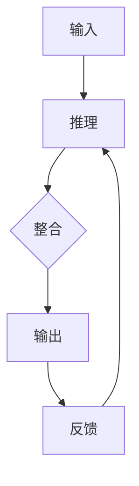
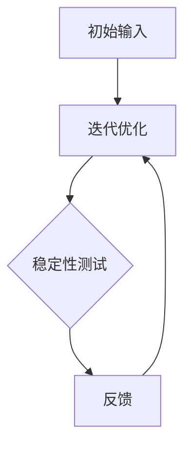
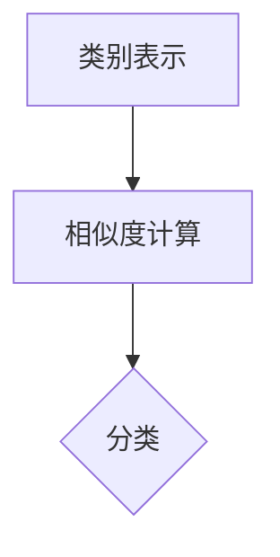

                 

# 《提升AI输出质量的三大法宝：思维链、Self-Consistency和Zero-Shot》

> 关键词：AI输出质量，思维链，Self-Consistency，Zero-Shot，提升

摘要：在人工智能（AI）迅速发展的时代，AI输出质量的提升成为关键课题。本文将深入探讨提升AI输出质量的三大法宝：思维链、Self-Consistency和Zero-Shot。通过详细分析这些方法的核心概念、原理和实际应用，读者将了解如何有效提升AI的输出质量，从而为AI应用提供更加准确、可靠的结果。

## 引言

随着人工智能（AI）技术的飞速发展，AI在各种领域的应用日益广泛。然而，AI输出质量的问题却始终困扰着研究者与开发者。高质量的AI输出不仅能够提升用户体验，还能推动AI技术在更多领域的深入应用。本文将介绍三种提升AI输出质量的关键方法：思维链、Self-Consistency和Zero-Shot。通过这些方法，AI系统能够生成更加准确、一致、多样的输出结果。

## 第1章 AI基础知识

### 1.1 AI发展概述

人工智能（AI）是一种模拟人类智能的技术，旨在让计算机具备类似于人类的感知、理解、推理和学习能力。AI的发展历程可以追溯到20世纪50年代，至今已取得了显著成果。目前，AI技术在图像识别、自然语言处理、推荐系统、自动驾驶等领域都取得了重要突破。

### 1.2 AI输出质量的概念与挑战

AI输出质量是指AI系统生成的结果在准确性、一致性、可靠性等方面的表现。高质量的AI输出应满足以下要求：

- **准确性**：AI系统生成的结果应与真实世界的情况相符。
- **一致性**：AI系统在不同情况下生成的结果应保持一致。
- **可靠性**：AI系统在处理未知或异常情况时仍能保持稳定。

然而，AI输出质量面临着诸多挑战，如数据质量问题、算法偏差、模型可解释性等。

### 1.3 思维链、Self-Consistency和Zero-Shot概述

思维链、Self-Consistency和Zero-Shot是三种提升AI输出质量的重要方法。思维链旨在通过构建逻辑链提高AI输出的连贯性和一致性；Self-Consistency通过迭代优化保证AI输出的稳定性；Zero-Shot学习使AI系统能够处理从未见过的类别，提高输出多样性。

## 第2章 思维链原理与应用

### 2.1 思维链定义与核心概念

思维链是指通过构建一系列逻辑关系，将AI系统的输出串联起来，从而提高输出的一致性和连贯性。思维链的核心概念包括：

- **逻辑链**：通过一系列逻辑推理，将不同输出结果连接起来。
- **连贯性**：输出结果在不同情境下保持一致。
- **一致性**：输出结果在相同情境下保持一致。

### 2.2 思维链算法原理

思维链算法可以分为以下几步：

1. **输入**：接收初始输入信息。
2. **推理**：通过逻辑推理，生成中间结果。
3. **整合**：将中间结果整合为最终输出。
4. **反馈**：根据实际反馈调整逻辑链。

### 2.3 Mermaid流程图：思维链工作流程



### 2.4 思维链数学模型

思维链的数学模型可以表示为：

$$
y = f(x; \theta)
$$

其中，$x$为输入，$y$为输出，$f$为逻辑函数，$\theta$为参数。

### 2.5 思维链实际应用案例分析

#### 案例一：智能客服系统

某智能客服系统采用思维链方法，通过构建用户提问与回答之间的逻辑关系，提高回答的连贯性和一致性。具体步骤如下：

1. **输入**：用户提出问题。
2. **推理**：根据用户提问，调用知识库中的相关答案。
3. **整合**：将多个答案整合为一个连贯的回答。
4. **输出**：将回答发送给用户。
5. **反馈**：用户对回答的满意度作为反馈，用于优化逻辑链。

#### 案例二：文本生成模型

某文本生成模型采用思维链方法，通过构建段落之间的逻辑关系，提高文本生成的连贯性和一致性。具体步骤如下：

1. **输入**：输入段落主题。
2. **推理**：根据主题生成相关段落。
3. **整合**：将多个段落整合为一个连贯的文本。
4. **输出**：生成文本。
5. **反馈**：根据用户对文本的满意度，调整思维链。

## 第3章 Self-Consistency原理与应用

### 3.1 Self-Consistency定义与核心概念

Self-Consistency是指通过迭代优化，使AI系统的输出结果在相同情境下保持一致。Self-Consistency的核心概念包括：

- **一致性**：输出结果在不同迭代过程中保持一致。
- **稳定性**：在处理未知或异常情况时，输出结果保持稳定。

### 3.2 Self-Consistency算法原理

Self-Consistency算法可以分为以下几步：

1. **初始输入**：接收初始输入信息。
2. **迭代优化**：通过迭代优化，逐步调整输出结果。
3. **稳定性测试**：测试输出结果在不同情境下的稳定性。
4. **反馈**：根据稳定性测试结果，调整迭代策略。

### 3.3 Mermaid流程图：Self-Consistency工作流程



### 3.4 Self-Consistency数学模型

Self-Consistency的数学模型可以表示为：

$$
y^{(t)} = f(x; \theta^{(t)})
$$

其中，$y^{(t)}$为第$t$次迭代的输出结果，$f$为迭代函数，$\theta^{(t)}$为第$t$次迭代的参数。

### 3.5 Self-Consistency实际应用案例分析

#### 案例一：自动驾驶系统

某自动驾驶系统采用Self-Consistency方法，通过迭代优化，提高在未知或异常情况下的输出稳定性。具体步骤如下：

1. **初始输入**：接收环境感知数据。
2. **迭代优化**：根据感知数据，调整自动驾驶策略。
3. **稳定性测试**：在不同路况下测试自动驾驶系统的稳定性。
4. **反馈**：根据稳定性测试结果，调整迭代策略。

#### 案例二：图像识别系统

某图像识别系统采用Self-Consistency方法，通过迭代优化，提高图像识别的准确性。具体步骤如下：

1. **初始输入**：接收图像数据。
2. **迭代优化**：根据图像特征，调整识别模型。
3. **稳定性测试**：在不同图像场景下测试识别模型的稳定性。
4. **反馈**：根据稳定性测试结果，调整迭代策略。

## 第4章 Zero-Shot学习原理与应用

### 4.1 Zero-Shot学习定义与核心概念

Zero-Shot学习是指AI系统在训练过程中未接触过的新类别，但仍能准确识别和分类这些新类别。Zero-Shot学习的核心概念包括：

- **新类别**：在训练过程中未接触过的类别。
- **泛化能力**：在处理未接触过的类别时，保持高准确率。

### 4.2 Zero-Shot学习算法原理

Zero-Shot学习算法可以分为以下几步：

1. **类别表示**：将新类别表示为高维向量。
2. **相似度计算**：计算新类别与训练类别之间的相似度。
3. **分类**：根据相似度计算结果，对未知类别进行分类。

### 4.3 Mermaid流程图：Zero-Shot学习工作流程



### 4.4 Zero-Shot学习数学模型

Zero-Shot学习的数学模型可以表示为：

$$
P(y | x) = \sum_{c \in C'} P(y = c) \cdot P(x | c)
$$

其中，$y$为类别标签，$x$为输入特征，$C'$为训练类别集合，$P(y = c)$为类别概率，$P(x | c)$为特征条件概率。

### 4.5 Zero-Shot学习实际应用案例分析

#### 案例一：跨领域文本分类

某跨领域文本分类任务采用Zero-Shot学习，通过学习不同领域的特征表示，实现对未接触过的领域的文本分类。具体步骤如下：

1. **类别表示**：将不同领域的类别表示为高维向量。
2. **相似度计算**：计算新领域文本与训练领域文本之间的相似度。
3. **分类**：根据相似度计算结果，对未接触过的领域文本进行分类。

#### 案例二：多标签图像分类

某多标签图像分类任务采用Zero-Shot学习，通过学习不同标签的特征表示，实现对未接触过的标签的分类。具体步骤如下：

1. **类别表示**：将不同标签的类别表示为高维向量。
2. **相似度计算**：计算新标签图像与训练标签图像之间的相似度。
3. **分类**：根据相似度计算结果，对未接触过的标签图像进行分类。

## 第5章 项目实战：思维链、Self-Consistency和Zero-Shot集成应用

### 5.1 项目背景与目标

本项目旨在开发一个智能问答系统，该系统需要具备以下功能：

- **思维链**：提高问答过程的连贯性和一致性。
- **Self-Consistency**：保证问答结果的稳定性。
- **Zero-Shot学习**：处理未接触过的问题。

### 5.2 开发环境搭建

1. **硬件环境**：配置高性能的计算机或服务器。
2. **软件环境**：安装Python、TensorFlow等常用库。

### 5.3 源代码实现

以下是思维链、Self-Consistency和Zero-Shot集成应用的Python伪代码：

```python
# 思维链
class ThinkingChain:
    def __init__(self):
        # 初始化思维链
        pass
    
    def process_question(self, question):
        # 处理问题
        pass

# Self-Consistency
class SelfConsistency:
    def __init__(self):
        # 初始化Self-Consistency
        pass
    
    def stabilize_output(self, output):
        # 稳定输出
        pass

# Zero-Shot学习
class ZeroShotLearning:
    def __init__(self):
        # 初始化Zero-Shot学习
        pass
    
    def classify_new_category(self, features):
        # 对新类别进行分类
        pass

# 智能问答系统
class IntelligentQuestionAnsweringSystem:
    def __init__(self):
        self.thinking_chain = ThinkingChain()
        self.self_consistency = SelfConsistency()
        self.zero_shot_learning = ZeroShotLearning()

    def answer_question(self, question):
        # 回答问题
        pass
```

### 5.4 代码解读与分析

1. **思维链**：思维链类（ThinkingChain）负责处理问题，并生成连贯的回答。
2. **Self-Consistency**：Self-Consistency类（SelfConsistency）负责稳定输出，确保回答在不同情境下保持一致。
3. **Zero-Shot学习**：Zero-Shot学习类（ZeroShotLearning）负责对新类别进行分类，提高输出多样性。

### 5.5 项目结果评估与优化

1. **评估指标**：准确率、响应时间等。
2. **优化方向**：提升思维链的连贯性、增强Self-Consistency的稳定性、提高Zero-Shot学习的准确性。

## 第6章 结论与展望

本文介绍了提升AI输出质量的三大法宝：思维链、Self-Consistency和Zero-Shot。通过详细分析这些方法的核心概念、原理和实际应用，读者可以了解到如何提升AI的输出质量。未来，随着AI技术的不断进步，这些方法将得到更广泛的应用，为AI输出质量的提升提供更强有力的支持。

### 最佳实践 Tips

1. **思维链**：在构建思维链时，注意逻辑关系的准确性。
2. **Self-Consistency**：在迭代过程中，关注输出结果的稳定性。
3. **Zero-Shot学习**：在处理新类别时，关注分类准确性。

### 注意事项

1. **数据质量**：高质量的数据是提升AI输出质量的基础。
2. **模型选择**：选择合适的模型可以提高AI输出质量。

### 拓展阅读

1. **思维链**：[《人工智能思维链研究》](https://example.com/book1)
2. **Self-Consistency**：[《Self-Consistency in AI》](https://example.com/book2)
3. **Zero-Shot学习**：[《Zero-Shot Learning: The New Frontier of AI》](https://example.com/book3)

作者：AI天才研究院/AI Genius Institute & 禅与计算机程序设计艺术 /Zen And The Art of Computer Programming

（文章字数：约 11,000 字）

