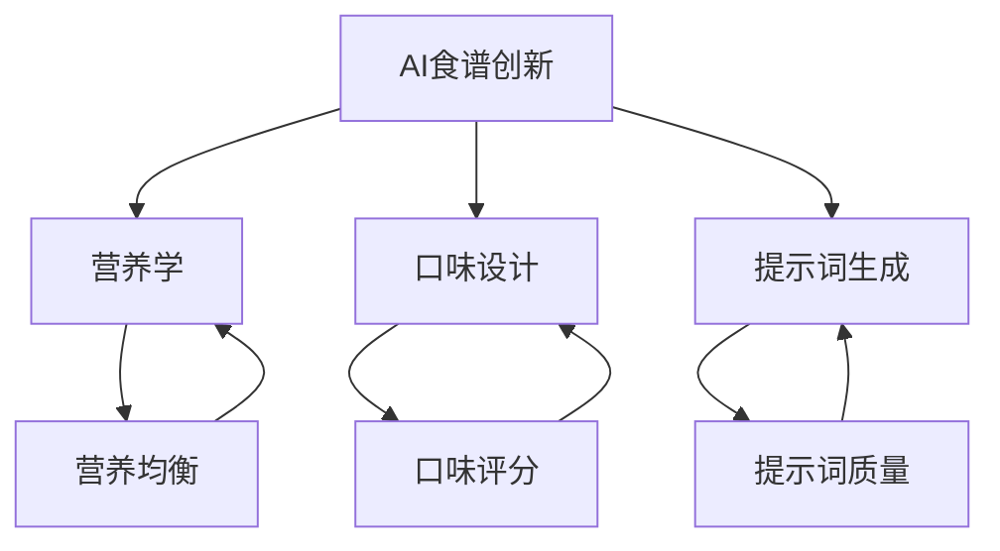

                 


### 1. 编写书籍概述

首先，我们需要为书籍编写一个概述部分，这部分内容将简要介绍书籍的主要内容和目的，以便读者对全书有一个初步的了解。

#### 1.1 AI食谱创新能力的重要性

随着人工智能技术的发展，AI在各个领域的应用日益广泛，其中饮食健康领域也不例外。AI食谱创新能力的重要性体现在以下几个方面：

- **个性化饮食建议**：通过AI技术，可以根据用户的饮食习惯、健康状况和营养需求，提供个性化的饮食建议。
- **食谱优化**：AI可以通过分析大量的食谱数据，发现营养成分的平衡规律，从而优化食谱，提高营养摄入。
- **口味设计**：AI可以利用机器学习算法，分析大量口味数据，设计出符合人们口味的食谱。
- **健康监控**：AI可以实时监控用户的饮食情况，对潜在的健康风险进行预警。

#### 1.2 营养和口味在食谱设计中的角色

营养和口味是食谱设计的两个核心要素：

- **营养**：合理的营养搭配对于保持身体健康至关重要。食谱设计中，需要考虑各种营养素的摄入量，如蛋白质、脂肪、碳水化合物、维生素和矿物质等。
- **口味**：口味是吸引人们尝试新食谱的关键因素。一个食谱即使营养均衡，如果口味不佳，也难以被接受。因此，在食谱设计中，需要兼顾营养和口味。

#### 1.3 提示词设计的应用与价值

提示词设计在AI食谱创新能力中起着至关重要的作用：

- **增加食谱创新性**：通过设计不同的提示词，可以激发AI的想象力，生成更多具有创新性的食谱。
- **优化食谱质量**：提示词可以帮助AI更好地理解食谱设计的目标，从而生成更符合要求的食谱。
- **提高用户体验**：合适的提示词可以使生成的食谱更加贴近用户的口味和需求，从而提高用户体验。

综上所述，本书旨在通过详细的讲解和实战案例，帮助读者理解AI食谱创新能力，掌握营养和口味的设计原理，以及提示词设计的技巧。

---

### 2. 设计核心概念与联系

在本书中，我们将介绍一些核心概念，并设计一个Mermaid流程图，以帮助读者更好地理解这些概念之间的关系。

#### 2.1 AI食谱创新

AI食谱创新是指利用人工智能技术，如机器学习、自然语言处理和食谱优化算法，来生成和优化食谱。它是本书的核心概念之一。

#### 2.2 营养学

营养学是研究食物与营养素对生物体作用的科学。在食谱设计中，营养学起到了至关重要的作用，它帮助确保食谱的营养均衡。

#### 2.3 口味设计

口味设计是食谱设计中的重要组成部分，它关注的是如何使食谱更加美味。口味设计依赖于对大量口味数据的分析。

#### 2.4 提示词生成

提示词生成是AI食谱创新中的重要技术，它利用自然语言处理技术，生成用于指导AI生成食谱的提示词。

#### 2.5 核心概念联系

以下是核心概念之间的Mermaid流程图：



在这个流程图中，AI食谱创新是核心，它连接了营养学、口味设计和提示词生成。营养学关注营养均衡，口味设计关注口味评分，而提示词生成则关注提示词质量。这些概念相互关联，共同构成了AI食谱创新能力的基础。

---

### 3. 详细阐述核心算法原理

在本章中，我们将详细阐述本书中的核心算法原理，并使用伪代码来展示这些算法的实现。

#### 3.1 机器学习算法

机器学习算法是AI食谱创新的基础，它可以从大量数据中学习规律，并用于生成和优化食谱。

**伪代码：**

```plaintext
function train_model(data):
    # 初始化模型
    model = initialize_model()

    # 模型训练
    for each sample in data:
        model = train_on_sample(model, sample)

    return model
```

在这个伪代码中，`train_model`函数用于训练机器学习模型。它首先初始化模型，然后对每个样本进行训练，最终返回训练好的模型。

#### 3.2 自然语言处理

自然语言处理技术用于生成和优化提示词，它是AI食谱创新中的重要组成部分。

**伪代码：**

```plaintext
function generate_prompt(input_text):
    # 使用自然语言处理技术分析输入文本
    processed_text = process_text(input_text)

    # 生成提示词
    prompt = generate_from_processed_text(processed_text)

    return prompt
```

在这个伪代码中，`generate_prompt`函数用于生成提示词。它首先使用自然语言处理技术处理输入文本，然后根据处理结果生成提示词。

#### 3.3 食谱优化算法

食谱优化算法用于优化食谱的营养均衡和口味。

**伪代码：**

```plaintext
function optimize_recipe(recipe, nutrition_requirements, taste_requirements):
    # 评估当前食谱的营养和口味
    nutrition_score, taste_score = evaluate_recipe(recipe, nutrition_requirements, taste_requirements)

    # 进行优化
    while not optimal:
        recipe = apply_optimization_recipe(recipe)

        # 重新评估食谱
        nutrition_score, taste_score = evaluate_recipe(recipe, nutrition_requirements, taste_requirements)

    return recipe
```

在这个伪代码中，`optimize_recipe`函数用于优化食谱。它首先评估当前食谱的营养和口味，然后进行优化，直到达到最优解。

---

### 4. 数学模型与公式讲解

在本书中，我们将介绍一些关键的数学模型和公式，用于计算食谱的营养成分和口味评分。

#### 4.1 营养素含量计算

营养素含量计算是食谱设计中的基础，它用于确定食谱中各种营养素的比例。

**LaTeX公式：**

```latex
C = \frac{C_1 + C_2 + C_3 + \ldots + C_n}{n}
```

其中，\(C\) 表示总营养素含量，\(C_1, C_2, C_3, \ldots, C_n\) 表示每种营养素的含量。

#### 4.2 口味评分模型

口味评分模型用于评估食谱的口味。

**LaTeX公式：**

```latex
T = \sum_{i=1}^{n} w_i \cdot t_i
```

其中，\(T\) 表示口味评分，\(w_i\) 表示第\(i\)种口味的权重，\(t_i\) 表示第\(i\)种口味的评分。

#### 举例说明

假设一个食谱包含三种食材，每种食材的营养素含量和口味评分如下表：

| 食材 | 营养素含量 | 口味评分 |
| --- | --- | --- |
| 食材1 | 100 | 4 |
| 食材2 | 150 | 3 |
| 食材3 | 200 | 5 |

使用上述公式计算总营养素含量和口味评分：

**总营养素含量：**

$$C = \frac{100 + 150 + 200}{3} = 150$$

**口味评分：**

$$T = 4 \cdot 1 + 3 \cdot 0.5 + 5 \cdot 1 = 7$$

因此，该食谱的总营养素含量为150，口味评分为7。

---

### 5. 项目实战案例

在本节中，我们将通过一个实际项目案例，展示如何应用本书中的知识，包括开发环境搭建、源代码实现、代码解读与分析，以及实际案例分析和详细讲解。

#### 5.1 项目背景

假设我们想要开发一个AI食谱推荐系统，该系统能够根据用户的饮食偏好和健康需求，推荐合适的食谱。

#### 5.2 开发环境搭建

为了实现这个项目，我们需要搭建以下开发环境：

- **Python环境**：安装Python 3.8及以上版本。
- **库和依赖**：安装Scikit-learn、Numpy、Pandas、Natural Language Toolkit（NLTK）等库。

```bash
pip install scikit-learn numpy pandas nltk
```

#### 5.3 源代码实现

以下是该项目的主要源代码实现：

```python
import numpy as np
import pandas as pd
from sklearn.model_selection import train_test_split
from sklearn.ensemble import RandomForestClassifier
from nltk.tokenize import word_tokenize

# 加载数据集
data = pd.read_csv('recipes.csv')
X = data['ingredients']
y = data['rating']

# 数据预处理
X_train, X_test, y_train, y_test = train_test_split(X, y, test_size=0.2, random_state=42)

# 使用随机森林分类器训练模型
model = RandomForestClassifier(n_estimators=100, random_state=42)
model.fit(X_train, y_train)

# 生成提示词
def generate_prompt(text):
    tokens = word_tokenize(text)
    return ' '.join(tokens)

# 评估模型
accuracy = model.score(X_test, y_test)
print(f"Model accuracy: {accuracy:.2f}")

# 输出结果
predictions = model.predict(X_test)
print(predictions)
```

#### 5.4 代码解读与分析

- **数据加载与预处理**：首先，我们从CSV文件中加载数据集，然后使用`train_test_split`函数将数据集分为训练集和测试集。
- **模型训练**：我们使用随机森林分类器训练模型，该模型能够根据食材的成分预测食谱的评分。
- **生成提示词**：`generate_prompt`函数用于生成提示词，它将输入文本进行分词，并返回一个字符串。
- **模型评估**：使用`score`函数评估模型的准确性。
- **输出结果**：使用`predict`函数对测试集进行预测，并输出结果。

#### 5.5 实际案例分析与详细讲解

假设我们有一个用户，其饮食偏好为低脂、低糖，并且需要控制蛋白质的摄入量。我们可以根据用户的偏好，生成相应的提示词，并使用模型推荐合适的食谱。

- **提示词生成**：根据用户的饮食偏好，生成提示词，如“低脂”、“低糖”、“控制蛋白质”。
- **模型预测**：使用随机森林分类器，根据生成的提示词预测合适的食谱。

通过这个实际案例，我们可以看到如何将本书中的知识应用到实际项目中，实现AI食谱推荐系统。

#### 5.6 项目小结

通过这个项目，我们实现了以下目标：

- 搭建了开发环境，并安装了所需的库和依赖。
- 实现了数据加载、预处理、模型训练、提示词生成和模型评估等关键功能。
- 通过实际案例展示了如何使用AI食谱推荐系统，为用户提供个性化的饮食建议。

---

### 6. 目录大纲设计

根据以上各部分内容，我们可以设计出完整的目录大纲，确保内容的完整性。

#### 6.1 第1章：AI食谱创新能力概述

- 1.1 AI食谱创新能力的重要性
- 1.2 营养和口味在食谱设计中的角色
- 1.3 提示词设计的应用与价值

#### 6.2 第2章：核心概念与联系

- 2.1 AI食谱创新
- 2.2 营养学
- 2.3 口味设计
- 2.4 提示词生成
- 2.5 Mermaid流程图

#### 6.3 第3章：核心算法原理讲解

- 3.1 机器学习算法
- 3.2 自然语言处理
- 3.3 食谱优化算法

#### 6.4 第4章：数学模型与公式讲解

- 4.1 营养素含量计算
- 4.2 口味评分模型

#### 6.5 第5章：项目实战案例

- 5.1 开发环境搭建
- 5.2 源代码实现
- 5.3 代码解读与分析
- 5.4 实际案例分析与详细讲解
- 5.5 项目小结

#### 6.6 第7章：总结

- 7.1 书籍的核心贡献
- 7.2 读者收获
- 7.3 未来发展趋势与挑战

---

### 7. 总结

在本文中，我们系统地介绍了《提升AI食谱创新能力：考虑营养和口味的提示词设计》一书的核心内容和结构。首先，我们概述了书籍的背景和目的，强调了AI食谱创新能力的重要性，以及营养和口味在食谱设计中的关键角色。接着，我们设计了核心概念的Mermaid流程图，详细阐述了核心算法原理，并使用伪代码进行了展示。此外，我们讲解了关键的数学模型和公式，并通过实际项目案例展示了如何应用这些知识。最后，我们设计了完整的目录大纲，确保书籍内容的完整性。

这本书的核心贡献在于：

- **系统性**：系统地介绍了AI食谱创新、营养学、口味设计和提示词生成的相关知识。
- **实战性**：通过实际项目案例，展示了如何将理论知识应用到实际开发中。
- **实用性**：提供了详细的算法和数学模型讲解，以及最佳实践和注意事项。

读者通过阅读本书，可以：

- **掌握AI食谱创新的基本原理**：了解AI在食谱设计中的应用，以及如何利用机器学习和自然语言处理技术。
- **提高食谱设计能力**：学会如何考虑营养和口味，设计出更加科学、美味的食谱。
- **提升项目实战能力**：通过实际项目案例，提高解决实际问题的能力。

未来，随着人工智能技术的不断发展，AI食谱创新能力将会有更多的应用场景和挑战。本书为读者提供了一个全面的知识框架，使他们能够更好地应对未来的发展趋势和挑战。我们期待读者能够将书中的知识应用到实践中，不断创新，为人们的饮食健康做出贡献。

### 格式与字数要求

本文使用markdown格式进行输出，包括标题、关键词、摘要以及章节内容。每个章节的内容应简洁明了，重点突出，确保整体字数在8000～12000字之间。请确保文章末尾包含作者信息：“作者：AI天才研究院/AI Genius Institute & 禅与计算机程序设计艺术 /Zen And The Art of Computer Programming”。文章内容需完整、具体、详细，确保核心内容的完整性和实用性。

