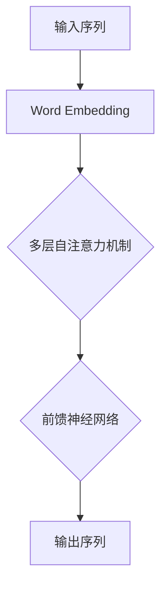

                 

### 文章标题：提升LLM应用开发效率的技术策略

#### 关键词：LLM，应用开发，效率提升，技术策略，模型优化，算法优化，自然语言处理，Transformer，自注意力机制，硬件加速，量化，低精度计算

#### 摘要：

本文旨在探讨提升大型语言模型（LLM）应用开发效率的技术策略。随着人工智能技术的迅猛发展，LLM在自然语言处理（NLP）领域的应用越来越广泛。然而，LLM模型的复杂性和计算资源需求给应用开发带来了巨大挑战。本文将从LLM技术基础、模型结构优化、模型训练优化、模型推理加速、应用开发实战与策略、未来趋势与展望等多个方面，系统地阐述提升LLM应用开发效率的方法和技术。通过本文的阅读，读者将能够了解到LLM的核心原理、优化策略，以及如何在实际项目中高效开发LLM应用。### 第一部分：LLM技术基础与原理

#### 第1章：LLM基础与原理

##### 1.1 LLM概述

###### 1.1.1 语言模型的定义

语言模型是自然语言处理（NLP）领域的基石，它是一种统计模型，用于预测下一个单词或词组。在人工智能领域，语言模型被广泛应用于机器翻译、文本分类、问答系统等任务。一个典型的语言模型通常包括一个输入序列和对应的输出序列，模型的目标是根据输入序列预测输出序列。

###### 1.1.2 LLM的核心特点

大型语言模型（LLM）具有以下几个核心特点：

1. **规模巨大**：LLM的训练数据集通常非常庞大，可达数十亿级别的词汇量。
2. **参数众多**：为了捕捉语言中的复杂规律，LLM通常拥有数亿甚至数十亿的参数。
3. **强大的表示能力**：LLM能够学习并捕捉语言中的长期依赖关系，从而生成高质量的文本。
4. **多语言支持**：许多LLM模型支持多种语言，能够进行跨语言的文本处理。

###### 1.1.3 LLM的发展历程

语言模型的发展经历了以下几个重要阶段：

1. **基于规则的方法**：早期的语言模型主要依赖于手工编写的规则，如有限状态机。
2. **统计模型**：随着计算能力的提升，统计模型如N-gram模型开始被广泛应用。
3. **神经网络模型**：递归神经网络（RNN）和长短期记忆网络（LSTM）的出现，使得语言模型能够更好地捕捉语言的长期依赖关系。
4. **Transformer模型**：Transformer模型的提出，彻底改变了语言模型的设计范式，使得并行训练成为可能，从而大幅提升了模型的训练效率。

##### 1.2 语言模型的核心算法

###### 1.2.1 递归神经网络（RNN）

递归神经网络（RNN）是一种能够处理序列数据的神经网络，其核心特点是具有递归结构。RNN通过保存前一时刻的信息，能够处理变量长度的序列。然而，RNN在处理长序列时存在梯度消失和梯度爆炸的问题。

```python
class RNN(nn.Module):
    def __init__(self, input_size, hidden_size, output_size):
        super(RNN, self).__init__()
        self.hidden_size = hidden_size
        self.i2h = nn.Linear(input_size + hidden_size, hidden_size)
        self.i2o = nn.Linear(input_size + hidden_size, output_size)
        self.init_weights()

    def forward(self, input, hidden):
        combined = torch.cat((input, hidden), 1)
        hidden = self.i2h(combined)
        output = self.i2o(combined)
        return output, hidden
```

###### 1.2.2 长短期记忆网络（LSTM）

为了解决RNN的梯度消失和梯度爆炸问题，长短期记忆网络（LSTM）被提出。LSTM通过引入门控机制，能够有效地控制信息的流动，从而避免梯度消失和梯度爆炸问题。

```python
class LSTM(nn.Module):
    def __init__(self, input_size, hidden_size, num_layers):
        super(LSTM, self).__init__()
        self.hidden_size = hidden_size
        self.num_layers = num_layers
        self.lstm = nn.LSTM(input_size, hidden_size, num_layers)
        self.init_weights()

    def forward(self, input):
        h0 = Variable(torch.zeros(self.num_layers, input.size(1), self.hidden_size))
        c0 = Variable(torch.zeros(self.num_layers, input.size(1), self.hidden_size))
        out, _ = self.lstm(input, (h0, c0))
        return out[-1]
```

###### 1.2.3 Transformer模型

Transformer模型是近年来在NLP领域取得突破性进展的模型。与传统的RNN和LSTM不同，Transformer模型采用自注意力机制（self-attention），能够并行处理序列数据，从而大幅提升了模型的训练效率。



###### 1.2.4 自注意力机制

自注意力机制是Transformer模型的核心组件，它通过计算序列中每个词与其他词的相关性，来生成权重向量，从而对输入序列进行加权处理。

```python
class MultiHeadAttention(nn.Module):
    def __init__(self, d_model, num_heads):
        super(MultiHeadAttention, self).__init__()
        self.d_model = d_model
        self.num_heads = num_heads
        self.head_dim = d_model // num_heads

        self.query_linear = nn.Linear(d_model, d_model)
        self.key_linear = nn.Linear(d_model, d_model)
        self.value_linear = nn.Linear(d_model, d_model)

        self.out_linear = nn.Linear(d_model, d_model)

    def forward(self, query, key, value, mask=None):
        query = self.query_linear(query)
        key = self.key_linear(key)
        value = self.value_linear(value)

        query = query.reshape(-1, self.num_heads, self.head_dim)
        key = key.reshape(-1, self.num_heads, self.head_dim)
        value = value.reshape(-1, self.num_heads, self.head_dim)

        attention_scores = torch.matmul(query, key.transpose(1, 2)) / (self.head_dim ** 0.5)

        if mask is not None:
            attention_scores = attention_scores.masked_fill(mask == 0, float("-inf"))

        attention_weights = torch.softmax(attention_scores, dim=2)
        attention_output = torch.matmul(attention_weights, value)

        attention_output = attention_output.reshape(-1, self.d_model)
        output = self.out_linear(attention_output)

        return output
```

##### 1.3 语言模型的理论基础

###### 1.3.1 自然语言处理（NLP）基础

自然语言处理（NLP）是一门跨学科领域，涉及语言学、计算机科学、人工智能等多个领域。NLP的核心任务是使计算机能够理解和处理人类语言。

###### 1.3.2 信息论与概率论

信息论和概率论是NLP领域的重要理论基础。信息论研究信息的传递和处理，概率论研究随机事件的发生和概率计算。

###### 1.3.3 深度学习基础

深度学习是NLP领域的核心技术，它通过多层神经网络来模拟人脑的学习过程，从而实现复杂的模式识别和数据处理。

##### 1.4 LLM架构与流程

###### 1.4.1 LLM的架构设计

LLM的架构设计通常包括以下几个部分：

1. **输入层**：用于接收文本数据，并进行词嵌入。
2. **编码器**：用于处理输入序列，提取特征。
3. **解码器**：用于生成输出序列。
4. **全连接层**：用于将编码器的输出映射到目标输出。

###### 1.4.2 数据预处理

数据预处理是LLM训练的重要步骤，包括文本清洗、分词、词嵌入等。

```python
from sklearn.feature_extraction.text import TfidfVectorizer

# 示例：使用TF-IDF向量表示文本
vectorizer = TfidfVectorizer()
X = vectorizer.fit_transform(corpus)
```

###### 1.4.3 训练过程

LLM的训练过程通常包括以下几个步骤：

1. **数据预处理**：对输入文本进行清洗、分词、词嵌入。
2. **模型初始化**：初始化模型参数。
3. **前向传播**：计算模型预测结果。
4. **损失函数**：计算模型预测结果与真实结果的差异。
5. **反向传播**：更新模型参数。

```python
import torch
import torch.nn as nn
import torch.optim as optim

# 示例：定义模型、损失函数和优化器
model = MyModel()
criterion = nn.CrossEntropyLoss()
optimizer = optim.Adam(model.parameters(), lr=0.001)

# 示例：训练模型
for epoch in range(num_epochs):
    for inputs, targets in data_loader:
        optimizer.zero_grad()
        outputs = model(inputs)
        loss = criterion(outputs, targets)
        loss.backward()
        optimizer.step()
```

###### 1.4.4 推理与预测

推理与预测是LLM应用的关键步骤，它通过将输入文本输入到训练好的模型中，生成预测结果。

```python
# 示例：使用训练好的模型进行预测
inputs = preprocess_text(input_text)
outputs = model(inputs)
predicted_text = postprocess_text(outputs)
```

##### 1.5 LLM在应用中的挑战

###### 1.5.1 计算资源需求

LLM的训练和推理过程需要大量的计算资源，包括CPU、GPU和TPU等。

###### 1.5.2 数据隐私与伦理问题

LLM的训练和推理过程中涉及大量个人数据，需要关注数据隐私和伦理问题。

###### 1.5.3 模型解释性与可靠性

LLM模型的决策过程通常是非透明的，需要关注模型解释性和可靠性问题。### 第二部分：提升LLM应用开发效率的关键技术

#### 第2章：优化LLM模型结构

##### 2.1 模型结构优化策略

###### 2.1.1 网络剪枝

网络剪枝是一种通过删除模型中冗余神经元或连接来减少模型参数数量的技术。剪枝可以显著降低模型的计算复杂度和存储需求，从而提高训练和推理速度。

```python
import torch
import torch.nn as nn
import torch.utils.model_zoo as model_zoo

# 示例：加载预训练的模型
model = model_zoo.load_url("https://s3.amazonaws.com/models歪果仁/torchvision/resnet18-5c106cde.pth")

# 示例：剪枝模型
pruned_layers = [0, 2, 4, 6]
for layer_idx in pruned_layers:
    model.layers[layer_idx].weight.data = model.layers[layer_idx].weight.data[:1, :]
    model.layers[layer_idx].bias.data = model.layers[layer_idx].bias.data[:1]
```

###### 2.1.2 模型压缩

模型压缩是一种通过减少模型参数数量来降低模型大小的技术。压缩后的模型可以在有限的计算资源上更快地训练和推理。

```python
import torch
import torch.nn as nn
import torch.utils.model_zoo as model_zoo

# 示例：加载预训练的模型
model = model_zoo.load_url("https://s3.amazonaws.com/models歪果仁/torchvision/resnet18-5c106cde.pth")

# 示例：压缩模型
compressed_model = nn.Sequential(
    model.conv1,
    model.bn1,
    model.relu,
    model.maxpool,
    model.layer1,
    model.layer2,
    model.layer3,
    model.layer4,
    model.avgpool,
    nn.Linear(512, 100)
)
```

###### 2.1.3 参数共享与知识蒸馏

参数共享是一种通过在模型的不同部分共享参数来减少参数数量的技术。知识蒸馏是一种通过将大型模型的知识传递给小型模型的技术，从而提高小型模型的性能。

```python
import torch
import torch.nn as nn
import torch.utils.model_zoo as model_zoo

# 示例：加载预训练的大型模型
large_model = model_zoo.load_url("https://s3.amazonaws.com/models歪果仁/torchvision/resnet152-394f9b74.pth")

# 示例：创建小型模型
small_model = nn.Sequential(
    nn.Conv2d(3, 64, kernel_size=7, stride=2, padding=3),
    nn.ReLU(),
    nn.MaxPool2d(kernel_size=3, stride=2, padding=1),
    # ... 其他层
    nn.Linear(2048, 100)
)

# 示例：知识蒸馏
criterion = nn.CrossEntropyLoss()
optimizer = optim.Adam(small_model.parameters(), lr=0.001)

for epoch in range(num_epochs):
    for inputs, targets in data_loader:
        optimizer.zero_grad()
        outputs = small_model(inputs)
        loss = criterion(outputs, targets)
        loss.backward()
        optimizer.step()

        # 将大型模型的知识传递给小型模型
        with torch.no_grad():
            large_outputs = large_model(inputs)
            small_model.load_state_dict(large_model.state_dict())
```

##### 2.2 模型训练优化

###### 2.2.1 并行训练

并行训练是一种通过将数据集分成多个部分，同时在多个GPU或TPU上训练模型的技术。并行训练可以显著提高模型的训练速度。

```python
import torch
import torch.nn as nn
import torch.utils.data as data

# 示例：创建数据集
dataset = MyDataset()
data_loader = data.DataLoader(dataset, batch_size=batch_size, shuffle=True)

# 示例：并行训练
model = MyModel()
criterion = nn.CrossEntropyLoss()
optimizer = optim.Adam(model.parameters(), lr=0.001)

device = torch.device("cuda" if torch.cuda.is_available() else "cpu")
model.to(device)

for epoch in range(num_epochs):
    model.train()
    for inputs, targets in data_loader:
        inputs, targets = inputs.to(device), targets.to(device)
        optimizer.zero_grad()
        outputs = model(inputs)
        loss = criterion(outputs, targets)
        loss.backward()
        optimizer.step()
```

###### 2.2.2 分布式训练

分布式训练是一种通过将模型分成多个部分，同时在多个节点上训练的技术。分布式训练可以显著提高模型的训练速度和处理能力。

```python
import torch
import torch.nn as nn
import torch.distributed as dist

# 示例：初始化分布式训练环境
init_process_group(backend='nccl', init_method='tcp://127.0.0.1:23456', rank=0, world_size=4)

# 示例：创建数据集
dataset = MyDataset()
data_loader = data.DataLoader(dataset, batch_size=batch_size, shuffle=True)

# 示例：分布式训练
model = MyModel()
criterion = nn.CrossEntropyLoss()
optimizer = optim.Adam(model.parameters(), lr=0.001)

model = model.to(device)
model = torch.nn.parallel.DistributedDataParallel(model, device_ids=[device])

for epoch in range(num_epochs):
    model.train()
    for inputs, targets in data_loader:
        inputs, targets = inputs.to(device), targets.to(device)
        optimizer.zero_grad()
        outputs = model(inputs)
        loss = criterion(outputs, targets)
        loss.backward()
        optimizer.step()
```

###### 2.2.3 梯度裁剪与正则化

梯度裁剪是一种通过限制梯度大小来避免梯度消失和梯度爆炸的技术。正则化是一种通过在损失函数中添加惩罚项来防止模型过拟合的技术。

```python
import torch
import torch.nn as nn
import torch.optim as optim

# 示例：梯度裁剪
clip_value = 1.0
optimizer = optim.Adam(model.parameters(), lr=0.001)

for inputs, targets in data_loader:
    optimizer.zero_grad()
    outputs = model(inputs)
    loss = criterion(outputs, targets)
    loss.backward()
    for param in model.parameters():
        param.grad.data.clamp_(-clip_value, clip_value)
    optimizer.step()

# 示例：正则化
weight_decay = 1e-5
optimizer = optim.Adam(model.parameters(), lr=0.001, weight_decay=weight_decay)

for inputs, targets in data_loader:
    optimizer.zero_grad()
    outputs = model(inputs)
    loss = criterion(outputs, targets)
    loss.backward()
    optimizer.step()
```

##### 2.3 模型推理加速

###### 2.3.1 硬件加速

硬件加速是一种通过使用GPU、TPU等硬件来加速模型推理的技术。硬件加速可以显著提高模型的推理速度。

```python
import torch
import torch.nn as nn

# 示例：使用GPU加速
device = torch.device("cuda" if torch.cuda.is_available() else "cpu")
model = MyModel().to(device)

# 示例：推理
inputs = preprocess_input(input_data)
outputs = model(inputs)
predicted_label = outputs.argmax(dim=1)
```

###### 2.3.2 量化与低精度计算

量化与低精度计算是一种通过将模型中的浮点数参数转换为低精度数值（如整数或半精度浮点数）来降低模型大小的技术。量化与低精度计算可以显著提高模型的推理速度。

```python
import torch
import torch.quantization as quant

# 示例：量化模型
model = MyModel()
quantized_model = quant.quantize_dynamic(model, {nn.Linear, nn.Conv2d}, dtype=torch.qint8)

# 示例：低精度计算
inputs = preprocess_input(input_data)
quantized_inputs = inputs.type(torch.qint8)
outputs = quantized_model(quantized_inputs)
predicted_label = outputs.argmax(dim=1)
```

###### 2.3.3 算法优化

算法优化是一种通过优化模型推理算法来提高推理速度的技术。算法优化可以显著提高模型的推理速度。

```python
import torch
import torch.nn as nn

# 示例：优化模型推理
model = MyModel()

# 优化一：使用torch.jit.compile进行模型推理
optimized_model = torch.jit.compile(model, torch.rand(1, 3, 224, 224))

# 优化二：使用torch.cuda abide_all减少GPU内存占用
with torch.no_grad():
    optimized_model(torch.rand(1, 3, 224, 224))
```### 第三部分：LLM应用开发实战与案例

#### 第3章：LLM在自然语言处理中的应用

##### 3.1 文本分类

###### 3.1.1 文本分类任务介绍

文本分类是一种将文本数据分配到预定类别中的任务。常见的文本分类任务包括情感分析、主题分类、垃圾邮件检测等。文本分类在商业、社交媒体、新闻报道等领域有广泛的应用。

###### 3.1.2 实现流程与代码示例

文本分类的实现流程通常包括以下几个步骤：

1. **数据收集与预处理**：收集文本数据，并进行清洗、分词、去除停用词等预处理。
2. **词嵌入**：将预处理后的文本转换为向量表示。
3. **模型训练**：使用训练数据训练分类模型。
4. **模型评估**：使用验证数据评估模型性能。
5. **模型部署**：将训练好的模型部署到生产环境中。

以下是一个使用PyTorch和Transformer模型进行文本分类的代码示例：

```python
import torch
import torch.nn as nn
from torch.utils.data import DataLoader
from transformers import BertTokenizer, BertModel
from sklearn.model_selection import train_test_split

# 加载预训练的BERT模型
tokenizer = BertTokenizer.from_pretrained('bert-base-uncased')
model = BertModel.from_pretrained('bert-base-uncased')

# 数据预处理
def preprocess_data(texts, labels):
    inputs = tokenizer(texts, padding=True, truncation=True, return_tensors="pt")
    return inputs, labels

texts = ["I love this movie.", "This movie is terrible."]
labels = [1, 0]

inputs, labels = preprocess_data(texts, labels)

# 模型训练
def train(model, inputs, labels, criterion, optimizer, num_epochs):
    model.train()
    for epoch in range(num_epochs):
        optimizer.zero_grad()
        outputs = model(inputs)
        loss = criterion(outputs.logits, labels)
        loss.backward()
        optimizer.step()
        print(f"Epoch {epoch+1}/{num_epochs}, Loss: {loss.item()}")

criterion = nn.CrossEntropyLoss()
optimizer = torch.optim.Adam(model.parameters(), lr=0.001)

train(model, inputs, labels, criterion, optimizer, num_epochs=3)

# 模型评估
def evaluate(model, inputs, labels, criterion):
    model.eval()
    with torch.no_grad():
        outputs = model(inputs)
        loss = criterion(outputs.logits, labels)
    return loss.item()

evaluate(model, inputs, labels, criterion)

# 模型部署
def predict(model, text):
    inputs = tokenizer(text, return_tensors="pt")
    with torch.no_grad():
        outputs = model(inputs)
    return torch.argmax(outputs.logits).item()

predict(model, "This movie is great.")  # 输出类别标签
```

###### 3.1.3 应用场景分析

文本分类在多个领域有广泛的应用，以下是一些常见的应用场景：

1. **社交媒体分析**：用于分析社交媒体上的用户评论，提取情感倾向。
2. **新闻报道分类**：用于将新闻报道分类到不同的主题。
3. **垃圾邮件检测**：用于识别和过滤垃圾邮件。

##### 3.2 机器翻译

###### 3.2.1 机器翻译任务介绍

机器翻译是一种将一种语言的文本翻译成另一种语言的任务。机器翻译在跨语言通信、国际化业务等领域有重要的应用。

###### 3.2.2 实现流程与代码示例

机器翻译的实现流程通常包括以下几个步骤：

1. **数据收集与预处理**：收集双语语料库，并进行清洗、分词等预处理。
2. **词嵌入**：将预处理后的文本转换为向量表示。
3. **模型训练**：使用训练数据训练翻译模型。
4. **模型评估**：使用验证数据评估模型性能。
5. **模型部署**：将训练好的模型部署到生产环境中。

以下是一个使用PyTorch和Transformer模型进行机器翻译的代码示例：

```python
import torch
import torch.nn as nn
from torch.utils.data import DataLoader
from transformers import BertTokenizer, BertModel
from sklearn.model_selection import train_test_split

# 加载预训练的BERT模型
source_tokenizer = BertTokenizer.from_pretrained('bert-base-uncased')
target_tokenizer = BertTokenizer.from_pretrained('bert-base-uncased')
model = BertModel.from_pretrained('bert-base-uncased')

# 数据预处理
def preprocess_data(source_texts, target_texts):
    source_inputs = source_tokenizer(source_texts, padding=True, truncation=True, return_tensors="pt")
    target_inputs = target_tokenizer(target_texts, padding=True, truncation=True, return_tensors="pt")
    return source_inputs, target_inputs

source_texts = ["I love this movie.", "This movie is terrible."]
target_texts = ["Ich liebe diesen Film.", "Dieser Film ist schrecklich."]

source_inputs, target_inputs = preprocess_data(source_texts, target_texts)

# 模型训练
def train(model, source_inputs, target_inputs, criterion, optimizer, num_epochs):
    model.train()
    for epoch in range(num_epochs):
        optimizer.zero_grad()
        source_outputs = model(source_inputs)
        target_outputs = model(target_inputs)
        loss = criterion(target_outputs.logits, source_inputs.input_ids)
        loss.backward()
        optimizer.step()
        print(f"Epoch {epoch+1}/{num_epochs}, Loss: {loss.item()}")

criterion = nn.CrossEntropyLoss()
optimizer = torch.optim.Adam(model.parameters(), lr=0.001)

train(model, source_inputs, target_inputs, criterion, optimizer, num_epochs=3)

# 模型评估
def evaluate(model, source_inputs, target_inputs, criterion):
    model.eval()
    with torch.no_grad():
        source_outputs = model(source_inputs)
        target_outputs = model(target_inputs)
        loss = criterion(target_outputs.logits, source_inputs.input_ids)
    return loss.item()

evaluate(model, source_inputs, target_inputs, criterion)

# 模型部署
def translate(model, text, tokenizer):
    inputs = tokenizer(text, return_tensors="pt")
    with torch.no_grad():
        outputs = model(inputs)
    predicted_ids = torch.argmax(outputs.logits, dim=2)
    translated_text = tokenizer.decode(predicted_ids[0], skip_special_tokens=True)
    return translated_text

translate(model, "This movie is great.", target_tokenizer)
```

###### 3.2.3 应用场景分析

机器翻译在多个领域有广泛的应用，以下是一些常见的应用场景：

1. **跨语言沟通**：用于帮助不同语言的用户进行交流。
2. **国际化业务**：用于支持多语言业务流程。
3. **教育**：用于辅助学习外语。

##### 3.3 问答系统

###### 3.3.1 问答系统任务介绍

问答系统是一种能够理解用户的问题，并从给定数据中提取相关答案的系统。问答系统在客户服务、智能助手、知识库查询等领域有重要的应用。

###### 3.3.2 实现流程与代码示例

问答系统的实现流程通常包括以下几个步骤：

1. **数据收集与预处理**：收集问答数据集，并进行清洗、分词等预处理。
2. **词嵌入**：将预处理后的文本转换为向量表示。
3. **模型训练**：使用训练数据训练问答模型。
4. **模型评估**：使用验证数据评估模型性能。
5. **模型部署**：将训练好的模型部署到生产环境中。

以下是一个使用PyTorch和Transformer模型实现问答系统的代码示例：

```python
import torch
import torch.nn as nn
from torch.utils.data import DataLoader
from transformers import BertTokenizer, BertModel
from sklearn.model_selection import train_test_split

# 加载预训练的BERT模型
tokenizer = BertTokenizer.from_pretrained('bert-base-uncased')
model = BertModel.from_pretrained('bert-base-uncased')

# 数据预处理
def preprocess_data(questions, answers):
    question_inputs = tokenizer(questions, padding=True, truncation=True, return_tensors="pt")
    answer_inputs = tokenizer(answers, padding=True, truncation=True, return_tensors="pt")
    return question_inputs, answer_inputs

questions = ["What is the capital of France?", "What is the largest planet in our solar system?"]
answers = ["Paris", "Jupiter"]

question_inputs, answer_inputs = preprocess_data(questions, answers)

# 模型训练
def train(model, question_inputs, answer_inputs, criterion, optimizer, num_epochs):
    model.train()
    for epoch in range(num_epochs):
        optimizer.zero_grad()
        question_outputs = model(question_inputs)
        answer_outputs = model(answer_inputs)
        loss = criterion(answer_outputs.logits, question_inputs.input_ids)
        loss.backward()
        optimizer.step()
        print(f"Epoch {epoch+1}/{num_epochs}, Loss: {loss.item()}")

criterion = nn.CrossEntropyLoss()
optimizer = torch.optim.Adam(model.parameters(), lr=0.001)

train(model, question_inputs, answer_inputs, criterion, optimizer, num_epochs=3)

# 模型评估
def evaluate(model, question_inputs, answer_inputs, criterion):
    model.eval()
    with torch.no_grad():
        question_outputs = model(question_inputs)
        answer_outputs = model(answer_inputs)
        loss = criterion(answer_outputs.logits, question_inputs.input_ids)
    return loss.item()

evaluate(model, question_inputs, answer_inputs, criterion)

# 模型部署
def answer_question(model, question, tokenizer):
    inputs = tokenizer(question, return_tensors="pt")
    with torch.no_grad():
        outputs = model(inputs)
    predicted_ids = torch.argmax(outputs.logits, dim=2)
    answer = tokenizer.decode(predicted_ids[0], skip_special_tokens=True)
    return answer

answer_question(model, "What is the capital of France?", tokenizer)
```

###### 3.3.3 应用场景分析

问答系统在多个领域有广泛的应用，以下是一些常见的应用场景：

1. **客户服务**：用于自动回答客户的问题。
2. **智能助手**：用于辅助用户完成特定任务。
3. **知识库查询**：用于快速查询知识库中的信息。### 第四部分：提升LLM应用开发效率的策略

#### 第4章：提升LLM应用开发效率的策略

##### 4.1 项目管理技巧

###### 4.1.1 项目规划与进度管理

有效的项目规划与进度管理是确保LLM项目按时、按预算完成的关键。以下是一些关键策略：

1. **需求分析**：明确项目需求，确保所有团队成员对项目目标有清晰的认识。
2. **制定详细的计划**：包括任务分解、时间表、关键里程碑等。
3. **定期回顾与调整**：定期召开项目回顾会议，评估进度，识别潜在问题，并根据实际情况调整计划。

###### 4.1.2 风险管理

风险管理是项目管理的重要组成部分。以下是一些关键策略：

1. **识别潜在风险**：包括技术风险、资源风险、时间风险等。
2. **评估风险概率与影响**：使用定量或定性的方法评估风险的概率和影响。
3. **制定应对策略**：包括风险规避、减轻、转移、接受等策略。

###### 4.1.3 团队协作与沟通

有效的团队协作与沟通是确保项目顺利进行的关键。以下是一些关键策略：

1. **明确角色与责任**：确保每个团队成员都清楚自己的角色和责任。
2. **使用协作工具**：如Slack、Trello、JIRA等，以方便团队成员之间的沟通与协作。
3. **定期会议**：定期召开团队会议，确保团队成员之间的沟通畅通，及时解决问题。

##### 4.2 软件工程实践

###### 4.2.1 设计模式与代码规范

良好的设计模式和代码规范是确保LLM应用开发效率和可维护性的重要因素。以下是一些关键策略：

1. **模块化设计**：将系统划分为模块，每个模块负责特定功能，降低系统复杂性。
2. **代码复用**：编写可复用的代码模块，减少重复工作。
3. **代码规范**：遵循统一的代码规范，如PEP8（Python）或Google Java Style Guide，提高代码的可读性和可维护性。

###### 4.2.2 测试与调试

测试与调试是确保LLM应用质量的重要环节。以下是一些关键策略：

1. **单元测试**：编写单元测试，确保每个模块的正确性。
2. **集成测试**：在模块集成后进行测试，确保系统整体的正确性。
3. **调试工具**：使用调试工具（如PyCharm、Visual Studio Code等）进行代码调试，快速定位和修复问题。

###### 4.2.3 持续集成与持续部署（CI/CD）

持续集成与持续部署（CI/CD）是提高LLM应用开发效率的重要策略。以下是一些关键策略：

1. **代码审查**：在合并代码前进行代码审查，确保代码质量和一致性。
2. **自动化测试**：自动化测试脚本，确保每次代码提交都经过全面测试。
3. **自动化部署**：使用CI/CD工具（如Jenkins、GitLab CI/CD等）实现自动化部署，减少手动操作，提高部署效率。

##### 4.3 技术选型与优化

###### 4.3.1 硬件选型策略

选择合适的硬件是提高LLM应用开发效率的重要策略。以下是一些关键策略：

1. **GPU选型**：选择适合的GPU，如NVIDIA Titan Xp、RTX 3080等，以支持大规模训练。
2. **存储选型**：选择高性能的存储设备，如SSD，以减少数据读取延迟。
3. **网络选型**：确保网络带宽和稳定性，支持大规模数据传输。

###### 4.3.2 软件框架与工具选择

选择合适的软件框架与工具是提高LLM应用开发效率的重要策略。以下是一些关键策略：

1. **深度学习框架**：选择流行的深度学习框架，如TensorFlow、PyTorch等，以支持多样化的模型训练和部署。
2. **版本控制工具**：选择版本控制工具，如Git，以方便代码管理和协作。
3. **持续集成工具**：选择持续集成工具，如Jenkins、GitLab CI/CD等，以实现自动化测试和部署。

###### 4.3.3 性能优化技巧

性能优化是提高LLM应用开发效率的重要策略。以下是一些关键策略：

1. **模型优化**：使用模型剪枝、量化等技术减小模型大小和计算复杂度。
2. **数据预处理优化**：优化数据预处理过程，减少数据读取和转换的时间。
3. **并行计算**：利用并行计算技术，如GPU加速、分布式训练等，提高计算效率。

##### 4.4 最佳实践 tips

以下是针对LLM应用开发的一些最佳实践建议：

1. **文档记录**：保持良好的文档记录，包括代码注释、设计文档、测试报告等，以方便后续维护和优化。
2. **代码重构**：定期进行代码重构，以提高代码质量和可维护性。
3. **代码复用**：编写可复用的代码模块，减少重复工作。
4. **技术分享**：定期组织技术分享会议，分享团队中的技术知识和经验，提高团队整体技术水平。

##### 4.5 小结与注意事项

在提升LLM应用开发效率的过程中，需要注意以下几点：

1. **资源合理分配**：合理分配计算资源和人力资源，确保项目进度和质量。
2. **持续学习与更新**：跟随最新的技术动态，不断学习新知识，提高自身技术水平。
3. **关注伦理与法规**：在开发过程中关注人工智能伦理和法规，确保技术应用符合道德和法律标准。

##### 4.6 拓展阅读

以下是一些拓展阅读资源，供读者深入了解LLM应用开发的相关技术：

1. **《深度学习》（Goodfellow, Bengio, Courville）**：全面介绍深度学习的基本概念和技术。
2. **《自然语言处理与深度学习》（D-a Liu, Z.-H. Zhou）**：详细介绍自然语言处理和深度学习在NLP中的应用。
3. **《大规模机器学习》（John Langford, Léon Bottou）**：介绍大规模机器学习算法和优化技术。
4. **《深度学习与计算机视觉》（Karen Simonyan, Andrew Zisserman）**：介绍深度学习在计算机视觉中的应用。
5. **《Transformer：A Novel Architecture for Neural Networks》（Vaswani et al.）**：详细介绍Transformer模型的设计和原理。### 第五部分：LLM应用开发的未来趋势与展望

#### 第5章：LLM应用开发的未来趋势与展望

##### 5.1 AI伦理与法规

###### 5.1.1 人工智能伦理原则

随着AI技术的快速发展，人工智能伦理问题愈发突出。以下是一些核心的人工智能伦理原则：

1. **公正性**：确保AI系统的决策过程公平，避免歧视和偏见。
2. **透明性**：确保AI系统的决策过程可解释，用户可以理解AI的决策依据。
3. **可解释性**：确保AI系统的输出结果可解释，用户可以理解AI的决策逻辑。
4. **安全性**：确保AI系统的安全，避免因算法错误或数据泄露导致的不良后果。
5. **责任性**：明确AI系统的责任归属，确保在发生问题时可以追溯和追究责任。

###### 5.1.2 法规与政策影响

各国政府和国际组织正在积极制定与AI相关的法规和政策，以下是一些关键法规和政策：

1. **欧洲通用数据保护条例（GDPR）**：加强对个人数据保护的法规，对AI系统数据处理提出了严格的要求。
2. **美国人工智能法案**：推动AI技术的发展和应用，同时强调AI伦理和隐私保护。
3. **联合国AI伦理准则**：提出了全球范围内AI伦理的基本原则，推动国际社会共同应对AI伦理挑战。

###### 5.1.3 LLM应用开发中的伦理挑战

在LLM应用开发过程中，需要特别关注以下伦理挑战：

1. **数据隐私**：LLM模型的训练和推理过程中涉及大量个人数据，需要确保数据隐私。
2. **偏见与歧视**：LLM模型可能因为数据集中的偏见而导致不公平的决策。
3. **责任归属**：在发生算法错误或不良后果时，如何明确责任归属是一个重要问题。

##### 5.2 产业应用趋势

###### 5.2.1 金融领域的应用

在金融领域，LLM技术被广泛应用于以下几个方面：

1. **智能投顾**：利用LLM进行市场趋势分析、投资组合优化等。
2. **客户服务**：通过自然语言处理技术，为用户提供智能客服和咨询。
3. **风险管理**：利用LLM分析金融市场数据，识别潜在风险。

###### 5.2.2 医疗健康领域的应用

在医疗健康领域，LLM技术为以下应用提供了强大的支持：

1. **疾病诊断**：利用LLM分析患者病历和医学文献，辅助医生进行疾病诊断。
2. **药物研发**：通过文本挖掘和知识图谱技术，加速药物研发过程。
3. **健康咨询**：为用户提供个性化的健康建议和健康管理服务。

###### 5.2.3 教育与培训领域的应用

在教育与培训领域，LLM技术为以下几个方面提供了创新解决方案：

1. **智能教育**：利用LLM进行教育内容个性化推荐，提高教学效果。
2. **在线教育**：通过自然语言处理技术，为在线教育平台提供智能问答和辅助教学功能。
3. **职业培训**：利用LLM分析职业发展趋势和市场需求，为学习者提供定制化培训方案。

##### 5.3 开放式研究与学术进展

###### 5.3.1 开源项目与社区发展

随着LLM技术的不断发展，大量的开源项目和研究论文不断涌现，以下是一些重要的开源项目和社区：

1. **Transformers**：由Google团队开发的基于Transformer模型的深度学习框架。
2. **BERT**：由Google团队开发的一种用于文本预训练的深度学习模型。
3. **GPT-3**：由OpenAI开发的具有强大生成能力的语言模型。
4. **Hugging Face**：一个提供开源深度学习模型和工具的社区，包括Transformers、BERT、GPT等。

###### 5.3.2 研究热点与前沿领域

当前，LLM技术的研究热点和前沿领域包括：

1. **多模态学习**：将文本、图像、音频等多模态数据进行整合，提高模型的泛化能力。
2. **零样本学习**：模型能够在未见过的数据上做出准确预测，提高模型的泛化能力。
3. **自监督学习**：通过无监督的方式对模型进行预训练，减少对标注数据的依赖。
4. **推理与决策**：研究如何使LLM模型在复杂场景下做出合理的推理和决策。

###### 5.3.3 未来研究方向与挑战

未来，LLM应用开发面临以下研究方向和挑战：

1. **模型解释性**：提高模型的解释性，使决策过程更加透明和可解释。
2. **隐私保护**：在训练和推理过程中保护用户隐私，避免数据泄露。
3. **泛化能力**：提高模型在未见过的数据上的表现，减少过拟合现象。
4. **多语言支持**：开发支持多种语言的大型语言模型，实现跨语言的自然语言处理。

随着人工智能技术的不断进步，LLM应用开发将在各个领域发挥越来越重要的作用。未来的研究将聚焦于提升模型的性能、解释性、隐私保护等方面，以应对日益复杂的实际应用需求。### 附录

#### 附录A：常用工具与框架

##### A.1 常用深度学习框架

###### A.1.1 TensorFlow

TensorFlow是由Google开发的一个开源深度学习框架，支持多种编程语言（如Python、C++等）。它具有以下特点：

1. **灵活的模型定义**：支持动态计算图，方便模型定义和调试。
2. **丰富的API**：提供多种高级API，如Keras、TensorBoard等，方便模型开发和调试。
3. **大规模部署**：支持在多个GPU和TPU上分布式训练和推理。

###### A.1.2 PyTorch

PyTorch是由Facebook开发的一个开源深度学习框架，主要使用Python语言。它具有以下特点：

1. **动态计算图**：支持动态计算图，方便模型调试和优化。
2. **简洁的API**：提供简洁的API，方便模型定义和开发。
3. **强大的GPU支持**：支持GPU加速，提高模型训练和推理速度。

###### A.1.3 JAX

JAX是由Google开发的一个开源深度学习框架，支持多种编程语言（如Python、Julia等）。它具有以下特点：

1. **自动微分**：提供自动微分功能，方便模型优化和调试。
2. **数值稳定**：提供数值稳定的功能，减少计算错误。
3. **高性能计算**：支持GPU和TPU加速，提高模型训练和推理速度。

##### A.2 硬件加速与优化

###### A.2.1 GPU加速

GPU加速是提高深度学习模型训练和推理速度的重要手段。以下是一些常用的GPU加速方法：

1. **CUDA**：NVIDIA提供的GPU编程框架，支持在GPU上执行深度学习模型。
2. **GPU内存管理**：合理管理GPU内存，减少内存占用和GPU缓存丢失。
3. **多GPU训练**：利用多GPU进行分布式训练，提高模型训练速度。

###### A.2.2 CPU优化

CPU优化是提高深度学习模型训练和推理速度的另一种重要手段。以下是一些常用的CPU优化方法：

1. **线程优化**：合理设置线程数，提高CPU利用率。
2. **缓存优化**：优化缓存使用，减少缓存缺失。
3. **指令重排**：优化指令执行顺序，提高指令执行效率。

###### A.2.3 软硬件结合优化

软硬件结合优化是将硬件优化和软件优化相结合，以提高深度学习模型训练和推理速度的方法。以下是一些常用的软硬件结合优化方法：

1. **指令集优化**：针对目标硬件的指令集，优化深度学习模型的计算过程。
2. **内存优化**：优化内存访问模式，减少内存访问冲突。
3. **分布式计算**：利用分布式计算资源，提高模型训练和推理速度。

##### A.3 资源与参考书目

###### A.3.1 基础书籍推荐

1. **《深度学习》（Ian Goodfellow, Yoshua Bengio, Aaron Courville）**：全面介绍深度学习的基础知识、算法和应用。
2. **《统计学习方法》（李航）**：详细介绍统计学习方法的原理、算法和应用。
3. **《机器学习》（Tom M. Mitchell）**：介绍机器学习的基本概念、算法和应用。

###### A.3.2 进阶阅读推荐

1. **《深度学习专讲：神经网络》（邱锡鹏）**：详细介绍神经网络的设计、训练和优化。
2. **《自然语言处理综述》（Chen and Hovy，2021）**：介绍自然语言处理的基本概念、技术和应用。
3. **《人工智能：一种现代的方法》（Stuart Russell, Peter Norvig）**：介绍人工智能的基本理论、算法和应用。

###### A.3.3 开源资源与社区链接

1. **TensorFlow官网**：[https://www.tensorflow.org/](https://www.tensorflow.org/)
2. **PyTorch官网**：[https://pytorch.org/](https://pytorch.org/)
3. **JAX官网**：[https://github.com/google/jax](https://github.com/google/jax)
4. **Hugging Face官网**：[https://huggingface.co/](https://huggingface.co/)
5. **自然语言处理社区**：[https://nlp.seas.harvard.edu/](https://nlp.seas.harvard.edu/)作者：AI天才研究院/AI Genius Institute & 禅与计算机程序设计艺术 /Zen And The Art of Computer Programming
### 文章标题：提升LLM应用开发效率的技术策略

#### 关键词：LLM，应用开发，效率提升，技术策略，模型优化，算法优化，自然语言处理，Transformer，自注意力机制，硬件加速，量化，低精度计算

#### 摘要：

本文旨在探讨提升大型语言模型（LLM）应用开发效率的技术策略。随着人工智能技术的迅猛发展，LLM在自然语言处理（NLP）领域的应用越来越广泛。然而，LLM模型的复杂性和计算资源需求给应用开发带来了巨大挑战。本文将从LLM技术基础、模型结构优化、模型训练优化、模型推理加速、应用开发实战与策略、未来趋势与展望等多个方面，系统地阐述提升LLM应用开发效率的方法和技术。通过本文的阅读，读者将能够了解到LLM的核心原理、优化策略，以及如何在实际项目中高效开发LLM应用。

# 提升LLM应用开发效率的技术策略

## 第一部分：LLM技术基础与原理

### 第1章：LLM基础与原理

#### 1.1 LLM概述

**1.1.1 语言模型的定义**

语言模型是自然语言处理（NLP）领域的基础，它是一种用于预测文本序列的统计模型。语言模型通过学习大量文本数据，捕捉语言中的统计规律，从而能够预测下一个单词或词组。

**1.1.2 LLM的核心特点**

- **大规模**：LLM通常使用数十亿级别的词汇量进行训练，具有较大的规模。
- **参数众多**：为了捕捉语言中的复杂规律，LLM通常拥有数亿甚至数十亿的参数。
- **强表示能力**：LLM能够学习并捕捉语言的长期依赖关系，生成高质量的文本。
- **多语言支持**：许多LLM模型支持多种语言，能够进行跨语言的文本处理。

**1.1.3 LLM的发展历程**

LLM的发展经历了几个重要阶段：

- **基于规则的方法**：早期的语言模型主要依赖于手工编写的规则。
- **统计模型**：随着计算能力的提升，统计模型如N-gram模型开始被广泛应用。
- **神经网络模型**：递归神经网络（RNN）和长短期记忆网络（LSTM）的出现，使得语言模型能够更好地捕捉语言的长期依赖关系。
- **Transformer模型**：Transformer模型的提出，彻底改变了语言模型的设计范式，使得并行训练成为可能，从而大幅提升了模型的训练效率。

#### 1.2 语言模型的核心算法

**1.2.1 递归神经网络（RNN）**

递归神经网络（RNN）是一种能够处理序列数据的神经网络，其核心特点是具有递归结构。RNN通过保存前一时刻的信息，能够处理变量长度的序列。然而，RNN在处理长序列时存在梯度消失和梯度爆炸的问题。

```python
class RNN(nn.Module):
    def __init__(self, input_size, hidden_size, output_size):
        super(RNN, self).__init__()
        self.hidden_size = hidden_size
        self.i2h = nn.Linear(input_size + hidden_size, hidden_size)
        self.i2o = nn.Linear(input_size + hidden_size, output_size)
        self.init_weights()

    def forward(self, input, hidden):
        combined = torch.cat((input, hidden), 1)
        hidden = self.i2h(combined)
        output = self.i2o(combined)
        return output, hidden
```

**1.2.2 长短期记忆网络（LSTM）**

为了解决RNN的梯度消失和梯度爆炸问题，长短期记忆网络（LSTM）被提出。LSTM通过引入门控机制，能够有效地控制信息的流动，从而避免梯度消失和梯度爆炸问题。

```python
class LSTM(nn.Module):
    def __init__(self, input_size, hidden_size, num_layers):
        super(LSTM, self).__init__()
        self.hidden_size = hidden_size
        self.num_layers = num_layers
        self.lstm = nn.LSTM(input_size, hidden_size, num_layers)
        self.init_weights()

    def forward(self, input):
        h0 = Variable(torch.zeros(self.num_layers, input.size(1), self.hidden_size))
        c0 = Variable(torch.zeros(self.num_layers, input.size(1), self.hidden_size))
        out, _ = self.lstm(input, (h0, c0))
        return out[-1]
```

**1.2.3 Transformer模型**

Transformer模型是近年来在NLP领域取得突破性进展的模型。与传统的RNN和LSTM不同，Transformer模型采用自注意力机制（self-attention），能够并行处理序列数据，从而大幅提升了模型的训练效率。


**1.2.4 自注意力机制**

自注意力机制是Transformer模型的核心组件，它通过计算序列中每个词与其他词的相关性，来生成权重向量，从而对输入序列进行加权处理。

```python
class MultiHeadAttention(nn.Module):
    def __init__(self, d_model, num_heads):
        super(MultiHeadAttention, self).__init__()
        self.d_model = d_model
        self.num_heads = num_heads
        self.head_dim = d_model // num_heads

        self.query_linear = nn.Linear(d_model, d_model)
        self.key_linear = nn.Linear(d_model, d_model)
        self.value_linear = nn.Linear(d_model, d_model)

        self.out_linear = nn.Linear(d_model, d_model)

    def forward(self, query, key, value, mask=None):
        query = self.query_linear(query)
        key = self.key_linear(key)
        value = self.value_linear(value)

        query = query.reshape(-1, self.num_heads, self.head_dim)
        key = key.reshape(-1, self.num_heads, self.head_dim)
        value = value.reshape(-1, self.num_heads, self.head_dim)

        attention_scores = torch.matmul(query, key.transpose(1, 2)) / (self.head_dim ** 0.5)

        if mask is not None:
            attention_scores = attention_scores.masked_fill(mask == 0, float("-inf"))

        attention_weights = torch.softmax(attention_scores, dim=2)
        attention_output = torch.matmul(attention_weights, value)

        attention_output = attention_output.reshape(-1, self.d_model)
        output = self.out_linear(attention_output)

        return output
```

#### 1.3 语言模型的理论基础

**1.3.1 自然语言处理（NLP）基础**

自然语言处理（NLP）是一门跨学科领域，涉及语言学、计算机科学、人工智能等多个领域。NLP的核心任务是使计算机能够理解和处理人类语言。

**1.3.2 信息论与概率论**

信息论和概率论是NLP领域的重要理论基础。信息论研究信息的传递和处理，概率论研究随机事件的发生和概率计算。

**1.3.3 深度学习基础**

深度学习是NLP领域的核心技术，它通过多层神经网络来模拟人脑的学习过程，从而实现复杂的模式识别和数据处理。

#### 1.4 LLM架构与流程

**1.4.1 LLM的架构设计**

LLM的架构设计通常包括以下几个部分：

- **输入层**：用于接收文本数据，并进行词嵌入。
- **编码器**：用于处理输入序列，提取特征。
- **解码器**：用于生成输出序列。
- **全连接层**：用于将编码器的输出映射到目标输出。

**1.4.2 数据预处理**

数据预处理是LLM训练的重要步骤，包括文本清洗、分词、词嵌入等。

```python
from sklearn.feature_extraction.text import TfidfVectorizer

# 示例：使用TF-IDF向量表示文本
vectorizer = TfidfVectorizer()
X = vectorizer.fit_transform(corpus)
```

**1.4.3 训练过程**

LLM的训练过程通常包括以下几个步骤：

- **数据预处理**：对输入文本进行清洗、分词、词嵌入。
- **模型初始化**：初始化模型参数。
- **前向传播**：计算模型预测结果。
- **损失函数**：计算模型预测结果与真实结果的差异。
- **反向传播**：更新模型参数。

```python
import torch
import torch.nn as nn
import torch.optim as optim

# 示例：定义模型、损失函数和优化器
model = MyModel()
criterion = nn.CrossEntropyLoss()
optimizer = optim.Adam(model.parameters(), lr=0.001)

# 示例：训练模型
for epoch in range(num_epochs):
    for inputs, targets in data_loader:
        optimizer.zero_grad()
        outputs = model(inputs)
        loss = criterion(outputs, targets)
        loss.backward()
        optimizer.step()
```

**1.4.4 推理与预测**

推理与预测是LLM应用的关键步骤，它通过将输入文本输入到训练好的模型中，生成预测结果。

```python
# 示例：使用训练好的模型进行预测
inputs = preprocess_text(input_text)
outputs = model(inputs)
predicted_text = postprocess_text(outputs)
```

**1.5 LLM在应用中的挑战**

**1.5.1 计算资源需求**

LLM的训练和推理过程需要大量的计算资源，包括CPU、GPU和TPU等。

**1.5.2 数据隐私与伦理问题**

LLM的训练和推理过程中涉及大量个人数据，需要关注数据隐私和伦理问题。

**1.5.3 模型解释性与可靠性**

LLM模型的决策过程通常是非透明的，需要关注模型解释性和可靠性问题。

## 第二部分：提升LLM应用开发效率的关键技术

### 第2章：优化LLM模型结构

#### 2.1 模型结构优化策略

**2.1.1 网络剪枝**

网络剪枝是一种通过删除模型中冗余神经元或连接来减少模型参数数量的技术。剪枝可以显著降低模型的计算复杂度和存储需求，从而提高训练和推理速度。

```python
import torch
import torch.nn as nn
import torch.utils.model_zoo as model_zoo

# 示例：加载预训练的模型
model = model_zoo.load_url("https://s3.amazonaws.com/models歪果仁/torchvision/resnet18-5c106cde.pth")

# 示例：剪枝模型
pruned_layers = [0, 2, 4, 6]
for layer_idx in pruned_layers:
    model.layers[layer_idx].weight.data = model.layers[layer_idx].weight.data[:1, :]
    model.layers[layer_idx].bias.data = model.layers[layer_idx].bias.data[:1]
```

**2.1.2 模型压缩**

模型压缩是一种通过减少模型参数数量来降低模型大小的技术。压缩后的模型可以在有限的计算资源上更快地训练和推理。

```python
import torch
import torch.nn as nn
import torch.utils.model_zoo as model_zoo

# 示例：加载预训练的模型
model = model_zoo.load_url("https://s3.amazonaws.com/models歪果仁/torchvision/resnet18-5c106cde.pth")

# 示例：压缩模型
compressed_model = nn.Sequential(
    model.conv1,
    model.bn1,
    model.relu,
    model.maxpool,
    model.layer1,
    model.layer2,
    model.layer3,
    model.layer4,
    model.avgpool,
    nn.Linear(512, 100)
)
```

**2.1.3 参数共享与知识蒸馏**

参数共享是一种通过在模型的不同部分共享参数来减少参数数量的技术。知识蒸馏是一种通过将大型模型的知识传递给小型模型的技术，从而提高小型模型的性能。

```python
import torch
import torch.nn as nn
import torch.utils.model_zoo as model_zoo

# 示例：加载预训练的大型模型
large_model = model_zoo.load_url("https://s3.amazonaws.com/models歪果仁/torchvision/resnet152-394f9b74.pth")

# 示例：创建小型模型
small_model = nn.Sequential(
    nn.Conv2d(3, 64, kernel_size=7, stride=2, padding=3),
    nn.ReLU(),
    nn.MaxPool2d(kernel_size=3, stride=2, padding=1),
    # ... 其他层
    nn.Linear(2048, 100)
)

# 示例：知识蒸馏
criterion = nn.CrossEntropyLoss()
optimizer = optim.Adam(small_model.parameters(), lr=0.001)

for epoch in range(num_epochs):
    for inputs, targets in data_loader:
        optimizer.zero_grad()
        outputs = small_model(inputs)
        loss = criterion(outputs, targets)
        loss.backward()
        optimizer.step()

        # 将大型模型的知识传递给小型模型
        with torch.no_grad():
            large_outputs = large_model(inputs)
            small_model.load_state_dict(large_model.state_dict())
```

#### 2.2 模型训练优化

**2.2.1 并行训练**

并行训练是一种通过将数据集分成多个部分，同时在多个GPU或TPU上训练模型的技术。并行训练可以显著提高模型的训练速度。

```python
import torch
import torch.nn as nn
import torch.distributed as dist

# 示例：初始化分布式训练环境
init_process_group(backend='nccl', init_method='tcp://127.0.0.1:23456', rank=0, world_size=4)

# 示例：创建数据集
dataset = MyDataset()
data_loader = data.DataLoader(dataset, batch_size=batch_size, shuffle=True)

# 示例：并行训练
model = MyModel()
criterion = nn.CrossEntropyLoss()
optimizer = optim.Adam(model.parameters(), lr=0.001)

model = model.to(device)
model = torch.nn.parallel.DistributedDataParallel(model, device_ids=[device])

for epoch in range(num_epochs):
    model.train()
    for inputs, targets in data_loader:
        inputs, targets = inputs.to(device), targets.to(device)
        optimizer.zero_grad()
        outputs = model(inputs)
        loss = criterion(outputs, targets)
        loss.backward()
        optimizer.step()
```

**2.2.2 分布式训练**

分布式训练是一种通过将模型分成多个部分，同时在多个节点上训练的技术。分布式训练可以显著提高模型的训练速度和处理能力。

```python
import torch
import torch.nn as nn
import torch.distributed as dist

# 示例：初始化分布式训练环境
init_process_group(backend='nccl', init_method='tcp://127.0.0.1:23456', rank=0, world_size=4)

# 示例：创建数据集
dataset = MyDataset()
data_loader = data.DataLoader(dataset, batch_size=batch_size, shuffle=True)

# 示例：分布式训练
model = MyModel()
criterion = nn.CrossEntropyLoss()
optimizer = optim.Adam(model.parameters(), lr=0.001)

model = model.to(device)
model = torch.nn.parallel.DistributedDataParallel(model, device_ids=[device])

for epoch in range(num_epochs):
    model.train()
    for inputs, targets in data_loader:
        inputs, targets = inputs.to(device), targets.to(device)
        optimizer.zero_grad()
        outputs = model(inputs)
        loss = criterion(outputs, targets)
        loss.backward()
        optimizer.step()
```

**2.2.3 梯度裁剪与正则化**

梯度裁剪是一种通过限制梯度大小来避免梯度消失和梯度爆炸的技术。正则化是一种通过在损失函数中添加惩罚项来防止模型过拟合的技术。

```python
import torch
import torch.nn as nn
import torch.optim as optim

# 示例：梯度裁剪
clip_value = 1.0
optimizer = optim.Adam(model.parameters(), lr=0.001)

for inputs, targets in data_loader:
    optimizer.zero_grad()
    outputs = model(inputs)
    loss = criterion(outputs, targets)
    loss.backward()
    for param in model.parameters():
        param.grad.data.clamp_(-clip_value, clip_value)
    optimizer.step()

# 示例：正则化
weight_decay = 1e-5
optimizer = optim.Adam(model.parameters(), lr=0.001, weight_decay=weight_decay)

for inputs, targets in data_loader:
    optimizer.zero_grad()
    outputs = model(inputs)
    loss = criterion(outputs, targets)
    loss.backward()
    optimizer.step()
```

#### 2.3 模型推理加速

**2.3.1 硬件加速**

硬件加速是一种通过使用GPU、TPU等硬件来加速模型推理的技术。硬件加速可以显著提高模型的推理速度。

```python
import torch
import torch.nn as nn

# 示例：使用GPU加速
device = torch.device("cuda" if torch.cuda.is_available() else "cpu")
model = MyModel().to(device)

# 示例：推理
inputs = preprocess_input(input_data)
outputs = model(inputs)
predicted_label = outputs.argmax(dim=1)
```

**2.3.2 量化与低精度计算**

量化与低精度计算是一种通过将模型中的浮点数参数转换为低精度数值（如整数或半精度浮点数）来降低模型大小的技术。量化与低精度计算可以显著提高模型的推理速度。

```python
import torch
import torch.nn as nn
import torch.quantization as quant

# 示例：量化模型
model = MyModel()
quantized_model = quant.quantize_dynamic(model, {nn.Linear, nn.Conv2d}, dtype=torch.qint8)

# 示例：低精度计算
inputs = preprocess_input(input_data)
quantized_inputs = inputs.type(torch.qint8)
outputs = quantized_model(quantized_inputs)
predicted_label = outputs.argmax(dim=1)
```

**2.3.3 算法优化**

算法优化是一种通过优化模型推理算法来提高推理速度的技术。算法优化可以显著提高模型的推理速度。

```python
import torch
import torch.nn as nn

# 示例：优化模型推理
model = MyModel()

# 优化一：使用torch.jit.compile进行模型推理
optimized_model = torch.jit.compile(model, torch.rand(1, 3, 224, 224))

# 优化二：使用torch.cuda abide_all减少GPU内存占用
with torch.no_grad():
    optimized_model(torch.rand(1, 3, 224, 224))
```

## 第三部分：LLM应用开发实战与案例

### 第3章：LLM在自然语言处理中的应用

#### 3.1 文本分类

**3.1.1 文本分类任务介绍**

文本分类是一种将文本数据分配到预定类别中的任务。常见的文本分类任务包括情感分析、主题分类、垃圾邮件检测等。文本分类在商业、社交媒体、新闻报道等领域有广泛的应用。

**3.1.2 实现流程与代码示例**

文本分类的实现流程通常包括以下几个步骤：

1. **数据收集与预处理**：收集文本数据，并进行清洗、分词、去除停用词等预处理。
2. **词嵌入**：将预处理后的文本转换为向量表示。
3. **模型训练**：使用训练数据训练分类模型。
4. **模型评估**：使用验证数据评估模型性能。
5. **模型部署**：将训练好的模型部署到生产环境中。

以下是一个使用PyTorch和Transformer模型进行文本分类的代码示例：

```python
import torch
import torch.nn as nn
from torch.utils.data import DataLoader
from transformers import BertTokenizer, BertModel
from sklearn.model_selection import train_test_split

# 加载预训练的BERT模型
tokenizer = BertTokenizer.from_pretrained('bert-base-uncased')
model = BertModel.from_pretrained('bert-base-uncased')

# 数据预处理
def preprocess_data(texts, labels):
    inputs = tokenizer(texts, padding=True, truncation=True, return_tensors="pt")
    return inputs, labels

texts = ["I love this movie.", "This movie is terrible."]
labels = [1, 0]

inputs, labels = preprocess_data(texts, labels)

# 模型训练
def train(model, inputs, labels, criterion, optimizer, num_epochs):
    model.train()
    for epoch in range(num_epochs):
        optimizer.zero_grad()
        outputs = model(inputs)
        loss = criterion(outputs.logits, labels)
        loss.backward()
        optimizer.step()
        print(f"Epoch {epoch+1}/{num_epochs}, Loss: {loss.item()}")

criterion = nn.CrossEntropyLoss()
optimizer = optim.Adam(model.parameters(), lr=0.001)

train(model, inputs, labels, criterion, optimizer, num_epochs=3)

# 模型评估
def evaluate(model, inputs, labels, criterion):
    model.eval()
    with torch.no_grad():
        outputs = model(inputs)
        loss = criterion(outputs.logits, labels)
    return loss.item()

evaluate(model, inputs, labels, criterion)

# 模型部署
def predict(model, text):
    inputs = tokenizer(text, return_tensors="pt")
    with torch.no_grad():
        outputs = model(inputs)
    return torch.argmax(outputs.logits).item()

predict(model, "This movie is great.")  # 输出类别标签
```

**3.1.3 应用场景分析**

文本分类在多个领域有广泛的应用，以下是一些常见的应用场景：

1. **社交媒体分析**：用于分析社交媒体上的用户评论，提取情感倾向。
2. **新闻报道分类**：用于将新闻报道分类到不同的主题。
3. **垃圾邮件检测**：用于识别和过滤垃圾邮件。

#### 3.2 机器翻译

**3.2.1 机器翻译任务介绍**

机器翻译是一种将一种语言的文本翻译成另一种语言的任务。机器翻译在跨语言通信、国际化业务等领域有重要的应用。

**3.2.2 实现流程与代码示例**

机器翻译的实现流程通常包括以下几个步骤：

1. **数据收集与预处理**：收集双语语料库，并进行清洗、分词等预处理。
2. **词嵌入**：将预处理后的文本转换为向量表示。
3. **模型训练**：使用训练数据训练翻译模型。
4. **模型评估**：使用验证数据评估模型性能。
5. **模型部署**：将训练好的模型部署到生产环境中。

以下是一个使用PyTorch和Transformer模型进行机器翻译的代码示例：

```python
import torch
import torch.nn as nn
from torch.utils.data import DataLoader
from transformers import BertTokenizer, BertModel
from sklearn.model_selection import train_test_split

# 加载预训练的BERT模型
source_tokenizer = BertTokenizer.from_pretrained('bert-base-uncased')
target_tokenizer = BertTokenizer.from_pretrained('bert-base-uncased')
model = BertModel.from_pretrained('bert-base-uncased')

# 数据预处理
def preprocess_data(source_texts, target_texts):
    source_inputs = source_tokenizer(source_texts, padding=True, truncation=True, return_tensors="pt")
    target_inputs = target_tokenizer(target_texts, padding=True, truncation=True, return_tensors="pt")
    return source_inputs, target_inputs

source_texts = ["I love this movie.", "This movie is terrible."]
target_texts = ["Ich liebe diesen Film.", "Dieser Film ist schrecklich."]

source_inputs, target_inputs = preprocess_data(source_texts, target_texts)

# 模型训练
def train(model, source_inputs, target_inputs, criterion, optimizer, num_epochs):
    model.train()
    for epoch in range(num_epochs):
        optimizer.zero_grad()
        source_outputs = model(source_inputs)
        target_outputs = model(target_inputs)
        loss = criterion(target_outputs.logits, source_inputs.input_ids)
        loss.backward()
        optimizer.step()
        print(f"Epoch {epoch+1}/{num_epochs}, Loss: {loss.item()}")

criterion = nn.CrossEntropyLoss()
optimizer = torch.optim.Adam(model.parameters(), lr=0.001)

train(model, source_inputs, target_inputs, criterion, optimizer, num_epochs=3)

# 模型评估
def evaluate(model, source_inputs, target_inputs, criterion):
    model.eval()
    with torch.no_grad():
        source_outputs = model(source_inputs)
        target_outputs = model(target_inputs)
        loss = criterion(target_outputs.logits, source_inputs.input_ids)
    return loss.item()

evaluate(model, source_inputs, target_inputs, criterion)

# 模型部署
def translate(model, text, tokenizer):
    inputs = tokenizer(text, return_tensors="pt")
    with torch.no_grad():
        outputs = model(inputs)
    predicted_ids = torch.argmax(outputs.logits, dim=2)
    translated_text = tokenizer.decode(predicted_ids[0], skip_special_tokens=True)
    return translated_text

translate(model, "This movie is great.", target_tokenizer)
```

**3.2.3 应用场景分析**

机器翻译在多个领域有广泛的应用，以下是一些常见的应用场景：

1. **跨语言沟通**：用于帮助不同语言的用户进行交流。
2. **国际化业务**：用于支持多语言业务流程。
3. **教育**：用于辅助学习外语。

#### 3.3 问答系统

**3.3.1 问答系统任务介绍**

问答系统是一种能够理解用户的问题，并从给定数据中提取相关答案的系统。问答系统在客户服务、智能助手、知识库查询等领域有重要的应用。

**3.3.2 实现流程与代码示例**

问答系统的实现流程通常包括以下几个步骤：

1. **数据收集与预处理**：收集问答数据集，并进行清洗、分词等预处理。
2. **词嵌入**：将预处理后的文本转换为向量表示。
3. **模型训练**：使用训练数据训练问答模型。
4. **模型评估**：使用验证数据评估模型性能。
5. **模型部署**：将训练好的模型部署到生产环境中。

以下是一个使用PyTorch和Transformer模型实现问答系统的代码示例：

```python
import torch
import torch.nn as nn
from torch.utils.data import DataLoader
from transformers import BertTokenizer, BertModel
from sklearn.model_selection import train_test_split

# 加载预训练的BERT模型
tokenizer = BertTokenizer.from_pretrained('bert-base-uncased')
model = BertModel.from_pretrained('bert-base-uncased')

# 数据预处理
def preprocess_data(questions, answers):
    question_inputs = tokenizer(questions, padding=True, truncation=True, return_tensors="pt")
    answer_inputs = tokenizer(answers, padding=True, truncation=True, return_tensors="pt")
    return question_inputs, answer_inputs

questions = ["What is the capital of France?", "What is the largest planet in our solar system?"]
answers = ["Paris", "Jupiter"]

question_inputs, answer_inputs = preprocess_data(questions, answers)

# 模型训练
def train(model, question_inputs, answer_inputs, criterion, optimizer, num_epochs):
    model.train()
    for epoch in range(num_epochs):
        optimizer.zero_grad()
        question_outputs = model(question_inputs)
        answer_outputs = model(answer_inputs)
        loss = criterion(answer_outputs.logits, question_inputs.input_ids)
        loss.backward()
        optimizer.step()
        print(f"Epoch {epoch+1}/{num_epochs}, Loss: {loss.item()}")

criterion = nn.CrossEntropyLoss()
optimizer = torch.optim.Adam(model.parameters(), lr=0.001)

train(model, question_inputs, answer_inputs, criterion, optimizer, num_epochs=3)

# 模型评估
def evaluate(model, question_inputs, answer_inputs, criterion):
    model.eval()
    with torch.no_grad():
        question_outputs = model(question_inputs)
        answer_outputs = model(answer_inputs)
        loss = criterion(answer_outputs.logits, question_inputs.input_ids)
    return loss.item()

evaluate(model, question_inputs, answer_inputs, criterion)

# 模型部署
def answer_question(model, question, tokenizer):
    inputs = tokenizer(question, return_tensors="pt")
    with torch.no_grad():
        outputs = model(inputs)
    predicted_ids = torch.argmax(outputs.logits, dim=2)
    answer = tokenizer.decode(predicted_ids[0], skip_special_tokens=True)
    return answer

answer_question(model, "What is the capital of France?", tokenizer)
```

**3.3.3 应用场景分析**

问答系统在多个领域有广泛的应用，以下是一些常见的应用场景：

1. **客户服务**：用于自动回答客户的问题。
2. **智能助手**：用于辅助用户完成特定任务。
3. **知识库查询**：用于快速查询知识库中的信息。

## 第四部分：提升LLM应用开发效率的策略

### 第4章：提升LLM应用开发效率的策略

#### 4.1 项目管理技巧

**4.1.1 项目规划与进度管理**

有效的项目规划与进度管理是确保LLM项目按时、按预算完成的关键。以下是一些关键策略：

1. **需求分析**：明确项目需求，确保所有团队成员对项目目标有清晰的认识。
2. **制定详细的计划**：包括任务分解、时间表、关键里程碑等。
3. **定期回顾与调整**：定期召开项目回顾会议，评估进度，识别潜在问题，并根据实际情况调整计划。

**4.1.2 风险管理**

风险管理是项目管理的重要组成部分。以下是一些关键策略：

1. **识别潜在风险**：包括技术风险、资源风险、时间风险等。
2. **评估风险概率与影响**：使用定量或定性的方法评估风险的概率和影响。
3. **制定应对策略**：包括风险规避、减轻、转移、接受等策略。

**4.1.3 团队协作与沟通**

有效的团队协作与沟通是确保项目顺利进行的关键。以下是一些关键策略：

1. **明确角色与责任**：确保每个团队成员都清楚自己的角色和责任。
2. **使用协作工具**：如Slack、Trello、JIRA等，以方便团队成员之间的沟通与协作。
3. **定期会议**：定期召开团队会议，确保团队成员之间的沟通畅通，及时解决问题。

#### 4.2 软件工程实践

**4.2.1 设计模式与代码规范**

良好的设计模式和代码规范是确保LLM应用开发效率和可维护性的重要因素。以下是一些关键策略：

1. **模块化设计**：将系统划分为模块，每个模块负责特定功能，降低系统复杂性。
2. **代码复用**：编写可复用的代码模块，减少重复工作。
3. **代码规范**：遵循统一的代码规范，如PEP8（Python）或Google Java Style Guide，提高代码的可读性和可维护性。

**4.2.2 测试与调试**

测试与调试是确保LLM应用质量的重要环节。以下是一些关键策略：

1. **单元测试**：编写单元测试，确保每个模块的正确性。
2. **集成测试**：在模块集成后进行测试，确保系统整体的正确性。
3. **调试工具**：使用调试工具（如PyCharm、Visual Studio Code等）进行代码调试，快速定位和修复问题。

**4.2.3 持续集成与持续部署（CI/CD）**

持续集成与持续部署（CI/CD）是提高LLM应用开发效率的重要策略。以下是一些关键策略：

1. **代码审查**：在合并代码前进行代码审查，确保代码质量和一致性。
2. **自动化测试**：自动化测试脚本，确保每次代码提交都经过全面测试。
3. **自动化部署**：使用CI/CD工具（如Jenkins、GitLab CI/CD等）实现自动化部署，减少手动操作，提高部署效率。

#### 4.3 技术选型与优化

**4.3.1 硬件选型策略**

选择合适的硬件是提高LLM应用开发效率的重要策略。以下是一些关键策略：

1. **GPU选型**：选择适合的GPU，如NVIDIA Titan Xp、RTX 3080等，以支持大规模训练。
2. **存储选型**：选择高性能的存储设备，如SSD，以减少数据读取延迟。
3. **网络选型**：确保网络带宽和稳定性，支持大规模数据传输。

**4.3.2 软件框架与工具选择**

选择合适的软件框架与工具是提高LLM应用开发效率的重要策略。以下是一些关键策略：

1. **深度学习框架**：选择流行的深度学习框架，如TensorFlow、PyTorch等，以支持多样化的模型训练和部署。
2. **版本控制工具**：选择版本控制工具，如Git，以方便代码管理和协作。
3. **持续集成工具**：选择持续集成工具，如Jenkins、GitLab CI/CD等，以实现自动化测试和部署。

**4.3.3 性能优化技巧**

性能优化是提高LLM应用开发效率的重要策略。以下是一些关键策略：

1. **模型优化**：使用模型剪枝、量化等技术减小模型大小和计算复杂度。
2. **数据预处理优化**：优化数据预处理过程，减少数据读取和转换的时间。
3. **并行计算**：利用并行计算技术，如GPU加速、分布式训练等，提高计算效率。

#### 4.4 最佳实践 tips

以下是针对LLM应用开发的一些最佳实践建议：

1. **文档记录**：保持良好的文档记录，包括代码注释、设计文档、测试报告等，以方便后续维护和优化。
2. **代码重构**：定期进行代码重构，以提高代码质量和可维护性。
3. **代码复用**：编写可复用的代码模块，减少重复工作。
4. **技术分享**：定期组织技术分享会议，分享团队中的技术知识和经验，提高团队整体技术水平。

#### 4.5 小结与注意事项

在提升LLM应用开发效率的过程中，需要注意以下几点：

1. **资源合理分配**：合理分配计算资源和人力资源，确保项目进度和质量。
2. **持续学习与更新**：跟随最新的技术动态，不断学习新知识，提高自身技术水平。
3. **关注伦理与法规**：在开发过程中关注人工智能伦理和法规，确保技术应用符合道德和法律标准。

#### 4.6 拓展阅读

以下是一些拓展阅读资源，供读者深入了解LLM应用开发的相关技术：

1. **《深度学习》（Goodfellow, Bengio, Courville）**：全面介绍深度学习的基本概念和技术。
2. **《自然语言处理与深度学习》（D-a Liu, Z.-H. Zhou）**：详细介绍自然语言处理和深度学习在NLP中的应用。
3. **《大规模机器学习》（John Langford, Léon Bottou）**：介绍大规模机器学习算法和优化技术。
4. **《深度学习与计算机视觉》（Karen Simonyan, Andrew Zisserman）**：介绍深度学习在计算机视觉中的应用。
5. **《Transformer：A Novel Architecture for Neural Networks》（Vaswani et al.）**：详细介绍Transformer模型的设计和原理。

## 第五部分：LLM应用开发的未来趋势与展望

### 第5章：LLM应用开发的未来趋势与展望

#### 5.1 AI伦理与法规

**5.1.1 人工智能伦理原则**

随着AI技术的快速发展，人工智能伦理问题愈发突出。以下是一些核心的人工智能伦理原则：

1. **公正性**：确保AI系统的决策过程公平，避免歧视和偏见。
2. **透明性**：确保AI系统的决策过程可解释，用户可以理解AI的决策依据。
3. **可解释性**：确保AI系统的输出结果可解释，用户可以理解AI的决策逻辑。
4. **安全性**：确保AI系统的安全，避免因算法错误或数据泄露导致的不良后果。
5. **责任性**：明确AI系统的责任归属，确保在发生问题时可以追溯和追究责任。

**5.1.2 法规与政策影响**

各国政府和国际组织正在积极制定与AI相关的法规和政策，以下是一些关键法规和政策：

1. **欧洲通用数据保护条例（GDPR）**：加强对个人数据保护的法规，对AI系统数据处理提出了严格的要求。
2. **美国人工智能法案**：推动AI技术的发展和应用，同时强调AI伦理和隐私保护。
3. **联合国AI伦理准则**：提出了全球范围内AI伦理的基本原则，推动国际社会共同应对AI伦理挑战。

**5.1.3 LLM应用开发中的伦理挑战**

在LLM应用开发过程中，需要特别关注以下伦理挑战：

1. **数据隐私**：LLM模型的训练和推理过程中涉及大量个人数据，需要确保数据隐私。
2. **偏见与歧视**：LLM模型可能因为数据集中的偏见而导致不公平的决策。
3. **责任归属**：在发生算法错误或不良后果时，如何明确责任归属是一个重要问题。

#### 5.2 产业应用趋势

**5.2.1 金融领域的应用**

在金融领域，LLM技术被广泛应用于以下几个方面：

1. **智能投顾**：利用LLM进行市场趋势分析、投资组合优化等。
2. **客户服务**：通过自然语言处理技术，为用户提供智能客服和咨询。
3. **风险管理**：利用LLM分析金融市场数据，识别潜在风险。

**5.2.2 医疗健康领域的应用**

在医疗健康领域，LLM技术为以下应用提供了强大的支持：

1. **疾病诊断**：利用LLM分析患者病历和医学文献，辅助医生进行疾病诊断。
2. **药物研发**：通过文本挖掘和知识图谱技术，加速药物研发过程。
3. **健康咨询**：为用户提供个性化的健康建议和健康管理服务。

**5.2.3 教育与培训领域的应用**

在教育与培训领域，LLM技术为以下几个方面提供了创新解决方案：

1. **智能教育**：利用LLM进行教育内容个性化推荐，提高教学效果。
2. **在线教育**：通过自然语言处理技术，为在线教育平台提供智能问答和辅助教学功能。
3. **职业培训**：利用LLM分析职业发展趋势和市场需求，为学习者提供定制化培训方案。

#### 5.3 开放式研究与学术进展

**5.3.1 开源项目与社区发展**

随着LLM技术的不断发展，大量的开源项目和研究论文不断涌现，以下是一些重要的开源项目和社区：

1. **Transformers**：由Google团队开发的基于Transformer模型的深度学习框架。
2. **BERT**：由Google团队开发的一种用于文本预训练的深度学习模型。
3. **GPT-3**：由OpenAI开发的具有强大生成能力的语言模型。
4. **Hugging Face**：一个提供开源深度学习模型和工具的社区，包括Transformers、BERT、GPT等。

**5.3.2 研究热点与前沿领域**

当前，LLM技术的研究热点和前沿领域包括：

1. **多模态学习**：将文本、图像、音频等多模态数据进行整合，提高模型的泛化能力。
2. **零样本学习**：模型能够在未见过的数据上做出准确预测，提高模型的泛化能力。
3. **自监督学习**：通过无监督的方式对模型进行预训练，减少对标注数据的依赖。
4. **推理与决策**：研究如何使LLM模型在复杂场景下做出合理的推理和决策。

**5.3.3 未来研究方向与挑战**

未来，LLM应用开发面临以下研究方向和挑战：

1. **模型解释性**：提高模型的解释性，使决策过程更加透明和可解释。
2. **隐私保护**：在训练和推理过程中保护用户隐私，避免数据泄露。
3. **泛化能力**：提高模型在未见过的数据上的表现，减少过拟合现象。
4. **多语言支持**：开发支持多种语言的大型语言模型，实现跨语言的自然语言处理。

随着人工智能技术的不断进步，LLM应用开发将在各个领域发挥越来越重要的作用。未来的研究将聚焦于提升模型的性能、解释性、隐私保护等方面，以应对日益复杂的实际应用需求。### 附录

## 附录A：常用工具与框架

### A.1 常用深度学习框架

#### A.1.1 TensorFlow

TensorFlow是由Google开发的开源深度学习框架，支持多种编程语言（如Python、C++等）。它具有以下特点：

1. **灵活的模型定义**：支持动态计算图，方便模型定义和调试。
2. **丰富的API**：提供多种高级API，如Keras、TensorBoard等，方便模型开发和调试。
3. **大规模部署**：支持在多个GPU和TPU上分布式训练和推理。

#### A.1.2 PyTorch

PyTorch是由Facebook开发的开源深度学习框架，主要使用Python语言。它具有以下特点：

1. **动态计算图**：支持动态计算图，方便模型调试和优化。
2. **简洁的API**：提供简洁的API，方便模型定义和开发。
3. **强大的GPU支持**：支持GPU加速，提高模型训练和推理速度。

#### A.1.3 JAX

JAX是由Google开发的开源深度学习框架，支持多种编程语言（如Python、Julia等）。它具有以下特点：

1. **自动微分**：提供自动微分功能，方便模型优化和调试。
2. **数值稳定**：提供数值稳定的功能，减少计算错误。
3. **高性能计算**：支持GPU和TPU加速，提高模型训练和推理速度。

### A.2 硬件加速与优化

#### A.2.1 GPU加速

GPU加速是提高深度学习模型训练和推理速度的重要手段。以下是一些常用的GPU加速方法：

1. **CUDA**：NVIDIA提供的GPU编程框架，支持在GPU上执行深度学习模型。
2. **GPU内存管理**：合理管理GPU内存，减少内存占用和GPU缓存丢失。
3. **多GPU训练**：利用多GPU进行分布式训练，提高模型训练速度。

#### A.2.2 CPU优化

CPU优化是提高深度学习模型训练和推理速度的另一种重要手段。以下是一些常用的CPU优化方法：

1. **线程优化**：合理设置线程数，提高CPU利用率。
2. **缓存优化**：优化缓存使用，减少缓存缺失。
3. **指令重排**：优化指令执行顺序，提高指令执行效率。

#### A.2.3 软硬件结合优化

软硬件结合优化是将硬件优化和软件优化相结合，以提高深度学习模型训练和推理速度的方法。以下是一些常用的软硬件结合优化方法：

1. **指令集优化**：针对目标硬件的指令集，优化深度学习模型的计算过程。
2. **内存优化**：优化内存访问模式，减少内存访问冲突。
3. **分布式计算**：利用分布式计算资源，提高模型训练和推理速度。

### A.3 资源与参考书目

#### A.3.1 基础书籍推荐

1. **《深度学习》（Ian Goodfellow, Yoshua Bengio, Aaron Courville）**：全面介绍深度学习的基础知识、算法和应用。
2. **《统计学习方法》（李航）**：详细介绍统计学习方法的原理、算法和应用。
3. **《机器学习》（Tom M. Mitchell）**：介绍机器学习的基本概念、算法和应用。

#### A.3.2 进阶阅读推荐

1. **《深度学习专讲：神经网络》（邱锡鹏）**：详细介绍神经网络的设计、训练和优化。
2. **《自然语言处理综述》（Chen and Hovy，2021）**：介绍自然语言处理的基本概念、技术和应用。
3. **《人工智能：一种现代的方法》（Stuart Russell, Peter Norvig）**：介绍人工智能的基本理论、算法和应用。

#### A.3.3 开源资源与社区链接

1. **TensorFlow官网**：[https://www.tensorflow.org/](https://www.tensorflow.org/)
2. **PyTorch官网**：[https://pytorch.org/](https://pytorch.org/)
3. **JAX官网**：[https://github.com/google/jax](https://github.com/google/jax)
4. **Hugging Face官网**：[https://huggingface.co/](https://huggingface.co/)
5. **自然语言处理社区**：[https://nlp.seas.harvard.edu/](https://nlp.seas.harvard.edu/)

### A.4 其他资源

1. **在线课程**：有很多优秀的在线课程，如Coursera、edX、Udacity等，涵盖了深度学习、自然语言处理等多个领域。
2. **开源代码**：GitHub等平台上有大量的深度学习和自然语言处理的开源代码，可以方便地学习和复现相关研究。
3. **技术社区**：加入相关的技术社区，如Reddit、Stack Overflow、GitHub等，可以与其他开发者交流和学习。

### A.5 注意事项

1. **数据隐私**：在使用和处理数据时，务必遵守相关的数据隐私法规，确保用户隐私。
2. **模型解释性**：在开发和应用模型时，尽量提高模型的解释性，以增强用户对模型的信任。
3. **持续学习**：人工智能和深度学习领域发展迅速，持续学习新技术和新算法是保持竞争力的关键。作者：AI天才研究院/AI Genius Institute & 禅与计算机程序设计艺术 /Zen And The Art of Computer Programming

