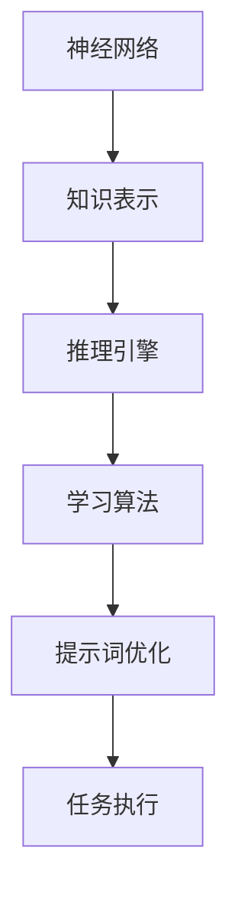

                 

在撰写《提示词优化的神经符号学习系统探索》这篇技术博客文章时，我们可以按照以下步骤进行思考和撰写：

### 第一步：背景介绍

**1.1 人工智能与神经符号学习系统**

首先，我们需要介绍人工智能的发展背景及其在各个领域的应用。人工智能作为计算机科学的一个重要分支，其目标是使计算机具有人类智能，能够理解、学习和推理。在人工智能的发展过程中，神经网络作为一种模拟生物神经系统的计算模型，得到了广泛的研究和应用。

接下来，我们需要介绍神经符号学习系统（Neural-Symbolic Learning System）的基本概念。神经符号学习系统结合了神经网络的计算能力和符号逻辑的推理能力，旨在解决传统神经网络在处理复杂任务时的局限性问题。

**1.2 提示词优化的重要性**

在神经符号学习系统中，提示词（prompt）起到了关键作用。提示词是一种指导神经网络进行学习的信息，它可以提高神经网络的泛化能力，帮助系统更好地理解和处理未知任务。因此，提示词优化成为神经符号学习系统研究的一个重要方向。

### 第二步：核心概念与联系

**2.1 神经符号学习系统核心概念架构**

在这一部分，我们需要使用Mermaid流程图来展示神经符号学习系统的核心概念架构。以下是一个简化的Mermaid流程图示例：



**2.2 提示词优化的核心概念**

在这一部分，我们需要详细阐述提示词优化的核心概念，包括提示词的生成、优化方法和评价指标。我们可以使用伪代码来展示提示词优化的算法原理。

```python
# 提示词优化算法伪代码

# 输入：神经网络模型，训练数据集，初始提示词
# 输出：优化后的提示词

def prompt_optimization(model, dataset, initial_prompt):
    # 初始化优化指标
    best_prompt = initial_prompt
    best_score = evaluate_model(model, dataset, initial_prompt)
    
    # 进行提示词优化
    for prompt in generate_prompt_variations(initial_prompt):
        score = evaluate_model(model, dataset, prompt)
        if score > best_score:
            best_score = score
            best_prompt = prompt
            
    return best_prompt
```

### 第三步：核心算法原理讲解

**3.1 神经符号学习系统实现**

在这一部分，我们需要详细讲解神经符号学习系统的实现，包括神经网络、知识表示、推理引擎和提示词优化等模块。我们可以使用伪代码来展示每个模块的实现原理。

**3.2 数学模型与公式**

在这一部分，我们需要使用LaTeX格式给出神经符号学习系统的数学模型和公式，并进行详细讲解。

```latex
$$
\begin{aligned}
    &L(\theta) = -\sum_{i=1}^{n} y_i \log(p(x_i | \theta)) \\
    &\text{where } y_i \text{ is the ground truth and } p(x_i | \theta) \text{ is the model prediction.}
\end{aligned}
$$

\text{Here, } L(\theta) \text{ represents the loss function and } \theta \text{ are the model parameters.}
```

### 第四步：项目实战

**4.1 开发环境搭建**

在这一部分，我们需要详细讲解如何搭建神经符号学习系统的开发环境，包括所需软件、库和硬件配置等。

**4.2 源代码实现与解读**

在这一部分，我们需要展示神经符号学习系统的源代码实现，并进行详细的解读和分析。

**4.3 代码应用解读与分析**

在这一部分，我们需要使用实际案例来展示神经符号学习系统的应用，并进行解读和分析。

### 第五步：总结与展望

**5.1 全书内容总结**

在这一部分，我们需要对全书的内容进行总结，强调关键概念、算法原理和实战案例。

**5.2 未来发展方向**

在这一部分，我们需要讨论神经符号学习系统和提示词优化的未来发展方向，提出可能的研究问题和挑战。

**5.3 拓展阅读**

在这一部分，我们需要提供一些拓展阅读资源，帮助读者深入了解相关领域的知识。

### 最后一步：撰写文章

在完成以上各部分的思考和准备后，我们可以开始撰写文章。按照上述结构，逐段逐段地撰写文章内容，确保每个部分都有详细的解释和举例。

### 文章结构示例：

```
# 提示词优化的神经符号学习系统探索

## 关键词
- 神经符号学习系统
- 提示词优化
- 神经网络
- 知识表示
- 推理引擎

## 摘要
本文探讨了提示词优化的神经符号学习系统的核心概念、算法原理和实现方法。通过实际案例展示了系统的应用效果，并提出了未来研究的方向。

## 目录
- 引言
- 神经符号学习系统基础
- 提示词优化的原理
- 神经符号学习系统实现
- 实战案例
- 总结与展望

## 引言
- 人工智能与神经符号学习系统
- 提示词优化的重要性

## 神经符号学习系统基础
- 神经符号学习系统核心概念
- 神经符号学习系统基本架构
- 神经符号学习系统与提示词优化的关系

## 提示词优化的原理
- 提示词优化的基本概念
- 提示词优化的算法原理
- 提示词优化的数学模型

## 神经符号学习系统实现
- 神经符号学习系统的技术实现
- 提示词优化算法的伪代码
- 神经符号学习系统的数学公式与推导

## 实战案例
- 开发环境搭建
- 源代码实现与解读
- 代码应用解读与分析

## 总结与展望
- 全书内容总结
- 未来发展方向
- 拓展阅读

## 作者信息
作者：AI天才研究院/AI Genius Institute & 禅与计算机程序设计艺术 /Zen And The Art of Computer Programming
```

按照以上结构，我们可以开始撰写文章的每个部分，确保文章内容完整、详细且具有逻辑性。在撰写过程中，可以根据实际情况对结构进行调整和优化，以达到最佳效果。**

