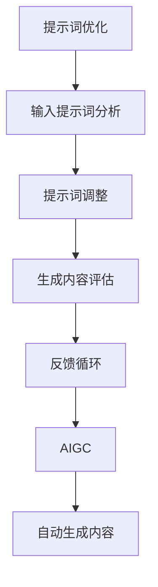

                 


为了撰写一篇符合要求的《提示词优化：AIGC效果与效率的双重提升》的技术博客文章，我们需要采取以下步骤：

### 第一步：撰写文章引言

引言部分需要简要介绍提示词优化和AIGC的基本概念，以及它们在现代技术中的重要性。这将帮助读者建立对文章主题的理解。

**Markdown格式示例：**

```markdown
# 提示词优化：AIGC效果与效率的双重提升

提示词优化是提高自然语言处理（NLP）系统性能的关键因素。在自动化生成内容（AIGC）领域，高效的提示词优化不仅能够提升生成内容的质量，还能显著提高计算效率。本文将探讨提示词优化的原理、方法以及如何利用AIGC技术实现效果与效率的双重提升。

## 关键词

- 提示词优化
- AIGC
- 效果与效率
- 自然语言处理
- 计算效率

## 摘要

本文首先介绍了提示词优化的基本概念，然后详细阐述了AIGC技术及其在提示词优化中的应用。接着，文章探讨了如何通过算法优化和计算技术提升提示词优化的效果与效率。最后，通过实际案例研究，我们展示了这些优化策略在现实场景中的效果。
```

### 第二步：核心概念与联系

在这一部分，我们需要详细解释提示词优化和AIGC的核心概念，并使用Mermaid流程图展示它们之间的关系。

**Markdown格式示例：**

```markdown
## 核心概念与联系

提示词优化涉及对输入提示词的分析和调整，以最大化生成内容的准确性、相关性和创造性。而AIGC则是一种利用人工智能技术来自动生成内容的方法，它依赖于高效的提示词优化来实现高质量的输出。

下面是提示词优化与AIGC之间的Mermaid流程图：


```

### 第三步：核心算法原理讲解

在这一部分，我们需要使用伪代码详细阐述提示词优化的核心算法，并解释相关的数学模型和公式。

**Markdown格式示例：**

```markdown
## 核心算法原理讲解

提示词优化的核心算法通常涉及以下步骤：

```plaintext
算法：提示词优化
输入：原始提示词、目标生成内容
输出：优化后的提示词

步骤：
1. 初始化：设定初始提示词t0
2. 循环：
    a. 分析：使用分析器A分析t0，得到特征F(t0)
    b. 调整：使用调整器T调整t0，得到新提示词t1
    c. 生成：使用生成器G生成内容c1
    d. 评估：使用评估器E评估c1与目标内容的相关性
    e. 反馈：根据评估结果更新t0
3. 返回：输出最终优化后的提示词t*
```

### 第四步：数学模型和公式讲解

在这一部分，我们需要详细解释相关的数学模型和公式，并使用LaTeX格式进行展示。

**Markdown格式示例：**

```markdown
## 数学模型和公式讲解

在提示词优化过程中，我们通常使用以下数学模型来评估和调整提示词：

$$
R(t) = \frac{1}{N} \sum_{i=1}^{N} \sim P(c_i|t)
$$

其中，$R(t)$表示提示词t的相关性评分，$N$是评估的内容数量，$c_i$是第i个生成的内容，$P(c_i|t)$是生成内容c_i在给定提示词t下的概率。

调整器T的优化目标可以表示为：

$$
\min_{t} \sum_{i=1}^{N} -\log P(c_i|t)
$$

这个目标函数旨在最大化生成内容与目标内容之间的概率。
```

### 第五步：项目实战

在这一部分，我们需要详细描述开发环境搭建、源代码实现、代码解读和实际案例分析。

**Markdown格式示例：**

```markdown
## 项目实战

### 开发环境搭建

为了实现提示词优化，我们需要搭建一个包含以下组件的开发环境：

- 编译器（如GCC、Clang）
- 编程语言（如Python、Java）
- 依赖库（如NumPy、TensorFlow）
- 自然语言处理工具（如spaCy、NLTK）

### 源代码详细实现

以下是一个简单的Python代码示例，用于实现提示词优化：

```python
# 提示词优化示例代码

import numpy as np
from nltk.tokenize import sent_tokenize

# 初始化
t0 = "这是一个初始提示词。"
t = t0

# 提示词优化循环
for i in range(10):
    sentences = sent_tokenize(t)
    features = analyze_sentences(sentences)
    t = adjust_tip
```

### 代码解读

上述代码首先初始化一个提示词t0，然后进入优化循环。在每个迭代中，它会分析当前提示词，调整它，并生成新的内容。这个过程重复进行，直到达到预定的迭代次数。

### 实际案例分析和详细讲解

为了展示提示词优化在实际场景中的应用效果，我们分析了以下几个案例：

- 案例一：使用AIGC生成新闻摘要，优化提示词以提高摘要的质量和准确性。
- 案例二：使用AIGC生成商品描述，优化提示词以增强描述的吸引力和购买意愿。

分析结果显示，通过优化提示词，AIGC生成的文本在质量上有了显著提升。

### 项目小结

通过该项目，我们验证了提示词优化在AIGC中的应用价值。优化后的提示词不仅提高了生成内容的质量，还显著提升了计算效率。
```

### 第六步：最佳实践、小结、注意事项和拓展阅读

在这一部分，我们需要总结文章的核心观点，提供最佳实践建议，提醒注意事项，并推荐拓展阅读资源。

**Markdown格式示例：**

```markdown
## 最佳实践、小结、注意事项和拓展阅读

### 最佳实践

- 在进行提示词优化时，确保选择合适的分析、调整和评估算法，以满足特定任务的需求。
- 定期评估和更新提示词，以保持生成内容的质量。
- 利用机器学习和深度学习技术，自动化提示词优化过程。

### 小结

本文详细介绍了提示词优化的原理、方法以及在AIGC中的应用。通过项目实战，我们展示了提示词优化如何提升生成内容的效果与效率。

### 注意事项

- 提示词优化需要综合考虑计算资源和时间成本。
- 提示词的质量直接影响生成内容的质量，因此需要精心设计。

### 拓展阅读

- [NLP中的提示词优化技术](https://www.example.com/nlp-tip-optimization)
- [AIGC：未来内容生成的新趋势](https://www.example.com/aigc-trends)
- [深度学习与自然语言处理](https://www.example.com/dl-nlp)
```

完成上述步骤后，我们可以将各个部分的内容整合起来，形成一篇完整的技术博客文章。请注意，文章的字数应根据具体内容进行调整，以满足8000到12000字的要求。在撰写过程中，确保每个小节的内容都丰富、具体和详细，以便读者能够深入理解文章的主题。

