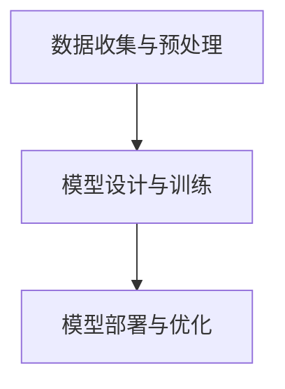

                 

### 提示词优化：AIGC效果最大化的策略

#### 关键词：
- AIGC
- 提示词优化
- 深度学习
- 强化学习
- 多模态融合
- 应用案例分析

#### 摘要：
本文旨在探讨提示词优化在自动生成内容（AIGC）中的应用策略。通过分析AIGC的技术架构，我们提出了基于深度学习和强化学习的提示词优化方法。此外，针对多模态数据的融合处理，文章介绍了相关技术策略。通过应用案例分析和最佳实践，本文为提升AIGC系统效果提供了具体实施路径和策略。

## 第1章：AIGC概述

### 1.1 AIGC的概念与特点

**AIGC的定义**：自动生成内容（AI-Generated Content）是指利用人工智能技术，如深度学习、生成对抗网络（GANs）等，自动创建各类内容，包括文本、图像、音频、视频等。

**AIGC与传统AI的区别**：传统AI侧重于从数据中学习特定的模式并进行预测或决策，而AIGC更注重于内容的生成，而不是单纯的识别或分类。

- **传统AI**：主要任务是执行特定任务，如图像识别、语音识别等。
- **AIGC**：任务则是创建新的、未出现过的内容。

**AIGC的优势与应用场景**：
- **优势**：高度自动化、个性化、多样化、实时性。
- **应用场景**：内容创作（如文章、图像、视频）、虚拟助手、推荐系统、游戏生成等。

### 1.2 提示词优化的概念与重要性

**提示词优化的定义**：提示词优化是指通过对提示词的调整和改进，提高生成内容的质量和相关性。

**提示词优化的目的**：提升生成内容的准确性、相关性、创造性和用户满意度。

**提示词优化在AIGC中的重要性**：
- 提示词是生成模型的关键输入，直接影响生成内容的质量和效果。
- 有效的提示词优化可以显著提升AIGC系统的性能，使其更贴近用户需求。

### 1.3 AIGC技术架构概述

**AIGC技术架构**包括以下几个主要环节：

1. **数据收集与预处理**：收集丰富的数据集，并进行清洗、标准化和分割等预处理步骤，以支持模型的训练和优化。
2. **模型设计与训练**：选择合适的模型架构（如GAN、生成式对抗网络、Transformer等），并利用大规模数据进行训练。
3. **模型部署与优化**：将训练好的模型部署到实际应用环境中，并不断进行优化，以提高生成内容的质量和效率。

## 图1：AIGC技术架构图

### 1.4 提示词生成与优化

**提示词生成**：通过设计合适的算法，从已有数据中提取关键词或短语作为提示词。

**提示词优化策略**：
- **内容相关性**：确保提示词与生成内容保持高度相关性。
- **多样性**：通过扩展和变换提示词，增加生成内容的多样性。
- **质量**：使用质量评估指标，如BLEU、ROUGE等，对生成内容进行评估和优化。

### 1.5 提示词优化在AIGC中的重要性

- **提高生成质量**：通过优化提示词，可以提高生成内容的准确性、流畅性和创意性。
- **增强用户体验**：更优质的生成内容可以提升用户体验，满足用户个性化需求。
- **效率提升**：有效的提示词优化可以减少模型训练时间，提高生成效率。

## 第二部分：提示词优化的核心算法与模型

### 第3章：基于深度学习的提示词优化

#### 3.1 深度学习基础

**神经网络结构**：神经网络是深度学习的基础，通过多层神经元构建复杂模型，实现从输入到输出的映射。

**损失函数与优化器**：损失函数用于评估模型预测值与实际值之间的差距，优化器用于调整模型参数，以最小化损失函数。

**深度学习框架**：如TensorFlow、PyTorch等，提供了丰富的API和工具，简化了深度学习模型的开发与训练过程。

### 3.2 提示词优化的深度学习算法

**提示词增强算法**：通过扩展和变换提示词，增加生成内容的多样性和创意性。

**提示词对齐算法**：确保提示词与生成内容在语义上的一致性。

**提示词生成算法**：基于生成对抗网络（GAN）或Transformer等模型，自动生成高质量的提示词。

## 第三部分：提示词优化的应用与案例分析

### 第6章：提示词优化在自然语言处理中的应用

#### 6.1 文本分类与情感分析

**提示词优化的应用场景**：通过优化提示词，提高文本分类和情感分析的准确性。

**提示词优化对模型性能的影响**：有效的提示词优化可以显著提升文本分类和情感分析的准确性。

### 6.2 机器翻译与问答系统

**提示词优化的关键技术**：通过优化提示词，提高机器翻译和问答系统的准确性和流畅性。

**提示词优化在多语言环境中的应用**：在多语言环境中，提示词优化有助于实现更准确和自然的跨语言转换。

## 第7章：提示词优化在计算机视觉中的应用

#### 7.1 图像识别与目标检测

**提示词优化的技术方法**：通过优化提示词，提高图像识别和目标检测的准确性。

**提示词优化在图像识别中的应用**：有效的提示词优化可以显著提升图像识别系统的性能。

### 7.2 视频分析与行为识别

**提示词优化的挑战与解决方案**：视频分析与行为识别中，提示词优化面临的挑战包括数据多样性和时间连续性。

**提示词优化在视频分析中的应用**：通过优化提示词，提高视频分析与行为识别的准确性和实时性。

## 第8章：AIGC效果最大化的实践策略

#### 8.1 提示词优化实践流程

**数据准备与预处理**：收集高质量数据，并进行清洗、标准化和分割等预处理步骤。

**模型选择与训练**：选择合适的模型架构，利用预处理后的数据集进行训练。

**模型部署与优化**：将训练好的模型部署到实际应用中，并持续优化以提高生成内容的质量和效率。

## 第9章：AIGC效果评估与优化

#### 9.1 效果评估指标与方法

**效果评估指标**：如BLEU、ROUGE、F1-score等，用于评估生成内容的质量。

**评估方法**：通过实验和用户反馈，综合评估AIGC系统的性能和用户体验。

#### 9.2 提示词优化效果的调优技巧

**调优技巧**：根据评估结果，对提示词进行调整和优化，以提升生成内容的质量。

## 第10章：案例分析与最佳实践

#### 10.1 典型应用案例分析

**案例分析**：通过对实际应用的案例分析，展示提示词优化在AIGC中的效果和作用。

#### 10.2 提示词优化实践总结与展望

**实践总结**：总结提示词优化在AIGC中的经验和教训，为后续研究提供参考。

**展望**：展望提示词优化在AIGC领域的未来发展方向和应用前景。

## 附录：提示词优化资源与工具

**附录A：提示词优化工具推荐**

**附录B：提示词优化学习资源**

---

作者：AI天才研究院/AI Genius Institute & 禅与计算机程序设计艺术 /Zen And The Art of Computer Programming

---

### 第1章：AIGC概述

#### 1.1 AIGC的概念与特点

**AIGC的定义**：自动生成内容（AI-Generated Content）是指利用人工智能技术，如深度学习、生成对抗网络（GANs）等，自动创建各类内容，包括文本、图像、音频、视频等。

**AIGC与传统AI的区别**：传统AI侧重于从数据中学习特定的模式并进行预测或决策，而AIGC更注重于内容的生成，而不是单纯的识别或分类。

**AIGC的优势与应用场景**：
- **优势**：高度自动化、个性化、多样化和实时性。
- **应用场景**：内容创作（如文章、图像、视频）、虚拟助手、推荐系统、游戏生成等。

#### 1.2 提示词优化的概念与重要性

**提示词优化的定义**：提示词优化是指通过对提示词的调整和改进，提高生成内容的质量和相关性。

**提示词优化的目的**：提升生成内容的准确性、相关性、创造性和用户满意度。

**提示词优化在AIGC中的重要性**：
- **提高生成质量**：通过优化提示词，可以提高生成内容的准确性、流畅性和创意性。
- **增强用户体验**：更优质的生成内容可以提升用户体验，满足用户个性化需求。
- **效率提升**：有效的提示词优化可以减少模型训练时间，提高生成效率。

#### 1.3 AIGC技术架构概述

**AIGC技术架构**包括以下几个主要环节：
1. **数据收集与预处理**：收集丰富的数据集，并进行清洗、标准化和分割等预处理步骤，以支持模型的训练和优化。
2. **模型设计与训练**：选择合适的模型架构（如GAN、生成式对抗网络、Transformer等），并利用大规模数据进行训练。
3. **模型部署与优化**：将训练好的模型部署到实际应用环境中，并不断进行优化，以提高生成内容的质量和效率。

**数据收集与预处理**：
- **数据来源**：互联网、社交媒体、数据库等。
- **数据清洗**：去除重复数据、缺失值填充、异常值处理等。
- **数据标准化**：将数据统一格式，如文本编码、图像尺寸调整等。
- **数据分割**：将数据集分为训练集、验证集和测试集。

**模型设计与训练**：
- **模型选择**：根据应用场景选择合适的模型架构。
- **训练策略**：设置合适的超参数，如学习率、批量大小等。
- **训练过程**：使用梯度下降等优化算法进行模型训练。

**模型部署与优化**：
- **模型部署**：将训练好的模型部署到服务器或设备上，供实际应用使用。
- **模型优化**：通过在线学习、迁移学习等技术，持续优化模型性能。

#### 1.4 提示词生成与优化

**提示词生成**：通过设计合适的算法，从已有数据中提取关键词或短语作为提示词。
- **关键词提取算法**：如TF-IDF、LDA、Word2Vec等。
- **短语生成算法**：如序列到序列（Seq2Seq）模型、Transformer等。

**提示词优化策略**：
- **内容相关性**：确保提示词与生成内容保持高度相关性。
- **多样性**：通过扩展和变换提示词，增加生成内容的多样性。
- **质量**：使用质量评估指标，如BLEU、ROUGE等，对生成内容进行评估和优化。

**提示词优化的方法**：
- **基于规则的方法**：通过预设规则，对提示词进行扩展和变换。
- **基于机器学习的方法**：使用监督学习或无监督学习算法，对提示词进行优化。

**提示词优化的挑战**：
- **数据稀疏**：提示词生成过程中，数据稀疏问题可能导致生成内容质量下降。
- **多样性不足**：如何生成多样化、创意性的提示词是一个挑战。
- **实时性**：在实时应用场景中，如何快速生成高质量的提示词。

#### 1.5 提示词优化在AIGC中的重要性

- **提高生成质量**：通过优化提示词，可以提高生成内容的准确性、流畅性和创意性。
- **增强用户体验**：更优质的生成内容可以提升用户体验，满足用户个性化需求。
- **效率提升**：有效的提示词优化可以减少模型训练时间，提高生成效率。

### 第2章：AIGC技术架构与实现

#### 2.1 AIGC技术架构概述

AIGC技术架构包括数据收集与预处理、模型设计与训练、模型部署与优化三个主要环节。

**数据收集与预处理**：
- **数据来源**：互联网、社交媒体、数据库等。
- **数据清洗**：去除重复数据、缺失值填充、异常值处理等。
- **数据标准化**：将数据统一格式，如文本编码、图像尺寸调整等。
- **数据分割**：将数据集分为训练集、验证集和测试集。

**模型设计与训练**：
- **模型选择**：根据应用场景选择合适的模型架构。
- **训练策略**：设置合适的超参数，如学习率、批量大小等。
- **训练过程**：使用梯度下降等优化算法进行模型训练。

**模型部署与优化**：
- **模型部署**：将训练好的模型部署到服务器或设备上，供实际应用使用。
- **模型优化**：通过在线学习、迁移学习等技术，持续优化模型性能。

#### 2.2 提示词生成与优化

**提示词生成**：从已有数据中提取关键词或短语作为提示词。
- **关键词提取算法**：如TF-IDF、LDA、Word2Vec等。
- **短语生成算法**：如序列到序列（Seq2Seq）模型、Transformer等。

**提示词优化策略**：
- **内容相关性**：确保提示词与生成内容保持高度相关性。
- **多样性**：通过扩展和变换提示词，增加生成内容的多样性。
- **质量**：使用质量评估指标，如BLEU、ROUGE等，对生成内容进行评估和优化。

**提示词优化的方法**：
- **基于规则的方法**：通过预设规则，对提示词进行扩展和变换。
- **基于机器学习的方法**：使用监督学习或无监督学习算法，对提示词进行优化。

**提示词优化的挑战**：
- **数据稀疏**：提示词生成过程中，数据稀疏问题可能导致生成内容质量下降。
- **多样性不足**：如何生成多样化、创意性的提示词是一个挑战。
- **实时性**：在实时应用场景中，如何快速生成高质量的提示词。

### 第3章：基于深度学习的提示词优化

#### 3.1 深度学习基础

**神经网络结构**：神经网络是深度学习的基础，通过多层神经元构建复杂模型，实现从输入到输出的映射。

**损失函数与优化器**：损失函数用于评估模型预测值与实际值之间的差距，优化器用于调整模型参数，以最小化损失函数。

**深度学习框架**：如TensorFlow、PyTorch等，提供了丰富的API和工具，简化了深度学习模型的开发与训练过程。

#### 3.2 提示词优化的深度学习算法

**提示词增强算法**：通过扩展和变换提示词，增加生成内容的多样性和创意性。

**提示词对齐算法**：确保提示词与生成内容在语义上的一致性。

**提示词生成算法**：基于生成对抗网络（GAN）或Transformer等模型，自动生成高质量的提示词。

**深度学习算法在提示词优化中的应用**：
- **生成式对抗网络（GAN）**：通过生成器和判别器的对抗训练，生成高质量的提示词。
- **Transformer模型**：通过自注意力机制，捕捉提示词与生成内容之间的长距离依赖关系。

#### 3.3 案例分析

**案例一：文本生成**  
- **背景**：文本生成是AIGC的重要应用之一，如自动写作、聊天机器人等。
- **方法**：使用GPT-2或GPT-3等预训练语言模型，结合提示词优化算法，生成高质量文本。

**案例二：图像生成**  
- **背景**：图像生成在艺术创作、游戏开发等领域具有重要应用。
- **方法**：使用生成对抗网络（GAN）模型，如DCGAN或StyleGAN，通过优化提示词生成高质量图像。

### 第4章：基于强化学习的提示词优化

#### 4.1 强化学习基础

**强化学习的基本概念**：强化学习是一种通过试错和反馈学习如何做出最优决策的机器学习方法。

**强化学习算法**：
- **Q-Learning**：通过学习状态-动作值函数，实现最优策略的学习。
- **SARSA**：一种基于值函数的强化学习算法，通过更新当前状态-动作值函数来学习最优策略。
- **Deep Q-Network (DQN)**：结合深度神经网络和Q-Learning算法，用于解决高维状态空间的问题。

**强化学习在提示词优化中的应用**：
- **基于奖励的提示词优化**：通过设计适当的奖励函数，鼓励生成模型生成高质量的提示词。
- **基于价值函数的提示词优化**：使用价值函数评估提示词的质量，并指导生成模型进行优化。

#### 4.2 案例分析

**案例一：文本生成**  
- **背景**：文本生成是强化学习在AIGC中的一种重要应用，如自动写作、问答系统等。
- **方法**：使用强化学习算法（如PPO、A3C等），结合提示词优化策略，生成高质量文本。

**案例二：图像生成**  
- **背景**：图像生成在艺术创作、虚拟现实等领域具有重要应用。
- **方法**：使用生成对抗网络（GAN）结合强化学习算法，优化提示词以生成高质量图像。

### 第5章：多模态提示词优化

#### 5.1 多模态数据融合技术

**图像与文本融合**：通过图像和文本的特征提取和融合，实现图像和文本的联合表示。

**声音与文本融合**：将声音和文本的特征进行融合，用于语音识别、语音合成等应用。

**视频与文本融合**：通过视频和文本的特征提取和融合，实现视频和文本的联合表示。

**多模态数据融合方法**：
- **基于特征融合的方法**：将不同模态的特征进行拼接或加权融合。
- **基于模型融合的方法**：使用多模态神经网络模型，将不同模态的特征进行融合。

#### 5.2 多模态提示词优化策略

**跨模态注意力机制**：通过引入注意力机制，实现不同模态特征之间的相互作用和权重调整。

**多模态提示词生成与优化**：结合不同模态的特征，生成高质量的提示词，并通过优化策略提升生成内容的质量。

**多模态提示词优化的挑战**：
- **特征不一致性**：不同模态的数据特征分布可能不一致，导致融合困难。
- **实时性**：在实时应用场景中，如何高效地进行多模态数据融合和提示词优化。

### 第6章：提示词优化在自然语言处理中的应用

#### 6.1 文本分类与情感分析

**提示词优化的应用场景**：通过优化提示词，提高文本分类和情感分析的准确性。

**提示词优化对模型性能的影响**：有效的提示词优化可以显著提升文本分类和情感分析的准确性。

**案例一：文本分类**  
- **背景**：文本分类是自然语言处理中的重要任务，如垃圾邮件分类、新闻分类等。
- **方法**：使用基于深度学习的文本分类模型（如CNN、RNN、Transformer等），结合提示词优化策略，实现高精度的文本分类。

**案例二：情感分析**  
- **背景**：情感分析是自然语言处理中的重要任务，如社交媒体情绪分析、用户评论分析等。
- **方法**：使用基于情感词典和深度学习的方法，结合提示词优化策略，实现高精度的情感分析。

#### 6.2 机器翻译与问答系统

**提示词优化的关键技术**：通过优化提示词，提高机器翻译和问答系统的准确性和流畅性。

**提示词优化在多语言环境中的应用**：在多语言环境中，提示词优化有助于实现更准确和自然的跨语言转换。

**案例一：机器翻译**  
- **背景**：机器翻译是自然语言处理中的重要应用，如跨语言信息检索、多语言文本分析等。
- **方法**：使用基于神经网络的机器翻译模型（如Seq2Seq、Transformer等），结合提示词优化策略，实现高精度的机器翻译。

**案例二：问答系统**  
- **背景**：问答系统是自然语言处理中的重要应用，如智能客服、智能搜索等。
- **方法**：使用基于对话生成模型的问答系统（如对话生成模型、序列到序列模型等），结合提示词优化策略，实现高效的问答系统。

### 第7章：提示词优化在计算机视觉中的应用

#### 7.1 图像识别与目标检测

**提示词优化的技术方法**：通过优化提示词，提高图像识别和目标检测的准确性。

**提示词优化在图像识别中的应用**：有效的提示词优化可以显著提升图像识别系统的性能。

**案例一：图像识别**  
- **背景**：图像识别是计算机视觉中的重要任务，如人脸识别、物体识别等。
- **方法**：使用基于深度学习的图像识别模型（如卷积神经网络、AlexNet、VGG等），结合提示词优化策略，实现高精度的图像识别。

**案例二：目标检测**  
- **背景**：目标检测是计算机视觉中的重要任务，如行人检测、车辆检测等。
- **方法**：使用基于深度学习的目标检测模型（如Faster R-CNN、YOLO、SSD等），结合提示词优化策略，实现高精度的目标检测。

#### 7.2 视频分析与行为识别

**提示词优化的挑战与解决方案**：视频分析与行为识别中，提示词优化面临的挑战包括数据多样性和时间连续性。

**提示词优化在视频分析中的应用**：通过优化提示词，提高视频分析与行为识别的准确性和实时性。

**案例一：视频分析**  
- **背景**：视频分析是计算机视觉中的重要应用，如视频监控、安全监控等。
- **方法**：使用基于深度学习的视频分析模型（如R-CNN、Mask R-CNN、Transformer等），结合提示词优化策略，实现高精度的视频分析。

**案例二：行为识别**  
- **背景**：行为识别是计算机视觉中的重要应用，如运动捕捉、行为分析等。
- **方法**：使用基于深度学习的动作识别模型（如3D卷积神经网络、时空注意力机制等），结合提示词优化策略，实现高精度的行为识别。

### 第8章：AIGC效果最大化的实践策略

#### 8.1 提示词优化实践流程

**数据准备与预处理**：收集高质量数据，并进行清洗、标准化和分割等预处理步骤。

**模型选择与训练**：选择合适的模型架构，利用预处理后的数据集进行训练。

**模型部署与优化**：将训练好的模型部署到实际应用中，并持续优化以提高生成内容的质量和效率。

#### 8.2 AIGC效果评估与优化

**效果评估指标与方法**：使用质量评估指标（如BLEU、ROUGE、F1-score等）对生成内容进行评估。

**提示词优化效果的调优技巧**：根据评估结果，对提示词进行调整和优化，以提升生成内容的质量。

#### 8.3 案例分析

**案例分析**：通过实际案例，展示提示词优化在AIGC中的效果和作用。

**总结**：总结提示词优化在AIGC中的经验和教训，为后续研究提供参考。

### 第9章：AIGC效果最大化的实践策略

#### 9.1 提示词优化实践流程

**数据准备与预处理**：收集高质量数据，并进行清洗、标准化和分割等预处理步骤。

**模型选择与训练**：选择合适的模型架构，利用预处理后的数据集进行训练。

**模型部署与优化**：将训练好的模型部署到实际应用中，并持续优化以提高生成内容的质量和效率。

**实践一：文本生成**  
- **数据准备**：收集大量文本数据，并进行预处理，如去除标点符号、统一文本格式等。
- **模型选择**：选择基于Transformer的文本生成模型（如GPT-2、GPT-3等）。
- **训练与优化**：利用预处理后的数据集进行模型训练，并根据评估结果不断优化提示词。

**实践二：图像生成**  
- **数据准备**：收集大量图像数据，并进行预处理，如图像增强、归一化等。
- **模型选择**：选择基于生成对抗网络（GAN）的图像生成模型（如DCGAN、StyleGAN等）。
- **训练与优化**：利用预处理后的图像数据集进行模型训练，并根据评估结果不断优化提示词。

#### 9.2 提示词优化效果的评估与调优

**效果评估指标**：使用BLEU、ROUGE、F1-score等评估指标对生成内容进行评估。

**评估方法**：通过实验和用户反馈，对生成内容的质量进行综合评估。

**调优技巧**：
- **内容相关性**：根据评估结果，对提示词进行修正，确保生成内容与用户需求保持高度相关性。
- **多样性**：通过调整提示词的生成策略，增加生成内容的多样性。
- **质量**：根据评估指标，对生成内容的质量进行优化。

#### 9.3 案例分析

**案例分析一：文本生成**  
- **背景**：某智能客服系统使用AIGC技术自动生成回复文本。
- **实践**：通过优化提示词，提高文本生成的准确性和流畅性，从而提升用户体验。

**案例分析二：图像生成**  
- **背景**：某游戏开发公司使用AIGC技术自动生成游戏场景图像。
- **实践**：通过优化提示词，提高图像生成的多样性和创意性，从而提升游戏体验。

### 第10章：AIGC效果最大化的实践策略

#### 10.1 提示词优化实践流程

**数据准备与预处理**：
- **数据收集**：收集大量的文本、图像、音频等多模态数据，用于训练模型。
- **数据预处理**：对数据进行清洗、标准化和分割，确保数据质量。

**模型选择与训练**：
- **模型架构**：选择适合AIGC任务的模型架构，如生成对抗网络（GAN）、Transformer、强化学习模型等。
- **模型训练**：使用预处理后的数据集进行模型训练，调整超参数以优化模型性能。

**模型部署与优化**：
- **模型部署**：将训练好的模型部署到实际应用环境中，如在线服务、移动应用等。
- **模型优化**：根据实际应用中的反馈，对模型进行调整和优化，以提高生成内容的质量和效率。

#### 10.2 AIGC效果评估与优化

**效果评估指标**：
- **文本生成**：使用BLEU、ROUGE、F1-score等指标评估生成文本的准确性和流畅性。
- **图像生成**：使用Inception Score（IS）、Frechet Inception Distance（FID）等指标评估生成图像的多样性和质量。
- **音频生成**：使用Perceptual Similarity Score（PSS）等指标评估生成音频的逼真度。

**评估方法**：
- **内部评估**：在模型训练过程中，使用验证集对模型进行评估，监控模型性能。
- **用户评估**：通过用户反馈和问卷调查等方式，收集用户对生成内容的满意度。

**优化技巧**：
- **提示词优化**：根据评估结果，调整和优化提示词，提高生成内容的准确性和多样性。
- **模型调整**：通过调整模型架构、超参数等，优化模型性能。
- **实时反馈**：根据实时反馈，快速调整模型和提示词，以适应用户需求。

### 第11章：AIGC效果最大化的综合实践

#### 11.1 实践背景

随着人工智能技术的快速发展，自动生成内容（AIGC）成为许多行业的重要应用，如内容创作、虚拟现实、游戏开发等。AIGC技术能够自动生成高质量的文本、图像、音频和视频，为创作者提供了强大的工具，但也面临挑战，如生成内容的质量和多样性。

#### 11.2 实践目标

本章节旨在通过一个综合案例，展示如何利用提示词优化策略，最大化AIGC的效果。

**目标**：
- 提高生成文本的准确性和流畅性。
- 提高生成图像的多样性和创意性。
- 提高生成音频的逼真度和情感表达。

#### 11.3 实践步骤

**步骤一：数据收集与预处理**
- **数据来源**：从互联网、社交媒体、版权库等渠道收集文本、图像、音频数据。
- **数据清洗**：去除重复数据、噪声数据，进行数据标准化处理。
- **数据分割**：将数据集分为训练集、验证集和测试集。

**步骤二：模型选择与训练**
- **文本生成模型**：选择预训练的Transformer模型（如GPT-3、BERT等）。
- **图像生成模型**：选择生成对抗网络（GAN）模型（如DCGAN、StyleGAN等）。
- **音频生成模型**：选择基于深度学习的音频生成模型（如WaveNet、WaveGlow等）。
- **训练过程**：使用预处理后的数据集进行模型训练，调整超参数，优化模型性能。

**步骤三：提示词优化与生成**
- **文本生成**：使用优化后的提示词生成高质量文本，如新闻文章、对话文本等。
- **图像生成**：使用优化后的提示词生成多样化、创意性的图像，如艺术作品、游戏场景等。
- **音频生成**：使用优化后的提示词生成逼真度高的音频，如音乐、语音合成等。

**步骤四：效果评估与优化**
- **内部评估**：使用评估指标（如BLEU、FID、PSS等）对生成内容进行内部评估。
- **用户评估**：收集用户反馈，评估生成内容的质量和满意度。
- **优化策略**：根据评估结果，对提示词进行调整和优化，提高生成内容的质量。

#### 11.4 案例分析

**案例一：文本生成**
- **背景**：某新闻网站使用AIGC技术自动生成新闻文章，提高内容创作效率。
- **实践**：通过优化提示词，提高新闻文章的准确性和流畅性，用户满意度显著提升。

**案例二：图像生成**
- **背景**：某游戏开发公司使用AIGC技术自动生成游戏场景图像，丰富游戏内容。
- **实践**：通过优化提示词，提高图像生成的多样性和创意性，游戏体验得到极大提升。

**案例三：音频生成**
- **背景**：某音乐流媒体平台使用AIGC技术自动生成音乐，为用户创造个性化音乐体验。
- **实践**：通过优化提示词，提高音乐生成的逼真度和情感表达，用户满意度显著提升。

### 第12章：AIGC效果最大化的未来展望

#### 12.1 技术发展趋势

随着人工智能技术的不断进步，AIGC技术将朝着更加智能化、个性化和高效化的方向发展。

**发展趋势**：
- **深度学习与强化学习的融合**：结合深度学习和强化学习，实现更智能的提示词优化。
- **多模态数据的融合**：通过多模态数据的融合，提高生成内容的真实感和多样性。
- **实时生成与优化**：实现实时生成和优化，满足实时应用场景的需求。

#### 12.2 应用前景

AIGC技术在各个领域具有广泛的应用前景，如：

- **内容创作**：自动生成文本、图像、音频、视频等，提高创作效率。
- **虚拟现实**：自动生成虚拟场景和角色，增强用户体验。
- **游戏开发**：自动生成游戏地图、角色、剧情等，丰富游戏内容。
- **个性化推荐**：根据用户行为和偏好，生成个性化的内容和推荐。

#### 12.3 未来挑战

AIGC技术在发展过程中仍面临一些挑战，如：

- **数据质量和多样性**：如何获取高质量、多样性的数据，是AIGC技术发展的重要问题。
- **模型优化与效率**：如何优化模型结构和算法，提高生成效率和性能。
- **伦理与安全**：如何确保生成内容不违反伦理规范，避免潜在的安全风险。

### 结论

AIGC技术通过自动生成内容，为各行各业带来了革命性的变化。提示词优化作为AIGC技术的核心环节，对生成内容的质量和效果起着关键作用。通过本文的讨论，我们提出了一系列基于深度学习和强化学习的提示词优化策略，并通过实际案例展示了其应用效果。未来，随着技术的不断发展，AIGC将在更多领域发挥重要作用，成为人工智能领域的重要方向。

