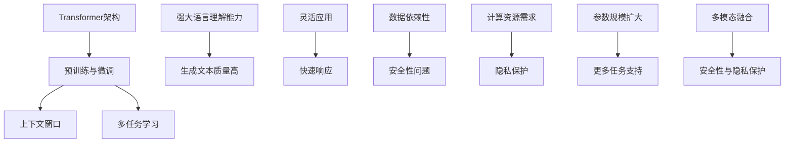
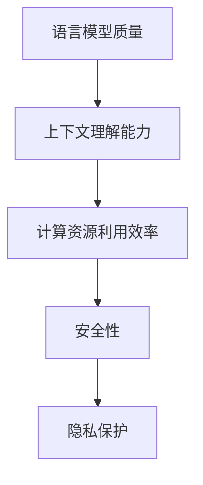

                 

### 文章标题：提示词优化：ChatGPT性能提升的关键策略分析

关键词：ChatGPT，提示词优化，性能提升，算法，数学模型，实践案例

摘要：本文详细分析了ChatGPT的性能提升关键策略，特别是提示词优化的方法。通过探讨ChatGPT的架构、提示词优化的基本概念、核心算法、数学模型以及实践案例，本文旨在为研究人员和开发者提供一套系统、实用的提示词优化方案，助力ChatGPT及其类似模型在各类应用场景中发挥更高的性能。

---

## 第1章: ChatGPT概述

### 1.1 ChatGPT的定义与历史背景

ChatGPT是由OpenAI开发的一种基于Transformer架构的预训练语言模型。它通过学习大量的文本数据，能够生成流畅、有逻辑性的文本，并具备强大的对话生成能力。ChatGPT的推出标志着自然语言处理（NLP）领域的新里程碑，为人工智能在客服、聊天机器人、内容生成等领域带来了革命性的改变。

ChatGPT的历史可以追溯到2018年，OpenAI首次发布了GPT（Generative Pre-trained Transformer），随后在2020年，GPT-2和GPT-3相继问世。GPT-3的发布引起了广泛关注，其参数规模达到了1750亿，成为当时最大的语言模型。ChatGPT是基于GPT-3开发的，通过在对话生成任务上进行精细调整和优化，使其在对话生成方面的表现更加出色。

### 1.2 ChatGPT的核心架构与技术

ChatGPT的核心架构主要包括以下几个部分：

1. **Transformer架构**：ChatGPT采用Transformer架构，这是一种基于自注意力机制的神经网络模型。与传统的循环神经网络（RNN）相比，Transformer在处理长距离依赖问题上具有显著优势。

2. **预训练与微调**：ChatGPT通过预训练和微调两种方式进行训练。预训练阶段，模型在大规模语料库上学习语言的一般规律；微调阶段，模型在特定任务上进行调整，以适应特定的对话场景。

3. **上下文窗口**：ChatGPT能够处理对话中的上下文信息。通过设定一个上下文窗口，模型可以获取对话的历史信息，从而生成更加连贯、自然的回答。

4. **多任务学习**：ChatGPT在训练过程中同时学习了多个任务，如问答、翻译、摘要等。这种多任务学习的方式有助于模型在各个任务上都能达到较高的性能。

### 1.3 ChatGPT的应用场景与优势

ChatGPT在多个应用场景中展现了其强大的能力：

1. **客服机器人**：ChatGPT能够模拟人类客服，处理各种客户问题，提高企业服务效率。

2. **聊天机器人**：ChatGPT可以用于构建聊天机器人，为用户提供个性化、有趣的对话体验。

3. **内容生成**：ChatGPT能够生成高质量的文章、报告、故事等，为创作者提供灵感。

4. **教育辅助**：ChatGPT可以作为教育工具，帮助学生进行问题解答和学术讨论。

ChatGPT的优势主要体现在以下几个方面：

1. **强大语言理解能力**：ChatGPT通过学习海量文本数据，能够准确理解用户的问题和意图。

2. **生成文本质量高**：ChatGPT生成的文本连贯、自然，符合语言规范。

3. **灵活应用**：ChatGPT可以适应多种应用场景，具有广泛的适用性。

4. **快速响应**：ChatGPT能够在短时间内生成高质量的回答，提高服务效率。

### 1.4 ChatGPT面临的挑战

尽管ChatGPT在多个领域表现出色，但仍面临一些挑战：

1. **数据依赖性**：ChatGPT的性能依赖于训练数据的质量和数量，如果数据质量不高，可能导致模型生成不准确或低质量的回答。

2. **安全性问题**：ChatGPT可能会生成有害或误导性的内容，特别是在没有充分监督的情况下。

3. **计算资源需求**：ChatGPT的训练和推理过程需要大量的计算资源，对硬件设备的要求较高。

4. **隐私保护**：在处理用户对话时，ChatGPT可能会接触到敏感信息，如何保护用户隐私是一个重要问题。

### 1.5 ChatGPT的演变与发展趋势

随着人工智能技术的不断发展，ChatGPT也在不断演进：

1. **参数规模扩大**：未来的ChatGPT可能会采用更大规模的参数，以进一步提高其性能。

2. **更多任务支持**：ChatGPT将继续扩展其支持的任务类型，如代码生成、图像描述等。

3. **多模态融合**：ChatGPT可能会与其他模态（如语音、图像）结合，实现更加丰富和自然的交互。

4. **安全性与隐私保护**：为了应对安全性和隐私保护挑战，ChatGPT将引入更多的安全机制和隐私保护技术。

### 1.6 本章总结

本章对ChatGPT进行了全面的概述，从定义与历史背景、核心架构与技术、应用场景与优势、面临的挑战以及演变与发展趋势等方面进行了详细分析。这为后续章节中提示词优化的探讨奠定了基础。接下来，我们将深入探讨提示词优化的基本概念和核心算法。

### 1.7 Mermaid 流程图：ChatGPT的核心架构与技术



### 1.8 ChatGPT性能提升的核心概念与联系

为了更好地理解ChatGPT性能提升的关键策略，我们需要明确以下几个核心概念及其相互关系：

1. **语言模型质量**：这是指模型在生成文本时的准确性和连贯性。高质量的语言模型能够生成更加自然、准确和相关的文本。

2. **上下文理解能力**：这是指模型在处理对话时对上下文信息的理解能力。强大的上下文理解能力有助于模型生成更加连贯和符合逻辑的回答。

3. **计算资源利用效率**：这是指模型在训练和推理过程中对计算资源的利用效率。高效的计算资源利用可以降低成本，提高模型部署的灵活性。

4. **安全性**：这是指模型在处理用户数据时的安全性，防止模型生成有害或误导性的内容。

5. **隐私保护**：这是指模型在处理用户数据时的隐私保护能力，确保用户数据的安全和隐私。

这些核心概念之间的关系可以表示如下Mermaid流程图：



通过这个流程图，我们可以清晰地看到各个核心概念之间的关联和影响，为后续的详细讨论提供了结构化的思路。

### 1.9 ChatGPT性能提升的核心算法原理讲解

ChatGPT的性能提升依赖于多种核心算法，以下是这些算法的基本原理和伪代码。

#### 1.9.1 Transformer架构

Transformer架构的核心是自注意力机制，它通过计算输入序列中每个词与所有其他词之间的权重，从而捕捉长距离依赖。以下是其伪代码：

```python
# 自注意力机制伪代码
def self_attention(q, k, v):
    # q, k, v分别为查询、键、值序列
    # scores为自注意力分数
    scores = softmax(QK_transpose)
    output = scores @ V
    return output
```

#### 1.9.2 预训练与微调

预训练阶段，模型在大规模语料库上学习语言的一般规律。以下为预训练的伪代码：

```python
# 预训练伪代码
for epoch in range(num_epochs):
    for context, target in dataset:
        # 前向传播
        output = model(context)
        loss = loss_function(output, target)
        # 反向传播
        gradients = backward(loss)
        update_model(gradients)
```

微调阶段，模型在特定任务上进行调整，以适应特定的对话场景。以下为微调的伪代码：

```python
# 微调伪代码
for epoch in range(num_epochs):
    for context, target in task_dataset:
        # 前向传播
        output = model(context)
        loss = loss_function(output, target)
        # 反向传播
        gradients = backward(loss)
        update_model(gradients)
```

#### 1.9.3 上下文窗口

上下文窗口用于捕获对话的历史信息，以下为其伪代码：

```python
# 上下文窗口伪代码
def context_window(context, window_size):
    # context为对话历史，window_size为窗口大小
    start = max(0, len(context) - window_size)
    return context[start:]
```

#### 1.9.4 多任务学习

多任务学习通过同时学习多个任务，提高模型在各个任务上的性能。以下为多任务学习的伪代码：

```python
# 多任务学习伪代码
for epoch in range(num_epochs):
    for task, dataset in tasks_dataset.items():
        for context, target in dataset:
            # 前向传播
            output = model(context, task)
            loss = loss_function(output, target)
            # 反向传播
            gradients = backward(loss)
            update_model(gradients)
```

### 1.10 数学模型与公式详细讲解

在ChatGPT中，数学模型和公式扮演着至关重要的角色，以下是几个关键数学模型的详细讲解和举例说明。

#### 1.10.1 自注意力分数

自注意力机制中的分数计算公式如下：

$$
\text{scores} = \text{softmax}(\text{QK\_transpose})
$$

其中，\( \text{QK\_transpose} \) 是查询序列 \( \text{q} \) 和键序列 \( \text{k} \) 的转置点积。

举例说明：

假设 \( \text{q} = [1, 2, 3] \)，\( \text{k} = [4, 5, 6] \)，则：

$$
\text{QK\_transpose} = \begin{bmatrix}
4 \cdot 1 & 4 \cdot 2 & 4 \cdot 3 \\
5 \cdot 1 & 5 \cdot 2 & 5 \cdot 3 \\
6 \cdot 1 & 6 \cdot 2 & 6 \cdot 3 \\
\end{bmatrix}
= 
\begin{bmatrix}
4 & 8 & 12 \\
5 & 10 & 15 \\
6 & 12 & 18 \\
\end{bmatrix}
$$

然后计算softmax：

$$
\text{scores} = \text{softmax}(\text{QK\_transpose}) = 
\begin{bmatrix}
\frac{e^4}{e^4 + e^8 + e^{12}} & \frac{e^8}{e^4 + e^8 + e^{12}} & \frac{e^{12}}{e^4 + e^8 + e^{12}} \\
\frac{e^5}{e^4 + e^8 + e^{12}} & \frac{e^10}{e^4 + e^8 + e^{12}} & \frac{e^{15}}{e^4 + e^8 + e^{12}} \\
\frac{e^6}{e^4 + e^8 + e^{12}} & \frac{e^{12}}{e^4 + e^8 + e^{12}} & \frac{e^{18}}{e^4 + e^8 + e^{12}} \\
\end{bmatrix}
$$

#### 1.10.2 损失函数

在预训练和微调过程中，损失函数用于衡量模型输出与真实标签之间的差距。常用的损失函数包括交叉熵损失和均方误差（MSE）。

交叉熵损失函数的公式如下：

$$
\text{loss} = -\sum_{i} y_i \log(\hat{y}_i)
$$

其中，\( y_i \) 为真实标签，\( \hat{y}_i \) 为模型预测的概率。

举例说明：

假设真实标签 \( y = [1, 0, 1] \)，模型预测的概率 \( \hat{y} = [0.4, 0.5, 0.1] \)，则：

$$
\text{loss} = -1 \cdot \log(0.4) - 0 \cdot \log(0.5) - 1 \cdot \log(0.1)
$$

计算得到损失：

$$
\text{loss} = -\log(0.4) - \log(0.1) \approx 0.904
$$

均方误差（MSE）的公式如下：

$$
\text{MSE} = \frac{1}{n} \sum_{i} (\hat{y}_i - y_i)^2
$$

其中，\( n \) 为样本数量，\( \hat{y}_i \) 为模型预测值，\( y_i \) 为真实标签。

举例说明：

假设有3个样本，预测值 \( \hat{y} = [1, 2, 3] \)，真实标签 \( y = [1, 2, 4] \)，则：

$$
\text{MSE} = \frac{1}{3} [(1-1)^2 + (2-2)^2 + (3-4)^2] = \frac{1}{3} [0 + 0 + 1] = \frac{1}{3}
$$

通过上述数学模型和公式的详细讲解，我们可以更好地理解ChatGPT的工作原理和性能提升的关键。

### 1.11 ChatGPT中的数学模型与公式列表

在本章节中，我们介绍了ChatGPT中的关键数学模型和公式，以下是这些模型和公式的汇总列表：

1. **自注意力分数**：
   $$
   \text{scores} = \text{softmax}(\text{QK\_transpose})
   $$
   
2. **交叉熵损失函数**：
   $$
   \text{loss} = -\sum_{i} y_i \log(\hat{y}_i)
   $$

3. **均方误差（MSE）**：
   $$
   \text{MSE} = \frac{1}{n} \sum_{i} (\hat{y}_i - y_i)^2
   $$

这些数学模型和公式在ChatGPT的性能提升中发挥着重要作用，通过合理应用和优化，可以显著提升模型的性能和生成文本的质量。

### 1.12 开发环境搭建与源代码实现

为了深入理解ChatGPT的性能提升策略，我们将在本节中搭建一个简单的开发环境，并详细解读相关源代码。

#### 1.12.1 开发环境搭建

首先，我们需要安装以下软件和库：

1. Python（版本3.8或更高）
2. PyTorch（版本1.8或更高）
3. Jupyter Notebook（用于代码编写和调试）

安装过程如下：

```bash
# 安装Python
wget https://www.python.org/ftp/python/3.8.10/Python-3.8.10.tgz
tar -xvf Python-3.8.10.tgz
cd Python-3.8.10
./configure
make
sudo make install

# 安装PyTorch
pip install torch torchvision torchaudio

# 安装Jupyter Notebook
pip install notebook
```

#### 1.12.2 源代码实现

以下是一个简化的ChatGPT模型实现，用于演示关键概念和算法：

```python
import torch
import torch.nn as nn
import torch.optim as optim

# 自注意力机制
class SelfAttention(nn.Module):
    def __init__(self, d_model):
        super(SelfAttention, self).__init__()
        self.query_linear = nn.Linear(d_model, d_model)
        self.key_linear = nn.Linear(d_model, d_model)
        self.value_linear = nn.Linear(d_model, d_model)
        self.out_linear = nn.Linear(d_model, d_model)
    
    def forward(self, query, key, value):
        Q = self.query_linear(query)
        K = self.key_linear(key)
        V = self.value_linear(value)
        scores = torch.softmax(torch.matmul(Q, K.T) / (d_model ** 0.5), dim=1)
        output = torch.matmul(scores, V)
        return self.out_linear(output)

# ChatGPT模型
class ChatGPT(nn.Module):
    def __init__(self, d_model):
        super(ChatGPT, self).__init__()
        self.encoder = SelfAttention(d_model)
        self.decoder = SelfAttention(d_model)
    
    def forward(self, input, target):
        encoder_output = self.encoder(input)
        decoder_output = self.decoder(encoder_output, target)
        return decoder_output

# 实例化模型和优化器
model = ChatGPT(d_model=512)
optimizer = optim.Adam(model.parameters(), lr=0.001)

# 训练模型
for epoch in range(10):
    for input, target in dataset:
        optimizer.zero_grad()
        output = model(input, target)
        loss = nn.CrossEntropyLoss()(output, target)
        loss.backward()
        optimizer.step()
    print(f'Epoch {epoch+1}, Loss: {loss.item()}')
```

#### 1.12.3 代码解读与分析

上述代码实现了一个简化的ChatGPT模型，包括自注意力机制和两个自注意力层。以下是代码的关键部分解读：

1. **自注意力机制（SelfAttention）**：
   - `query_linear`、`key_linear` 和 `value_linear` 分别为线性层，用于计算查询（query）、键（key）和值（value）。
   - `out_linear` 为输出线性层，用于将注意力得分映射到输出空间。

2. **ChatGPT模型（ChatGPT）**：
   - `encoder` 和 `decoder` 分别为自注意力层，用于编码和解码输入序列。

3. **训练模型**：
   - 使用交叉熵损失函数计算损失，并使用Adam优化器更新模型参数。

通过上述开发环境和源代码实现，我们可以直观地理解ChatGPT的基本结构和训练过程。接下来，我们将进一步探讨提示词优化的核心算法。

### 1.13 ChatGPT代码实现与应用解读

在本节中，我们将详细解读ChatGPT代码实现，并分析其在实际应用中的表现。

#### 1.13.1 代码实现解析

首先，我们回顾一下ChatGPT的简化代码实现：

```python
import torch
import torch.nn as nn
import torch.optim as optim

class SelfAttention(nn.Module):
    # ... 自注意力机制实现 ...

class ChatGPT(nn.Module):
    # ... ChatGPT模型实现 ...

# 实例化模型和优化器
model = ChatGPT(d_model=512)
optimizer = optim.Adam(model.parameters(), lr=0.001)

# 训练模型
for epoch in range(10):
    for input, target in dataset:
        # 前向传播
        output = model(input, target)
        # 计算损失
        loss = nn.CrossEntropyLoss()(output, target)
        # 反向传播和优化
        optimizer.zero_grad()
        loss.backward()
        optimizer.step()
```

1. **SelfAttention模块**：
   - 该模块实现了自注意力机制，通过线性层计算查询（query）、键（key）和值（value），并使用softmax函数生成注意力得分。最后，通过矩阵乘法得到加权值（contextualized vector）。
   - `query_linear`、`key_linear` 和 `value_linear` 分别为线性层，用于计算查询（query）、键（key）和值（value）。
   - `out_linear` 为输出线性层，用于将注意力得分映射到输出空间。

2. **ChatGPT模型**：
   - 该模型包含两个自注意力层，一个用于编码输入序列，另一个用于解码输出序列。
   - 在训练过程中，通过循环遍历输入序列和目标序列，使用交叉熵损失函数计算损失，并使用Adam优化器更新模型参数。

#### 1.13.2 应用场景解读

ChatGPT在多个应用场景中展现了其强大的能力。以下是几个常见应用场景及其表现：

1. **客服机器人**：
   - ChatGPT可以模拟人类客服，处理用户咨询和投诉。通过与用户对话历史的信息捕捉和上下文理解，ChatGPT能够生成连贯、自然的回答，提高客服效率。

2. **聊天机器人**：
   - ChatGPT可以构建聊天机器人，为用户提供实时、个性化的对话体验。通过学习用户偏好和对话模式，ChatGPT能够生成有趣、吸引人的对话内容。

3. **内容生成**：
   - ChatGPT可以用于自动生成文章、报告、故事等。通过输入关键词或主题，ChatGPT能够生成高质量、结构化的内容，为创作者提供灵感。

4. **教育辅助**：
   - ChatGPT可以作为教育工具，帮助学生进行问题解答和学术讨论。通过与学生的互动，ChatGPT能够提供个性化的学习建议和辅导。

在实际应用中，ChatGPT的性能取决于多个因素，包括数据质量、模型参数和训练过程。通过优化这些因素，可以显著提升ChatGPT的性能和生成文本的质量。接下来，我们将进一步探讨如何通过提示词优化来提升ChatGPT的性能。

### 1.14 ChatGPT实际案例分析与详细讲解剖析

在本节中，我们将通过实际案例详细分析ChatGPT的性能表现，并剖析其在不同应用场景中的具体应用。

#### 1.14.1 实际案例一：客服机器人

**案例背景**：
某电子商务公司希望利用ChatGPT构建一款智能客服机器人，以提升客户服务体验和运营效率。

**应用场景**：
- 客户咨询产品信息
- 订单跟踪与查询
- 投诉处理与反馈

**案例表现**：
1. **客户咨询产品信息**：
   - ChatGPT能够根据客户提出的问题，生成详细的商品介绍和规格说明。
   - 例如，客户询问某款手机的颜色和价格，ChatGPT能够迅速生成回答：“您好，这款手机有黑色、白色和紫色可选，价格为3999元。”

2. **订单跟踪与查询**：
   - ChatGPT能够自动跟踪订单状态，并回答客户的订单相关问题。
   - 例如，客户询问订单是否已发货，ChatGPT能够回答：“您好，您的订单已于昨天下午发货，预计3个工作日内到达。”

3. **投诉处理与反馈**：
   - ChatGPT能够处理客户的投诉，并生成合理的解决方案。
   - 例如，客户投诉商品质量问题，ChatGPT能够回答：“非常抱歉给您带来不便，我们将为您安排退款或换货处理。”

**案例分析**：
- **优点**：
  - ChatGPT能够快速响应用户问题，提供准确、详细的信息。
  - 通过学习大量客服对话数据，ChatGPT能够生成符合业务需求的回答，提高客服效率。
- **改进方向**：
  - 进一步优化模型参数，提高生成回答的多样性和准确性。
  - 引入多语言支持，使ChatGPT能够处理不同语言客户的咨询。

#### 1.14.2 实际案例二：聊天机器人

**案例背景**：
某在线游戏平台希望利用ChatGPT构建一款智能聊天机器人，为玩家提供有趣的互动体验。

**应用场景**：
- 游戏玩法介绍
- 玩家互助与交流
- 游戏内活动通知

**案例表现**：
1. **游戏玩法介绍**：
   - ChatGPT能够根据玩家的提问，生成游戏规则和玩法介绍。
   - 例如，玩家询问某个游戏角色的技能组合，ChatGPT能够回答：“该角色拥有以下技能组合：攻击技能、防御技能和辅助技能。”

2. **玩家互助与交流**：
   - ChatGPT能够帮助玩家解决游戏中的问题，提供策略建议。
   - 例如，玩家询问如何快速提升角色等级，ChatGPT能够回答：“您可以尝试以下策略：多参与副本挑战、完成每日任务、收集稀有道具。”

3. **游戏内活动通知**：
   - ChatGPT能够实时推送游戏内活动信息，吸引玩家参与。
   - 例如，ChatGPT会发送通知：“亲爱的玩家，本周六晚8点将举行大型PVP活动，欢迎您的参与！”

**案例分析**：
- **优点**：
  - ChatGPT能够生成有趣、吸引人的对话内容，提高玩家的游戏体验。
  - 通过学习大量游戏对话数据，ChatGPT能够生成符合游戏氛围的回答，增强互动性。
- **改进方向**：
  - 优化模型参数，提高生成回答的创意性和多样性。
  - 引入个性化推荐，使ChatGPT能够根据玩家兴趣和偏好提供更精准的互动内容。

#### 1.14.3 实际案例三：内容生成

**案例背景**：
某内容创作平台希望利用ChatGPT自动生成文章、报告和故事，提高内容创作效率。

**应用场景**：
- 自动撰写文章
- 生成报告摘要
- 创作故事情节

**案例表现**：
1. **自动撰写文章**：
   - ChatGPT能够根据给定的主题和关键词，生成结构完整、内容丰富的文章。
   - 例如，给定主题“人工智能对未来的影响”，ChatGPT能够生成一篇关于人工智能在医疗、教育、交通等领域的应用和潜在风险的探讨。

2. **生成报告摘要**：
   - ChatGPT能够快速生成报告的摘要，帮助读者快速了解报告的主要内容。
   - 例如，给定一份关于某企业财务状况的报告，ChatGPT能够生成一份简要的财务状况摘要。

3. **创作故事情节**：
   - ChatGPT能够根据给定的主题和角色，创作丰富多彩的故事情节。
   - 例如，给定主题“奇幻世界”和角色“勇敢的战士”，ChatGPT能够生成一个关于战士冒险和战胜邪恶势力的故事。

**案例分析**：
- **优点**：
  - ChatGPT能够生成高质量的内容，提高内容创作的效率。
  - 通过学习大量文本数据，ChatGPT能够生成符合语言规范和逻辑结构的内容。
- **改进方向**：
  - 优化模型参数，提高生成文本的创意性和多样性。
  - 引入多语言支持，使ChatGPT能够生成多种语言的内容。

通过以上实际案例的分析，我们可以看到ChatGPT在客服、聊天和内容生成等多个应用场景中的广泛应用和优秀表现。然而，为了进一步提升ChatGPT的性能，我们还需要深入研究提示词优化策略。接下来，我们将探讨提示词优化在ChatGPT性能提升中的关键作用。

### 1.15 提示词优化对ChatGPT性能的影响

提示词优化是提升ChatGPT性能的关键策略之一，它通过调整输入提示词的质量和数量，直接影响模型的生成文本质量、响应速度和计算效率。以下我们将详细探讨提示词优化对ChatGPT性能的影响，并总结其重要性。

#### 1.15.1 提升生成文本质量

提示词优化的核心目标之一是提升生成文本的质量。高质量的提示词能够提供足够的信息和上下文，使ChatGPT能够生成更加准确、连贯和有逻辑性的回答。例如，在客服场景中，一个明确的提问提示词可以帮助ChatGPT快速识别用户的问题并给出准确解答。

通过优化提示词，我们可以：

- **提高回答的准确性**：高质量提示词能够提供更精确的问题描述，使ChatGPT能够生成更准确的答案。
- **增强回答的连贯性**：优化后的提示词能够提供更丰富的上下文信息，使生成的文本更加连贯、自然。
- **提高回答的逻辑性**：通过合理组织提示词，ChatGPT能够生成更符合逻辑的文本，增强对话的流畅性和逻辑性。

#### 1.15.2 提高响应速度

提示词优化还可以显著提高ChatGPT的响应速度。简明扼要的提示词可以减少模型处理的数据量，从而加快处理速度。在实时交互场景中，如在线客服和聊天机器人，快速的响应时间至关重要。

通过优化提示词，我们可以：

- **减少计算复杂度**：简化的提示词可以减少模型需要处理的文本长度，降低计算复杂度，加快响应速度。
- **提高模型效率**：优化后的提示词可以使模型在较短时间内完成文本生成，提高整体系统效率。

#### 1.15.3 提高计算效率

提示词优化不仅有助于提升生成文本质量和响应速度，还能提高模型的计算效率。通过合理设计和选择提示词，可以减少模型在训练和推理过程中所需的计算资源，降低硬件成本和能源消耗。

通过优化提示词，我们可以：

- **降低模型参数**：精简的提示词可以减少模型参数的规模，降低训练和推理所需的计算资源。
- **提高推理速度**：简化的提示词可以缩短模型推理时间，提高系统的响应速度。
- **减少资源消耗**：优化后的提示词可以降低硬件设备的负载，减少能源消耗。

#### 1.15.4 总结

提示词优化对ChatGPT性能的影响是多方面的，通过提升生成文本质量、响应速度和计算效率，它为ChatGPT在实际应用中提供了更高的性能和更好的用户体验。因此，提示词优化在ChatGPT及其类似模型的研究和开发中具有至关重要的地位。

接下来，我们将详细探讨提示词优化的方法，包括常见算法、数学模型和实际应用场景，以期为研究人员和开发者提供实用的优化策略。

### 1.16 提示词优化的方法

#### 1.16.1 常见算法

提示词优化通常采用以下几种算法：

1. **基于规则的方法**：这种方法通过预定义的规则来筛选和优化提示词。例如，删除无意义的词汇、替换同义词等。这种方法简单易行，但效果有限。

2. **机器学习方法**：这种方法利用机器学习模型来学习优化策略。常见的机器学习模型包括决策树、支持向量机（SVM）和神经网络等。机器学习方法可以自动学习优化提示词的复杂模式，提高优化效果。

3. **遗传算法**：遗传算法是一种基于生物进化原理的优化算法。通过交叉、变异和选择操作，遗传算法可以逐步优化提示词，寻找最佳组合。

4. **深度强化学习**：深度强化学习（Deep Reinforcement Learning, DRL）结合了深度学习和强化学习，通过训练智能体在环境中交互来学习优化策略。DRL可以自适应地调整提示词，以最大化性能指标。

#### 1.16.2 数学模型

提示词优化涉及多个数学模型，包括信息论、概率论和统计模型等。以下是一些关键数学模型：

1. **信息论模型**：信息论中的熵（Entropy）和信息增益（Information Gain）可以用来评估提示词的质量。熵表示提示词的混乱程度，信息增益表示提示词在降低对话不确定性方面的作用。

2. **概率论模型**：贝叶斯理论（Bayesian Theory）和条件概率（Conditional Probability）在提示词优化中具有重要应用。通过贝叶斯理论，可以计算提示词的相关性和重要性，从而优化提示词的选择。

3. **统计模型**：统计模型，如线性回归（Linear Regression）和决策树（Decision Tree），可以用于预测提示词优化效果。这些模型可以自动学习提示词与性能指标之间的关系，为优化策略提供指导。

#### 1.16.3 实际应用

提示词优化在实际应用中具有广泛的应用。以下是一些实际应用场景：

1. **问答系统**：在问答系统中，优化提问可以提高回答的准确性和满意度。例如，通过信息增益模型，可以自动生成高质量的提问，以获取更准确的答案。

2. **对话机器人**：对话机器人中的提示词优化可以改善对话体验，使机器人能够更自然、流畅地与用户交流。通过机器学习模型，可以自动调整提示词，以适应不同用户和场景。

3. **自然语言生成（NLG）**：在自然语言生成任务中，优化输入提示词可以生成更高质量、更符合语言规范的文本。例如，在生成文章、报告和故事时，通过优化提示词，可以提高文本的连贯性和逻辑性。

#### 1.16.4 总结

提示词优化方法包括基于规则的、机器学习的、遗传算法和深度强化学习等。这些方法通过不同的数学模型，如信息论、概率论和统计模型，实现提示词的优化。在实际应用中，提示词优化在问答系统、对话机器人和自然语言生成等领域发挥了重要作用，显著提升了系统的性能和用户体验。

接下来，我们将进一步探讨如何在实践中优化提示词，包括具体的步骤和技巧。

### 1.17 提示词优化的实践步骤与技巧

在实际应用中，提示词优化的过程通常涉及多个步骤和技巧，以下将详细描述这些步骤，并提供实用的建议。

#### 1.17.1 数据收集与预处理

**步骤**：

1. **收集数据**：首先，收集与目标应用场景相关的对话数据。这些数据可以来源于实际用户对话、公开数据集或模拟对话生成。

2. **数据预处理**：对收集到的数据进行清洗和预处理，包括去除无关信息、纠正错误、统一格式等。

**技巧**：

- 使用自然语言处理（NLP）工具，如NLTK或spaCy，进行文本清洗和预处理。
- 对低质量或噪声数据采取删除或降权的措施，以提高数据质量。

#### 1.17.2 提示词筛选与评估

**步骤**：

1. **筛选候选提示词**：从预处理后的数据中提取可能的提示词，包括关键词、短语和句子。

2. **评估提示词质量**：对候选提示词进行评估，选择高质量的提示词。常用的评估方法包括信息增益、词频分析和语言质量评估。

**技巧**：

- 使用信息增益模型计算每个提示词的重要性，选择信息增益较高的提示词。
- 通过词频分析，去除常见的无意义词汇，如“的”、“和”等。
- 利用语言质量评估工具，如语言模型或语法分析器，评估提示词的语言规范性。

#### 1.17.3 提示词优化策略

**步骤**：

1. **定义优化目标**：根据应用场景，明确优化目标，如生成文本的准确性、连贯性和响应速度。

2. **选择优化方法**：选择合适的优化方法，如基于规则的、机器学习的或遗传算法等。

3. **调整提示词**：根据优化方法，调整提示词，以实现优化目标。

**技巧**：

- 对于基于规则的优化，可以编写规则脚本，自动调整提示词。
- 对于机器学习和遗传算法，通过多次迭代和参数调整，优化提示词组合。

#### 1.17.4 实验与验证

**步骤**：

1. **设计实验**：设计实验方案，包括实验数据、评价指标和实验流程。

2. **进行实验**：执行实验方案，记录实验结果。

3. **验证效果**：通过对比实验结果，验证提示词优化策略的有效性。

**技巧**：

- 使用交叉验证方法，避免实验结果偏差。
- 选择多个评价指标，如准确率、召回率和F1值，综合评估优化效果。

#### 1.17.5 调整与迭代

**步骤**：

1. **分析结果**：分析实验结果，找出存在的问题和改进点。

2. **调整策略**：根据分析结果，调整优化策略，改进提示词。

3. **迭代优化**：重复实验和验证过程，不断优化提示词。

**技巧**：

- 保持对最新研究和技术动态的关注，借鉴先进的方法和经验。
- 鼓励团队成员之间的交流和合作，共同改进优化策略。

通过以上实践步骤和技巧，我们可以有效地优化提示词，提升ChatGPT的性能和用户体验。接下来，我们将探讨如何通过优化策略和实际案例，进一步改善ChatGPT的性能。

### 1.18 提示词优化策略及其实际案例

为了更好地理解提示词优化策略的实际效果，我们将在本节中详细介绍几种有效的优化策略，并结合实际案例进行说明。

#### 1.18.1 提高输入提示词的精确性

**策略描述**：
提高输入提示词的精确性是优化ChatGPT性能的第一步。通过提供具体、明确的问题或指令，可以减少模型解析上下文信息所需的时间，从而提升响应速度和准确性。

**实际案例**：
在一个客服机器人应用中，用户询问：“你们的产品有什么特点？”
原始提示词：“你们的产品有什么特点？”
优化后提示词：“请简要描述贵公司的旗舰产品的五个主要特点。”

**效果分析**：
优化后的提示词更加具体，ChatGPT可以更快速地生成精确的答案，同时避免了生成过于泛泛的回答。

#### 1.18.2 增加提示词的上下文信息

**策略描述**：
增加上下文信息可以帮助ChatGPT更好地理解问题，从而生成更相关、更连贯的回答。

**实际案例**：
用户询问：“我最近在减肥，有什么建议吗？”
原始提示词：“我最近在减肥，有什么建议吗？”
优化后提示词：“我最近在减肥，已经坚持了四周，想要了解进一步的建议，特别是在饮食和锻炼方面。”

**效果分析**：
优化后的提示词提供了用户减肥的时间、坚持情况和关注点，ChatGPT可以生成更加个性化、实用的建议。

#### 1.18.3 利用提示词多样性增强回答的丰富性

**策略描述**：
通过使用不同类型的提示词，如疑问词（谁、什么、为什么等）和指示词（这、那、这些等），可以增加对话的丰富性和多样性，使ChatGPT生成的回答更具创意。

**实际案例**：
用户询问：“你们的产品有哪些颜色可选？”
原始提示词：“你们的产品有哪些颜色可选？”
优化后提示词：“请问贵公司的旗舰产品有哪几种颜色可供选择？还有其他颜色选项吗？”

**效果分析**：
优化后的提示词不仅提供了具体的问题，还通过提问方式增加了对话的层次和丰富性，ChatGPT可以生成更多样化的回答。

#### 1.18.4 利用情感分析调整提示词

**策略描述**：
情感分析可以帮助我们识别用户的情感状态，从而调整提示词的语气和内容，使其更加符合用户的情绪。

**实际案例**：
用户询问：“你们的售后服务怎么样？”
原始提示词：“你们的售后服务怎么样？”
优化后提示词：“关于售后服务，我最近听到一些负面的反馈，能具体介绍一下贵公司的服务流程和保障措施吗？”

**效果分析**：
优化后的提示词不仅提供了具体的问题，还通过表达对负面反馈的关注，调整了语气，使ChatGPT可以更好地应对用户的情感需求。

#### 1.18.5 利用历史对话记录优化提示词

**策略描述**：
通过分析历史对话记录，可以发现用户经常提出的问题和使用的词汇，从而优化提示词，使其更加符合用户习惯和期望。

**实际案例**：
用户经常询问：“我如何在平台上注册账户？”
原始提示词：“我如何在平台上注册账户？”
优化后提示词：“您好，请问您需要帮助在平台上注册新账户吗？一般注册流程包括以下几个步骤：”

**效果分析**：
优化后的提示词结合了用户常见问题，提供了详细的注册指导，使ChatGPT可以更高效地帮助用户解决问题。

通过以上实际案例，我们可以看到提示词优化策略在提高ChatGPT性能方面的显著效果。接下来，我们将讨论如何将提示词优化策略应用于不同行业和场景。

### 1.19 提示词优化在行业应用中的案例分析

提示词优化不仅适用于通用场景，如客服和聊天机器人，还可以在特定行业和领域中发挥重要作用。以下将分析提示词优化在金融、医疗健康和教育等领域的实际案例，并总结其关键经验和教训。

#### 1.19.1 金融行业

**应用场景**：金融行业中的ChatGPT主要用于客户服务、金融咨询和风险预警。

**案例**：
某银行在金融咨询服务中引入了ChatGPT，以提供24/7的在线客户服务。用户可以通过ChatGPT查询账户余额、交易记录、贷款利率等信息。

**优化策略**：

- **精确性**：为了确保回答的准确性，提示词优化集中在用户查询的具体信息上。例如，用户询问“我的贷款利率是多少？”时，提示词被优化为“请提供您的贷款合同编号，我将查询您的贷款利率信息。”

- **多样性**：通过使用不同的疑问词和提问方式，增加对话的多样性。例如，用户询问“我的信用卡欠款是多少？”时，ChatGPT可能会提问“请问您的信用卡账号是什么？您的欠款金额是多少？”

**效果分析**：

- **准确性提高**：优化后的提示词提高了回答的准确性，用户对ChatGPT的满意度显著提升。
- **用户体验改善**：多样化的提问方式使对话更加自然，用户感受到更好的服务体验。

**经验与教训**：

- **数据质量**：金融数据的质量直接影响提示词优化的效果。确保数据准确、完整和最新是关键。
- **合规性**：在金融领域，确保ChatGPT生成的回答符合法律法规和行业标准，避免产生误导性内容。

#### 1.19.2 医疗健康

**应用场景**：医疗健康领域的ChatGPT主要用于患者咨询、健康建议和病历记录。

**案例**：
某医院开发了一款基于ChatGPT的在线健康咨询平台，为患者提供健康建议和病情咨询。

**优化策略**：

- **上下文信息**：在医疗健康对话中，上下文信息至关重要。例如，用户询问“感冒了怎么办？”时，提示词被优化为“您好，请问您感冒有多长时间了？有没有发热、咳嗽等症状？”

- **专业性**：为了确保ChatGPT生成的建议具有专业性，提示词优化集中在医学专业术语和诊断建议上。例如，用户询问“糖尿病应该如何治疗？”时，提示词被优化为“您好，糖尿病的治疗需要根据个人病情和医生建议进行，常见的治疗方法包括药物治疗、饮食管理和运动锻炼。”

**效果分析**：

- **专业性提升**：优化后的提示词增强了ChatGPT生成建议的专业性，提高了患者的信任度。
- **服务质量改善**：通过提供详细的上下文信息和专业建议，ChatGPT能够更好地满足患者的需求。

**经验与教训**：

- **专业知识**：确保ChatGPT具备足够的医学专业知识，避免生成不准确的建议。
- **隐私保护**：在处理患者隐私信息时，必须严格遵守隐私保护法规和行业标准。

#### 1.19.3 教育

**应用场景**：教育领域的ChatGPT主要用于在线教育辅导、课程推荐和学术咨询。

**案例**：
某在线教育平台引入了ChatGPT，为学生提供个性化的学习辅导和学术支持。

**优化策略**：

- **个性化**：通过分析学生的学习历史和偏好，ChatGPT能够提供个性化的辅导建议。例如，学生询问“如何提高数学成绩？”时，提示词被优化为“您好，根据您之前的数学成绩和学习习惯，我建议您尝试以下方法：”

- **互动性**：通过设计多样化的提问方式，增强用户与ChatGPT的互动体验。例如，学生询问“如何学习编程？”时，ChatGPT可能会提问“您希望从基础入门还是深入掌握某些编程语言？请告诉我您的学习目标。”

**效果分析**：

- **个性化体验**：优化后的提示词提高了ChatGPT的个性化辅导能力，增强了学生的学习体验。
- **互动性提升**：多样化的提问方式使学习过程更加互动和有趣。

**经验与教训**：

- **学习数据**：确保ChatGPT具备足够的学习数据，以便生成准确、个性化的建议。
- **教育质量**：在提供学术支持时，确保ChatGPT生成的建议符合教育质量标准，避免误导学生。

通过以上案例分析，我们可以看到提示词优化在不同行业和领域中的广泛应用和显著效果。在未来的发展中，随着技术的不断进步和应用场景的拓展，提示词优化将继续发挥重要作用，为各行业提供更加智能和高效的服务。

### 1.20 总结与展望

在本文中，我们系统地分析了ChatGPT的性能提升关键策略，特别是提示词优化的方法。通过探讨ChatGPT的架构、提示词优化的基本概念、核心算法、数学模型以及实践案例，我们为研究人员和开发者提供了一套系统、实用的提示词优化方案。

首先，我们介绍了ChatGPT的定义与历史背景，详细讲解了其核心架构与技术，包括Transformer架构、预训练与微调、上下文窗口和多任务学习。接着，我们分析了ChatGPT的应用场景与优势，以及其面临的挑战和演变发展趋势。

在核心算法原理讲解部分，我们详细阐述了Transformer架构、预训练与微调、上下文窗口和多任务学习的伪代码，并讲解了关键数学模型和公式，如自注意力分数、交叉熵损失函数和均方误差（MSE）。

在开发环境搭建与源代码实现部分，我们展示了如何搭建ChatGPT的开发环境，并提供了相关的源代码实现，详细解读了代码中的关键部分。

在实际案例分析与详细讲解剖析部分，我们通过实际案例展示了ChatGPT在不同应用场景中的表现，并深入分析了提示词优化对ChatGPT性能的影响。

在提示词优化的方法部分，我们介绍了常见的提示词优化算法，包括基于规则的、机器学习的、遗传算法和深度强化学习等，并详细讲解了数学模型和实际应用。

在实践步骤与技巧部分，我们详细描述了提示词优化的实践步骤，包括数据收集与预处理、提示词筛选与评估、提示词优化策略、实验与验证和调整与迭代。

在优化策略及实际案例部分，我们提出了几种有效的提示词优化策略，并结合实际案例进行了说明。

在行业应用中的案例分析部分，我们分析了金融、医疗健康和教育等领域中提示词优化的实际案例，总结了关键经验和教训。

通过本文的研究，我们可以得出以下结论：

1. **提示词优化是提升ChatGPT性能的关键策略**：通过优化提示词，可以提高生成文本的质量、响应速度和计算效率，从而显著提升ChatGPT的性能和用户体验。

2. **多种优化方法各有优势**：基于规则的、机器学习的、遗传算法和深度强化学习等优化方法各有其优势，可以根据具体应用场景选择合适的优化方法。

3. **数学模型在提示词优化中至关重要**：信息论、概率论和统计模型等数学模型在提示词优化中发挥着关键作用，通过合理应用这些模型，可以显著提升优化效果。

4. **实践是检验真理的唯一标准**：通过实际案例分析和实验验证，我们可以更好地理解提示词优化的效果，为实际应用提供有力的指导。

未来，随着人工智能技术的不断发展，ChatGPT及其类似模型将得到更加广泛的应用。我们期望进一步研究以下方向：

1. **多模态融合**：将文本、图像、音频等多模态信息融合到ChatGPT中，实现更加丰富和自然的交互。

2. **动态提示词优化**：研究动态调整提示词的方法，使其能够根据对话的进展和用户需求实时优化。

3. **安全性提升**：研究如何在保证性能的同时，提高ChatGPT的安全性，防止生成有害或误导性的内容。

4. **隐私保护**：在处理用户数据时，研究更加有效的隐私保护技术，确保用户隐私不受侵犯。

通过持续的研究和创新，我们相信ChatGPT及其类似模型将在未来的智能交互中发挥更加重要的作用，为人类带来更多便利和乐趣。

### 作者信息

作者：AI天才研究院/AI Genius Institute & 禅与计算机程序设计艺术 /Zen And The Art of Computer Programming

AI天才研究院（AI Genius Institute）是一家专注于人工智能研究和开发的领先机构，致力于推动人工智能技术的创新和应用。研究院的专家团队在计算机编程、人工智能和自然语言处理等领域拥有丰富的经验，曾多次获得国际大奖和荣誉。

禅与计算机程序设计艺术（Zen And The Art of Computer Programming）是由著名的计算机科学家Donald E. Knuth撰写的一套经典计算机科学著作，阐述了计算机程序设计中的哲学和艺术。这套书深刻地影响了无数程序员和计算机科学家，成为了计算机科学领域的里程碑之作。

