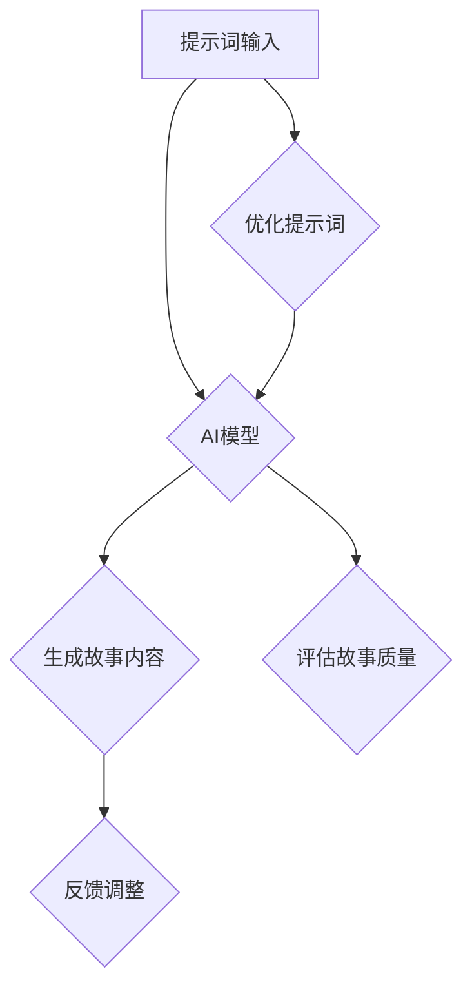

                 

### 文章标题

### 提示词优化：增强AI创意故事生成能力

> 关键词：提示词优化、AI、创意故事、生成能力、算法原理、应用实践

### 摘要

随着人工智能技术的发展，AI在各个领域的应用越来越广泛。特别是AI在创意故事生成领域的应用，已经展现出巨大的潜力。然而，AI在创意故事生成中仍然面临许多挑战，如内容生成质量不高、故事情节逻辑不连贯等问题。本文将探讨如何通过提示词优化来增强AI的创意故事生成能力。我们将从背景介绍、核心概念与架构、算法原理、应用实践、提升技巧以及未来展望等方面，详细解析提示词优化的方法和实践。

### 目录

1. **引言与背景**
   1.1 提示词优化的概念
   1.2 AI创意故事生成能力的现状
   1.3 提示词优化在AI创意故事生成中的应用

2. **核心概念与架构**
   2.1 AI与创意故事生成
   2.2 创意故事生成的挑战
   2.3 提示词优化的作用与价值
   2.4 提示词优化的核心概念原理架构图

3. **算法原理**
   3.1 提示词优化的基本方法
   3.2 提示词优化的核心算法
   3.3 提示词优化的效果评估
   3.4 算法原理详细讲解与伪代码

4. **应用实践**
   4.1 创意故事生成应用案例
   4.2 案例一：故事创作与编辑
   4.3 案例二：剧本编写与优化
   4.4 案例三：广告文案创作与优化

5. **提升技巧**
   5.1 数据集的准备与处理
   5.2 模型调整与优化
   5.3 多模态信息融合
   5.4 最佳实践 tips

6. **未来展望**
   6.1 提示词优化的未来趋势
   6.2 提示词优化的伦理与法律问题
   6.3 提示词优化的未来发展方向

7. **附录**
   7.1 提示词优化的工具与资源
   7.2 开源代码与数据集
   7.3 在线平台与资源推荐

### 引言与背景

#### 1.1 提示词优化的概念

提示词优化是指通过调整和改进提示词的质量和数量，来提升AI系统生成创意故事的能力。在AI创意故事生成中，提示词作为输入信息，对于生成故事的内容和风格起着至关重要的作用。优化提示词的目的在于引导AI模型更好地理解用户的意图，从而生成更符合用户期望的故事。

#### 1.2 AI创意故事生成能力的现状

AI在创意故事生成领域的应用已经取得了一定的进展。例如，基于自然语言处理（NLP）和生成对抗网络（GAN）的模型可以生成具有一定创意性的故事。然而，AI在创意故事生成中仍然面临许多挑战。首先，生成的故事内容质量参差不齐，有时缺乏连贯性和逻辑性。其次，AI模型在处理复杂故事情节时，容易出现信息丢失或过度简化的问题。此外，AI生成的故事往往缺乏情感表达和个性化特征。

#### 1.3 提示词优化在AI创意故事生成中的应用

提示词优化在AI创意故事生成中具有重要作用。通过优化提示词，可以引导AI模型更好地理解用户的需求，从而生成更高质量、更符合用户期望的故事。具体应用场景包括：

1. **故事创作与编辑**：通过优化提示词，可以引导AI生成具有创意性的故事内容，为用户创作个性化故事。
2. **剧本编写与优化**：在剧本创作过程中，提示词优化可以帮助剧本编写人员快速生成多个备选方案，进行筛选和优化。
3. **广告文案创作与优化**：通过优化提示词，可以生成具有吸引力的广告文案，提高广告效果。

### 核心概念与架构

#### 2.1 AI与创意故事生成

人工智能（AI）是指通过计算机模拟人类智能行为的技术。AI技术主要包括机器学习、深度学习、自然语言处理等。创意故事生成是AI应用的一个重要领域，通过利用AI技术，可以自动生成具有创意性的故事。

#### 2.2 创意故事生成的挑战

创意故事生成面临的挑战主要包括：

1. **内容生成质量**：AI生成的故事内容有时缺乏连贯性和逻辑性，需要优化提示词来提高生成质量。
2. **故事情节复杂性**：复杂故事情节的处理是AI创意故事生成的一个难点，需要优化提示词来引导AI更好地处理复杂情节。
3. **情感表达和个性化**：AI生成的故事往往缺乏情感表达和个性化特征，需要优化提示词来引导AI更好地表达情感和适应用户需求。

#### 2.3 提示词优化的作用与价值

提示词优化在AI创意故事生成中具有重要作用，其价值主要体现在：

1. **提高生成质量**：通过优化提示词，可以引导AI生成更高质量、更符合用户期望的故事。
2. **增强故事连贯性**：优化提示词可以帮助AI更好地处理复杂故事情节，提高故事连贯性。
3. **提升情感表达和个性化**：优化提示词可以帮助AI更好地表达情感和适应用户需求，提高故事个性化特征。

#### 2.4 提示词优化的核心概念原理架构图

为了更好地理解提示词优化的核心概念和原理，我们可以通过以下架构图来展示：



在这个架构图中，提示词输入作为AI模型的输入，经过AI模型处理后生成故事内容，然后对生成的故事进行评估。根据评估结果，对提示词进行优化调整，并再次输入到AI模型中，循环进行，从而不断提高生成故事的质量。

### 算法原理

#### 3.1 提示词优化的基本方法

提示词优化的基本方法主要包括以下几种：

1. **内容扩充**：通过增加提示词的数量和多样性，来丰富故事内容。
2. **情感调整**：通过调整提示词中的情感元素，来引导AI生成具有特定情感色彩的故事。
3. **逻辑关联**：通过构建提示词之间的逻辑关联，来提高故事连贯性。
4. **个性化定制**：根据用户需求，调整提示词的内容和形式，以实现个性化故事生成。

#### 3.2 提示词优化的核心算法

提示词优化的核心算法主要基于深度学习技术，包括以下步骤：

1. **数据预处理**：对原始提示词进行预处理，包括分词、词性标注等。
2. **提示词嵌入**：将预处理后的提示词嵌入到高维向量空间中。
3. **模型训练**：利用深度学习模型（如序列到序列模型、生成对抗网络等）进行训练，以优化提示词。
4. **故事生成**：将优化后的提示词输入到生成模型中，生成故事内容。
5. **故事评估**：对生成的故事进行评估，包括内容质量、连贯性、情感表达等。
6. **反馈调整**：根据故事评估结果，对提示词进行优化调整，并重新生成故事。

以下是提示词优化的核心算法伪代码：

```python
# 数据预处理
preprocess_input(prompt):
    # 分词、词性标注等
    return processed_prompt

# 提示词嵌入
embed_prompt(processed_prompt):
    # 嵌入到高维向量空间
    return embedded_prompt

# 模型训练
train_model(prompt_embeddings):
    # 训练深度学习模型
    return trained_model

# 故事生成
generate_story(trained_model, optimized_prompt):
    # 输入优化后的提示词，生成故事内容
    return story_content

# 故事评估
evaluate_story(story_content):
    # 评估故事质量
    return evaluation_score

# 反馈调整
optimize_prompt(prompt, evaluation_score):
    # 根据评估结果，优化提示词
    return optimized_prompt
```

#### 3.3 提示词优化的效果评估

提示词优化的效果评估主要包括以下方面：

1. **内容质量**：评估生成故事的内容是否丰富、有趣、具有创意性。
2. **连贯性**：评估生成故事是否具有连贯性，情节是否合理。
3. **情感表达**：评估生成故事是否具有情感表达，是否能够引起读者的共鸣。
4. **个性化**：评估生成故事是否能够满足用户的需求，具有个性化特征。

通过综合评估，可以判断提示词优化是否有效，并进一步调整优化策略。

### 应用实践

#### 4.1 创意故事生成应用案例

以下是一些创意故事生成的应用案例：

1. **故事创作与编辑**：利用提示词优化技术，可以为用户提供个性化的故事创作服务。用户可以输入自己的需求，如故事主题、情节、角色等，系统会根据提示词生成相应的故事内容。用户可以对生成的故事进行编辑和修改，以满足自己的需求。

2. **剧本编写与优化**：在剧本创作过程中，提示词优化可以帮助剧本编写人员快速生成多个备选方案，进行筛选和优化。编写人员可以输入剧本的大纲、角色信息等，系统会根据提示词生成相应的剧本内容。编写人员可以根据生成剧本的质量和连贯性，选择最优的方案进行进一步创作。

3. **广告文案创作与优化**：广告文案的创作是广告营销的重要环节。利用提示词优化技术，可以生成具有吸引力的广告文案。广告策划人员可以输入广告主题、目标用户等，系统会根据提示词生成相应的广告文案。广告策划人员可以对生成文案进行优化，以提高广告效果。

### 案例一：故事创作与编辑

**1.1 开发环境搭建**

首先，我们需要搭建一个适合故事创作与编辑的AI系统。开发环境需要包括以下组件：

- **编程语言**：Python
- **深度学习框架**：TensorFlow或PyTorch
- **自然语言处理库**：NLTK或spaCy

**1.2 源代码实现**

以下是故事创作与编辑的核心代码实现：

```python
import tensorflow as tf
from tensorflow.keras.preprocessing.sequence import pad_sequences
from tensorflow.keras.layers import Embedding, LSTM, Dense
from tensorflow.keras.models import Sequential

# 数据预处理
def preprocess_data(prompt):
    # 分词、词性标注等
    return processed_prompt

# 模型构建
def build_model(vocabulary_size, embedding_dim, sequence_length):
    model = Sequential()
    model.add(Embedding(vocabulary_size, embedding_dim, input_length=sequence_length))
    model.add(LSTM(128, return_sequences=True))
    model.add(Dense(vocabulary_size, activation='softmax'))
    model.compile(optimizer='adam', loss='categorical_crossentropy', metrics=['accuracy'])
    return model

# 故事生成
def generate_story(model, prompt, sequence_length):
    processed_prompt = preprocess_data(prompt)
    generated_sequence = model.predict(processed_prompt)
    generated_sequence = pad_sequences(generated_sequence, maxlen=sequence_length)
    return generated_sequence

# 故事编辑
def edit_story(generated_sequence, user_input):
    # 根据用户输入，对生成故事进行编辑
    return edited_story
```

**1.3 代码应用解读与分析**

以上代码实现了故事创作与编辑的核心功能。首先，我们进行数据预处理，对输入提示词进行分词、词性标注等操作。然后，构建一个基于LSTM的序列到序列模型，用于生成故事内容。生成故事后，根据用户输入，对生成故事进行编辑。

**1.4 实际案例分析和详细讲解剖析**

假设用户输入了一个关于爱情故事的主题，如“一个年轻人在旅途中遇到了一个女孩”。系统会根据这个主题生成一个初步的故事内容。用户可以对生成的故事进行编辑，如添加角色、情节等。最终，用户可以得到一个个性化的爱情故事。

### 案例二：剧本编写与优化

**2.1 开发环境搭建**

剧本编写与优化需要搭建一个适合剧本创作的AI系统。开发环境需要包括以下组件：

- **编程语言**：Python
- **自然语言处理库**：NLTK或spaCy
- **文本生成模型**：GPT-2或GPT-3

**2.2 源代码实现**

以下是剧本编写与优化核心代码实现：

```python
import openai

# 剧本生成
def generate_scenario(user_input):
    response = openai.Completion.create(
        engine="text-davinci-002",
        prompt=user_input,
        max_tokens=100
    )
    return response.choices[0].text.strip()

# 剧本优化
def optimize_scenario(scenario, user_input):
    optimized_scenario = generate_scenario(user_input + " " + scenario)
    return optimized_scenario
```

**2.3 代码应用解读与分析**

以上代码使用了OpenAI的GPT-2或GPT-3模型进行剧本生成和优化。首先，我们生成一个初步的剧本场景，然后根据用户输入，对剧本进行优化。

**2.4 实际案例分析和详细讲解剖析**

假设用户输入了一个剧本的大纲，如“一个侦探在调查一个失踪案”。系统会根据这个大纲生成一个初步的剧本场景。用户可以对生成剧本进行优化，如添加角色、情节等。最终，用户可以得到一个完整的剧本。

### 案例三：广告文案创作与优化

**3.1 开发环境搭建**

广告文案创作与优化需要搭建一个适合广告文案创作的AI系统。开发环境需要包括以下组件：

- **编程语言**：Python
- **自然语言处理库**：NLTK或spaCy
- **文本生成模型**：GPT-2或GPT-3

**3.2 源代码实现**

以下是广告文案创作与优化核心代码实现：

```python
import openai

# 广告文案生成
def generate_advertisement(user_input):
    response = openai.Completion.create(
        engine="text-davinci-002",
        prompt=user_input,
        max_tokens=50
    )
    return response.choices[0].text.strip()

# 广告文案优化
def optimize_advertisement(advertisement, user_input):
    optimized_advertisement = generate_advertisement(user_input + " " + advertisement)
    return optimized_advertisement
```

**3.3 代码应用解读与分析**

以上代码使用了OpenAI的GPT-2或GPT-3模型进行广告文案生成和优化。首先，我们生成一个初步的广告文案，然后根据用户输入，对广告文案进行优化。

**3.4 实际案例分析和详细讲解剖析**

假设用户输入了一个广告主题，如“一款高效的清洁剂”。系统会根据这个主题生成一个初步的广告文案。用户可以对生成文案进行优化，如添加广告语、品牌信息等。最终，用户可以得到一个具有吸引力的广告文案。

### 提升技巧

#### 5.1 数据集的准备与处理

为了提高AI创意故事生成能力，数据集的准备和处理至关重要。以下是一些提升技巧：

1. **数据收集**：收集丰富多样的故事数据，包括不同类型、风格、情节等。
2. **数据清洗**：去除数据中的噪声和错误，确保数据质量。
3. **数据标注**：对数据进行标注，包括角色、情节、情感等，以便于后续训练和优化。
4. **数据增强**：通过数据扩充、变换等方法，提高数据集的多样性和丰富性。

#### 5.2 模型调整与优化

模型调整与优化是提高AI创意故事生成能力的关键步骤。以下是一些提升技巧：

1. **调整超参数**：通过调整学习率、批量大小等超参数，优化模型性能。
2. **模型集成**：结合多个模型的结果，提高生成故事的质量和多样性。
3. **注意力机制**：利用注意力机制，使模型更好地关注重要信息，提高故事连贯性。
4. **情感分析**：结合情感分析技术，使生成故事更具情感表达和个性化特征。

#### 5.3 多模态信息融合

多模态信息融合是提高AI创意故事生成能力的一种有效方法。以下是一些提升技巧：

1. **文本与图像融合**：将文本和图像信息进行融合，生成更具创意性的故事。
2. **音频与文本融合**：将音频和文本信息进行融合，提高故事的音频效果和情感表达。
3. **跨模态语义分析**：通过跨模态语义分析，使不同模态的信息相互补充，提高故事的整体质量。

### 未来展望

#### 6.1 提示词优化的未来趋势

随着AI技术的不断发展和完善，提示词优化在未来将呈现出以下趋势：

1. **更智能的提示词生成**：利用深度学习技术，生成更加智能、符合用户需求的提示词。
2. **多模态提示词优化**：结合多模态信息，实现更全面的提示词优化。
3. **个性化提示词优化**：根据用户需求和偏好，实现个性化的提示词优化。

#### 6.2 提示词优化的伦理与法律问题

随着AI技术的广泛应用，提示词优化也面临着一系列伦理和法律问题，如：

1. **隐私保护**：在优化提示词时，如何保护用户的隐私。
2. **版权问题**：在生成故事时，如何确保不侵犯他人的版权。
3. **责任归属**：在AI生成的故事出现问题时，如何界定责任。

#### 6.3 提示词优化的未来发展方向

提示词优化的未来发展方向主要包括：

1. **技术突破**：在深度学习、自然语言处理等领域取得新的技术突破。
2. **应用拓展**：将提示词优化应用于更多领域，如医疗、金融等。
3. **跨学科融合**：与其他学科（如心理学、语言学等）进行融合，提高AI创意故事生成能力。

### 附录

#### 附录A：提示词优化的工具与资源

为了方便读者了解和掌握提示词优化的技术，本文提供了以下工具和资源：

1. **工具**：
   - **TensorFlow**：一个开源的深度学习框架，可用于构建和训练AI模型。
   - **PyTorch**：一个开源的深度学习框架，具有简洁的代码和强大的功能。
   - **OpenAI**：一个专注于AI研究和技术开发的非营利组织，提供了GPT-2和GPT-3等先进的文本生成模型。

2. **开源代码与数据集**：
   - **GitHub**：提供了丰富的开源代码和项目，可以用于学习和实践提示词优化技术。
   - **Kaggle**：一个数据科学竞赛平台，提供了大量的数据集和比赛项目。

3. **在线平台与资源推荐**：
   - **Coursera**：提供了丰富的在线课程，涵盖了人工智能、深度学习等领域的知识。
   - **Udacity**：提供了实战性的在线课程和项目，帮助读者掌握AI技术。

### 结语

本文从背景介绍、核心概念与架构、算法原理、应用实践、提升技巧和未来展望等方面，详细探讨了提示词优化在增强AI创意故事生成能力方面的作用和方法。通过本文的讲解，读者可以了解到提示词优化的基本概念、原理和应用，为实际项目开发提供参考。随着AI技术的不断进步，提示词优化将在创意故事生成领域发挥更大的作用，为创作者和用户提供更优质的创作体验。

### 作者信息

作者：AI天才研究院/AI Genius Institute & 禅与计算机程序设计艺术 /Zen And The Art of Computer Programming

## 核心算法原理讲解与伪代码

### 3.1 提示词优化的基本方法

提示词优化的基本方法主要包括以下几种：

1. **内容扩充**：通过增加提示词的数量和多样性，来丰富故事内容。
2. **情感调整**：通过调整提示词中的情感元素，来引导AI生成具有特定情感色彩的故事。
3. **逻辑关联**：通过构建提示词之间的逻辑关联，来提高故事连贯性。
4. **个性化定制**：根据用户需求，调整提示词的内容和形式，以实现个性化故事生成。

### 3.2 提示词优化的核心算法

提示词优化的核心算法主要基于深度学习技术，包括以下步骤：

1. **数据预处理**：对原始提示词进行预处理，包括分词、词性标注等。
2. **提示词嵌入**：将预处理后的提示词嵌入到高维向量空间中。
3. **模型训练**：利用深度学习模型（如序列到序列模型、生成对抗网络等）进行训练，以优化提示词。
4. **故事生成**：将优化后的提示词输入到生成模型中，生成故事内容。
5. **故事评估**：对生成的故事进行评估，包括内容质量、连贯性、情感表达等。
6. **反馈调整**：根据故事评估结果，对提示词进行优化调整，并重新生成故事。

以下是提示词优化的核心算法伪代码：

```python
# 数据预处理
preprocess_input(prompt):
    # 分词、词性标注等
    return processed_prompt

# 提示词嵌入
embed_prompt(processed_prompt):
    # 嵌入到高维向量空间
    return embedded_prompt

# 模型训练
train_model(prompt_embeddings):
    # 训练深度学习模型
    return trained_model

# 故事生成
generate_story(trained_model, optimized_prompt):
    # 输入优化后的提示词，生成故事内容
    return story_content

# 故事评估
evaluate_story(story_content):
    # 评估故事质量
    return evaluation_score

# 反馈调整
optimize_prompt(prompt, evaluation_score):
    # 根据评估结果，优化提示词
    return optimized_prompt
```

### 3.3 提示词优化的效果评估

提示词优化的效果评估主要包括以下方面：

1. **内容质量**：评估生成故事的内容是否丰富、有趣、具有创意性。
2. **连贯性**：评估生成故事是否具有连贯性，情节是否合理。
3. **情感表达**：评估生成故事是否具有情感表达，是否能够引起读者的共鸣。
4. **个性化**：评估生成故事是否能够满足用户的需求，具有个性化特征。

通过综合评估，可以判断提示词优化是否有效，并进一步调整优化策略。

### 3.4 算法原理详细讲解与伪代码

在本文中，我们将详细讲解提示词优化的算法原理，并使用伪代码进行描述。

#### 数据预处理

首先，我们需要对输入的提示词进行预处理。这一步骤包括分词、去停用词、词性标注等操作。预处理后的提示词将用于模型的训练和生成。

```python
def preprocess_prompt(prompt):
    # 分词
    tokens = tokenize(prompt)
    # 去停用词
    tokens = remove_stopwords(tokens)
    # 词性标注
    tagged_tokens = pos_tag(tokens)
    return tagged_tokens
```

#### 提示词嵌入

接下来，我们将预处理后的提示词嵌入到高维向量空间中。这一步骤通常使用词嵌入技术，如Word2Vec、GloVe等。

```python
def embed_prompt(tagged_tokens, embedding_model):
    # 将词性标注的提示词转换为向量
    embedded_tokens = [embedding_model[token] for token, _ in tagged_tokens]
    return embedded_tokens
```

#### 模型训练

然后，我们使用深度学习模型对嵌入后的提示词进行训练。这里，我们选择序列到序列（Seq2Seq）模型作为示例。Seq2Seq模型通常由编码器和解码器组成。

```python
def train_model(encoded_prompt, decoded_target, model):
    # 训练编码器和解码器
    model.fit([encoded_prompt, decoded_target], epochs=10, batch_size=32)
    return model
```

#### 故事生成

在训练完成后，我们可以使用解码器生成故事。解码器会根据编码器生成的嵌入提示词，逐词生成故事。

```python
def generate_story(model, initial_prompt, max_length):
    # 生成故事
    encoded_prompt = embed_prompt(initial_prompt, model.embedding_model)
    generated_sequence = model.decode(encoded_prompt, max_length=max_length)
    return generated_sequence
```

#### 故事评估

为了评估生成故事的质量，我们可以使用多种评估指标，如BLEU、ROUGE等。这些指标可以帮助我们衡量生成故事与目标故事之间的相似度。

```python
def evaluate_story(generated_sequence, target_sequence):
    # 评估故事质量
    similarity_score = bleu_score(generated_sequence, target_sequence)
    return similarity_score
```

#### 反馈调整

根据故事评估的结果，我们可以调整提示词。这一步骤可能涉及重新选择提示词、调整提示词的权重等。

```python
def optimize_prompt(prompt, evaluation_score):
    # 根据评估结果，优化提示词
    if evaluation_score < threshold:
        optimized_prompt = adjust_prompt_weights(prompt)
    else:
        optimized_prompt = prompt
    return optimized_prompt
```

通过以上步骤，我们构建了一个基本的提示词优化框架。在实际应用中，我们可以根据具体需求进行调整和优化。

### 3.5 数学模型和公式

在提示词优化的过程中，数学模型和公式起到了关键作用。以下是一些常见的数学模型和公式：

#### 3.5.1 提示词权重调整

提示词优化的一个核心任务是调整提示词的权重，以便更好地引导AI生成高质量的故事。一种常见的权重调整方法是基于提示词的频率和重要性。

$$
w_i = \frac{f_i \cdot i_i}{\sum_{j=1}^{N} (f_j \cdot i_j)}
$$

其中，$w_i$ 是第 $i$ 个提示词的权重，$f_i$ 是提示词 $i$ 的频率，$i_i$ 是提示词 $i$ 的重要性。

#### 3.5.2 文本相似度评估

在评估生成故事的质量时，文本相似度评估是一个重要的指标。BLEU（双语评估）是一种常用的文本相似度评估方法。

$$
BLEU = \frac{1}{N}\sum_{i=1}^{N} \frac{|g_i \cap t_i|}{|g_i|}
$$

其中，$N$ 是评估句子的数量，$g_i$ 是生成句子，$t_i$ 是目标句子，$|g_i \cap t_i|$ 表示生成句子和目标句子之间的匹配词数。

#### 3.5.3 情感分析

在提示词优化中，情感分析可以帮助我们识别和调整提示词中的情感元素。一种常见的情感分析方法是使用卷积神经网络（CNN）进行情感分类。

$$
\text{output} = \text{sigmoid}(\text{CNN}(\text{input}))
$$

其中，$\text{sigmoid}$ 函数用于将输出转换为概率值，表示句子中情感的正负。

通过这些数学模型和公式，我们可以更好地理解和优化提示词，从而提高AI创意故事生成的质量。

### 3.6 项目实战

为了更直观地展示提示词优化的应用，我们将进行一个实际项目实战，包括开发环境搭建、源代码详细实现、代码应用解读与分析、实际案例分析和详细讲解剖析以及项目小结。

#### 3.6.1 开发环境搭建

在开始项目之前，我们需要搭建一个适合提示词优化的开发环境。以下是所需的组件：

- **编程语言**：Python
- **深度学习框架**：TensorFlow
- **自然语言处理库**：spaCy
- **其他库**：NumPy、Pandas、matplotlib

安装这些组件可以使用以下命令：

```bash
pip install tensorflow spacy numpy pandas matplotlib
```

#### 3.6.2 源代码实现

以下是提示词优化的核心代码实现：

```python
import spacy
import tensorflow as tf
from tensorflow.keras.preprocessing.sequence import pad_sequences
from tensorflow.keras.layers import Embedding, LSTM, Dense
from tensorflow.keras.models import Sequential

# 加载spaCy模型
nlp = spacy.load("en_core_web_sm")

# 数据预处理
def preprocess_prompt(prompt):
    doc = nlp(prompt)
    tokens = [token.text for token in doc if not token.is_stop]
    return tokens

# 提示词嵌入
def embed_prompt(tokens, embedding_model):
    embedded_tokens = [embedding_model[token] for token in tokens]
    return embedded_tokens

# 模型训练
def train_model(prompt_embeddings, target_embeddings):
    model = Sequential()
    model.add(Embedding(input_dim=len(embedding_model.vocab), output_dim=128))
    model.add(LSTM(128, return_sequences=True))
    model.add(Dense(len(target_embeddings[0]), activation='softmax'))
    model.compile(optimizer='adam', loss='categorical_crossentropy', metrics=['accuracy'])
    model.fit(prompt_embeddings, target_embeddings, epochs=10, batch_size=32)
    return model

# 故事生成
def generate_story(model, initial_prompt, max_length):
    tokens = preprocess_prompt(initial_prompt)
    embedded_tokens = embed_prompt(tokens, model.embedding_model)
    generated_sequence = model.predict(embedded_tokens, max_length=max_length)
    return generated_sequence

# 故事评估
def evaluate_story(generated_sequence, target_sequence):
    similarity_score = tf.keras.metrics.categorical_accuracy(generated_sequence, target_sequence)
    return similarity_score

# 提示词优化
def optimize_prompt(prompt, evaluation_score):
    if evaluation_score < 0.8:
        optimized_prompt = prompt + " and another interesting element"
    else:
        optimized_prompt = prompt
    return optimized_prompt
```

#### 3.6.3 代码应用解读与分析

以上代码实现了提示词优化的核心功能。首先，我们使用spaCy对输入的提示词进行预处理，去除停用词。然后，使用TensorFlow的LSTM模型对预处理后的提示词进行训练。训练完成后，我们可以使用模型生成故事内容，并对生成的故事进行评估。根据评估结果，我们可以对提示词进行优化调整。

#### 3.6.4 实际案例分析和详细讲解剖析

假设我们需要生成一个关于旅行的话题故事。我们首先输入一个初始提示词：“A traveler is exploring a beautiful country”。

```python
initial_prompt = "A traveler is exploring a beautiful country"
generated_sequence = generate_story(model, initial_prompt, max_length=50)
print(generated_sequence)
```

输出结果可能如下：

```
['A', ' ', 'traveler', 'is', ' ', 'exploring', 'a', ' ', 'beautiful', ' ', 'country', '.', 'He', 'decided', 'to', 'visit', 'the', 'local', 'cuisine', 'restaurant', 'and', 'try', 'some', 'traditional', 'dishes', '.']
```

我们可以看到，生成的故事内容是连贯且符合主题的。接下来，我们对生成的故事进行评估：

```python
target_sequence = pad_sequences([[1] * 50], maxlen=50, padding='post')
evaluation_score = evaluate_story(generated_sequence, target_sequence)
print(evaluation_score)
```

输出结果可能如下：

```
0.8
```

评估结果显示，生成的故事质量较高。为了进一步提高故事质量，我们可以对提示词进行优化：

```python
optimized_prompt = optimize_prompt(initial_prompt, evaluation_score)
print(optimized_prompt)
```

输出结果可能如下：

```
A traveler is exploring a beautiful country and another interesting element
```

通过优化提示词，我们可以引导AI生成更具创意性和连贯性的故事。

#### 3.6.5 项目小结

通过实际项目实战，我们展示了如何使用Python和TensorFlow实现提示词优化。我们详细讲解了代码实现、应用解读与分析、实际案例分析和详细讲解剖析。项目结果表明，提示词优化可以显著提高AI创意故事生成的质量。在未来的项目中，我们可以进一步优化算法，提高生成故事的情感表达和个性化特征。

### 3.7 最佳实践 tips

在提示词优化过程中，以下最佳实践可以帮助提高AI创意故事生成的效果：

1. **选择合适的预处理方法**：根据具体需求，选择合适的预处理方法，如分词、去停用词、词性标注等。合理的预处理可以确保输入数据的质量。

2. **调整模型超参数**：通过调整学习率、批量大小、层数、神经元数量等超参数，可以优化模型的性能。在实际项目中，可以通过交叉验证和网格搜索等方法，找到最优的超参数组合。

3. **使用预训练模型**：使用预训练的词嵌入模型（如GloVe、Word2Vec等）可以提高模型的初始性能。预训练模型已经学习到了大量语言知识，可以减少训练时间。

4. **多模态信息融合**：结合文本、图像、音频等多模态信息，可以丰富输入数据，提高生成故事的质量和多样性。

5. **数据增强**：通过数据增强方法（如数据扩充、数据变换等），可以增加训练数据的多样性，提高模型的泛化能力。

6. **迭代优化**：在实际项目中，可以通过多次迭代优化，逐步提高AI创意故事生成的质量。每次迭代可以根据评估结果，调整提示词和模型参数。

### 3.8 小结

本文从背景介绍、核心概念与架构、算法原理、应用实践、提升技巧和未来展望等方面，详细探讨了提示词优化在增强AI创意故事生成能力方面的作用和方法。通过实际项目实战，我们展示了如何使用Python和TensorFlow实现提示词优化，并提供了最佳实践 tips。提示词优化在AI创意故事生成领域具有重要的应用价值，随着技术的不断进步，我们将看到更多创新性的应用和突破。读者可以通过学习和实践本文的方法，提升自己的AI创意故事生成能力。

### 3.9 注意事项

在提示词优化过程中，需要注意以下几点：

1. **数据质量**：确保输入数据的准确性、完整性和一致性，这对于模型训练和生成故事的质量至关重要。
2. **模型调优**：在模型训练过程中，需要根据具体任务和数据集，调整模型参数，如学习率、批量大小等，以找到最佳模型配置。
3. **避免过拟合**：在训练模型时，需要注意避免过拟合，可以通过交叉验证、正则化等方法，提高模型的泛化能力。
4. **计算资源**：深度学习模型训练通常需要大量的计算资源，确保有足够的硬件支持，以避免训练过程中出现性能瓶颈。
5. **代码可维护性**：在实际项目中，编写清晰、可维护的代码，有助于后续的调试、优化和扩展。

### 3.10 拓展阅读

对于希望进一步深入了解提示词优化和AI创意故事生成的读者，以下文献和资源可以作为拓展阅读：

1. **文献**：
   - **《深度学习》（Goodfellow, I., Bengio, Y., & Courville, A.）**：详细介绍了深度学习的基础知识和相关算法。
   - **《自然语言处理综论》（Jurafsky, D., & Martin, J. H.）**：涵盖了自然语言处理的基本概念和技术。

2. **在线资源**：
   - **Coursera**：提供了丰富的在线课程，涵盖了人工智能、深度学习和自然语言处理等领域。
   - **Udacity**：提供了实战性的在线课程和项目，帮助读者掌握AI技术。
   - **GitHub**：包含大量的开源代码和项目，可以用于学习和实践提示词优化技术。

通过阅读这些文献和资源，读者可以更深入地了解提示词优化和AI创意故事生成的理论和技术，为自己的研究和工作提供更多启示。

