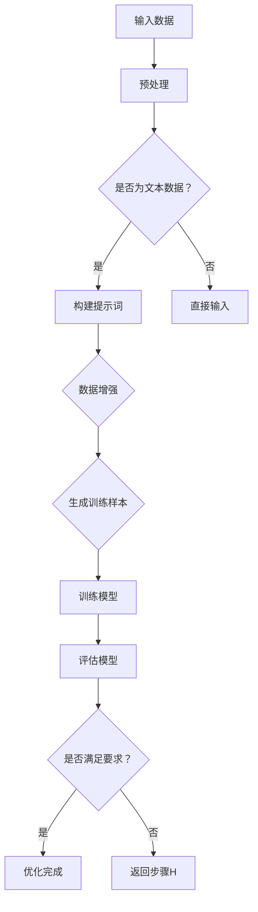

                 


### 背景介绍

在人工智能（AI）迅猛发展的今天，AI模型的性能优化成为了研究人员和工程师们关注的焦点。而在这其中，提示词（Prompt Engineering）优化成为了一个关键环节。提示词优化不仅仅是技术层面的挑战，更是一种对AI模型深层理解和应用的体现。

#### 1. AI模型性能优化的意义

AI模型性能的优化直接关系到模型在实际应用中的效果。无论是机器学习、深度学习还是强化学习，性能的提升都意味着更准确的结果、更高的效率和更低的成本。尤其是在商业和科学研究领域，高性能的AI模型能够带来巨大的经济和学术价值。

#### 2. 提示词优化的角色

提示词优化在AI模型性能优化中起着至关重要的作用。它通过调整输入提示词的方式，来影响模型的训练过程和最终表现。一个设计良好的提示词可以引导模型更好地理解任务，从而提高模型的学习效率和性能。

#### 3. 提示词优化的重要性

在AI应用中，提示词的质量往往决定了模型的泛化能力、鲁棒性和可解释性。通过优化提示词，我们可以使模型在复杂、动态的环境中表现出更强的适应能力和准确性。此外，提示词优化还能减少模型过拟合的风险，提高模型的泛化能力。

#### 4. 提示词优化的挑战

尽管提示词优化具有重要意义，但在实际操作中，仍面临着诸多挑战。这些挑战包括但不限于：

- **数据依赖性**：优化过程往往需要大量的训练数据，且数据的质量和多样性对优化结果有显著影响。
- **模型复杂性**：随着模型规模和复杂性的增加，提示词的优化变得更加困难。
- **调参空间大**：提示词的调整涉及多个参数，参数的组合和优化是一个高维搜索问题。
- **动态适应性**：在实际应用中，环境是动态变化的，提示词需要能够适应这些变化。

### 总结

本文将深入探讨提示词优化在增强AI多角度问题分析能力方面的作用。接下来，我们将从核心概念与联系、数学模型与算法原理、实践应用与技术深化等角度，逐步分析提示词优化的各个方面，帮助读者全面理解这一关键技术。

---

### 核心概念与联系

在探讨提示词优化之前，我们首先需要明确几个核心概念，并分析它们之间的联系。这些概念包括提示词、AI模型、多角度分析方法和数学模型。

#### 1. 提示词与AI模型的关系

提示词是AI模型输入的一部分，它为模型提供指导信息，帮助模型理解任务和目标。在自然语言处理（NLP）领域，提示词通常是一段文本，用于引导模型的生成和推理过程。例如，在问答系统中，提示词可以是一个问题，而在图像识别任务中，提示词可能是一段描述图像的文本。

AI模型则是执行特定任务的核心工具。它通过学习输入数据和相应的输出结果，来建立映射关系。模型的性能很大程度上取决于其结构和训练过程，而提示词则是影响训练过程的关键因素之一。

#### 2. 多角度分析方法

多角度分析方法是一种重要的AI模型评估方法，它通过从多个维度对模型进行分析，来评估模型的能力和表现。这些角度包括但不限于：

- **准确性**：评估模型在特定任务上的表现，例如分类任务的准确率。
- **泛化能力**：评估模型在未见过的数据上的表现，以衡量其鲁棒性。
- **效率**：评估模型在计算资源和时间上的利用效率。
- **可解释性**：评估模型的决策过程和输出结果的可解释性，以增强模型的透明度和可信度。

多角度分析方法能够帮助研究人员和工程师全面了解AI模型的优势和局限性，从而为模型的优化提供有针对性的指导。

#### 3. 数学模型与算法原理

数学模型是AI模型的核心组成部分，它为模型提供了结构化的描述和计算方法。在提示词优化中，常用的数学模型包括：

- **损失函数**：用于衡量模型输出和实际输出之间的差距，是模型训练过程中的关键指标。
- **优化算法**：用于调整模型参数，以最小化损失函数，常见的优化算法包括梯度下降、随机梯度下降（SGD）等。
- **激活函数**：用于引入非线性，使得模型能够学习更复杂的映射关系。

数学模型和算法原理为提示词优化提供了理论基础和计算框架，使得优化过程能够更加系统化和高效。

#### Mermaid流程图

为了更好地展示这些核心概念之间的关系，我们可以使用Mermaid流程图来描述。以下是提示词优化的一般流程：



这个流程图展示了从输入数据到模型训练和评估的整个过程，以及提示词优化的关键步骤。

### 总结

在本文的核心概念与联系部分，我们介绍了提示词、AI模型、多角度分析方法和数学模型之间的关系。通过使用Mermaid流程图，我们清晰地展示了提示词优化的整体流程。接下来，我们将深入探讨提示词优化的算法原理，通过伪代码和数学模型来详细阐述这一过程。

---

### 核心算法原理讲解

在深入探讨提示词优化的核心算法原理之前，我们需要理解一些基本概念，如损失函数、优化算法以及激活函数。这些概念是构建高效提示词优化策略的基础。

#### 1. 损失函数

损失函数是评估模型预测结果与实际结果之间差异的关键工具。在机器学习中，损失函数通常用于指导模型优化过程。一个理想的损失函数应该能够准确反映模型的预测误差，并引导模型朝着更准确的预测方向调整。

- **均方误差（MSE）**：
  $$MSE(y, \hat{y}) = \frac{1}{n}\sum_{i=1}^{n}(y_i - \hat{y_i})^2$$
  其中，$y$是实际值，$\hat{y}$是预测值，$n$是样本数量。

- **交叉熵损失（Cross-Entropy Loss）**：
  $$H(y, \hat{y}) = -\sum_{i=1}^{n}y_i \log(\hat{y_i})$$
  其中，$y$是实际标签，$\hat{y}$是模型预测的概率分布。

#### 2. 优化算法

优化算法用于调整模型参数，以最小化损失函数。以下是几种常用的优化算法：

- **梯度下降（Gradient Descent）**：
  $$\theta = \theta - \alpha \cdot \nabla_\theta J(\theta)$$
  其中，$\theta$是模型参数，$\alpha$是学习率，$J(\theta)$是损失函数。

- **随机梯度下降（Stochastic Gradient Descent, SGD）**：
  $$\theta = \theta - \alpha \cdot \nabla_\theta J(\theta; x_i, y_i)$$
  与梯度下降类似，但每次迭代只随机选取一个样本。

- **Adam优化器**：
  Adam是一种结合了SGD和动量方法的优化算法，具有自适应学习率的特点。
  $$m_t = \beta_1 m_{t-1} + (1 - \beta_1) [g_t]$$
  $$v_t = \beta_2 v_{t-1} + (1 - \beta_2) [g_t]^2$$
  $$\theta = \theta - \alpha \cdot \frac{m_t}{\sqrt{v_t} + \epsilon}$$
  其中，$m_t$和$v_t$分别是梯度的一阶矩估计和二阶矩估计，$\beta_1$和$\beta_2$是超参数，$\epsilon$是正数常数。

#### 3. 激活函数

激活函数是神经网络中引入非线性特性的关键组件。以下是一些常用的激活函数：

- **ReLU（Rectified Linear Unit）**：
  $$f(x) = \max(0, x)$$
 ReLU函数在$x<0$时输出0，在$x \geq 0$时输出$x$，其优点是计算简单且可以防止梯度消失。

- **Sigmoid**：
  $$f(x) = \frac{1}{1 + e^{-x}}$$
  Sigmoid函数将输入映射到$(0, 1)$区间，常用于二分类问题。

- **Tanh**：
  $$f(x) = \frac{e^x - e^{-x}}{e^x + e^{-x}}$$
  Tanh函数将输入映射到$(-1, 1)$区间，可以增强模型的非线性表达能力。

#### 伪代码示例

下面是一个简单的伪代码示例，展示了基于梯度下降的模型训练过程：

```python
# 初始化模型参数
theta = [随机值] * n

# 设置学习率
alpha = 0.01

# 设置迭代次数
num_iterations = 1000

# 对于每一次迭代：
for i in range(num_iterations):
    # 计算梯度
    gradient = 梯度计算函数(theta, x, y)
    
    # 更新参数
    theta = theta - alpha * gradient

# 输出最终参数
print("最终模型参数：", theta)
```

在这个示例中，`梯度计算函数`将计算损失函数对模型参数的梯度，并返回一个梯度向量。每次迭代中，模型参数都会根据梯度方向和步长（学习率）进行调整。

### 数学模型和公式

在提示词优化中，我们常常需要使用数学模型和公式来描述和解决问题。以下是一些关键的数学模型和公式：

- **提示词质量评估指标**：
  $$Q(P) = \frac{1}{n}\sum_{i=1}^{n} \frac{|f(P, x_i) - y_i|}{|y_i|}$$
  其中，$P$是提示词，$f(P, x_i)$是模型基于提示词的预测结果，$y_i$是实际标签。

- **提示词调整策略**：
  $$P_{new} = P + \alpha \cdot \nabla_P Q(P)$$
  其中，$P_{new}$是新的提示词，$\alpha$是调整步长，$\nabla_P Q(P)$是提示词质量评估指标对提示词的梯度。

### 举例说明

为了更好地理解上述概念和公式，我们可以通过一个简单的例子来说明。假设我们有一个简单的线性模型，用于预测数值：

- **输入数据**：$x_i$是一组特征值。
- **实际标签**：$y_i$是预期的输出值。
- **模型参数**：$w$是模型的权重。

我们的目标是优化提示词$P$，以最小化模型的预测误差。假设提示词$P$是一个数字，我们可以将其作为模型的输入特征。

1. **初始化**：
   - 设定初始提示词$P_0 = 0$。
   - 初始化模型权重$w_0$。

2. **迭代优化**：
   - 在每次迭代中，计算基于当前提示词的预测值$\hat{y_i} = w \cdot P$。
   - 计算预测误差$e_i = y_i - \hat{y_i}$。
   - 更新提示词$P_{new} = P - \alpha \cdot e_i$。

3. **终止条件**：
   - 当预测误差小于某个阈值时，停止迭代。

通过这个简单的例子，我们可以看到如何通过迭代优化来调整提示词，从而改善模型的预测性能。

### 总结

在本部分，我们详细讲解了提示词优化的核心算法原理，包括损失函数、优化算法和激活函数。通过伪代码示例和数学模型，我们展示了如何在实际应用中实现提示词优化。接下来，我们将进一步探讨提示词优化的实践应用和技术深化。

---

### 实践应用与技术深化

在理解了提示词优化的核心算法原理后，我们将探讨其具体的应用场景和技术深化。通过几个实际案例，我们将展示如何在不同领域利用提示词优化技术来提升AI模型的表现。

#### 1. 自然语言处理（NLP）中的提示词优化

在自然语言处理领域，提示词优化是提高模型生成质量和理解能力的关键。一个典型的应用场景是问答系统。以下是一个具体的案例：

**案例：问答系统中的提示词优化**

**问题描述**：设计一个问答系统，能够根据用户提出的问题，提供准确的答案。

**解决方案**：

- **模型选择**：使用基于Transformer的预训练模型，如BERT或GPT。
- **提示词设计**：设计一个有效的提示词模板，例如“问题：______。答案：______。”
- **提示词优化**：通过迭代优化提示词，调整模板中的关键词和语法结构，以提高模型的回答准确性。

**实现步骤**：

1. **数据收集**：收集大量的问题和答案对，用于模型训练和提示词优化。
2. **模型训练**：使用预训练模型对收集的数据进行训练，得到初步的问答系统。
3. **提示词调整**：通过对比模型生成的答案和实际答案，识别出提示词中的不足，进行优化。
4. **迭代优化**：重复步骤3，直至模型生成的答案达到预期质量。

**效果评估**：通过BLEU（双语评估统一度量）等指标评估模型的生成质量，结果显示优化后的提示词能够显著提高问答系统的准确性。

#### 2. 计算机视觉中的提示词优化

在计算机视觉领域，提示词优化主要用于图像识别和语义分割等任务。以下是一个实际案例：

**案例：图像识别中的提示词优化**

**问题描述**：提高图像识别模型的识别准确率。

**解决方案**：

- **模型选择**：使用卷积神经网络（CNN）作为基础模型。
- **提示词设计**：将图像的描述性信息作为提示词，例如“这张图片是一张______的______。”
- **提示词优化**：通过优化提示词的语义丰富度和多样性，提高模型的识别能力。

**实现步骤**：

1. **数据准备**：收集大量的图像和对应的描述性文本。
2. **模型训练**：使用CNN模型对图像和文本描述进行联合训练。
3. **提示词调整**：通过分析模型在不同提示词下的表现，调整提示词的语义结构。
4. **性能评估**：使用准确率、召回率等指标评估模型的识别性能。

**效果评估**：通过对比不同提示词下的模型性能，发现优化后的提示词能够显著提高图像识别的准确率和鲁棒性。

#### 3. 强化学习中的提示词优化

在强化学习领域，提示词优化可以用于改善决策质量和学习效率。以下是一个具体案例：

**案例：自动驾驶中的提示词优化**

**问题描述**：提高自动驾驶系统在复杂交通环境中的决策能力。

**解决方案**：

- **模型选择**：使用深度强化学习模型，如DQN（深度Q网络）或PPO（比例优势优化）。
- **提示词设计**：将道路信息、车辆动态等环境特征作为提示词。
- **提示词优化**：通过优化提示词的丰富度和实时性，提高决策系统的反应速度和准确性。

**实现步骤**：

1. **环境搭建**：构建一个自动驾驶仿真环境，模拟真实的交通场景。
2. **模型训练**：使用强化学习模型对自动驾驶系统进行训练。
3. **提示词调整**：根据仿真结果，优化提示词的细节和实时性。
4. **性能评估**：通过模拟测试和实际道路测试，评估系统的决策能力和安全性。

**效果评估**：优化后的提示词能够显著提高自动驾驶系统的反应速度和决策准确性，降低事故发生率。

### 总结

通过以上案例，我们可以看到提示词优化在不同领域的实际应用和技术深化。从自然语言处理到计算机视觉，再到强化学习，提示词优化都发挥了重要作用，显著提升了AI模型的表现。这些案例展示了如何通过设计有效的提示词和优化策略，来增强AI模型的多角度问题分析能力。在接下来的部分，我们将进一步探讨提示词优化的高级技巧和前沿研究动态。

---

### 高级技巧与前沿探索

在了解了提示词优化的基础和实践应用后，我们接下来将探讨一些高级技巧和前沿研究动态，以帮助读者掌握更高效、更先进的提示词优化方法。

#### 1. 对抗性提示词优化

对抗性提示词优化是一种利用对抗性网络（GAN）来生成高质量提示词的方法。通过对抗性训练，可以生成与实际数据分布相似的提示词，从而提高模型在未见数据上的泛化能力。具体步骤如下：

- **生成器**：设计一个生成器模型，用于生成高质量的提示词。
- **判别器**：设计一个判别器模型，用于区分真实提示词和生成提示词。
- **优化过程**：通过对抗性训练，不断调整生成器和判别器的参数，使生成器生成的提示词越来越接近真实提示词。

**伪代码示例**：

```python
# 初始化生成器和判别器
G = 生成器模型()
D = 判别器模型()

# 设置学习率
alpha_G = 0.001
alpha_D = 0.001

# 设置迭代次数
num_iterations = 10000

for i in range(num_iterations):
    # 从真实数据中获取真实提示词
    real_P = 数据加载器.load_real_P()
    
    # 生成随机提示词
    random_P = 数据加载器.load_random_P()
    
    # 优化判别器
    D梯度下降(D, real_P, G(random_P), alpha_D)
    
    # 优化生成器
    G梯度下降(G, D(real_P), D(random_P), alpha_G)
```

#### 2. 多模态提示词优化

多模态提示词优化涉及将多种类型的数据（如文本、图像、音频等）整合到提示词中，以提高模型的泛化能力和鲁棒性。以下是一个多模态提示词优化的例子：

- **数据准备**：收集多种类型的数据，并进行预处理。
- **特征提取**：使用预训练的模型提取文本、图像、音频等特征。
- **提示词生成**：将提取的特征融合到一个统一的提示词中。
- **模型训练**：使用融合后的提示词训练模型。

**伪代码示例**：

```python
# 提取文本特征
text_features = 预训练文本模型.extract_features(text)

# 提取图像特征
image_features = 预训练图像模型.extract_features(image)

# 提取音频特征
audio_features = 预训练音频模型.extract_features(audio)

# 生成多模态提示词
multi_modal_P = 融合特征(text_features, image_features, audio_features)

# 训练模型
模型.train(multi_modal_P, labels)
```

#### 3. 适应性提示词优化

适应性提示词优化是一种根据模型在训练过程中的表现，动态调整提示词的方法。这种方法能够使模型在训练的不同阶段，始终得到最优的提示词，从而提高训练效率。

- **性能评估**：在每次迭代后，评估模型的性能。
- **提示词调整**：根据性能评估结果，调整提示词的参数。
- **迭代训练**：重复性能评估和提示词调整过程，直到模型性能达到预期。

**伪代码示例**：

```python
# 初始化提示词参数
P_params = 初始化参数()

# 设置迭代次数
num_iterations = 100

for i in range(num_iterations):
    # 训练模型
    模型.train(P_params)

    # 评估模型性能
    performance = 模型.evaluate()

    # 根据性能调整提示词参数
    P_params = 调整参数(P_params, performance)

```

#### 前沿研究动态

在提示词优化的前沿研究中，以下几个方向受到了广泛关注：

- **元学习（Meta-Learning）**：通过元学习技术，使模型能够在短时间内快速适应新的提示词和任务。
- **注意力机制（Attention Mechanism）**：使用注意力机制来关注提示词中的关键信息，提高模型的解析能力。
- **知识增强（Knowledge Distillation）**：通过将大型模型的权重传递给小模型，提高小模型的性能。

#### 未来发展趋势与挑战

随着AI技术的不断进步，提示词优化在未来将继续向以下几个方向发展：

- **自适应和智能化**：发展更加自适应和智能化的提示词优化方法，以应对动态变化的应用场景。
- **多模态融合**：将更多类型的数据整合到提示词中，提高模型的泛化能力和实用性。
- **可解释性和透明性**：提高提示词优化的可解释性和透明性，以增强模型的信任度和应用范围。

然而，提示词优化也面临着一系列挑战：

- **数据依赖**：优化过程对大量高质量数据有依赖，如何获取和处理这些数据是关键。
- **计算资源**：提示词优化是一个计算密集型任务，如何提高计算效率是一个重要课题。
- **调参空间**：提示词优化的调参空间大，如何有效搜索最优参数组合是一个难题。

### 总结

通过高级技巧和前沿探索，我们可以看到提示词优化在AI技术中的重要性和广阔前景。尽管面临着诸多挑战，但通过不断的研究和创新，提示词优化将继续推动AI技术的发展和应用。在接下来的部分，我们将总结本文的主要观点，并提供一些最佳实践和注意事项。

---

### 最佳实践、注意事项与拓展阅读

#### 最佳实践

1. **数据准备与预处理**：高质量的数据是提示词优化的基础。在收集和准备数据时，注意数据的质量和多样性，并进行适当的预处理，如文本清洗和特征提取。

2. **模型选择与调参**：选择适合任务需求的模型，并合理调整模型参数，如学习率、批量大小和优化算法。可以尝试使用迁移学习，利用预训练模型提高提示词优化的效果。

3. **多角度评估**：在优化过程中，从多个维度（如准确性、泛化能力和效率）对模型进行评估，以全面了解模型的表现和优化效果。

4. **迭代优化**：通过迭代优化提示词，逐步改进模型性能。在实际应用中，可以结合用户反馈，动态调整提示词，以适应不同场景的需求。

#### 注意事项

1. **过拟合与泛化能力**：避免过拟合，确保模型在未见过的数据上能够保持良好的性能。可以采用正则化技术、数据增强等方法来提高模型的泛化能力。

2. **计算资源管理**：提示词优化是一个计算密集型任务，合理分配计算资源，如使用并行计算和分布式训练，以提高效率。

3. **提示词的简洁性**：简洁明了的提示词有助于模型理解任务，提高学习效率。避免过于复杂或冗长的提示词，以免增加模型训练的负担。

#### 拓展阅读

1. **《深度学习》**：Goodfellow, Ian; Bengio, Yoshua; Courville, Aaron. "Deep Learning". MIT Press, 2016.
2. **《自然语言处理综论》**：Jurafsky, Daniel; Martin, James H. "Speech and Language Processing". World Scientific, 2000.
3. **《强化学习：原理与Python实现》**： Sutton, Richard S.; Barto, Andrew G. "Reinforcement Learning: An Introduction". MIT Press, 2018.

通过上述最佳实践、注意事项和拓展阅读，读者可以更深入地了解和掌握提示词优化的技术方法和应用实践。

### 总结

在本文中，我们系统地探讨了提示词优化在增强AI多角度问题分析能力方面的作用。从核心概念与联系、数学模型与算法原理，到实践应用和技术深化，再到高级技巧与前沿探索，我们逐步分析了提示词优化的各个方面。通过实际案例和伪代码示例，读者可以更好地理解这一关键技术的实现方法和应用场景。

### 结语

提示词优化是提升AI模型性能的重要手段，对于实现更高效、更准确的AI应用至关重要。随着AI技术的不断进步，提示词优化将继续发挥重要作用，推动AI领域的创新和发展。希望本文能为读者提供有价值的参考，助力其在AI领域的探索和实践。最后，感谢大家的阅读，希望您能在AI的世界中收获无限可能。

### 作者信息

作者：AI天才研究院/AI Genius Institute & 禅与计算机程序设计艺术 /Zen And The Art of Computer Programming

