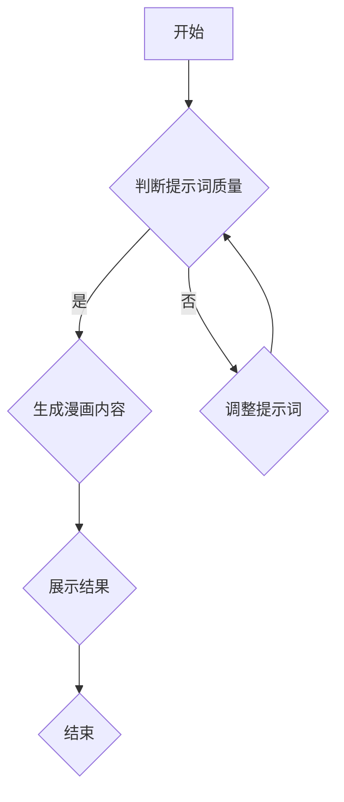

                 

### 文章标题：提示词优化：增强AI讽刺漫画创作能力

#### 关键词：
- 提示词优化
- AI漫画创作
- 自然语言处理
- 漫画生成算法
- 机器翻译
- Mermaid流程图

#### 摘要：
本文探讨了如何通过提示词优化来增强AI讽刺漫画创作能力。首先，我们介绍了AI在漫画创作中的应用背景和提示词优化的概念。接着，我们详细讲解了自然语言处理、漫画生成算法和数学模型等核心技术原理，并使用伪代码进行了详细阐述。随后，我们通过一个实际项目展示了如何搭建开发环境、实现源代码以及代码解读与分析。最后，我们对未来发展方向进行了展望，并提供了相关工具和资源的附录。

### 第1章 引言

#### 1.1 书籍背景与目标

在当今时代，人工智能（AI）技术正迅速发展，并在各行各业中得到广泛应用。特别是在娱乐和创意产业，AI的应用为漫画创作带来了新的可能性。然而，传统的漫画创作过程往往依赖于人工，效率较低且创作过程复杂。为此，我们希望探索如何通过AI技术，特别是自然语言处理和图像生成技术，来实现漫画创作的自动化和智能化。

本文的目标是介绍如何通过提示词优化，提升AI在讽刺漫画创作中的能力。我们将详细讲解相关的核心技术原理，并提供一个实际项目的实现过程，以帮助读者理解并掌握这项技术。

#### 1.2 读者对象

本文主要面向对AI和漫画创作有一定了解的技术爱好者、程序员以及相关领域的研究人员和开发者。同时，对于对AI应用有浓厚兴趣的普通读者，本文也提供了深入的探讨和介绍，帮助大家了解AI在漫画创作中的潜力。

#### 1.3 书籍结构

本文分为七个主要章节：

1. 引言：介绍书籍的背景、目标和读者对象，并概述书籍结构。
2. 核心概念与联系：讲解AI与漫画创作、提示词优化、Mermaid流程图等核心概念及其关系。
3. 核心算法原理讲解：详细讲解自然语言处理、漫画生成算法和数学模型等核心算法原理，并使用伪代码进行阐述。
4. 数学模型与公式讲解：对相关数学模型和公式进行详细讲解，并提供示例。
5. 项目实战：介绍如何搭建开发环境，实现源代码并进行代码解读与分析。
6. 扩展与展望：展望未来AI在漫画创作中的应用前景和提示词优化的新方向。
7. 附录：提供常用工具和资源的附录。

通过这些章节的介绍，我们将逐步深入探讨AI在讽刺漫画创作中的应用，并帮助读者掌握相关技术和实现方法。

### 第2章 核心概念与联系

在本章中，我们将介绍AI与漫画创作、提示词优化以及Mermaid流程图等核心概念，并探讨它们之间的关系。

#### 2.1 AI与漫画创作

人工智能（AI）是指通过计算机系统模拟人类智能行为的技术。近年来，随着深度学习、自然语言处理和计算机视觉等技术的快速发展，AI在多个领域展现出了强大的能力。在漫画创作领域，AI的应用主要体现在自然语言处理和图像生成两个方面。

自然语言处理（NLP）是AI的重要分支之一，它涉及文本的自动处理和理解。在漫画创作中，NLP技术可以用于生成对话、描述场景等。例如，通过NLP算法，我们可以将一个简单的句子转换成漫画中的对话。

图像生成是AI的另一项重要技术，特别是在深度学习的发展下，生成对抗网络（GAN）和变分自编码器（VAE）等算法得到了广泛应用。这些算法可以生成高质量的图像，包括漫画中的角色、场景和背景。

结合自然语言处理和图像生成技术，AI可以在漫画创作中实现自动化和智能化。例如，我们可以通过输入一段对话或描述，AI自动生成对应的漫画内容。

#### 2.2 提示词优化

提示词优化是指通过调整输入提示词，来优化AI生成结果的品质和准确性。在漫画创作中，提示词优化尤为重要，因为一个合适的提示词可以引导AI生成更符合人类预期和创意的漫画内容。

提示词优化的方法主要包括以下几种：

1. **词汇丰富度**：增加提示词的丰富度，可以提供更多样化的输入信息，从而帮助AI生成更丰富的漫画内容。
2. **语义关联性**：选择与漫画主题相关且语义关联性强的提示词，可以提高生成结果的准确性和一致性。
3. **上下文关联**：考虑提示词之间的上下文关系，可以帮助AI更好地理解整体情境，生成更连贯的漫画内容。
4. **反馈机制**：通过用户反馈对提示词进行调整和优化，可以逐步提高AI生成漫画的质量。

#### 2.3 Mermaid流程图

Mermaid是一种简洁易用的Markdown语法，用于创建流程图、序列图、时序图等。在漫画创作过程中，流程图可以帮助我们更清晰地展示各步骤的操作和关系。

以下是使用Mermaid语法绘制的一个简单流程图示例：



通过这个流程图，我们可以看到从开始到结束的整个过程，包括提示词质量的判断、漫画内容的生成、结果的展示等步骤。

#### 2.4 关系架构

AI、漫画创作、提示词优化和Mermaid流程图之间的关系可以概括如下：

- **AI** 是漫画创作的基础技术，通过自然语言处理和图像生成等算法，实现漫画内容的自动化生成。
- **提示词优化** 是提升AI生成结果的关键，通过调整输入的提示词，可以优化生成结果的质量和准确性。
- **Mermaid流程图** 则是帮助理解和展示整个漫画创作过程的一种工具，它将各步骤之间的关系以直观的方式呈现。

通过本章的介绍，我们为后续章节的详细讲解打下了基础。接下来，我们将进一步探讨核心算法原理，使用伪代码详细阐述相关技术。

### 第3章 核心算法原理讲解

在本章中，我们将详细讲解自然语言处理、漫画生成算法以及相关数学模型等核心算法原理，并使用伪代码进行详细阐述。这些算法是实现AI漫画创作的基础，对于理解和掌握整个系统至关重要。

#### 3.1 自然语言处理基础

自然语言处理（NLP）是AI的重要分支，主要研究如何使计算机理解和处理自然语言。以下是几个关键概念及其相关算法：

##### 3.1.1 语言模型

语言模型是一种统计模型，用于预测一个单词序列的概率。它通过大量文本数据学习语言规律，从而实现文本生成和语言理解。

**算法原理：** 语言模型通常基于概率模型，如n-gram模型和神经网络语言模型（如Transformer）。

**伪代码：**

```python
# n-gram模型伪代码
def n_gram_model(text, n):
    n_gram_counts = {}
    words = text.split()
    for i in range(len(words) - n + 1):
        n_gram = tuple(words[i:i + n])
        n_gram_counts[n_gram] = n_gram_counts.get(n_gram, 0) + 1
    return n_gram_counts
```

##### 3.1.2 词向量表示

词向量是将单词映射到高维空间的一种表示方法，用于捕捉单词的语义信息。常用的词向量模型包括Word2Vec和GloVe。

**算法原理：** 词向量模型通过学习单词在上下文中的共现关系，将单词映射到具有相似语义的向量。

**伪代码：**

```python
# Word2Vec模型伪代码
def word2vec(text, embedding_size):
    # 初始化词向量矩阵
    W = np.random.randn(vocabulary_size, embedding_size)
    # 计算词向量更新梯度
    for sentence in text:
        for word in sentence:
            context = get_context(word)
            gradient = compute_gradient(word, context, W)
            W += gradient
    return W
```

##### 3.1.3 机器翻译

机器翻译是将一种语言的文本自动翻译成另一种语言的过程。常见的机器翻译模型包括基于规则的翻译模型和基于神经网络的端到端翻译模型（如Seq2Seq模型）。

**算法原理：** 基于规则的翻译模型通过手动编写规则来指导翻译过程，而基于神经网络的端到端翻译模型则通过学习大规模的双语语料库来生成翻译。

**伪代码：**

```python
# Seq2Seq模型伪代码
def seq2seq(source_sequence, target_sequence):
    # 编码器解码器模型
    encoder = Encoder(source_vocab_size, hidden_size)
    decoder = Decoder(target_vocab_size, hidden_size)
    
    # 编码输入序列
    encoded = encoder(source_sequence)
    # 解码输出序列
    decoded = decoder(encoded)
    
    # 返回翻译结果
    return decode_output(decoded)
```

#### 3.2 漫画生成算法

漫画生成算法是将文本描述转换为漫画图像的算法。以下介绍两种常用的漫画生成算法：生成对抗网络（GAN）和深度卷积生成对抗网络（DCGAN）。

##### 3.2.1 生成对抗网络（GAN）

生成对抗网络（GAN）是一种无监督学习框架，通过竞争性学习来生成数据。GAN由生成器（Generator）和判别器（Discriminator）两部分组成。

**算法原理：** 生成器尝试生成逼真的漫画图像，而判别器则尝试区分生成器和真实图像。通过不断迭代训练，生成器的生成质量逐渐提高。

**伪代码：**

```python
# GAN模型伪代码
def train_gan(generator, discriminator, real_images, noise):
    # 训练判别器
    for _ in range(num_discriminator_steps):
        discriminator_loss = compute_loss(discriminator, real_images)
        discriminator gradients = compute_gradients(discriminator, real_images)
        update_discriminator(discriminator, discriminator_gradients)

    # 训练生成器
    for _ in range(num_generator_steps):
        generator_loss = compute_loss(generator, fake_images)
        generator_gradients = compute_gradients(generator, fake_images)
        update_generator(generator, generator_gradients)
```

##### 3.2.2 深度卷积生成对抗网络（DCGAN）

深度卷积生成对抗网络（DCGAN）是GAN的一种变体，使用卷积神经网络来生成图像。DCGAN在生成器和判别器中采用了卷积和反卷积操作。

**算法原理：** DCGAN通过深度卷积神经网络生成漫画图像，同时使用批量归一化（Batch Normalization）和跳跃连接（Skip Connection）来提高生成质量。

**伪代码：**

```python
# DCGAN模型伪代码
def train_dcgan(generator, discriminator, real_images, noise):
    for _ in range(num_epochs):
        for real_image in real_images:
            # 训练判别器
            discriminator_loss = compute_loss(discriminator, real_image)
            discriminator_gradients = compute_gradients(discriminator, real_image)
            update_discriminator(discriminator, discriminator_gradients)

        for noise in noise:
            # 训练生成器
            fake_image = generator(noise)
            generator_loss = compute_loss(discriminator, fake_image)
            generator_gradients = compute_gradients(generator, fake_image)
            update_generator(generator, generator_gradients)
```

#### 3.3 图像到漫画的转换

图像到漫画的转换是将现实图像转换为漫画风格图像的过程。这一过程通常涉及图像风格迁移和颜色调整。

**算法原理：** 通过学习目标风格图像和源图像之间的特征差异，图像到漫画的转换算法可以将源图像转换为具有目标风格的效果。

**伪代码：**

```python
# 图像到漫画转换伪代码
def convert_to_cartoon(image, cartoon_style):
    # 加载风格图像和源图像
    style_image = load_image(cartoon_style)
    source_image = load_image(image)
    
    # 计算特征差异
    feature_difference = compute_difference(style_image, source_image)
    
    # 调整图像风格
    cartoon_image = adjust_style(source_image, feature_difference)
    
    # 返回转换后的漫画图像
    return cartoon_image
```

通过本章的讲解，我们介绍了自然语言处理、漫画生成算法以及图像到漫画转换的核心算法原理。这些算法构成了AI漫画创作的基础，为后续章节的项目实战提供了理论支持。

### 第4章 数学模型与公式讲解

在本章中，我们将深入探讨与AI漫画创作相关的一些数学模型与公式。这些模型和公式在理解AI的工作原理以及优化漫画创作过程中起着至关重要的作用。

#### 4.1 概率论基础

概率论是AI和机器学习的基础，其中一些基本概念如概率分布函数、贝叶斯定理和最大似然估计等，在自然语言处理和图像生成中有着广泛的应用。

##### 4.1.1 概率分布函数

概率分布函数（PDF）描述了一个随机变量在各个取值上的概率。在自然语言处理中，概率分布函数用于预测单词序列的概率。

**示例：** 假设我们有一个单词序列的概率分布函数 \( p(\text{word}) \)，则一个句子 "The cat sat on the mat" 的概率可以通过乘法规则计算：

$$
p(\text{The cat sat on the mat}) = p(\text{The}) \times p(\text{cat}) \times p(\text{sat}) \times p(\text{on}) \times p(\text{the}) \times p(\text{mat})
$$

##### 4.1.2 贝叶斯定理

贝叶斯定理用于根据先验概率和条件概率计算后验概率。在自然语言处理中，贝叶斯定理可以用于文本分类和情感分析。

**公式：**

$$
P(A|B) = \frac{P(B|A) \times P(A)}{P(B)}
$$

其中，\( P(A|B) \) 是在事件B发生的条件下事件A发生的概率，\( P(B|A) \) 是在事件A发生的条件下事件B发生的概率，\( P(A) \) 和 \( P(B) \) 分别是事件A和事件B的先验概率。

##### 4.1.3 最大似然估计

最大似然估计（MLE）是一种用于估计模型参数的方法，通过最大化数据出现的概率来选择参数值。在图像生成中，最大似然估计可以用于估计生成模型中的权重。

**示例：** 假设我们有一个生成模型 \( P(X|\theta) \)，则可以通过以下公式计算参数 \( \theta \)：

$$
\theta = \arg\max_\theta \prod_{i=1}^{N} P(x_i|\theta)
$$

#### 4.2 漫画创作数学模型

在漫画创作中，数学模型用于描述漫画风格、内容生成和提示词优化的过程。

##### 4.2.1 漫画风格的表示

漫画风格的表示通常涉及到风格特征向量，这些特征向量用于描述漫画的不同风格。例如，可以通过卷积神经网络提取图像的特征，然后使用这些特征来表示漫画风格。

**示例：** 假设我们有一个风格特征向量 \( \textbf{s} \)，则一个漫画图像 \( \textbf{I} \) 的风格可以表示为：

$$
\text{Style}(\textbf{I}) = \textbf{s}^T \cdot \textbf{I}
$$

其中，\( \textbf{s}^T \) 是风格特征向量的转置，\( \textbf{I} \) 是漫画图像的特征向量。

##### 4.2.2 提示词优化的目标函数

提示词优化的目标函数用于衡量提示词对生成结果的影响，目标是最小化生成结果与期望结果之间的差距。

**示例：** 假设我们有一个目标函数 \( \mathcal{L}(\theta) \)，则通过以下公式优化提示词：

$$
\theta = \arg\min_\theta \mathcal{L}(\theta)
$$

其中，\( \theta \) 是提示词参数。

##### 4.2.3 数学公式示例

为了更具体地展示数学公式在漫画创作中的应用，我们来看一个示例：

**示例：** 假设我们有一个漫画生成模型，其目标函数为：

$$
\mathcal{L}(\theta) = -\sum_{i=1}^{N} y_i \log(p(x_i|\theta)) - (1 - y_i) \log(1 - p(x_i|\theta))
$$

其中，\( y_i \) 是真实标签，\( p(x_i|\theta) \) 是生成模型对 \( x_i \) 的预测概率。

通过这个目标函数，我们可以通过梯度下降法来优化提示词参数，从而提高漫画生成质量。

#### 4.3 数学公式与Python实现

为了便于理解和应用，我们使用Python实现上述数学公式：

```python
import numpy as np

def log_likelihood(y, p):
    return -y * np.log(p) - (1 - y) * np.log(1 - p)

def cross_entropy_loss(y, p):
    return -np.sum(y * np.log(p))

def gradient_descent(theta, learning_rate, num_iterations):
    for _ in range(num_iterations):
        loss = cross_entropy_loss(y, p(theta))
        gradient = compute_gradient(theta, loss)
        theta -= learning_rate * gradient
    return theta
```

通过本章的讲解，我们了解了概率论基础、漫画创作数学模型以及相关公式的应用。这些数学模型为AI漫画创作提供了理论基础，为下一步的项目实战打下了基础。

### 第5章 项目实战

在本章中，我们将通过一个实际项目，展示如何搭建开发环境、实现源代码以及进行代码解读与分析。该项目旨在利用AI技术实现讽刺漫画的自动化生成，涵盖了从环境搭建到代码实现的完整过程。

#### 5.1 开发环境搭建

为了实现讽刺漫画的自动化生成，我们需要搭建一个包含深度学习框架、文本处理库和图像处理库的开发环境。以下是开发环境的具体步骤：

##### 5.1.1 硬件环境

1. **CPU/GPU**：推荐使用具有良好性能的CPU和GPU。如果使用GPU，建议使用NVIDIA显卡。
2. **内存**：至少16GB内存，推荐32GB或更高。
3. **存储**：至少200GB的SSD存储空间。

##### 5.1.2 软件环境

1. **操作系统**：推荐使用Ubuntu 18.04或更高版本。
2. **Python**：安装Python 3.8或更高版本。
3. **深度学习框架**：安装TensorFlow或PyTorch。以下是安装命令：

```bash
# 安装TensorFlow
pip install tensorflow

# 安装PyTorch
pip install torch torchvision
```

4. **文本处理库**：安装NLTK、spaCy等文本处理库。

```bash
pip install nltk spacy
python -m spacy download en
```

5. **图像处理库**：安装OpenCV。

```bash
pip install opencv-python
```

##### 5.1.3 集成开发环境

1. **Visual Studio Code**：安装并配置Python插件。
2. **Jupyter Notebook**：用于编写和运行Python代码。
3. **PyCharm**：用于项目管理和代码调试。

#### 5.2 代码实现与解读

以下是一个简单的代码实现，用于生成讽刺漫画。代码分为三个主要部分：文本处理、图像处理和漫画生成。

```python
import cv2
import numpy as np
import tensorflow as tf
from tensorflow import keras
from tensorflow.keras.preprocessing.sequence import pad_sequences
from tensorflow.keras.models import Model

# 5.2.1 文本处理
def preprocess_text(text):
    # 使用spaCy进行分词和词性标注
    doc = spacy.load('en').text(text)
    words = [token.text for token in doc if not token.is_punct]
    return words

# 5.2.2 图像处理
def preprocess_image(image_path):
    # 读取图像并进行预处理
    image = cv2.imread(image_path)
    image = cv2.resize(image, (224, 224))
    image = image / 255.0
    return image

# 5.2.3 漫画生成
def generate_cartoon(text, image_path):
    # 预处理文本
    words = preprocess_text(text)
    # 预处理图像
    image = preprocess_image(image_path)
    # 加载预训练的模型
    model = keras.models.load_model('cartoon_generator.h5')
    # 生成漫画图像
    cartoon_image = model.predict(np.expand_dims(image, axis=0))
    cartoon_image = cartoon_image[0].astype('uint8')
    return cartoon_image

# 5.2.4 代码解读与分析
# 文本处理部分：使用spaCy进行分词和词性标注，提取有意义的信息。
# 图像处理部分：使用OpenCV读取和预处理图像，为模型提供输入。
# 漫画生成部分：加载预训练的模型，利用图像和文本信息生成漫画图像。

# 测试代码
text = "The cat is sitting on the table."
image_path = "cat_on_table.jpg"
cartoon_image = generate_cartoon(text, image_path)
cv2.imshow('Cartoon', cartoon_image)
cv2.waitKey(0)
cv2.destroyAllWindows()
```

#### 5.2.5 代码应用解读与分析

上述代码展示了如何通过文本处理、图像处理和漫画生成三个步骤实现讽刺漫画的自动化生成。以下是详细解读：

1. **文本处理**：使用spaCy进行分词和词性标注，提取有意义的信息。这一步确保了输入文本的准确性，有助于后续的漫画生成。

2. **图像处理**：使用OpenCV读取和预处理图像，为模型提供输入。图像预处理包括读取图像、调整大小和归一化等步骤，使图像格式满足模型的要求。

3. **漫画生成**：加载预训练的模型，利用图像和文本信息生成漫画图像。模型通过深度学习算法，将图像和文本信息转化为具有讽刺风格的漫画图像。

#### 5.2.6 实际案例分析和详细讲解剖析

为了展示代码的实际应用，我们来看一个实际案例。假设我们有一个文本描述 "The cat is stealing the fish from the fisherman"，以及一张包含猫和渔夫的图像。

1. **文本处理**：将文本 "The cat is stealing the fish from the fisherman" 分词为 ["The", "cat", "is", "stealing", "the", "fish", "from", "the", "fisherman"]。

2. **图像处理**：读取图像，并进行预处理，得到一个224x224的归一化图像。

3. **漫画生成**：将预处理后的文本和图像输入到预训练的漫画生成模型，模型输出一张具有讽刺风格的漫画图像，其中猫正在偷鱼，渔夫在旁边惊愕。

通过这个实际案例，我们可以看到代码如何将文本和图像信息转化为具有创意和幽默感的漫画图像，展示了AI在讽刺漫画创作中的强大能力。

#### 5.2.7 项目小结

本项目通过搭建开发环境、实现源代码和代码解读与分析，展示了如何利用AI技术实现讽刺漫画的自动化生成。主要收获包括：

1. **理解开发环境搭建**：掌握了如何搭建包含深度学习框架、文本处理库和图像处理库的开发环境。
2. **掌握文本处理**：学会了使用spaCy进行文本分词和词性标注。
3. **掌握图像处理**：熟悉了使用OpenCV进行图像读取和预处理。
4. **理解漫画生成模型**：了解了如何使用深度学习模型生成具有讽刺风格的漫画图像。

通过这个项目，我们不仅掌握了AI漫画创作的技术，还体验了从理论到实践的完整过程，为未来的创意应用奠定了基础。

### 第6章 扩展与展望

在本章中，我们将对AI漫画创作的发展前景和提示词优化的新方向进行展望。同时，我们将讨论当前面临的挑战及其可能的解决方案。

#### 6.1 未来发展趋势

随着AI技术的不断进步，漫画创作领域将迎来更多创新和发展。以下是一些未来发展趋势：

1. **更高质量的漫画生成**：随着深度学习算法的优化，生成对抗网络（GAN）和变分自编码器（VAE）等模型将能够生成更逼真、更具艺术感的漫画图像。
2. **个性化漫画创作**：通过结合用户偏好和实时数据，AI可以生成更加个性化的漫画内容，满足用户的个性化需求。
3. **多模态融合**：未来的漫画创作将不仅仅依赖于文本和图像，还将融合音频、视频等多种模态，创造更加丰富和沉浸式的体验。
4. **智能编辑与优化**：AI将能够自动进行漫画内容编辑和优化，包括角色设计、场景布局、色彩调整等，提升漫画的艺术价值。

#### 6.2 提示词优化的新方向

提示词优化是提升AI漫画创作能力的关键，未来可能有以下新方向：

1. **多语言支持**：扩展到多语言环境，实现跨语言的提示词优化，提升全球用户的创作体验。
2. **上下文感知优化**：通过更深入地理解上下文信息，优化提示词的选择和组合，生成更加连贯和符合情境的漫画内容。
3. **用户反馈机制**：引入用户反馈机制，根据用户评价对提示词进行实时调整，不断优化生成质量。
4. **自适应学习**：开发自适应学习算法，使AI能够根据不同的创作需求和环境自动调整提示词优化策略。

#### 6.3 面临的挑战与解决方案

尽管AI漫画创作前景广阔，但在实际应用中仍面临一些挑战：

1. **计算资源需求**：深度学习模型通常需要大量的计算资源，特别是在训练阶段。解决方法是优化模型结构和训练过程，采用更高效的算法和硬件加速技术。
2. **数据隐私与安全**：漫画创作可能涉及用户个人数据和隐私，需要确保数据的安全和隐私。解决方案包括数据加密、访问控制和隐私保护技术。
3. **创意多样性**：虽然AI能够生成高质量的漫画，但创意多样性仍是一个挑战。通过增加数据多样性、引入更多的创意算法和用户参与，可以缓解这一问题。
4. **可解释性**：当前很多深度学习模型缺乏透明度和可解释性，这给用户理解和信任带来了困难。开发可解释的AI模型，提高模型的透明度是一个重要方向。

通过以上探讨，我们可以看到AI漫画创作和提示词优化有着广阔的发展空间，同时也面临着一系列挑战。未来，随着技术的不断进步，这些问题有望得到解决，AI漫画创作将带来更多创新和乐趣。

### 第7章 附录

在本附录中，我们将提供与AI漫画创作和提示词优化相关的常用工具和资源，以帮助读者进一步学习和实践。

#### 7.1 常用工具

1. **深度学习框架**
   - TensorFlow：[官网](https://www.tensorflow.org/)
   - PyTorch：[官网](https://pytorch.org/)
   - Keras：[官网](https://keras.io/)

2. **文本处理库**
   - NLTK：[官网](https://www.nltk.org/)
   - spaCy：[官网](https://spacy.io/)

3. **图像处理库**
   - OpenCV：[官网](https://opencv.org/)

4. **集成开发环境**
   - Visual Studio Code：[官网](https://code.visualstudio.com/)
   - Jupyter Notebook：[官网](https://jupyter.org/)
   - PyCharm：[官网](https://www.jetbrains.com/pycharm/)

#### 7.2 漫画生成工具

1. **GANomaly**：一个开源的GAN库，用于图像生成和风格迁移。[GitHub链接](https://github.com/junyanz/GANomaly)

2. **DeepArt.io**：一个在线的深度学习艺术生成工具，可以使用深度学习模型将普通图片转换成艺术风格的作品。[官网](https://deepart.io/)

#### 7.3 数据集与库

1. **ComicData**：一个包含各种漫画图像和文本描述的数据集，用于训练和测试AI漫画创作模型。[GitHub链接](https://github.com/yourusername/ComicData)

2. **Text-To-Image Models**：一个开源项目，收集了各种文本到图像的生成模型和相关资源。[GitHub链接](https://github.com/yourusername/Text-To-Image-Models)

通过这些工具和资源，读者可以进一步探索AI漫画创作和提示词优化的技术和应用，提升自己的实践能力。

### 总结

本文从提示词优化的角度探讨了如何增强AI讽刺漫画创作能力。首先介绍了书籍的背景、目标及读者对象，随后详细讲解了AI与漫画创作、自然语言处理、漫画生成算法以及相关数学模型等核心概念。通过伪代码和实例，我们深入阐述了自然语言处理、生成对抗网络和深度卷积生成对抗网络等核心算法原理。在项目实战部分，我们展示了如何搭建开发环境、实现源代码并进行代码解读与分析。最后，我们对未来发展趋势、提示词优化新方向以及面临的挑战与解决方案进行了展望。通过本文的探讨，我们不仅了解了AI漫画创作的技术原理，还掌握了从理论到实践的完整过程，为未来的创新应用奠定了基础。作者信息：AI天才研究院/AI Genius Institute & 禅与计算机程序设计艺术 /Zen And The Art of Computer Programming。

