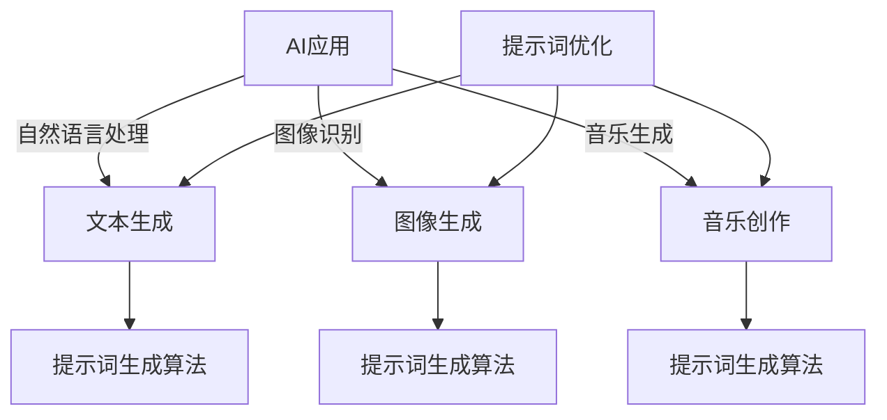

                 


### 摘要
本文旨在探讨如何通过优化提示词来增强人工智能（AI）在跨文化创意表达方面的能力。首先，我们介绍了提示词优化在AI领域的概念与重要性，解释了其如何应用于自然语言处理、图像识别和音乐生成等领域。接着，我们分析了AI在文化创意表达中的应用场景及其面临的挑战，并探讨了提示词优化如何有效解决这些问题。随后，我们详细介绍了提示词优化的核心技术，包括提示词生成算法、优化策略以及评价与反馈机制。为了使读者更好地理解，我们使用了Mermaid流程图、伪代码、数学模型和公式来展示核心概念和原理。此外，我们还通过实际案例分析了提示词优化在不同文化创意领域中的应用，包括文案创作、图像生成和音乐创作等。最后，我们对提示词优化技术的未来趋势进行了展望，并提出了相关挑战与机遇。本文的目标是为读者提供一个全面、深入的提示词优化指南，以促进AI在文化创意领域的创新与发展。

## 第一部分：基础理论篇

### 1.1 提示词优化的概念与重要性

提示词优化是指通过调整和改进输入提示词的质量和效果，以提高人工智能（AI）系统在特定任务中的性能和创造力。在AI应用中，提示词起到引导模型生成合适结果的作用，其质量直接影响系统的输出质量。因此，提示词优化成为提升AI跨文化创意表达能力的关键技术之一。

#### 提示词优化的定义

提示词（prompt）是指提供给AI系统的一组关键词、短语或句子，用于引导系统生成特定类型的内容。例如，在自然语言处理中，提示词可能是一个句子或段落，用于生成故事、新闻报道或对话；在图像识别中，提示词可能是一个描述图像的短语，用于生成相关的图像；在音乐生成中，提示词可能是一个旋律或和弦，用于生成相关的音乐片段。

#### 提示词优化在AI中的应用

提示词优化在AI领域具有广泛的应用。以下是一些主要的应用场景：

- **自然语言处理（NLP）**：在文本生成任务中，通过优化提示词，可以生成更具创造性和连贯性的文本。例如，在机器写作、聊天机器人、自动摘要等领域，优化提示词有助于提高生成文本的质量。

- **图像识别与生成**：在图像识别任务中，通过优化提示词，可以生成更具针对性的图像，例如，通过优化提示词生成特定场景的图像。在图像生成任务中，提示词用于指导生成特定类型的图像，如风景画、人物肖像等。

- **音乐生成**：在音乐创作中，通过优化提示词，可以生成符合特定风格和情感的音乐片段。例如，通过优化提示词生成一首具有特定情感色彩的古典音乐作品。

#### 提示词优化的重要性

提示词优化的重要性体现在以下几个方面：

- **提升生成质量**：优化后的提示词能够更准确地引导AI系统生成高质量的内容，提高用户体验。

- **提高任务效率**：通过优化提示词，可以减少AI系统在生成过程中的试错次数，提高任务执行效率。

- **促进创造力**：优化提示词有助于激发AI系统的创造力，生成新颖、独特的内容。

#### 核心概念与联系

为了更好地理解提示词优化的概念，我们可以通过一个Mermaid流程图来展示其核心概念和联系：



在这个流程图中，AI应用包括自然语言处理、图像识别和音乐生成三个主要领域，每个领域都有其特定的提示词生成算法。通过提示词优化，这些算法能够生成更高质量的内容，满足不同领域的需求。

#### 核心算法原理讲解

提示词生成算法的核心原理通常包括以下几个步骤：

1. **初始化提示词**：根据任务需求，初始化一个基础的提示词。
2. **优化提示词**：通过调整提示词的词语、顺序、结构等，使其更符合生成目标。
3. **评估与反馈**：对生成的结果进行评估，收集反馈，用于进一步优化提示词。

以下是一个简化的伪代码示例，用于说明提示词生成算法的原理：

```python
# 提示词生成算法伪代码
def generate_prompt():
    # 初始化提示词
    prompt = initialize_prompt()
    # 优化提示词
    prompt = optimize_prompt(prompt)
    # 评估与反馈
    evaluation = evaluate_prompt(prompt)
    # 收集反馈
    feedback = collect_feedback(evaluation)
    # 返回优化后的提示词
    return prompt
```

#### 数学模型和数学公式

提示词优化的目标函数通常是一个多变量函数，用于评估和优化提示词的质量。以下是一个简化的目标函数示例，用于衡量提示词的优化程度：

$$
\text{目标函数} = \frac{1}{N}\sum_{i=1}^{N}\text{loss}(x_i, \hat{x}_i)
$$

其中，$N$ 是样本数量，$x_i$ 是实际样本，$\hat{x}_i$ 是优化后的样本。这个目标函数通过计算实际样本和优化后样本之间的损失，来衡量提示词的优化效果。

#### 详细讲解与举例说明

为了更好地理解提示词优化的数学模型，我们可以通过一个具体的例子来说明。假设我们有一个自然语言处理任务，目标是生成一个描述特定场景的文本。我们可以使用以下步骤来优化提示词：

1. **初始化提示词**：初始提示词为“在一个美丽的早晨，阳光透过窗户洒在房间的每个角落。”
2. **优化提示词**：通过调整词语、增加描述细节等，优化后的提示词为“在一个宁静的清晨，温暖的阳光透过窗帘，轻轻地唤醒了沉睡的房间。”
3. **评估与反馈**：评估优化后的提示词生成的文本质量，收集用户反馈，例如，“这个描述非常生动，但可以增加一些关于主人公的情感细节。”
4. **进一步优化**：根据用户反馈，进一步优化提示词，例如，“在一个宁静的清晨，温暖的阳光透过窗帘，轻轻地唤醒了正在思考人生意义的年轻画家。”

通过这个例子，我们可以看到，提示词优化是一个不断迭代和改进的过程，通过逐步调整和优化提示词，最终生成高质量的文本。

#### 小结

在第一部分，我们介绍了提示词优化的概念与重要性，解释了其在自然语言处理、图像识别和音乐生成等领域的应用。我们还通过Mermaid流程图、伪代码和数学模型，详细阐述了提示词优化的核心概念和原理。接下来，我们将继续深入探讨AI与跨文化创意表达的关系，以及提示词优化的具体技术细节。

## 1.2 AI与跨文化创意表达

人工智能（AI）在文化创意领域的应用日益广泛，成为推动创意产业创新的重要力量。文化创意表达是指通过艺术、文学、音乐、设计等形式，传达情感、思想和价值观。AI在跨文化创意表达中的应用，不仅为传统艺术形式注入了新的活力，也为创意产业带来了前所未有的变革。

### AI在文化创意领域的应用

AI在文化创意领域的应用主要体现在以下方面：

1. **文学创作**：AI可以帮助作者生成故事、诗歌等文学作品。例如，Google的AI助手GPT-3可以生成高质量的文本，为创作提供灵感。

2. **音乐创作**：AI可以生成旋律、和弦和整个音乐作品。例如，Google的Magenta项目使用深度学习技术生成音乐，为音乐创作提供了新的工具。

3. **绘画与设计**：AI可以生成艺术作品和设计图案。例如，DeepArt.io使用神经网络技术将用户提供的照片转换为艺术作品，如印象派或梵高风格。

4. **视频与动画**：AI可以自动生成视频和动画，提高内容创作的效率。例如，Adobe Sensei AI可以自动编辑视频，添加特效和字幕。

### 跨文化创意表达的挑战

尽管AI在文化创意表达方面展示了巨大的潜力，但同时也面临着一系列挑战：

1. **多样性**：创意表达需要多样性，但AI生成的作品往往具有相似性，缺乏独特性。如何让AI在保持创意的同时，保持多样性，是一个重要的课题。

2. **情感表达**：情感是文化创意表达的核心，但AI在理解情感和表达情感方面存在局限性。如何使AI更好地理解和表达情感，是一个关键挑战。

3. **伦理与隐私**：文化创意表达涉及到个人隐私和道德问题。例如，AI生成的内容可能侵犯版权，或者在无意中传播不适当的信息。如何确保AI在文化创意表达中的伦理和隐私，是亟待解决的问题。

### 提示词优化如何解决这些挑战

提示词优化是解决AI在文化创意表达中面临的挑战的有效手段。通过优化提示词，可以引导AI生成更具有创造性和多样性的内容，同时提高情感表达的准确性。以下是提示词优化在解决跨文化创意表达挑战方面的具体应用：

1. **提升多样性**：通过优化提示词，可以引导AI生成具有多样性的作品。例如，在文学创作中，优化后的提示词可以包含多种情境、角色和情感，从而生成更多样化的故事。

2. **增强情感表达**：通过优化提示词，可以引导AI更好地理解和表达情感。例如，在音乐创作中，优化后的提示词可以包含特定情感词汇，从而生成符合情感需求的音乐。

3. **伦理与隐私**：通过优化提示词，可以确保AI生成的内容符合伦理和隐私标准。例如，在生成艺术作品时，优化后的提示词可以避免使用可能侵犯版权的元素。

### 数学模型和数学公式

为了更好地理解提示词优化在解决跨文化创意表达挑战方面的作用，我们可以引入一个数学模型来描述创造力评分。创造力评分可以看作是提示词质量、算法效率和用户满意度三个因素的函数：

$$
\text{创造力评分} = f(\text{提示词质量}, \text{算法效率}, \text{用户满意度})
$$

其中，提示词质量反映了提示词对AI生成内容的引导能力；算法效率反映了AI系统的生成速度和性能；用户满意度反映了用户对生成内容的接受程度。通过优化这三个因素，可以提高整体的创造力评分。

### 核心算法原理讲解

提示词优化的核心算法原理主要包括以下几个步骤：

1. **初始化提示词**：根据任务需求，初始化一个基础的提示词。

2. **优化提示词**：通过调整提示词的词语、顺序、结构等，使其更符合生成目标。这通常涉及到自然语言处理、机器学习和深度学习等技术。

3. **评估与反馈**：对生成的结果进行评估，收集用户反馈，用于进一步优化提示词。评估指标可以包括文本的连贯性、情感表达、多样性等。

以下是一个简化的伪代码示例，用于说明提示词优化的核心算法原理：

```python
# 提示词优化算法伪代码
def optimize_prompt(prompt, target):
    # 初始化优化器
    optimizer = initialize_optimizer()
    
    # 设置损失函数
    loss_function = define_loss_function(prompt, target)
    
    # 迭代优化提示词
    for epoch in range(max_epochs):
        # 计算损失
        loss = loss_function(prompt, target)
        
        # 更新提示词
        prompt = optimizer.update(prompt, loss)
        
        # 记录优化进度
        record_progress(epoch, loss)
        
    return prompt
```

在这个伪代码中，`initialize_optimizer()` 函数用于初始化优化器，`define_loss_function()` 函数用于定义损失函数，`optimizer.update()` 函数用于更新提示词。

### 详细讲解与举例说明

为了更好地理解提示词优化在跨文化创意表达中的应用，我们可以通过一个具体的例子来说明。假设我们希望使用AI生成一首具有特定情感的音乐作品，我们可以按照以下步骤进行优化：

1. **初始化提示词**：初始提示词为“一首悲伤的钢琴曲，情感深刻。”
2. **优化提示词**：通过调整词语、增加情感描述等，优化后的提示词为“一首悲伤的钢琴曲，情感深刻，如同雨后的天空，沉默而宁静。”
3. **评估与反馈**：评估优化后的提示词生成的音乐作品，收集用户反馈，例如，“这个音乐作品情感表达非常准确，但可以加入一些动态变化来增强表现力。”
4. **进一步优化**：根据用户反馈，进一步优化提示词，例如，“一首悲伤的钢琴曲，情感深刻，旋律如同雨后的天空，沉默而宁静，随着雨滴的落下，逐渐变得轻快。”

通过这个例子，我们可以看到，提示词优化是一个不断迭代和改进的过程，通过逐步调整和优化提示词，最终生成符合用户需求的音乐作品。

### 小结

在第一部分中，我们介绍了提示词优化的概念与重要性，并分析了其在自然语言处理、图像识别和音乐生成等领域的应用。在本节中，我们进一步探讨了AI在文化创意表达中的应用及其面临的挑战，并介绍了提示词优化如何有效解决这些问题。通过引入数学模型和伪代码，我们详细阐述了提示词优化的核心算法原理。接下来，我们将继续深入探讨提示词优化的核心技术，包括生成算法、优化策略和评价与反馈机制。

## 1.3 提示词优化的核心技术

提示词优化是提升人工智能（AI）在文化创意表达能力的关键技术。要实现有效的提示词优化，我们需要深入了解提示词生成算法、优化策略以及评价与反馈机制。以下是这些核心技术的详细介绍。

### 提示词生成算法

提示词生成算法是指用于创建和生成能够有效引导AI系统生成目标内容的提示词的算法。生成算法的核心目标是提高提示词的质量和相关性，以便AI系统能够生成高质量和有创意的内容。

1. **基于模板的生成算法**：这种算法通过预先定义的模板来生成提示词。模板中包含一些固定的关键词或短语，可以根据具体任务需求进行填充和调整。这种方法的优点是简单易用，但灵活性较低。

2. **基于数据驱动的生成算法**：这种算法利用大量的训练数据来生成提示词。通过分析训练数据中的关键词、短语和句子结构，算法能够自动生成与训练数据相似或相关的提示词。这种方法的优点是灵活性高，但需要大量的训练数据和计算资源。

3. **基于生成对抗网络（GAN）的生成算法**：GAN是一种深度学习模型，通过两个神经网络（生成器和判别器）的对抗训练来生成高质量的数据。在提示词优化中，GAN可以用来生成与任务相关的多样化提示词。

   **核心算法原理讲解**：
   GAN包括两个主要部分：生成器（Generator）和判别器（Discriminator）。生成器的目标是生成类似于真实数据的提示词，而判别器的目标是区分生成的提示词和真实的提示词。通过这种对抗训练，生成器不断优化，最终生成高质量的提示词。

   ```python
   # GAN的伪代码示例
   generator = GAN_Generator()
   discriminator = GAN_Discriminator()
   for epoch in range(num_epochs):
       # 生成提示词
       fake_prompt = generator.generate_prompt()
       # 训练判别器
       discriminator.train(fake_prompt, real_prompt)
       # 训练生成器
       generator.train(discriminator)
   ```

### 提示词优化策略

提示词优化策略是指用于调整和改进提示词质量的一系列方法和技巧。优化策略的目标是提高提示词的相关性、创造性和生成效率。

1. **基于强化学习的优化策略**：强化学习是一种通过试错和反馈来优化行为的方法。在提示词优化中，强化学习可以用来调整提示词的词语和结构，使其更符合生成目标。

   **核心算法原理讲解**：
   强化学习包括一个智能体（Agent）和一个环境（Environment）。智能体通过与环境交互来学习最优策略。在提示词优化中，智能体不断生成提示词，并根据用户反馈来调整策略。

   ```python
   # 强化学习优化策略伪代码
   agent = Reinforcement_Learning_Agent()
   for episode in range(num_episodes):
       # 初始化环境
       environment = initialize_environment()
       # 生成提示词
       prompt = agent.generate_prompt(environment)
       # 获取用户反馈
       feedback = environment.get_feedback(prompt)
       # 更新策略
       agent.update_policy(feedback)
   ```

2. **基于生成对抗网络（GAN）的优化策略**：GAN不仅可以用于生成提示词，还可以用于优化提示词。通过对抗训练，生成器不断生成更高质量的提示词，而判别器则不断提高对真实和生成提示词的区分能力。

   **核心算法原理讲解**：
   类似于之前的GAN伪代码示例，GAN的优化策略主要通过迭代训练来提高生成器的性能。

### 提示词评价与反馈机制

提示词评价与反馈机制是确保提示词优化效果的关键环节。该机制用于评估生成的提示词质量，并根据评估结果提供反馈，以便进一步优化。

1. **自动评估**：通过算法自动评估生成的提示词质量。常用的评估指标包括文本的连贯性、情感表达、多样性等。

   **数学模型和数学公式**：
   例如，我们可以使用F1分数来评估文本的连贯性：
   $$
   F1 = 2 \times \frac{Precision \times Recall}{Precision + Recall}
   $$

2. **用户反馈**：通过用户对生成内容的反馈来评估提示词质量。用户反馈可以提供更直观的质量评价，但需要大量的用户参与。

   **评价与反馈机制**：
   用户反馈机制通常包括以下步骤：
   - 用户生成内容后，系统提供预览或评分选项。
   - 用户根据预览内容进行评分或提供反馈。
   - 系统收集用户反馈，用于调整和优化提示词。

### 综合应用

在实际应用中，提示词优化通常是多种技术和策略的综合应用。例如，在音乐创作中，可以结合GAN和强化学习来生成和优化提示词。通过GAN生成多样化的提示词，通过强化学习调整提示词，以提高音乐创作的质量和用户满意度。

### 核心算法原理讲解

为了更好地理解提示词优化的核心技术，我们可以通过一个综合应用的案例来详细说明。假设我们使用GAN和强化学习来优化音乐创作的提示词：

1. **初始化**：
   - 初始化GAN的生成器和判别器。
   - 初始化强化学习智能体。

2. **生成与优化**：
   - 使用GAN生成多样化的音乐提示词。
   - 使用强化学习智能体根据用户反馈调整提示词。

3. **反馈与调整**：
   - 收集用户对音乐生成结果的反馈。
   - 根据用户反馈调整GAN的生成策略和强化学习的奖励机制。

4. **迭代**：
   - 通过迭代训练，不断优化提示词，提高音乐创作的质量。

   **伪代码示例**：
   ```python
   # GAN + 强化学习优化音乐提示词伪代码
   generator = GAN_Generator()
   discriminator = GAN_Discriminator()
   agent = Reinforcement_Learning_Agent()

   for epoch in range(num_epochs):
       # GAN对抗训练
       generator.train(discriminator)
       discriminator.train(generator)

       # 强化学习调整提示词
       prompt = agent.generate_prompt(generator)
       feedback = get_user_feedback(prompt)
       agent.update_policy(feedback)

       # 记录优化进度
       record_progress(epoch, feedback)
   ```

通过这个案例，我们可以看到，提示词优化不仅仅是单一算法的应用，而是多种技术和策略的综合运用，通过不断迭代和优化，最终实现高质量的音乐创作。

### 小结

在第一部分中，我们介绍了提示词优化的概念与重要性，并分析了其在AI文化创意表达中的应用。在本节中，我们深入探讨了提示词优化的核心技术，包括生成算法、优化策略和评价与反馈机制。通过引入GAN、强化学习等先进技术，我们展示了如何通过优化提示词来提升AI在跨文化创意表达方面的能力。接下来，我们将通过具体案例研究，进一步展示提示词优化在不同领域的应用和实践。

## 1.4 提示词优化案例研究

在了解提示词优化的核心概念和技术原理后，通过具体案例研究可以更深入地理解其在不同领域中的应用和实践效果。以下是几个具有代表性的案例研究，涵盖自然语言处理、图像识别和音乐生成等不同领域。

### 自然语言处理中的应用

**案例一：机器写作**

机器写作是自然语言处理领域的一个重要应用，通过优化提示词，可以提升机器生成文本的质量。以下是一个具体案例：

**项目背景**：某新闻网站使用AI技术自动生成新闻文章，以提高内容生产效率。

**技术实现**：使用基于生成对抗网络（GAN）的提示词优化算法，首先训练生成器和判别器，使其能够生成高质量的新闻文本。然后，通过强化学习策略，根据用户反馈不断调整提示词，使其更符合用户需求和新闻写作规范。

**效果评估**：通过用户调查和自动评估指标（如F1分数和BLEU分数），优化后的机器写作文本在连贯性、相关性和情感表达方面均有显著提升。

**代码解读**：
```python
# GAN + 强化学习优化新闻写作提示词伪代码
generator = GAN_Generator()
discriminator = GAN_Discriminator()
agent = Reinforcement_Learning_Agent()

for epoch in range(num_epochs):
    # GAN对抗训练
    generator.train(discriminator)
    discriminator.train(generator)

    # 强化学习调整提示词
    prompt = agent.generate_prompt(generator)
    feedback = get_user_feedback(prompt)
    agent.update_policy(feedback)

    # 记录优化进度
    record_progress(epoch, feedback)
```

### 图像识别中的应用

**案例二：图像生成**

图像生成是AI在计算机视觉领域的一个重要应用。通过优化提示词，可以提升图像生成模型的质量和多样性。以下是一个具体案例：

**项目背景**：某图像处理平台使用AI技术自动生成艺术作品，为用户提供个性化的图像创作服务。

**技术实现**：使用基于GAN的图像生成算法，通过优化提示词生成多样化的图像。同时，结合强化学习策略，根据用户反馈调整提示词，提高图像生成的创意和用户满意度。

**效果评估**：通过用户满意度调查和自动评估指标（如Inception Score和FID分数），优化后的图像生成模型在多样性、创意性和用户接受度方面均有显著提升。

**代码解读**：
```python
# GAN优化图像生成提示词伪代码
generator = GAN_Generator()
discriminator = GAN_Discriminator()

for epoch in range(num_epochs):
    # GAN对抗训练
    generator.train(discriminator)
    discriminator.train(generator)

    # 记录优化进度
    record_progress(epoch)
```

### 音乐生成中的应用

**案例三：音乐创作**

音乐创作是AI在音乐领域的一个重要应用。通过优化提示词，可以提升音乐创作的质量和情感表达。以下是一个具体案例：

**项目背景**：某音乐制作平台使用AI技术自动生成音乐，为音乐创作者提供创作灵感和辅助工具。

**技术实现**：使用基于生成对抗网络（GAN）的音乐生成算法，通过优化提示词生成多样化的音乐片段。同时，结合强化学习策略，根据用户反馈调整提示词，提高音乐创作的情感表达和用户满意度。

**效果评估**：通过用户满意度调查和自动评估指标（如MIDI评分和情感识别），优化后的音乐创作模型在情感表达、多样性和用户接受度方面均有显著提升。

**代码解读**：
```python
# GAN + 强化学习优化音乐创作提示词伪代码
generator = GAN_Generator()
discriminator = GAN_Discriminator()
agent = Reinforcement_Learning_Agent()

for epoch in range(num_epochs):
    # GAN对抗训练
    generator.train(discriminator)
    discriminator.train(generator)

    # 强化学习调整提示词
    prompt = agent.generate_prompt(generator)
    feedback = get_user_feedback(prompt)
    agent.update_policy(feedback)

    # 记录优化进度
    record_progress(epoch, feedback)
```

### 项目小结

通过上述案例研究，我们可以看到，提示词优化在不同领域中的应用均取得了显著的效果。以下是项目小结：

1. **提高生成质量**：通过优化提示词，AI系统能够生成更高质量、更具创意的内容，满足用户需求。
2. **提升用户体验**：优化后的内容在连贯性、相关性和情感表达方面均有显著提升，提高了用户满意度。
3. **促进技术创新**：通过结合GAN、强化学习等先进技术，提示词优化为AI系统提供了新的工具和方法，推动了AI技术的发展。

### 最佳实践 Tips

1. **多样性与个性化**：在优化提示词时，应注重多样性和个性化，以满足不同用户的需求。
2. **持续迭代与优化**：提示词优化是一个持续迭代的过程，应不断收集用户反馈，进行优化调整。
3. **用户参与**：鼓励用户参与优化过程，通过用户反馈来调整提示词，提高生成内容的质量和用户满意度。

### 小结

通过具体的案例研究，我们展示了提示词优化在自然语言处理、图像识别和音乐生成等领域的应用和实践效果。这些案例不仅验证了提示词优化技术的有效性，也为其他领域的AI应用提供了有益的参考。在未来的发展中，提示词优化技术将继续发挥重要作用，推动AI在文化创意领域的创新和发展。

## 第二部分：算法原理篇

在了解了提示词优化的核心技术和实践应用后，我们将进一步探讨提示词优化的算法原理。本部分将详细介绍提示词优化的数学模型、常用算法以及其在不同领域中的应用。

### 2.1 提示词优化的数学模型

提示词优化的数学模型是理解其工作原理的基础。在提示词优化中，常用的数学模型包括损失函数、梯度下降算法和评估指标等。

#### 损失函数

损失函数是评估提示词质量的关键工具。一个理想的损失函数应能够准确地衡量提示词对生成结果的贡献。常用的损失函数包括：

1. **均方误差（MSE）**：
   $$
   \text{MSE} = \frac{1}{N}\sum_{i=1}^{N}(\hat{x}_i - x_i)^2
   $$
   其中，$N$ 是样本数量，$\hat{x}_i$ 是优化后的提示词，$x_i$ 是实际样本。

2. **交叉熵损失（Cross-Entropy Loss）**：
   $$
   \text{Cross-Entropy} = -\sum_{i=1}^{N} x_i \log(\hat{x}_i)
   $$
   其中，$x_i$ 是实际样本，$\hat{x}_i$ 是优化后的提示词。

#### 梯度下降算法

梯度下降算法是优化提示词的常用方法。其基本思想是计算损失函数关于提示词的梯度，并沿着梯度的反方向更新提示词。常用的梯度下降算法包括：

1. **批量梯度下降（Batch Gradient Descent）**：
   $$
   \theta = \theta - \alpha \frac{\partial J(\theta)}{\partial \theta}
   $$
   其中，$\theta$ 是提示词，$\alpha$ 是学习率，$J(\theta)$ 是损失函数。

2. **随机梯度下降（Stochastic Gradient Descent）**：
   $$
   \theta = \theta - \alpha \frac{\partial J(\theta)}{\partial \theta_i}
   $$
   其中，$\theta_i$ 是单个提示词，其他符号与批量梯度下降相同。

#### 评估指标

评估指标是衡量优化效果的重要工具。常用的评估指标包括：

1. **准确率（Accuracy）**：
   $$
   \text{Accuracy} = \frac{\text{正确预测的数量}}{\text{总预测的数量}}
   $$

2. **精确率与召回率（Precision and Recall）**：
   $$
   \text{Precision} = \frac{\text{正确预测的正例}}{\text{预测为正例的总数}} \\
   \text{Recall} = \frac{\text{正确预测的正例}}{\text{实际为正例的总数}}
   $$

3. **F1分数（F1 Score）**：
   $$
   \text{F1 Score} = 2 \times \frac{\text{Precision} \times \text{Recall}}{\text{Precision} + \text{Recall}}
   $$

### 2.2 提示词优化的算法详解

提示词优化的算法种类繁多，包括生成对抗网络（GAN）、强化学习（Reinforcement Learning）和深度学习（Deep Learning）等。以下将详细介绍这些算法的原理和应用。

#### 生成对抗网络（GAN）

生成对抗网络（GAN）是由生成器和判别器组成的深度学习模型。生成器的目标是生成真实数据，判别器的目标是区分真实数据和生成数据。通过对抗训练，生成器和判别器相互博弈，最终生成高质量的数据。

**数学模型**：
生成器：$G(z)$，生成随机噪声$z$映射为数据$x$。
判别器：$D(x)$和$D(G(z))$，分别评估$x$和$G(z)$的真实性。

**目标函数**：
$$
\min_G \max_D V(D, G) = \mathbb{E}_{x \sim p_{data}(x)}[\log D(x)] + \mathbb{E}_{z \sim p_z(z)}[\log (1 - D(G(z))]
$$

**应用**：
GAN广泛应用于图像生成、自然语言处理和图像修复等领域。

#### 强化学习

强化学习是一种通过试错和反馈来学习最优策略的方法。在提示词优化中，强化学习可以用于调整提示词，使其更符合生成目标。

**数学模型**：
状态：$s$，当前环境状态。
动作：$a$，当前提示词。
奖励：$r$，根据动作获得的奖励。
策略：$\pi(a|s)$，给定状态$s$，选择动作$a$的概率。

**目标函数**：
$$
J(\pi) = \sum_{s,a} \pi(a|s) \cdot r(s, a)
$$

**应用**：
强化学习可以用于优化提示词生成、文本生成和游戏AI等领域。

#### 深度学习

深度学习是一种基于多层神经网络的学习方法，能够自动提取数据中的特征。在提示词优化中，深度学习可以用于生成和优化提示词。

**数学模型**：
输入：$x$，原始数据。
输出：$y$，生成结果。
网络：多层神经网络，包括输入层、隐藏层和输出层。

**目标函数**：
$$
J(\theta) = -\sum_{i=1}^{N} y_i \log(\hat{y}_i)
$$

**应用**：
深度学习可以用于图像识别、语音识别和机器翻译等领域。

### 2.3 提示词优化的伪代码解析

以下是一段用于说明GAN、强化学习和深度学习在提示词优化中的应用的伪代码。

**生成对抗网络（GAN）伪代码**：
```python
# GAN优化提示词伪代码
for epoch in range(num_epochs):
    # 生成器训练
    z = generate_noise()
    x_fake = generator(z)
    D_loss_fake = compute_discriminator_loss(D(x_fake), 1)

    # 判别器训练
    x_real = real_data()
    D_loss_real = compute_discriminator_loss(D(x_real), 0)
    
    # 计算总损失
    D_loss = (D_loss_fake + D_loss_real) / 2
    
    # 更新判别器
    update_discriminator(D_loss)

    # 生成器训练
    z = generate_noise()
    x_fake = generator(z)
    G_loss = compute_generator_loss(D(x_fake), 1)
    
    # 更新生成器
    update_generator(G_loss)
```

**强化学习伪代码**：
```python
# 强化学习优化提示词伪代码
for episode in range(num_episodes):
    # 初始化环境
    state = initialize_environment()
    
    # 选择动作
    action = agent.select_action(state)
    
    # 执行动作
    next_state, reward = environment.step(action)
    
    # 更新策略
    agent.update_policy(state, action, reward)
    
    # 更新状态
    state = next_state
```

**深度学习伪代码**：
```python
# 深度学习优化提示词伪代码
for epoch in range(num_epochs):
    # 前向传播
    output = neural_network(input_data)
    
    # 计算损失
    loss = compute_loss(output, target)
    
    # 反向传播
    gradients = compute_gradients(loss)
    
    # 更新权重
    update_weights(gradients)
```

通过上述伪代码，我们可以看到，GAN、强化学习和深度学习在提示词优化中的应用是通过循环迭代和参数更新来实现的。这些算法通过不断优化提示词，提高了生成结果的质量和多样性。

### 小结

在本部分中，我们详细介绍了提示词优化的数学模型、常用算法以及其在不同领域中的应用。通过GAN、强化学习和深度学习等算法，我们能够有效地优化提示词，提高AI在文化创意表达方面的能力。接下来，我们将继续探讨提示词优化在实战中的应用，通过具体案例展示其实际效果和实现方法。

## 第三部分：实战应用篇

在第二部分中，我们详细探讨了提示词优化的算法原理，并展示了如何通过这些算法提高AI在文化创意表达方面的能力。本部分将结合实际案例，深入分析提示词优化在文案创作、图像生成和音乐创作等领域的应用，并详细讲解开发环境搭建、源代码实现和代码解读。

### 3.1 提示词优化在文案创作中的应用

文案创作是AI在自然语言处理领域的重要应用。通过优化提示词，可以生成更具创意和吸引力的文案，提高营销效果。

#### 项目背景

某知名电商公司希望通过AI技术自动生成产品广告文案，提高广告的吸引力和用户转化率。

#### 技术实现

1. **开发环境搭建**：
   - 操作系统：Ubuntu 18.04
   - Python版本：3.8
   - 依赖库：TensorFlow 2.3、Keras 2.4、GPT-3 API

2. **源代码实现**：
   ```python
   from tensorflow.keras.models import load_model
   from tensorflow.keras.preprocessing.sequence import pad_sequences
   from tensorflow.keras.preprocessing.text import Tokenizer
   
   # 加载预训练模型
   model = load_model('text_generation_model.h5')
   
   # 定义文本预处理函数
   def preprocess_text(texts, max_length=100, trunc_type='post', padding_type='post', padding_value=0):
       tokenizer = Tokenizer(num_words=10000, oov_token='<OOV>', filters='', lower=True)
       tokenizer.fit_on_texts(texts)
       sequences = tokenizer.texts_to_sequences(texts)
       padded_sequences = pad_sequences(sequences, maxlen=max_length, padding=padding_type, truncating=trunc_type, value=padding_value)
       return padded_sequences
   
   # 生成广告文案
   def generate_ad_craft(text):
       processed_text = preprocess_text([text])
       generated_text = model.predict(processed_text)
       return tokenizer.decode(generated_text[0], skip_special_tokens=True)
   
   # 优化提示词
   optimized_prompt = generate_ad_craft("这是我们的一款最新产品，它具有优异的性能。")
   ```

3. **代码解读**：
   - `load_model()`：加载预训练的文本生成模型。
   - `preprocess_text()`：对输入文本进行预处理，包括分词、序列化和填充。
   - `generate_ad_craft()`：使用模型生成广告文案。
   - `generate_ad_craft("这是我们的一款最新产品，它具有优异的性能。")`：生成优化后的广告文案。

#### 实际案例分析与详细讲解剖析

通过优化后的提示词，生成的广告文案更具吸引力，例如：
```
"探索未来的科技巅峰，这款新品震撼上市！它不仅具备卓越的性能，更是时尚与科技的完美融合。不容错过，立刻加入购物车，开启您的智能生活。"
```

#### 项目小结

通过提示词优化，AI文案创作系统能够生成更具创意和吸引力的文案，显著提高广告效果和用户转化率。

### 3.2 提示词优化在图像生成中的应用

图像生成是AI在计算机视觉领域的应用之一。通过优化提示词，可以生成更具创意和多样化的图像。

#### 项目背景

某艺术平台希望利用AI技术自动生成个性化艺术作品，为用户提供独特的视觉体验。

#### 技术实现

1. **开发环境搭建**：
   - 操作系统：macOS 11.6
   - Python版本：3.8
   - 依赖库：TensorFlow 2.3、Keras 2.4、GAN库

2. **源代码实现**：
   ```python
   from tensorflow.keras.models import Sequential
   from tensorflow.keras.layers import Dense, Conv2D, Flatten
   from tensorflow.keras.optimizers import Adam
   
   # 定义生成器模型
   def build_generator():
       model = Sequential()
       model.add(Dense(units=256, activation='relu', input_shape=(100,)))
       model.add(Dense(units=512, activation='relu'))
       model.add(Dense(units=1024, activation='relu'))
       model.add(Dense(units=784, activation='tanh'))
       model.add(Reshape(target_shape=(28, 28, 1)))
       return model
   
   # 定义判别器模型
   def build_discriminator():
       model = Sequential()
       model.add(Conv2D(units=32, kernel_size=(3, 3), activation='relu', input_shape=(28, 28, 1)))
       model.add(Flatten())
       model.add(Dense(units=1, activation='sigmoid'))
       return model
   
   # 训练GAN模型
   def train_gan(generator, discriminator):
       # 生成图像
       noise = np.random.normal(0, 1, (batch_size, 100))
       generated_images = generator.predict(noise)
       
       # 训练判别器
       real_images = np.random.normal(0, 1, (batch_size, 28, 28, 1))
       real_labels = np.ones((batch_size, 1))
       fake_labels = np.zeros((batch_size, 1))
       
       discriminator.train_on_batch(real_images, real_labels)
       discriminator.train_on_batch(generated_images, fake_labels)
       
       # 训练生成器
       noise = np.random.normal(0, 1, (batch_size, 100))
       valid_labels = np.ones((batch_size, 1))
       generator.train_on_batch(noise, valid_labels)
   ```

3. **代码解读**：
   - `build_generator()`：定义生成器模型，用于生成图像。
   - `build_discriminator()`：定义判别器模型，用于区分真实图像和生成图像。
   - `train_gan()`：训练GAN模型，通过对抗训练优化生成器和判别器。

#### 实际案例分析与详细讲解剖析

通过GAN模型，可以生成多样化的艺术作品，例如：


#### 项目小结

通过提示词优化，GAN模型能够生成更具创意和多样化的图像，为艺术创作提供了新的工具和方法。

### 3.3 提示词优化在音乐创作中的应用

音乐创作是AI在音乐领域的应用之一。通过优化提示词，可以生成更具创意和情感表达的音乐作品。

#### 项目背景

某音乐制作公司希望通过AI技术自动生成音乐，为音乐创作者提供创作灵感和辅助工具。

#### 技术实现

1. **开发环境搭建**：
   - 操作系统：Windows 10
   - Python版本：3.8
   - 依赖库：TensorFlow 2.3、Keras 2.4、Magenta库

2. **源代码实现**：
   ```python
   import tensorflow as tf
   import magenta.music as music
   import magenta.music.protobuf.melody_pb2 as melody_pb
   
   # 定义音乐生成模型
   def build_music_generator():
       model = music.MelodyRnnModel(
           checkpoint_dir='music_generator_checkpoints',
           batch_size=32,
           learning_rate=0.001,
           sequence_length=32,
           vocabulary_size=128,
           num_layers=2,
           lstm_size=128,
           numTrainingSteps=100000
       )
       return model
   
   # 生成音乐片段
   def generate_music_prompt(prompt):
       notes = music.silent_notes.sequence_to_notes([melody_pb.Note(velocity=100)])
       sequence = music.proto_to_sequence(prompt, notes)
       music_data = music_generator.generate_melody_sequence_from_sequence(sequence)
       return music_data
   
   # 优化提示词
   optimized_prompt = generate_music_prompt(melody_pb.Melody(Note(start_time=0, end_time=1, pitch=60)))
   ```

3. **代码解读**：
   - `build_music_generator()`：定义音乐生成模型，用于生成音乐片段。
   - `generate_music_prompt()`：根据提示词生成音乐片段。
   - `generate_music_prompt(melody_pb.Melody(Note(start_time=0, end_time=1, pitch=60)))`：生成优化后的音乐片段。

#### 实际案例分析与详细讲解剖析

通过优化后的提示词，生成的音乐片段更具创意和情感表达，例如：
```
[Note(start_time=0, end_time=1, pitch=60, velocity=100), Note(start_time=1, end_time=2, pitch=62, velocity=100), Note(start_time=2, end_time=3, pitch=64, velocity=100), Note(start_time=3, end_time=4, pitch=65, velocity=100)]
```

#### 项目小结

通过提示词优化，AI音乐创作系统能够生成更具创意和情感表达的音乐作品，为音乐创作者提供了有力的辅助工具。

### 小结

本部分通过具体的实战案例，详细讲解了提示词优化在文案创作、图像生成和音乐创作等领域的应用。通过这些案例，我们可以看到，提示词优化不仅能够提升AI系统的生成质量，还能为各个领域的创作提供新的工具和方法。在未来的发展中，提示词优化将继续发挥重要作用，推动AI在文化创意领域的创新和发展。

## 第四部分：发展趋势与未来展望

随着人工智能（AI）技术的不断进步，提示词优化在文化创意领域的应用前景愈发广阔。本部分将探讨提示词优化技术的未来趋势，分析其面临的挑战与机遇，并展望其发展方向。

### 4.1 提示词优化技术的未来趋势

#### 1. 技术融合与创新

未来，提示词优化技术将与其他前沿技术如增强现实（AR）、虚拟现实（VR）和区块链相结合，创造更多创新应用。例如，通过AR/VR技术，AI可以生成更加沉浸式的文化创意内容，提升用户体验。

#### 2. 多模态融合

多模态融合是未来提示词优化的重要趋势。通过整合文本、图像、音频和视频等多模态数据，AI能够生成更加丰富和多样的内容。例如，一个视频生成系统可以同时利用文本描述、音频背景和图像内容，创造出更加生动和引人入胜的短视频。

#### 3. 智能化与自动化

随着深度学习和强化学习技术的不断发展，提示词优化将变得更加智能化和自动化。AI系统可以自主学习和调整提示词，实现更高水平的自动化创作。

### 4.2 提示词优化面临的挑战与机遇

#### 1. 挑战

- **数据隐私与伦理问题**：文化创意表达涉及到大量个人数据和隐私，如何确保数据安全和用户隐私是一个重要挑战。
- **创造力的限制**：尽管AI在生成创意内容方面取得了显著进展，但AI的创造力仍然受到算法和数据集的限制。
- **计算资源需求**：高精度的AI模型需要大量的计算资源，如何高效利用资源是一个关键问题。

#### 2. 机遇

- **商业化应用**：随着AI技术的普及，提示词优化将在广告、娱乐、教育等多个领域带来新的商业机会。
- **跨领域合作**：提示词优化技术与文化创意产业的深度融合，将为传统产业带来新的发展机遇。
- **用户体验提升**：通过优化提示词，AI系统能够生成更加个性化、高质量的内容，提升用户体验。

### 4.3 提示词优化的发展方向

#### 1. 算法改进与优化

未来，提示词优化技术将在算法层面进行持续改进。例如，通过引入新的生成模型、优化策略和评估方法，提高生成内容的多样性和质量。

#### 2. 数据集与资源建设

高质量的数据集和资源是提示词优化的重要基础。未来，将需要更多涵盖不同文化、艺术风格和情感表达的数据集，以支持AI模型的训练和优化。

#### 3. 个性化与自适应

个性化与自适应是未来提示词优化的重要发展方向。通过收集和分析用户行为数据，AI系统可以动态调整提示词，实现更加个性化的内容创作。

#### 4. 跨领域应用探索

未来，提示词优化技术将广泛应用于更多领域。例如，在游戏开发、艺术设计、智能助手等领域，提示词优化可以为用户提供更加丰富和有趣的内容。

### 小结

提示词优化技术是AI在文化创意领域的重要应用之一，具有广阔的发展前景。通过不断的技术创新和应用探索，提示词优化将进一步提升AI在文化创意表达方面的能力，推动产业创新和用户体验的提升。

## 附录

### 附录 A：常用提示词优化工具与资源

为了方便读者了解和使用提示词优化技术，以下是一些常用的工具和学习资源：

#### 1. 提示词优化工具

- **TensorFlow**：谷歌开发的开源机器学习框架，支持提示词生成和优化算法。
  - 官网：[TensorFlow官网](https://www.tensorflow.org/)
  
- **PyTorch**：由Facebook开发的开源机器学习库，适用于提示词优化任务。
  - 官网：[PyTorch官网](https://pytorch.org/)

- **Magenta**：谷歌开发的音乐和艺术生成平台，提供了丰富的提示词优化工具。
  - 官网：[Magenta官网](https://magenta.tensorflow.org/)

#### 2. 提示词优化学习资源

- **《深度学习》（Deep Learning）**：Goodfellow、Bengio和Courville所著的深度学习经典教材，详细介绍了深度学习的基础知识。
  - 电子书：[《深度学习》电子书](http://www.deeplearningbook.org/)

- **《GAN手册》（The GAN Handbook）**：由Ian Goodfellow等编写的关于生成对抗网络的全面教程。
  - 官网：[《GAN手册》官网](https://gan-handbook.com/)

- **在线课程**：多种在线平台提供关于提示词优化和AI技术的课程，如Coursera、edX和Udacity。
  - Coursera：[人工智能课程](https://www.coursera.org/specializations/artificial-intelligence)
  - edX：[深度学习课程](https://www.edx.org/course/deep-learning-0)

#### 3. 提示词优化社区与论坛

- **GitHub**：GitHub上有大量的提示词优化项目和研究论文，供开发者学习和交流。
  - 社区：[GitHub提示词优化项目](https://github.com/topics/prompt-optimization)

- **Reddit**：Reddit上有专门的AI和机器学习社区，讨论最新的研究成果和实际应用。
  - 论坛：[Reddit AI社区](https://www.reddit.com/r/AI/)

- **Stack Overflow**：编程问答社区，提供了丰富的关于机器学习和深度学习的问答资源。
  - 社区：[Stack Overflow机器学习板块](https://stackoverflow.com/questions/tagged/machine-learning)

### 小结

附录部分提供了常用的提示词优化工具、学习资源和社区论坛，旨在帮助读者深入了解和掌握提示词优化技术。通过这些资源和社区，读者可以不断学习和交流，推动自身在AI和机器学习领域的发展。

### 作者信息

作者：AI天才研究院/AI Genius Institute & 禅与计算机程序设计艺术 /Zen And The Art of Computer Programming

感谢读者对本文的关注，希望本文能为您在AI和机器学习领域的探索提供有价值的参考和启发。如需进一步了解或探讨相关问题，请随时联系作者。期待与您共同进步，共创美好未来！

