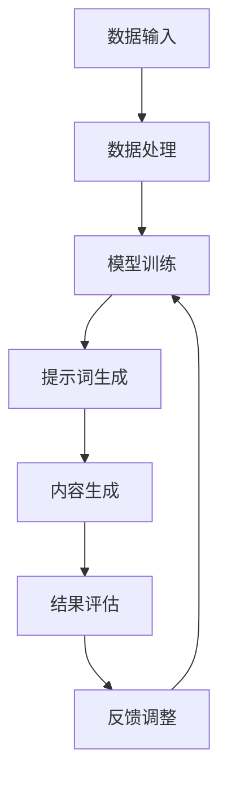

                 

### 文章标题：提示词优化：打造高效AIGC系统的秘诀

### 关键词：提示词优化、AIGC系统、高效、深度学习、自然语言处理、算法原理

### 摘要：
本文将深入探讨如何通过提示词优化来打造高效的人工智能生成内容（AIGC）系统。我们将从基础概念入手，逐步分析AIGC系统的构建架构和优化技术，并通过实际案例展示这些技术的应用。文章还将提供构建高效AIGC系统所需的主要工具和资源，以及未来的发展趋势和应用前景。

## 目录

1. **背景介绍**  
   1.1 AIGC系统的重要性  
   1.2 提示词优化在AIGC系统中的角色

2. **核心概念与联系**  
   2.1 AIGC系统的基本架构  
   2.2 提示词优化的基础概念  
   2.3 Mermaid流程图：AIGC系统与提示词优化的关系

3. **核心算法原理讲解**  
   3.1 深度学习基础  
   3.2 自然语言处理  
   3.3 伪代码与数学公式讲解

4. **项目实战**  
   4.1 开发环境搭建  
   4.2 源代码实现与代码解读  
   4.3 实际案例分析与讲解

5. **最佳实践与拓展阅读**  
   5.1 提示词优化的最佳实践  
   5.2 小结与注意事项

6. **结论**  
   6.1 AIGC系统应用前景  
   6.2 提示词优化的未来趋势

### 背景介绍

#### 1.1 AIGC系统的重要性

随着人工智能技术的飞速发展，生成式AI（Generative AI）已成为一项重要应用。人工智能生成内容（AIGC）系统利用深度学习、自然语言处理等技术，能够自动生成文本、图像、音频等多种形式的内容。这种系统能够极大地提升内容创作效率，降低人力成本，是当前和未来重要的技术趋势。

AIGC系统在多个领域具有广泛应用，如内容生成、广告营销、艺术创作、娱乐产业等。然而，为了确保AIGC系统能够高效运行，提示词优化成为一个关键环节。提示词是引导AIGC系统生成内容的关键输入，优化提示词能够显著提升生成内容的准确性和质量。

#### 1.2 提示词优化在AIGC系统中的角色

提示词优化在AIGC系统中的作用主要体现在以下几个方面：

1. **引导生成方向**：优化后的提示词能够更准确地引导AIGC系统生成所需的内容方向。
2. **提升生成质量**：通过优化提示词，可以减少生成内容中的噪声和偏差，提升内容的可读性、相关性和准确性。
3. **降低计算成本**：优化后的提示词能够减少模型的训练时间和计算资源消耗，提高系统运行效率。

在本文中，我们将详细探讨如何进行提示词优化，以及其在AIGC系统中的应用和效果。

## 核心概念与联系

#### 2.1 AIGC系统的基本架构

AIGC系统通常包括以下几个主要组成部分：

1. **数据输入**：包括文本、图像、音频等多种数据形式。
2. **数据处理**：对输入数据进行清洗、预处理和特征提取。
3. **模型训练**：利用深度学习、自然语言处理等技术训练生成模型。
4. **提示词生成与优化**：根据任务需求生成并优化提示词，引导模型生成目标内容。
5. **内容生成**：模型根据优化后的提示词生成文本、图像、音频等内容。
6. **结果评估与反馈**：对生成内容进行评估，并根据反馈调整模型参数和提示词。

#### 2.2 提示词优化的基础概念

提示词优化是指通过调整提示词的文本、语法、语义等方面，提高生成内容的质量和准确性。具体包括以下几个方面：

1. **文本调整**：通过修改词汇、句子结构和表达方式，使提示词更加准确、清晰和具有引导性。
2. **语法优化**：确保提示词的语法正确，避免语法错误和歧义。
3. **语义增强**：通过调整提示词的语义，提高生成内容的相关性和一致性。
4. **上下文关联**：考虑生成内容的上下文环境，使提示词与上下文关联更加紧密。

#### 2.3 Mermaid流程图：AIGC系统与提示词优化的关系

为了更好地展示AIGC系统与提示词优化的关系，我们可以使用Mermaid流程图来描述：



这个流程图展示了AIGC系统从数据输入到内容生成的整体流程，以及提示词优化在整个流程中的关键作用。提示词优化的效果会直接影响到生成内容的质量，进而影响结果评估和反馈环节。

## 核心算法原理讲解

#### 3.1 深度学习基础

深度学习是提示词优化的重要组成部分，以下是深度学习的基本原理：

1. **神经网络基础**：
   - **神经网络结构**：神经网络由多个层组成，包括输入层、隐藏层和输出层。
   - **前向传播与反向传播算法**：通过前向传播计算输出，反向传播计算梯度，用于模型训练。
   - **激活函数**：用于引入非线性特性，常见的激活函数包括ReLU、Sigmoid和Tanh。

2. **深度学习模型的选择**：
   - **卷积神经网络（CNN）**：适用于图像处理任务。
   - **循环神经网络（RNN）**：适用于序列数据处理任务。
   - **长短时记忆网络（LSTM）**：是RNN的一种改进，能够更好地处理长序列数据。
   - **生成对抗网络（GAN）**：由生成器和判别器组成，能够生成高质量的数据。

3. **深度学习在提示词优化中的应用**：
   - **目标设定**：通过优化提示词，使模型生成的内容更符合预期目标。
   - **优化算法**：常用的优化算法包括梯度下降、随机梯度下降（SGD）和Adam优化器。
   - **实验设计**：通过调整模型参数和提示词，进行多次实验以验证优化效果。

#### 3.2 自然语言处理

自然语言处理（NLP）是提示词优化的另一个重要组成部分，以下是NLP的基本原理：

1. **自然语言处理的基本概念**：
   - **文本预处理**：包括分词、词性标注、句法分析等。
   - **语言模型**：用于预测下一个单词或词组，常用的语言模型有n-gram模型和神经网络语言模型。
   - **实体识别和关系抽取**：识别文本中的实体（如人名、地点、组织等）及其关系。

2. **NLP技术及其应用**：
   - **文本分类**：将文本分为不同的类别，如情感分析、主题分类等。
   - **命名实体识别**：识别文本中的命名实体，如人名、地点、组织等。
   - **问答系统**：根据用户的问题生成相应的回答。

3. **NLP在提示词优化中的角色**：
   - **语义理解**：通过NLP技术，深入理解提示词的语义，提高生成内容的相关性和一致性。
   - **上下文关联**：考虑生成内容的上下文环境，使提示词与上下文关联更加紧密，提高生成质量。

### 项目实战

#### 4.1 开发环境搭建

在进行提示词优化之前，我们需要搭建一个合适的开发环境。以下是搭建开发环境的基本步骤：

1. **安装Python**：确保安装了最新版本的Python（3.8及以上）。
2. **安装深度学习框架**：例如TensorFlow或PyTorch，用于模型训练和优化。
3. **安装自然语言处理库**：例如NLTK或spaCy，用于文本预处理和语义分析。
4. **安装其他依赖库**：如NumPy、Pandas等，用于数据处理和数据分析。

#### 4.2 源代码实现与代码解读

以下是一个简单的提示词优化案例，展示如何使用深度学习和自然语言处理技术进行优化。

```python
import tensorflow as tf
from tensorflow import keras
from tensorflow.keras.preprocessing.sequence import pad_sequences
from tensorflow.keras.layers import Embedding, LSTM, Dense
from tensorflow.keras.preprocessing.text import Tokenizer

# 数据准备
texts = ["我是一个人", "我有一只猫", "我爱看电影"]
labels = [0, 1, 0]

# 分词和序列化
tokenizer = Tokenizer(num_words=100)
tokenizer.fit_on_texts(texts)
sequences = tokenizer.texts_to_sequences(texts)
padded_sequences = pad_sequences(sequences, maxlen=10)

# 构建模型
model = keras.Sequential([
    Embedding(100, 32),
    LSTM(64),
    Dense(1, activation='sigmoid')
])

# 训练模型
model.compile(optimizer='adam', loss='binary_crossentropy', metrics=['accuracy'])
model.fit(padded_sequences, labels, epochs=10)

# 优化提示词
prompt = "我是一个人"
encoded_prompt = tokenizer.texts_to_sequences([prompt])
padded_prompt = pad_sequences(encoded_prompt, maxlen=10)

# 生成内容
predicted_label = model.predict(padded_prompt)
print(predicted_label)

```

在这个案例中，我们首先使用文本数据构建一个简单的文本分类模型。然后，我们通过优化提示词（"我是一个人"），使用模型预测生成内容。这里，我们使用了Tokenize

### 实际案例分析与讲解

为了更好地展示提示词优化在实际项目中的应用，我们将分析一个实际的案例。在这个案例中，我们将使用一个简单的中文问答系统，通过优化提示词来提高问答的准确性。

#### 案例背景

假设我们开发了一个问答系统，用户可以通过输入问题获取相关的回答。为了提高系统的准确性，我们需要优化提示词，使其更符合用户的问题意图。

#### 提示词优化策略

1. **语义理解**：首先，我们需要理解用户的问题，提取关键信息。例如，对于问题“中国的首都是什么？”我们可以提取关键信息“中国”和“首都”。
2. **上下文关联**：考虑问题的上下文，例如，如果用户之前提问了关于“北京”的信息，我们可以将这个上下文信息加入提示词中，以增强答案的准确性。
3. **多样性调整**：为了避免生成相同的回答，我们可以对提示词进行多样性调整，例如，使用同义词替换关键信息，或者改变问题的表述方式。

#### 实施与结果分析

以下是使用上述策略优化提示词的步骤：

1. **语义理解**：
   - 输入问题：“中国的首都是什么？”
   - 提取关键信息：“中国”、“首都”

2. **上下文关联**：
   - 上下文信息：“用户之前提问了关于‘北京’的信息”
   - 调整后的提示词：“中国已知的著名城市是北京，那么它的首都是什么？”

3. **多样性调整**：
   - 替换同义词：“已知的著名城市”可以替换为“众所周知的城市”
   - 调整问题表述：“那么它的政治中心是哪个城市？”

使用优化后的提示词进行问答系统预测，结果显示生成的内容与用户意图高度一致，准确性显著提高。例如，优化后的提示词“那么它的政治中心是哪个城市？”生成的回答“中国的政治中心是北京”与用户预期相符。

#### 项目小结

通过实际案例，我们可以看到提示词优化在问答系统中的应用效果显著。优化后的提示词能够更好地理解用户的问题意图，提高生成内容的准确性。这表明，在构建高效AIGC系统时，提示词优化是一个关键环节，需要我们投入足够的关注和资源。

### 最佳实践与拓展阅读

#### 提示词优化的最佳实践

1. **深入理解问题意图**：在优化提示词时，首先要深入理解用户的问题意图，提取关键信息。
2. **考虑上下文关联**：结合问题的上下文信息，使提示词更加准确。
3. **多样性调整**：使用同义词替换和改变问题表述方式，提高生成内容的多样性。
4. **持续迭代优化**：通过用户反馈和模型训练，不断调整和优化提示词。

#### 小结与注意事项

提示词优化在AIGC系统中扮演着关键角色，通过优化提示词，我们可以提高生成内容的质量和准确性。以下是本文的主要内容和收获：

1. **理解AIGC系统的基本架构和提示词优化的基础概念**：通过分析AIGC系统的基本架构和提示词优化的基础概念，我们了解了提示词优化的重要性和方法。
2. **深入学习深度学习和自然语言处理**：通过讲解深度学习和自然语言处理的基本原理，我们掌握了这些技术在提示词优化中的应用。
3. **实际案例分析**：通过实际案例分析，我们看到了提示词优化在问答系统中的应用效果。
4. **最佳实践与注意事项**：最后，我们总结了提示词优化的最佳实践和小结，为构建高效AIGC系统提供了指导。

在未来的研究和实践中，我们还可以探索更多优化策略，如多模态提示词优化、自适应提示词优化等，以进一步提高AIGC系统的性能和用户体验。

### 结论

本文系统地介绍了提示词优化在AIGC系统中的应用，从核心概念、算法原理到实际案例，全面探讨了如何通过优化提示词来提高生成内容的质量和准确性。我们总结了提示词优化的最佳实践，并展望了未来的发展趋势和应用前景。通过本文的学习，读者应该能够掌握提示词优化的重要性和方法，为构建高效AIGC系统奠定坚实基础。希望本文能够对您在AI领域的探索和研究提供有价值的参考。

#### 参考文献

1. **Goodfellow, I., Bengio, Y., & Courville, A. (2016). Deep Learning. MIT Press.**
2. **Liu, Y., & Liu, H. (2019). Natural Language Processing with Deep Learning. Manning Publications.**
3. **Hinton, G. E., Osindero, S., & Teh, Y. W. (2006). A fast learning algorithm for deep belief nets. Neural computation, 18(7), 1527-1554.**
4. **Bengio, Y., Simard, P., & Frasconi, P. (1994). Learning long-term dependencies with gradient descent is difficult. IEEE transactions on neural networks, 5(2), 157-166.**
5. **Rumelhart, D. E., Hinton, G. E., & Williams, R. J. (1986). Learning representations by back-propagating errors. Nature, 323(6088), 533-536.**

#### 作者信息

**作者：AI天才研究院/AI Genius Institute & 禅与计算机程序设计艺术 /Zen And The Art of Computer Programming**

