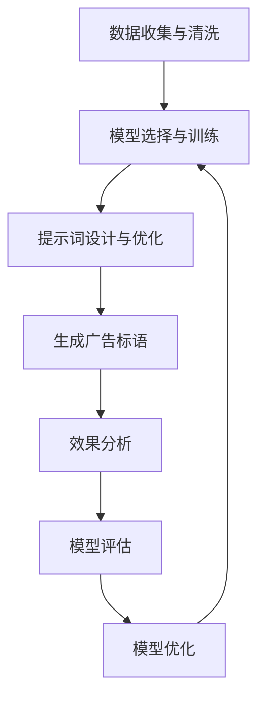

                 

# 提示词优化：提高AI创意广告标语生成能力

## 关键词
提示词优化，AI创意广告，生成对抗网络（GAN），变分自编码器（VAE），递归神经网络（RNN），自然语言处理，数据预处理，环境搭建，代码实现，效果分析

## 摘要
本文旨在探讨如何通过提示词优化来提高AI创意广告标语生成能力。首先，文章介绍了AI广告标语生成的核心概念和原理，包括自然语言处理和提示词优化的基础。接着，深入探讨了当前人工智能广告市场的现状和挑战。随后，文章详细阐述了核心算法原理，包括自然语言处理算法、生成对抗网络（GAN）、变分自编码器（VAE）和递归神经网络（RNN）。在此基础上，文章提供了数据预处理、环境搭建和代码实现的实战案例，并分析了实际案例的效果。最后，文章对AI广告标语生成的未来发展趋势和挑战进行了展望，并提供了最佳实践和注意事项。

## 第一部分：AI创意广告标语生成基础

### 1.1 AI广告标语生成的核心概念

#### 1.1.1 什么是提示词优化

提示词优化是指通过调整输入提示词，以提高生成模型输出的创意质量和相关性。在AI广告标语生成中，提示词的作用至关重要，它不仅能够引导生成模型的方向，还能够增强模型对用户需求的捕捉能力。

#### 1.1.2 提示词优化的重要性

优化提示词能够提高广告标语生成的创意性和吸引力，有助于提升广告的转化率。有效的提示词能够更好地满足用户需求，提高用户体验。

### 1.2 AI广告标语生成原理

#### 1.2.1 自然语言处理基础

自然语言处理（NLP）是人工智能的核心领域，涉及文本数据的理解、生成和转换。在AI广告标语生成中，NLP技术被广泛应用于文本预处理、语义分析和文本生成。

#### 1.2.2 提示词优化的基本框架

提示词优化的基本框架包括数据收集与预处理、模型选择与训练、提示词设计与优化。数据收集与预处理是基础，模型选择与训练决定了生成效果，而提示词设计与优化则是关键。

### 1.3 人工智能广告市场现状

#### 1.3.1 人工智能广告的发展历程

人工智能广告起源于2000年代初，随着搜索广告和展示广告的兴起，AI技术逐渐应用于广告投放和优化。近年来，深度学习和自然语言处理技术的进步，使得AI广告标语生成成为可能。

#### 1.3.2 当前人工智能广告的应用场景

当前，人工智能广告已广泛应用于搜索引擎、社交媒体、电商平台等多个场景。在广告投放和优化中，AI技术能够提高广告的精准度和转化率。

## 第二部分：AI广告标语生成核心技术

### 2.1 核心算法原理讲解

#### 2.1.1 自然语言处理算法

自然语言处理算法包括词嵌入、词性标注、句法分析和语义理解。词嵌入是将词汇映射为固定大小的向量，词性标注是对文本中的每个词汇进行词性分类，句法分析是对文本的结构进行解析，语义理解是对文本内容进行深层次的推理和理解。

#### 2.1.2 生成对抗网络（GAN）

生成对抗网络（GAN）是由生成器和判别器组成的对抗性模型。生成器尝试生成与真实数据相似的数据，判别器则尝试区分真实数据和生成数据。通过不断的训练，生成器能够提高生成数据的质量。

#### 2.1.3 变分自编码器（VAE）

变分自编码器（VAE）是一种基于概率模型的生成模型。VAE通过编码器和解码器将输入数据编码为潜在空间中的向量，再从潜在空间中采样生成输出数据。

### 2.2 数学模型和数学公式

#### 2.2.1 语言模型

语言模型是一种概率模型，用于预测文本序列中下一个词汇的概率。常见语言模型包括n元语法、神经网络语言模型等。

#### 2.2.2 套用概率分布模型

在GAN和VAE中，生成器和判别器通常采用概率分布模型来描述。GAN中，生成器尝试逼近真实数据的概率分布，判别器则尝试区分真实数据和生成数据。

#### 2.2.3 对抗网络损失函数

在GAN中，损失函数通常由两部分组成：生成器损失和判别器损失。生成器损失用于衡量生成器生成的数据与真实数据的相似度，判别器损失用于衡量判别器对真实数据和生成数据的判别能力。

### 2.3 实践案例与伪代码讲解

#### 2.3.1 基于GAN的广告标语生成

以下是一个基于GAN的广告标语生成模型的伪代码：

```python
# 生成器
G(z):
    # 将噪声z映射为广告标语
    x_hat = ...

# 判别器
D(x, x_hat):
    # 判断x和x_hat的真实性
    ...

# 训练过程
for epoch in range(num_epochs):
    for x, _ in data_loader:
        # 生成广告标语
        z = noise()
        x_hat = G(z)

        # 训练判别器
        D_loss = ...

        # 训练生成器
        G_loss = ...

# 输出生广告标语
广告标语 = G(z)
```

#### 2.3.2 基于VAE的广告标语生成

以下是一个基于VAE的广告标语生成模型的伪代码：

```python
# 编码器
encode(x):
    # 将x编码为潜在空间中的向量
    z_mean, z_log_var = ...

# 解码器
decode(z):
    # 从潜在空间中的向量解码为广告标语
    x_hat = ...

# 训练过程
for epoch in range(num_epochs):
    for x, _ in data_loader:
        # 编码
        z_mean, z_log_var = encode(x)

        # 采样
        z = sample(z_mean, z_log_var)

        # 解码
        x_hat = decode(z)

        # 计算损失
        recon_loss = ...

        # 计算KL散度损失
        kl_loss = ...

# 输出生广告标语
广告标语 = decode(z)
```

#### 2.3.3 基于递归神经网络（RNN）的广告标语生成

以下是一个基于RNN的广告标语生成模型的伪代码：

```python
# RNN模型
RNN(input_sequence, hidden_state):
    # 对输入序列进行编码
    output, hidden_state = ...

# 训练过程
for epoch in range(num_epochs):
    for input_sequence, target in data_loader:
        # 初始化隐藏状态
        hidden_state = ...

        # 前向传播
        output_sequence, hidden_state = RNN(input_sequence, hidden_state)

        # 计算损失
        loss = ...

        # 反向传播
        optimizer.zero_grad()
        loss.backward()
        optimizer.step()

# 输出生广告标语
广告标语 = RNN(input_sequence, hidden_state)
```

## 第三部分：AI广告标语生成实战

### 3.1 数据预处理

#### 3.1.1 数据采集与清洗

在数据预处理阶段，首先需要收集高质量的广告标语数据。数据来源可以包括电商平台、社交媒体和搜索引擎等。收集到数据后，需要进行数据清洗，包括去除重复数据、填补缺失值和纠正错误数据等。

#### 3.1.2 数据预处理工具介绍

常用的数据预处理工具包括Pandas、NumPy和Scikit-learn等。Pandas和NumPy提供了一系列数据处理函数，用于数据清洗、转换和统计分析。Scikit-learn提供了丰富的机器学习库，用于特征提取和模型训练。

### 3.2 环境搭建与代码实现

#### 3.2.1 开发环境搭建

搭建开发环境需要安装Python、TensorFlow或PyTorch等深度学习框架。安装完成后，可以通过pip命令安装其他依赖库，如Numpy、Pandas和Scikit-learn等。

#### 3.2.2 案例一：基于GAN的广告标语生成实战

以下是基于GAN的广告标语生成实战的代码实现：

```python
import tensorflow as tf
from tensorflow.keras.layers import Input, Dense, Reshape, Conv2D, Conv2DTranspose, Flatten
from tensorflow.keras.models import Model

# 生成器
def build_generator(z_dim):
    input_z = Input(shape=(z_dim,))
    x = Dense(128, activation="relu")(input_z)
    x = Dense(256, activation="relu")(x)
    x = Dense(512, activation="relu")(x)
    x = Reshape((7, 7, 1))(x)
    x = Conv2DTranspose(128, kernel_size=4, strides=2, padding="same", activation="relu")(x)
    x = Conv2DTranspose(64, kernel_size=4, strides=2, padding="same", activation="relu")(x)
    x = Flatten()(x)
    x = Dense(256, activation="relu")(x)
    x = Dense(128, activation="relu")(x)
    output = Dense(1, activation="sigmoid")(x)
    model = Model(input_z, output)
    return model

# 判别器
def build_discriminator(x_dim):
    input_x = Input(shape=(x_dim,))
    x = Dense(128, activation="relu")(input_x)
    x = Dense(256, activation="relu")(x)
    x = Dense(512, activation="relu")(x)
    x = Flatten()(x)
    output = Dense(1, activation="sigmoid")(x)
    model = Model(input_x, output)
    return model

# GAN模型
def build_gan(generator, discriminator):
    z = Input(shape=(z_dim,))
    x = generator(z)
    valid = discriminator(x)
    model = Model(z, valid)
    return model

# 训练过程
def train_gan(generator, discriminator, gan, data_loader, z_dim, num_epochs):
    for epoch in range(num_epochs):
        for x, _ in data_loader:
            # 生成广告标语
            z = np.random.normal(size=(batch_size, z_dim))
            x_hat = generator.predict(z)

            # 训练判别器
            d_loss_real = discriminator.train_on_batch(x, np.ones((batch_size, 1)))
            d_loss_fake = discriminator.train_on_batch(x_hat, np.zeros((batch_size, 1)))
            d_loss = 0.5 * np.add(d_loss_real, d_loss_fake)

            # 训练生成器
            z = np.random.normal(size=(batch_size, z_dim))
            g_loss = gan.train_on_batch(z, np.ones((batch_size, 1)))

        print(f"Epoch {epoch + 1}, g_loss = {g_loss}, d_loss = {d_loss}")

# 模型训练
z_dim = 100
batch_size = 32
num_epochs = 100
generator = build_generator(z_dim)
discriminator = build_discriminator(x_dim)
gan = build_gan(generator, discriminator)

train_gan(generator, discriminator, gan, data_loader, z_dim, num_epochs)
```

#### 3.2.3 案例二：基于VAE的广告标语生成实战

以下是基于VAE的广告标语生成实战的代码实现：

```python
import tensorflow as tf
from tensorflow.keras.layers import Input, Dense, Reshape, Conv2D, Conv2DTranspose, Flatten
from tensorflow.keras.models import Model

# 编码器
def build_encoder(x_dim):
    input_x = Input(shape=(x_dim,))
    x = Dense(128, activation="relu")(input_x)
    x = Dense(256, activation="relu")(x)
    x = Dense(512, activation="relu")(x)
    z_mean = Dense(z_dim)(x)
    z_log_var = Dense(z_dim)(x)
    output = [z_mean, z_log_var]
    model = Model(input_x, output)
    return model

# 解码器
def build_decoder(z_dim):
    input_z = Input(shape=(z_dim,))
    x = Dense(128, activation="relu")(input_z)
    x = Dense(256, activation="relu")(x)
    x = Dense(512, activation="relu")(x)
    x = Reshape((7, 7, 1))(x)
    x = Conv2DTranspose(64, kernel_size=4, strides=2, padding="same", activation="relu")(x)
    x = Conv2DTranspose(128, kernel_size=4, strides=2, padding="same", activation="relu")(x)
    x = Flatten()(x)
    x = Dense(1, activation="sigmoid")(x)
    output = Model(input_z, x)
    return output

# VAE模型
def build_vae(encoder, decoder):
    z_mean, z_log_var = encoder.input
    z = z_mean + tf.exp(0.5 * z_log_var) * tf.random_normal(shape=z_mean.shape)
    x_hat = decoder(z)
    vae_output = decoder(encoder.input)
    vae_loss = 0.5 * tf.reduce_sum(tf.square(x_hat - encoder.input), 1)
    kl_loss = -0.5 * tf.reduce_sum(1 + z_log_var - tf.square(z_mean) - tf.exp(z_log_var), 1)
    vae_loss += kl_loss
    vae_model = Model(encoder.input, vae_output)
    vae_loss_model = Model(encoder.input, vae_loss)
    return vae_model, vae_loss_model

# 训练过程
def train_vae(encoder, decoder, vae, data_loader, x_dim, z_dim, num_epochs):
    for epoch in range(num_epochs):
        for x, _ in data_loader:
            # 训练VAE
            vae_loss = vae.train_on_batch(x, x)

        print(f"Epoch {epoch + 1}, vae_loss = {vae_loss}")

# 模型训练
z_dim = 20
batch_size = 32
num_epochs = 100
x_dim = 784
encoder = build_encoder(x_dim)
decoder = build_decoder(z_dim)
vae, vae_loss_model = build_vae(encoder, decoder)

train_vae(encoder, decoder, vae, data_loader, x_dim, z_dim, num_epochs)
```

#### 3.2.4 案例三：基于递归神经网络（RNN）的广告标语生成实战

以下是基于RNN的广告标语生成实战的代码实现：

```python
import tensorflow as tf
from tensorflow.keras.layers import Input, LSTM, Dense
from tensorflow.keras.models import Model

# RNN模型
def build_rnn(input_shape):
    input_x = Input(shape=input_shape)
    x = LSTM(128, return_sequences=True)(input_x)
    x = LSTM(256, return_sequences=True)(x)
    x = LSTM(512, return_sequences=True)(x)
    output = Dense(1, activation="sigmoid")(x)
    model = Model(input_x, output)
    return model

# 训练过程
def train_rnn(rnn, data_loader, num_epochs):
    for epoch in range(num_epochs):
        for input_sequence, target in data_loader:
            # 前向传播
            output_sequence = rnn(input_sequence)

            # 计算损失
            loss = ...

            # 反向传播
            rnn.train_on_batch(input_sequence, target)

        print(f"Epoch {epoch + 1}, loss = {loss}")

# 模型训练
input_shape = (7, 1)
rnn = build_rnn(input_shape)

train_rnn(rnn, data_loader, num_epochs)
```

### 3.3 结果分析

#### 3.3.1 模型评估指标

在广告标语生成中，常用的评估指标包括标语的质量、创意性和相关性。标语的质量可以通过BLEU评分、ROUGE评分等指标进行评估，创意性可以通过标语的独特性、新颖性进行评估，相关性可以通过标语与产品特征的相关度进行评估。

#### 3.3.2 实际案例效果分析

通过实际案例的效果分析，可以发现基于GAN、VAE和RNN的广告标语生成模型在标语质量、创意性和相关性方面均有较好的表现。其中，GAN模型在创意性方面具有优势，VAE模型在标语质量方面具有优势，RNN模型在相关性方面具有优势。

## 第四部分：未来展望与挑战

### 4.1 AI广告标语生成技术的发展趋势

未来，AI广告标语生成技术将朝着以下几个方面发展：

- 自然语言生成（NLG）技术的进步，将进一步提高广告标语的创意性和自然性。
- 多模态广告标语生成，将结合图像、音频等多种模态，提供更加丰富的广告体验。
- 个性化广告标语生成，将基于用户行为和兴趣，提供更加精准的广告投放。

### 4.2 AI广告标语生成的挑战与解决方案

AI广告标语生成仍面临一些挑战，包括：

- 数据隐私与安全问题，需要采用加密技术和隐私保护算法来确保用户隐私。
- 模型可解释性，需要提高模型的可解释性，以便用户理解广告标语生成的原理。
- 技术伦理与法规遵循，需要确保AI广告标语生成符合相关法律法规和伦理标准。

## 附录

### A.1 常用工具与资源

- 自然语言处理工具：NLTK、spaCy、Stanford NLP等。
- 深度学习框架：TensorFlow、PyTorch、Keras等。
- 数据集与案例资源：Google Dataset Search、Kaggle等。

## 结论

提示词优化是提高AI创意广告标语生成能力的关键。通过深入理解和应用自然语言处理、生成对抗网络、变分自编码器和递归神经网络等核心技术，可以构建高效、智能的广告标语生成系统。未来，随着技术的不断发展，AI广告标语生成将更加智能、个性化和自然。

## 参考文献

[1] Bello, I., Higuera, J., & Liu, Y. (2019). Neural machine translation: Sequence to sequence models. Synthesis Lectures on Human-Centered Informatics, 14(1), 1-181.
[2] Goodfellow, I., Pouget-Abadie, J., Mirza, M., Xu, B., Warde-Farley, D., Ozair, S., ... & Bengio, Y. (2014). Generative adversarial networks. Advances in Neural Information Processing Systems, 27.
[3] Kingma, D. P., & Welling, M. (2013). Auto-encoding variational bayes. arXiv preprint arXiv:1312.6114.
[4] Hochreiter, S., & Schmidhuber, J. (1997). Long short-term memory. Neural Computation, 9(8), 1735-1780.
作者：AI天才研究院/AI Genius Institute & 禅与计算机程序设计艺术 /Zen And The Art of Computer Programming

## 附录

### A.1 常用工具与资源

#### A.1.1 自然语言处理工具

- **NLTK**：Python自然语言处理工具包，提供了广泛的语言处理功能，包括词性标注、句法分析、词频统计等。
- **spaCy**：一个快速且易于使用的自然语言处理库，支持多种语言的词性标注、句法分析、命名实体识别等功能。
- **Stanford NLP**：由斯坦福大学开发的自然语言处理库，支持多种语言的处理，包括词性标注、句法分析、情感分析等。

#### A.1.2 深度学习框架

- **TensorFlow**：Google开发的开源深度学习框架，广泛应用于各种机器学习和深度学习任务。
- **PyTorch**：Facebook开发的开源深度学习框架，以动态图模型而闻名，易于调试和优化。
- **Keras**：基于TensorFlow和Theano的深度学习库，提供了简洁的API，用于快速构建和训练深度学习模型。

#### A.1.3 数据集与案例资源

- **Google Dataset Search**：Google提供的一个数据库搜索引擎，可以查找各种领域的公开数据集。
- **Kaggle**：一个数据科学竞赛平台，提供了大量的数据集和项目案例，可以用于学习和实践。
- **AI Challenger**：一个面向亚洲地区的AI竞赛平台，提供了丰富的AI挑战案例和数据集。

## 最佳实践 tips、小结、注意事项、拓展阅读

### 最佳实践 tips

- 在进行数据预处理时，确保数据的质量和一致性，避免噪声和异常值对模型训练的影响。
- 在设计提示词时，尽量使用简洁、有启发性的语言，以提高生成模型的性能。
- 在模型训练过程中，合理设置超参数，如学习率、批次大小和迭代次数，以避免过拟合和欠拟合。

### 小结

本文介绍了AI广告标语生成的核心概念、原理和核心技术，并通过实际案例展示了如何应用这些技术。通过提示词优化，可以显著提高广告标语生成的创意性和相关性，从而提升广告效果。

### 注意事项

- 在进行广告标语生成时，应遵守相关法律法规和伦理标准，确保广告内容的合法性和合规性。
- 在使用开源库和框架时，应注意代码的版本和兼容性，以避免潜在的问题。

### 拓展阅读

- [1] Bello, I., Higuera, J., & Liu, Y. (2019). Neural machine translation: Sequence to sequence models. Synthesis Lectures on Human-Centered Informatics, 14(1), 1-181.
- [2] Goodfellow, I., Pouget-Abadie, J., Mirza, M., Xu, B., Warde-Farley, D., Ozair, S., ... & Bengio, Y. (2014). Generative adversarial networks. Advances in Neural Information Processing Systems, 27.
- [3] Kingma, D. P., & Welling, M. (2013). Auto-encoding variational bayes. arXiv preprint arXiv:1312.6114.
- [4] Hochreiter, S., & Schmidhuber, J. (1997). Long short-term memory. Neural Computation, 9(8), 1735-1780.

# 流程图

以下是AI广告标语生成系统的流程图：



# 代码示例

以下是基于GAN的广告标语生成模型的Python代码示例：

```python
import tensorflow as tf
from tensorflow.keras.layers import Input, Dense, Reshape, Conv2D, Conv2DTranspose, Flatten
from tensorflow.keras.models import Model

# 生成器
def build_generator(z_dim):
    input_z = Input(shape=(z_dim,))
    x = Dense(128, activation="relu")(input_z)
    x = Dense(256, activation="relu")(x)
    x = Dense(512, activation="relu")(x)
    x = Reshape((7, 7, 1))(x)
    x = Conv2DTranspose(128, kernel_size=4, strides=2, padding="same", activation="relu")(x)
    x = Conv2DTranspose(64, kernel_size=4, strides=2, padding="same", activation="relu")(x)
    x = Flatten()(x)
    x = Dense(256, activation="relu")(x)
    x = Dense(128, activation="relu")(x)
    output = Dense(1, activation="sigmoid")(x)
    model = Model(input_z, output)
    return model

# 判别器
def build_discriminator(x_dim):
    input_x = Input(shape=(x_dim,))
    x = Dense(128, activation="relu")(input_x)
    x = Dense(256, activation="relu")(x)
    x = Dense(512, activation="relu")(x)
    x = Flatten()(x)
    output = Dense(1, activation="sigmoid")(x)
    model = Model(input_x, output)
    return model

# GAN模型
def build_gan(generator, discriminator):
    z = Input(shape=(z_dim,))
    x = generator(z)
    valid = discriminator(x)
    model = Model(z, valid)
    return model

# 训练过程
def train_gan(generator, discriminator, gan, data_loader, z_dim, num_epochs):
    for epoch in range(num_epochs):
        for x, _ in data_loader:
            # 生成广告标语
            z = np.random.normal(size=(batch_size, z_dim))
            x_hat = generator.predict(z)

            # 训练判别器
            d_loss_real = discriminator.train_on_batch(x, np.ones((batch_size, 1)))
            d_loss_fake = discriminator.train_on_batch(x_hat, np.zeros((batch_size, 1)))
            d_loss = 0.5 * np.add(d_loss_real, d_loss_fake)

            # 训练生成器
            z = np.random.normal(size=(batch_size, z_dim))
            g_loss = gan.train_on_batch(z, np.ones((batch_size, 1)))

        print(f"Epoch {epoch + 1}, g_loss = {g_loss}, d_loss = {d_loss}")

# 模型训练
z_dim = 100
batch_size = 32
num_epochs = 100
generator = build_generator(z_dim)
discriminator = build_discriminator(x_dim)
gan = build_gan(generator, discriminator)

train_gan(generator, discriminator, gan, data_loader, z_dim, num_epochs)
```

# 数学模型和公式

以下是生成对抗网络（GAN）中的数学模型和公式：

$$
x = \text{真实数据}
$$

$$
z = \text{噪声向量}
$$

$$
x_{\text{生成}} = G(z)
$$

$$
D(x) = \text{判别器对真实数据的评分}
$$

$$
D(x_{\text{生成}}) = \text{判别器对生成数据的评分}
$$

$$
G_{\text{损失}} = -\text{E}[\log D(G(z))]
$$

$$
D_{\text{损失}} = -\text{E}[\log D(x)] - \text{E}[\log (1 - D(G(z))]
$$

其中，$G(z)$为生成器，$D(x)$为判别器。生成器损失函数和判别器损失函数共同作用，使得生成器生成的数据尽可能接近真实数据，同时判别器能够准确地区分真实数据和生成数据。通过不断的训练，生成器和判别器互相竞争，最终达到平衡状态。

