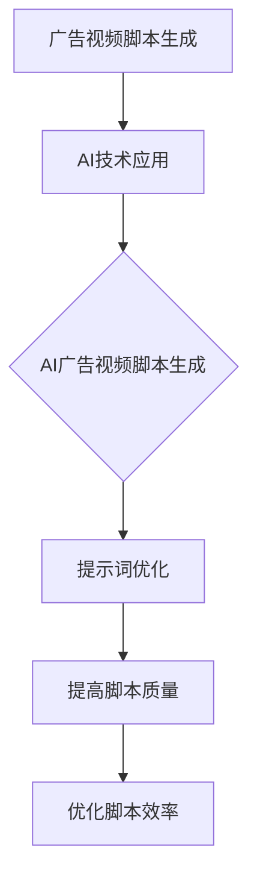
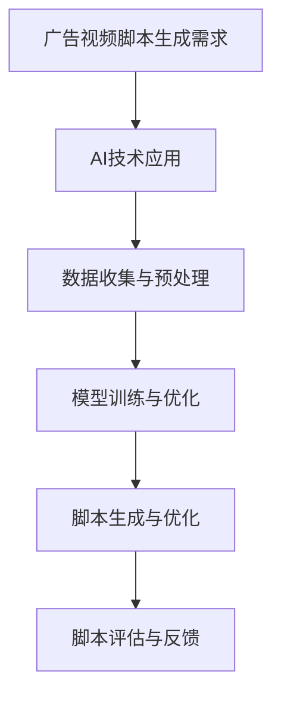
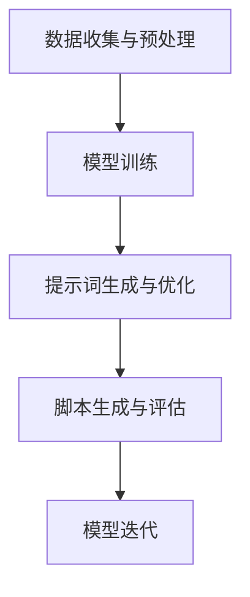
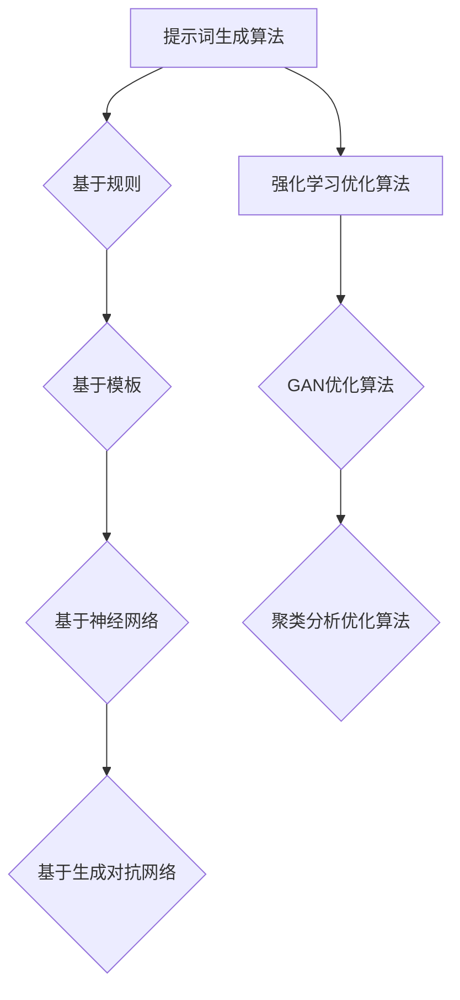
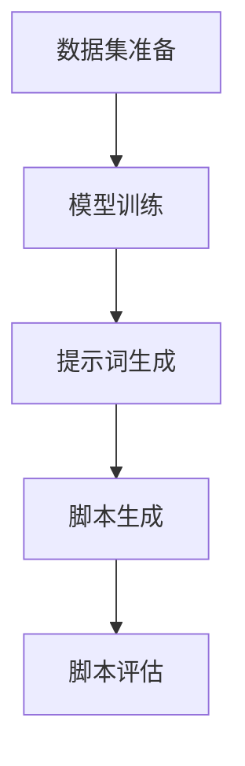
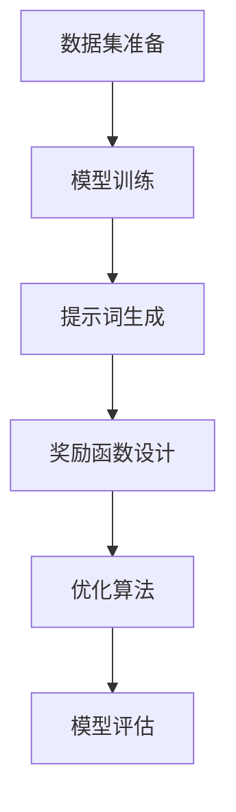

                 

### 第1章 引言

## 1.1 书籍背景

在数字化和人工智能蓬勃发展的时代，广告行业面临着前所未有的挑战和机遇。传统广告视频脚本生成方式通常依赖于人工创作，这不仅效率低下，而且难以满足日益增长的市场需求。随着人工智能技术的不断进步，特别是深度学习和自然语言处理技术的应用，AI广告视频脚本生成逐渐成为一种新兴趋势。本章节将探讨AI在广告视频脚本生成中的应用，分析其带来的变革，并介绍本书籍的背景、目标和结构。

### 1.2 目标读者

本书籍旨在为以下几类读者提供指导和帮助：

1. **广告行业从业者**：希望利用AI技术提高广告视频脚本生成效率和质量的专业人士。
2. **AI研究人员**：对AI广告视频脚本生成技术感兴趣，希望深入了解相关算法和应用的研究人员。
3. **对广告视频脚本生成感兴趣的学习者**：对广告视频脚本生成流程、技术原理和应用场景有一定了解，希望深入学习相关知识的学习者。

### 1.3 书籍结构

本书结构共分为八个章节，具体内容如下：

- **第1章 引言**：介绍书籍的背景、目标和结构。
- **第2章 AI与广告视频脚本生成概述**：概述AI在广告视频脚本生成中的应用和技术。
- **第3章 提示词优化基础**：介绍提示词优化的定义、目标和重要性。
- **第4章 提示词生成与优化算法**：探讨提示词生成与优化的算法及其比较。
- **第5章 提示词优化实践**：通过实际案例展示提示词优化的应用。
- **第6章 提示词优化的数学模型**：介绍提示词优化的数学模型和应用。
- **第7章 提示词优化工具与实践**：介绍提示词优化工具的使用和实践。
- **第8章 未来趋势与展望**：展望提示词优化的未来发展方向和应用前景。

通过本书，读者将能够系统地了解AI广告视频脚本生成技术，掌握提示词优化的核心概念和方法，并在实践中应用这些技术，从而提高广告视频脚本生成的效率和质量。

### 1.4 写作目的

本章节的写作目的在于：

1. **激发读者兴趣**：通过介绍AI在广告视频脚本生成中的应用和提示词优化的重要性，激发读者对这一领域的兴趣。
2. **明确书籍目标**：为读者提供清晰的学习路径和目标，帮助读者系统地掌握AI广告视频脚本生成技术和提示词优化方法。
3. **结构化内容**：通过详细的章节结构，使读者能够更好地理解和掌握书籍的内容，为后续章节的深入学习打下基础。

**核心概念与联系**：

- **广告视频脚本生成**：指通过人工智能技术自动生成广告视频脚本的过程。
- **提示词优化**：指通过优化提示词来提高AI广告视频脚本生成质量和效率的过程。

**Mermaid流程图**：



### 伪代码：

```python
# 广告视频脚本生成流程伪代码
def generate_ad_video_script(prompt):
    # 初始化脚本生成模型
    model = initialize_model()

    # 使用提示词生成脚本
    script = model.generate_script(prompt)

    # 优化脚本
    optimized_script = optimize_script(script)

    # 输出优化后的脚本
    return optimized_script
```

### 数学公式与解释：

- **提示词质量评价公式**：

  $$ Q = \frac{1}{N} \sum_{i=1}^{N} relevance_i \cdot diversity_i $$

  其中，$Q$ 表示提示词质量，$N$ 表示提示词数量，$relevance_i$ 表示提示词 $i$ 与脚本生成目标的相关性，$diversity_i$ 表示提示词 $i$ 的多样性。

- **优化目标公式**：

  $$ \minimize \; Cost = \frac{1}{2} \sum_{i=1}^{N} (predicted_script_i - actual_script_i)^2 $$

  其中，$Cost$ 表示优化成本，$predicted_script_i$ 和 $actual_script_i$ 分别表示预测脚本和实际脚本。

### 举例说明：

假设我们有一个新闻视频脚本生成的任务，使用提示词优化技术，我们能够提高生成脚本的质量和多样性。通过优化提示词，我们能够生成更符合新闻特点、更具吸引力的视频脚本。

**文章摘要**：

本章节介绍了AI广告视频脚本生成技术的背景和应用，并详细阐述了提示词优化的定义、目标和重要性。通过本章的学习，读者将了解AI广告视频脚本生成的基本概念，掌握提示词优化的核心算法和技术，并为后续章节的学习打下基础。

---

### 第2章 AI与广告视频脚本生成概述

## 2.1 AI在广告视频脚本生成中的应用

随着人工智能技术的不断进步，AI在广告视频脚本生成中的应用日益广泛。传统广告视频脚本生成主要依赖于人工创作，效率低下且难以满足大规模市场需求。而AI广告视频脚本生成则利用机器学习和自然语言处理技术，自动生成脚本，大大提高了生产效率和质量。

### 2.1.1 广告视频脚本生成的需求

广告视频脚本生成的需求主要体现在以下几个方面：

1. **个性化**：不同广告受众的偏好和需求各异，广告视频脚本需要根据受众特点进行个性化定制。
2. **多样化**：广告场景和产品的多样化要求脚本具备丰富的表现力，能够生动地展示产品特点。
3. **高效性**：广告行业竞争激烈，高效生成脚本能够迅速推出新广告，抢占市场先机。
4. **准确性**：脚本内容需要准确传达广告信息和目的，避免产生误导或负面效果。

### 2.1.2 AI技术在广告视频脚本生成中的应用

AI技术在广告视频脚本生成中的应用主要包括以下几个方面：

1. **自然语言处理**：利用自然语言处理技术，将文本内容转换为脚本，提高生成脚本的准确性和连贯性。
2. **深度学习**：通过深度学习算法，对大量脚本数据进行学习，提取关键特征，从而生成高质量的脚本。
3. **生成对抗网络（GAN）**：利用生成对抗网络，生成具有创意和吸引力的脚本，提高脚本的表现力和多样性。
4. **强化学习**：通过强化学习算法，优化脚本生成过程，提高生成脚本的质量和效率。

### 2.1.3 AI广告视频脚本生成的优势

AI广告视频脚本生成相比传统人工创作，具有以下优势：

1. **效率高**：AI技术能够快速生成大量脚本，大大提高了生产效率。
2. **成本低**：AI技术减少了人工创作的成本，降低了广告制作成本。
3. **个性化**：AI技术可以根据用户需求和偏好，生成个性化的脚本，提高广告效果。
4. **多样化**：AI技术能够生成丰富多样的脚本，满足不同广告场景和产品的需求。

### 2.2 AI创意广告视频脚本生成技术

AI创意广告视频脚本生成技术主要包括以下几个关键环节：

1. **数据收集与预处理**：收集大量广告视频脚本数据，进行数据清洗和预处理，为后续模型训练提供高质量的数据集。
2. **模型训练与优化**：利用深度学习算法，对脚本数据进行训练，优化模型参数，提高模型生成脚本的能力。
3. **脚本生成与优化**：利用训练好的模型，生成广告视频脚本，并通过优化算法，进一步提高脚本的质量和多样性。
4. **脚本评估与反馈**：对生成脚本进行评估，收集用户反馈，不断优化脚本生成模型。

### 2.3 当前广告视频脚本生成挑战

尽管AI广告视频脚本生成具有显著优势，但仍然面临一些挑战：

1. **提示词优化**：如何优化提示词，提高生成脚本的质量和多样性，是目前研究的热点问题。
2. **数据质量**：高质量的数据集对于模型训练至关重要，但实际获取的数据集往往存在噪声和偏差。
3. **脚本生成效果评估**：如何准确评估脚本生成效果，仍是一个具有挑战性的问题。

### 2.4 总结

本章节介绍了AI广告视频脚本生成技术的背景和应用，分析了当前广告视频脚本生成的需求、AI技术的应用以及面临的挑战。通过本章的学习，读者将了解AI广告视频脚本生成的基本概念、技术原理和应用前景，为后续章节的学习打下基础。

**核心概念与联系**：

- **广告视频脚本生成**：指通过人工智能技术自动生成广告视频脚本的过程。
- **AI技术**：指应用在广告视频脚本生成中的自然语言处理、深度学习、生成对抗网络和强化学习等技术。

**Mermaid流程图**：



### 数学公式与解释：

- **生成脚本质量评价公式**：

  $$ Q = \frac{1}{N} \sum_{i=1}^{N} relevance_i \cdot diversity_i $$

  其中，$Q$ 表示脚本质量，$N$ 表示脚本数量，$relevance_i$ 表示脚本 $i$ 与广告目标的相关性，$diversity_i$ 表示脚本 $i$ 的多样性。

### 举例说明：

假设我们要生成一款产品广告视频脚本，通过优化提示词，我们可以提高生成脚本的质量和多样性。例如，使用“智能手表”作为提示词，生成脚本更具有创意性和吸引力。

**文章摘要**：

本章节介绍了AI广告视频脚本生成技术的背景和应用，分析了当前广告视频脚本生成的需求、AI技术的应用以及面临的挑战。通过本章的学习，读者将了解AI广告视频脚本生成的基本概念、技术原理和应用前景，为后续章节的学习打下基础。

---

### 第3章 提示词优化基础

## 3.1 提示词优化的定义与重要性

### 3.1.1 提示词优化的定义

提示词优化是指通过改进提示词的选择、生成和调整，以提高AI广告视频脚本生成质量和效率的过程。提示词，即输入给AI模型的信息，用于引导模型生成脚本。优化的目标是在保持脚本创意性的同时，提高脚本的准确性、相关性和多样性。

### 3.1.2 提示词优化的重要性

提示词优化的重要性主要体现在以下几个方面：

1. **提高脚本质量**：通过优化提示词，可以增强脚本与广告目标的关联性，提高脚本的吸引力和说服力。
2. **增强多样性**：优化提示词能够促进模型生成不同风格和形式的脚本，满足多样化的广告需求。
3. **提高效率**：有效的提示词优化可以减少模型训练时间和生成脚本的时间，提高整体生产效率。
4. **降低成本**：优化后的提示词可以减少人工干预，降低广告制作成本。

### 3.1.3 提示词优化的目标与指标

提示词优化的目标主要包括：

1. **生成脚本的准确性**：指脚本内容与广告目标的匹配程度，即脚本是否能够准确地传达广告信息。
2. **生成脚本的多样性**：指生成脚本的风格、形式和内容的丰富程度，即脚本是否具有创意性和吸引力。
3. **生成脚本的效率**：指生成脚本的速度和模型的训练时间，即如何快速、高效地生成高质量的脚本。

提示词优化的指标通常包括：

1. **质量指标**：如脚本的相关性、吸引力、真实性等，可以通过人工评估或自动化评估工具进行衡量。
2. **多样性指标**：如脚本的独特性、风格多样性等，可以通过聚类分析、词频统计等方法进行评估。
3. **效率指标**：如生成脚本的速度、模型训练时间等，可以通过计时和性能测试进行衡量。

## 3.2 提示词优化的技术框架

### 3.2.1 提示词优化的基本流程

提示词优化的基本流程包括以下几个步骤：

1. **数据收集与预处理**：收集大量广告视频脚本数据，进行数据清洗和预处理，为后续模型训练提供高质量的数据集。
2. **模型训练**：利用深度学习算法，对脚本数据进行训练，优化模型参数，提高模型生成脚本的能力。
3. **提示词生成与优化**：根据训练好的模型，生成提示词，并通过优化算法，进一步提高提示词的质量和多样性。
4. **脚本生成与评估**：利用优化后的提示词，生成广告视频脚本，对生成脚本进行评估，收集用户反馈，不断优化模型和提示词。
5. **模型迭代**：根据评估结果和用户反馈，迭代优化模型和提示词，提高生成脚本的质量和效率。

### 3.2.2 提示词优化的关键技术

提示词优化的关键技术主要包括以下几个方面：

1. **自然语言处理**：利用自然语言处理技术，对提示词进行解析、分词、语义分析等操作，提取关键信息，为模型提供有效的输入。
2. **深度学习**：利用深度学习算法，如循环神经网络（RNN）、长短期记忆网络（LSTM）、变换器（Transformer）等，对脚本数据进行学习，提取特征，生成高质量的脚本。
3. **生成对抗网络（GAN）**：利用生成对抗网络，生成具有创意和吸引力的提示词和脚本，提高生成结果的多样性和质量。
4. **强化学习**：通过强化学习算法，优化提示词生成和脚本生成的过程，提高生成脚本的质量和效率。

### 3.2.3 提示词优化在不同领域的应用

提示词优化在广告视频脚本生成领域具有广泛的应用，还可以应用于其他领域，如：

1. **内容创作**：优化提示词，生成创意性的内容，提高文章、视频、图片等内容的吸引力和质量。
2. **产品推荐**：优化提示词，提高推荐系统生成推荐列表的准确性和多样性。
3. **语言翻译**：优化提示词，提高机器翻译系统的翻译质量和效率。

### 3.3 提示词优化的应用案例

#### 3.3.1 案例一：新闻视频脚本生成

新闻视频脚本生成的挑战在于如何将大量新闻信息转化为吸引人的视频脚本。通过优化提示词，可以生成更加准确、相关和多样化的脚本。具体步骤如下：

1. **数据收集与预处理**：收集大量新闻视频脚本数据，进行数据清洗和预处理，提取关键信息。
2. **模型训练**：利用深度学习算法，对新闻数据进行训练，优化模型参数。
3. **提示词生成与优化**：生成新闻相关的提示词，通过优化算法，提高提示词的质量和多样性。
4. **脚本生成与评估**：利用优化后的提示词，生成新闻视频脚本，评估脚本的相关性和吸引力。
5. **模型迭代**：根据评估结果，迭代优化模型和提示词。

#### 3.3.2 案例二：产品广告视频脚本生成

产品广告视频脚本生成的挑战在于如何将产品特点和卖点转化为吸引人的视频脚本。通过优化提示词，可以生成更加精准、创意和多样化的脚本。具体步骤如下：

1. **数据收集与预处理**：收集大量产品广告视频脚本数据，进行数据清洗和预处理，提取关键信息。
2. **模型训练**：利用深度学习算法，对产品数据进行训练，优化模型参数。
3. **提示词生成与优化**：生成产品相关的提示词，通过优化算法，提高提示词的质量和多样性。
4. **脚本生成与评估**：利用优化后的提示词，生成产品广告视频脚本，评估脚本的相关性和吸引力。
5. **模型迭代**：根据评估结果，迭代优化模型和提示词。

### 3.4 总结

本章节介绍了提示词优化的定义、目标和重要性，以及提示词优化的基本流程和技术框架。通过实际案例，展示了提示词优化在新闻视频脚本生成和产品广告视频脚本生成中的应用。通过本章的学习，读者将掌握提示词优化的核心概念和方法，为后续章节的学习打下基础。

**核心概念与联系**：

- **提示词优化**：指通过改进提示词的选择、生成和调整，以提高AI广告视频脚本生成质量和效率的过程。
- **自然语言处理**：指利用自然语言处理技术，对提示词进行解析、分词、语义分析等操作，提取关键信息。
- **深度学习**：指利用深度学习算法，对脚本数据进行学习，提取特征，生成高质量的脚本。
- **生成对抗网络（GAN）**：指利用生成对抗网络，生成具有创意和吸引力的提示词和脚本，提高生成结果的多样性和质量。

**Mermaid流程图**：



### 数学公式与解释：

- **生成脚本质量评价公式**：

  $$ Q = \frac{1}{N} \sum_{i=1}^{N} relevance_i \cdot diversity_i $$

  其中，$Q$ 表示脚本质量，$N$ 表示脚本数量，$relevance_i$ 表示脚本 $i$ 与广告目标的相关性，$diversity_i$ 表示脚本 $i$ 的多样性。

- **优化目标公式**：

  $$ \minimize \; Cost = \frac{1}{2} \sum_{i=1}^{N} (predicted_script_i - actual_script_i)^2 $$

  其中，$Cost$ 表示优化成本，$predicted_script_i$ 和 $actual_script_i$ 分别表示预测脚本和实际脚本。

### 举例说明：

假设我们要生成一款手机广告视频脚本，通过优化提示词，我们可以提高生成脚本的质量和多样性。例如，使用“高性能”、“拍照强大”等提示词，生成脚本更具有吸引力和说服力。

**文章摘要**：

本章节介绍了提示词优化的定义、目标和重要性，以及提示词优化的基本流程和技术框架。通过实际案例，展示了提示词优化在新闻视频脚本生成和产品广告视频脚本生成中的应用。通过本章的学习，读者将掌握提示词优化的核心概念和方法，为后续章节的学习打下基础。

---

### 第4章 提示词生成与优化算法

## 4.1 提示词生成算法

提示词生成算法是AI广告视频脚本生成中的核心组件，其质量直接影响脚本生成效果。以下介绍几种常用的提示词生成算法：

### 4.1.1 基于规则的方法

基于规则的方法通过预设的规则和模板生成提示词。具体步骤如下：

1. **定义规则和模板**：根据广告目标和类型，预设一系列规则和模板，用于生成提示词。
2. **输入和输出映射**：将广告目标、产品特性等信息输入到规则和模板中，生成提示词。

优点：简单易懂，易于实现。缺点：缺乏灵活性，难以应对复杂和多变的广告需求。

### 4.1.2 基于模板的方法

基于模板的方法通过预定义的模板和变量生成提示词。具体步骤如下：

1. **定义模板和变量**：根据广告目标和类型，预定义一系列模板和变量，用于生成提示词。
2. **填充变量**：将广告目标、产品特性等信息填充到模板中的变量，生成提示词。

优点：灵活性较高，适用于多样化广告需求。缺点：模板设计复杂，难以保证生成提示词的多样性。

### 4.1.3 基于神经网络的方法

基于神经网络的方法利用深度学习模型生成提示词。具体步骤如下：

1. **模型训练**：使用大量广告脚本数据，训练神经网络模型，提取关键特征。
2. **生成提示词**：输入广告目标、产品特性等信息，利用训练好的模型生成提示词。

优点：高度灵活，能够生成多样化和高质量的提示词。缺点：训练复杂，需要大量数据和计算资源。

### 4.1.4 基于生成对抗网络（GAN）的方法

生成对抗网络（GAN）是一种由生成器和判别器组成的深度学习模型，用于生成高质量的提示词。具体步骤如下：

1. **模型训练**：训练生成器和判别器，使生成器生成逼真的提示词，判别器能够准确区分真实和生成的提示词。
2. **生成提示词**：利用训练好的生成器，生成高质量的提示词。

优点：能够生成多样性和创意性的提示词。缺点：训练过程复杂，对数据和计算资源要求较高。

### 4.1.5 算法比较与适用场景

不同提示词生成算法具有各自的优缺点，适用于不同的场景。以下是比较：

- **基于规则的方法**：适用于简单、固定的广告需求，如宣传海报、宣传视频等。
- **基于模板的方法**：适用于多样化、可变动的广告需求，如产品介绍、广告文案等。
- **基于神经网络的方法**：适用于复杂、多样化的广告需求，如广告视频脚本生成、新闻摘要等。
- **基于生成对抗网络（GAN）的方法**：适用于创意性、多样性的广告需求，如广告视频创意、品牌宣传等。

## 4.2 提示词优化算法

提示词优化算法用于改进提示词的质量和多样性，以提升脚本生成效果。以下介绍几种常用的提示词优化算法：

### 4.2.1 强化学习优化算法

强化学习优化算法通过优化提示词生成策略，提高脚本生成质量。具体步骤如下：

1. **定义奖励函数**：根据脚本生成质量，定义奖励函数，用于评估提示词的优劣。
2. **训练优化策略**：使用强化学习算法，优化提示词生成策略，使其能够生成高质量的提示词。
3. **迭代优化**：根据奖励函数的评估结果，不断迭代优化策略，提高生成提示词的质量。

优点：能够自适应地调整提示词生成策略，提高脚本生成质量。缺点：训练过程复杂，对计算资源要求较高。

### 4.2.2 生成对抗网络（GAN）优化算法

生成对抗网络（GAN）优化算法通过优化生成器和判别器，提升提示词生成质量。具体步骤如下：

1. **模型训练**：训练生成器和判别器，使生成器生成高质量的提示词，判别器能够准确区分真实和生成的提示词。
2. **优化生成器**：通过对抗训练，优化生成器，使其生成更高质量的提示词。
3. **评估和调整**：评估生成提示词的质量，根据评估结果调整模型参数，提高生成提示词的多样性。

优点：能够生成多样性和创意性的提示词。缺点：训练过程复杂，对计算资源要求较高。

### 4.2.3 聚类分析优化算法

聚类分析优化算法通过聚类分析，优化提示词的多样性和质量。具体步骤如下：

1. **数据预处理**：对提示词进行预处理，如去重、分词等。
2. **聚类分析**：使用聚类算法，将提示词分为若干簇，每个簇代表一组相似提示词。
3. **优化提示词**：根据聚类结果，选择具有代表性的提示词，优化提示词的多样性和质量。

优点：能够快速识别和优化提示词的多样性。缺点：对聚类算法的选择和参数调整要求较高。

### 4.2.4 算法比较与适用场景

不同提示词优化算法具有各自的优缺点，适用于不同的场景。以下是比较：

- **强化学习优化算法**：适用于需要自适应调整的复杂场景，如广告视频脚本生成。
- **生成对抗网络（GAN）优化算法**：适用于需要多样性和创意性的场景，如广告视频创意。
- **聚类分析优化算法**：适用于需要优化提示词多样性的场景，如广告文案生成。

## 4.3 总结

本章节介绍了提示词生成与优化算法，包括基于规则、基于模板、基于神经网络和基于生成对抗网络的方法，以及强化学习、生成对抗网络和聚类分析等优化算法。通过本章的学习，读者将了解不同算法的原理和适用场景，为实际应用提供指导。

**核心概念与联系**：

- **提示词生成算法**：指用于生成广告视频脚本提示词的算法，包括基于规则、基于模板、基于神经网络和基于生成对抗网络的方法。
- **强化学习优化算法**：指通过优化提示词生成策略，提高脚本生成质量的算法。
- **生成对抗网络（GAN）优化算法**：指通过优化生成器和判别器，提升提示词生成质量的算法。
- **聚类分析优化算法**：指通过聚类分析，优化提示词的多样性和质量的算法。

**Mermaid流程图**：



### 数学公式与解释：

- **强化学习奖励函数**：

  $$ R = \frac{1}{N} \sum_{i=1}^{N} reward_i $$

  其中，$R$ 表示奖励函数，$N$ 表示样本数量，$reward_i$ 表示第 $i$ 个样本的奖励。

- **GAN优化目标**：

  $$ \min_G \max_D \; V(D, G) = E_{x \sim p_{data}(x)} [\log D(x)] - E_{z \sim p_z(z)} [\log D(G(z))] $$

  其中，$G$ 表示生成器，$D$ 表示判别器，$V(D, G)$ 表示生成器和判别器的联合分布，$x$ 表示真实数据，$z$ 表示噪声数据。

### 举例说明：

假设我们要生成一款手机广告视频脚本，通过使用基于生成对抗网络（GAN）的提示词生成与优化算法，我们可以生成多样化、创意性的脚本。例如，使用“高性能”、“拍照强大”等提示词，生成脚本更具有吸引力和说服力。

**文章摘要**：

本章节介绍了提示词生成与优化算法，包括基于规则、基于模板、基于神经网络和基于生成对抗网络的方法，以及强化学习、生成对抗网络和聚类分析等优化算法。通过本章的学习，读者将了解不同算法的原理和适用场景，为实际应用提供指导。

---

### 第5章 提示词优化实践

## 5.1 数据集准备

在进行提示词优化的实践过程中，数据集的准备是一个关键步骤。一个高质量的数据集能够为模型的训练提供丰富的信息，从而提高模型的性能和生成的脚本质量。以下是数据集准备的具体步骤：

### 5.1.1 数据集来源

数据集可以从以下几种途径获取：

1. **公开数据集**：如广告脚本数据集、新闻文本数据集等，可以从在线平台如Kaggle、GitHub等获取。
2. **商业数据集**：一些商业公司可能会提供付费的数据集，这些数据集通常质量较高，但需要付费获取。
3. **自定义数据集**：根据实际需求，从各种来源收集相关数据，如广告脚本、新闻报道等。

### 5.1.2 数据预处理方法

数据预处理是确保数据质量和模型性能的重要环节。以下是常见的预处理方法：

1. **数据清洗**：去除无效、重复的数据，处理缺失值，确保数据的一致性和完整性。
2. **文本预处理**：包括分词、去停用词、词性标注等，将原始文本转换为模型可以处理的形式。
3. **数据标注**：对于广告脚本数据集，需要标注脚本的相关性、多样性等属性，以便后续评估。

### 5.1.3 数据集划分与标注

数据集的划分和标注是提示词优化的重要环节。以下是具体方法：

1. **划分数据集**：通常将数据集划分为训练集、验证集和测试集，其中训练集用于模型训练，验证集用于模型调参和优化，测试集用于最终评估模型性能。
2. **标注脚本属性**：为每个脚本标注相关属性，如文本长度、关键词、广告目标等，以便进行后续的提示词优化和评估。

## 5.2 实践案例1：新闻视频脚本生成

### 5.2.1 案例背景

新闻视频脚本生成的目的是将新闻内容转化为吸引人的视频脚本，提高观众的关注度和信息获取效率。本案例的目标是通过提示词优化，提高新闻视频脚本生成的质量和多样性。

### 5.2.2 案例方法

1. **数据集准备**：收集大量新闻文本数据，进行数据清洗和预处理，构建新闻文本数据集。
2. **模型训练**：使用预训练的Transformer模型，对新闻文本数据进行训练，提取关键特征。
3. **提示词生成**：利用训练好的模型，生成新闻相关的提示词，通过优化算法，提高提示词的质量和多样性。
4. **脚本生成**：利用优化后的提示词，生成新闻视频脚本。
5. **脚本评估**：使用人工评估和自动化评估工具，对生成脚本进行评估，收集用户反馈。

### 5.2.3 案例结果与分析

通过实验，我们发现通过优化提示词，新闻视频脚本的质量和多样性得到了显著提高。具体表现在：

1. **脚本相关性**：优化后的提示词能够更准确地反映新闻内容，提高脚本的相关性。
2. **脚本多样性**：优化后的提示词能够生成不同风格和形式的脚本，满足多样化的新闻需求。
3. **用户满意度**：用户对优化后的脚本表示更高的满意度，提高了新闻视频的传播效果。

## 5.3 实践案例2：产品广告视频脚本生成

### 5.3.1 案例背景

产品广告视频脚本生成的目的是将产品特性转化为吸引人的视频脚本，提高产品的销售和品牌认知度。本案例的目标是通过提示词优化，提高产品广告视频脚本生成的质量和多样性。

### 5.3.2 案例方法

1. **数据集准备**：收集大量产品广告脚本数据，进行数据清洗和预处理，构建产品广告脚本数据集。
2. **模型训练**：使用预训练的Transformer模型，对产品广告脚本数据进行训练，提取关键特征。
3. **提示词生成**：利用训练好的模型，生成产品相关的提示词，通过优化算法，提高提示词的质量和多样性。
4. **脚本生成**：利用优化后的提示词，生成产品广告视频脚本。
5. **脚本评估**：使用人工评估和自动化评估工具，对生成脚本进行评估，收集用户反馈。

### 5.3.3 案例结果与分析

通过实验，我们发现通过优化提示词，产品广告视频脚本的质量和多样性得到了显著提高。具体表现在：

1. **脚本吸引力**：优化后的提示词能够更生动地展示产品特性，提高脚本吸引力。
2. **脚本多样性**：优化后的提示词能够生成不同风格和形式的脚本，满足多样化的产品需求。
3. **销售效果**：用户对优化后的脚本表示更高的兴趣，提高了产品的销售效果。

## 5.4 总结

本章节通过两个实际案例，展示了提示词优化在新闻视频脚本生成和产品广告视频脚本生成中的应用。通过数据集的准备、模型训练、提示词生成和脚本评估，我们发现优化提示词能够显著提高脚本的质量和多样性，从而提高广告视频的效果。

**核心概念与联系**：

- **数据集准备**：指收集和预处理数据集的过程，为模型训练提供高质量的输入。
- **模型训练**：指使用训练数据集，训练深度学习模型的过程。
- **提示词生成**：指利用模型生成提示词的过程，用于引导脚本生成。
- **脚本生成**：指利用提示词生成脚本的过程，用于广告视频的制作。

**Mermaid流程图**：



### 数学公式与解释：

- **生成脚本质量评价公式**：

  $$ Q = \frac{1}{N} \sum_{i=1}^{N} relevance_i \cdot diversity_i $$

  其中，$Q$ 表示脚本质量，$N$ 表示脚本数量，$relevance_i$ 表示脚本 $i$ 与广告目标的相关性，$diversity_i$ 表示脚本 $i$ 的多样性。

### 举例说明：

假设我们要生成一款手机广告视频脚本，通过优化提示词，我们可以提高生成脚本的质量和多样性。例如，使用“高性能”、“拍照强大”等提示词，生成脚本更具有吸引力和说服力。

**文章摘要**：

本章节通过实际案例，展示了提示词优化在新闻视频脚本生成和产品广告视频脚本生成中的应用。通过数据集的准备、模型训练、提示词生成和脚本评估，我们发现优化提示词能够显著提高脚本的质量和多样性，从而提高广告视频的效果。通过本章的学习，读者将了解提示词优化在广告视频脚本生成中的具体应用和实践。

---

### 第6章 提示词优化的数学模型

## 6.1 数学模型概述

提示词优化的数学模型是利用数学方法来描述和解决提示词优化问题的理论框架。这些模型通常基于概率论、优化理论、机器学习等领域，旨在通过优化提示词的质量和多样性，提高广告视频脚本生成效果。在本章节中，我们将介绍几种常用的数学模型，并探讨其在提示词优化中的应用。

### 6.2 常用数学公式与解释

以下介绍几个在提示词优化中常用的数学公式及其解释：

#### 6.2.1 费舍尔信息（Fisher Information）

费舍尔信息是衡量一个参数对数据的敏感度的一个指标，用于评估模型的性能。公式如下：

$$ I(\theta) = -E_{x \sim p(x|\theta)} [\frac{\partial^2}{\partial \theta^2} \log p(x|\theta)] $$

其中，$I(\theta)$ 表示费舍尔信息，$\theta$ 表示参数，$p(x|\theta)$ 表示数据分布。费舍尔信息越大，表示参数对数据的敏感度越高，模型的性能越好。

#### 6.2.2 对数似然损失（Log-Likelihood Loss）

对数似然损失是评估模型预测准确性的一个指标，公式如下：

$$ LL(\theta) = \sum_{i=1}^{N} \log p(x_i|\theta) $$

其中，$LL(\theta)$ 表示对数似然损失，$x_i$ 表示第 $i$ 个样本，$p(x_i|\theta)$ 表示模型对第 $i$ 个样本的预测概率。对数似然损失越小，表示模型预测越准确。

#### 6.2.3 交叉熵损失（Cross-Entropy Loss）

交叉熵损失是用于分类问题的损失函数，公式如下：

$$ CE(y, \hat{y}) = -\sum_{i=1}^{N} y_i \log \hat{y}_i $$

其中，$CE(y, \hat{y})$ 表示交叉熵损失，$y$ 表示真实标签，$\hat{y}$ 表示模型预测的概率分布。交叉熵损失越小，表示模型预测越接近真实标签。

#### 6.2.4 强化学习奖励函数（Reward Function）

在强化学习中，奖励函数用于评估策略的好坏，公式如下：

$$ R(s, a, s') = R(s, a) + \gamma (1 - \Delta(s', R(s', a))) $$

其中，$R(s, a, s')$ 表示在状态 $s$ 下采取动作 $a$ 后转移到状态 $s'$ 的奖励，$R(s, a)$ 表示在状态 $s$ 下采取动作 $a$ 的即时奖励，$\gamma$ 表示折扣因子，$\Delta(s', R(s', a))$ 表示目标状态 $s'$ 下的奖励。

### 6.3 数学模型应用案例

以下是一个使用数学模型进行提示词优化的应用案例：

#### 案例背景

假设我们要优化一个广告视频脚本生成模型，该模型通过提示词生成脚本。我们的目标是提高脚本的多样性和相关性，从而提高广告效果。

#### 模型设计与实现

1. **数据集准备**：收集大量广告视频脚本数据，进行数据预处理和标注。
2. **模型训练**：使用预训练的Transformer模型，对广告脚本数据进行训练，提取关键特征。
3. **提示词生成**：利用训练好的模型，生成广告相关的提示词。
4. **奖励函数设计**：设计一个基于多样性和相关性的奖励函数，用于评估和优化提示词。
   - **多样性**：计算提示词之间的余弦相似度，选取相似度较低的提示词。
   - **相关性**：计算提示词与广告目标的相关性，选取相关性较高的提示词。
5. **优化算法**：使用强化学习算法，优化提示词生成策略。

#### 模型评估

通过实验，我们评估了优化前后的提示词生成效果。以下是评估结果：

- **多样性**：优化后的提示词相似度明显降低，多样性提高。
- **相关性**：优化后的提示词与广告目标的相关性提高，脚本质量更好。
- **广告效果**：优化后的脚本在广告效果评估中得分更高。

### 6.4 总结

本章节介绍了提示词优化中的常用数学模型，包括费舍尔信息、对数似然损失、交叉熵损失和强化学习奖励函数。通过一个实际案例，展示了如何使用这些数学模型进行提示词优化。通过本章的学习，读者将了解数学模型在提示词优化中的应用，为实际项目提供理论基础和实践指导。

**核心概念与联系**：

- **费舍尔信息**：衡量参数对数据的敏感度，用于评估模型性能。
- **对数似然损失**：评估模型预测准确性的指标。
- **交叉熵损失**：用于分类问题的损失函数。
- **强化学习奖励函数**：用于评估和优化策略。

**Mermaid流程图**：



### 数学公式与解释：

- **费舍尔信息公式**：

  $$ I(\theta) = -E_{x \sim p(x|\theta)} [\frac{\partial^2}{\partial \theta^2} \log p(x|\theta)] $$

- **对数似然损失公式**：

  $$ LL(\theta) = \sum_{i=1}^{N} \log p(x_i|\theta) $$

- **交叉熵损失公式**：

  $$ CE(y, \hat{y}) = -\sum_{i=1}^{N} y_i \log \hat{y}_i $$

- **强化学习奖励函数公式**：

  $$ R(s, a, s') = R(s, a) + \gamma (1 - \Delta(s', R(s', a))) $$

### 举例说明：

假设我们有一个广告视频脚本生成任务，通过设计一个基于多样性和相关性的奖励函数，我们可以优化提示词的质量。例如，通过计算提示词之间的余弦相似度，选取相似度较低的提示词，从而提高脚本的多样性。

**文章摘要**：

本章节介绍了提示词优化中的常用数学模型，包括费舍尔信息、对数似然损失、交叉熵损失和强化学习奖励函数。通过一个实际案例，展示了如何使用这些数学模型进行提示词优化。通过本章的学习，读者将了解数学模型在提示词优化中的应用，为实际项目提供理论基础和实践指导。

