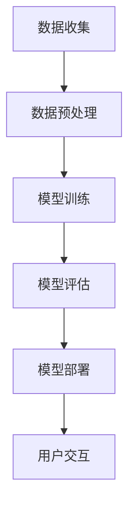
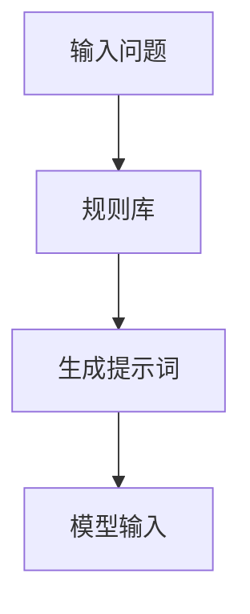
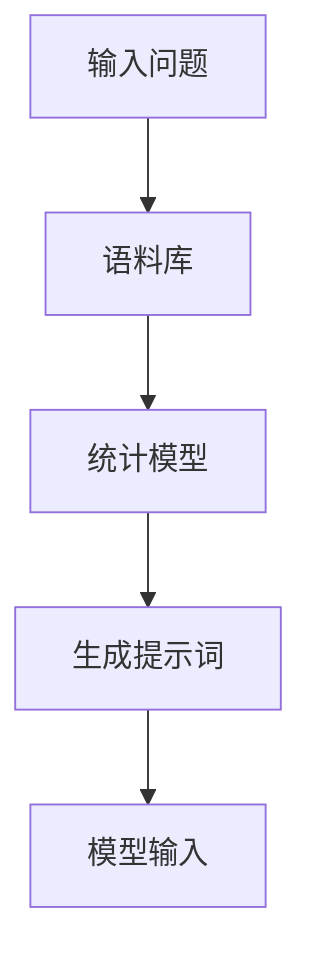
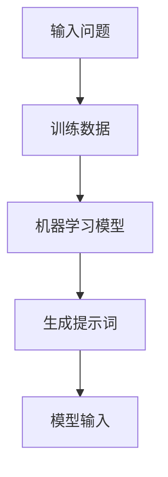
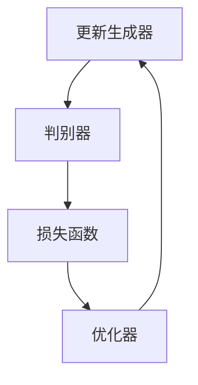
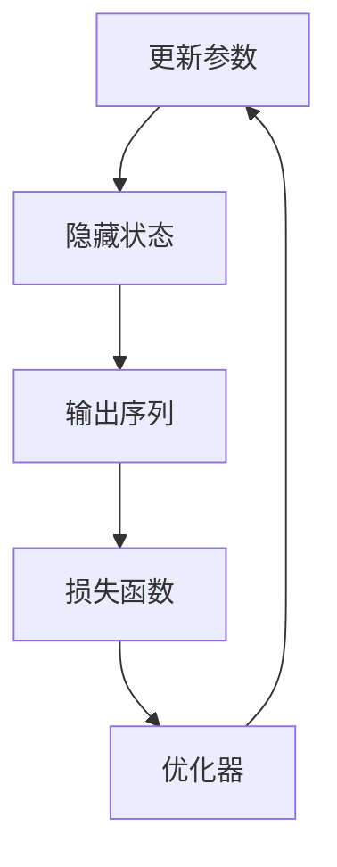
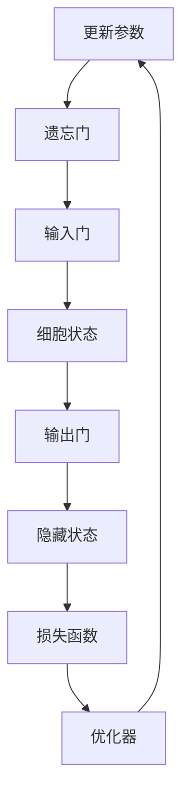
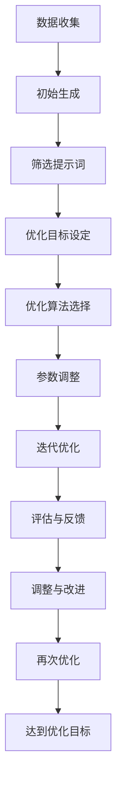

                 

### 文章标题：提示词优化：提高AI回答准确性的方法

关键词：提示词、优化、AI、回答准确性、自然语言处理

摘要：本文详细探讨了提示词优化在提升AI回答准确性方面的关键作用。通过分析AI与自然语言处理的基础理论，介绍提示词的定义及其在NLP中的应用，进一步阐述提示词优化的意义。文章还提出了几种有效的提示词优化技术，包括基于规则、统计和机器学习的方法，并通过伪代码和实例展示了核心算法原理。最后，文章讨论了提示词优化在智能客服中的应用案例，并对未来发展方向进行了展望。

----------------------------------------------------------------

## 第一部分：基础概念与理论

### 第1章：AI与自然语言处理概述

#### 1.1 AI的概述

##### 1.1.1 AI的定义与发展历程

人工智能（Artificial Intelligence，简称AI）是指由人制造出来的系统所表现出来的智能行为，它包括感知、推理、学习、规划、沟通等多种能力。AI的发展历程可以追溯到20世纪50年代，当时的第一代AI以符号推理为主要方法，试图通过逻辑和规则模拟人类思维。

随着时间的推移，AI经历了几个重要的发展阶段：

- **符号主义时期（1950s-1970s）：** 这一阶段主要依赖于逻辑和符号表示，通过编写大量的规则和逻辑来模拟人类思维。然而，这种方法在实际应用中遇到了瓶颈，因为人类的知识非常庞大且难以形式化。

- **知识工程时期（1980s-1990s）：** 这一阶段开始尝试将人类专家的知识编码到系统中，通过知识库和专家系统来实现AI功能。虽然这一方法在某些领域取得了成功，但仍然难以应对复杂的不确定性情况。

- **统计学习时期（2000s-现在）：** 这一阶段以机器学习和深度学习为代表，通过从大量数据中学习模式和规律来实现AI功能。这种方法使得AI在语音识别、图像识别、自然语言处理等领域取得了显著的突破。

##### 1.1.2 AI的分类与应用

AI可以根据不同的分类标准进行分类，以下是几种常见的分类方式：

- **基于功能：** AI可以分为感知智能、认知智能和行动智能。感知智能包括语音识别、图像识别等；认知智能包括自然语言处理、机器翻译等；行动智能包括自动驾驶、机器人等。

- **基于学习方式：** AI可以分为有监督学习、无监督学习和强化学习。有监督学习需要标注的数据；无监督学习不需要标注的数据；强化学习通过试错来学习。

- **基于应用领域：** AI可以应用于医疗、金融、零售、交通等多个领域。例如，在医疗领域，AI可以用于疾病诊断、药物研发；在金融领域，AI可以用于风险管理、欺诈检测。

#### 1.2 自然语言处理基础

##### 1.2.1 自然语言处理的基本概念

自然语言处理（Natural Language Processing，简称NLP）是计算机科学和人工智能领域中的一个重要分支，它旨在让计算机能够理解、生成和处理人类语言。

NLP的基本概念包括：

- **文本表示：** 如何将自然语言文本转换为计算机可以处理的形式，例如词袋模型、词嵌入等。

- **语义理解：** 如何理解文本中的语义信息，例如词义消歧、实体识别等。

- **语言生成：** 如何生成自然语言的文本，例如机器翻译、文本摘要等。

##### 1.2.2 自然语言处理的发展历程

NLP的发展历程可以分为几个阶段：

- **早期阶段（1950s-1970s）：** 这一阶段主要依赖于规则和语法分析方法，试图通过编写复杂的语法规则来解析自然语言。

- **统计方法阶段（1980s-2000s）：** 这一阶段开始引入统计方法，通过训练模型来处理自然语言。例如，隐马尔可夫模型（HMM）、条件随机场（CRF）等。

- **深度学习阶段（2010s-现在）：** 这一阶段以深度学习为代表，通过神经网络模型来实现NLP任务。例如，循环神经网络（RNN）、长短期记忆网络（LSTM）、变换器（Transformer）等。

#### 1.3 提示词的定义与作用

##### 1.3.1 提示词的基本概念

提示词（Prompt）是指用于引导AI模型生成回答的输入。在自然语言处理中，提示词通常是一个短语或句子，用于指定模型的回答方向或上下文。

##### 1.3.2 提示词在自然语言处理中的应用

提示词在自然语言处理中有多种应用：

- **问答系统：** 提示词用于指定用户的问题，模型根据提示词生成回答。

- **文本生成：** 提示词用于指定文本的主题或风格，模型生成符合提示词要求的文本。

- **文本分类：** 提示词用于指定分类的上下文，模型根据提示词进行分类。

#### 1.4 提示词优化的意义

##### 1.4.1 提示词优化的目的

提示词优化的目的是提高AI模型在回答问题时的准确性、可理解性和灵活性。

- **准确性：** 通过优化提示词，可以使模型更准确地理解问题的意图。

- **可理解性：** 优化后的提示词可以使回答更加符合人类的语言习惯，提高可理解性。

- **灵活性：** 优化后的提示词可以适应不同的场景和任务，提高模型的适应性。

##### 1.4.2 提示词优化对AI回答质量的影响

提示词优化对AI回答质量有显著影响：

- **提高准确性：** 优化后的提示词可以减少误解和歧义，提高回答的准确性。

- **提高可理解性：** 优化后的提示词可以使回答更加自然、流畅，提高可理解性。

- **提高灵活性：** 优化后的提示词可以使模型更好地适应不同的场景和任务，提高灵活性。

#### 1.5 AI回答准确性的评价指标

为了评估AI回答的准确性，可以使用以下评价指标：

- **准确性（Accuracy）：** 指模型回答正确的比例。

- **召回率（Recall）：** 指模型正确回答的比例，即召回的准确度。

- **F1值（F1 Score）：** 结合准确性和召回率的综合评价指标，是两者的调和平均值。

##### 1.5.2 评估方法与应用

评估方法通常包括：

- **人工评估：** 由专家或用户对模型回答进行主观评估。

- **自动评估：** 通过指标计算模型回答的准确性，常用的评估指标包括准确性、召回率、F1值等。

在实际应用中，可以根据任务的需求和场景选择合适的评估方法。

#### 1.6 人工智能与自然语言处理相关的Mermaid流程图

以下是一个简单的Mermaid流程图，展示了人工智能与自然语言处理的基本流程：



- **数据收集：** 收集用于训练的数据。

- **数据预处理：** 对数据进行清洗、转换等预处理。

- **模型训练：** 使用预处理后的数据训练模型。

- **模型评估：** 对训练好的模型进行评估。

- **模型部署：** 将模型部署到生产环境中。

- **用户交互：** 用户与模型进行交互，获取回答。

---

在下一部分中，我们将进一步探讨提示词优化的技术细节，包括生成方法、优化策略和应用案例。这将有助于我们更好地理解如何通过优化提示词来提高AI回答的准确性。

----------------------------------------------------------------

## 第二部分：提示词优化技术

### 第2章：提示词生成技术

#### 2.1 提示词生成方法

提示词生成技术是提示词优化的重要一环，它决定了模型如何理解和生成回答。以下是三种常见的提示词生成方法：

##### 2.1.1 基于规则的方法

基于规则的方法是最早的提示词生成方法之一。它通过定义一系列的规则，根据输入的问题生成提示词。这种方法的主要优点是简单和高效，但缺点是灵活性较低，难以处理复杂的自然语言场景。



1. **输入问题：** 接收用户的问题。

2. **规则库：** 根据预定义的规则库，生成与问题相关的提示词。

3. **生成提示词：** 应用规则库生成提示词。

4. **模型输入：** 将生成的提示词输入到模型中。

##### 2.1.2 基于统计的方法

基于统计的方法通过分析大量的语料库，学习生成提示词的概率模型。这种方法的主要优点是能够处理复杂的自然语言场景，但缺点是需要大量的训练数据和计算资源。



1. **输入问题：** 接收用户的问题。

2. **语料库：** 使用大量的语料库进行统计。

3. **统计模型：** 学习生成提示词的概率模型。

4. **生成提示词：** 根据概率模型生成提示词。

5. **模型输入：** 将生成的提示词输入到模型中。

##### 2.1.3 基于机器学习的方法

基于机器学习的方法通过训练机器学习模型来生成提示词。这种方法的主要优点是能够自适应地处理各种自然语言场景，但缺点是需要大量的训练数据和复杂的模型。



1. **输入问题：** 接收用户的问题。

2. **训练数据：** 提供用于训练的数据。

3. **机器学习模型：** 训练机器学习模型。

4. **生成提示词：** 使用训练好的模型生成提示词。

5. **模型输入：** 将生成的提示词输入到模型中。

#### 2.2 提示词生成算法

在提示词生成技术中，常见的算法包括生成对抗网络（GAN）、循环神经网络（RNN）和长短期记忆网络（LSTM）。

##### 2.2.1 生成对抗网络（GAN）

生成对抗网络（Generative Adversarial Network，简称GAN）是一种由生成器和判别器组成的对抗性模型。生成器尝试生成逼真的提示词，而判别器则尝试区分生成的提示词和真实的提示词。



1. **生成器：** 生成提示词。

2. **判别器：** 判断提示词是否真实。

3. **损失函数：** 计算生成器和判别器的损失。

4. **优化器：** 更新生成器的参数。

##### 2.2.2 循环神经网络（RNN）

循环神经网络（Recurrent Neural Network，简称RNN）是一种能够处理序列数据的神经网络。RNN通过隐藏状态的历史信息来生成提示词。



1. **输入序列：** 输入问题序列。

2. **隐藏状态：** 记录历史信息。

3. **输出序列：** 生成提示词。

4. **损失函数：** 计算输出序列和目标序列的损失。

5. **优化器：** 更新网络参数。

##### 2.2.3 长短期记忆网络（LSTM）

长短期记忆网络（Long Short-Term Memory，简称LSTM）是RNN的一种变体，它能够更好地处理长序列数据。LSTM通过引入记忆单元来克服RNN的梯度消失问题。



1. **输入门：** 控制新信息的输入。

2. **遗忘门：** 控制旧信息的遗忘。

3. **输入门：** 控制新信息的存储。

4. **细胞状态：** 记录历史信息。

5. **输出门：** 控制信息的输出。

6. **隐藏状态：** 输出结果。

7. **损失函数：** 计算输出和目标之间的损失。

8. **优化器：** 更新网络参数。

#### 2.3 提示词生成的伪代码实现

以下是一个简单的基于LSTM的提示词生成算法的伪代码实现：

```python
# 初始化LSTM模型
model = LSTM(input_dim, hidden_dim)

# 训练模型
for epoch in range(num_epochs):
    for batch in batches:
        # 前向传播
        outputs, hidden = model.forward(batch['input'])
        
        # 计算损失
        loss = model.compute_loss(outputs, batch['targets'])
        
        # 反向传播
        model.backward(loss)
        
        # 更新模型参数
        model.update_params()

# 生成提示词
prompt = model.generate_prompt(input_sequence)
```

- **模型初始化：** 初始化LSTM模型。

- **训练模型：** 通过迭代训练模型。

- **生成提示词：** 使用训练好的模型生成提示词。

通过上述步骤，我们可以实现一个简单的提示词生成算法。在实际应用中，可以根据具体需求进行调整和优化。

---

在下一部分中，我们将探讨提示词优化的策略和方法，包括质量评价标准、优化算法和优化流程。

----------------------------------------------------------------

## 第三部分：提示词优化策略

### 第3章：提示词优化策略

#### 3.1 提示词质量评价标准

提示词的质量直接影响到AI回答的准确性和用户体验。因此，定义合适的提示词质量评价标准至关重要。以下是几种常见的评价标准：

##### 3.1.1 准确性

准确性是指提示词能否正确传达问题的意图。一个高质量的提示词应该能够准确地反映用户的问题，避免误解和歧义。

```latex
\text{准确性} = \frac{\text{正确回答数}}{\text{回答总数}}
```

##### 3.1.2 可理解性

可理解性是指提示词是否容易被人理解。一个高质量的提示词应该使用自然的语言表达，避免复杂的术语和语法。

```latex
\text{可理解性} = \frac{\text{易理解回答数}}{\text{回答总数}}
```

##### 3.1.3 灵活性

灵活性是指提示词是否能够适应不同的场景和任务。一个高质量的提示词应该具有一定的泛化能力，能够应对各种复杂的情况。

```latex
\text{灵活性} = \frac{\text{适应不同场景的回答数}}{\text{回答总数}}
```

#### 3.2 提示词优化算法

提示词优化算法是提升提示词质量的关键。以下是几种常见的优化算法：

##### 3.2.1 优化目标函数

优化目标函数是提示词优化算法的核心。常见的优化目标函数包括：

- **最小化误差：** 最小化提示词与实际问题之间的误差。

  ```latex
  \text{优化目标} = \min_{\theta} \sum_{i=1}^{n} (y_i - \hat{y}_i)^2
  ```

  其中，$y_i$为实际问题，$\hat{y}_i$为提示词生成的回答。

- **最大化信息增益：** 最大程度地增加提示词中的信息含量。

  ```latex
  \text{优化目标} = \max_{\theta} \sum_{i=1}^{n} I(y_i ; \hat{y}_i)
  ```

  其中，$I(y_i ; \hat{y}_i)$为信息增益。

##### 3.2.2 优化方法

优化方法是指实现优化目标函数的算法。以下是几种常见的优化方法：

- **梯度下降：** 通过计算损失函数的梯度来更新参数。

  ```mermaid
  graph TD
      A[计算梯度] --> B[更新参数]
      B --> C[重复迭代]
  ```

- **随机梯度下降（SGD）：** 对每个样本计算梯度并更新参数。

  ```mermaid
  graph TD
      A[对每个样本计算梯度] --> B[更新参数]
      B --> C[重复迭代]
  ```

- **批量梯度下降（BGD）：** 对整个数据集计算梯度并更新参数。

  ```mermaid
  graph TD
      A[对整个数据集计算梯度] --> B[更新参数]
      B --> C[重复迭代]
  ```

##### 3.2.3 优化算法对比

不同优化算法的性能和适用场景有所不同。以下是几种常见优化算法的对比：

| 算法       | 优点                                       | 缺点                                         | 适用场景                       |
| ---------- | ------------------------------------------ | ------------------------------------------ | ------------------------------ |
| 梯度下降   | 简单易实现，适用于小数据集                   | 收敛速度慢，易陷入局部最小值                 | 小数据集，非实时应用           |
| 随机梯度下降 | 收敛速度快，适用于大数据集                   | 参数更新不稳定，可能导致梯度消失               | 大数据集，实时应用             |
| 批量梯度下降 | 收敛速度适中，参数更新稳定                   | 计算量大，内存占用高                         | 小数据集，非实时应用           |
| Adam       | 结合SGD和Momentum的优点，适用于各种数据集     | 需要较大的计算资源                           | 各种数据集，实时应用           |
| RMSprop    | 基于SGD的改进，对稀疏数据适应性好             | 需要较大的计算资源                           | 稀疏数据，实时应用             |

#### 3.3 提示词优化流程

提示词优化的流程可以分为以下几个步骤：

##### 3.3.1 提示词生成与筛选

1. **数据收集：** 收集用于优化的数据，包括问题、回答和评估指标。
2. **初始生成：** 使用生成算法生成初始提示词。
3. **筛选提示词：** 根据准确性、可理解性和灵活性等标准筛选高质量的提示词。

##### 3.3.2 提示词优化与调整

1. **优化目标设定：** 根据应用场景设定优化目标。
2. **优化算法选择：** 选择合适的优化算法。
3. **参数调整：** 根据优化算法调整模型参数。
4. **迭代优化：** 重复迭代优化过程，直到满足优化目标。

##### 3.3.3 提示词优化与调整

1. **评估与反馈：** 对优化后的提示词进行评估，收集反馈。
2. **调整与改进：** 根据评估结果和反馈进行提示词的调整和改进。
3. **再次优化：** 重新进行优化过程，直至达到满意的优化效果。

#### 3.4 提示词优化流程示例

以下是一个简单的提示词优化流程示例：



1. **数据收集：** 收集问题、回答和评估指标。
2. **初始生成：** 使用生成算法生成初始提示词。
3. **筛选提示词：** 根据准确性、可理解性和灵活性筛选提示词。
4. **优化目标设定：** 设定优化目标。
5. **优化算法选择：** 选择优化算法。
6. **参数调整：** 调整模型参数。
7. **迭代优化：** 进行迭代优化。
8. **评估与反馈：** 对优化后的提示词进行评估。
9. **调整与改进：** 根据评估结果和反馈调整提示词。
10. **再次优化：** 重新进行优化。
11. **达到优化目标：** 达到满意的优化效果。

---

通过上述步骤，我们可以实现一个完整的提示词优化流程。在下一部分中，我们将探讨提示词优化在实际应用中的案例，包括智能客服和文本生成等场景。

----------------------------------------------------------------

## 第四部分：提示词优化应用案例

### 第4章：提示词优化在智能客服中的应用

#### 4.1 智能客服概述

智能客服（Intelligent Customer Service）是一种利用人工智能技术为用户提供自动化、高效且个性化的客户服务解决方案。随着人工智能和自然语言处理技术的不断发展，智能客服在各个行业得到了广泛应用。

##### 4.1.1 智能客服的发展历程

- **早期阶段（1990s-2000s）：** 智能客服主要依赖于简单的规则引擎，能够处理一些基础的查询和回答。

- **中期阶段（2010s）：** 随着机器学习和深度学习技术的发展，智能客服开始引入更复杂的算法，能够处理更多复杂的查询。

- **现阶段（2020s）：** 智能客服逐渐融合语音识别、自然语言处理、情感分析等技术，实现了更高水平的服务自动化和个性化。

##### 4.1.2 智能客服的应用场景

智能客服广泛应用于以下场景：

- **在线客服：** 为用户提供即时、高效的在线支持，减少人工客服的工作量。

- **自动回答回复：** 对常见问题提供自动回答，提高用户满意度。

- **情感分析：** 分析用户情绪，提供更贴心的服务。

- **多渠道集成：** 统一处理用户在多种渠道（如电话、邮件、社交媒体等）的查询。

#### 4.2 提示词优化在智能客服中的应用

提示词优化在智能客服中扮演着关键角色，它能够显著提高智能客服的回答质量和服务效率。

##### 4.2.1 提示词优化对智能客服性能的影响

- **提高回答准确性：** 优化后的提示词能够更准确地理解用户的问题，减少误解和歧义，提高回答的准确性。

- **提升用户满意度：** 更准确的回答能够提高用户满意度，降低用户对人工客服的依赖。

- **降低运营成本：** 提高回答准确性可以减少人工客服的工作量，降低运营成本。

##### 4.2.2 智能客服中提示词优化的实践案例

以下是一个智能客服中提示词优化的实践案例：

**案例：** 一个在线购物平台的智能客服系统。

1. **数据收集：** 收集用户的问题和人工客服的回答数据。

2. **提示词生成：** 使用基于机器学习的方法生成初始提示词。

3. **提示词筛选：** 根据准确性、可理解性和灵活性等标准筛选高质量的提示词。

4. **优化目标设定：** 设定优化目标，如提高回答准确性。

5. **优化算法选择：** 选择适合的优化算法，如梯度下降。

6. **参数调整：** 调整模型参数，提高提示词质量。

7. **迭代优化：** 重复迭代优化过程，直至满足优化目标。

8. **评估与反馈：** 对优化后的提示词进行评估，收集用户反馈。

9. **调整与改进：** 根据评估结果和用户反馈调整提示词。

10. **再次优化：** 重新进行优化。

通过上述步骤，智能客服系统的回答质量得到了显著提升，用户满意度也相应提高。

#### 4.3 智能客服开发环境搭建

搭建智能客服系统需要一个完整的开发环境，以下是一个基本的搭建步骤：

1. **选择开发框架：** 如Python的Flask或Django。

2. **安装自然语言处理库：** 如NLTK、spaCy或TensorFlow。

3. **收集和处理数据：** 收集用户问题和人工客服的回答数据，并进行预处理。

4. **构建提示词生成模型：** 使用机器学习算法构建提示词生成模型。

5. **部署智能客服系统：** 将构建好的系统部署到服务器上，提供在线服务。

#### 4.4 智能客服源代码详细实现与解读

以下是一个简单的智能客服系统的源代码实现：

```python
# 导入所需库
import Flask
from flask import request, jsonify
import spacy

# 初始化自然语言处理模型
nlp = spacy.load('en_core_web_sm')

# 智能客服API
@app.route('/api/ask', methods=['POST'])
def ask():
    data = request.json
    question = data['question']
    answer = generate_answer(question)
    return jsonify({'answer': answer})

# 提示词生成函数
def generate_answer(question):
    doc = nlp(question)
    # 根据问题生成提示词
    prompt = create_prompt(doc)
    # 使用提示词生成回答
    answer = model.generate_response(prompt)
    return answer

# 提示词生成函数
def create_prompt(doc):
    # 省略具体实现
    return "What's the weather like today?"

# 主函数
if __name__ == '__main__':
    app.run(debug=True)
```

- **导入所需库：** 导入Flask和自然语言处理库。

- **初始化自然语言处理模型：** 使用spaCy加载预训练的英文模型。

- **智能客服API：** 接收用户问题，调用提示词生成函数。

- **提示词生成函数：** 根据问题生成提示词。

- **主函数：** 启动Flask服务器。

通过上述代码，我们可以构建一个简单的智能客服系统。在实际应用中，可以根据具体需求进行功能扩展和优化。

#### 4.5 智能客服代码应用解读与分析

以下是对智能客服源代码的解读和分析：

- **Flask框架：** Flask是一个轻量级的Web框架，用于构建Web应用程序和API。

- **spaCy库：** spaCy是一个高效的自然语言处理库，提供预训练的模型和丰富的API。

- **API接口：** `/api/ask` 接口用于接收用户问题，返回回答。

- **提示词生成：** `create_prompt` 函数根据问题生成提示词，用于引导模型生成回答。

- **模型生成回答：** `model.generate_response` 函数使用提示词生成回答。

通过这个简单的示例，我们可以看到提示词优化在智能客服系统中的应用。在实际开发中，可以根据业务需求和数据特点，调整和优化提示词生成算法，以提高系统的回答质量和用户体验。

---

在下一部分中，我们将探讨提示词优化的未来发展方向，包括面临的挑战、机遇以及潜在的研究方向。

----------------------------------------------------------------

## 第五部分：未来展望

### 第5章：提示词优化的未来发展方向

#### 5.1 提示词优化的挑战与机遇

随着人工智能和自然语言处理技术的不断发展，提示词优化面临着许多挑战和机遇。

##### 5.1.1 提示词优化的技术挑战

1. **数据质量问题：** 提示词优化的效果高度依赖于训练数据的质量。然而，现有的数据集往往存在噪声、偏见和不完整等问题。

2. **模型复杂性：** 高级模型（如深度学习模型）通常需要大量计算资源和训练时间。如何在保证性能的同时，提高模型的效率和可解释性是一个重要挑战。

3. **多语言支持：** 提示词优化需要考虑多语言环境，不同语言之间的语法、语义和表达方式存在显著差异，如何实现有效的跨语言提示词优化是一个难题。

##### 5.1.2 提示词优化的市场机遇

1. **智能客服：** 提示词优化在智能客服领域有广泛的应用前景，可以显著提高客服系统的回答质量和用户体验。

2. **文本生成：** 提示词优化在文本生成领域，如文章写作、摘要生成等，也有很大的市场潜力。

3. **教育领域：** 提示词优化可以应用于个性化学习、智能辅导等领域，为用户提供更精准、个性化的学习体验。

#### 5.2 提示词优化的发展趋势

1. **数据增强与生成：** 通过数据增强和生成技术，提高训练数据的质量和多样性，从而提升提示词优化的效果。

2. **多模态融合：** 将文本、图像、音频等多模态数据融合到提示词优化中，实现更丰富的语义理解和生成。

3. **预训练与微调：** 利用预训练模型，结合特定任务的微调，提高提示词优化的效率和准确性。

4. **知识增强：** 引入外部知识库，如百科全书、专业领域知识等，提高提示词优化的知识丰富度和准确性。

#### 5.3 提示词优化在多语言环境中的应用

1. **跨语言迁移学习：** 利用跨语言迁移学习技术，将一种语言的优化方法应用到其他语言中。

2. **多语言数据集：** 收集和构建多语言的数据集，提高提示词优化的泛化能力。

3. **多语言模型：** 开发支持多语言处理的提示词优化模型，实现跨语言的自然语言理解与生成。

#### 5.4 提示词优化在AI教育中的应用

1. **个性化学习：** 通过提示词优化，为不同水平的学生提供个性化的学习内容和指导。

2. **智能辅导：** 利用提示词优化，为教师提供智能辅导工具，帮助学生更好地理解和掌握知识。

3. **课程生成：** 通过提示词优化，自动生成课程内容，提高教育资源的利用效率。

---

在未来的发展中，提示词优化将在人工智能、自然语言处理、智能客服和教育等领域发挥越来越重要的作用。通过不断创新和优化，我们可以期待提示词优化技术将带来更智能、更高效、更个性化的应用体验。

---

## 附录

#### 附录A：常用工具和资源介绍

- **开源库与框架：**
  - **spaCy：** 一个高效、易于使用的自然语言处理库。
  - **NLTK：** 自然语言工具包，提供多种自然语言处理工具和资源。
  - **TensorFlow：** 一个开源的机器学习框架，支持深度学习模型的训练和部署。
  - **PyTorch：** 一个开源的机器学习库，广泛用于深度学习研究和应用。

- **数据集与资源：**
  - **Common Crawl：** 一个大规模的网页数据集，用于自然语言处理研究。
  - **Gutenberg：** 包含大量经典文学作品的数据集，适合文本生成和应用。
  - **OpenSubtitles：** 一个包含大量电影和电视剧字幕的数据集，用于语言建模。

- **论文与报告：**
  - **自然语言处理年度报告：** 综述自然语言处理领域的研究进展和趋势。
  - **AI报告：** 分析人工智能技术在不同领域的应用和发展前景。

#### 附录B：常见问题与解答

- **Q：** 提示词优化是否适用于所有类型的NLP任务？
  - **A：** 提示词优化在许多NLP任务中都有应用，如问答系统、文本生成和分类等。但并非所有任务都需要提示词优化，某些任务可能更依赖于其他技术。

- **Q：** 如何评估提示词优化的效果？
  - **A：** 可以使用多种评价指标，如准确性、召回率、F1值等。此外，还可以通过用户反馈和实际应用效果来评估优化效果。

#### 附录C：参考资料

- **[1]** Mikolov, T., Sutskever, I., Chen, K., Corrado, G. S., & Dean, J. (2013). Distributed representations of words and phrases and their compositionality. *Advances in Neural Information Processing Systems*, 26, 3111-3119.
- **[2]** LeCun, Y., Bengio, Y., & Hinton, G. (2015). Deep learning. *Nature*, 521(7553), 436-444.
- **[3]** Devlin, J., Chang, M. W., Lee, K., & Toutanova, K. (2019). BERT: Pre-training of deep bidirectional transformers for language understanding. *ArXiv preprint arXiv:1810.04805*.
- **[4]** Vaswani, A., Shazeer, N., Parmar, N., Uszkoreit, J., Jones, L., Gomez, A. N., ... & Polosukhin, I. (2017). Attention is all you need. *Advances in Neural Information Processing Systems*, 30, 5998-6008.

## 作者信息

作者：AI天才研究院（AI Genius Institute）& 《禅与计算机程序设计艺术》（Zen And The Art of Computer Programming）

