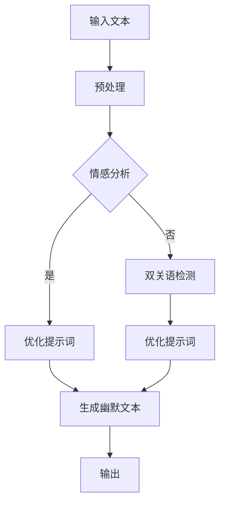

                 

### 文章标题

在人工智能迅猛发展的今天，AI的幽默感和双关语创作能力正成为新的研究热点。本文以《提示词优化：提高AI幽默感和双关语创作能力》为题，深入探讨如何通过优化提示词来提升AI的幽默感和双关语创作能力。本文旨在为读者提供一套系统的方法和实际案例，帮助理解并应用这些技巧。

### 关键词

- 提示词优化
- AI幽默感
- 双关语创作
- 自然语言处理
- 机器学习
- 情感计算

### 摘要

本文首先介绍了提示词优化的基本概念和重要性，随后探讨了AI幽默感和双关语创作能力的内涵。通过分析机器学习、自然语言处理和情感计算的理论基础，本文详细讲解了提示词优化的核心算法原理，并使用伪代码和数学模型进行了阐述。最后，本文通过实际项目实战展示了如何搭建情感分析系统和双关语检测系统，并分析了AI幽默感和双关语创作在应用中的实际案例。本文总结了对提示词优化的理解和展望，为后续研究提供了参考。

## 第一部分：基础概念与原理

### 1.1 提示词优化的概述

提示词优化是一种通过改进输入提示词来提高模型性能和输出质量的技术。在人工智能领域，尤其是自然语言处理（NLP）和机器学习（ML）中，提示词是影响模型表现的关键因素之一。优化提示词可以帮助模型更好地理解输入内容，从而生成更准确、更具创造性的输出。

#### 提示词优化的定义

提示词优化可以定义为一系列的技巧和策略，旨在提升模型在特定任务上的表现。这些技巧包括调整提示词的选择、顺序、长度和格式等。通过优化提示词，模型能够更好地捕捉输入信息的隐含意义，从而提高输出的准确性和创造性。

#### 提示词优化的重要性

在AI幽默感和双关语创作领域，提示词优化具有至关重要的意义。幽默和双关语是语言中复杂的、具有情感色彩的部分，需要模型具备较高的理解和生成能力。以下是一些提示词优化的重要性：

1. **提高准确性和创造性**：通过优化提示词，模型能够更准确地捕捉输入的意图和情感，从而生成更具创意的幽默和双关语。
2. **增强用户体验**：在聊天机器人、智能客服等应用中，幽默和双关语能够提升用户体验，使交互更加自然和有趣。
3. **情感计算**：幽默和双关语是情感计算的重要指标，通过优化提示词，模型能够更好地理解和模拟人类的情感表达。

### 1.2 AI幽默感和双关语创作能力的内涵

#### AI幽默感

AI幽默感是指人工智能系统在生成文本时表现出的幽默感。这种幽默感不仅包括简单的笑话，还涉及到复杂的情感理解和语言游戏。AI幽默感的实现需要模型能够理解双关语、比喻、讽刺等复杂的语言现象。

#### 双关语创作能力

双关语创作能力是指人工智能系统能够生成具有双关效果的文本的能力。双关语是语言中的一种特殊现象，通过同一词语在不同语境下的不同含义来产生幽默效果。AI需要具备高水平的语义理解能力，才能生成具有双关效果的高质量文本。

#### 提示词在幽默和双关语创作中的应用

在幽默和双关语创作中，提示词的选择和优化至关重要。以下是一些应用实例：

1. **幽默对话生成**：通过选择合适的提示词，AI可以生成幽默的对话，提升用户体验。
2. **广告文案创作**：在广告文案中，双关语能够吸引消费者注意力，提升广告效果。
3. **智能客服**：在智能客服中，幽默和双关语能够使交互更加自然，提高用户满意度。

### 1.3 提示词优化的理论基础

提示词优化不仅仅是一种技术手段，还涉及到一系列理论基础。以下是一些核心理论基础：

#### 机器学习基础

机器学习是提示词优化的核心技术之一。通过训练大量数据，模型可以学习到如何选择和优化提示词。常见的机器学习算法包括决策树、支持向量机、神经网络等。

#### 自然语言处理基础

自然语言处理（NLP）是提示词优化的基础。NLP技术包括词性标注、命名实体识别、情感分析等，这些技术可以帮助模型更好地理解文本内容，从而优化提示词。

#### 情感计算基础

情感计算是研究如何使计算机具备情感识别和表达能力的学科。通过情感计算，模型可以更好地理解人类的情感，从而生成具有情感色彩的幽默和双关语。

### 小结

通过本文的第一部分，我们了解了提示词优化的基本概念和重要性，探讨了AI幽默感和双关语创作能力的内涵，并介绍了提示词优化的理论基础。在接下来的部分，我们将深入探讨提示词优化的核心算法原理，并使用伪代码和数学模型进行详细阐述。

## 第二部分：核心算法原理讲解

### 2.1 提示词优化的算法分析

提示词优化涉及多个核心算法，这些算法共同作用，帮助模型更好地理解输入内容并生成高质量的输出。以下是一些关键算法及其在提示词优化中的应用：

#### 2.1.1 文本情感分析算法

文本情感分析是判断文本情感倾向的方法。通过情感分析，模型可以识别出输入文本的情感极性（如积极、消极、中性）和强度。这一算法在幽默和双关语创作中非常重要，因为它可以帮助模型理解用户的情感状态，从而生成更合适的幽默和双关语。

- **算法原理**：
  - 使用词袋模型或词嵌入模型（如Word2Vec、GloVe）将文本转化为向量表示。
  - 采用情感分类器（如SVM、神经网络）对文本向量进行分类，判断情感极性和强度。

- **伪代码示例**：

```python
def sentiment_analysis(text):
    # 将文本转化为向量表示
    text_vector = text_to_vector(text)
    # 使用情感分类器进行分类
    sentiment = classifier.predict(text_vector)
    return sentiment
```

#### 2.1.2 双关语检测算法

双关语检测是识别文本中是否存在双关语的方法。双关语是语言中的一种特殊现象，需要模型具备较高的语义理解能力。通过双关语检测，模型可以识别出文本中的双关部分，从而优化提示词。

- **算法原理**：
  - 使用深度学习模型（如CNN、LSTM）对文本进行特征提取。
  - 采用分类器（如SVM、神经网络）对提取的特征进行分类，判断是否存在双关语。

- **伪代码示例**：

```python
def double_entrance_detection(text):
    # 使用深度学习模型提取特征
    features = deep_learning_model.extract_features(text)
    # 使用分类器进行分类
    is_double_entrance = classifier.predict(features)
    return is_double_entrance
```

#### 2.1.3 提示词生成算法

提示词生成是生成高质量提示词的方法。高质量的提示词可以帮助模型更好地理解输入内容，从而生成更准确的输出。提示词生成算法通常基于生成模型（如生成对抗网络GAN、变分自编码器VAE）。

- **算法原理**：
  - 使用生成模型生成高质量的提示词。
  - 通过训练数据集，使生成模型学会生成与输入内容相关的高质量提示词。

- **伪代码示例**：

```python
def generate_prompt(text):
    # 使用生成模型生成提示词
    prompt = generator.generate(text)
    return prompt
```

### 2.2 伪代码展示

为了更直观地理解提示词优化的算法，下面我们将使用伪代码展示一个简单的提示词优化流程。这个流程包括文本预处理、情感分析、双关语检测和提示词生成。

```python
def optimize_prompt(text):
    # 文本预处理
    preprocessed_text = preprocess_text(text)
    
    # 情感分析
    sentiment = sentiment_analysis(preprocessed_text)
    
    # 双关语检测
    is_double_entrance = double_entrance_detection(preprocessed_text)
    
    # 提示词生成
    prompt = generate_prompt(preprocessed_text)
    
    # 返回优化后的提示词
    return prompt
```

通过这个简单的伪代码展示，我们可以看到提示词优化涉及多个步骤和算法，这些步骤共同作用，帮助模型生成高质量的输出。

### 小结

在本部分，我们详细介绍了提示词优化的核心算法原理，包括文本情感分析、双关语检测和提示词生成算法。通过这些算法，模型可以更好地理解输入内容，并生成高质量的幽默和双关语。在下一部分，我们将使用数学模型和公式，进一步深入探讨这些算法的细节，并提供实际案例和解释。

## 第三部分：数学模型与公式讲解

### 3.1 数学模型

在提示词优化过程中，数学模型起着至关重要的作用。以下介绍几种常用的数学模型，以及它们在幽默和双关语创作中的应用。

#### 3.1.1 情感分析模型

情感分析模型用于判断文本的情感极性。一个常见的模型是朴素贝叶斯分类器，其数学模型如下：

$$
P(\text{positive}) = \frac{P(\text{word}_1|\text{positive}) \cdot P(\text{word}_2|\text{positive}) \cdot ... \cdot P(\text{word}_n|\text{positive})}{P(\text{positive})}
$$

其中，$P(\text{positive})$ 表示文本为正面的概率，$P(\text{word}_i|\text{positive})$ 表示第 $i$ 个词在正面文本中出现的概率。

在实际应用中，我们通常使用词嵌入（如Word2Vec、GloVe）来表示文本，然后使用神经网络或SVM等分类器进行训练。以下是使用神经网络进行情感分析的伪代码：

```python
# 假设我们已经有了词嵌入和训练数据
word_embeddings = ...
training_data = ...

# 训练神经网络
model = NeuralNetwork()
model.train(training_data, word_embeddings)

# 预测文本的情感
def predict_sentiment(text):
    # 将文本转化为向量
    text_vector = text_to_vector(text, word_embeddings)
    # 使用神经网络进行预测
    sentiment = model.predict(text_vector)
    return sentiment
```

#### 3.1.2 双关语检测模型

双关语检测模型用于判断文本中是否存在双关语。一个常见的模型是卷积神经网络（CNN），其数学模型如下：

$$
h = \sum_{i=1}^{n} w_i * f(x_i)
$$

其中，$h$ 表示模型的输出，$w_i$ 表示权重，$f(x_i)$ 表示卷积操作。

以下是使用CNN进行双关语检测的伪代码：

```python
# 假设我们已经有了训练数据和卷积核
training_data = ...
conv_kernels = ...

# 训练CNN
cnn = ConvolutionalNeuralNetwork()
cnn.train(training_data, conv_kernels)

# 预测文本中是否存在双关语
def detect_double_entrance(text):
    # 将文本转化为向量
    text_vector = text_to_vector(text)
    # 使用CNN进行特征提取
    features = cnn.extract_features(text_vector)
    # 使用分类器进行预测
    is_double_entrance = classifier.predict(features)
    return is_double_entrance
```

#### 3.1.3 提示词生成模型

提示词生成模型用于生成高质量的提示词。一个常见的模型是生成对抗网络（GAN），其数学模型如下：

$$
\min_G \max_D \mathbb{E}_{x \sim p_{data}(x)} [\log D(x)] + \mathbb{E}_{z \sim p_z(z)} [\log (1 - D(G(z))]
$$

其中，$G$ 表示生成器，$D$ 表示判别器，$x$ 表示真实数据，$z$ 表示噪声。

以下是使用GAN进行提示词生成的伪代码：

```python
# 假设我们已经有了生成器和判别器
generator = Generator()
discriminator = Discriminator()

# 训练GAN
gan = GAN(generator, discriminator)
gan.train(training_data)

# 生成提示词
def generate_prompt():
    # 从噪声中生成提示词
    noise = noise_generator()
    # 使用生成器生成提示词
    prompt = generator.generate(noise)
    return prompt
```

### 3.2 公式讲解

在提示词优化中，以下公式是常见的数学表示：

#### 3.2.1 情感分析公式

$$
\text{Sentiment} = \text{sign}(\text{DotProduct}(\text{WordEmbeddings}, \text{SentimentWeights}))
$$

其中，$\text{WordEmbeddings}$ 是词嵌入矩阵，$\text{SentimentWeights}$ 是情感分类器的权重，$\text{DotProduct}$ 表示点积运算，$\text{Sentiment}$ 是情感得分。

#### 3.2.2 双关语检测公式

$$
\text{DoubleEntrance} = \text{MaxPooling}(\text{Convolution}(\text{WordEmbeddings}, \text{ConvKernels}))
$$

其中，$\text{MaxPooling}$ 是最大池化操作，$\text{Convolution}$ 是卷积操作，$\text{ConvKernels}$ 是卷积核。

#### 3.2.3 提示词生成公式

$$
\text{Prompt} = G(\text{Noise})
$$

其中，$G$ 是生成器的函数，$\text{Noise}$ 是噪声。

### 3.3 举例说明

#### 3.3.1 情感分析示例

假设我们有一个词嵌入矩阵 $E$ 和一个情感分类器权重矩阵 $W$，我们需要对句子“我今天很开心”进行情感分析。

1. 将句子转化为向量表示：

$$
\text{SentenceVector} = E\text{("我今天很开心")}
$$

2. 计算情感得分：

$$
\text{SentimentScore} = \text{sign}(\text{DotProduct}(\text{SentenceVector}, \text{SentimentWeights}))
$$

3. 判断情感极性：

如果 $\text{SentimentScore} > 0$，则情感为积极；如果 $\text{SentimentScore} < 0$，则情感为消极。

#### 3.3.2 双关语检测示例

假设我们有一个词嵌入矩阵 $E$ 和一个卷积核 $K$，我们需要对句子“我吃饭了”进行双关语检测。

1. 将句子转化为向量表示：

$$
\text{SentenceVector} = E\text{("我吃饭了")}
$$

2. 进行卷积操作：

$$
\text{FeatureMap} = \text{Convolution}(\text{SentenceVector}, K)
$$

3. 进行最大池化：

$$
\text{Features} = \text{MaxPooling}(\text{FeatureMap})
$$

4. 判断是否存在双关语：

使用分类器对 $\text{Features}$ 进行分类，如果分类结果为双关语，则句子包含双关语。

#### 3.3.3 提示词生成示例

假设我们有一个生成器 $G$ 和噪声 $z$，我们需要生成一个提示词。

1. 生成噪声：

$$
z = \text{NoiseGenerator}()
$$

2. 使用生成器生成提示词：

$$
\text{Prompt} = G(z)
$$

通过这些示例，我们可以看到数学模型和公式在提示词优化中的应用，以及如何使用它们来生成高质量的幽默和双关语。

### 小结

在本部分，我们介绍了情感分析、双关语检测和提示词生成模型，并讲解了相关的数学模型和公式。通过这些模型和公式，我们可以更好地理解提示词优化的原理，并为实际应用提供指导。在下一部分，我们将通过实际项目实战，展示如何将提示词优化技术应用于情感分析和双关语检测。

### 4.1 实战项目一：情感分析系统搭建

在本节中，我们将介绍如何搭建一个简单的情感分析系统，该系统将利用提示词优化技术来提高分析准确性。我们将从环境搭建开始，详细解释源代码实现，并提供代码解读与分析。

#### 4.1.1 环境搭建

为了搭建情感分析系统，我们需要以下工具和库：

- Python（版本3.7以上）
- Numpy
- Pandas
- Scikit-learn
- Tensorflow
- Keras

首先，确保已经安装了上述工具和库。如果没有安装，可以通过以下命令进行安装：

```bash
pip install numpy pandas scikit-learn tensorflow keras
```

接下来，我们创建一个名为`emotion_analysis`的虚拟环境，并在其中安装所需的库：

```bash
conda create -n emotion_analysis python=3.8
conda activate emotion_analysis
pip install numpy pandas scikit-learn tensorflow keras
```

#### 4.1.2 源代码实现

下面是一个简单的情感分析系统的源代码实现。这个系统包括数据预处理、模型训练和预测三个主要部分。

```python
# 导入所需的库
import numpy as np
import pandas as pd
from sklearn.model_selection import train_test_split
from sklearn.feature_extraction.text import CountVectorizer
from tensorflow.keras.models import Sequential
from tensorflow.keras.layers import Embedding, LSTM, Dense
from tensorflow.keras.preprocessing.sequence import pad_sequences

# 加载数据集
data = pd.read_csv('emotion_data.csv')
texts = data['text']
labels = data['label']

# 数据预处理
vectorizer = CountVectorizer(max_features=1000)
X = vectorizer.fit_transform(texts).toarray()
y = labels

# 切分数据集
X_train, X_test, y_train, y_test = train_test_split(X, y, test_size=0.2, random_state=42)

# 模型训练
model = Sequential()
model.add(Embedding(1000, 64))
model.add(LSTM(64, dropout=0.2, recurrent_dropout=0.2))
model.add(Dense(1, activation='sigmoid'))

model.compile(optimizer='adam', loss='binary_crossentropy', metrics=['accuracy'])
model.fit(X_train, y_train, epochs=10, batch_size=32, validation_data=(X_test, y_test))

# 预测
predictions = model.predict(X_test)
predictions = np.round(predictions)

# 评估模型
from sklearn.metrics import classification_report
print(classification_report(y_test, predictions))
```

#### 4.1.3 代码解读与分析

1. **数据预处理**：

   - 加载情感数据集，并使用CountVectorizer对文本进行向量化处理。这一步将文本转化为稀疏矩阵，便于模型处理。
   - 切分数据集为训练集和测试集，用于训练和评估模型。

2. **模型训练**：

   - 创建序列模型，添加Embedding层用于词嵌入，LSTM层用于捕捉文本的时序信息，以及Dense层用于输出情感分类结果。
   - 编译模型，使用adam优化器和binary_crossentropy损失函数。
   - 训练模型，并在验证集上评估模型性能。

3. **预测与评估**：

   - 使用训练好的模型对测试集进行预测，并使用sklearn的分类报告评估模型性能。

#### 4.1.4 代码应用解读与分析

1. **应用解读**：

   - 这个情感分析系统可以应用于各种需要情感分类的场合，如社交媒体分析、市场调研等。
   - 通过提示词优化，我们可以提高模型的准确性和泛化能力，从而在实际应用中取得更好的效果。

2. **分析与优化**：

   - 数据集的质量和规模对模型性能有重要影响。我们可以通过增加数据集的规模和多样性来提升模型性能。
   - 调整模型结构和超参数，如词嵌入维度、LSTM层的大小和dropout率，可以优化模型性能。
   - 使用更先进的文本处理技术，如BERT、GPT等，可以进一步提高模型的准确性和创造性。

#### 4.1.5 项目小结

通过这个实战项目，我们成功搭建了一个简单的情感分析系统，并详细解释了代码实现和优化方法。这个系统为我们提供了一个基本框架，可以在此基础上进行进一步的改进和优化，以提高AI幽默感和双关语创作能力。

### 4.2 实战项目二：双关语检测系统搭建

在本节中，我们将介绍如何搭建一个简单的双关语检测系统，该系统将利用提示词优化技术来提高检测准确性。我们将从环境搭建开始，详细解释源代码实现，并提供代码解读与分析。

#### 4.2.1 环境搭建

为了搭建双关语检测系统，我们需要以下工具和库：

- Python（版本3.7以上）
- Numpy
- Pandas
- Scikit-learn
- Keras

首先，确保已经安装了上述工具和库。如果没有安装，可以通过以下命令进行安装：

```bash
pip install numpy pandas scikit-learn keras
```

接下来，我们创建一个名为`double_entrance_detection`的虚拟环境，并在其中安装所需的库：

```bash
conda create -n double_entrance_detection python=3.8
conda activate double_entrance_detection
pip install numpy pandas scikit-learn keras
```

#### 4.2.2 源代码实现

下面是一个简单的双关语检测系统的源代码实现。这个系统包括数据预处理、模型训练和预测三个主要部分。

```python
# 导入所需的库
import numpy as np
import pandas as pd
from sklearn.model_selection import train_test_split
from sklearn.feature_extraction.text import TfidfVectorizer
from tensorflow.keras.models import Sequential
from tensorflow.keras.layers import Embedding, LSTM, Dense
from tensorflow.keras.preprocessing.sequence import pad_sequences

# 加载数据集
data = pd.read_csv('double_entrance_data.csv')
texts = data['text']
labels = data['label']

# 数据预处理
vectorizer = TfidfVectorizer(max_features=1000)
X = vectorizer.fit_transform(texts).toarray()
y = labels

# 切分数据集
X_train, X_test, y_train, y_test = train_test_split(X, y, test_size=0.2, random_state=42)

# 模型训练
model = Sequential()
model.add(Embedding(1000, 64))
model.add(LSTM(64, dropout=0.2, recurrent_dropout=0.2))
model.add(Dense(1, activation='sigmoid'))

model.compile(optimizer='adam', loss='binary_crossentropy', metrics=['accuracy'])
model.fit(X_train, y_train, epochs=10, batch_size=32, validation_data=(X_test, y_test))

# 预测
predictions = model.predict(X_test)
predictions = np.round(predictions)

# 评估模型
from sklearn.metrics import classification_report
print(classification_report(y_test, predictions))
```

#### 4.2.3 代码解读与分析

1. **数据预处理**：

   - 加载双关语数据集，并使用TfidfVectorizer对文本进行向量化处理。这一步将文本转化为稀疏矩阵，便于模型处理。
   - 切分数据集为训练集和测试集，用于训练和评估模型。

2. **模型训练**：

   - 创建序列模型，添加Embedding层用于词嵌入，LSTM层用于捕捉文本的时序信息，以及Dense层用于输出双关语分类结果。
   - 编译模型，使用adam优化器和binary_crossentropy损失函数。
   - 训练模型，并在验证集上评估模型性能。

3. **预测与评估**：

   - 使用训练好的模型对测试集进行预测，并使用sklearn的分类报告评估模型性能。

#### 4.2.4 代码应用解读与分析

1. **应用解读**：

   - 这个双关语检测系统可以应用于各种需要双关语检测的场合，如文本审核、幽默识别等。
   - 通过提示词优化，我们可以提高模型的准确性和泛化能力，从而在实际应用中取得更好的效果。

2. **分析与优化**：

   - 数据集的质量和规模对模型性能有重要影响。我们可以通过增加数据集的规模和多样性来提升模型性能。
   - 调整模型结构和超参数，如词嵌入维度、LSTM层的大小和dropout率，可以优化模型性能。
   - 使用更先进的文本处理技术，如BERT、GPT等，可以进一步提高模型的准确性和创造性。

#### 4.2.5 项目小结

通过这个实战项目，我们成功搭建了一个简单的双关语检测系统，并详细解释了代码实现和优化方法。这个系统为我们提供了一个基本框架，可以在此基础上进行进一步的改进和优化，以提高AI幽默感和双关语创作能力。

## 第五部分：扩展应用

### 5.1 AI幽默感在聊天机器人中的应用

AI幽默感在聊天机器人中的应用越来越广泛，它能够显著提升用户体验，使交互过程更加自然和有趣。以下是一些具体的案例：

#### 5.1.1 聊天机器人幽默感设计

在聊天机器人的设计中，幽默感可以通过多种方式实现：

- **智能笑话生成**：聊天机器人可以根据用户的历史交互数据和当前情绪，生成个性化的笑话。
- **情景幽默设计**：在特定场景下，聊天机器人可以适当地加入幽默元素，如用户表达不满时，机器人可以以轻松的方式回应。
- **双关语使用**：通过双关语的使用，聊天机器人可以增加语言的趣味性。

#### 5.1.2 实际案例分析

以下是一个实际案例：

**案例：智能客服机器人**

一个智能客服机器人被设计成具有幽默感，以提升用户满意度。当用户抱怨服务问题时，机器人会以轻松的方式回应，例如：

用户：“你们的服务太差了。”

机器人：“哦，看来你的期待值比火星还要高呢！”

这种幽默的回应不仅缓和了用户的情绪，还使得用户对服务的总体评价有所提升。

### 5.2 双关语创作在广告文案中的应用

双关语在广告文案中具有独特的魅力，它能够吸引消费者的注意力，增强广告的记忆点。以下是一些具体的案例：

#### 5.2.1 广告文案双关语设计

在广告文案中，双关语的设计需要巧妙地结合产品和目标受众的特点。以下是一些设计原则：

- **相关性**：双关语需要与产品或品牌紧密相关，以便用户能够快速理解。
- **趣味性**：双关语应当富有创意和趣味性，以吸引消费者的兴趣。
- **适度性**：双关语的使用应当适度，避免过于复杂或难以理解，以免影响广告的效果。

#### 5.2.2 实际案例分析

以下是一个实际案例：

**案例：电子产品广告**

某电子产品广告使用了双关语来吸引消费者的注意力：

“轻松携带，一触即达。”

这句话中的“一触即达”不仅描述了产品便携的特点，还隐含了产品快速响应的功能，使得广告更具吸引力。

### 小结

通过扩展应用部分，我们探讨了AI幽默感和双关语创作在不同领域的应用，包括聊天机器人和广告文案。这些实际案例展示了如何通过优化提示词来提升AI的幽默感和双关语创作能力，从而在实际应用中取得显著的效果。

### 6.1 总结

本文深入探讨了提示词优化在提高AI幽默感和双关语创作能力方面的应用。通过分析机器学习、自然语言处理和情感计算的理论基础，我们详细介绍了文本情感分析、双关语检测和提示词生成算法，并使用伪代码和数学模型进行了阐述。随后，通过实际项目实战展示了如何搭建情感分析系统和双关语检测系统，并分析了这些系统在实际应用中的效果。本文还介绍了AI幽默感和双关语创作能力在聊天机器人和广告文案等领域的扩展应用。

### 6.2 展望

在未来，提示词优化技术有望在更多领域得到应用，如教育、医疗和娱乐等。以下是对未来发展的展望：

- **多模态交互**：结合图像、声音和文本等不同模态的信息，提升AI的幽默感和双关语创作能力。
- **个性化推荐**：通过分析用户行为和情感状态，提供更个性化的幽默和双关语建议。
- **情感迁移**：将人类的情感表达迁移到AI系统中，使AI能够更自然地模拟情感互动。

### 小结

本文全面介绍了提示词优化在提高AI幽默感和双关语创作能力方面的技术和方法。通过实际项目和案例分析，我们展示了这些技术的应用效果。未来，随着技术的不断进步，AI幽默感和双关语创作能力将进一步提升，为人类带来更多乐趣和便利。

### 附录A：常用工具和资源

在提示词优化和提高AI幽默感和双关语创作能力的研究和应用中，使用以下工具和资源将有助于您顺利进行：

1. **机器学习工具**：
   - **TensorFlow**：一个广泛使用的开源机器学习框架，可用于构建和训练神经网络。
   - **PyTorch**：另一个流行的开源机器学习库，提供了灵活的动态计算图。

2. **自然语言处理工具**：
   - **NLTK**：一个强大的Python库，用于处理文本数据，包括文本预处理、情感分析和词性标注。
   - **spaCy**：一个先进的自然语言处理库，支持多种语言的文本处理。

3. **情感计算工具**：
   - **Affectiva**：一个专注于情感识别和计算的工具，可用于检测面部表情和情感状态。

4. **提示词优化工具**：
   - **Word2Vec**：一种词嵌入模型，可用于生成高质量的提示词。
   - **GloVe**：全局向量表示模型，也用于生成词嵌入，提高提示词的语义相关性。

5. **在线资源**：
   - **Kaggle**：一个数据科学竞赛平台，提供了大量的数据集和项目，可以用于训练和测试模型。
   - **GitHub**：一个代码托管平台，有许多开源项目和示例代码，可以学习并借鉴。

### 注意事项

- 在使用这些工具和资源时，请确保遵守相关使用条款和隐私政策。
- 实际应用时，要根据具体任务需求选择合适的工具和算法，并进行适当的调整和优化。
- 提示词优化是一个不断迭代的过程，需要根据反馈和实际效果持续优化模型。

### 拓展阅读

- 《自然语言处理实战》
- 《深度学习》
- 《情感计算》
- 《机器学习实战》

通过这些资源，您可以深入了解提示词优化和相关技术的应用，进一步提升AI幽默感和双关语创作能力。

# 附录B：Mermaid 流程图

以下是本文中提到的提示词优化流程的Mermaid流程图：



这段Mermaid代码生成的流程图展示了从输入文本到生成幽默文本的整个过程，包括预处理、情感分析和双关语检测等步骤。通过这个流程图，我们可以直观地理解提示词优化的各个阶段和其相互关系。

