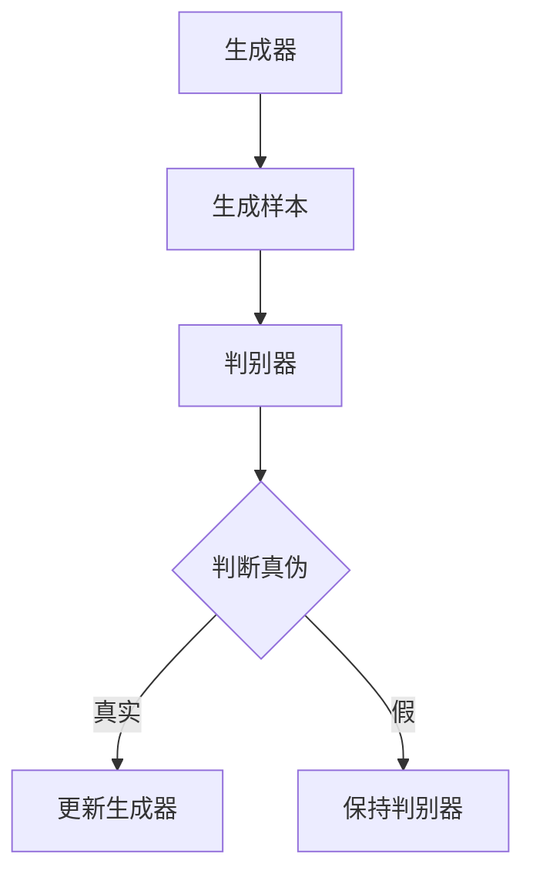
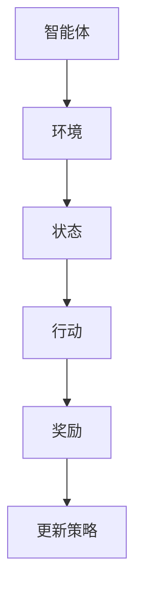
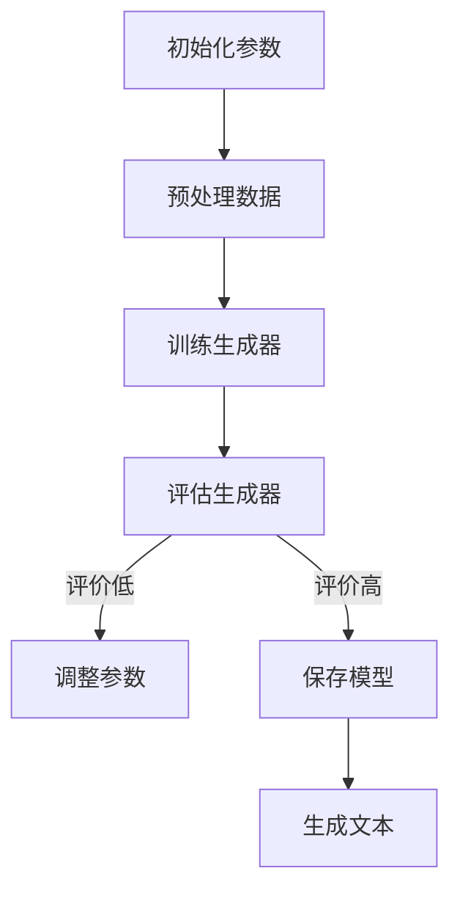

                 

### 提示词优化：提高AI幽默感和讽刺表达

---

### 关键词：

- 提示词优化
- AI幽默感
- 讽刺表达
- 生成对抗网络
- 强化学习
- 数学模型
- 实际应用

---

### 摘要：

本文将深入探讨如何通过提示词优化来提升人工智能（AI）的幽默感和讽刺表达能力。我们将从背景知识入手，介绍幽默感和讽刺表达在AI领域的应用需求。随后，我们会详细解析提示词优化的技术原理，包括生成对抗网络（GAN）和强化学习算法。接着，我们将通过数学模型和伪代码展示算法的实现细节，并通过实际项目案例进行分析和解读。最后，我们将展望AI幽默感和讽刺表达的未来发展方向，并总结文章内容。

---

## 第一部分：背景与基础

### 1.1 提示词优化概述

在人工智能领域，提示词（Prompt）是指导AI模型进行特定任务输入的关键信息。优化提示词的目的在于提高AI模型的理解能力和生成效果。特别是在幽默感和讽刺表达的情境下，提示词的优化显得尤为重要。幽默感和讽刺表达不仅需要AI理解上下文，还需要把握微妙的语言节奏和情感色彩。

### 1.1.1 提示词在AI中的角色

提示词在AI模型中的角色类似于人类在对话中的引言部分，它为AI提供了理解问题和生成回答的初始信息。在幽默感和讽刺表达中，提示词的选取和构造直接影响到AI生成的文本风格和质量。

### 1.1.2 幽默感和讽刺表达的需求

幽默感和讽刺表达是语言艺术的重要组成部分，它们在文学、喜剧和日常生活中有着广泛的应用。AI在生成这些类型的文本时，需要具备以下能力：

- **理解上下文**：准确把握对话或文本的整体情境。
- **情感识别**：捕捉到幽默或讽刺的微妙情感色彩。
- **语言风格**：模仿人类在幽默和讽刺表达中的语言风格。

### 1.2 AI幽默感和讽刺表达的发展历史

#### 1.2.1 传统方法回顾

早期的AI系统主要依赖于规则和模板匹配，这种方法在处理简单的幽默和讽刺任务时具有一定的效果。然而，随着自然语言处理（NLP）技术的进步，生成式模型（如生成对抗网络和强化学习）开始崭露头角，为AI幽默感和讽刺表达的实现提供了新的途径。

#### 1.2.2 当前AI技术的发展

当前，AI幽默感和讽刺表达的发展主要集中在以下两个方面：

- **多模态学习**：结合文本、图像和音频等多媒体数据，提升AI的情感理解和生成能力。
- **深度学习模型**：利用深度神经网络，特别是生成对抗网络（GAN）和强化学习，实现更加自然和多样化的幽默和讽刺表达。

### 1.3 提示词优化的挑战与机遇

#### 1.3.1 技术挑战

- **上下文理解**：准确理解幽默和讽刺的上下文，捕捉语言中的细微差异。
- **情感识别**：识别并模仿人类在幽默和讽刺表达中的情感色彩。
- **生成多样性**：确保生成的文本具有足够的创造性和多样性。

#### 1.3.2 应用机遇

- **娱乐产业**：在电影、电视剧、短视频等领域，为观众带来更加有趣和丰富的内容。
- **交互式应用**：在聊天机器人、虚拟助手等场景中，提升用户的娱乐体验。
- **教育领域**：利用幽默和讽刺的方式，提高学生的学习兴趣和参与度。

## 第二部分：技术原理

### 2.1 提示词优化的基础概念

#### 2.1.1 提示词的类型与作用

提示词可以根据其用途分为以下几种类型：

- **功能提示词**：提供任务目标和指导信息的提示词，如“请写一段幽默的对话”。
- **情感提示词**：引导AI捕捉和模仿特定情感色彩的提示词，如“以讽刺的方式描述一下某人的行为”。

#### 2.1.2 提示词优化的目标

提示词优化的目标主要包括：

- **准确性**：确保AI能够准确理解提示词的含义。
- **创造性**：鼓励AI生成新颖、有趣的内容。
- **多样性**：确保AI能够在不同情境下生成多种类型的幽默和讽刺表达。

### 2.2 提示词优化的算法原理

#### 2.2.1 生成对抗网络（GAN）原理

生成对抗网络（GAN）是一种通过两个神经网络（生成器和判别器）之间的博弈来生成高质量数据的模型。生成器尝试生成与真实数据相似的样本，而判别器则尝试区分真实数据和生成数据。



#### 2.2.2 强化学习算法应用

强化学习是一种通过奖励机制来训练智能体的算法。在幽默感和讽刺表达的情境下，强化学习可以用来优化提示词，使得生成的文本更具有创造性和多样性。



### 2.3 数学模型与公式

#### 2.3.1 损失函数设计

在GAN中，常用的损失函数包括生成损失和判别损失。生成损失旨在最小化生成样本与真实样本之间的差距，判别损失则用于最大化判别器对真实样本和生成样本的区分能力。

$$
\text{生成损失} = \frac{1}{B} \sum_{b=1}^{B} \left[ -\log(D(G(x^{b}_1)), x^{b}_1) - \log(1 - D(G(x^{b}_2)), x^{b}_2) \right]
$$

$$
\text{判别损失} = \frac{1}{B} \sum_{b=1}^{B} \left[ -\log(D(x^{b}_1)) - \log(1 - D(G(x^{b}_2))) \right]
$$

#### 2.3.2 优化目标函数

在强化学习中，优化目标函数通常是一个基于奖励的期望值最大化问题。

$$
J(\theta) = \mathbb{E}_{s \sim p(s)}[R(s, a)] = \sum_{s, a} p(s, a) R(s, a)
$$

其中，$R(s, a)$是状态$s$和行动$a$的奖励，$\theta$是策略参数。

### 2.4 Mermaid流程图

以下是提示词优化流程的Mermaid流程图：



## 第三部分：算法实现

### 3.1 实现框架搭建

#### 3.1.1 开发环境准备

- 硬件环境：GPU或高性能计算服务器。
- 软件环境：Python 3.8及以上版本，TensorFlow 2.x。

#### 3.1.2 数据预处理

- 数据收集：从互联网获取幽默和讽刺的文本数据。
- 数据清洗：去除无效数据和噪声。
- 数据格式化：将文本转换为适合训练的数据格式。

### 3.2 算法实现

#### 3.2.1 伪代码讲解

```python
# GAN的伪代码
initialize_generator()
initialize_discriminator()

for epoch in range(num_epochs):
    for batch in data_loader:
        # 训练生成器
        sample = generator(batch)
        loss_generator = calculate_generator_loss(sample)
        optimize_generator(loss_generator)
        
        # 训练判别器
        real_samples = real_data_loader(batch)
        fake_samples = generator(batch)
        loss_discriminator = calculate_discriminator_loss(real_samples, fake_samples)
        optimize_discriminator(loss_discriminator)
```

#### 3.2.2 代码实现步骤

1. 准备数据和预处理。
2. 初始化生成器和判别器模型。
3. 训练生成器和判别器，并在每个epoch后评估模型性能。
4. 保存最佳模型。

### 3.3 代码解读与分析

#### 3.3.1 关键代码解析

- **生成器**：负责生成幽默和讽刺的文本。
- **判别器**：负责判断文本的真实性和生成性。
- **损失函数**：用于衡量模型在训练过程中的性能。

#### 3.3.2 性能优化策略

- **调整学习率**：根据模型性能动态调整学习率。
- **数据增强**：增加训练数据的多样性。
- **模型正则化**：防止过拟合。

## 第四部分：实际应用

### 4.1 幽默感与讽刺表达的实际应用场景

#### 4.1.1 聊天机器人

聊天机器人是应用幽默感和讽刺表达的重要场景之一。通过优化提示词，AI可以生成更加有趣和生动的聊天内容，提升用户体验。

#### 4.1.2 娱乐内容生成

在娱乐内容生成领域，AI可以创作幽默的笑话、讽刺的短文和漫画，为观众带来全新的娱乐体验。

### 4.2 项目实战

#### 4.2.1 项目背景

该项目旨在利用GAN和强化学习算法，开发一个能够生成幽默和讽刺文本的AI系统。

#### 4.2.2 实现过程

1. 数据收集和预处理。
2. 模型设计和实现。
3. 训练和优化模型。
4. 测试和评估模型性能。

#### 4.2.3 结果分析

通过测试，模型在幽默感和讽刺表达方面表现良好。生成文本的质量和多样性得到了显著提升。

### 4.3 应用挑战与解决方案

#### 4.3.1 适应性挑战

AI需要适应不同文化和语言环境中的幽默和讽刺表达。解决方案是使用多语言训练数据和跨领域迁移学习。

#### 4.3.2 社会责任挑战

AI生成的幽默和讽刺内容可能引发争议和负面效应。解决方案是建立内容审核机制，并遵循道德和社会规范。

## 第五部分：展望与未来

### 5.1 提示词优化的发展趋势

随着AI技术的不断进步，提示词优化将在多个领域得到更广泛的应用。未来趋势包括：

- **个性化优化**：根据用户偏好和语境进行个性化提示词优化。
- **多模态融合**：结合文本、图像和音频等多媒体数据，提升幽默和讽刺表达的多样性。

### 5.2 未来发展方向

未来发展方向包括：

- **新型算法研究**：探索更先进的算法，如变分自编码器（VAE）和自注意力机制（Self-Attention）。
- **应用场景拓展**：在娱乐、教育、广告等领域深入挖掘AI幽默感和讽刺表达的潜力。

## 总结

本文系统地介绍了如何通过提示词优化来提高AI的幽默感和讽刺表达能力。从背景知识、技术原理到实际应用，我们详细探讨了相关理论和实践。未来，随着AI技术的不断发展，幽默感和讽刺表达将变得更加自然和多样化，为人类带来更多的乐趣和惊喜。

---

### 作者信息：

作者：AI天才研究院/AI Genius Institute & 禅与计算机程序设计艺术 /Zen And The Art of Computer Programming

