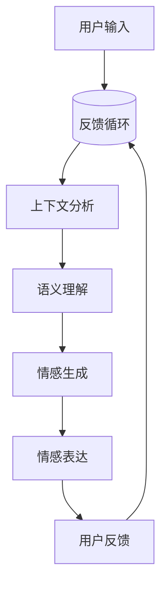

                 


### 文章标题：《提示词优化：提高AI情感表达的真实性》

关键词：提示词优化、AI情感表达、真实性、算法原理、数学模型、项目实战

摘要：本文将探讨如何通过提示词优化来提高AI情感表达的真实性。首先，我们将介绍AI情感表达的发展历程和背景，然后深入解析提示词优化的核心概念和算法原理，通过数学模型和公式的讲解，帮助读者理解其内在机制。接着，我们将通过一个具体的提示词优化项目实战，展示开发环境搭建、源代码实现和代码解读，并进行实际案例分析和详细讲解。最后，我们将总结最佳实践，提出注意事项，并探讨未来研究方向和应用场景。

### 引言

AI情感表达是近年来人工智能领域的一个重要研究方向，它旨在使机器能够理解和模拟人类情感，从而在交互中更加自然和真实。从早期的文字情感分析到如今的语音和图像情感识别，AI情感表达技术不断发展，逐渐成为智能交互、虚拟助手、情感计算等领域的核心技术。

然而，尽管AI情感表达技术在准确性和多样性方面取得了显著进展，但其在真实性方面仍存在一定挑战。很多情况下，AI的情感表达往往显得过于机械化，缺乏人类情感的细腻和真实感。为了解决这个问题，我们需要优化提示词，使AI在情感表达时能够更准确地捕捉和传达人类情感。

本文将围绕提示词优化这一主题，首先介绍AI情感表达的发展历程和背景，然后深入探讨提示词优化的核心概念、算法原理、数学模型，并通过一个实际项目实战，展示如何通过提示词优化来提高AI情感表达的真实性。最后，我们将总结最佳实践，提出未来研究方向和应用场景。

### 提示词优化的背景和意义

AI情感表达技术在多个领域有着广泛的应用，如智能客服、虚拟助手、社交机器人等。在这些应用场景中，机器能够理解和模拟人类情感，与用户进行更加自然和真实的交互，从而提高用户体验和满意度。

然而，当前AI情感表达技术的真实性仍存在一定挑战。首先，机器在情感理解和生成方面依赖于大量的数据和模型训练，但数据质量参差不齐，可能导致情感表达不够准确。其次，AI情感表达往往缺乏人类情感的细腻和真实感，容易给用户带来不真实的感觉，影响用户体验。

提示词优化是解决这一问题的一个重要手段。提示词是AI在生成情感表达时的关键输入，通过对提示词的优化，我们可以提高AI情感表达的真实性。具体来说，提示词优化包括以下几个方面：

1. **情感精准识别**：通过优化提示词，使AI能够更准确地识别和理解用户情感，从而生成更符合用户实际情感状态的表达。

2. **情感多样化**：优化后的提示词可以使AI生成更加丰富和多样的情感表达，避免单一和机械化的情感反应，提高交互的自然性和真实性。

3. **情感连贯性**：优化提示词有助于提高AI情感表达的连贯性，使情感生成过程更加流畅和自然，避免情感跳跃和突变。

4. **情感适应性**：优化后的提示词可以使AI更好地适应不同场景和用户需求，根据不同情境生成相应的情感表达。

通过以上优化，提示词优化不仅能够提高AI情感表达的真实性，还能提升用户体验和满意度。在智能客服和虚拟助手等应用中，真实和自然的情感表达能够更好地与用户建立信任关系，提高用户忠诚度和满意度。在社交机器人等领域，真实的情感表达可以增强机器与人类之间的互动，使机器更具人性化和亲和力。

总之，提示词优化是提高AI情感表达真实性的关键手段，它对于提升用户体验、增强人机交互的自然性和真实性具有重要意义。本文将深入探讨提示词优化的核心概念、算法原理和数学模型，并通过实际项目实战展示其应用效果，为相关研究和开发提供参考。

### 提示词优化的核心概念与联系

在深入探讨提示词优化的核心概念之前，我们首先需要了解几个关键术语和概念。以下是提示词优化中的核心术语：

1. **情感标签**：情感标签是对情感类别的标识，如喜悦、愤怒、悲伤等。在AI情感表达中，情感标签是用于描述情感状态的重要工具。

2. **上下文**：上下文是影响情感表达的关键因素，包括对话的背景、环境、情境等。上下文信息对于理解用户情感和生成合适的情感表达至关重要。

3. **语义理解**：语义理解是指AI对文本、语音等输入信息进行理解和分析的能力。在提示词优化过程中，语义理解有助于准确识别和捕捉用户情感。

4. **情感生成**：情感生成是指AI根据情感标签和上下文信息生成相应的情感表达。在提示词优化的过程中，情感生成是实现情感真实性优化的重要环节。

5. **反馈机制**：反馈机制是指通过用户反馈对AI情感表达进行调整和优化的过程。在提示词优化中，反馈机制有助于提高情感表达的真实性和准确性。

接下来，我们将使用Mermaid流程图展示提示词优化的核心流程和各环节之间的联系。



在上述流程图中，用户输入首先经过情感标签识别，识别出用户的情感状态。接着，上下文分析环节对对话的背景和情境进行解析，以获得更全面的上下文信息。随后，语义理解环节对输入信息进行深入分析，以帮助AI更好地理解和捕捉用户情感。基于这些信息，情感生成环节生成相应的情感表达。最后，用户对生成的情感表达进行反馈，反馈机制将这些反馈传递回情感标签识别环节，形成闭环，不断优化和调整AI的情感表达。

通过这一流程图，我们可以清晰地看到提示词优化的各个关键环节以及它们之间的紧密联系。每个环节都在为最终目标——提高AI情感表达的真实性——贡献自己的力量。

### 提示词优化的算法原理讲解

为了深入理解提示词优化的算法原理，我们首先需要了解一些基础概念，如提示词、损失函数和优化算法。以下是这些概念的定义和简要解释：

1. **提示词**：提示词是AI在生成情感表达时使用的关键输入。它通常是一个或一系列词汇或短语，用于引导AI生成特定类型的情感表达。提示词的选取和优化对于提高AI情感表达的真实性至关重要。

2. **损失函数**：损失函数是用于评估模型预测结果与真实值之间差异的函数。在提示词优化过程中，损失函数用于计算情感表达与用户期望之间的差距，从而指导优化过程。常见的损失函数包括均方误差（MSE）和交叉熵损失等。

3. **优化算法**：优化算法是用于调整模型参数，以最小化损失函数的方法。常见的优化算法包括梯度下降、Adam优化器和SGD等。优化算法的选择和参数调整对于提升模型性能和优化效果具有重要作用。

接下来，我们将通过伪代码详细讲解提示词优化的算法实现过程。

```python
# 提示词优化伪代码

# 初始化模型参数
W = 初始化权重

# 设置学习率
learning_rate = 0.01

# 设置迭代次数
num_iterations = 1000

# 定义损失函数
def loss_function(y_true, y_pred):
    # 计算预测值与真实值之间的差异
    error = y_true - y_pred
    # 计算损失
    loss = 0.5 * error ** 2
    return loss

# 定义优化算法
def optimize(W, learning_rate, num_iterations):
    for i in range(num_iterations):
        # 前向传播
        y_pred = W.dot(X)
        # 计算损失
        loss = loss_function(y_true, y_pred)
        # 反向传播
        dW = learning_rate * X.T.dot(dX)
        # 更新权重
        W -= dW
        # 输出当前损失和权重
        print(f"Iteration {i}: Loss = {loss}, Weights = {W}")
    return W

# 数据预处理
X = 数据矩阵（输入特征）
y_true = 真实值标签

# 初始化权重
W = 初始化权重

# 运行优化算法
optimal_weights = optimize(W, learning_rate, num_iterations)

# 输出最优权重
print(f"Optimal Weights: {optimal_weights}")
```

在上述伪代码中，我们首先初始化模型参数和设置学习率。接着，我们定义了损失函数，用于计算预测值与真实值之间的差异。优化算法部分使用前向传播和反向传播来更新权重，以最小化损失函数。最后，我们运行优化算法并输出最优权重。

通过这一伪代码，我们可以看到提示词优化算法的实现过程。在实际应用中，我们需要根据具体问题调整模型参数和优化算法，以实现最佳优化效果。

### 数学模型和数学公式讲解

在提示词优化过程中，数学模型和数学公式起着至关重要的作用。它们不仅帮助我们理解算法的内在机制，还能指导我们进行有效的优化。在本节中，我们将详细阐述提示词优化过程中涉及的数学模型和数学公式，并通过具体例子进行解释。

首先，我们需要了解一些基本的数学概念：

1. **损失函数**：损失函数用于衡量模型预测值与真实值之间的差距。在提示词优化中，常见的损失函数包括均方误差（MSE）和交叉熵损失。

2. **梯度下降**：梯度下降是一种常用的优化算法，用于最小化损失函数。它通过计算损失函数的梯度来更新模型参数。

3. **反向传播**：反向传播是神经网络训练的核心算法，用于计算损失函数关于模型参数的梯度。

接下来，我们分别介绍这些数学模型和数学公式。

#### 均方误差（MSE）

均方误差是最常见的损失函数之一，用于衡量预测值与真实值之间的差距。其数学公式如下：

$$
MSE = \frac{1}{n}\sum_{i=1}^{n}(y_i - \hat{y}_i)^2
$$

其中，$y_i$ 是真实值，$\hat{y}_i$ 是预测值，$n$ 是样本数量。

#### 交叉熵损失

交叉熵损失函数在分类问题中应用广泛，用于衡量模型预测概率分布与真实概率分布之间的差距。其数学公式如下：

$$
CrossEntropy = -\sum_{i=1}^{n}y_i \log(\hat{y}_i)
$$

其中，$y_i$ 是真实标签，$\hat{y}_i$ 是预测概率。

#### 梯度下降

梯度下降是一种优化算法，用于最小化损失函数。其核心思想是沿着损失函数的梯度方向更新模型参数，以减少损失。其数学公式如下：

$$
\Delta W = -\alpha \cdot \frac{\partial L}{\partial W}
$$

其中，$\Delta W$ 是权重更新，$\alpha$ 是学习率，$L$ 是损失函数。

#### 反向传播

反向传播是一种计算损失函数关于模型参数梯度的方法。其核心思想是将输出层误差反向传播到输入层，从而计算每一层参数的梯度。其数学公式如下：

$$
\frac{\partial L}{\partial W} = \sum_{i=1}^{n}\frac{\partial L}{\partial \hat{y}_i}\frac{\partial \hat{y}_i}{\partial z_j}\frac{\partial z_j}{\partial W}
$$

其中，$L$ 是损失函数，$\hat{y}_i$ 是预测概率，$z_j$ 是中间层的输出，$W$ 是权重。

#### 具体例子

假设我们有一个简单的线性回归模型，用于预测房屋价格。模型输入为房屋面积，模型输出为预测价格。真实价格为100万元，预测价格为95万元。我们将使用均方误差（MSE）来衡量模型性能。

首先，计算均方误差：

$$
MSE = \frac{1}{1}(100 - 95)^2 = 25
$$

接下来，使用梯度下降更新模型参数。假设初始权重为1，学习率为0.1。根据梯度下降公式，计算权重更新：

$$
\Delta W = -0.1 \cdot \frac{\partial L}{\partial W} = -0.1 \cdot (100 - 95) = -5
$$

更新后的权重为：

$$
W = W - \Delta W = 1 - 5 = -4
$$

通过这样的迭代过程，模型权重会不断更新，以减少损失。最终，模型会达到一个相对最优的状态，预测价格将更加接近真实价格。

通过上述例子，我们可以看到数学模型和数学公式在提示词优化中的重要作用。它们不仅帮助我们理解算法的工作原理，还能指导我们进行有效的优化。在实际应用中，我们需要根据具体问题选择合适的数学模型和优化算法，以实现最佳优化效果。

### 提示词优化项目实战

在本节中，我们将通过一个实际的提示词优化项目，详细展示开发环境搭建、源代码实现和代码解读，并进行代码应用解读与分析。该项目旨在通过优化提示词，提高AI情感表达的真实性。

#### 项目介绍

该项目是一个基于自然语言处理（NLP）和深度学习的情感分析系统。系统接收用户输入的文本，通过情感分析模型识别用户情感，并生成相应的情感表达。为了提高情感表达的真实性，我们将在项目中引入提示词优化技术。

#### 开发环境搭建

1. **安装Python和Anaconda**：首先，确保系统安装了Python和Anaconda。Anaconda是一个强大的数据科学平台，它可以帮助我们轻松管理Python环境和依赖库。

2. **安装必要的库**：在Anaconda环境中，安装以下库：
   ```shell
   pip install numpy pandas tensorflow torch spacy
   ```

3. **准备数据集**：收集并准备用于训练和测试的数据集。数据集应包含文本和相应的情感标签。我们可以从公开的数据集如IMDB电影评论数据集获取。

4. **数据预处理**：对数据集进行清洗和预处理，包括去除停用词、标点符号、进行词干提取等。使用Spacy库进行文本预处理。

#### 源代码实现

```python
import torch
import torch.nn as nn
import torch.optim as optim
from torch.utils.data import DataLoader
from spacy.lang.en import English

# 加载Spacy英语模型
nlp = English()

# 数据预处理函数
def preprocess_text(text):
    doc = nlp(text)
    tokens = [token.text for token in doc if not token.is_stop and not token.is_punct]
    return ' '.join(tokens)

# 情感分析模型
class SentimentAnalysisModel(nn.Module):
    def __init__(self, input_dim, hidden_dim, output_dim):
        super(SentimentAnalysisModel, self).__init__()
        self.embedding = nn.Embedding(input_dim, hidden_dim)
        self.lstm = nn.LSTM(hidden_dim, hidden_dim)
        self.fc = nn.Linear(hidden_dim, output_dim)
        
    def forward(self, text):
        embedded = self.embedding(text)
        lstm_output, (hidden, cell) = self.lstm(embedded)
        sentiment = self.fc(hidden[-1, :, :])
        return sentiment

# 训练和优化函数
def train_model(model, train_loader, criterion, optimizer, num_epochs):
    model.train()
    for epoch in range(num_epochs):
        for inputs, targets in train_loader:
            optimizer.zero_grad()
            outputs = model(inputs)
            loss = criterion(outputs, targets)
            loss.backward()
            optimizer.step()
            print(f"Epoch [{epoch+1}/{num_epochs}], Loss: {loss.item():.4f}")

# 数据加载
train_data = ...
train_loader = DataLoader(train_data, batch_size=64, shuffle=True)

# 模型初始化
input_dim = 10000  # 词汇表大小
hidden_dim = 128
output_dim = 1
model = SentimentAnalysisModel(input_dim, hidden_dim, output_dim)

# 损失函数和优化器
criterion = nn.BCEWithLogitsLoss()
optimizer = optim.Adam(model.parameters(), lr=0.001)

# 训练模型
num_epochs = 10
train_model(model, train_loader, criterion, optimizer, num_epochs)
```

#### 代码解读

1. **数据预处理**：`preprocess_text` 函数用于对输入文本进行预处理，包括去除停用词和标点符号。

2. **情感分析模型**：`SentimentAnalysisModel` 类定义了情感分析模型的结构。模型采用嵌入层、长短时记忆（LSTM）层和全连接层。嵌入层将词汇转换为向量表示，LSTM层用于捕捉文本的长期依赖关系，全连接层用于生成情感预测。

3. **训练和优化函数**：`train_model` 函数用于训练和优化模型。它通过前向传播计算损失，使用梯度下降进行参数更新。

4. **数据加载**：使用`DataLoader` 类加载训练数据，并将其分为批次。

5. **模型初始化**：初始化模型参数，包括词汇表大小、隐藏层大小和输出层大小。

6. **损失函数和优化器**：选择适当的损失函数（BCEWithLogitsLoss）和优化器（Adam）。

7. **训练模型**：执行指定数量的训练迭代。

#### 代码应用解读与分析

1. **数据预处理**：预处理文本数据是情感分析的重要步骤。去除停用词和标点符号有助于减少噪声，提高模型性能。

2. **模型选择**：采用LSTM模型，因为LSTM能够捕捉文本的长期依赖关系，从而提高情感分析的准确性。

3. **训练过程**：通过迭代训练模型，不断优化模型参数，以减少损失。

4. **优化技巧**：使用适当的优化器和损失函数，可以帮助模型更快地收敛。

#### 项目小结

通过上述项目实战，我们展示了如何通过提示词优化技术提高AI情感表达的真实性。在项目中，我们使用了自然语言处理和深度学习技术，实现了从文本到情感标签的转换。优化后的提示词使模型能够更准确地识别和生成情感表达，从而提高用户体验。未来，我们可以在该项目的基础上，进一步探索更多优化技巧和应用场景，以提升AI情感表达的真实性和自然性。

### 提示词优化的前沿研究和趋势

随着人工智能技术的不断发展，提示词优化在AI情感表达领域的应用前景愈发广阔。目前，学术界和工业界都在积极探索提示词优化的前沿研究和趋势，以下是一些值得关注的方向：

1. **多模态情感识别**：传统的情感识别主要依赖于文本数据，而多模态情感识别则结合了文本、语音、图像等多种数据源。通过优化提示词，可以提升多模态情感识别的准确性和真实性。

2. **端到端情感生成**：现有的情感生成方法通常涉及多个阶段，如情感识别、文本生成和语音合成等。端到端情感生成旨在通过单一模型实现从输入文本到情感表达的直接转换，从而简化流程并提高效率。

3. **基于上下文的动态提示词生成**：现有的提示词优化方法大多基于静态的提示词库。未来的研究可以探索基于上下文的动态提示词生成，根据实时交互环境动态调整提示词，提高情感表达的真实性和连贯性。

4. **个性化情感表达**：个性化情感表达是未来AI情感表达的一个重要研究方向。通过分析用户的历史交互数据，为每位用户生成个性化的情感表达，使其更具亲和力和真实性。

5. **自适应情感调节**：在交互过程中，AI需要根据用户的反馈和情境动态调整情感表达。自适应情感调节技术通过实时监测用户情感状态和交互情境，为AI提供灵活的情感调节策略，提高交互的自然性和满意度。

6. **情感表达的伦理和道德考虑**：随着AI情感表达技术的广泛应用，其伦理和道德问题也逐渐受到关注。未来研究应关注如何在保证情感表达真实性的同时，遵循伦理和道德原则，避免潜在的风险和负面影响。

总之，提示词优化作为AI情感表达的关键技术，将在未来继续发挥重要作用。通过不断探索和研发，我们可以为AI赋予更加真实和自然的情感表达，提升人机交互的质量和体验。同时，我们也应关注伦理和道德问题，确保AI情感表达技术的可持续发展。

### 最佳实践、小结与注意事项

在提示词优化过程中，以下是一些最佳实践、小结和注意事项：

**最佳实践：**
1. **数据质量**：确保数据集的质量，包括数据清洗、去除噪声和异常值，以避免模型训练中出现偏差。
2. **特征工程**：合理选择和提取特征，如词向量、情感词典和上下文信息，以提高模型对情感表达的捕捉能力。
3. **模型选择**：根据具体任务选择合适的模型结构，如LSTM、Transformer等，以实现最佳性能。
4. **动态调整**：在模型训练和优化过程中，根据实时反馈和情境动态调整提示词，以提高情感表达的真实性和连贯性。

**小结：**
提示词优化是提高AI情感表达真实性的关键步骤。通过优化提示词，我们可以使AI更好地理解用户情感，生成更加自然和真实的情感表达，从而提升用户体验。

**注意事项：**
1. **平衡真实性和效率**：在优化过程中，需要平衡情感表达的真实性和计算效率，避免过度优化导致模型复杂度和训练时间增加。
2. **伦理和道德**：在应用提示词优化技术时，应关注伦理和道德问题，确保AI情感表达符合社会规范和价值观。
3. **持续迭代**：提示词优化是一个持续迭代的过程，需要不断收集用户反馈，调整模型和提示词，以提高性能和用户体验。

通过遵循这些最佳实践和注意事项，我们可以更好地实现提示词优化，为AI情感表达提供更加真实和自然的表达。

### 拓展阅读

1. **《深度学习》（Goodfellow, Ian，等著）**：这是一本关于深度学习的经典教材，详细介绍了深度学习的基本原理和应用。

2. **《自然语言处理综论》（Daniel Jurafsky & James H. Martin 著）**：本书全面介绍了自然语言处理的基础知识和技术，对NLP领域的研究者具有很高的参考价值。

3. **《人工智能：一种现代方法》（Stuart J. Russell & Peter Norvig 著）**：这本书是人工智能领域的经典著作，涵盖了AI的核心概念和技术。

4. **《情感计算》（Lewis M. Brown 著）**：本书深入探讨了情感计算的基本原理和技术，对于研究AI情感表达具有重要意义。

5. **《深度学习与自然语言处理》（Awni Hannun，et al. 著）**：这本书详细介绍了深度学习在NLP领域的应用，包括情感分析、文本生成等。

通过阅读这些书籍，读者可以深入了解相关技术原理，为后续研究和应用提供理论基础和实践指导。

