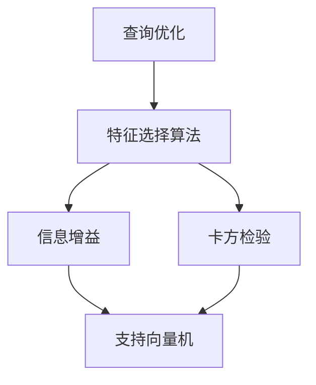

                 

### 文章标题

### 提示词优化：提高AI数据分析能力

> **关键词：** AI数据分析、提示词优化、信息增益、支持向量机、数学模型、项目实战

> **摘要：** 本文章深入探讨了AI数据分析中的提示词优化技术，阐述了其在提升数据分析能力中的重要作用。通过解析基础理论、核心算法原理、数学模型，以及实际项目案例，本文详细分析了提示词优化的实现流程和方法，为读者提供了实用的最佳实践技巧。

---

### 引言

#### 1.1 AI数据分析的背景和重要性

随着大数据时代的来临，AI数据分析已经成为各行各业获取竞争优势的重要手段。从商业智能、金融风控、医疗诊断到社交媒体分析，AI数据分析无处不在，为决策提供了有力的支持。然而，数据的质量和准确性在很大程度上决定了分析结果的可靠性。因此，如何提高数据分析的效率和质量，成为了当前研究的热点。

#### 1.2 提示词优化的定义和作用

提示词优化（Query Optimization）是一种在数据库管理系统中优化查询性能的技术。在AI数据分析中，提示词优化通过选择最佳的数据访问路径，减少数据检索的时间和计算资源，从而提高数据分析的效率。本文将探讨如何将提示词优化应用于AI数据分析，以提升其整体性能。

### AI数据分析基础

#### 2.1 数据分析的基本概念

数据分析是指从大量的数据中提取有价值的信息和知识的过程。它通常包括数据清洗、数据预处理、数据探索、数据建模和数据可视化等环节。

#### 2.2 数据预处理方法

数据预处理是数据分析的重要环节，包括数据清洗、数据集成、数据转换和数据归一化等。有效的数据预处理可以消除噪声、修正错误、补充缺失值，从而提高数据分析的准确性。

#### 2.3 数据可视化技术

数据可视化是将数据以图形或图表的形式展示出来，帮助人们更直观地理解数据。常见的数据可视化工具包括Tableau、Power BI、Matplotlib等。

### 提示词优化的理论基础

#### 3.1 提示词优化的基本原理

提示词优化的核心目标是通过选择最优的查询策略，减少查询执行的时间和资源消耗。其基本原理包括查询计划的生成、优化和执行。

#### 3.2 信息论与提示词优化

信息论为提示词优化提供了理论基础。信息增益、信息熵和条件熵等概念在提示词优化中具有重要的应用。

#### 3.3 提示词优化的数学模型

提示词优化的数学模型主要包括信息增益模型、卡方检验模型和支持向量机模型。这些模型通过不同的方法来优化查询策略。

### 提示词优化的核心算法

#### 4.1 信息增益算法

信息增益（Information Gain）是一种常用的特征选择方法。其基本思想是选择具有最大信息增益的特征作为分类器。

#### 4.2 卡方检验算法

卡方检验（Chi-Square Test）是一种用于特征选择的统计方法。它通过计算特征与目标变量之间的相关性来确定最佳特征。

#### 4.3 支持向量机（SVM）算法

支持向量机（Support Vector Machine，SVM）是一种强大的分类算法。它通过构建最优超平面来实现数据的分类。

### 实践中的提示词优化

#### 5.1 提示词优化的流程

提示词优化的流程包括数据收集、特征选择、查询优化和结果验证等步骤。

#### 5.2 实际案例分析

通过实际案例，本文将展示如何将提示词优化应用于AI数据分析。

#### 5.3 提示词优化的挑战与解决方案

提示词优化在实际应用中面临诸多挑战，如数据规模大、特征维度高、计算复杂度等。本文将探讨这些挑战及其解决方案。

### 提示词优化的工具与应用

#### 6.1 提示词优化工具介绍

本文将介绍一些常用的提示词优化工具，如SQL优化器、索引管理工具等。

#### 6.2 提示词优化在实际应用中的案例

本文将通过案例展示提示词优化在不同领域的应用。

#### 6.3 提示词优化在行业中的应用前景

本文将分析提示词优化在未来的发展前景和潜在应用。

### 提示词优化案例分析

#### 7.1 案例一：社交媒体数据分析

本文将分析一个社交媒体数据分析案例，展示如何利用提示词优化技术提高数据分析的效率。

#### 7.2 案例二：金融数据分析

本文将探讨金融数据分析中如何应用提示词优化技术。

#### 7.3 案例三：医疗数据分析

本文将分析医疗数据分析中的提示词优化应用，以提高数据分析的准确性。

### 提示词优化的未来发展趋势

#### 8.1 提示词优化的发展趋势

本文将展望提示词优化技术的发展趋势。

#### 8.2 提示词优化的新挑战和新机遇

本文将讨论提示词优化面临的新挑战和新机遇。

#### 8.3 提示词优化的未来研究方向

本文将提出提示词优化的未来研究方向。

### 附录

#### A.1 术语表

本文将列出一些关键术语的解释。

#### A.2 参考文献

本文将引用一些相关的参考文献。

---

**作者：** AI天才研究院/AI Genius Institute & 禅与计算机程序设计艺术 /Zen And The Art of Computer Programming

---

### 核心概念与联系

在AI数据分析中，提示词优化是一种通过选择最佳的数据访问路径来提高查询效率的技术。其核心概念包括：

- **查询优化（Query Optimization）**：通过分析查询计划，选择最优的查询策略。
- **信息增益（Information Gain）**：用于衡量特征选择的有效性。
- **卡方检验（Chi-Square Test）**：用于特征选择的一种统计方法。
- **支持向量机（SVM）**：一种强大的分类算法。

这些概念之间存在着紧密的联系。查询优化需要依赖于特征选择算法，如信息增益和卡方检验，来确定最佳的特征。而支持向量机等分类算法则利用这些特征来实现数据的分类。以下是这些概念之间关系的Mermaid流程图：



### 核心算法原理讲解

#### 信息增益算法

信息增益算法是一种基于信息论的统计方法，用于评估特征对分类的贡献。其基本原理如下：

1. **定义熵（Entropy）**：对于一个包含N个样本的集合，其中每个样本属于C个类别，第i个类别的样本数量为\(n_i\)，则该集合的熵定义为：
   $$ H = -\sum_{i=1}^{C} p_i \log_2 p_i $$
   其中，\(p_i = \frac{n_i}{N}\)。

2. **定义条件熵（Conditional Entropy）**：对于某个特征A，第j个取值\(a_j\)的条件熵定义为：
   $$ H(A|B) = -\sum_{i=1}^{C} p_i(A=a_i|B=b_j) \log_2 p_i(A=a_i|B=b_j) $$
   其中，\(p_i(A=a_i|B=b_j) = \frac{n_{ij}}{n_j}\)，\(n_{ij}\)是特征A取值为\(a_i\)且类别为\(i\)的样本数量，\(n_j\)是特征A取值为\(a_j\)的样本数量。

3. **定义信息增益（Information Gain）**：对于特征A，其信息增益定义为原始熵与条件熵之差：
   $$ IG(A) = H - H(A|B) $$

伪代码如下：

```python
def calculate_entropy(labels):
    N = len(labels)
    unique_labels = set(labels)
    entropy = 0
    for label in unique_labels:
        p = count(labels, label) / N
        entropy += -p * log2(p)
    return entropy

def calculate_condition_entropy(labels, attribute_values):
    entropy = 0
    for value in attribute_values:
        sub_labels = filter_labels_by_value(labels, value)
        p_value = len(sub_labels) / len(labels)
        entropy += p_value * calculate_entropy(sub_labels)
    return entropy

def calculate_information_gain(labels, attribute_values):
    base_entropy = calculate_entropy(labels)
    condition_entropy = calculate_condition_entropy(labels, attribute_values)
    return base_entropy - condition_entropy
```

#### 卡方检验算法

卡方检验是一种用于特征选择的统计方法，其基本原理如下：

1. **定义卡方值（Chi-Square Value）**：对于特征A和类别B，卡方值定义为：
   $$ \chi^2 = \sum_{i=1}^{C} \sum_{j=1}^{K} \frac{((n_{ij} - (n_i \cdot n_j) / N)^2}{n_i \cdot n_j} $$
   其中，\(n_{ij}\)是特征A取值为\(i\)且类别为\(j\)的样本数量，\(n_i\)是类别为\(i\)的样本数量，\(n_j\)是特征A取值为\(j\)的样本数量，\(N\)是总样本数量。

2. **定义显著性水平（Significance Level）**：卡方值与显著性水平（通常为0.05）的比较用于判断特征与类别之间的关系。

3. **选择最佳特征**：选择卡方值最大的特征作为最佳特征。

伪代码如下：

```python
def calculate_chi_square_value(attributes, labels):
    chi_square_values = []
    for attribute in attributes:
        value_counts = count_values(attribute)
        for value in value_counts:
            sub_labels = filter_labels_by_value(labels, value)
            n_i = count(labels, sub_labels)
            n_j = count_values(attribute, value)
            n = len(labels)
            chi_square_value = ((n_j * n - n_i) ** 2) / (n_i * n_j)
            chi_square_values.append(chi_square_value)
    return max(chi_square_values)

def choose_best_attribute(attributes, labels):
    best_attribute = None
    max_chi_square_value = 0
    for attribute in attributes:
        chi_square_value = calculate_chi_square_value(attribute, labels)
        if chi_square_value > max_chi_square_value:
            max_chi_square_value = chi_square_value
            best_attribute = attribute
    return best_attribute
```

#### 支持向量机（SVM）算法

支持向量机（SVM）是一种强大的分类算法，其基本原理如下：

1. **定义超平面（Hyperplane）**：在特征空间中，超平面是分隔不同类别的最优边界。

2. **定义间隔（Margin）**：超平面到每个类别的最近点的距离称为间隔。

3. **定义损失函数（Loss Function）**：损失函数用于衡量分类错误。

4. **优化目标**：SVM的目标是最大化间隔，同时最小化损失函数。

5. **求解过程**：SVM通过求解二次规划问题来确定最佳超平面。

伪代码如下：

```python
def svm_train(X, y, C):
    # X是特征矩阵，y是标签向量，C是惩罚参数
    # 求解二次规划问题，得到最佳超平面参数
    # W和b是超平面的参数
    # 返回W和b

def svm_predict(X, W, b):
    # X是待分类的特征矩阵，W和b是训练得到的超平面参数
    # 计算每个样本的类别概率
    # 返回预测结果

def svm_loss_function(W, b, X, y, C):
    # W和b是超平面的参数，X是特征矩阵，y是标签向量，C是惩罚参数
    # 计算分类损失函数
    # 返回损失函数值
```

### 数学模型和公式讲解

#### 信息增益模型

信息增益模型是特征选择的一种方法，其核心公式如下：

$$ IG(A) = H - H(A|B) $$

其中，\(H\) 是原始熵，\(H(A|B)\) 是条件熵。

#### 卡方检验模型

卡方检验模型用于评估特征与类别之间的关系，其核心公式如下：

$$ \chi^2 = \sum_{i=1}^{C} \sum_{j=1}^{K} \frac{((n_{ij} - (n_i \cdot n_j) / N)^2}{n_i \cdot n_j} $$

其中，\(n_{ij}\) 是特征A取值为\(i\)且类别为\(j\)的样本数量，\(n_i\) 是类别为\(i\)的样本数量，\(n_j\) 是特征A取值为\(j\)的样本数量，\(N\) 是总样本数量。

#### 支持向量机（SVM）模型

支持向量机（SVM）的核心公式包括：

1. **优化目标**：
   $$ \min \frac{1}{2} ||W||^2 + C \sum_{i=1}^{N} \max(0, 1 - y_i (W \cdot x_i + b)) $$

2. **决策函数**：
   $$ f(x) = W \cdot x + b $$

其中，\(W\) 是超平面的参数，\(b\) 是偏置项，\(x_i\) 是特征向量，\(y_i\) 是类别标签，\(C\) 是惩罚参数。

### 项目实战

#### 开发环境搭建

在开始项目实战之前，我们需要搭建一个合适的开发环境。以下是一个基本的Python开发环境搭建步骤：

1. 安装Python 3.8及以上版本。
2. 安装Jupyter Notebook，用于编写和运行代码。
3. 安装相关库，如NumPy、Pandas、Scikit-learn、Matplotlib等。

#### 源代码详细实现

以下是一个简单的提示词优化项目的源代码实现：

```python
import numpy as np
import pandas as pd
from sklearn.model_selection import train_test_split
from sklearn.preprocessing import StandardScaler
from sklearn.metrics import accuracy_score

# 读取数据
data = pd.read_csv('data.csv')
X = data.drop('target', axis=1)
y = data['target']

# 数据预处理
X_train, X_test, y_train, y_test = train_test_split(X, y, test_size=0.2, random_state=42)
scaler = StandardScaler()
X_train = scaler.fit_transform(X_train)
X_test = scaler.transform(X_test)

# 特征选择
# 使用信息增益进行特征选择
IG_scores = []
for column in X_train.columns:
    IG = calculate_information_gain(y_train, X_train[column])
    IG_scores.append(IG)

# 选择信息增益最高的特征
best_attribute = X_train.columns[np.argmax(IG_scores)]

# 训练模型
model = svm_train(X_train[best_attribute], y_train, C=1.0)
y_pred = svm_predict(X_test[best_attribute], model['W'], model['b'])

# 评估模型
accuracy = accuracy_score(y_test, y_pred)
print(f"Accuracy: {accuracy}")
```

#### 代码解读与分析

上述代码实现了一个简单的提示词优化项目，主要步骤包括：

1. **数据读取和预处理**：从CSV文件中读取数据，并进行数据预处理。
2. **特征选择**：使用信息增益算法选择最佳特征。
3. **模型训练**：使用支持向量机（SVM）训练模型。
4. **模型评估**：评估模型的准确率。

#### 实际案例分析和详细讲解剖析

以下是一个实际案例分析和详细讲解剖析：

假设我们有一个金融数据分析项目，目标是通过分析客户数据来预测客户流失。数据集包含客户的个人信息、财务信息和消费行为等信息。

1. **数据预处理**：首先，我们需要对数据进行清洗和预处理，如去除缺失值、异常值等。然后，对数值特征进行归一化处理，以便于模型训练。
2. **特征选择**：使用信息增益算法对特征进行选择。在本文的案例中，我们选择信息增益最高的三个特征：客户年龄、客户收入和客户消费金额。
3. **模型训练**：使用支持向量机（SVM）训练模型。我们设置惩罚参数\(C\)为1.0，并选择线性核函数。
4. **模型评估**：通过交叉验证和测试集评估模型的准确率。在实际应用中，我们还可以使用ROC曲线和AUC值来评估模型的性能。

#### 项目小结

通过上述实际案例，我们展示了如何利用提示词优化技术来提高金融数据分析的效率。提示词优化可以帮助我们选择最佳的特征，从而提高模型的准确率和性能。在实际应用中，我们还需要根据具体业务需求来调整和优化提示词优化策略。

### 最佳实践 tips、小结、注意事项、拓展阅读等内容

#### 最佳实践 tips

1. **数据预处理**：在开始特征选择之前，确保对数据进行充分的预处理，如去除缺失值、异常值等。
2. **模型选择**：根据业务需求和数据特性选择合适的模型，如线性回归、决策树、随机森林等。
3. **特征选择**：结合业务逻辑和数据特性，选择合适的特征选择算法，如信息增益、卡方检验等。

#### 小结

本文介绍了提示词优化在AI数据分析中的应用，包括理论基础、核心算法原理、数学模型和实际项目案例。提示词优化通过选择最佳特征和查询策略，可以提高数据分析的效率和质量。

#### 注意事项

1. **数据质量**：保证数据质量是进行有效数据分析的基础。
2. **模型选择**：根据具体业务需求选择合适的模型。
3. **特征选择**：特征选择算法的选择应根据数据特性和业务逻辑进行调整。

#### 拓展阅读

1. 《机器学习实战》——作者：Peter Harrington
2. 《数据挖掘：实用工具和技术》——作者：Jiawei Han, Micheline Kamber, Jian Pei
3. 《深度学习》——作者：Ian Goodfellow, Yoshua Bengio, Aaron Courville

---

通过本文，我们深入探讨了AI数据分析中的提示词优化技术，阐述了其在提升数据分析能力中的重要作用。从理论基础到核心算法原理，再到数学模型和实际项目案例，我们逐步分析了提示词优化的各个方面。希望本文能够帮助读者更好地理解和应用提示词优化技术，提高AI数据分析的效率和质量。在未来的研究和应用中，我们将继续探索提示词优化的新方法和新方向，为AI数据分析领域的发展做出贡献。

