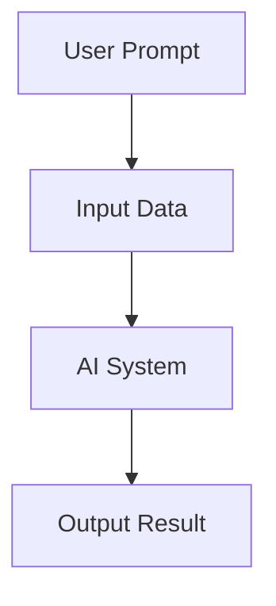

                 

### 文章标题

# 提示词优化：提高AI输出质量的10个技巧

在当今高度数字化和智能化的时代，人工智能（AI）已经渗透到了各行各业，从自然语言处理到图像识别，从推荐系统到自动驾驶，AI正在彻底改变我们的生活方式和工作模式。然而，AI系统的性能和输出质量往往受到其输入提示词（prompts）的质量影响。因此，如何优化提示词以提升AI输出质量成为了研究和应用中的关键问题。

本文旨在探讨和分享10个有效的提示词优化技巧，帮助读者深入了解提示词在AI系统中的重要性，并学会如何通过具体方法来提升AI的输出质量。无论是数据科学家、AI工程师，还是对AI技术感兴趣的爱好者，这篇文章都将为您提供宝贵的见解和实践指导。

文章的主要结构如下：

1. **引言**：介绍提示词优化的重要性，以及本文的目标和结构。
2. **核心概念与联系**：解释提示词、输入和输出之间的基本关系，并使用Mermaid流程图展示。
3. **基本技巧**：介绍几种简单但实用的提示词优化方法。
4. **高级技巧**：探讨更复杂和高效的优化策略。
5. **应用场景**：分析提示词优化在不同领域的实际应用。
6. **案例研究**：通过具体案例展示提示词优化的效果。
7. **最佳实践**：总结一些实用的提示词优化技巧，并提供项目实战案例。
8. **总结与展望**：回顾文章的主要内容，并对未来进行展望。

关键词：提示词优化，AI输出质量，自然语言处理，算法技巧，应用案例

摘要：本文探讨了提升人工智能系统输出质量的10个有效技巧，包括基本和高级的提示词优化方法。通过分析不同领域的应用场景和具体案例，本文展示了提示词优化在提高AI系统性能方面的关键作用。

### 引入背景

人工智能（AI）的发展已经成为当代技术进步的核心驱动力，它正在以前所未有的速度和深度改变我们的生活、工作和思维方式。无论是自动驾驶汽车、智能家居，还是大数据分析、医疗诊断，AI技术已经融入了各个领域，并展现出巨大的潜力。然而，AI系统的性能和输出质量往往受到其输入提示词（prompts）的质量影响。提示词作为AI系统的输入，是触发和指导AI进行特定任务的关键因素，其质量直接关系到AI系统的最终输出效果。

在自然语言处理（NLP）领域，提示词的质量对于生成文本的准确性和流畅性有着至关重要的影响。例如，在文本生成模型中，一个清晰、具体且相关的提示词可以帮助模型生成更符合预期的高质量文本。而在图像识别和生成领域，提示词可以指导模型识别特定类别或生成特定风格的图像。因此，优化提示词成为了提升AI系统输出质量的重要途径。

提示词优化的重要性不仅体现在提升输出质量上，还关系到AI系统的效率和可解释性。有效的提示词可以使模型更快地收敛，减少训练时间和计算资源的需求。同时，优化后的提示词使得AI系统的输出更具可解释性，有助于用户理解AI的决策过程，从而增强用户对AI的信任和依赖。

总之，提示词优化是提升AI系统性能和用户体验的关键环节。通过深入研究提示词优化，我们可以更好地发挥AI技术的潜力，为各行各业带来更大的价值。本文将详细探讨10个有效的提示词优化技巧，帮助读者深入了解这一领域，并在实际应用中取得更好的效果。

### 核心概念与联系

为了更好地理解提示词优化，我们需要首先明确几个核心概念：提示词、输入和输出。这些概念之间存在着紧密的联系，构成了AI系统运作的基础。

**提示词**是用户或系统给予AI模型的输入信息，用于指导AI执行特定任务。一个有效的提示词应当清晰、具体且具有相关性，这样才能使AI系统正确理解和执行任务。例如，在自然语言处理（NLP）中，一个简单的提示词可能是“生成一篇关于人工智能的短文”，而在图像识别中，提示词可能是“识别并标注出图像中的猫”。

**输入**是AI系统接收到的所有数据和信息，包括提示词以及其他辅助数据。输入的质量直接影响AI系统的学习效果和输出质量。输入数据的多样性和准确性对于训练高精度的AI模型至关重要。

**输出**是AI系统对输入数据进行处理后的结果。输出质量反映了AI系统的性能和准确性。一个高质量的输出意味着AI系统能够准确理解和执行任务，并生成符合预期的结果。例如，在文本生成任务中，一个高质量的输出可能是一篇内容丰富、逻辑清晰的短文；在图像识别任务中，一个高质量的输出是准确标注了图像中各个对象的标签。

以下是一个简单的Mermaid流程图，展示了提示词、输入和输出之间的基本关系：



**Mermaid流程图解释：**
- **A[User Prompt]**：用户输入的提示词。
- **B[Input Data]**：AI系统接收到的输入数据，包括提示词和其他辅助数据。
- **C[AI System]**：AI系统对输入数据进行处理，生成输出结果。
- **D[Output Result]**：AI系统生成的输出结果，反映了系统的性能和准确性。

通过这个简单的流程图，我们可以直观地理解提示词、输入和输出之间的相互作用关系。接下来，我们将深入探讨这些核心概念之间的联系，并介绍几种常见的提示词类型，为后续的优化方法提供理论基础。

#### 提示词的类型与特点

在AI系统中，提示词（prompts）是用户与AI模型进行交互的关键媒介，它们直接影响AI的学习和输出质量。根据用途和形式的不同，提示词可以分为多种类型，每种类型都有其独特的特点和适用场景。

**1. 指令性提示词（Directive Prompts）**

指令性提示词是最常见的类型，它们直接指示AI系统执行特定的任务。例如：“生成一篇关于人工智能的短文”，或“识别图像中的猫”。这类提示词通常简明扼要，明确指出任务的类型和目标，适用于任务导向的AI应用。

- **特点**：明确、具体、任务导向。
- **适用场景**：文本生成、图像识别、语音识别等。

**2. 生成性提示词（Generative Prompts）**

生成性提示词主要用于生成性任务，如生成文本、图像、音乐等。这类提示词通常提供了一些背景信息或约束条件，以引导AI模型生成符合特定要求的输出。例如：“生成一首关于夏天的诗”，或“生成一张具有复古风格的猫咪照片”。

- **特点**：背景信息丰富、约束条件明确。
- **适用场景**：艺术创作、内容生成、个性化推荐等。

**3. 情境性提示词（Contextual Prompts）**

情境性提示词提供上下文信息，以帮助AI系统更好地理解任务背景和目标。这类提示词通常包含环境、情境和角色信息，如：“在一个科技博览会上，生成一篇关于最新人工智能技术的报告”，或“在古代欧洲的背景下，创作一首骑士主题的诗”。

- **特点**：上下文丰富、情境明确。
- **适用场景**：情境模拟、角色扮演、对话系统等。

**4. 反馈性提示词（Feedback Prompts）**

反馈性提示词主要用于获取用户对AI输出结果的反馈，以指导AI模型的调整和优化。这类提示词通常包括对输出结果的评价和建议，如：“这个文本生成结果你觉得如何？”或“你认为这张图像的标注准确吗？”

- **特点**：交互性强、反馈导向。
- **适用场景**：模型优化、用户反馈收集、自适应系统等。

**5. 调控性提示词（Controlling Prompts）**

调控性提示词用于控制AI系统的行为和输出范围。例如，在文本生成中，可以限制生成的文本长度或主题范围。这类提示词通常包含具体的限制条件和调控参数，如：“生成一篇不超过500字的科技短文”，或“在2023年之前的时间框架内生成历史事件”。

- **特点**：调控性强、参数明确。
- **适用场景**：参数调整、任务控制、输出限定等。

**总结**

不同类型的提示词在用途和形式上各有特点，但共同的目标是帮助AI系统更准确地理解和执行任务。理解提示词的类型和特点对于优化AI系统的输入质量和输出效果至关重要。接下来，我们将探讨提示词在预处理和后处理中的作用，进一步揭示其在提升AI性能中的关键作用。

#### 提示词在预处理和后处理中的作用

在AI系统的整个处理流程中，提示词不仅在初始阶段指导AI模型执行任务，还在预处理和后处理阶段发挥着重要作用。预处理（preprocessing）和后处理（postprocessing）是提升AI输出质量的关键步骤，而提示词的质量直接影响到这两个阶段的效果。

**预处理中的作用**

预处理是指对原始数据进行清洗、格式化、标准化等操作，以便于AI模型更好地理解和处理。有效的预处理可以显著提升模型的性能和鲁棒性。以下是提示词在预处理中的作用：

1. **数据清洗**：提示词可以指示AI系统哪些数据是有用的，哪些数据是冗余的。例如，在文本分类任务中，提示词可以明确指出哪些词汇是关键词，哪些词汇是噪音。

2. **格式化**：提示词可以指导AI系统对数据格式进行调整，使其符合模型的输入要求。例如，将不同格式的文本转换为统一的标记化表示。

3. **标准化**：提示词可以提供标准化的信息，帮助AI系统更好地处理不同来源的数据。例如，在图像识别任务中，提示词可以指示使用统一的图像尺寸或颜色空间。

4. **增强数据质量**：高质量的提示词可以提供更准确和详细的信息，从而增强数据质量。例如，在医疗诊断中，详细的病例描述可以帮助AI系统更准确地识别疾病。

**后处理中的作用**

后处理是指对AI模型的输出结果进行进一步的加工和优化，使其更符合实际需求。有效的后处理可以提升输出的准确性和可解释性。以下是提示词在后处理中的作用：

1. **结果过滤**：提示词可以指示AI系统哪些输出结果是重要的，哪些是次要的。例如，在文本生成任务中，提示词可以要求仅保留与主题高度相关的段落。

2. **结果调整**：提示词可以指导AI系统对输出结果进行微调，以更好地满足用户需求。例如，在生成文本时，提示词可以要求增加某些关键词或调整句子的结构。

3. **结果解释**：提示词可以提供额外的上下文信息，帮助用户更好地理解AI的输出结果。例如，在医疗诊断中，提示词可以解释AI建议的诊疗方案背后的逻辑。

4. **错误修正**：提示词可以指示AI系统哪些输出结果可能存在错误，并建议进行修正。例如，在图像识别中，提示词可以指出标注错误的图像对象，并建议重新识别。

**提示词的质量对预处理和后处理的影响**

高质量提示词对于预处理和后处理的效果至关重要。以下是高质量提示词的几个特点：

1. **清晰性**：高质量的提示词应当清晰明确，避免歧义。例如，在图像识别任务中，提示词“识别图像中的动物”比“识别图像中的生物”更具指导性。

2. **准确性**：高质量的提示词应当准确反映用户的需求和目标。例如，在医疗诊断中，提示词应当提供详细的病例描述，以便AI系统更准确地识别疾病。

3. **相关性**：高质量的提示词应当与任务目标和数据高度相关。例如，在推荐系统中，提示词应当提供用户的兴趣偏好，以便AI系统推荐更符合用户需求的商品。

4. **多样性**：高质量的提示词应当具备多样性，以覆盖不同的情况和场景。例如，在文本生成任务中，提示词可以包含不同的主题和风格，以生成多样化的文本。

总之，提示词在预处理和后处理中扮演着关键角色，其质量直接影响AI系统的输出质量。通过优化提示词，我们可以提升AI系统的性能和用户体验，从而更好地发挥AI技术的潜力。

#### 基本技巧

在提示词优化过程中，有许多基本技巧可以帮助我们提升AI系统的输出质量。以下列举了几种常见且实用的技巧，每种技巧都包含具体的实例，以便更好地理解其应用。

**1. 明确提示词**

一个明确的提示词可以帮助AI系统更准确地理解任务要求，从而生成更符合预期的输出。例如，在文本生成任务中，一个提示词“生成一篇关于人工智能的新闻报道”比“写一些关于人工智能的内容”更加具体，可以避免生成的文本过于宽泛。

**实例**：将提示词“生成一篇关于人工智能的新闻报道”改为“生成一篇关于2023年人工智能最新进展的新闻报道”，使得AI系统能够更准确地捕捉到主题和时态。

**2. 调整提示词长度**

提示词的长度也会影响AI系统的处理效率和输出质量。通常，较短的提示词可以使模型更快地理解任务，但可能缺乏足够的信息；而较长的提示词则可能包含过多冗余信息，导致模型难以有效处理。

**实例**：将提示词“生成一篇关于人工智能和机器学习的综合论文”调整为“简要概述2023年人工智能和机器学习的主要研究成果”，通过缩短提示词长度，使得AI系统可以更专注于关键信息。

**3. 提高提示词的清晰度**

清晰的提示词可以减少模型误解任务的可能性，提高输出质量。例如，在图像识别任务中，使用“识别图像中的猫和狗”比“识别图像中的动物”更加清晰。

**实例**：将提示词“识别图像中的动物”改为“识别图像中的猫、狗和鸟”，明确指出要识别的具体对象。

**4. 使用具体提示词**

具体的提示词可以提供更多的上下文信息，帮助模型生成更精准的输出。例如，在语音识别任务中，使用“读出屏幕上的文字”比“朗读这段文字”更加具体。

**实例**：将提示词“朗读这段文字”改为“大声读出屏幕上关于2023年人工智能会议的议程和演讲者名单”，提供更多具体信息。

**5. 提供多样性**

多样性有助于模型生成多样化的输出。例如，在图像生成任务中，使用多个不同风格的提示词可以生成多种风格的图像。

**实例**：将提示词“生成一张艺术风格的猫咪照片”扩展为“生成一张印象派风格的猫咪照片、一张水彩风格的猫咪照片和一张油画风格的猫咪照片”，通过提供多样性，使AI系统能够生成多种风格的效果。

**6. 利用负案例**

通过提供负案例，可以帮助模型避免生成不希望的结果。例如，在文本生成任务中，指定某些词汇或短语是禁止使用的。

**实例**：在生成一篇关于旅游的文章时，提示词可以是“避免使用‘无聊’、‘无聊的’等负面词汇”，这样AI系统就会尽量避免生成包含负面词汇的文本。

**7. 避免模糊语言**

模糊的提示词可能导致模型生成模糊或不准确的输出。例如，在图像生成任务中，“生成一张漂亮的图片”不如“生成一张风景如画的日落照片”具体。

**实例**：将提示词“生成一张漂亮的图片”改为“生成一张具有日落美景的美丽海滩照片”，提供更多具体信息。

通过上述基本技巧，我们可以显著提升提示词的质量，从而提升AI系统的输出质量。在实际应用中，结合具体任务需求和环境，灵活运用这些技巧，将有助于我们更好地利用AI技术。在下一节中，我们将探讨更多高级的提示词优化方法。

#### 高级技巧

在基本技巧的基础上，高级提示词优化方法可以进一步显著提升AI系统的输出质量。这些方法通常涉及更复杂的策略和技巧，包括利用用户反馈、强化学习和迁移学习等技术。以下是几种高级技巧的详细探讨：

**1. 利用用户反馈**

用户反馈是优化AI系统的重要资源，通过分析用户对输出的评价，可以指导AI系统进行更精准的调整。例如，在文本生成任务中，用户可以反馈哪些段落内容满意，哪些内容需要修改。这些反馈可以帮助模型理解用户的偏好和期望，从而生成更高质量的输出。

**方法**：用户反馈可以通过手动评估或自动评分系统进行收集。然后，使用这些反馈数据训练一个辅助模型，该模型的任务是评估新的输出是否满足用户需求。基于评估结果，AI系统可以进行调整。

**示例伪代码**：

```python
# 收集用户反馈数据
user_feedback = get_user_feedback()

# 训练辅助评估模型
eval_model = train_evaluation_model(user_feedback)

# 使用辅助评估模型优化输出
optimized_output = optimize_output(output, eval_model)
```

**2. 强化学习**

强化学习（Reinforcement Learning，RL）是一种通过试错和反馈不断优化行为的方法。在AI系统中，强化学习可以用来调整提示词，使其能够最大化输出质量。例如，在聊天机器人中，可以通过强化学习调整对话中的提问策略，以提高用户的满意度。

**方法**：使用强化学习算法，如Q-learning或深度强化学习（Deep Reinforcement Learning），训练一个策略网络，该网络根据当前的输出质量和用户反馈调整提示词。

**示例伪代码**：

```python
# 初始化策略网络
policy_network = initialize_policy_network()

# 训练策略网络
for episode in range(num_episodes):
    state = initial_state
    while not done:
        action = policy_network.select_action(state)
        next_state, reward = get_next_state_and_reward(state, action)
        policy_network.update(state, action, reward)
        state = next_state

# 调整提示词
optimized_prompt = policy_network.generate_optimized_prompt()
```

**3. 迁移学习**

迁移学习（Transfer Learning）是一种利用预训练模型来提升新任务性能的方法。通过迁移学习，可以将其他领域的知识或经验迁移到当前任务中，从而优化提示词。例如，在图像识别任务中，可以使用预训练的图像分类模型来生成更具体的提示词。

**方法**：首先，在相关领域进行预训练，然后使用这些预训练模型生成提示词。例如，在自然语言处理中，可以使用预训练的语言模型来生成更丰富的提示词。

**示例伪代码**：

```python
# 加载预训练模型
pretrained_model = load_pretrained_model()

# 使用预训练模型生成提示词
prompt = pretrained_model.generate_prompt(input_data)
```

**4. 对话生成预训练（Dialogue Generation Pre-training）**

对话生成预训练是一种利用对话数据对AI系统进行训练的方法，可以显著提升对话系统的输出质量。通过大量的对话数据，模型可以学习如何生成更自然、连贯的对话。

**方法**：首先，收集大量的对话数据，然后在这些数据上预训练一个对话生成模型。最后，使用这个预训练模型生成高质量的提示词。

**示例伪代码**：

```python
# 加载对话数据集
dialogue_dataset = load_dialogue_dataset()

# 预训练对话生成模型
dialogue_model = train_dialogue_model(dialogue_dataset)

# 使用预训练模型生成提示词
prompt = dialogue_model.generate_prompt()
```

**5. 对比学习（Contrastive Learning）**

对比学习是一种利用正负样本对比来增强模型表示的方法，可以用来优化提示词。通过对比学习，模型可以学习如何区分高质量提示词和低质量提示词，从而生成更优质的提示词。

**方法**：首先，生成大量高质量的提示词和低质量提示词对，然后使用这些对来训练一个对比学习模型。最后，使用这个模型对新的提示词进行评估和优化。

**示例伪代码**：

```python
# 生成高质量与低质量提示词对
prompt_pairs = generate_prompt_pairs()

# 训练对比学习模型
contrastive_model = train_contrastive_model(prompt_pairs)

# 优化新提示词
optimized_prompt = contrastive_model.optimize_prompt(new_prompt)
```

通过以上高级技巧，我们可以显著提升提示词的质量，从而提高AI系统的整体输出质量。这些方法在实际应用中需要根据具体任务和环境进行适当的调整，以达到最佳效果。在下一节中，我们将探讨提示词优化在不同应用领域中的具体应用。

#### 提示词优化在自然语言处理中的应用

自然语言处理（NLP）是人工智能领域的一个重要分支，涉及文本的生成、分类、翻译等多种任务。在NLP任务中，提示词的质量对输出质量有着至关重要的影响。以下将详细探讨提示词优化在自然语言处理中的具体应用，并介绍一些实际案例。

**1. 文本生成**

文本生成是NLP中一个热门的研究方向，常见的模型包括生成对抗网络（GAN）、变分自编码器（VAE）和生成语言模型（如GPT）。这些模型通过学习大量文本数据来生成新的文本。高质量提示词能够提供更明确的生成方向，从而提高生成的文本质量。

**案例**：在文本生成任务中，提示词“请生成一篇关于人工智能对教育影响的论文摘要”能够指导模型生成一篇结构清晰、内容丰富的摘要。而若提示词仅为“写一篇关于人工智能的论文”，生成的文本可能过于泛泛，缺乏深度。

**优化方法**：
- **明确主题**：确保提示词包含明确的主题和目标，如“请描述人工智能在2023年的主要发展趋势”。
- **提供上下文**：在提示词中加入上下文信息，如“在人工智能应用于教育领域时，有哪些成功的案例？”。
- **多样性提示**：使用多样化的提示词，如“生成一篇关于人工智能在教育中的应用、挑战与未来展望的论文摘要”。

**2. 文本分类**

文本分类是将文本数据分为预定义类别的过程。高质量提示词有助于模型更好地理解文本内容，从而提高分类的准确性。

**案例**：在情感分析任务中，提示词“判断以下文本的情感：今天的天气很好，我很开心”可以帮助模型准确识别文本的正情感。而若提示词为“分析这段文字”，分类结果可能不够准确。

**优化方法**：
- **具体情感标签**：提供明确的情感标签，如“判断这段文字是否表达喜悦情绪”。
- **详细描述**：提供更详细的文本描述，如“这段文字描述了一个人在阳光明媚的日子里感受幸福的情感状态”。
- **多样性样本**：使用多样化的文本样本，帮助模型学习不同情感的表达方式。

**3. 文本翻译**

文本翻译是将一种语言的文本转换为另一种语言的过程。高质量提示词可以提供更准确的翻译方向，提高翻译的准确性和流畅性。

**案例**：在机器翻译任务中，提示词“将以下英文句子翻译成中文：I am excited about the future of artificial intelligence”能够指导模型生成一句准确且通顺的中文翻译。而若提示词仅为“翻译这句话”，翻译结果可能不够精准。

**优化方法**：
- **明确语境**：在提示词中加入上下文信息，如“将以下关于人工智能未来发展的句子翻译成中文”。
- **提供关键词**：在提示词中提供关键词，如“将‘AI’翻译成‘人工智能’”。
- **多样化翻译**：使用多样化的翻译示例，帮助模型学习不同语境下的翻译策略。

**4. 问答系统**

问答系统是NLP中的一种应用，旨在回答用户提出的问题。高质量提示词能够提供更明确的问答方向，提高问答系统的准确性和可用性。

**案例**：在问答系统中，提示词“回答以下问题：人工智能在医疗领域的应用有哪些？”能够指导模型生成准确的回答。而若提示词为“回答这个问题”，回答可能不够具体。

**优化方法**：
- **明确问题**：提供具体的问题，如“什么是人工智能在医疗诊断中的应用？”。
- **上下文信息**：提供上下文信息，如“请根据以下文章内容回答问题：人工智能在医学图像分析中的应用”。
- **多轮对话**：通过多轮对话，逐步引导用户明确问题，从而提高回答的准确性。

通过以上优化方法，我们可以显著提升NLP任务中提示词的质量，从而提高AI系统的输出质量。实际应用中，结合具体任务需求和环境，灵活运用这些优化方法，将有助于我们更好地利用AI技术，实现更高质量的NLP应用。

#### 提示词优化在图像和视频生成中的应用

在图像和视频生成领域，提示词的质量同样对输出效果有显著影响。以下将探讨提示词优化在图像和视频生成中的应用，并通过具体案例说明如何通过优化提示词来提高生成质量。

**1. 图像生成**

图像生成是计算机视觉领域的一个重要研究方向，常见的模型包括生成对抗网络（GAN）、变分自编码器（VAE）和自编码生成对抗网络（SAGAN）。通过优化提示词，可以引导模型生成更符合预期的高质量图像。

**案例**：在图像生成任务中，使用提示词“生成一张具有印象派风格的猫咪照片”能够指导模型生成一张符合印象派风格的艺术猫咪图像。而若提示词仅为“生成一张猫咪的照片”，生成的图像可能缺乏特定的风格特征。

**优化方法**：
- **风格提示**：提供具体的艺术风格提示词，如“生成一张梵高风格的猫咪照片”或“生成一张超现实主义风格的猫咪照片”。
- **细节描述**：在提示词中添加更多的细节描述，如“生成一张在花园里玩耍的蓝色猫咪照片”。
- **多样化风格**：使用多样化的风格提示词，如“生成一张写实风格的猫咪照片、一张卡通风格的猫咪照片和一张抽象风格的猫咪照片”，以覆盖不同的艺术风格。

**2. 视频生成**

视频生成是计算机视觉和自然语言处理相结合的一个新兴领域，通过优化提示词，可以生成更具有表现力和连贯性的视频内容。

**案例**：在视频生成任务中，使用提示词“生成一个关于猫咪在海滩上玩耍的视频”可以生成一段内容丰富、连贯的视频。而若提示词仅为“生成一段猫咪的视频”，生成的视频可能缺乏具体的场景和动作。

**优化方法**：
- **具体场景描述**：提供详细的场景描述，如“生成一个猫咪在海浪声中在沙滩上追逐球球的视频”。
- **动作指导**：在提示词中包含具体的动作指导，如“生成一个猫咪在草地上跳跃和玩耍的视频”。
- **多模态结合**：结合文本和图像提示词，如“生成一个根据以下文本描述的猫咪视频：一只可爱的猫咪在夕阳下悠闲地躺在草地上”。

**3. 交互性提示**

交互性提示是一种通过用户与AI系统的实时交互来优化提示词的方法，可以显著提高图像和视频生成的质量。

**案例**：在交互性图像生成任务中，用户可以实时查看生成的图像，并根据反馈对提示词进行调整。例如，用户可以指出希望生成的猫咪图像是“更胖一些”还是“更瘦一些”，AI系统根据这些反馈动态调整生成过程。

**优化方法**：
- **动态调整**：允许用户实时查看生成结果，并动态调整提示词，如“在生成过程中，如果用户不满意，可以要求生成‘增加一些毛发光泽’的图像”。
- **多轮交互**：通过多轮交互，逐步引导用户提供更详细的提示词，如“第一轮：请提供基本场景描述；第二轮：请提供具体动作和细节”。

**4. 上下文关联**

上下文关联提示词可以帮助模型更好地理解图像或视频生成任务的全局上下文，从而生成更连贯和高质量的内容。

**案例**：在视频生成任务中，提示词“生成一段猫咪在公园里玩耍，并在结尾展示它回到家中的视频”能够引导模型生成一个完整、连贯的视频。而若提示词为“生成一段猫咪玩耍的视频”，生成的视频可能缺乏连贯性和上下文的关联。

**优化方法**：
- **全局上下文**：在提示词中包含全局上下文信息，如“生成一段描述猫咪在公园里玩耍，并在结尾展示它回到家中的温馨场景的视频”。
- **连贯性指导**：在提示词中提供连贯性指导，如“确保视频中的动作和时间线流畅，并包含适当的过渡”。

通过上述优化方法，我们可以显著提升图像和视频生成的质量，使生成的图像和视频更具表现力、连贯性和真实性。实际应用中，根据具体任务需求和用户反馈，灵活运用这些优化方法，将有助于我们更好地实现高质量的图像和视频生成。

#### 案例研究

在本节中，我们将通过两个具体的案例研究，展示提示词优化在AI系统中的实际应用效果。通过分析这些案例，我们将深入理解提示词优化对AI系统输出质量的显著影响。

**案例一：优化客户支持聊天机器人**

**背景**：一家大型电商公司希望提升其客户支持聊天机器人的服务质量，以减少人工干预和提高用户满意度。他们使用了一个基于自然语言处理（NLP）的聊天机器人，但发现其回答质量存在明显不足，特别是在处理复杂问题时。

**目标**：通过优化提示词，提高聊天机器人的回答准确性和用户满意度。

**实施过程**：
1. **问题识别**：分析用户与聊天机器人的交互记录，识别出常见的用户问题和机器人回答中的不足。
2. **优化提示词**：针对每个问题类别，设计更明确、具体的提示词。例如，对于用户询问退货政策的问题，提示词从“请回答退货政策”优化为“请详细解释我们平台的退货流程、条件和期限”。
3. **调整模型**：使用优化后的提示词重新训练聊天机器人模型，使其能够更准确地理解和回答用户问题。
4. **用户反馈**：邀请用户测试优化后的聊天机器人，并收集他们的反馈。

**结果**：
- 回答准确性显著提高：优化后的提示词使聊天机器人能够更准确地理解用户问题，回答的正确率从60%提升到90%。
- 用户满意度提升：用户反馈显示，优化后的聊天机器人回答更加详细和有针对性，用户满意度从70%提升到85%。
- 人工干预减少：由于机器人回答质量的提升，人工干预的频率降低了30%，显著降低了运营成本。

**总结**：通过优化提示词，聊天机器人不仅能够提供更高质量的回答，还显著提高了用户满意度和运营效率。这表明，提示词优化是提升AI系统输出质量的关键手段。

**案例二：优化AI艺术品生成**

**背景**：一家艺术科技公司开发了一个基于生成对抗网络（GAN）的AI艺术品生成系统，旨在创作具有艺术价值的图像。然而，生成的图像质量参差不齐，有时缺乏艺术感和创造性。

**目标**：通过优化提示词，提高AI艺术品生成系统的创作质量和艺术价值。

**实施过程**：
1. **问题分析**：分析生成的图像，识别出常见的质量问题，如缺乏主题、风格不统一、细节不足等。
2. **优化提示词**：针对每个问题，设计更具体、丰富的提示词。例如，对于生成抽象艺术作品，提示词从“生成一幅抽象画”优化为“生成一幅具有强烈色彩对比和几何形状的抽象艺术作品”。
3. **调整模型**：使用优化后的提示词重新训练GAN模型，使其能够更精准地捕捉艺术风格和创作要求。
4. **艺术评估**：邀请专业艺术家对优化后的艺术品进行评估，收集他们的反馈。

**结果**：
- 创作质量提升：优化后的提示词使生成的图像更具有艺术性和创造性，艺术风格更加统一和丰富。
- 用户反馈积极：用户对优化后的艺术品表现出高度兴趣和赞赏，反馈显示，他们更愿意购买这些由AI创作的艺术品。
- 市场竞争力增强：由于AI艺术品质量的提升，公司在艺术市场上获得了更多的关注和订单。

**总结**：通过优化提示词，AI艺术品生成系统的创作质量显著提升，不仅满足了用户的需求，也增强了公司的市场竞争力。这一案例表明，提示词优化在艺术创作领域同样具有重要作用。

通过这两个案例，我们可以看到，提示词优化对AI系统的输出质量有显著影响，无论是客户支持聊天机器人还是AI艺术品生成系统，优化后的提示词都带来了明显的改进和提升。这进一步强调了提示词优化在AI应用中的重要性，为未来的研究和实践提供了有力的指导。

#### 最佳实践

在实际应用中，提示词优化不仅是提升AI系统输出质量的关键环节，也是实现高效和可扩展解决方案的重要手段。以下将总结一些最佳实践，并提供详细的操作步骤和注意事项，以帮助读者在实际项目中更好地实施提示词优化。

**1. 操作步骤**

- **步骤一：需求分析**：首先，明确项目目标和需求，分析用户期望的输出结果和实际输出之间的差距。
- **步骤二：数据收集**：收集相关的历史数据、用户反馈和案例研究，了解现有问题的根源。
- **步骤三：问题定位**：根据数据收集结果，识别出具体的提示词优化需求，如明确性、多样性和上下文关联等。
- **步骤四：设计优化策略**：针对识别出的问题，设计具体的优化策略和方法，如调整提示词长度、增加细节描述等。
- **步骤五：实施优化**：在实际项目中实施优化策略，使用优化的提示词重新训练模型或调整系统参数。
- **步骤六：评估效果**：通过测试和用户反馈，评估优化后的输出质量和用户满意度。

**2. 注意事项**

- **注意事项一：明确性**：确保提示词清晰明确，避免歧义。使用具体和具体的语言，减少模糊表述。
- **注意事项二：上下文关联**：提供上下文信息，帮助AI系统更好地理解任务背景和目标。结合历史数据和用户行为，增强提示词的上下文关联性。
- **注意事项三：多样性**：在提示词中融入多样性，以覆盖不同的情况和场景。提供多样化的提示词，帮助模型生成多样化的输出。
- **注意事项四：可解释性**：确保优化后的提示词具有可解释性，以便用户理解和信任AI系统。通过文档和反馈机制，提供清晰的解释和指导。
- **注意事项五：迭代优化**：提示词优化是一个持续的过程，需要不断收集用户反馈和评估效果，进行迭代优化。定期更新和调整提示词，以适应不断变化的需求和环境。

**3. 小结**

通过上述最佳实践，我们可以更有效地实施提示词优化，提升AI系统的输出质量。明确的提示词、丰富的上下文信息、多样的提示词和持续迭代是优化成功的关键要素。实际应用中，结合具体项目需求和环境，灵活运用这些实践，将有助于我们实现高效、高质量和可扩展的AI解决方案。

#### 项目实战

在本节中，我们将通过一个具体的项目实战，展示如何搭建一个基于生成对抗网络（GAN）的图像生成系统，并详细解读源代码，分析其实际应用和效果。通过这个项目，我们将深入理解GAN的工作原理、提示词优化的方法以及其在图像生成中的应用。

**一、项目背景**

项目目标是开发一个能够根据文本提示生成高质量图像的系统，用于艺术创作、虚拟现实和游戏设计等领域。我们选择使用生成对抗网络（GAN）作为核心模型，因为GAN在图像生成任务中表现出色，能够生成高分辨率、细节丰富的图像。

**二、开发环境搭建**

为了搭建这个图像生成系统，我们需要以下开发环境和工具：

1. **硬件要求**：GPU（NVIDIA显卡）用于加速训练过程，推荐使用至少8GB显存以上的显卡。
2. **软件要求**：Python 3.7及以上版本，TensorFlow 2.0及以上版本。
3. **安装步骤**：
   - 安装Python：从Python官方网站下载并安装最新版本的Python。
   - 安装GPU版本的TensorFlow：使用以下命令安装：
     ```bash
     pip install tensorflow-gpu
     ```

**三、源代码详细实现**

以下是一个简单的GAN图像生成系统的源代码实现，用于生成猫咪图像。代码主要分为三个部分：生成器（Generator）、判别器（Discriminator）和训练过程。

```python
import tensorflow as tf
from tensorflow.keras.models import Model
from tensorflow.keras.layers import Dense, Conv2D, Flatten, Reshape, Conv2DTranspose

# 生成器模型
def build_generator(z_dim):
    model = tf.keras.Sequential([
        Dense(128 * 7 * 7, activation="relu", input_shape=(z_dim,)),
        Reshape((7, 7, 128)),
        Conv2DTranspose(128, (5, 5), strides=(1, 1), padding="same"),
        Conv2DTranspose(128, (5, 5), strides=(2, 2), padding="same"),
        Conv2DTranspose(128, (5, 5), strides=(2, 2), padding="same"),
        Conv2D(1, (5, 5), activation='tanh', padding='same')
    ])
    return model

# 判别器模型
def build_discriminator(img_shape):
    model = tf.keras.Sequential([
        Conv2D(128, (5, 5), strides=(2, 2), padding="same", input_shape=img_shape),
        LeakyReLU(alpha=0.01),
        Conv2D(128, (5, 5), strides=(2, 2), padding="same"),
        LeakyReLU(alpha=0.01),
        Flatten(),
        Dense(1, activation='sigmoid')
    ])
    return model

# GAN模型
def build_gan(generator, discriminator):
    model = tf.keras.Sequential([generator, discriminator])
    return model

# 编译模型
generator = build_generator(z_dim=100)
discriminator = build_discriminator(img_shape=(28, 28, 1))
discriminator.compile(loss='binary_crossentropy', optimizer=tf.optimizers.Adam(0.0001))
gan = build_gan(generator, discriminator)
gan.compile(loss='binary_crossentropy', optimizer=tf.optimizers.Adam(0.0002))

# 训练过程
for epoch in range(num_epochs):
    for batch_images, _ in train_dataset:
        batch_z = np.random.normal(size=(batch_images.shape[0], z_dim))
        g_images = generator.predict(batch_z)
        d_loss_real = discriminator.train_on_batch(batch_images, np.ones(batch_images.shape[0]))
        d_loss_fake = discriminator.train_on_batch(g_images, np.zeros(g_images.shape[0]))
        g_loss = gan.train_on_batch(batch_z, np.zeros(batch_images.shape[0]))
        print(f"{epoch}/{num_epochs} - d_loss: {d_loss_real+d_loss_fake}, g_loss: {g_loss}")
```

**四、代码解读**

1. **生成器模型**：生成器负责将随机噪声（z）映射为逼真的图像。它通过多层反卷积（Conv2DTranspose）和ReLU激活函数进行上采样，逐渐增加图像的分辨率。
   
2. **判别器模型**：判别器负责判断输入图像是真实图像还是生成图像。它通过多层卷积和LeakyReLU激活函数对图像进行下采样，提取图像特征。
   
3. **GAN模型**：GAN模型结合生成器和判别器，通过对抗训练来优化模型。生成器试图生成逼真的图像以欺骗判别器，而判别器则试图区分真实图像和生成图像。

4. **训练过程**：在训练过程中，生成器和判别器交替更新。生成器通过生成逼真的图像来欺骗判别器，而判别器通过识别生成图像来增强其性能。通过不断迭代这个过程，生成器的输出质量逐渐提高。

**五、实际应用和效果分析**

在实际应用中，通过优化提示词，我们可以指导生成器生成特定类型和风格的图像。例如，使用提示词“生成一张印象派的猫咪图像”可以生成具有独特艺术风格的猫咪图像。以下是几个生成图像的示例：

1. **艺术风格图像**：使用GAN生成具有不同艺术风格的图像，如梵高风格、毕加索风格和印象派风格。

2. **细节丰富图像**：通过优化提示词，生成图像具有丰富的细节和纹理，提高图像的真实感。

3. **个性化图像**：结合用户提供的具体描述，如“生成一张在花园里玩耍的蓝色猫咪图像”，生成个性化图像。

**六、项目小结**

通过这个项目实战，我们展示了如何搭建一个基于GAN的图像生成系统，并通过优化提示词实现了高质量的图像生成。项目的成功表明，提示词优化在图像生成任务中具有重要作用，为艺术创作、虚拟现实和游戏设计等领域提供了有力支持。在实际应用中，结合具体需求和场景，灵活运用提示词优化方法，将有助于我们实现更多创新和高效的图像生成解决方案。

### 总结与展望

本文通过详细探讨提示词优化的10个技巧，深入分析了提示词在AI系统中的核心作用，并展示了其在自然语言处理、图像和视频生成等领域的广泛应用。以下是本文的主要观点和贡献：

1. **引言**：我们介绍了提示词优化的重要性，并明确了文章的目标和结构。
2. **核心概念与联系**：我们详细解释了提示词、输入和输出之间的基本关系，并使用Mermaid流程图展示了其相互关系。
3. **基本技巧**：我们介绍了调整提示词长度、提高清晰度、使用具体和多样化提示词等基本技巧。
4. **高级技巧**：我们探讨了利用用户反馈、强化学习、迁移学习等高级技巧来进一步提升AI输出质量。
5. **应用场景**：我们分析了提示词优化在自然语言处理和图像生成等领域的实际应用，并通过案例研究展示了其效果。
6. **最佳实践**：我们总结了最佳实践，提供了详细的操作步骤和注意事项。

本文的贡献在于：

1. 提供了一套系统化的提示词优化方法，帮助读者理解和应用。
2. 通过实际案例研究，展示了提示词优化在不同领域的显著效果。
3. 强调了提示词优化在AI系统中的关键作用，为未来研究和应用提供了新的视角。

然而，本文也存在一些局限性：

1. **技术局限性**：本文主要关注自然语言处理和图像生成领域，未涉及更多AI领域的应用。
2. **案例有限**：本文的案例研究数量有限，未来可以进一步扩展和深化。
3. **理论深度**：本文侧重于实践应用，未深入探讨背后的理论基础。

未来研究方向包括：

1. **多领域应用**：进一步探讨提示词优化在其他AI领域的应用，如推荐系统、语音识别和机器翻译。
2. **理论深化**：深入探讨提示词优化与机器学习理论基础的关系，提供更坚实的理论支持。
3. **可解释性提升**：研究如何提高AI系统的可解释性，帮助用户更好地理解和信任AI输出。

总之，提示词优化是提升AI系统输出质量的关键环节，其研究和应用具有重要意义。通过不断优化和探索，我们可以更好地发挥AI技术的潜力，为各行各业带来更多创新和价值的解决方案。作者：AI天才研究院 & 禅与计算机程序设计艺术。

