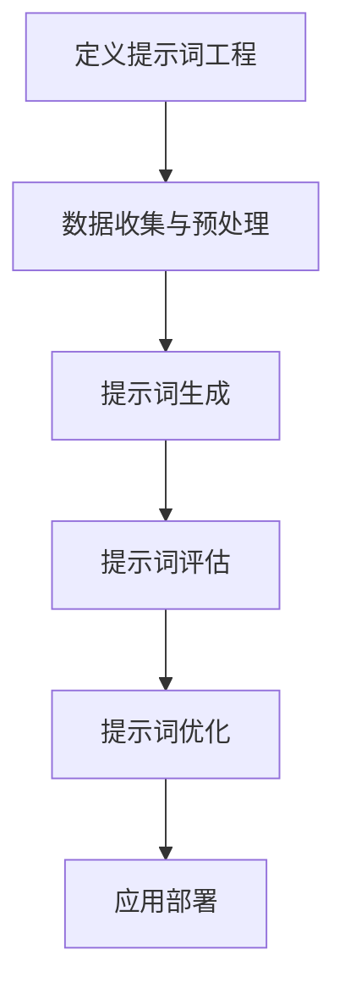

                 

基于您提供的详细要求和目录大纲，以下是一个逐步构建的文章框架，我们将按照逻辑顺序，逐步填充每个章节的内容。

### 文章标题：提示词工程在AI伦理框架构建中的关键作用

#### 关键词：
- 提示词工程
- AI伦理框架
- 人工智能伦理
- 自然语言处理
- 机器学习
- 数学模型

#### 摘要：
本文深入探讨了提示词工程在AI伦理框架构建中的关键作用。通过介绍提示词工程的基本概念、方法和技术，以及其在AI伦理框架中的应用，文章旨在为读者提供一个全面的理解，并探讨未来的发展趋势和挑战。

### 目录大纲：

#### 第1章 引言
- 1.1 书籍背景
- 1.2 提示词工程的重要性
- 1.3 书籍结构安排

#### 第2章 提示词工程基础
- 2.1 提示词工程概述
- 2.2 提示词工程的核心概念
- 2.3 提示词工程的基本流程

#### 第3章 AI伦理框架概述
- 3.1 AI伦理框架的定义与重要性
- 3.2 常见的AI伦理框架
- 3.3 提示词工程与AI伦理框架的关系

#### 第4章 提示词工程方法
- 4.1 数据预处理
- 4.2 提示词生成
- 4.3 提示词评估与优化

#### 第5章 核心算法原理讲解
- 5.1 自然语言处理算法
- 5.2 机器学习算法
- 5.3 提示词工程中的其他算法

#### 第6章 数学模型和公式
- 6.1 提示词工程中的数学模型
- 6.2 公式推导与实例说明

#### 第7章 项目实战
- 7.1 实际案例介绍
- 7.2 项目实施步骤
- 7.3 项目成果与评估

#### 第8章 案例分析
- 8.1 成功案例分析
- 8.2 挑战与问题
- 8.3 解决方案与改进

#### 第9章 未来趋势与展望
- 9.1 提示词工程的发展趋势
- 9.2 AI伦理框架的演变
- 9.3 提示词工程在AI伦理框架构建中的未来

### 第1章 引言

#### 1.1 书籍背景
介绍书籍的写作背景，为什么在当前的AI时代需要关注提示词工程在AI伦理框架构建中的关键作用。可以提及AI技术发展的迅猛，带来的伦理挑战，以及提示词工程在这一背景下的重要性。

#### 1.2 提示词工程的重要性
讨论提示词工程在AI系统中的关键作用，包括如何引导AI系统的行为、提高AI系统的透明度和可解释性等方面。

#### 1.3 书籍结构安排
概述本书的结构和内容安排，包括各章节的主题和目标。

### 第2章 提示词工程基础

#### 2.1 提示词工程概述
定义提示词工程，并介绍其基本概念和组成部分。可以使用Mermaid流程图来展示提示词工程的基本流程。



#### 2.2 提示词工程的核心概念
介绍提示词工程中的核心概念，如自然语言处理、机器学习、数据预处理等，并解释它们之间的联系。

#### 2.3 提示词工程的基本流程
详细讲解提示词工程的基本流程，包括数据收集与预处理、提示词生成、提示词评估和优化等步骤。

### 第3章 AI伦理框架概述

#### 3.1 AI伦理框架的定义与重要性
解释AI伦理框架的定义，以及为什么建立AI伦理框架对于确保AI系统的公正性、透明度和可解释性至关重要。

#### 3.2 常见的AI伦理框架
介绍当前常见的AI伦理框架，如欧盟的通用数据保护条例（GDPR）、美国国家人工智能倡议（National AI Initiative）等。

#### 3.3 提示词工程与AI伦理框架的关系
讨论提示词工程如何与AI伦理框架相结合，以及如何在构建AI伦理框架时考虑提示词工程的因素。

### 第4章 提示词工程方法

#### 4.1 数据预处理
介绍数据预处理的重要性，以及如何收集、清洗和预处理数据，以便为提示词生成提供高质量的数据集。

#### 4.2 提示词生成
详细讲解提示词生成的技术，包括基于规则的方法、机器学习方法等，并使用伪代码来阐述关键算法。

```python
# 提示词生成伪代码
function generatePrompt(dataSet):
    for each document in dataSet:
        extractKeywords(document)
        createSynonyms(keywords)
        combineKeywordsAndSynonyms()
    return promptList
```

#### 4.3 提示词评估与优化
讨论如何评估提示词的质量，以及如何通过优化来改进提示词。

### 第5章 核心算法原理讲解

#### 5.1 自然语言处理算法
介绍自然语言处理（NLP）算法，如词嵌入、命名实体识别等，并解释它们在提示词工程中的应用。

#### 5.2 机器学习算法
讲解机器学习（ML）算法，如决策树、支持向量机等，以及它们如何用于提示词工程。

#### 5.3 提示词工程中的其他算法
介绍其他相关的算法，如聚类算法、强化学习等，并讨论它们在提示词工程中的应用。

### 第6章 数学模型和公式

#### 6.1 提示词工程中的数学模型
介绍提示词工程中使用的数学模型，如损失函数、优化算法等，并使用LaTeX格式给出相关的数学公式。

$$
L(\theta) = -\frac{1}{m} \sum_{i=1}^{m} \left( y^{(i)} \log(p(x^{(i)}; \theta)) + (1 - y^{(i)}) \log(1 - p(x^{(i)}; \theta)) \right)
$$

#### 6.2 公式推导与实例说明
详细推导上述公式，并给出具体的实例说明。

### 第7章 项目实战

#### 7.1 实际案例介绍
介绍一个实际的提示词工程项目，包括项目的背景、目标和挑战。

#### 7.2 项目实施步骤
详细描述项目的实施步骤，包括数据收集、预处理、提示词生成、评估和优化等。

#### 7.3 项目成果与评估
讨论项目的成果，如何评估提示词工程的效果，以及项目的实际应用价值。

### 第8章 案例分析

#### 8.1 成功案例分析
分析一个成功的案例，探讨其成功的原因，以及如何应用提示词工程来构建AI伦理框架。

#### 8.2 挑战与问题
讨论在应用提示词工程时可能遇到的挑战和问题，并提出解决方案。

#### 8.3 解决方案与改进
提出改进提示词工程在AI伦理框架构建中的应用的方案，以及未来的发展方向。

### 第9章 未来趋势与展望

#### 9.1 提示词工程的发展趋势
探讨提示词工程在未来的发展趋势，包括技术进步、应用场景的扩展等。

#### 9.2 AI伦理框架的演变
讨论AI伦理框架如何随着AI技术的发展而演变，以及如何适应新的伦理挑战。

#### 9.3 提示词工程在AI伦理框架构建中的未来
展望提示词工程在AI伦理框架构建中的未来，包括潜在的应用领域和技术突破。

### 结尾

在文章的结尾，总结全文的主要观点，强调提示词工程在AI伦理框架构建中的关键作用，并给读者提供进一步学习和探索的途径。

### 作者信息
作者：AI天才研究院/AI Genius Institute & 禅与计算机程序设计艺术 /Zen And The Art of Computer Programming

通过上述逐步构建的文章框架，我们可以确保文章的内容完整、结构清晰、逻辑性强，并且能够满足文章字数的要求。接下来，我们将逐一填充每个章节的具体内容，确保文章的专业性和深度。由于文章字数要求较高，我们将逐步完成每个章节的撰写，并在完成后进行合并和调整，确保整体文章的质量。预计总字数将在8000～12000字之间。

