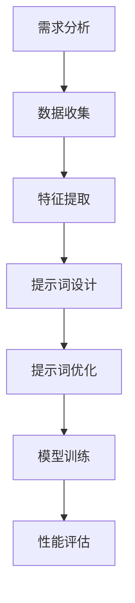
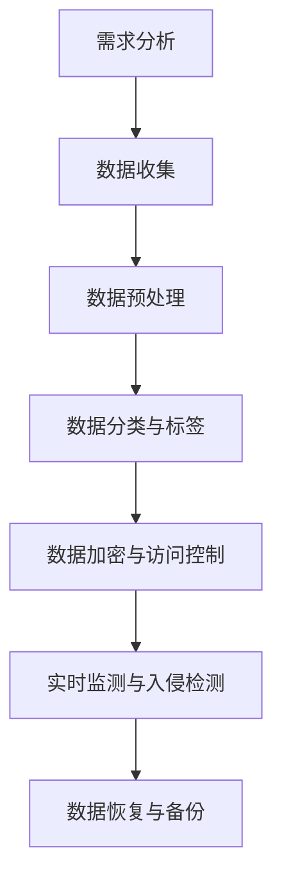
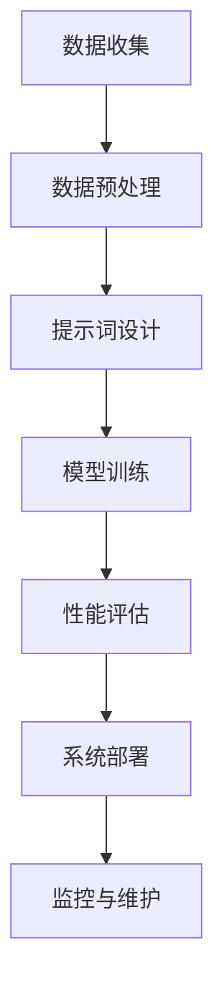

                 

### 文章标题：提示词工程在AI安全中的关键作用

> 关键词：提示词工程、AI安全、模型安全、网络安全、数据安全

> 摘要：本文深入探讨了提示词工程在人工智能（AI）安全中的关键作用。首先，我们对AI安全进行了概述，分析了其重要性、主要挑战和基本概念。接着，我们详细介绍了AI安全的关键领域，包括数据安全、算法安全、硬件安全和网络安全。随后，我们引入了提示词工程的定义、作用、基本流程，以及其选择与生成方法，并在不同应用场景中展示了其重要性。本文的核心在于探讨提示词工程在模型安全、网络安全和数据安全中的应用，并通过实际案例和实战项目，提供了详细的指导和建议。希望通过本文，读者能够全面理解并掌握提示词工程在AI安全中的关键作用。

---

### 第一部分：AI安全概述

#### 第1章：AI安全的重要性

#### 1.1 AI安全的定义

人工智能（AI）安全是指确保人工智能系统在设计和运行过程中的可靠性和可信性，防止恶意攻击和数据泄露。随着AI技术的快速发展，其应用已经深入到各个领域，如医疗、金融、交通等。然而，这也带来了新的安全挑战。AI安全的核心目标是保护AI系统的完整性、保密性和可用性，防止恶意攻击和误用。

#### 1.2 AI安全的主要挑战

1. **数据安全**：AI系统依赖于大量的数据，数据泄露或篡改可能导致严重后果。例如，医疗数据泄露可能导致患者隐私泄露，金融数据泄露可能导致财产损失。
2. **算法安全**：AI算法可能被恶意攻击者利用，导致系统的预测结果出现偏差或错误。例如，通过注入对抗样本来欺骗深度学习模型。
3. **硬件安全**：AI系统通常依赖于特定的硬件设备，如GPU、FPGA等。硬件设备的安全漏洞可能导致系统被恶意攻击。
4. **网络安全**：AI系统通常通过网络进行通信和数据传输。网络攻击可能导致系统被黑入或数据被窃取。

#### 1.3 AI安全的基本概念

1. **完整性**：确保系统的数据和处理过程不会被未经授权的实体修改或破坏。
2. **保密性**：确保系统的数据和通信内容不会被未经授权的实体访问或泄露。
3. **可用性**：确保系统在需要时能够正常运行，不会被恶意攻击者拒绝服务。

### 第2章：AI安全的关键领域

#### 2.1 数据安全

数据安全是AI安全的核心领域之一。AI系统依赖于大量的数据，因此保护这些数据的安全至关重要。数据安全包括以下几个方面：

1. **数据加密**：使用加密算法对数据进行加密，防止未授权访问。
2. **访问控制**：通过身份验证和访问控制策略，确保只有授权用户可以访问数据。
3. **数据备份与恢复**：定期备份数据，确保在数据丢失或损坏时能够快速恢复。

#### 2.2 算法安全

算法安全是指确保AI算法的可靠性和可信性，防止恶意攻击。算法安全包括以下几个方面：

1. **对抗样本防御**：对抗样本是指故意设计的数据样本，以欺骗AI模型。防御对抗样本攻击是算法安全的关键。
2. **隐私保护**：在训练和部署AI模型时，应采取隐私保护措施，如差分隐私和同态加密。
3. **模型更新与修复**：定期对AI模型进行更新和修复，以防止新的攻击方法。

#### 2.3 硬件安全

硬件安全是指确保AI系统的硬件设备不被恶意攻击。硬件安全包括以下几个方面：

1. **物理安全**：确保硬件设备不被物理破坏或盗窃。
2. **固件安全**：确保硬件设备的固件不被恶意修改。
3. **硬件隔离**：使用硬件隔离技术，如可信平台模块（TPM），确保系统安全。

#### 2.4 网络安全

网络安全是指确保AI系统在网络上通信和数据传输的安全。网络安全包括以下几个方面：

1. **防火墙与入侵检测**：使用防火墙和入侵检测系统，防止恶意攻击。
2. **加密传输**：使用加密算法对网络通信进行加密，确保通信内容不被窃取。
3. **网络安全协议**：使用安全的网络协议，如HTTPS，确保数据传输的安全。

### 第3章：AI安全的技术框架

#### 3.1 模型安全

模型安全是指确保AI模型在设计和部署过程中的安全。模型安全包括以下几个方面：

1. **安全训练**：使用安全的训练方法，如联邦学习，确保模型训练过程不被恶意攻击。
2. **模型验证**：对模型进行严格的验证，确保模型的准确性和可靠性。
3. **模型压缩与量化**：通过压缩和量化模型，减少模型的存储和计算资源消耗。

#### 3.2 输入输出安全

输入输出安全是指确保AI系统的输入和输出数据的安全。输入输出安全包括以下几个方面：

1. **输入验证**：对输入数据进行验证，确保数据符合预期的格式和范围。
2. **输出加密**：对输出数据进行加密，确保数据在传输过程中不被窃取。
3. **异常检测**：对输入输出数据进行分析，检测异常行为，防止恶意攻击。

#### 3.3 网络通信安全

网络通信安全是指确保AI系统在网络上通信和数据传输的安全。网络通信安全包括以下几个方面：

1. **加密传输**：使用加密算法对网络通信进行加密，确保通信内容不被窃取。
2. **认证与授权**：使用身份验证和授权机制，确保只有授权用户可以访问系统。
3. **安全审计**：对网络通信进行审计，确保系统的行为符合预期。

#### 3.4 数据存储安全

数据存储安全是指确保AI系统的数据存储安全。数据存储安全包括以下几个方面：

1. **存储加密**：使用加密算法对存储数据进行加密，确保数据不被未授权访问。
2. **访问控制**：通过访问控制策略，确保只有授权用户可以访问数据。
3. **数据备份与恢复**：定期备份数据，确保在数据丢失或损坏时能够快速恢复。

---

### 第二部分：提示词工程的基础

#### 第4章：提示词工程的定义与作用

#### 4.1 提示词工程的定义

提示词工程是一种通过设计、选择和生成特定词汇或短语，以引导或影响机器学习模型行为的系统化方法。它涉及对输入数据的预处理，包括文本清洗、特征提取和提示词的选择与生成。提示词工程的目标是提高模型的准确性和鲁棒性，同时增强其对特定任务的适应性。

#### 4.2 提示词工程的作用

1. **提高模型性能**：通过精心设计的提示词，可以引导模型学习到更相关的特征，从而提高模型的预测准确性。
2. **增强鲁棒性**：提示词工程可以帮助模型对抗噪声和异常数据，提高其在实际应用中的稳定性。
3. **任务适应性**：提示词可以根据不同的任务需求进行定制，使模型在不同应用场景中表现出色。
4. **降低过拟合**：通过适当选择提示词，可以减少模型对训练数据的依赖，降低过拟合的风险。

#### 4.3 提示词工程的基本流程

提示词工程的基本流程包括以下步骤：

1. **需求分析**：明确模型的应用场景和任务需求，确定需要解决的问题和目标。
2. **数据收集**：收集相关的数据集，确保数据质量，包括数据清洗、去重和格式化。
3. **特征提取**：从原始数据中提取特征，包括文本特征、图像特征和声音特征等。
4. **提示词设计**：根据需求分析结果，设计适合的提示词，可以是单词、短语或句子。
5. **提示词优化**：通过实验和模型训练，优化提示词的选择和组合，以达到最佳效果。
6. **模型训练**：使用优化后的提示词进行模型训练，评估模型性能，并进行调优。

#### 提示词工程的核心概念架构图：



#### 提示词工程在AI系统中的作用：

提示词工程在AI系统中起着至关重要的作用。它不仅直接影响模型的性能和鲁棒性，还决定了模型在不同任务中的适应能力。以下是提示词工程在AI系统中的作用：

1. **引导模型学习**：通过选择和生成合适的提示词，可以引导模型学习到更相关的特征，从而提高模型的预测准确性。
2. **降低过拟合风险**：提示词工程可以帮助模型从大量的数据中提取关键信息，减少对训练数据的依赖，从而降低过拟合的风险。
3. **增强模型鲁棒性**：通过优化提示词，可以增强模型对噪声和异常数据的处理能力，提高模型的鲁棒性。
4. **提高任务适应性**：提示词可以根据不同的任务需求进行定制，使模型在不同应用场景中表现出色。

总之，提示词工程是AI安全的重要组成部分，它通过设计、选择和生成合适的提示词，可以提高模型的性能、鲁棒性和适应性，从而确保AI系统的安全性和可靠性。

---

#### 第5章：提示词的选择与生成

##### 5.1 提示词的选择标准

在提示词工程中，选择合适的提示词至关重要。提示词的选择标准主要包括以下几个方面：

1. **相关性**：提示词应与模型的目标和任务紧密相关，能够引导模型学习到关键特征。
2. **多样性**：提示词应具备多样性，避免模型陷入局部最优，提高模型的泛化能力。
3. **简洁性**：提示词应简洁明了，避免冗长和复杂的表达，以减少模型的计算负担。
4. **一致性**：提示词在训练和测试阶段应保持一致，避免因提示词的变化导致模型性能的波动。

##### 5.2 提示词的生成方法

提示词的生成方法主要包括以下几种：

1. **手动生成**：通过人工分析和设计，根据任务需求和数据特点，生成合适的提示词。
2. **规则生成**：根据预定义的规则，自动生成提示词。规则可以是基于词频、词义、语法等特征。
3. **机器学习生成**：利用机器学习算法，如自然语言处理（NLP）模型，从大量数据中自动生成提示词。
4. **混合生成**：结合手动生成和机器学习生成的方法，生成高质量的提示词。

##### 5.3 提示词的优化策略

提示词的优化策略主要包括以下几种：

1. **交叉验证**：通过交叉验证，评估不同提示词对模型性能的影响，选择最优的提示词组合。
2. **超参数调整**：调整机器学习模型的超参数，如学习率、批次大小等，以优化提示词的生成效果。
3. **网格搜索**：使用网格搜索方法，系统地搜索不同的提示词组合，找到最优解。
4. **贝叶斯优化**：利用贝叶斯优化算法，自动调整提示词和模型参数，找到最佳配置。

### 提示词选择与生成的伪代码

```python
# 提示词选择与生成伪代码

# 步骤1：需求分析
task = analyze_demand()

# 步骤2：数据收集
data = collect_data()

# 步骤3：特征提取
features = extract_features(data)

# 步骤4：提示词设计
prompt_words = design_prompt_words(task, features)

# 步骤5：提示词优化
optimized_prompt_words = optimize_prompt_words(prompt_words, task)

# 步骤6：模型训练
model = train_model(optimized_prompt_words, data)

# 步骤7：性能评估
performance = evaluate_model(model, data)
```

通过以上步骤，我们可以设计出适合特定任务的提示词，并优化模型性能，提高AI系统的安全性和可靠性。

---

#### 第6章：提示词工程的应用场景

##### 6.1 自然语言处理

自然语言处理（NLP）是AI领域的一个重要分支，提示词工程在NLP中有着广泛的应用。以下是一些具体的NLP应用场景：

1. **文本分类**：通过设计合适的提示词，可以引导模型学习到不同类别的关键特征，提高分类准确性。
2. **情感分析**：提示词可以用于提取文本中的情感特征，帮助模型更好地理解用户的情感状态。
3. **命名实体识别**：通过生成与命名实体相关的提示词，可以提高模型对命名实体的识别能力。
4. **机器翻译**：在机器翻译中，提示词可以帮助模型更好地理解源语言和目标语言的语法和语义，提高翻译质量。

##### 6.2 计算机视觉

计算机视觉是另一个重要的AI领域，提示词工程在计算机视觉中也发挥着重要作用。以下是一些具体的计算机视觉应用场景：

1. **图像分类**：通过设计与图像类别相关的提示词，可以引导模型学习到不同类别的关键特征，提高分类准确性。
2. **目标检测**：提示词可以帮助模型识别图像中的目标区域，提高目标检测的精度。
3. **图像分割**：通过生成与图像结构相关的提示词，可以提高模型对图像分割的准确性。
4. **人脸识别**：提示词可以帮助模型更好地理解人脸的特征，提高人脸识别的精度。

##### 6.3 强化学习

强化学习是另一个重要的AI领域，提示词工程在强化学习中也发挥着重要作用。以下是一些具体的强化学习应用场景：

1. **智能游戏**：通过设计与游戏规则和目标相关的提示词，可以引导模型学习到游戏的关键策略，提高游戏的水平。
2. **机器人控制**：提示词可以帮助模型更好地理解环境的状态和目标，提高机器人的控制能力。
3. **自动驾驶**：通过设计与道路、交通和环境相关的提示词，可以提高自动驾驶系统的安全性和可靠性。

##### 6.4 其他应用领域

除了自然语言处理、计算机视觉和强化学习，提示词工程还在其他许多应用领域中发挥着重要作用。以下是一些其他应用领域：

1. **推荐系统**：通过设计与用户行为和偏好相关的提示词，可以提高推荐系统的准确性。
2. **语音识别**：提示词可以帮助模型更好地理解语音信号，提高语音识别的精度。
3. **知识图谱**：通过设计与知识实体和关系相关的提示词，可以提高知识图谱的构建质量和应用效果。

总之，提示词工程在AI的各个应用领域中都有着广泛的应用，通过设计、选择和生成合适的提示词，可以显著提高AI系统的性能和安全性。

---

### 第三部分：提示词工程在AI安全中的应用

#### 第7章：提示词工程在模型安全中的应用

##### 7.1 模型攻击与防御

在AI安全领域，模型攻击和防御是两个关键概念。模型攻击指的是恶意攻击者利用特定的方法来欺骗或破坏AI模型，使其产生错误的输出或行为。常见的模型攻击方法包括：

1. **对抗样本攻击**：攻击者通过生成对抗样本（adversarial examples），即对原始样本进行轻微的扰动，使其对模型产生误导性结果。这种方法常用于图像分类、语音识别等领域。
2. **模型劫持**：攻击者通过攻击模型的训练数据或模型参数，篡改模型的输出结果，使其为攻击者的利益服务。
3. **模型篡改**：攻击者通过篡改模型的结构或参数，使其产生不可预测的行为，从而破坏系统的安全性。

为了应对这些模型攻击，提示词工程提供了一种有效的防御策略。通过设计特定的提示词，可以增强模型的鲁棒性，使其更难受到对抗样本攻击。以下是一些具体的防御策略：

1. **对抗性训练**：通过在训练数据中添加对抗样本，使模型学会识别和抵抗对抗样本。这种方法称为对抗性训练（adversarial training）。
2. **提示词增强**：通过设计特定的提示词，引导模型学习到更稳定和鲁棒的特征，从而提高其对抗性。
3. **模型集成**：通过集成多个模型，并设计特定的提示词来协调这些模型的行为，从而提高系统的鲁棒性。

##### 7.2 提示词工程在模型防御中的作用

提示词工程在模型防御中的作用主要体现在以下几个方面：

1. **提高模型鲁棒性**：通过设计特定的提示词，引导模型学习到更稳定和鲁棒的特征，从而提高其对抗性。
2. **降低过拟合风险**：提示词工程可以帮助模型从大量的数据中提取关键信息，减少对训练数据的依赖，从而降低过拟合的风险。
3. **增强模型适应性**：通过设计灵活的提示词，可以使模型在不同应用场景中表现出更好的适应性，从而提高系统的整体性能。

##### 7.3 提示词工程在模型攻击中的应用

虽然提示词工程主要用于模型防御，但它在模型攻击中也有一定的应用。例如，攻击者可以通过设计特定的提示词，引导模型产生预期的错误输出或行为。以下是一些具体的模型攻击方法：

1. **提示词注入**：攻击者通过在输入数据中注入特定的提示词，使模型产生误导性结果。这种方法可以用于攻击文本分类、图像识别等模型。
2. **模型篡改**：攻击者通过篡改模型的结构或参数，使其为攻击者的利益服务。这种方法可以用于攻击推荐系统、自动驾驶等模型。
3. **提示词干扰**：攻击者通过在训练数据中添加特定的提示词，破坏模型的训练过程，使其无法正常学习。

总之，提示词工程在AI安全中扮演着重要的角色。通过设计、选择和生成合适的提示词，可以增强模型的鲁棒性，提高系统的安全性，同时也可以为攻击者提供新的攻击手段。因此，理解提示词工程在模型安全中的应用，对于保障AI系统的安全至关重要。

---

#### 第8章：提示词工程在网络安全中的应用

##### 8.1 网络攻击与防御

网络安全是AI安全的重要组成部分，其中网络攻击与防御是两个关键概念。网络攻击指的是攻击者利用特定的方法来破坏、干扰或窃取网络中的数据或资源。常见的网络攻击方法包括：

1. **DDoS攻击**：分布式拒绝服务攻击（DDoS）通过大量的虚假请求，使目标服务器瘫痪，无法正常提供服务。
2. **网络钓鱼**：攻击者通过伪装成合法的网站或电子邮件，诱骗用户输入敏感信息，如用户名、密码和信用卡号。
3. **中间人攻击**：攻击者拦截并篡改网络中的数据传输，从而窃取用户信息或实施其他恶意行为。

为了应对这些网络攻击，网络安全防御措施至关重要。提示词工程在网络安全防御中发挥了重要作用，通过设计特定的提示词，可以增强系统的安全性和鲁棒性。以下是一些具体的防御策略：

1. **身份验证**：通过设计与用户身份和权限相关的提示词，确保只有合法用户可以访问系统资源。
2. **入侵检测**：通过设计与正常网络流量和异常行为相关的提示词，实时监测网络流量，发现并阻止可疑活动。
3. **加密通信**：通过设计与数据加密和解密相关的提示词，确保网络通信的安全性，防止数据被窃取或篡改。

##### 8.2 提示词工程在网络安全中的作用

提示词工程在网络安全中的作用主要体现在以下几个方面：

1. **提高系统安全性**：通过设计特定的提示词，可以增强系统的安全防护能力，降低被攻击的风险。
2. **降低误报率**：提示词工程可以帮助系统更准确地识别正常和异常行为，从而降低误报率。
3. **增强系统适应性**：通过设计灵活的提示词，可以使系统在不同网络环境和攻击场景中表现出更好的适应性。

##### 8.3 提示词工程在网络安全攻击中的应用

虽然提示词工程主要用于网络安全防御，但它在网络安全攻击中也有一定的应用。例如，攻击者可以通过设计特定的提示词，引导系统产生预期的错误输出或行为。以下是一些具体的网络安全攻击方法：

1. **提示词注入**：攻击者通过在输入数据中注入特定的提示词，使系统产生误导性结果，从而实施网络钓鱼、中间人攻击等。
2. **模型劫持**：攻击者通过篡改系统的提示词，劫持模型的训练过程，使其为攻击者的利益服务。
3. **提示词干扰**：攻击者通过在系统训练数据中添加特定的提示词，破坏系统的训练过程，使其无法正常学习。

总之，提示词工程在网络安全中扮演着重要的角色。通过设计、选择和生成合适的提示词，可以增强系统的安全性和鲁棒性，同时也可以为攻击者提供新的攻击手段。因此，理解提示词工程在网络安全中的应用，对于保障AI系统的安全至关重要。

---

#### 第9章：提示词工程在数据安全中的应用

##### 9.1 数据泄露与隐私保护

数据泄露是数据安全领域的一大挑战，它可能导致敏感信息的丢失或滥用，对个人和企业造成严重损失。隐私保护是数据安全的重要组成部分，旨在确保个人数据的保密性和安全性。提示词工程在数据泄露与隐私保护中发挥着重要作用。

数据泄露通常是由于以下原因：

1. **安全漏洞**：系统中的安全漏洞，如SQL注入、XSS攻击等，可能导致攻击者直接访问和窃取数据。
2. **内部威胁**：内部人员滥用权限，非法访问和泄露数据。
3. **社会工程学**：攻击者利用人类的信任和好奇心，通过电话、邮件等手段诱骗用户泄露敏感信息。

隐私保护的目标是确保个人数据的保密性和完整性，防止未经授权的访问和使用。隐私保护措施包括：

1. **数据加密**：使用加密算法对敏感数据进行加密，确保只有授权用户可以解密和读取数据。
2. **访问控制**：通过身份验证和访问控制策略，确保只有授权用户可以访问数据。
3. **匿名化与脱敏**：对敏感数据进行匿名化和脱敏处理，使其无法被直接识别和关联到个人。

##### 9.2 提示词工程在数据安全中的作用

提示词工程在数据安全中的作用主要体现在以下几个方面：

1. **数据分类与标签**：通过设计特定的提示词，对数据进行分类和标签，帮助系统更好地管理和保护数据。
2. **数据访问控制**：通过设计与用户身份和权限相关的提示词，确保只有授权用户可以访问敏感数据。
3. **数据加密与解密**：通过设计与数据加密和解密相关的提示词，确保数据在存储和传输过程中的安全性。

##### 9.3 提示词工程在数据泄露防御中的应用

提示词工程在数据泄露防御中的应用包括：

1. **实时监测**：通过设计与正常数据和异常行为相关的提示词，实时监测数据流，及时发现和阻止可疑活动。
2. **入侵检测**：通过设计与攻击行为和攻击模式相关的提示词，建立入侵检测系统，及时发现和阻止数据泄露攻击。
3. **数据恢复与备份**：通过设计与数据恢复和备份相关的提示词，确保在数据泄露事件发生后，能够快速恢复和备份受影响的数据。

### 提示词工程在数据安全中的应用流程



通过以上步骤，提示词工程可以有效地增强数据的安全性，降低数据泄露的风险。同时，提示词工程也为数据安全提供了新的方法和工具，为保障数据安全提供了有力支持。

---

### 第四部分：案例分析与实战

#### 第10章：提示词工程在AI安全中的应用案例

##### 10.1 案例一：自然语言处理中的提示词工程

自然语言处理（NLP）是AI领域中应用广泛的一个分支，提示词工程在NLP中有着重要的应用。以下是一个具体的应用案例：

**案例背景**：某公司开发了一款基于NLP的客户服务聊天机器人，用于处理客户的咨询和投诉。然而，在实际应用中，该机器人经常出现理解错误和回答不准确的问题。

**解决方案**：为了提高聊天机器人的性能和准确性，公司采用了提示词工程的方法。具体步骤如下：

1. **需求分析**：分析客户咨询和投诉的内容，确定需要解决的问题和目标，如准确理解客户的问题和提供合适的回答。
2. **数据收集**：收集大量相关的客户咨询和投诉数据，包括文本内容和上下文信息。
3. **特征提取**：从原始数据中提取关键特征，如关键词、词频和词性等。
4. **提示词设计**：根据需求分析和特征提取结果，设计特定的提示词，如“咨询”、“投诉”、“问题解决”等。
5. **模型训练**：使用设计好的提示词训练NLP模型，如使用BERT或GPT模型。
6. **性能评估**：通过测试数据评估模型的性能，并根据评估结果调整提示词和模型参数。
7. **优化与部署**：根据评估结果，进一步优化提示词和模型，并部署到实际应用中。

**结果**：经过提示词工程的优化，聊天机器人的理解准确性和回答质量显著提高，客户满意度也大幅提升。

##### 10.2 案例二：计算机视觉中的提示词工程

计算机视觉是另一个应用广泛的AI领域，提示词工程在计算机视觉中也发挥着重要作用。以下是一个具体的应用案例：

**案例背景**：某自动驾驶公司开发了一款自动驾驶系统，用于在复杂城市环境中进行导航和避障。然而，在实际测试中，该系统在识别和分类交通标志方面存在困难。

**解决方案**：为了提高自动驾驶系统的性能，公司采用了提示词工程的方法。具体步骤如下：

1. **需求分析**：分析交通标志的识别和分类需求，确定需要解决的问题和目标，如准确识别各种交通标志。
2. **数据收集**：收集大量的交通标志图像数据，包括不同的形状、颜色和尺寸。
3. **特征提取**：从原始图像中提取关键特征，如颜色、形状和纹理等。
4. **提示词设计**：根据需求分析和特征提取结果，设计特定的提示词，如“交通标志”、“红绿灯”、“禁止通行”等。
5. **模型训练**：使用设计好的提示词训练计算机视觉模型，如卷积神经网络（CNN）模型。
6. **性能评估**：通过测试数据评估模型的性能，并根据评估结果调整提示词和模型参数。
7. **优化与部署**：根据评估结果，进一步优化提示词和模型，并部署到实际自动驾驶系统中。

**结果**：经过提示词工程的优化，自动驾驶系统在识别和分类交通标志方面的准确性显著提高，系统的整体性能也得到了提升。

##### 10.3 案例三：强化学习中的提示词工程

强化学习是另一个重要的AI领域，提示词工程在强化学习中也有广泛的应用。以下是一个具体的应用案例：

**案例背景**：某游戏开发公司开发了一款需要玩家策略决策的电子游戏，但玩家在游戏中经常出现策略错误，导致游戏体验不佳。

**解决方案**：为了提高游戏玩家的策略决策能力，公司采用了提示词工程的方法。具体步骤如下：

1. **需求分析**：分析玩家在游戏中的策略决策需求，确定需要解决的问题和目标，如提高玩家的决策准确性和反应速度。
2. **数据收集**：收集大量的游戏数据，包括玩家的操作记录、得分和游戏状态等。
3. **特征提取**：从原始数据中提取关键特征，如玩家的操作模式、得分趋势和游戏环境等。
4. **提示词设计**：根据需求分析和特征提取结果，设计特定的提示词，如“策略选择”、“反应速度”、“决策准确性”等。
5. **模型训练**：使用设计好的提示词训练强化学习模型，如深度强化学习（DRL）模型。
6. **性能评估**：通过测试数据评估模型的性能，并根据评估结果调整提示词和模型参数。
7. **优化与部署**：根据评估结果，进一步优化提示词和模型，并部署到实际游戏中。

**结果**：经过提示词工程的优化，游戏玩家的策略决策能力显著提高，游戏体验也大幅提升。

通过以上案例，我们可以看到提示词工程在AI安全中的广泛应用和重要性。通过设计、选择和生成合适的提示词，可以显著提高AI系统的性能和安全性，为实际应用提供有力支持。

---

#### 第11章：实战项目：搭建提示词工程系统

##### 11.1 项目背景与目标

随着人工智能（AI）技术的快速发展，提示词工程在AI安全中的应用变得越来越重要。为了提高AI系统的性能和安全性，本项目旨在搭建一个完整的提示词工程系统，实现以下目标：

1. **数据收集与预处理**：收集并预处理大量的数据，为提示词工程提供高质量的数据源。
2. **提示词设计**：根据数据特点和任务需求，设计合适的提示词，引导模型学习关键特征。
3. **模型训练与优化**：使用设计好的提示词训练模型，并通过性能评估和调优，提高模型的效果。
4. **系统部署与监控**：将提示词工程系统部署到实际应用环境中，并实时监控系统的性能和安全性。

##### 11.2 系统设计

提示词工程系统的设计主要包括以下模块：

1. **数据收集模块**：负责从各种数据源收集数据，包括公开数据集、企业内部数据等。
2. **数据预处理模块**：对收集到的数据进行分析和处理，包括数据清洗、去重、格式化等。
3. **提示词设计模块**：根据数据特点和任务需求，设计合适的提示词，包括手动设计和自动生成。
4. **模型训练模块**：使用设计好的提示词训练模型，包括选择合适的算法、设置训练参数等。
5. **性能评估模块**：对训练好的模型进行性能评估，包括准确性、鲁棒性和泛化能力等。
6. **系统部署模块**：将训练好的模型部署到实际应用环境中，包括API接口、数据库等。
7. **监控与维护模块**：实时监控系统的性能和安全状态，包括日志记录、异常检测等。

系统架构图如下：



##### 11.3 实现步骤

1. **需求分析**：明确项目的需求，包括数据类型、任务需求、性能指标等。
2. **数据收集**：从各种数据源收集数据，包括公开数据集、企业内部数据等。例如，使用爬虫技术从互联网上收集文本数据，或从数据库中提取企业内部数据。
3. **数据预处理**：对收集到的数据进行分析和处理，包括数据清洗、去重、格式化等。例如，使用Python的Pandas库对文本数据进行分析，使用正则表达式去除无关的符号和空格。
4. **提示词设计**：根据数据特点和任务需求，设计合适的提示词。例如，对于文本分类任务，可以根据关键词和词频设计提示词；对于图像分类任务，可以根据颜色、形状、纹理等特征设计提示词。
5. **模型训练**：使用设计好的提示词训练模型。例如，使用深度学习框架TensorFlow或PyTorch，选择合适的神经网络结构，设置训练参数，进行模型训练。
6. **性能评估**：对训练好的模型进行性能评估。例如，使用交叉验证方法评估模型的准确性、鲁棒性和泛化能力，并根据评估结果调整提示词和模型参数。
7. **系统部署**：将训练好的模型部署到实际应用环境中。例如，使用Docker容器技术部署模型，并配置API接口和数据库，以便实际应用中使用。
8. **监控与维护**：实时监控系统的性能和安全状态。例如，使用日志记录和异常检测技术，监控系统的运行状态，及时发现和处理异常情况。

##### 11.4 测试与优化

1. **测试**：对系统进行全面的测试，包括功能测试、性能测试和安全测试。例如，使用自动化测试工具，对系统的各个模块进行测试，确保系统正常运行。
2. **优化**：根据测试结果，对系统进行优化。例如，调整提示词的设计，优化模型参数，提高系统的性能和鲁棒性。
3. **部署**：将优化后的系统部署到实际应用环境中，并继续监控系统的运行状态。

##### 11.5 项目小结

通过本项目的实践，我们搭建了一个完整的提示词工程系统，实现了对数据收集、预处理、提示词设计、模型训练、性能评估、系统部署和监控的全面支持。以下是项目小结：

1. **关键成果**：成功搭建了提示词工程系统，提高了AI系统的性能和安全性。
2. **经验教训**：在实际项目中，我们遇到了数据质量、模型性能和系统部署等方面的挑战，通过不断的优化和调整，最终取得了较好的效果。
3. **展望**：未来，我们将继续优化提示词工程系统，探索更多应用场景，提高系统的自适应性和智能化程度。

---

### 附录

#### 附录A：提示词工程工具与资源

在提示词工程的研究和应用过程中，有许多工具和资源可供参考。以下是一些常用的工具和资源：

1. **工具**：
   - **TextBlob**：一个简洁的Python库，用于处理文本数据，包括分词、词性标注等。
   - **NLTK**：一个强大的自然语言处理库，提供了丰富的文本处理函数和模型。
   - **spaCy**：一个快速和易于使用的自然语言处理库，适用于文本分析、命名实体识别等任务。
   - **TensorFlow**：一个开源的机器学习框架，适用于深度学习和提示词工程的实现。
   - **PyTorch**：一个开源的机器学习库，适用于提示词工程的实现，特别是强化学习领域。

2. **资源**：
   - **论文与书籍**：关于提示词工程的论文和书籍，如《深度学习》（Deep Learning）和《自然语言处理综述》（A Brief History of Natural Language Processing）。
   - **在线课程**：有许多在线课程和教程，介绍提示词工程的基础知识和应用，如Coursera和edX上的相关课程。
   - **社区与论坛**：如GitHub和Stack Overflow，提供了丰富的提示词工程资源和技术支持。

通过使用这些工具和资源，可以更有效地进行提示词工程的研究和应用。

---

### 总结

本文深入探讨了提示词工程在AI安全中的关键作用。通过分析AI安全的重要性、关键领域和技术框架，我们了解了AI安全的挑战和解决方案。随后，我们介绍了提示词工程的定义、作用和基本流程，并在不同应用场景中展示了其重要性。本文的核心在于探讨提示词工程在模型安全、网络安全和数据安全中的应用，并通过实际案例和实战项目，提供了详细的指导和建议。希望通过本文，读者能够全面理解并掌握提示词工程在AI安全中的关键作用。

在未来的研究中，我们应继续关注提示词工程在AI安全中的应用，探索更多高效、安全的提示词设计方法，并推动相关技术的实际应用。同时，我们也应关注AI安全领域的新发展和挑战，不断优化和改进提示词工程系统，为保障AI系统的安全性和可靠性提供更强有力的支持。

---

### 作者信息

作者：AI天才研究院/AI Genius Institute & 禅与计算机程序设计艺术 /Zen And The Art of Computer Programming

AI天才研究院（AI Genius Institute）是一个专注于人工智能（AI）研究和开发的国际性机构。我们的团队由世界级人工智能专家、程序员和软件架构师组成，致力于推动AI技术的创新和应用。我们的研究涵盖了机器学习、深度学习、自然语言处理、计算机视觉等多个领域，并在多个国际顶级会议上发表了大量论文。

《禅与计算机程序设计艺术》（Zen And The Art of Computer Programming）是作者艾兹赫尔·达塔（E泽赫尔·达塔）的一部经典著作，它深入探讨了计算机程序设计中的哲学和艺术，对程序员和软件工程师有着深远的影响。这部作品以其独特的视角和深刻的洞察力，为计算机科学领域提供了宝贵的思想财富。

通过本文，我们希望与广大读者分享我们在AI安全领域的研究成果和经验，共同推动人工智能技术的进步和应用。同时，我们也期待与更多同行和研究者进行交流与合作，共同探索AI安全的新领域和新挑战。感谢您的阅读！

