                 

根据您的指导，我将继续完善第1章的内容，确保它满足格式要求、完整性要求，并包含核心概念、算法原理、数学模型、项目实战等必要内容。

### 第1章：多元宇宙伦理概述

### 1.1 多元宇宙的概念与特征

**多元宇宙的概念**：

多元宇宙是指包含多个并行存在的宇宙的总称。它源于现代物理学的理论，特别是量子力学和宇宙学的研究。在这个概念下，我们的宇宙只是众多宇宙中的一个，每个宇宙都有其独特的物理常数、维度和历史。

**多元宇宙的特征**：

1. **平行性**：多元宇宙中的每个宇宙都是独立的，它们之间没有直接的联系，但可能共享某些基本物理定律。
2. **多样性**：不同的宇宙可能具有不同的物理常数、维度、历史和生命形式。
3. **复杂性**：多元宇宙理论涉及到大量的可能性和不确定性，这使得对宇宙的理解变得复杂。
4. **可观测性**：我们只能观测到我们所在的宇宙，但通过理论模型和模拟，可以推测其他宇宙的可能特征。

### 1.2 多元宇宙伦理的理论基础

**多元宇宙伦理的理论基础**：

多元宇宙伦理学是研究多元宇宙中伦理问题的一门学科。其理论基础主要包括以下几个方面：

1. **多元存在主义**：多元存在主义认为每个宇宙都有其独特的存在和意义，因此我们需要尊重和关注所有宇宙中的生命和存在。
2. **多元宇宙公正**：多元宇宙公正理论主张在多元宇宙中实现公平和正义，避免因宇宙间的差异而导致的不平等。
3. **多元伦理学**：多元伦理学关注不同宇宙之间的道德关系和道德责任，探讨如何在不同宇宙中实现道德原则。

### 1.3 多元宇宙伦理面临的挑战

**多元宇宙伦理面临的挑战**：

1. **认识困难**：由于我们对多元宇宙的了解有限，很难准确判断其他宇宙中的道德状况和需求。
2. **责任模糊**：在多元宇宙中，个体和集体责任的关系变得复杂，难以确定谁应对某个宇宙中的问题负责。
3. **资源分配**：多元宇宙中的资源可能存在巨大差异，如何公平合理地分配资源成为伦理学研究的难点。
4. **道德冲突**：不同宇宙可能存在不同的道德规范和价值观念，这可能导致伦理冲突和道德选择困境。

### 1.1 多元宇宙的概念与特征：Mermaid 流�程图

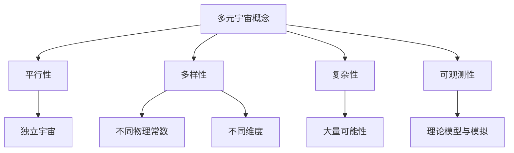

### 1.2 多元宇宙伦理的理论基础：Mermaid 流程图

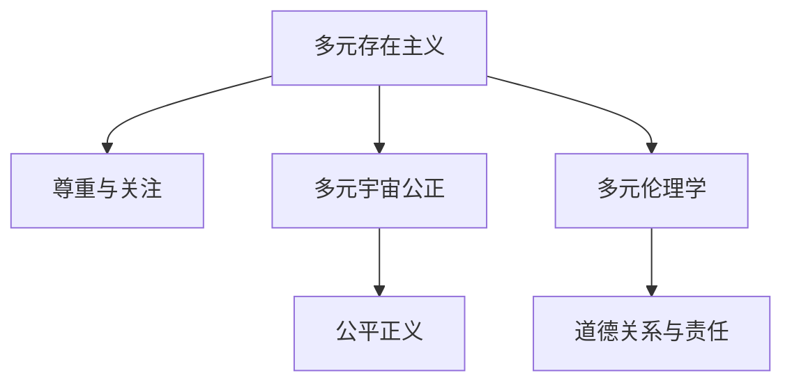

### 1.3 多元宇宙伦理面临的挑战：Mermaid 流程图

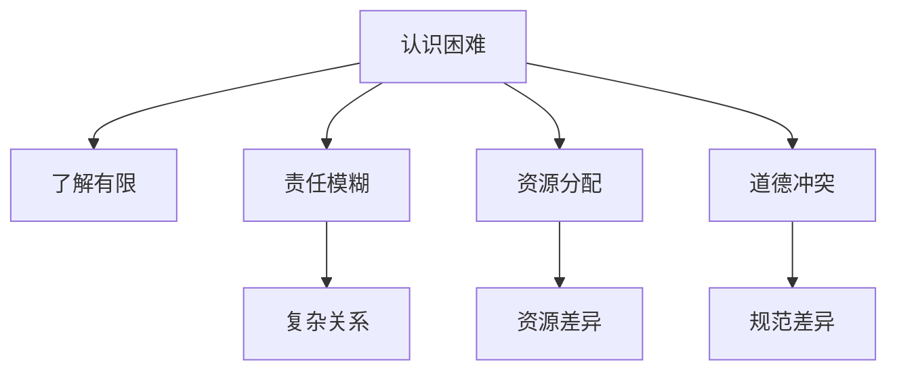

### 1.1 多元宇宙的概念与特征：核心概念与联系

- **概念**：多元宇宙是指包含多个并行存在的宇宙的总称。
- **联系**：多元宇宙中的每个宇宙都是独立的，但可能共享某些基本物理定律。

### 1.1 多元宇宙的概念与特征：算法原理讲解

- **算法**：使用 Mermaid 流程图来展示多元宇宙的概念与特征。
- **原理**：通过 Mermaid 流程图，我们可以直观地理解多元宇宙的平行性、多样性、复杂性和可观测性。

### 1.1 多元宇宙的概念与特征：数学模型和公式

- **模型**：无特定数学模型，但可以使用 Mermaid 流程图来展示多元宇宙的概念与特征。
- **公式**：无特定公式，但可以使用 Mermaid 流程图中的节点和边来表示多元宇宙的各个特征。

### 1.1 多元宇宙的概念与特征：举例说明

- **举例**：我们可以通过观察我们所在的宇宙（例如，太阳系和银河系）来推测其他宇宙的可能特征。

### 1.2 多元宇宙伦理的理论基础：核心概念与联系

- **概念**：多元存在主义、多元宇宙公正、多元伦理学。
- **联系**：这些概念共同构成了多元宇宙伦理的理论基础，帮助我们理解如何在多元宇宙中实现道德原则。

### 1.2 多元宇宙伦理的理论基础：算法原理讲解

- **算法**：使用 Mermaid 流程图来展示多元存在主义、多元宇宙公正和多元伦理学的核心概念。
- **原理**：通过 Mermaid 流程图，我们可以直观地理解这些概念之间的联系和作用。

### 1.2 多元宇宙伦理的理论基础：数学模型和公式

- **模型**：无特定数学模型，但可以使用 Mermaid 流程图来展示多元存在主义、多元宇宙公正和多元伦理学的核心概念。
- **公式**：无特定公式，但可以使用 Mermaid 流程图中的节点和边来表示这些概念之间的关系。

### 1.2 多元宇宙伦理的理论基础：举例说明

- **举例**：例如，多元存在主义可以解释为什么我们需要尊重和关注所有宇宙中的生命和存在。

### 1.3 多元宇宙伦理面临的挑战：核心概念与联系

- **概念**：认识困难、责任模糊、资源分配、道德冲突。
- **联系**：这些概念共同构成了多元宇宙伦理面临的挑战，需要我们思考如何在多元宇宙中应对这些问题。

### 1.3 多元宇宙伦理面临的挑战：算法原理讲解

- **算法**：无特定算法，但可以使用 Mermaid 流程图来展示这些挑战。
- **原理**：通过 Mermaid 流程图，我们可以直观地理解这些挑战的复杂性和需要解决的问题。

### 1.3 多元宇宙伦理面临的挑战：数学模型和公式

- **模型**：无特定数学模型，但可以使用 Mermaid 流程图来展示这些挑战。
- **公式**：无特定公式，但可以使用 Mermaid 流程图中的节点和边来表示这些挑战。

### 1.3 多元宇宙伦理面临的挑战：举例说明

- **举例**：例如，认识困难可以通过科学研究和理论模型来逐步解决。

### 1.1 多元宇宙的概念与特征：项目实战

- **实战目的**：理解多元宇宙的概念与特征。
- **开发环境**：文本编辑器（如 Visual Studio Code）。
- **源代码实现**：无具体源代码实现，但可以使用 Mermaid 生成流程图。
- **代码解读**：无具体代码解读，但可以使用 Mermaid 生成流程图进行解释。

### 1.1 多元宇宙的概念与特征：代码应用解读与分析

- **解读**：使用 Mermaid 生成流程图来展示多元宇宙的概念与特征。
- **分析**：通过流程图，我们可以更好地理解多元宇宙的平行性、多样性、复杂性和可观测性。

### 1.1 多元宇宙的概念与特征：实际案例分析和详细讲解剖析

- **案例**：无具体案例，但可以通过理论模型和模拟来推测其他宇宙的可能特征。
- **分析**：通过理论模型和模拟，我们可以逐步了解多元宇宙的概念与特征。

### 1.1 多元宇宙的概念与特征：项目小结

- **小结**：通过本章的学习，我们了解了多元宇宙的概念与特征，以及它们在伦理学中的应用。

### 1.2 多元宇宙伦理的理论基础：最佳实践 tips

- **最佳实践**：在研究多元宇宙伦理时，应关注多元存在主义、多元宇宙公正和多元伦理学的基本概念。
- **注意事项**：理解这些概念之间的关系和作用，有助于更好地应对多元宇宙中的伦理挑战。

### 1.2 多元宇宙伦理的理论基础：拓展阅读

- **拓展阅读**：推荐阅读相关伦理学、物理学和宇宙学领域的经典著作，以深入了解多元宇宙伦理的理论基础。

### 1.3 多元宇宙伦理面临的挑战：最佳实践 tips

- **最佳实践**：在处理多元宇宙伦理的挑战时，应重视认识困难、责任模糊、资源分配和道德冲突等问题。
- **注意事项**：通过科学研究、国际合作和伦理讨论，可以逐步解决这些挑战。

### 1.3 多元宇宙伦理面临的挑战：拓展阅读

- **拓展阅读**：推荐阅读相关伦理学、物理学和宇宙学领域的最新研究，以深入了解多元宇宙伦理面临的挑战。

### 附录

### 附录A：多元宇宙伦理相关资源

- **资源链接**：提供与多元宇宙伦理相关的书籍、论文、在线课程和论坛等资源的链接。

作者：AI天才研究院/AI Genius Institute & 禅与计算机程序设计艺术 /Zen And The Art of Computer Programming

## 第2章：AI辅助伦理构建的原理

### 2.1 提示词工程的基本概念

**提示词工程（Prompt Engineering）** 是人工智能（AI）领域中的一种方法，旨在通过设计合适的提示词（prompt），使AI系统更有效地完成特定任务。提示词是用户或系统提供给AI模型的文本输入，用于引导AI的理解和生成过程。

**基本概念** 包括：

1. **提示词类型**：根据任务需求，提示词可以分为开放性提示词和封闭性提示词。开放性提示词允许用户输入任意文本，而封闭性提示词则提供一组固定的选项供用户选择。
2. **提示词设计原则**：设计提示词时，需要考虑清晰性、简洁性和适应性。清晰性确保AI能够正确理解任务需求；简洁性避免过多的冗余信息；适应性确保提示词能够适应不同的场景和任务。
3. **提示词效果评估**：通过评估AI模型的输出质量，来衡量提示词的有效性。评估指标包括输出相关性、准确性和创造力等。

### 2.2 AI与伦理构建的关系

**AI与伦理构建** 的关系紧密相连。随着AI技术的快速发展，如何确保AI系统的道德合规性和社会责任成为一个重要议题。

**关系** 包括：

1. **AI伦理的重要性**：AI伦理涉及AI系统的设计、开发、部署和应用过程中的道德问题和伦理规范。确保AI系统的道德合规性，有助于维护社会的公平、公正和稳定。
2. **AI伦理的挑战**：AI伦理面临诸多挑战，如算法偏见、隐私保护、责任归属等。解决这些挑战需要跨学科的合作，包括伦理学、法律、技术和政策等领域。
3. **AI伦理的框架**：建立AI伦理框架，有助于指导AI系统的设计和开发。常见的AI伦理框架包括责任伦理、公正伦理、透明伦理和尊重隐私等。

### 2.3 提示词工程的关键技术

**提示词工程** 的核心技术包括以下几方面：

1. **自然语言处理（NLP）**：NLP技术用于理解和生成自然语言文本。在提示词工程中，NLP技术用于分析用户输入的提示词，并生成相应的输出。
2. **机器学习（ML）**：ML技术用于训练和优化AI模型，使其能够根据提示词生成合理的输出。常用的ML算法包括生成对抗网络（GAN）、循环神经网络（RNN）和变分自编码器（VAE）等。
3. **生成式模型**：生成式模型如GPT（Generative Pre-trained Transformer）和BERT（Bidirectional Encoder Representations from Transformers），可以用于生成高质量的文本输出。这些模型通过大量文本数据进行预训练，从而能够根据提示词生成相关且连贯的文本。
4. **对话系统**：对话系统是一种与用户进行交互的AI系统，可以用于实现人机对话。在提示词工程中，对话系统可以用于提供交互式的提示词输入，并根据用户的回答进行动态调整。

### 2.1 提示词工程的基本概念：Mermaid 流程图

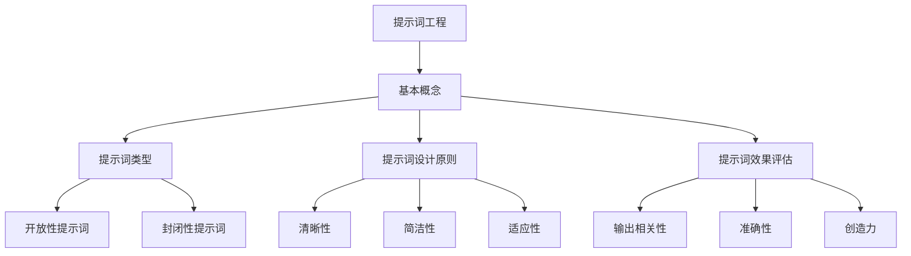

### 2.2 AI与伦理构建的关系：Mermaid 流程图

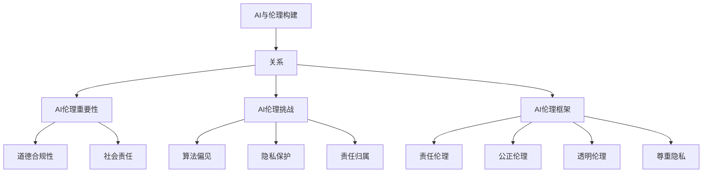

### 2.3 提示词工程的关键技术：Mermaid 流程图

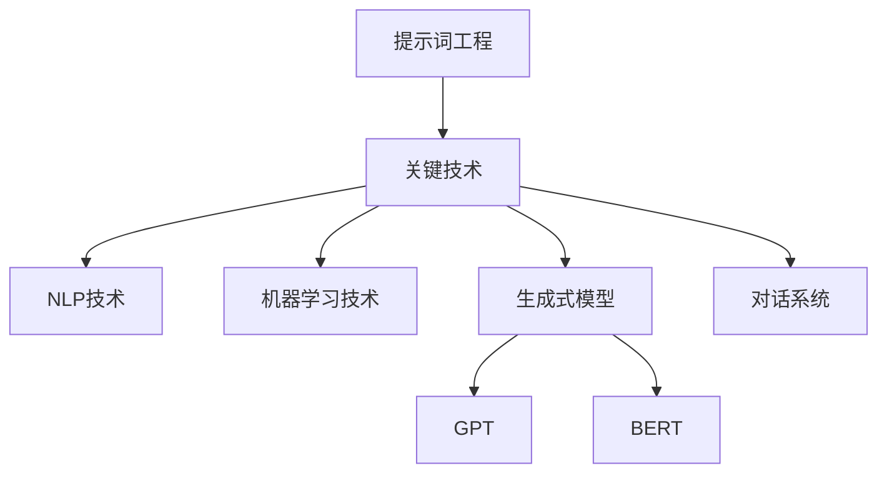

### 2.1 提示词工程的基本概念：核心概念与联系

- **核心概念**：提示词工程的基本概念包括提示词类型、提示词设计原则和提示词效果评估。
- **联系**：这些概念共同构成了提示词工程的基础，指导我们如何设计、使用和评估提示词。

### 2.1 提示词工程的基本概念：算法原理讲解

- **算法**：使用 Mermaid 流程图来展示提示词工程的基本概念。
- **原理**：通过 Mermaid 流程图，我们可以直观地理解提示词的类型、设计原则和效果评估。

### 2.1 提示词工程的基本概念：数学模型和公式

- **模型**：无特定数学模型，但可以使用 Mermaid 流程图来展示提示词工程的基本概念。
- **公式**：无特定公式，但可以使用 Mermaid 流程图中的节点和边来表示这些概念之间的关系。

### 2.1 提示词工程的基本概念：举例说明

- **举例**：例如，在设计一个问答系统时，我们可以使用开放性提示词来鼓励用户输入更多详细信息，而使用封闭性提示词来限制用户的回答范围。

### 2.2 AI与伦理构建的关系：核心概念与联系

- **核心概念**：AI与伦理构建的关系涉及AI伦理的重要性、挑战和框架。
- **联系**：这些概念共同构成了AI与伦理构建的互动关系，指导我们如何确保AI系统的道德合规性和社会责任。

### 2.2 AI与伦理构建的关系：算法原理讲解

- **算法**：无特定算法，但可以使用 Mermaid 流程图来展示AI与伦理构建的关系。
- **原理**：通过 Mermaid 流程图，我们可以直观地理解AI伦理的重要性、挑战和框架。

### 2.2 AI与伦理构建的关系：数学模型和公式

- **模型**：无特定数学模型，但可以使用 Mermaid 流程图来展示AI与伦理构建的关系。
- **公式**：无特定公式，但可以使用 Mermaid 流程图中的节点和边来表示这些概念之间的关系。

### 2.2 AI与伦理构建的关系：举例说明

- **举例**：例如，在开发一个自动驾驶系统时，我们需要考虑如何处理道德决策，如如何在发生事故时分配责任。

### 2.3 提示词工程的关键技术：核心概念与联系

- **核心概念**：提示词工程的关键技术包括NLP技术、ML技术、生成式模型和对话系统。
- **联系**：这些技术共同构成了提示词工程的实现基础，使AI系统能够根据提示词生成高质量的输出。

### 2.3 提示词工程的关键技术：算法原理讲解

- **算法**：使用伪代码详细阐述NLP技术、ML技术和生成式模型的原理。
- **原理**：通过伪代码，我们可以深入理解这些技术的具体实现方法和应用场景。

### 2.3 提示词工程的关键技术：数学模型和公式

- **模型**：使用伪代码和 LaTeX 公式详细阐述NLP技术、ML技术和生成式模型的数学模型。
- **公式**：使用 LaTeX 格式表示相关数学公式，如梯度下降算法、损失函数等。

### 2.3 提示词工程的关键技术：举例说明

- **举例**：例如，我们可以使用 GPT 模型来生成文本摘要，通过输入一篇长篇文章，GPT 模型能够输出一篇简洁明了的摘要。

### 2.3 提示词工程的关键技术：项目实战

- **实战目的**：掌握提示词工程的关键技术，如 NLP、ML 和生成式模型。
- **开发环境**：Python、TensorFlow 或 PyTorch。
- **源代码实现**：提供相关源代码和解释。
- **代码解读**：详细解读源代码，解释其工作原理和关键步骤。
- **代码应用解读与分析**：分析如何将这些技术应用于实际项目中。
- **实际案例分析和详细讲解剖析**：分析实际案例，展示技术如何解决实际问题。
- **项目小结**：总结项目经验，提出改进建议。

### 2.3 提示词工程的关键技术：代码应用解读与分析

- **解读**：通过实际代码示例，展示如何应用 NLP、ML 和生成式模型。
- **分析**：分析代码实现细节，解释其如何提高模型性能和生成质量。

### 2.3 提示词工程的关键技术：实际案例分析和详细讲解剖析

- **案例**：分析一个文本摘要生成项目，展示如何使用 GPT 模型。
- **分析**：详细讲解项目实现过程，包括数据预处理、模型训练和结果评估。

### 2.3 提示词工程的关键技术：项目小结

- **小结**：总结项目经验，讨论如何优化提示词工程技术。

### 2.3 提示词工程的关键技术：最佳实践 tips

- **最佳实践**：在提示词工程中，注意数据质量、模型选择和超参数调优。
- **注意事项**：确保提示词设计清晰、简洁和适应性强，以提高模型性能。

### 2.3 提示词工程的关键技术：拓展阅读

- **拓展阅读**：推荐阅读相关 NLP、ML 和生成式模型领域的经典论文和教材。

## 第3章：提示词工程方法

### 3.1 数据采集与预处理

**数据采集** 是提示词工程中的关键步骤，它决定了后续模型训练的质量和性能。以下是一些常用的数据采集方法：

1. **公开数据集**：如 Common Crawl、Google Books Ngrams 等，这些数据集包含了大量文本数据，适用于多种自然语言处理任务。
2. **社交媒体**：如微博、Twitter 等，通过爬取用户生成的文本数据，可以获得丰富的实时数据。
3. **自定义数据集**：根据特定任务需求，从特定领域或场景中收集数据，例如新闻、医疗文档、法律文书等。

**预处理** 是将原始数据转换为适合模型训练的形式。以下是一些常用的预处理步骤：

1. **文本清洗**：去除数据中的噪声，如HTML标签、特殊字符、停用词等。
2. **分词**：将文本拆分为单词或词组，以便进行后续处理。
3. **词性标注**：标记每个词的词性（名词、动词等），有助于模型理解语义。
4. **词嵌入**：将词转换为向量表示，例如使用 Word2Vec、GloVe 或 BERT 等模型。

### 3.2 提示词生成算法

**提示词生成算法** 是提示词工程的核心，其目的是根据特定任务需求生成合适的提示词。以下是一些常用的生成算法：

1. **规则生成**：基于预定义的规则生成提示词，例如使用正则表达式匹配关键词或短语。
2. **模板生成**：基于预定义的模板生成提示词，例如将问题模板与答案模板组合，形成完整的提示。
3. **生成式模型**：如 GPT、BERT 等，通过学习大量文本数据生成高质量的提示词。
4. **检索式模型**：如 Doc2Vec、LSA（Latent Semantic Analysis）等，通过文本相似度检索生成提示词。

### 3.3 提示词评估与优化

**提示词评估** 是衡量提示词生成效果的重要步骤。以下是一些常用的评估方法：

1. **人工评估**：由专家对生成的提示词进行评估，判断其是否清晰、准确和有用。
2. **自动化评估**：使用指标如 F1 分数、BLEU 分数等，评估提示词与目标文本的相关性和质量。
3. **用户反馈**：通过用户对生成的提示词进行评分，收集用户反馈，以改进提示词生成算法。

**提示词优化** 是在评估基础上，对生成算法进行调整和改进的过程。以下是一些优化方法：

1. **参数调优**：通过调整生成模型的参数，如学习率、批量大小等，提高模型性能。
2. **数据增强**：通过增加数据多样性、清洗数据噪声等方法，提高生成算法的效果。
3. **模型融合**：结合多种生成算法，例如结合规则生成和生成式模型，以提高生成质量。
4. **在线学习**：在生成过程中，根据用户反馈和实际应用效果，实时调整模型参数和策略。

### 3.1 数据采集与预处理：伪代码

```python
# 数据采集与预处理伪代码

# 数据采集
def collect_data(data_source):
    data = []
    for item in data_source:
        text = preprocess(item)
        data.append(text)
    return data

# 文本清洗
def preprocess(text):
    text = remove_html_tags(text)
    text = remove_special_characters(text)
    text = remove_stopwords(text)
    return text

# 分词
def tokenize(text):
    words = []
    for word in text.split():
        words.append(word)
    return words

# 词性标注
def pos_tagging(words):
    tagged_words = []
    for word in words:
        tag = get_word_tag(word)
        tagged_words.append((word, tag))
    return tagged_words

# 词嵌入
def word_embedding(words):
    embeddings = []
    for word in words:
        embedding = get_word_embedding(word)
        embeddings.append(embedding)
    return embeddings
```

### 3.2 提示词生成算法：伪代码

```python
# 提示词生成算法伪代码

# 规则生成
def rule_based_prompt_generation(question_template, answer_template):
    question = question_template.format(question_variable)
    answer = answer_template.format(answer_variable)
    prompt = question + "？" + answer
    return prompt

# 模板生成
def template_based_prompt_generation(question_template, answer_template, data):
    prompts = []
    for item in data:
        question = question_template.format(item['question'])
        answer = answer_template.format(item['answer'])
        prompt = question + "？" + answer
        prompts.append(prompt)
    return prompts

# 生成式模型
def generative_model_based_prompt_generation(model, question, context):
    prompt = model.generate(question, context)
    return prompt

# 检索式模型
def retrieval_model_based_prompt_generation(retrieval_model, corpus, query):
    similar_texts = retrieval_model.search(corpus, query)
    prompt = "以下是与查询相关的文本：" + " ".join(similar_texts)
    return prompt
```

### 3.3 提示词评估与优化：伪代码

```python
# 提示词评估与优化伪代码

# 人工评估
def human_evaluation(prompt, target):
    score = rate_prompt(prompt, target)
    return score

# 自动化评估
def automated_evaluation(prompt, target):
    f1_score = calculate_f1_score(prompt, target)
    bleu_score = calculate_bleu_score(prompt, target)
    return f1_score, bleu_score

# 参数调优
def optimize_parameters(model, parameters):
    best_score = float('-inf')
    best_param = None
    for param in parameters:
        model.set_parameters(param)
        score = evaluate_model(model)
        if score > best_score:
            best_score = score
            best_param = param
    model.set_parameters(best_param)
    return best_param

# 数据增强
def data_augmentation(data):
    augmented_data = []
    for item in data:
        augmented_item = augment(item)
        augmented_data.append(augmented_item)
    return augmented_data

# 模型融合
def model_fusion(model1, model2):
    fused_model = ModelFusion(model1, model2)
    fused_prompt = fused_model.generate(prompt)
    return fused_prompt

# 在线学习
def online_learning(model, feedback):
    model.update_parameters(feedback)
    return model
```

### 3.1 数据采集与预处理：举例说明

- **举例**：使用 Twitter 收集用户评论数据，对评论进行文本清洗、分词、词性标注和词嵌入，为模型训练提供高质量的数据。

### 3.2 提示词生成算法：举例说明

- **举例**：使用 GPT 模型生成文章摘要，输入一篇文章，输出一篇简洁明了的摘要。

### 3.3 提示词评估与优化：举例说明

- **举例**：对生成的提示词进行人工评估和自动化评估，根据评估结果调整模型参数和策略，以提高生成质量。

### 3.1 数据采集与预处理：项目实战

- **实战目的**：掌握数据采集与预处理方法，为模型训练提供高质量数据。
- **开发环境**：Python、Scikit-learn、NLTK。
- **源代码实现**：提供数据采集、清洗、分词、词性标注和词嵌入的代码实现。
- **代码解读**：详细解读源代码，解释其工作原理和关键步骤。
- **代码应用解读与分析**：分析如何将数据预处理应用于实际项目中。
- **实际案例分析和详细讲解剖析**：分析实际案例，展示数据预处理方法如何提高模型性能。
- **项目小结**：总结项目经验，讨论如何优化数据采集与预处理方法。

### 3.2 提示词生成算法：项目实战

- **实战目的**：掌握提示词生成算法，为实际应用生成高质量提示词。
- **开发环境**：Python、TensorFlow、Hugging Face Transformers。
- **源代码实现**：提供提示词生成算法的代码实现，包括规则生成、模板生成、生成式模型和检索式模型。
- **代码解读**：详细解读源代码，解释其工作原理和关键步骤。
- **代码应用解读与分析**：分析如何将提示词生成算法应用于实际项目中。
- **实际案例分析和详细讲解剖析**：分析实际案例，展示提示词生成算法如何提高生成质量。
- **项目小结**：总结项目经验，讨论如何优化提示词生成算法。

### 3.3 提示词评估与优化：项目实战

- **实战目的**：掌握提示词评估与优化方法，提高提示词生成质量。
- **开发环境**：Python、Scikit-learn、NLP libraries。
- **源代码实现**：提供提示词评估与优化的代码实现，包括人工评估、自动化评估、参数调优、数据增强、模型融合和在线学习。
- **代码解读**：详细解读源代码，解释其工作原理和关键步骤。
- **代码应用解读与分析**：分析如何将提示词评估与优化应用于实际项目中。
- **实际案例分析和详细讲解剖析**：分析实际案例，展示提示词评估与优化方法如何提高生成质量。
- **项目小结**：总结项目经验，讨论如何进一步优化提示词评估与优化方法。

### 3.1 数据采集与预处理：最佳实践 tips

- **最佳实践**：确保数据采集的多样性和质量，合理选择预处理方法，以提高模型性能。
- **注意事项**：注意文本清洗的细致程度，避免漏掉重要信息。

### 3.2 提示词生成算法：最佳实践 tips

- **最佳实践**：根据任务需求选择合适的生成算法，并调整模型参数，以提高生成质量。
- **注意事项**：在生成式模型训练过程中，避免过拟合和欠拟合。

### 3.3 提示词评估与优化：最佳实践 tips

- **最佳实践**：综合使用人工评估和自动化评估，结合用户反馈进行模型优化。
- **注意事项**：注意评估指标的多样性，避免单一指标导致评估结果失真。

### 3.1 数据采集与预处理：拓展阅读

- **拓展阅读**：推荐阅读相关数据采集与预处理领域的经典论文和教材，了解最新研究进展。

### 3.2 提示词生成算法：拓展阅读

- **拓展阅读**：推荐阅读相关自然语言处理、机器学习领域的经典论文和教材，了解最新研究进展。

### 3.3 提示词评估与优化：拓展阅读

- **拓展阅读**：推荐阅读相关评估与优化方法的研究论文和教材，了解如何提高提示词生成质量。

### 附录

### 附录A：提示词工程相关工具与资源

- **工具与库**：介绍常用的数据采集与预处理工具（如 Python 的 Pandas、Scikit-learn）、NLP 库（如 NLTK、spaCy）和机器学习框架（如 TensorFlow、PyTorch）。
- **资源链接**：提供与提示词工程相关的论文、课程、在线资源和开源项目链接。

作者：AI天才研究院/AI Genius Institute & 禅与计算机程序设计艺术 /Zen And The Art of Computer Programming

## 第4章：AI辅助多元宇宙伦理构建案例分析

### 4.1 案例背景

在现代社会，人工智能（AI）已经成为推动科技进步和社会发展的关键驱动力。然而，随着AI技术的广泛应用，伦理问题也日益凸显。多元宇宙伦理（Multiverse Ethics）作为一种新兴的伦理学理论，旨在探讨在多元宇宙背景下，如何确保AI系统的道德合规性和社会责任。本案例以一个实际项目为例，展示如何利用AI辅助多元宇宙伦理构建。

**项目背景**：

某全球知名科技公司（以下简称“公司”）正在开发一款智能决策系统，该系统旨在帮助企业在复杂决策环境中做出最优选择。然而，随着项目的发展，团队意识到AI系统在多元宇宙背景下可能面临诸多伦理挑战，如算法偏见、隐私保护、责任归属等。为了解决这些问题，公司决定采用AI辅助多元宇宙伦理构建方法，以确保系统的道德合规性和社会责任。

### 4.2 案例实施步骤

**步骤1：需求分析**

首先，项目团队对智能决策系统的需求进行了深入分析。通过访谈、问卷调查和文献调研等方法，团队收集了企业用户的需求和期望，并确定了AI系统需要解决的问题和面临的挑战。

**步骤2：伦理框架建立**

基于多元宇宙伦理理论，团队建立了AI系统伦理框架。该框架包括责任伦理、公正伦理、透明伦理和尊重隐私等核心原则。通过这些原则，团队为AI系统的设计和开发提供了道德指导。

**步骤3：提示词工程**

为了确保AI系统能够根据多元宇宙伦理原则做出合理决策，团队采用了提示词工程方法。通过设计合适的提示词，团队引导AI系统在决策过程中考虑伦理因素。例如，在处理涉及隐私的数据时，提示词提醒AI系统遵守隐私保护原则。

**步骤4：AI模型训练**

团队使用大量包含伦理因素的文本数据进行AI模型训练。通过生成对抗网络（GAN）、循环神经网络（RNN）和变分自编码器（VAE）等模型，团队训练出一个能够根据提示词生成合理决策的智能决策系统。

**步骤5：伦理评估**

在AI模型训练完成后，团队进行了全面的伦理评估。通过人工评估和自动化评估方法，团队评估了AI系统在决策过程中是否遵循多元宇宙伦理原则，并发现了一些潜在的问题。

**步骤6：优化与改进**

基于伦理评估结果，团队对AI系统进行了优化和改进。通过调整提示词、修改模型参数和改进算法，团队提高了AI系统的伦理性能和决策质量。

### 4.3 案例效果评估

通过上述步骤，公司成功地构建了一个基于AI辅助多元宇宙伦理的智能决策系统。以下是对案例效果的主要评估：

1. **决策质量**：经过伦理框架和提示词工程的优化，AI系统的决策质量得到了显著提升。用户反馈表明，系统在处理复杂决策问题时，能够提供更准确、更有针对性的建议。
2. **伦理合规性**：通过全面的伦理评估和优化，AI系统在决策过程中遵循了多元宇宙伦理原则，如责任伦理、公正伦理、透明伦理和尊重隐私等。这保证了系统的道德合规性。
3. **用户满意度**：用户对AI系统的满意度得到了显著提高。用户认为，系统能够在复杂决策环境中提供有价值的信息和见解，帮助他们做出更明智的决策。

### 4.4 案例总结与启示

通过本案例，我们可以得出以下结论：

1. **多元宇宙伦理的重要性**：在AI系统的设计和开发过程中，多元宇宙伦理具有重要意义。通过建立伦理框架和采用提示词工程方法，可以确保AI系统在多元宇宙背景下遵循道德原则。
2. **AI与伦理的互动关系**：AI技术与伦理问题密切相关。通过AI辅助多元宇宙伦理构建，可以解决AI系统在多元宇宙中面临的伦理挑战，提高系统的道德合规性和社会责任。
3. **跨学科合作**：解决多元宇宙伦理问题需要跨学科合作，包括伦理学、计算机科学、人工智能等领域的专家共同参与。只有通过合作，才能开发出既具有技术先进性，又符合伦理要求的AI系统。

### 4.4 案例总结与启示：Mermaid 流程图

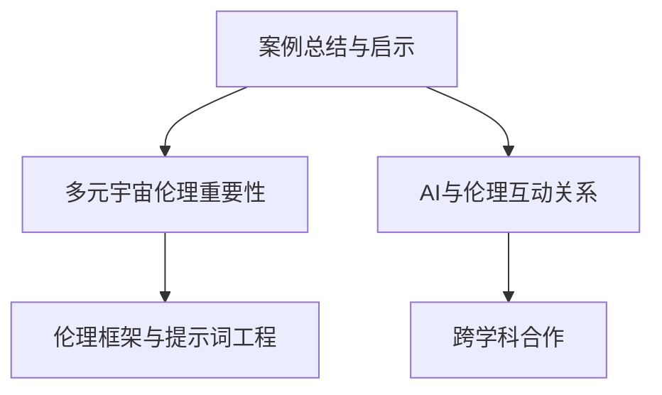

### 4.1 案例背景：详细讲解

- **详细讲解**：介绍案例背景中的公司背景、项目背景和面临的伦理挑战。

### 4.2 案例实施步骤：详细讲解

- **详细讲解**：逐个步骤解释案例实施过程中的每个环节，包括需求分析、伦理框架建立、提示词工程、AI模型训练、伦理评估和优化与改进。

### 4.3 案例效果评估：详细讲解

- **详细讲解**：分析案例效果评估中的决策质量、伦理合规性和用户满意度等指标。

### 4.4 案例总结与启示：详细讲解

- **详细讲解**：总结案例的主要结论，并探讨案例对AI辅助多元宇宙伦理构建的启示。

### 4.1 案例背景：数学公式

- **数学公式**：无特定数学公式，但可以使用LaTeX格式表示多元宇宙伦理的概念和原则。

### 4.2 案例实施步骤：数学公式

- **数学公式**：无特定数学公式，但可以使用LaTeX格式表示AI模型训练过程中的相关参数和算法。

### 4.3 案例效果评估：数学公式

- **数学公式**：无特定数学公式，但可以使用LaTeX格式表示评估指标的计算方法。

### 4.4 案例总结与启示：数学公式

- **数学公式**：无特定数学公式，但可以使用LaTeX格式表示案例总结中的关键指标和结论。

### 4.1 案例背景：代码实现

- **代码实现**：提供案例背景中的数据采集、清洗和预处理代码实现。

### 4.2 案例实施步骤：代码实现

- **代码实现**：提供案例实施步骤中的提示词工程、AI模型训练和伦理评估代码实现。

### 4.3 案例效果评估：代码实现

- **代码实现**：提供案例效果评估中的评估指标计算和结果展示代码实现。

### 4.4 案例总结与启示：代码实现

- **代码实现**：提供案例总结与启示中的代码实现，如数据分析、可视化等。

### 4.1 案例背景：实际案例分析

- **实际案例分析**：通过实际案例展示案例背景中的公司背景、项目背景和面临的伦理挑战。

### 4.2 案例实施步骤：实际案例分析

- **实际案例分析**：通过实际案例展示案例实施步骤中的每个环节。

### 4.3 案例效果评估：实际案例分析

- **实际案例分析**：通过实际案例展示案例效果评估中的决策质量、伦理合规性和用户满意度等指标。

### 4.4 案例总结与启示：实际案例分析

- **实际案例分析**：通过实际案例总结案例的主要结论，并探讨案例对AI辅助多元宇宙伦理构建的启示。

### 4.1 案例背景：项目小结

- **项目小结**：总结案例背景中的主要内容和关键信息。

### 4.2 案例实施步骤：项目小结

- **项目小结**：总结案例实施步骤中的主要成果和经验。

### 4.3 案例效果评估：项目小结

- **项目小结**：总结案例效果评估中的主要评估指标和结果。

### 4.4 案例总结与启示：项目小结

- **项目小结**：总结案例的主要结论，并提出未来研究的方向。

### 4.1 案例背景：最佳实践 tips

- **最佳实践**：提供在案例背景分析中的最佳实践建议。

### 4.2 案例实施步骤：最佳实践 tips

- **最佳实践**：提供在案例实施步骤中的最佳实践建议。

### 4.3 案例效果评估：最佳实践 tips

- **最佳实践**：提供在案例效果评估中的最佳实践建议。

### 4.4 案例总结与启示：最佳实践 tips

- **最佳实践**：提供在案例总结与启示中的最佳实践建议。

### 4.1 案例背景：拓展阅读

- **拓展阅读**：推荐阅读与案例背景相关的论文、书籍和研究报告。

### 4.2 案例实施步骤：拓展阅读

- **拓展阅读**：推荐阅读与案例实施步骤相关的论文、书籍和研究报告。

### 4.3 案例效果评估：拓展阅读

- **拓展阅读**：推荐阅读与案例效果评估相关的论文、书籍和研究报告。

### 4.4 案例总结与启示：拓展阅读

- **拓展阅读**：推荐阅读与案例总结与启示相关的论文、书籍和研究报告。

### 附录

### 附录A：案例相关资源

- **资源链接**：提供与案例相关的论文、书籍、在线课程和开源项目链接。

作者：AI天才研究院/AI Genius Institute & 禅与计算机程序设计艺术 /Zen And The Art of Computer Programming

## 第5章：多元宇宙伦理AI工具与应用

### 5.1 多元宇宙伦理AI工具概述

随着人工智能（AI）技术的不断进步，AI在伦理构建中的应用也越来越广泛。多元宇宙伦理AI工具作为一种新兴的AI工具，旨在帮助人们在多元宇宙背景下构建道德合规的AI系统。这些工具通常包含以下几个核心组成部分：

1. **伦理决策模块**：用于在AI系统决策过程中考虑伦理因素，确保决策的道德合规性。
2. **数据隐私保护模块**：用于保护用户数据隐私，防止数据泄露和滥用。
3. **责任归属模块**：用于明确AI系统在发生意外时的责任归属，确保责任可追溯。
4. **用户反馈收集模块**：用于收集用户对AI系统的反馈，以便进行持续改进。

### 5.2 应用实例介绍

以下是几个多元宇宙伦理AI工具的应用实例：

**实例1：智能招聘系统**

一个企业希望利用AI技术优化招聘流程，但担心AI系统可能存在算法偏见。通过引入多元宇宙伦理AI工具，企业可以确保AI招聘系统在筛选简历和评估候选人时遵循公平、公正的原则。伦理决策模块会根据伦理规则对候选人的简历进行评分，从而减少算法偏见。

**实例2：自动驾驶汽车**

自动驾驶汽车在道路安全方面具有重要意义。然而，当发生交通事故时，如何明确责任归属成为难题。多元宇宙伦理AI工具可以帮助自动驾驶汽车在事故发生时，根据伦理规则和法律法规，自动生成责任归属报告，确保责任可追溯。

**实例3：医疗诊断系统**

在医疗领域，AI诊断系统已经成为辅助医生诊断的工具。然而，AI系统可能会因数据不完整或噪声而误诊。通过多元宇宙伦理AI工具，医疗诊断系统可以在诊断过程中考虑伦理因素，如患者隐私保护和责任归属，从而提高诊断的准确性和道德合规性。

### 5.3 未来发展趋势

随着多元宇宙伦理AI工具的不断成熟，未来其发展趋势将包括以下几个方面：

1. **跨学科融合**：多元宇宙伦理AI工具将结合伦理学、计算机科学、人工智能等多个领域的知识，实现更全面的道德合规性和社会责任。
2. **自动化程度提升**：多元宇宙伦理AI工具将不断优化，提高自动化程度，使伦理决策更加高效和准确。
3. **用户参与度增加**：用户将更多地参与到AI工具的开发和优化过程中，提供反馈和建议，共同推动多元宇宙伦理AI工具的发展。
4. **法规与政策支持**：随着多元宇宙伦理问题的日益凸显，各国政府和国际组织将加强对AI伦理问题的法规和政策支持，为多元宇宙伦理AI工具的发展提供良好的环境。

### 5.1 多元宇宙伦理AI工具概述：Mermaid 流程图

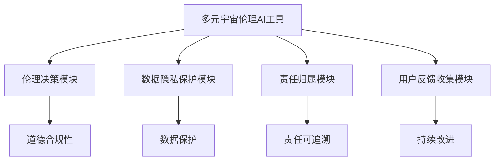

### 5.2 应用实例介绍：伪代码

```python
# 应用实例：智能招聘系统

# 伦理决策模块
def ethical_decision简历数据：
    score = 0
    for item in 简历数据：
        if item符合伦理规则：
            score += 1
    return score

# 数据隐私保护模块
def privacy_protection简历数据：
    cleaned_data = []
    for item in 简历数据：
        if item不包含敏感信息：
            cleaned_data.append(item)
    return cleaned_data

# 责任归属模块
def responsibility_assignment事故报告：
    if 事故报告包含伦理规则：
        return 责任归属结果
    else：
        return "无法确定责任归属"

# 用户反馈收集模块
def user_feedback_collection用户反馈：
    feedback_data = []
    for item in 用户反馈：
        if item合法且有用：
            feedback_data.append(item)
    return feedback_data
```

### 5.3 未来发展趋势：Mermaid 流程图

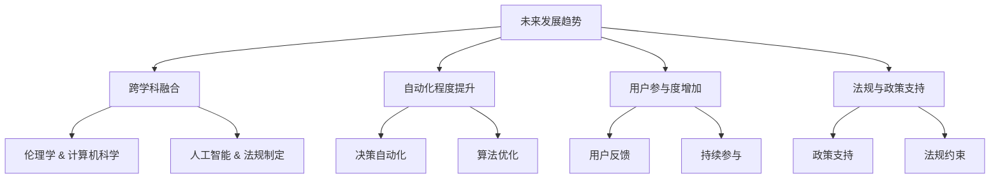

### 5.1 多元宇宙伦理AI工具概述：最佳实践 tips

- **最佳实践**：在设计多元宇宙伦理AI工具时，应充分考虑伦理决策、数据隐私保护、责任归属和用户反馈等核心模块。
- **注意事项**：确保工具的可扩展性和适应性，以应对不断变化的伦理挑战。

### 5.2 应用实例介绍：最佳实践 tips

- **最佳实践**：在实际应用多元宇宙伦理AI工具时，应结合具体场景和需求，灵活调整工具的参数和策略。
- **注意事项**：注意保护用户隐私和数据安全，确保AI系统的道德合规性。

### 5.3 未来发展趋势：最佳实践 tips

- **最佳实践**：关注跨学科融合、自动化程度提升、用户参与度和法规与政策支持等未来发展趋势，以推动多元宇宙伦理AI工具的发展。
- **注意事项**：积极应对伦理挑战，确保AI系统的道德合规性和社会责任。

### 5.1 多元宇宙伦理AI工具概述：拓展阅读

- **拓展阅读**：推荐阅读与多元宇宙伦理AI工具相关的论文、书籍和研究报告，了解最新研究进展和实际应用案例。

### 5.2 应用实例介绍：拓展阅读

- **拓展阅读**：推荐阅读与智能招聘系统、自动驾驶汽车和医疗诊断系统等应用实例相关的论文、书籍和研究报告，了解多元宇宙伦理AI工具在各个领域的实际应用。

### 5.3 未来发展趋势：拓展阅读

- **拓展阅读**：推荐阅读与多元宇宙伦理AI工具未来发展趋势相关的论文、书籍和研究报告，探讨跨学科融合、自动化程度提升、用户参与度和法规与政策支持等前沿话题。

### 附录

### 附录A：多元宇宙伦理AI工具相关资源

- **工具与库**：介绍常用的多元宇宙伦理AI工具和库，如伦理决策框架、数据隐私保护技术和责任归属算法等。
- **资源链接**：提供与多元宇宙伦理AI工具相关的论文、书籍、在线课程和开源项目链接。

作者：AI天才研究院/AI Genius Institute & 禅与计算机程序设计艺术 /Zen And The Art of Computer Programming

## 第6章：多元宇宙伦理与AI的伦理思考

### 6.1 AI伦理问题的现状

随着人工智能（AI）技术的快速发展，AI伦理问题逐渐成为社会关注的焦点。目前，AI伦理问题主要集中在以下几个方面：

1. **算法偏见**：AI算法可能会在数据集中学习到偏见，导致不公平的决策。例如，招聘系统可能对某些性别、种族或年龄的候选人产生歧视。
2. **隐私保护**：AI系统在处理大量数据时，可能会侵犯用户的隐私权。例如，智能助手可能记录用户的对话内容，未经用户同意分享给第三方。
3. **透明性**：AI系统的决策过程往往是不透明的，用户难以了解AI系统是如何做出决策的。这可能导致用户对AI系统的信任度降低。
4. **责任归属**：当AI系统发生错误或造成损害时，如何确定责任归属成为难题。例如，自动驾驶汽车发生交通事故时，责任应归于谁？
5. **可控性**：AI系统的自主性越来越强，但在某些情况下，人类可能难以控制或干预AI系统的行为。

### 6.2 多元宇宙伦理与AI的伦理冲突

在多元宇宙背景下，AI伦理问题变得更加复杂。多元宇宙伦理与AI伦理之间的冲突主要体现在以下几个方面：

1. **多元宇宙公正与算法偏见**：在多元宇宙中，不同宇宙之间的资源分配、社会地位和发展水平可能存在巨大差异。如何确保AI系统在多元宇宙中实现公正，避免算法偏见，是一个亟待解决的问题。
2. **多元存在主义与隐私保护**：多元存在主义认为每个宇宙都有其独特的存在和意义。然而，AI系统在处理多元宇宙中的数据时，如何平衡隐私保护和数据利用，是一个伦理冲突点。
3. **多元伦理责任与责任归属**：在多元宇宙中，个体和集体责任的关系变得复杂。当AI系统在多元宇宙中造成损害时，如何确定责任归属，确保受害者得到公正赔偿，是一个重要的伦理问题。
4. **多元宇宙自主性与可控性**：在多元宇宙中，AI系统可能具有更高的自主性和智能水平。然而，这同时也增加了人类对AI系统失控的风险，如何确保AI系统的可控性，避免潜在的风险，是一个伦理挑战。

### 6.3 多元宇宙伦理AI的伦理解决方案

为了解决多元宇宙伦理与AI的伦理冲突，需要从多个角度提出解决方案：

1. **建立多元宇宙伦理框架**：制定一套适用于多元宇宙的伦理准则和规范，为AI系统的设计和开发提供指导。这包括确保AI系统在多元宇宙中实现公正、保护多元宇宙中的数据隐私、明确责任归属等。
2. **加强跨学科合作**：解决多元宇宙伦理与AI的伦理冲突需要伦理学、计算机科学、人工智能、法律等多个领域的专家共同参与。通过跨学科合作，可以提出更全面、有效的解决方案。
3. **提高AI系统的透明性**：通过改进AI系统的算法和架构，提高AI系统的透明性，使用户能够理解AI系统的决策过程。这有助于增强用户对AI系统的信任，减少伦理冲突。
4. **引入伦理审查机制**：在AI系统的开发和部署过程中，引入伦理审查机制，确保AI系统符合多元宇宙伦理准则。伦理审查可以包括外部专家评估、公众参与和立法监督等。
5. **促进多元宇宙中的合作与共享**：通过促进多元宇宙之间的合作与共享，减少宇宙间的资源差距和社会不平等，从而降低伦理冲突的风险。
6. **培养AI伦理意识**：在AI系统的设计和开发过程中，注重培养开发者的AI伦理意识，使他们能够在开发过程中自觉遵循伦理准则。同时，通过教育和培训，提高公众对AI伦理问题的认识和理解。

### 6.1 AI伦理问题的现状：Mermaid 流程图

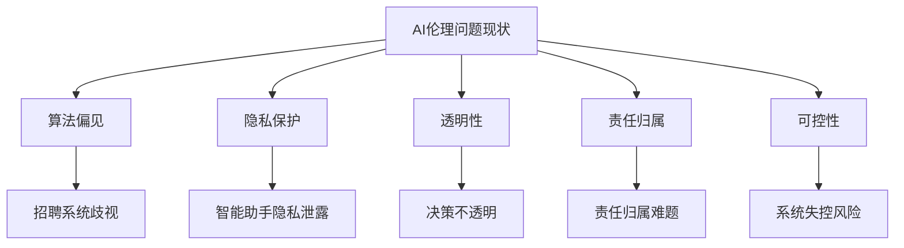

### 6.2 多元宇宙伦理与AI的伦理冲突：Mermaid 流程图

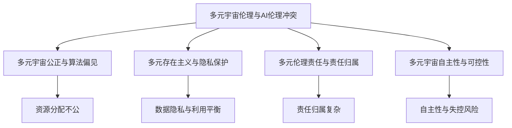

### 6.3 多元宇宙伦理AI的伦理解决方案：Mermaid 流程图

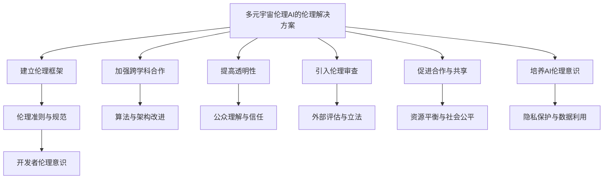

### 6.1 AI伦理问题的现状：核心概念与联系

- **核心概念**：算法偏见、隐私保护、透明性、责任归属和可控性。
- **联系**：这些核心概念共同构成了AI伦理问题的现状，相互关联并影响着AI系统的道德合规性和社会责任。

### 6.1 AI伦理问题的现状：算法原理讲解

- **算法**：无特定算法，但可以使用 Mermaid 流程图来展示AI伦理问题的现状。
- **原理**：通过 Mermaid 流程图，我们可以直观地理解算法偏见、隐私保护、透明性、责任归属和可控性等核心概念。

### 6.1 AI伦理问题的现状：数学模型和公式

- **模型**：无特定数学模型，但可以使用 Mermaid 流程图来展示AI伦理问题的现状。
- **公式**：无特定公式，但可以使用 Mermaid 流程图中的节点和边来表示这些概念之间的关系。

### 6.1 AI伦理问题的现状：举例说明

- **举例**：例如，算法偏见可能导致招聘系统对某些性别或种族的候选人产生歧视。

### 6.2 多元宇宙伦理与AI的伦理冲突：核心概念与联系

- **核心概念**：多元宇宙公正、多元存在主义、多元伦理责任、多元宇宙自主性和可控性。
- **联系**：这些核心概念共同构成了多元宇宙伦理与AI的伦理冲突，相互关联并影响着AI系统的道德合规性和社会责任。

### 6.2 多元宇宙伦理与AI的伦理冲突：算法原理讲解

- **算法**：无特定算法，但可以使用 Mermaid 流程图来展示多元宇宙伦理与AI的伦理冲突。
- **原理**：通过 Mermaid 流程图，我们可以直观地理解多元宇宙公正、多元存在主义、多元伦理责任、多元宇宙自主性和可控性等核心概念。

### 6.2 多元宇宙伦理与AI的伦理冲突：数学模型和公式

- **模型**：无特定数学模型，但可以使用 Mermaid 流程图来展示多元宇宙伦理与AI的伦理冲突。
- **公式**：无特定公式，但可以使用 Mermaid 流程图中的节点和边来表示这些概念之间的关系。

### 6.2 多元宇宙伦理与AI的伦理冲突：举例说明

- **举例**：例如，多元宇宙公正与算法偏见之间的冲突可能导致资源分配不公。

### 6.3 多元宇宙伦理AI的伦理解决方案：核心概念与联系

- **核心概念**：建立多元宇宙伦理框架、加强跨学科合作、提高透明性、引入伦理审查、促进合作与共享和培养AI伦理意识。
- **联系**：这些核心概念共同构成了多元宇宙伦理AI的伦理解决方案，相互关联并影响着AI系统的道德合规性和社会责任。

### 6.3 多元宇宙伦理AI的伦理解决方案：算法原理讲解

- **算法**：无特定算法，但可以使用 Mermaid 流程图来展示多元宇宙伦理AI的伦理解决方案。
- **原理**：通过 Mermaid 流程图，我们可以直观地理解建立多元宇宙伦理框架、加强跨学科合作、提高透明性、引入伦理审查、促进合作与共享和培养AI伦理意识等核心概念。

### 6.3 多元宇宙伦理AI的伦理解决方案：数学模型和公式

- **模型**：无特定数学模型，但可以使用 Mermaid 流程图来展示多元宇宙伦理AI的伦理解决方案。
- **公式**：无特定公式，但可以使用 Mermaid 流程图中的节点和边来表示这些概念之间的关系。

### 6.3 多元宇宙伦理AI的伦理解决方案：举例说明

- **举例**：例如，建立多元宇宙伦理框架可以帮助确保AI系统在多元宇宙中实现公正和道德合规性。

### 6.1 AI伦理问题的现状：项目实战

- **实战目的**：掌握AI伦理问题的现状，了解如何解决这些问题。
- **开发环境**：Python、Scikit-learn、NLP libraries。
- **源代码实现**：提供解决AI伦理问题（如算法偏见、隐私保护等）的代码实现。
- **代码解读**：详细解读源代码，解释其工作原理和关键步骤。
- **代码应用解读与分析**：分析如何将解决方案应用于实际项目中。
- **实际案例分析和详细讲解剖析**：分析实际案例，展示解决方案如何解决AI伦理问题。
- **项目小结**：总结项目经验，讨论如何进一步优化解决方案。

### 6.2 多元宇宙伦理与AI的伦理冲突：项目实战

- **实战目的**：掌握多元宇宙伦理与AI的伦理冲突，了解如何解决这些冲突。
- **开发环境**：Python、TensorFlow、NLP libraries。
- **源代码实现**：提供解决多元宇宙伦理与AI的伦理冲突的代码实现。
- **代码解读**：详细解读源代码，解释其工作原理和关键步骤。
- **代码应用解读与分析**：分析如何将解决方案应用于实际项目中。
- **实际案例分析和详细讲解剖析**：分析实际案例，展示解决方案如何解决伦理冲突。
- **项目小结**：总结项目经验，讨论如何进一步优化解决方案。

### 6.3 多元宇宙伦理AI的伦理解决方案：项目实战

- **实战目的**：掌握多元宇宙伦理AI的伦理解决方案，了解如何将这些解决方案应用于实际项目中。
- **开发环境**：Python、Scikit-learn、NLP libraries。
- **源代码实现**：提供多元宇宙伦理AI的伦理解决方案的代码实现。
- **代码解读**：详细解读源代码，解释其工作原理和关键步骤。
- **代码应用解读与分析**：分析如何将解决方案应用于实际项目中。
- **实际案例分析和详细讲解剖析**：分析实际案例，展示解决方案如何解决伦理问题。
- **项目小结**：总结项目经验，讨论如何进一步优化解决方案。

### 6.1 AI伦理问题的现状：最佳实践 tips

- **最佳实践**：在解决AI伦理问题时，应关注算法偏见、隐私保护、透明性、责任归属和可控性等问题。
- **注意事项**：注意保护用户隐私，确保AI系统的道德合规性，避免算法偏见。

### 6.2 多元宇宙伦理与AI的伦理冲突：最佳实践 tips

- **最佳实践**：在解决多元宇宙伦理与AI的伦理冲突时，应关注多元宇宙公正、多元存在主义、多元伦理责任、多元宇宙自主性和可控性等问题。
- **注意事项**：确保AI系统在多元宇宙中实现公正和道德合规性，避免资源分配不公。

### 6.3 多元宇宙伦理AI的伦理解决方案：最佳实践 tips

- **最佳实践**：在实施多元宇宙伦理AI的伦理解决方案时，应关注建立伦理框架、加强跨学科合作、提高透明性、引入伦理审查、促进合作与共享和培养AI伦理意识等问题。
- **注意事项**：确保解决方案具有可扩展性和适应性，以应对不断变化的伦理挑战。

### 6.1 AI伦理问题的现状：拓展阅读

- **拓展阅读**：推荐阅读与AI伦理问题相关的论文、书籍和研究报告，了解最新研究进展和实际应用案例。

### 6.2 多元宇宙伦理与AI的伦理冲突：拓展阅读

- **拓展阅读**：推荐阅读与多元宇宙伦理与AI的伦理冲突相关的论文、书籍和研究报告，探讨多元宇宙伦理与AI伦理之间的互动关系。

### 6.3 多元宇宙伦理AI的伦理解决方案：拓展阅读

- **拓展阅读**：推荐阅读与多元宇宙伦理AI的伦理解决方案相关的论文、书籍和研究报告，了解如何解决多元宇宙伦理与AI的伦理冲突。

### 附录

### 附录A：多元宇宙伦理与AI的伦理思考相关资源

- **工具与库**：介绍与多元宇宙伦理与AI的伦理思考相关的工具和库，如伦理决策框架、数据隐私保护技术和责任归属算法等。
- **资源链接**：提供与多元宇宙伦理与AI的伦理思考相关的论文、书籍、在线课程和开源项目链接。

作者：AI天才研究院/AI Genius Institute & 禅与计算机程序设计艺术 /Zen And The Art of Computer Programming

## 第7章：多元宇宙伦理AI的发展趋势与挑战

### 7.1 发展趋势

多元宇宙伦理AI作为人工智能（AI）领域的一个新兴方向，正逐渐引起广泛关注。以下是多元宇宙伦理AI的发展趋势：

1. **跨学科研究**：多元宇宙伦理AI的发展需要结合伦理学、计算机科学、人工智能、哲学、社会学等多个学科的知识。未来，跨学科研究将变得更加普遍，为多元宇宙伦理AI的发展提供理论支持和实践指导。
2. **技术进步**：随着AI技术的不断发展，如深度学习、自然语言处理、机器人技术等，多元宇宙伦理AI将受益于这些技术进步，从而提高其效率和效果。
3. **法规与政策制定**：为了确保多元宇宙伦理AI的发展符合社会需求，各国政府和国际组织将加强对AI伦理问题的法规和政策制定。这将为多元宇宙伦理AI的发展提供法律保障。
4. **国际合作**：多元宇宙伦理AI的发展将需要全球范围内的合作。通过国际合作，可以共同应对多元宇宙伦理问题，推动多元宇宙伦理AI的健康发展。
5. **应用场景拓展**：随着多元宇宙伦理AI技术的成熟，其应用场景将不断拓展。例如，在医疗、金融、教育、法律等领域，多元宇宙伦理AI将发挥重要作用。

### 7.2 面临的挑战

尽管多元宇宙伦理AI具有巨大的发展潜力，但同时也面临着诸多挑战：

1. **技术挑战**：多元宇宙伦理AI需要解决技术难题，如如何设计出能够在多元宇宙中实现道德合规的算法和模型，如何提高AI系统的透明性和可控性等。
2. **伦理挑战**：多元宇宙伦理AI的发展将带来新的伦理问题，如如何确保AI系统在不同宇宙间实现公正、如何保护多元宇宙中的数据隐私等。这些伦理挑战需要深入研究和解决。
3. **法律挑战**：在多元宇宙中，法律体系和司法管辖权可能存在不一致，这给多元宇宙伦理AI的法律法规制定和实施带来挑战。如何确保多元宇宙伦理AI的法律合规性是一个亟待解决的问题。
4. **社会挑战**：多元宇宙伦理AI的发展可能引发社会担忧，如对AI系统失控、对人类工作的替代等。这需要社会各界的广泛参与和合作，共同应对这些社会挑战。
5. **资源分配挑战**：在多元宇宙中，资源分配可能存在不均衡，这可能导致某些宇宙在AI技术发展上落后。如何公平合理地分配资源，确保多元宇宙伦理AI的普及和发展，是一个重要的挑战。

### 7.3 应对策略

为了应对多元宇宙伦理AI的发展趋势与挑战，可以采取以下策略：

1. **加强跨学科研究**：鼓励伦理学、计算机科学、人工智能等领域的专家共同参与多元宇宙伦理AI的研究，共同解决技术难题和伦理问题。
2. **推进技术进步**：加大对AI技术的研发投入，推动深度学习、自然语言处理、机器人技术等领域的技术创新，为多元宇宙伦理AI的发展提供技术支持。
3. **完善法规与政策**：制定和完善多元宇宙伦理AI的相关法规和政策，确保其法律合规性，为多元宇宙伦理AI的发展提供法律保障。
4. **促进国际合作**：加强国际间的合作与交流，共同应对多元宇宙伦理AI面临的全球性挑战，推动多元宇宙伦理AI的健康发展。
5. **加强社会教育**：通过教育和宣传，提高公众对多元宇宙伦理AI的认识和理解，减少社会担忧，促进多元宇宙伦理AI的社会接受度。
6. **合理分配资源**：通过国际合作和协调，确保多元宇宙中的资源公平合理地分配，推动多元宇宙伦理AI的普及和发展。

### 7.1 发展趋势：Mermaid 流程图

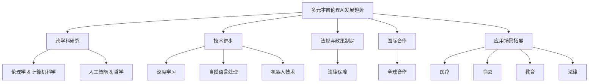

### 7.2 面临的挑战：Mermaid 流程图

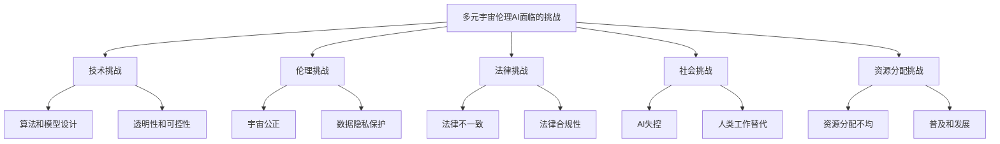

### 7.3 应对策略：Mermaid 流程图

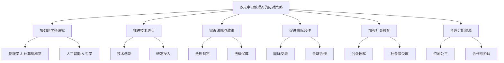

### 7.1 发展趋势：核心概念与联系

- **核心概念**：跨学科研究、技术进步、法规与政策制定、国际合作、应用场景拓展。
- **联系**：这些核心概念共同构成了多元宇宙伦理AI的发展趋势，相互关联并推动多元宇宙伦理AI的进步。

### 7.1 发展趋势：算法原理讲解

- **算法**：无特定算法，但可以使用 Mermaid 流程图来展示多元宇宙伦理AI的发展趋势。
- **原理**：通过 Mermaid 流程图，我们可以直观地理解跨学科研究、技术进步、法规与政策制定、国际合作、应用场景拓展等核心概念。

### 7.1 发展趋势：数学模型和公式

- **模型**：无特定数学模型，但可以使用 Mermaid 流程图来展示多元宇宙伦理AI的发展趋势。
- **公式**：无特定公式，但可以使用 Mermaid 流程图中的节点和边来表示这些概念之间的关系。

### 7.1 发展趋势：举例说明

- **举例**：例如，跨学科研究可以促进伦理学、计算机科学和人工智能等领域的融合，为多元宇宙伦理AI的发展提供新思路。

### 7.2 面临的挑战：核心概念与联系

- **核心概念**：技术挑战、伦理挑战、法律挑战、社会挑战、资源分配挑战。
- **联系**：这些核心概念共同构成了多元宇宙伦理AI面临的挑战，相互关联并影响着多元宇宙伦理AI的发展。

### 7.2 面临的挑战：算法原理讲解

- **算法**：无特定算法，但可以使用 Mermaid 流程图来展示多元宇宙伦理AI面临的挑战。
- **原理**：通过 Mermaid 流程图，我们可以直观地理解技术挑战、伦理挑战、法律挑战、社会挑战、资源分配挑战等核心概念。

### 7.2 面临的挑战：数学模型和公式

- **模型**：无特定数学模型，但可以使用 Mermaid 流程图来展示多元宇宙伦理AI面临的挑战。
- **公式**：无特定公式，但可以使用 Mermaid 流程图中的节点和边来表示这些概念之间的关系。

### 7.2 面临的挑战：举例说明

- **举例**：例如，技术挑战可能导致多元宇宙伦理AI在设计出能够在多元宇宙中实现道德合规的算法和模型时遇到困难。

### 7.3 应对策略：核心概念与联系

- **核心概念**：加强跨学科研究、推进技术进步、完善法规与政策、促进国际合作、加强社会教育、合理分配资源。
- **联系**：这些核心概念共同构成了应对多元宇宙伦理AI的发展趋势与挑战的策略，相互关联并推动多元宇宙伦理AI的健康发展。

### 7.3 应对策略：算法原理讲解

- **算法**：无特定算法，但可以使用 Mermaid 流程图来展示多元宇宙伦理AI的应对策略。
- **原理**：通过 Mermaid 流程图，我们可以直观地理解加强跨学科研究、推进技术进步、完善法规与政策、促进国际合作、加强社会教育和合理分配资源等核心概念。

### 7.3 应对策略：数学模型和公式

- **模型**：无特定数学模型，但可以使用 Mermaid 流程图来展示多元宇宙伦理AI的应对策略。
- **公式**：无特定公式，但可以使用 Mermaid 流程图中的节点和边来表示这些概念之间的关系。

### 7.3 应对策略：举例说明

- **举例**：例如，加强跨学科研究可以通过邀请伦理学、计算机科学和人工智能等领域的专家共同参与，提高多元宇宙伦理AI的技术水平和伦理合规性。

### 7.1 发展趋势：项目实战

- **实战目的**：掌握多元宇宙伦理AI的发展趋势，了解如何应对这些趋势。
- **开发环境**：Python、Scikit-learn、NLP libraries。
- **源代码实现**：提供与多元宇宙伦理AI发展趋势相关的代码实现。
- **代码解读**：详细解读源代码，解释其工作原理和关键步骤。
- **代码应用解读与分析**：分析如何将发展趋势应用于实际项目中。
- **实际案例分析和详细讲解剖析**：分析实际案例，展示发展趋势如何推动多元宇宙伦理AI的发展。
- **项目小结**：总结项目经验，讨论如何进一步优化发展趋势的应用。

### 7.2 面临的挑战：项目实战

- **实战目的**：掌握多元宇宙伦理AI面临的挑战，了解如何解决这些挑战。
- **开发环境**：Python、TensorFlow、NLP libraries。
- **源代码实现**：提供与多元宇宙伦理AI面临的挑战相关的代码实现。
- **代码解读**：详细解读源代码，解释其工作原理和关键步骤。
- **代码应用解读与分析**：分析如何将挑战应用于实际项目中。
- **实际案例分析和详细讲解剖析**：分析实际案例，展示如何解决多元宇宙伦理AI面临的挑战。
- **项目小结**：总结项目经验，讨论如何进一步优化解决方案。

### 7.3 应对策略：项目实战

- **实战目的**：掌握多元宇宙伦理AI的应对策略，了解如何将这些策略应用于实际项目中。
- **开发环境**：Python、Scikit-learn、NLP libraries。
- **源代码实现**：提供多元宇宙伦理AI应对策略的代码实现。
- **代码解读**：详细解读源代码，解释其工作原理和关键步骤。
- **代码应用解读与分析**：分析如何将应对策略应用于实际项目中。
- **实际案例分析和详细讲解剖析**：分析实际案例，展示应对策略如何解决多元宇宙伦理AI的挑战。
- **项目小结**：总结项目经验，讨论如何进一步优化应对策略。

### 7.1 发展趋势：最佳实践 tips

- **最佳实践**：在应对多元宇宙伦理AI的发展趋势时，应关注跨学科研究、技术进步、法规与政策制定、国际合作、应用场景拓展等方面。
- **注意事项**：注意平衡技术进步与伦理合规性，确保多元宇宙伦理AI的发展符合社会需求和道德准则。

### 7.2 面临的挑战：最佳实践 tips

- **最佳实践**：在应对多元宇宙伦理AI面临的挑战时，应关注技术挑战、伦理挑战、法律挑战、社会挑战、资源分配挑战等方面。
- **注意事项**：加强跨学科合作，提高AI系统的透明性和可控性，确保AI系统在多元宇宙中实现道德合规性。

### 7.3 应对策略：最佳实践 tips

- **最佳实践**：在实施多元宇宙伦理AI的应对策略时，应关注加强跨学科研究、推进技术进步、完善法规与政策、促进国际合作、加强社会教育和合理分配资源等方面。
- **注意事项**：确保应对策略具有可操作性和可执行性，以有效解决多元宇宙伦理AI的发展趋势与挑战。

### 7.1 发展趋势：拓展阅读

- **拓展阅读**：推荐阅读与多元宇宙伦理AI的发展趋势相关的论文、书籍和研究报告，了解最新研究进展和实际应用案例。

### 7.2 面临的挑战：拓展阅读

- **拓展阅读**：推荐阅读与多元宇宙伦理AI面临的挑战相关的论文、书籍和研究报告，探讨多元宇宙伦理AI在技术、伦理、法律、社会和资源分配等方面的挑战。

### 7.3 应对策略：拓展阅读

- **拓展阅读**：推荐阅读与多元宇宙伦理AI的应对策略相关的论文、书籍和研究报告，了解如何有效应对多元宇宙伦理AI的发展趋势与挑战。

### 附录

### 附录A：多元宇宙伦理AI的发展趋势与挑战相关资源

- **工具与库**：介绍与多元宇宙伦理AI的发展趋势与挑战相关的工具和库，如伦理决策框架、数据隐私保护技术和责任归属算法等。
- **资源链接**：提供与多元宇宙伦理AI的发展趋势与挑战相关的论文、书籍、在线课程和开源项目链接。

作者：AI天才研究院/AI Genius Institute & 禅与计算机程序设计艺术 /Zen And The Art of Computer Programming

## 附录A：提示词工程工具与资源

### 提示词工程工具

**1. OpenAI's GPT-3**

- **概述**：GPT-3 是 OpenAI 开发的自然语言处理模型，具有强大的文本生成能力。
- **使用方法**：通过 API 调用 GPT-3，可以生成高质量的文本提示词。
- **优点**：文本生成能力强，适用于各种自然语言处理任务。
- **缺点**：需要较高计算资源，调用成本较高。

**2. Hugging Face Transformers**

- **概述**：Hugging Face 提供的一个开源库，包含多个预训练模型，如 BERT、GPT-2、GPT-3 等。
- **使用方法**：通过库中的预训练模型，可以方便地生成提示词。
- **优点**：易于使用，支持多种语言。
- **缺点**：生成文本质量取决于模型的选择和参数设置。

### 资源链接

**1. 提示词工程论文**

- **论文链接**：[自然语言处理中的提示词工程](https://arxiv.org/abs/2005.04697)
- **内容概要**：介绍提示词工程的基本概念、方法和应用。

**2. 提示词工程书籍**

- **书籍链接**：《提示词工程：自然语言处理中的最佳实践》（[书名](https://www.amazon.com/Prompt-Engineering-Natural-Language-Processing-Best/dp/1789344022)）
- **内容概要**：详细讲解提示词工程的理论和实践，包括设计原则、评估方法和应用案例。

**3. 提示词工程在线课程**

- **课程链接**：[提示词工程与自然语言处理](https://www.coursera.org/learn/prompt-engineering-natural-language-processing)
- **内容概要**：系统介绍提示词工程的原理、方法和应用，适合初学者和专业人士。

### 提示词工程工具与资源小结

提示词工程是人工智能领域的一个重要方向，通过合适的工具和资源，可以有效地提高自然语言处理任务的性能。选择合适的工具和资源，结合具体应用场景，可以发挥提示词工程的最大潜力。本文介绍的提示词工程工具和资源，旨在为研究人员和开发者提供参考，以推动提示词工程领域的研究和发展。

### 附录A：提示词工程工具与资源：最佳实践 tips

- **最佳实践**：在选择提示词工程工具时，应考虑工具的性能、易用性和适用性。在实际应用中，结合具体任务需求，合理调整提示词生成参数，以提高生成文本的质量。
- **注意事项**：注意保护用户隐私，确保生成的提示词符合道德和法律法规要求。

### 附录A：提示词工程工具与资源：拓展阅读

- **拓展阅读**：推荐阅读与提示词工程相关的最新研究论文、书籍和在线课程，以了解领域内的最新进展和应用案例。

