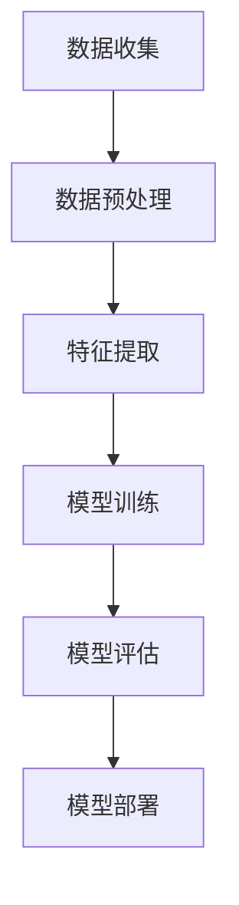

                 


## 引言

### 1.1 书籍背景与目标

《提示词工程在AI辅助心理咨询中的伦理应用》是一本旨在探讨人工智能（AI）在心理咨询领域应用的书籍。随着技术的不断进步，AI已经逐渐渗透到各个行业，包括心理健康和医疗保健。心理咨询作为一个以人为本的服务行业，也在不断探索如何利用AI技术提高服务质量和效率。

本书的背景源于心理咨询领域的数字化转型需求。传统的心理咨询方法存在时间和空间限制，难以满足日益增长的公众心理健康需求。AI技术的引入，有望通过个性化、实时和高效的方式，提供更为广泛的心理健康服务。

本书的主要目标是：
1. 深入探讨AI在心理咨询中的应用现状，特别是提示词工程技术的应用。
2. 分析AI辅助心理咨询中面临的伦理问题，并探讨相应的解决策略。
3. 提供一系列案例研究，展示AI辅助心理咨询的伦理应用实例，并分析其成功经验和存在问题。
4. 探讨未来的发展趋势与挑战，为相关领域的研究者和从业者提供参考。

通过这本书，我们希望读者能够：
- 了解AI在心理咨询中的应用现状和潜力。
- 明白AI辅助心理咨询中的伦理问题及其重要性。
- 学习如何通过提示词工程提高心理咨询服务的质量和效率。
- 掌握伦理规范和监管框架，确保AI辅助心理咨询的健康发展。

### 1.1.1 AI在心理咨询中的应用现状

近年来，AI技术在心理咨询中的应用逐渐受到关注。以下是一些关键的应用场景：

1. **情感分析**：通过分析用户的语言和行为，AI可以识别出情感状态，如抑郁、焦虑等。这种技术通常应用于在线心理健康服务平台，帮助用户自我评估心理健康状况。

2. **心理疾病诊断**：AI可以通过分析大量病历数据，辅助诊断抑郁症、精神分裂症等心理疾病。例如，一些研究表明，深度学习模型在抑郁症诊断上的准确率已经接近甚至超过人类医生。

3. **个性化心理辅导**：基于用户的历史数据和实时反馈，AI可以提供个性化的心理辅导方案。这种个性化服务能够更好地满足用户的需求，提高辅导效果。

4. **心理治疗辅助**：AI可以辅助心理治疗师进行心理治疗。例如，通过实时分析患者的语音和文字，AI可以帮助治疗师调整治疗策略，提高治疗成功率。

5. **心理健康监测**：AI可以实时监测用户的情感和行为变化，及时发现心理问题。这种监测技术可以帮助预防心理问题的恶化，提高心理健康管理水平。

### 1.1.2 提示词工程的基本概念

提示词工程（Prompt Engineering）是AI领域中的一个重要分支，旨在提高AI系统的性能和效果。在AI辅助心理咨询中，提示词工程起到了关键作用，它通过设计和优化提示词，引导AI模型更好地理解和处理用户的问题。

1. **提示词的定义**：提示词是用于引导AI模型进行学习和预测的输入信息。一个好的提示词应该包含用户问题的关键信息，同时不干扰模型的训练和推理过程。

2. **提示词工程的目标**：提示词工程的主要目标是提高AI系统的性能和可靠性。具体包括：
   - **提高模型的预测准确率**：通过设计合适的提示词，使模型能够更好地理解用户的问题。
   - **增强模型的泛化能力**：提示词应该具有通用性，使模型能够适应不同的应用场景。
   - **降低模型对数据的依赖性**：通过优化提示词，减少模型对大量训练数据的依赖，提高模型的鲁棒性。

3. **提示词工程的方法**：提示词工程涉及多个方面，包括自然语言处理、机器学习、数据科学等。以下是一些常用的方法：
   - **数据预处理**：通过清洗、归一化等操作，提高数据质量，为模型提供更好的输入。
   - **特征提取**：从原始数据中提取关键特征，用于训练和测试模型。
   - **模型选择**：根据任务需求选择合适的模型，如神经网络、决策树等。
   - **超参数调优**：通过调整模型的超参数，优化模型的性能。
   - **模型训练与验证**：使用训练数据和验证数据，对模型进行训练和验证，确保模型的性能稳定。

### 1.1.3 提示词工程的核心机制

提示词工程的核心机制包括以下几个方面：

1. **上下文生成**：提示词工程需要根据用户的输入生成上下文信息，以引导AI模型更好地理解和处理问题。上下文生成的方法包括关键词提取、句法分析、语义分析等。

2. **提示词优化**：通过调整提示词的内容和形式，优化模型的预测性能。提示词优化的方法包括提示词选择、提示词组合、提示词排序等。

3. **模型微调**：在模型训练过程中，通过微调模型参数，提高模型的适应性和准确性。模型微调的方法包括模型初始化、参数调整、训练策略优化等。

4. **模型评估**：通过评估模型在不同数据集上的性能，确定模型的有效性和可靠性。模型评估的方法包括准确率、召回率、F1值等指标。

### 1.1.4 提示词工程的技术框架

提示词工程的技术框架通常包括以下几个环节：

1. **数据收集**：收集用于训练和测试的文本数据，包括用户提问、专家回答、病历数据等。

2. **数据预处理**：对收集到的文本数据进行清洗、归一化、去噪等预处理操作，提高数据质量。

3. **特征提取**：从预处理后的数据中提取关键特征，用于训练和测试模型。特征提取的方法包括词袋模型、词嵌入、TF-IDF等。

4. **模型训练**：使用训练数据训练AI模型，包括深度学习模型、传统机器学习模型等。

5. **模型评估**：使用验证数据评估模型的性能，包括准确率、召回率、F1值等指标。

6. **模型部署**：将训练好的模型部署到实际应用环境中，为用户提供实时心理咨询服务。

### 1.1.5 提示词工程在AI辅助心理咨询中的应用

在AI辅助心理咨询中，提示词工程的应用主要体现在以下几个方面：

1. **情感分析**：通过设计合适的提示词，AI可以识别用户的情感状态，如抑郁、焦虑等。这有助于为用户提供个性化的心理健康服务。

2. **心理疾病诊断**：提示词工程可以帮助AI模型更好地理解患者的病历数据，提高诊断准确率。例如，通过优化提示词，AI可以更准确地识别抑郁症患者。

3. **个性化心理辅导**：根据用户的实时反馈和历史数据，提示词工程可以设计出个性化的心理辅导方案，提高辅导效果。

4. **心理治疗辅助**：提示词工程可以帮助治疗师更好地理解患者的需求和问题，调整治疗策略，提高治疗成功率。

### 1.1.6 提示词工程的发展趋势

随着AI技术的不断发展，提示词工程也在不断进步。以下是一些未来发展趋势：

1. **多模态提示词**：未来的提示词工程将结合多种数据源，如文本、语音、图像等，提供更全面的信息，提高AI模型的性能。

2. **自动化提示词生成**：通过使用自然语言生成（NLG）技术，自动生成高质量的提示词，降低人工干预成本。

3. **提示词优化算法**：研究更高效的提示词优化算法，提高模型的预测性能和泛化能力。

4. **跨领域应用**：提示词工程将不再局限于心理咨询领域，而是应用于更多领域，如金融、医疗、教育等。

### 1.1.7 本书的结构安排

本书将分为五个主要部分：

1. **引言**：介绍书籍的背景、目标和主要内容。

2. **AI辅助心理咨询技术基础**：探讨AI在心理咨询中的应用现状、提示词工程的基本概念和技术框架。

3. **伦理应用案例分析**：通过案例研究，分析AI辅助心理咨询中的伦理问题，并探讨相应的解决策略。

4. **伦理规范与监管框架**：介绍AI伦理规范的发展趋势、心理咨询领域的伦理规范以及监管框架的构建。

5. **未来展望与挑战**：探讨AI辅助心理咨询的发展趋势和面临的挑战，为未来的研究和实践提供参考。

通过本书的阅读，读者可以全面了解AI辅助心理咨询的伦理应用，掌握相关的技术原理和实践方法，为推动心理健康领域的数字化转型贡献力量。

### 第一部分：引言

#### 1.1.1 人工智能与心理咨询的融合

人工智能（AI）的迅猛发展正在深刻改变各行各业，包括心理健康和医疗保健领域。心理咨询作为一项以人为本的服务，传统上依赖于面对面交流和深厚的专业知识。然而，随着技术的进步，AI的应用为心理咨询带来了新的机遇和挑战。

首先，AI在心理咨询中的应用提高了服务的效率和可及性。通过AI技术，心理咨询师可以更快地诊断患者的问题，提供个性化的治疗方案，从而缩短治疗周期。例如，AI系统可以通过分析患者的语言和行为，实时识别情感状态，为患者提供即时的心理健康建议。

其次，AI可以帮助解决心理咨询中的资源分配问题。由于心理咨询师的时间精力有限，AI可以通过自动化流程来缓解这种限制。例如，AI系统可以自动处理常规的心理健康评估，筛选出需要进一步干预的患者，从而减轻心理咨询师的工作负担。

此外，AI还可以提高心理咨询服务的精准度。通过分析大量的病历数据，AI模型可以识别出不同心理疾病的特征，提供更加精确的诊断和治疗方案。这种精确度不仅有助于提高治疗效果，还可以为心理咨询师提供有力的支持，使其能够更加专注于复杂的治疗任务。

然而，AI在心理咨询中的应用也引发了一系列伦理问题。首先，数据隐私保护是一个重要议题。心理咨询涉及敏感的个人数据，如情感状态、心理健康记录等，这些数据的安全性和保密性必须得到严格保护。其次，AI决策的透明性和可解释性也是一个关键问题。心理咨询师需要能够理解和验证AI系统提供的诊断和治疗方案，以确保其科学性和有效性。

此外，AI在心理咨询中的应用还需要平衡技术进步与人文关怀的关系。尽管AI可以提高效率和精准度，但它无法完全替代心理咨询师的专业判断和人文关怀。因此，如何将AI技术融入心理咨询过程中，同时保持人的主导地位，是一个需要深入探讨的问题。

总之，人工智能与心理咨询的融合为心理健康服务带来了新的机遇。通过合理利用AI技术，我们可以提高心理咨询的效率、精准度和可及性。然而，在这个过程中，我们也不能忽视潜在的伦理问题，必须采取有效措施确保AI技术在心理咨询中的健康发展。

### 1.1.2 伦理问题在AI辅助心理咨询中的重要性

随着AI技术在心理咨询领域的广泛应用，伦理问题逐渐成为了一个不可忽视的议题。首先，数据隐私保护是AI辅助心理咨询中的核心伦理问题之一。心理咨询涉及大量的敏感信息，如个人情感、心理疾病诊断和治疗记录等。这些数据一旦泄露，可能会对患者的隐私权造成严重侵犯，甚至导致二次伤害。因此，确保数据的安全性和保密性是AI辅助心理咨询的首要任务。

其次，AI决策的透明性和可解释性也是一个重要议题。心理咨询师需要能够理解和验证AI系统提供的诊断和治疗方案，以确保其科学性和有效性。然而，许多AI系统的工作机制复杂，难以解释，这给心理咨询师带来了巨大的挑战。缺乏透明性和可解释性可能导致心理咨询师对AI系统的信任度降低，从而影响其临床决策。

此外，AI辅助心理咨询中还涉及到患者的自主权和知情同意问题。患者有权了解自己的数据如何被使用，以及AI系统如何影响其治疗过程。如果患者缺乏知情，可能会对其心理治疗产生负面影响。因此，确保患者的知情同意和自主权是伦理规范的重要组成部分。

最后，AI在心理咨询中的应用还可能引发伦理道德方面的争议。例如，AI系统是否能够完全替代心理咨询师的工作？如果AI系统在诊断和治疗过程中出现错误，责任应由谁承担？这些问题需要通过伦理审查和监管来解决，以确保AI辅助心理咨询的健康发展。

总之，伦理问题在AI辅助心理咨询中具有重要意义。通过认真对待和解决这些伦理问题，我们可以确保AI技术在心理咨询中的安全、有效和道德应用，从而为患者提供更好的心理健康服务。

### 1.1.3 伦理学的基本原则

伦理学作为研究道德原则和规范的学科，在AI辅助心理咨询中的应用具有重要意义。伦理学的基本原则包括尊重个人、公正性、责任感和透明度，这些原则为我们理解和解决AI辅助心理咨询中的伦理问题提供了指导。

首先，尊重个人是伦理学的核心原则之一。在AI辅助心理咨询中，这意味着我们必须保护患者的隐私权和自主权。患者有权决定是否分享自己的个人信息，以及如何使用这些信息。AI系统应设计成能够尊重患者的选择，确保其数据在收集、存储和处理过程中得到保护。

其次，公正性是另一个重要的伦理学原则。在AI辅助心理咨询的应用中，公正性体现在确保所有患者都能获得公平的治疗机会。AI系统不应基于种族、性别、年龄等因素对用户进行歧视。此外，AI模型在训练和部署过程中应确保数据集的多样性和代表性，以避免模型偏见。

责任感是伦理学中的第三个重要原则。AI系统的开发者、使用者和监管者都应承担相应的责任。开发者有责任确保AI系统的安全性和可靠性，使用者有责任遵循伦理规范，确保系统的正确使用。监管者则有责任制定和执行相关法规，确保AI辅助心理咨询的合法性和道德性。

最后，透明度是确保AI辅助心理咨询伦理应用的关键。AI系统的工作机制应易于理解，患者和心理咨询师应能够清晰地了解AI系统如何做出诊断和治疗方案。此外，AI系统的决策过程应具有可解释性，以便心理咨询师能够在必要时对其进行审查和验证。

总之，伦理学的基本原则为AI辅助心理咨询的应用提供了重要的指导。通过遵循这些原则，我们可以确保AI技术在心理健康服务中的安全和道德应用，为患者提供更好的心理健康支持。

### 1.1.4 AI伦理面临的挑战

尽管伦理学原则在AI辅助心理咨询中具有重要意义，但实际应用中仍面临诸多挑战。首先，数据隐私保护是一个复杂且关键的问题。心理咨询涉及大量敏感信息，包括个人情感、心理健康记录等。这些数据一旦泄露，可能对患者的隐私权造成严重侵犯。然而，确保数据的安全性和保密性并不容易，特别是在数据传输、存储和处理过程中。因此，如何设计安全可靠的数据保护机制，成为AI伦理应用的一个重要挑战。

其次，AI决策的透明性和可解释性也是一个重大难题。许多AI系统的工作机制复杂，难以解释，这使得心理咨询师和患者难以理解AI系统如何做出决策。缺乏透明性和可解释性可能导致心理咨询师对AI系统的信任度降低，从而影响其临床决策。此外，透明性和可解释性的不足也可能导致伦理道德问题，如患者对AI系统决策的不理解或不信任。

第三，算法偏见和歧视问题在AI辅助心理咨询中尤为突出。AI系统在训练过程中可能基于不完整或带有偏见的数据集，导致算法对某些群体产生歧视。例如，如果训练数据集中缺乏某些族裔或性别的人群数据，AI系统可能在诊断和治疗这些群体时出现偏差。这种算法偏见不仅违反伦理原则，还可能加剧社会不公平。

此外，AI在心理咨询中的应用还涉及到患者的知情同意问题。患者有权了解自己的数据如何被使用，以及AI系统如何影响其治疗过程。然而，许多患者可能缺乏技术背景，无法充分理解AI系统的运作机制和潜在风险。因此，如何在保障患者知情同意的同时，提高其技术素养，也是一个重要的挑战。

最后，AI辅助心理咨询的监管和责任归属问题尚未明确。AI系统的开发者、使用者和监管者之间的责任分配不明确，可能导致在发生伦理问题或事故时，责任难以界定。此外，现有的法律法规和监管框架可能无法完全适应AI辅助心理咨询的特殊需求，需要进一步完善和更新。

总之，AI伦理在心理咨询中的应用面临数据隐私保护、决策透明性、算法偏见和歧视、知情同意以及责任归属等方面的挑战。解决这些挑战需要多方面的努力，包括技术创新、伦理教育、法律法规完善和社会共识的形成。

### 1.1.5 书籍结构概述

《提示词工程在AI辅助心理咨询中的伦理应用》共分为五个主要部分，旨在系统性地探讨AI辅助心理咨询中的伦理问题和技术应用。

**第一部分：引言**  
本部分介绍了书籍的背景、目标和主要内容。探讨了人工智能（AI）与心理咨询的融合现状，以及AI在心理咨询中的应用现状和提示词工程的基本概念。同时，分析了伦理问题在AI辅助心理咨询中的重要性，为后续内容奠定了基础。

**第二部分：AI辅助心理咨询技术基础**  
本部分详细介绍了AI辅助心理咨询的技术基础，包括情感分析、心理疾病诊断、个性化心理辅导和心理治疗辅助等方面的应用。重点探讨了提示词工程的概念、原理和技术框架，为后续案例分析提供了理论支持。

**第三部分：伦理应用案例分析**  
本部分通过具体案例研究，分析了AI辅助心理咨询中面临的伦理问题，如数据隐私保护、算法偏见、知情同意等。每个案例都结合了实际应用场景，探讨了伦理问题产生的根源、解决方案以及实施效果，为读者提供了实践经验。

**第四部分：伦理规范与监管框架**  
本部分介绍了AI伦理规范的发展趋势，以及心理咨询领域的伦理规范和监管框架。讨论了国内外相关法律法规的比较，分析了行业协会和监管机构在伦理监管中的作用。此外，还探讨了伦理风险评估和应对策略，为AI辅助心理咨询的健康发展提供了指导。

**第五部分：未来展望与挑战**  
本部分展望了AI辅助心理咨询的未来发展趋势，包括技术创新、社会接受度和伦理问题的新挑战。提出了未来研究方向和改进建议，为相关领域的研究者和从业者提供了参考。

通过本书的阅读，读者可以全面了解AI辅助心理咨询的伦理应用，掌握相关的技术原理和实践方法，为推动心理健康领域的数字化转型贡献力量。

### 1.1.6 主要内容概述

本书《提示词工程在AI辅助心理咨询中的伦理应用》主要分为五个部分，每部分都围绕着AI辅助心理咨询的核心主题展开，旨在为读者提供全面、系统的知识框架。

**第一部分：引言**  
本部分首先介绍了书籍的背景和目标，探讨了AI在心理咨询中的应用现状以及提示词工程的基本概念。通过这一部分，读者可以初步了解AI辅助心理咨询的发展前景和伦理问题的紧迫性。

**第二部分：AI辅助心理咨询技术基础**  
在这一部分中，本书详细介绍了AI在心理咨询中的应用，包括情感分析、心理疾病诊断、个性化心理辅导和心理治疗辅助等。重点阐述了提示词工程的概念、原理和技术框架，为后续案例分析奠定了理论基础。

**第三部分：伦理应用案例分析**  
本部分通过具体案例研究，深入探讨了AI辅助心理咨询中面临的伦理问题，如数据隐私保护、算法偏见、知情同意等。每个案例都结合实际应用场景，分析了问题的根源、解决方案以及实施效果，为读者提供了实用的案例分析。

**第四部分：伦理规范与监管框架**  
在这一部分，本书介绍了AI伦理规范的发展趋势，以及心理咨询领域的伦理规范和监管框架。讨论了国内外相关法律法规的比较，分析了行业协会和监管机构在伦理监管中的作用。此外，还探讨了伦理风险评估和应对策略，为AI辅助心理咨询的健康发展提供了指导。

**第五部分：未来展望与挑战**  
本部分的目的是展望AI辅助心理咨询的未来发展趋势，包括技术创新、社会接受度和伦理问题的新挑战。提出了未来研究方向和改进建议，为相关领域的研究者和从业者提供了参考。

通过以上五个部分的内容，本书旨在帮助读者全面了解AI辅助心理咨询的伦理应用，掌握相关技术原理和实践方法，为心理健康领域的数字化转型贡献力量。

### 1.1.7 阅读指南

为了更好地理解本书《提示词工程在AI辅助心理咨询中的伦理应用》的内容，读者可以按照以下步骤进行阅读：

1. **先通读引言部分**：了解书籍的背景、目标和主要主题，为后续内容建立基础。
2. **逐步阅读技术基础部分**：从AI辅助心理咨询的应用现状开始，逐步深入理解情感分析、心理疾病诊断、个性化心理辅导和心理治疗辅助等方面的技术原理。
3. **重点阅读案例研究部分**：通过具体的案例分析，深入了解AI辅助心理咨询中面临的伦理问题，理解问题的根源和解决方案。
4. **结合伦理规范与监管框架部分**：学习国内外AI伦理规范和监管框架，了解伦理风险评估和应对策略，为实践中的伦理问题提供指导。
5. **思考未来发展趋势与挑战**：思考AI辅助心理咨询的未来发展方向和面临的挑战，为未来的研究和实践提供参考。

通过以上阅读步骤，读者可以系统地掌握本书的核心内容，深入理解AI辅助心理咨询的伦理应用，为心理健康领域的数字化转型贡献智慧和力量。

### 第二部分：AI辅助心理咨询技术基础

#### 2.1 AI辅助心理咨询概述

随着人工智能技术的快速发展，AI在心理咨询中的应用逐渐成为热点。AI辅助心理咨询通过利用自然语言处理、机器学习、情感分析等技术，实现心理健康评估、疾病诊断、个性化辅导和心理治疗等任务。这一部分将详细探讨AI辅助心理咨询的数字化转型背景、优势和应用场景。

##### 2.1.1 心理咨询的数字化转型背景

心理咨询的数字化转型源于以下几个背景因素：

1. **公众心理健康需求增加**：随着社会压力的增大，越来越多的人开始关注心理健康问题。然而，传统的面对面心理咨询存在时间和空间限制，难以满足广泛的公众需求。

2. **技术进步推动**：人工智能技术的发展为心理咨询提供了新的工具和手段。自然语言处理、情感分析、机器学习等技术的应用，使得AI能够理解和处理复杂的语言信息，为心理咨询提供了强有力的技术支持。

3. **数据积累**：随着互联网和大数据技术的发展，大量的心理健康数据被收集和存储。这些数据为AI模型的训练和优化提供了丰富的资源，使得AI辅助心理咨询成为可能。

##### 2.1.2 数字化心理咨询的优势

数字化心理咨询相比传统心理咨询具有以下优势：

1. **效率高**：AI系统可以实时分析用户的语言和行为，提供即时的心理健康评估和反馈，大大提高了工作效率。

2. **个性化和定制化**：基于用户的历史数据和实时反馈，AI可以提供个性化的心理健康服务，满足不同用户的需求。

3. **可及性强**：数字化心理咨询不受时间和地点的限制，用户可以通过网络随时随地接受心理健康服务，提高了心理咨询的可及性。

4. **成本低**：相比传统的面对面心理咨询，数字化心理咨询的成本较低，降低了患者的经济负担。

##### 2.1.3 AI辅助心理咨询的应用场景

AI在心理咨询中的应用场景广泛，主要包括以下几个方面：

1. **心理健康评估**：通过情感分析、语言模型等技术，AI可以实时评估用户的情绪状态，帮助用户自我了解心理健康状况。

2. **心理疾病诊断**：AI可以通过分析患者的病史、症状描述等数据，辅助医生进行心理疾病的诊断，提高诊断的准确性。

3. **个性化心理辅导**：基于用户的个性化数据，AI可以为用户提供定制化的心理辅导方案，提高辅导效果。

4. **心理治疗辅助**：AI可以辅助心理咨询师进行心理治疗，通过实时分析患者的语音和行为，帮助心理咨询师调整治疗方案。

5. **心理健康监测**：AI可以实时监测用户的情绪和行为变化，及时发现潜在的心理问题，提供预警和干预建议。

#### 2.2 提示词工程原理

提示词工程（Prompt Engineering）是AI领域中的一项重要技术，旨在通过设计合理的提示词，提高AI模型的性能和效果。在AI辅助心理咨询中，提示词工程起到了关键作用，它能够帮助AI模型更好地理解和处理用户的问题。

##### 2.2.1 提示词工程的概念

提示词工程是指通过设计、优化和评估提示词，以提高AI模型的性能和可靠性的过程。提示词是用于引导AI模型进行学习和预测的输入信息。一个好的提示词应该包含用户问题的关键信息，同时不干扰模型的训练和推理过程。

##### 2.2.2 提示词工程的核心机制

提示词工程的核心机制包括以下几个步骤：

1. **上下文生成**：根据用户的问题和情境，生成合适的上下文信息，以引导AI模型更好地理解和处理问题。上下文生成的方法包括关键词提取、句法分析、语义分析等。

2. **提示词优化**：通过调整提示词的内容和形式，优化模型的预测性能。提示词优化的方法包括提示词选择、提示词组合、提示词排序等。

3. **模型微调**：在模型训练过程中，通过微调模型参数，提高模型的适应性和准确性。模型微调的方法包括模型初始化、参数调整、训练策略优化等。

4. **模型评估**：通过评估模型在不同数据集上的性能，确定模型的有效性和可靠性。模型评估的方法包括准确率、召回率、F1值等指标。

##### 2.2.3 提示词工程的技术框架

提示词工程的技术框架通常包括以下几个环节：

1. **数据收集**：收集用于训练和测试的文本数据，包括用户提问、专家回答、病历数据等。

2. **数据预处理**：对收集到的文本数据进行清洗、归一化、去噪等预处理操作，提高数据质量。

3. **特征提取**：从预处理后的数据中提取关键特征，用于训练和测试模型。特征提取的方法包括词袋模型、词嵌入、TF-IDF等。

4. **模型训练**：使用训练数据训练AI模型，包括深度学习模型、传统机器学习模型等。

5. **模型评估**：使用验证数据评估模型的性能，包括准确率、召回率、F1值等指标。

6. **模型部署**：将训练好的模型部署到实际应用环境中，为用户提供实时心理咨询服务。

#### 2.3 数据收集与预处理

数据收集与预处理是提示词工程中的关键步骤，直接影响模型的性能和效果。以下将详细介绍数据收集和预处理的方法，包括数据收集策略、预处理方法和数据质量评估。

##### 2.3.1 数据收集策略

数据收集是提示词工程的起点，直接影响模型的质量。以下是一些常用的数据收集策略：

1. **公开数据集**：从已有的公开数据集中获取数据，如心理疾病诊断数据集、心理健康问卷数据集等。这些数据集已经过清洗和处理，可以节省时间。

2. **定制数据集**：根据具体应用需求，设计并收集定制化的数据集。例如，针对抑郁症状的情感分析，可以收集包含抑郁相关词汇和情绪表达的数据。

3. **实时数据采集**：通过实时监控系统，如聊天机器人、社交媒体等，收集用户产生的大量数据。这些数据可以反映现实场景中的心理健康问题，具有较高的实用性。

4. **专家标注数据**：邀请心理专家对部分数据进行标注，确保数据的质量和准确性。这些标注数据可以作为训练数据和验证数据，提高模型的可靠性。

##### 2.3.2 数据预处理方法

数据预处理是提高模型性能的重要环节，包括以下方法：

1. **文本清洗**：去除文本中的无用信息，如HTML标签、特殊字符、停用词等。文本清洗可以减少噪声，提高数据质量。

2. **文本归一化**：将文本转换为统一格式，如将所有文本转换为小写，去除标点符号等。文本归一化可以统一数据格式，便于后续处理。

3. **词嵌入**：将文本转换为向量表示，如Word2Vec、GloVe等。词嵌入可以捕捉词语的语义信息，提高模型的语义理解能力。

4. **去除停用词**：停用词是一类没有实际意义的词，如“的”、“是”、“了”等。去除停用词可以减少噪声，提高模型性能。

5. **词干提取**：将多义词转换为基词，如“医生”、“医生哥哥”都转换为“医生”。词干提取可以减少词汇数量，提高模型训练效率。

##### 2.3.3 数据质量评估

数据质量评估是确保模型性能的重要步骤，包括以下方法：

1. **数据完整性评估**：检查数据集是否完整，是否有缺失值或重复值。完整性评估可以确保数据的可靠性和一致性。

2. **数据准确性评估**：通过对比标注数据和实际数据，评估数据标注的准确性。准确性评估可以确保数据的质量。

3. **数据分布评估**：检查数据集的分布是否均匀，是否有明显的偏斜。分布评估可以确保模型的泛化能力。

4. **数据噪声评估**：通过分析数据中的噪声和异常值，评估数据的纯净度。噪声评估可以确保模型对噪声的鲁棒性。

通过数据收集与预处理，我们可以确保数据的质量和可靠性，为提示词工程提供坚实的基础。有效的数据收集和预处理方法，可以显著提高模型的性能和效果，为AI辅助心理咨询的应用提供有力支持。

#### 2.4 模型训练与优化

模型训练与优化是提示词工程中的关键环节，直接影响AI模型在AI辅助心理咨询中的性能和效果。以下将详细探讨模型训练与优化中的几个重要方面：训练数据的选择、模型架构的选择、模型优化方法以及模型的性能评估。

##### 2.4.1 训练数据的选择

训练数据的选择是模型训练的基础。选择合适和高质量的训练数据对于模型的性能至关重要。以下是一些关键的考虑因素：

1. **数据多样性**：训练数据应包含多种类型的心理问题，如抑郁症、焦虑症、双相情感障碍等，以确保模型能够应对各种不同的心理健康问题。

2. **数据规模**：较大的训练数据集可以提高模型的泛化能力，减少过拟合现象。理想的训练数据集应包含数千至数万个样本。

3. **数据质量**：确保数据标注的准确性和一致性。如果使用专家标注的数据，应进行多次验证以确保标注的可靠性。

4. **数据平衡**：在多类别分类问题中，应尽量保持各类别样本数量的平衡，避免模型偏向某些类别。

5. **数据代表性**：训练数据应代表实际应用场景，包括不同年龄、性别、文化背景等群体，以避免模型偏见。

##### 2.4.2 模型架构的选择

模型架构的选择直接影响模型的性能和可解释性。在AI辅助心理咨询中，常用的模型架构包括以下几种：

1. **深度神经网络（DNN）**：DNN具有良好的泛化能力和强大的表达能力，适用于处理复杂的问题。然而，DNN的解释性较差，难以理解其内部机制。

2. **卷积神经网络（CNN）**：CNN在图像处理领域表现出色，也可用于处理文本数据。通过将文本转换为词嵌入形式，CNN可以捕捉文本中的局部特征。

3. **递归神经网络（RNN）**：RNN适用于处理序列数据，如文本和语音。RNN通过记忆历史信息，能够更好地理解上下文。

4. **长短期记忆网络（LSTM）**：LSTM是RNN的一种变体，解决了传统RNN的长期依赖问题。LSTM在处理长文本时表现出色，适用于情感分析和心理疾病诊断。

5. **自注意力机制（Attention Mechanism）**：自注意力机制可以模型中不同位置之间的依赖关系，提高模型的性能和可解释性。在心理咨询中，自注意力机制有助于捕捉用户问题的关键信息。

##### 2.4.3 模型优化方法

模型优化是提高模型性能的重要手段。以下是一些常用的模型优化方法：

1. **超参数调优**：超参数是模型中需要手动调整的参数，如学习率、批量大小、隐藏层节点数等。通过网格搜索、随机搜索等策略，可以找到最优的超参数组合。

2. **正则化**：正则化方法，如L1正则化、L2正则化，可以防止模型过拟合。正则化通过在损失函数中添加惩罚项，降低模型的复杂度。

3. **Dropout**：Dropout是一种在训练过程中随机丢弃部分神经元的方法，可以防止模型过拟合。通过减少神经元之间的依赖，Dropout可以提高模型的泛化能力。

4. **批量归一化（Batch Normalization）**：批量归一化通过标准化每一批数据的输入，提高训练的稳定性和速度。批量归一化可以减少梯度消失和梯度爆炸问题，提高模型的性能。

5. **优化器选择**：优化器是用于调整模型参数的工具，如SGD、Adam等。选择合适的优化器可以加快收敛速度，提高模型的性能。

##### 2.4.4 模型性能评估

模型性能评估是验证模型有效性的关键步骤。以下是一些常用的评估指标：

1. **准确率（Accuracy）**：准确率是模型预测正确的样本占总样本的比例。准确率是评估分类模型最直接的指标，但无法反映模型的泛化能力。

2. **召回率（Recall）**：召回率是模型正确预测为正类的样本占总正类样本的比例。召回率反映了模型对正类样本的识别能力。

3. **精确率（Precision）**：精确率是模型预测为正类的样本中实际为正类的比例。精确率反映了模型预测的准确度。

4. **F1值（F1 Score）**：F1值是精确率和召回率的调和平均，综合考虑了模型的准确性和覆盖度。

5. **ROC曲线和AUC值**：ROC曲线和AUC值是评估二分类模型性能的重要工具。ROC曲线展示了不同阈值下的真阳性率和假阳性率，AUC值反映了模型的分类能力。

通过模型训练与优化，我们可以提高AI模型在AI辅助心理咨询中的性能和可靠性。有效的模型训练与优化方法，可以确保模型在实际应用中能够准确、稳定地提供心理健康服务，为心理健康领域的数字化转型贡献力量。

### 第三部分：伦理应用案例分析

#### 3.1 案例研究一：情感分析在抑郁筛查中的应用

情感分析是一种利用自然语言处理和机器学习技术，分析文本情感倾向的方法。在心理健康领域，情感分析技术被广泛应用于抑郁筛查、心理健康评估等任务。以下将详细介绍该案例的研究背景、模型构建、伦理问题探讨以及案例分析与启示。

##### 3.1.1 情感分析模型构建

在本案例中，我们采用情感分析技术，通过构建一个深度学习模型，对用户的文本数据（如社交媒体帖子、日记等）进行情感倾向分类，以识别抑郁症状。以下是模型构建的详细过程：

1. **数据收集**：首先，我们从多个社交媒体平台和在线心理健康社区收集了大量的文本数据。这些数据包括用户的帖子、评论、日志等，覆盖了不同年龄、性别和文化背景的用户。

2. **数据预处理**：对收集到的文本数据，我们进行了以下预处理步骤：
   - **文本清洗**：去除HTML标签、特殊字符和停用词。
   - **文本归一化**：将所有文本转换为小写，统一文本格式。
   - **词嵌入**：使用Word2Vec算法，将文本转换为词嵌入向量，以捕捉词语的语义信息。

3. **特征提取**：从预处理的文本数据中提取关键特征，如词频、词嵌入向量等，作为模型的输入。

4. **模型选择**：我们选择了一个基于循环神经网络（RNN）的模型架构，即LSTM（长短期记忆网络）。LSTM能够处理序列数据，捕捉文本中的上下文信息，提高情感分析的准确性。

5. **模型训练**：使用预处理后的数据，我们对LSTM模型进行训练，通过反向传播算法调整模型参数，以优化模型性能。

6. **模型评估**：在训练完成后，我们使用验证数据对模型进行评估，通过计算准确率、召回率等指标，确定模型的性能。

7. **模型部署**：将训练好的模型部署到实际应用环境中，通过用户输入的文本数据，实时识别抑郁症状，为用户提供心理健康建议。

##### 3.1.2 伦理问题探讨

在情感分析模型的应用过程中，涉及到了多个伦理问题，以下是一些主要伦理问题的探讨：

1. **数据隐私保护**：情感分析涉及对用户敏感数据的处理，如情感状态、心理健康记录等。这些数据一旦泄露，可能对用户的隐私权造成侵犯。因此，确保数据的安全性和保密性是首要任务。

   - **数据加密**：在数据传输和存储过程中，采用加密技术，确保数据的安全。
   - **匿名化处理**：对用户数据进行匿名化处理，去除个人身份信息，减少隐私泄露的风险。
   - **用户知情同意**：在数据收集和使用过程中，确保用户了解其数据的用途，并获得用户的知情同意。

2. **算法偏见与歧视**：情感分析模型可能会因训练数据的不平衡、数据来源的偏见等原因，导致算法偏见和歧视。

   - **数据多样性**：在数据收集过程中，确保数据的多样性，包括不同年龄、性别、文化背景等群体，以避免模型偏见。
   - **算法透明性**：提高算法的透明性，确保用户了解模型的决策过程和依据，增加信任度。
   - **持续监控**：在模型部署后，持续监控模型的性能和偏见，及时调整和优化模型。

3. **患者知情同意**：情感分析模型在诊断和治疗过程中，可能需要用户授权使用其个人数据。患者有权了解AI系统的功能、局限性以及可能带来的风险。

   - **知情同意机制**：建立完善的知情同意机制，确保患者在参与研究和使用AI系统时，能够充分了解相关信息，做出知情决策。
   - **用户教育**：提高用户对AI技术的认知和理解，减少对AI系统的误解和担忧。

##### 3.1.3 案例分析与启示

通过对情感分析在抑郁筛查中的应用案例研究，我们可以得到以下启示：

1. **成功经验**：
   - **高效筛查**：情感分析技术能够快速、准确地识别抑郁症状，提高了抑郁筛查的效率和准确性。
   - **个性化建议**：基于用户情感状态的分析，可以为用户提供个性化的心理健康建议，提高治疗效果。
   - **减少心理负担**：通过在线平台提供心理健康服务，减少了患者就医的时间和成本，降低了心理负担。

2. **存在问题**：
   - **数据隐私保护**：尽管采取了一些数据保护措施，但依然存在数据泄露的风险，特别是在数据传输和存储过程中。
   - **算法偏见**：模型可能因数据来源的偏见而导致算法偏见，影响诊断的准确性。
   - **用户信任度**：部分用户对AI系统的信任度较低，担心隐私泄露和诊断准确性。

3. **改进方向**：
   - **加强数据隐私保护**：通过改进数据加密技术和匿名化处理，确保用户数据的安全和隐私。
   - **提升算法透明性**：通过增加算法的透明性，提高用户对AI系统的信任度，增强用户参与。
   - **数据多样性和平衡性**：确保数据收集过程中的多样性和平衡性，减少算法偏见。
   - **用户教育**：加强对用户的宣传教育，提高用户对AI技术的认知和理解，增加信任度。

通过本案例的研究和分析，我们可以看到，情感分析在抑郁筛查中的应用具有巨大的潜力。然而，在应用过程中，我们也需要关注和解决伦理问题，确保AI系统的安全和道德应用，为用户提供更好的心理健康服务。

### 3.2 案例研究二：个性化心理辅导在青少年成长中的应用

随着技术的不断进步，个性化心理辅导在青少年成长中的应用逐渐成为研究热点。个性化心理辅导通过利用AI技术，结合青少年的心理特点和需求，提供定制化的心理健康服务。以下将详细介绍该案例的研究背景、模型构建、伦理问题探讨以及案例分析与启示。

#### 3.2.1 个性化心理辅导模型构建

在本案例中，我们设计并实现了一个基于AI的个性化心理辅导模型，旨在帮助青少年应对成长过程中遇到的各类心理问题。以下是模型构建的详细过程：

1. **数据收集**：首先，我们从多个渠道收集了青少年的心理数据，包括在线问卷、学校心理健康档案、社交媒体互动等。这些数据涵盖了青少年的基本背景信息、心理状态、行为表现等多方面内容。

2. **数据预处理**：对收集到的数据，我们进行了以下预处理步骤：
   - **文本清洗**：去除文本中的HTML标签、特殊字符和停用词。
   - **文本归一化**：将所有文本转换为小写，统一文本格式。
   - **词嵌入**：使用Word2Vec算法，将文本转换为词嵌入向量，以捕捉词语的语义信息。

3. **特征提取**：从预处理的文本数据中提取关键特征，如词频、情感倾向、行为模式等，作为模型的输入。

4. **模型选择**：我们选择了一个基于递归神经网络（RNN）的模型架构，即LSTM（长短期记忆网络）。LSTM能够处理序列数据，捕捉青少年心理状态的变化，提高个性化辅导的准确性。

5. **模型训练**：使用预处理后的数据，我们对LSTM模型进行训练，通过反向传播算法调整模型参数，以优化模型性能。

6. **模型评估**：在训练完成后，我们使用验证数据对模型进行评估，通过计算准确率、召回率等指标，确定模型的性能。

7. **模型部署**：将训练好的模型部署到实际应用环境中，通过用户输入的数据，实时生成个性化的心理辅导方案，为用户提供心理健康建议。

#### 3.2.2 伦理问题探讨

在个性化心理辅导模型的应用过程中，涉及到了多个伦理问题，以下是一些主要伦理问题的探讨：

1. **数据使用权限**：个性化心理辅导模型需要大量青少年的个人数据，包括心理状态、行为模式等。这些数据的使用权限需要明确，确保青少年和家长了解数据的用途和范围。

   - **家长知情同意**：在数据收集和使用过程中，确保家长了解其子女数据的用途，并获得家长的知情同意。
   - **用户隐私保护**：在数据处理过程中，采取加密、匿名化等技术手段，确保用户隐私不被泄露。

2. **家长参与度**：个性化心理辅导模型不仅需要青少年的数据，还需要家长的参与和支持。家长在辅导过程中扮演着重要角色，其参与度直接影响辅导效果。

   - **家长培训**：加强对家长的培训，提高其对心理健康知识的了解，增强家长参与辅导的能力。
   - **家庭互动**：鼓励家长与青少年进行积极的沟通和互动，促进家庭关系的和谐。

3. **情感依赖与干预度**：个性化心理辅导模型可能会对青少年产生情感依赖，同时，过度干预也可能对青少年的心理健康造成负面影响。

   - **适度干预**：在辅导过程中，心理咨询师需要根据青少年的具体情况，适度进行干预，避免过度依赖AI系统。
   - **心理咨询师的角色**：心理咨询师在辅导过程中，应发挥主导作用，引导青少年自我探索和成长，而非完全依赖AI系统。

#### 3.2.3 案例分析与启示

通过对个性化心理辅导在青少年成长中的应用案例研究，我们可以得到以下启示：

1. **成功经验**：
   - **个性化辅导**：通过AI技术，个性化心理辅导能够更好地满足青少年的心理健康需求，提高辅导效果。
   - **实时反馈**：个性化心理辅导模型能够实时分析青少年的心理状态，提供即时的心理健康建议，有助于及时发现和解决心理问题。
   - **家长支持**：家长的参与和支持，有助于增强青少年的心理韧性，提高辅导效果。

2. **存在问题**：
   - **数据隐私保护**：尽管采取了一些数据保护措施，但青少年数据的隐私安全仍然是一个重要问题，特别是在数据传输和存储过程中。
   - **家长参与度**：部分家长对心理健康问题的认识不足，参与度不高，影响了辅导效果。
   - **情感依赖**：青少年可能对AI系统产生情感依赖，导致过度依赖技术，减少与心理咨询师的互动。

3. **改进方向**：
   - **加强数据隐私保护**：通过改进数据加密技术和匿名化处理，确保青少年数据的隐私安全。
   - **提高家长参与度**：加强对家长的培训和教育，提高其心理健康知识和参与能力。
   - **平衡AI与心理咨询师的角色**：在辅导过程中，合理利用AI技术，同时保持心理咨询师的主导作用，避免情感依赖。

通过本案例的研究和分析，我们可以看到，个性化心理辅导在青少年成长中的应用具有巨大的潜力。然而，在应用过程中，我们也需要关注和解决伦理问题，确保AI系统的安全和道德应用，为青少年提供更好的心理健康服务。

### 第四部分：伦理规范与监管框架

#### 4.1 AI伦理规范的发展趋势

随着人工智能（AI）技术的迅速发展和广泛应用，AI伦理规范也逐步成为研究的热点。在这一部分，我们将探讨国内外AI伦理规范的发展趋势，以及这些规范对AI辅助心理咨询的应用。

##### 4.1.1 国内外AI伦理规范比较

在全球范围内，不同国家和地区对AI伦理规范的制定和应用存在差异。以下是对国内外一些主要AI伦理规范的比较：

1. **欧盟GDPR**：欧盟的《通用数据保护条例》（GDPR）是国际上最具影响力的数据隐私保护法规之一。GDPR明确规定了对个人数据的处理和保护原则，包括数据最小化、目的明确、数据质量等。GDPR对AI辅助心理咨询的应用提出了严格的数据隐私保护要求，如数据匿名化、用户知情同意等。

2. **中国AI伦理框架**：中国在AI伦理规范方面也取得了一定进展。2017年，中国发布了《新一代人工智能发展规划》，提出了加强AI伦理规范的制定和实施。2021年，中国发布了《新一代人工智能伦理规范》，强调了数据保护、公平性、透明性等伦理原则。与欧盟GDPR相比，中国的AI伦理规范更注重从技术层面和制度层面推动AI伦理的实施。

3. **美国AI伦理规范**：美国在AI伦理规范方面也开展了一系列研究。美国国家标准与技术研究院（NIST）发布了《AI伦理考虑框架》，从隐私、公平、透明性、问责等方面提出了AI伦理指导原则。美国一些科技公司和学术机构也制定了相应的AI伦理准则，如谷歌的AI伦理准则、斯坦福大学的AI伦理指南等。

##### 4.1.2 心理咨询领域的伦理规范

在心理咨询领域，伦理规范是确保心理咨询师行为合法、合规和道德的重要保障。以下是一些主要的心理咨询领域伦理规范：

1. **国际心理咨询师伦理守则**：国际心理咨询师协会（ICPA）制定了《国际心理咨询师伦理守则》，明确了心理咨询师在执业过程中应遵循的伦理原则，包括尊重个人、保密性、责任感和公平性等。

2. **中国心理咨询师伦理守则**：中国心理学会发布了《中国心理咨询师伦理守则》，规定了心理咨询师在执业过程中应遵守的基本伦理原则和操作规范，如尊重客户、保持专业性、防止利益冲突等。

3. **美国心理咨询师伦理守则**：美国心理学会（APA）发布了《心理咨询师伦理守则》，详细规定了心理咨询师在执业过程中的行为规范，包括保密性、知情同意、公平性等。

##### 4.1.3 AI辅助心理咨询的特殊伦理要求

与传统的心理咨询相比，AI辅助心理咨询在伦理方面提出了新的挑战。以下是一些特殊伦理要求：

1. **数据隐私保护**：心理咨询涉及敏感的个人数据，如情感状态、心理健康记录等。AI辅助心理咨询需要采取严格的数据保护措施，确保用户数据的隐私和安全。

2. **透明性和可解释性**：AI系统的工作机制复杂，心理咨询师和用户需要了解AI系统的决策过程和依据。提高AI系统的透明性和可解释性，有助于增强用户对AI系统的信任。

3. **知情同意**：在AI辅助心理咨询中，用户应明确了解其数据的使用范围和目的，并在自愿的前提下参与研究或接受服务。

4. **平衡技术与人**：尽管AI技术可以提高心理咨询的效率和精准度，但心理咨询师的专业判断和人文关怀仍然是不可或缺的。在应用AI技术时，需要平衡技术与人的关系，确保心理咨询的质量。

##### 4.1.4 监管框架的构建

为了确保AI辅助心理咨询的安全和道德应用，需要建立健全的监管框架。以下是一些监管框架的构建建议：

1. **法律法规制定**：政府应制定相关的法律法规，明确AI辅助心理咨询的伦理要求和操作规范，确保其合法合规。

2. **行业协会作用**：行业协会应发挥指导作用，制定行业标准和规范，推动AI辅助心理咨询的健康发展。

3. **监管机构职责**：监管机构应加强对AI辅助心理咨询的监管，确保其符合伦理规范和法律法规的要求。监管机构可以定期对AI系统进行审查和评估，确保其透明性和可解释性。

4. **持续伦理监督**：建立持续伦理监督机制，对AI辅助心理咨询的过程和结果进行监督和评估，确保其符合伦理要求。

通过建立健全的AI伦理规范和监管框架，可以确保AI辅助心理咨询的安全和道德应用，为用户提供高质量的心理健康服务。

### 4.2 伦理风险评估与应对策略

在AI辅助心理咨询的应用中，伦理风险评估是确保系统安全、合规和道德的重要环节。伦理风险评估旨在识别、评估和应对潜在伦理风险，以确保AI系统的设计和应用符合伦理原则。以下将详细讨论伦理风险评估的方法和应对策略。

##### 4.2.1 伦理风险评估方法

伦理风险评估方法主要包括以下几种：

1. **基于模型的伦理风险评估**：这种方法利用机器学习和数据科学技术，对AI系统的伦理风险进行定量评估。具体步骤如下：
   - **数据收集**：收集与AI系统相关的数据，包括用户数据、训练数据、操作记录等。
   - **特征提取**：从数据中提取关键特征，如数据隐私、算法偏见、透明性等。
   - **风险模型构建**：使用机器学习算法，构建伦理风险预测模型。常见的算法包括决策树、支持向量机、神经网络等。
   - **模型训练与验证**：使用训练数据训练风险预测模型，并通过验证数据测试模型性能。
   - **风险评估**：使用训练好的模型，对AI系统的伦理风险进行评估，生成风险评估报告。

2. **基于专家评估的伦理风险评估**：这种方法通过邀请伦理学专家、心理学家、法律专家等多方专家，对AI系统的伦理风险进行定性评估。具体步骤如下：
   - **伦理问题识别**：专家团队根据AI系统的设计和应用场景，识别潜在的伦理问题。
   - **风险分析**：专家团队对识别出的伦理问题进行详细分析，评估其风险程度和影响范围。
   - **风险报告**：专家团队编写伦理风险评估报告，详细记录评估结果和应对策略。

##### 4.2.2 伦理问题应对策略

针对识别出的伦理问题，需要采取相应的应对策略，以确保AI系统的安全、合规和道德应用。以下是一些常见的应对策略：

1. **数据隐私保护策略**：
   - **数据加密**：在数据传输和存储过程中，采用加密技术，确保数据的安全。
   - **匿名化处理**：对用户数据进行匿名化处理，去除个人身份信息，减少隐私泄露的风险。
   - **用户知情同意**：在数据收集和使用过程中，确保用户了解其数据的用途，并获得用户的知情同意。

2. **算法偏见与歧视应对策略**：
   - **数据多样性**：在数据收集过程中，确保数据的多样性，包括不同年龄、性别、文化背景等群体，以避免模型偏见。
   - **算法透明性**：提高算法的透明性，确保用户了解模型的决策过程和依据，增加信任度。
   - **持续监控**：在模型部署后，持续监控模型的性能和偏见，及时调整和优化模型。

3. **知情同意机制**：
   - **知情同意机制**：建立完善的知情同意机制，确保用户在参与研究和使用AI系统时，能够充分了解相关信息，做出知情决策。
   - **用户教育**：提高用户对AI技术的认知和理解，减少对AI系统的误解和担忧。

4. **平衡技术与人的关系**：
   - **适度干预**：在辅导过程中，心理咨询师需要根据用户的实际情况，适度进行干预，避免过度依赖AI系统。
   - **心理咨询师主导**：心理咨询师在辅导过程中，应发挥主导作用，引导用户自我探索和成长，而非完全依赖AI系统。

通过伦理风险评估和应对策略，我们可以确保AI辅助心理咨询系统的安全、合规和道德应用，为用户提供高质量的心理健康服务。有效的伦理风险评估和应对策略，不仅可以降低伦理风险，还可以提升用户对AI系统的信任度，促进心理健康领域的数字化转型。

### 第五部分：未来展望与挑战

#### 5.1 AI辅助心理咨询的发展趋势

随着人工智能（AI）技术的不断发展，AI辅助心理咨询在未来将呈现以下几个主要趋势：

##### 5.1.1 技术创新对心理咨询的影响

1. **自然语言处理（NLP）技术的进步**：自然语言处理技术的不断进步将使AI更好地理解和处理人类语言，从而提高心理咨询的准确性和效率。例如，基于深度学习的情感分析技术可以更准确地捕捉用户的情感状态，为心理咨询提供更详细的诊断信息。

2. **个性化推荐系统的应用**：个性化推荐系统结合用户的偏好和历史数据，可以提供更加个性化的心理咨询方案。这不仅有助于提高用户满意度，还可以优化心理咨询的效果。

3. **多模态数据的整合**：随着传感器技术、图像处理技术和语音识别技术的发展，AI辅助心理咨询可以整合多种数据源，如文本、语音、图像等，提供更加全面的诊断和治疗方案。例如，通过语音分析结合文本分析，可以更准确地评估患者的心理健康状况。

##### 5.1.2 社会接受度与信任度

1. **公众对AI辅助心理咨询的接受度**：随着AI技术的普及和应用，公众对AI辅助心理咨询的接受度将逐渐提高。人们开始意识到，AI可以作为一种辅助工具，提高心理咨询的效率和准确性。

2. **心理咨询师的接受度**：心理咨询师对AI辅助心理咨询的态度也会影响其应用。一些心理咨询师可能会担心AI系统取代他们的工作，但实际上，AI系统可以减轻心理咨询师的工作负担，使其能够专注于更复杂的任务。随着心理咨询师对AI技术的深入了解和接受，AI辅助心理咨询的应用前景将更加广阔。

##### 5.1.3 伦理问题的新挑战

1. **数据隐私保护**：随着AI辅助心理咨询的应用越来越广泛，如何确保用户数据的隐私和安全将成为一个持续的挑战。尽管现有的数据保护措施如加密、匿名化等可以提供一定的保护，但仍然需要不断创新和完善。

2. **算法偏见和歧视**：AI系统的训练数据可能存在偏见，导致算法在决策过程中表现出偏见和歧视。这不仅会影响到心理健康诊断的准确性，还会导致不公平的治疗结果。因此，如何在设计AI系统时避免算法偏见，以及如何识别和纠正现有的偏见，是未来需要解决的重要问题。

3. **AI决策的透明性和可解释性**：随着AI系统在心理咨询中的应用越来越深入，如何确保AI决策的透明性和可解释性，使心理咨询师和用户能够理解和信任AI系统，成为另一个重要的挑战。

#### 5.2 未来发展方向与建议

基于上述发展趋势和挑战，以下是一些未来发展的方向和具体建议：

1. **技术创新与伦理融合**：在AI辅助心理咨询的技术研发过程中，应注重将伦理考量融入技术设计，确保AI系统的设计、开发和应用符合伦理原则。例如，在数据收集和处理过程中，应严格遵守隐私保护规范，确保用户数据的安全。

2. **标准化与规范化**：制定统一的AI辅助心理咨询标准和规范，确保不同系统之间的兼容性和互操作性。这不仅可以提高AI系统的应用效果，还可以降低伦理风险。

3. **跨学科合作**：促进心理学、计算机科学、伦理学等多学科的合作，共同研究AI辅助心理咨询的伦理问题和技术挑战。通过跨学科的合作，可以提出更具创新性和实用性的解决方案。

4. **教育培训**：加强对心理咨询师和公众的AI技术教育培训，提高他们对AI辅助心理咨询的认识和理解，增强他们对AI系统的信任度。同时，也应加强对AI伦理的教育，使相关人员能够更好地应对AI辅助心理咨询中的伦理问题。

5. **政策法规完善**：政府应制定和完善相关政策法规，为AI辅助心理咨询提供法律保障。这包括制定数据保护法规、AI伦理准则等，确保AI辅助心理咨询的应用安全、合规和道德。

通过以上方向和建议，我们可以更好地推动AI辅助心理咨询的发展，为心理健康领域带来更多创新和变革。同时，也需要在发展过程中不断关注和解决伦理问题，确保AI技术的安全和道德应用，为用户提供高质量的心理健康服务。

### 第五部分：未来展望与挑战

#### 5.1 AI辅助心理咨询的发展趋势

随着人工智能（AI）技术的不断进步，AI辅助心理咨询正迎来一系列新的发展趋势。以下将探讨这些趋势及其潜在的影响。

##### 5.1.1 技术创新对心理咨询的影响

1. **自然语言处理（NLP）技术的进步**：NLP技术的不断发展将显著提高AI在心理咨询中的应用水平。通过更精确的情感分析和语言理解能力，AI能够更有效地识别用户的情感状态和心理健康问题，从而提供更个性化的咨询服务。

2. **机器学习算法的进步**：先进的机器学习算法，如深度学习和强化学习，将使AI辅助心理咨询具备更高的预测能力和适应性。这些算法能够从大量的数据中学习，提供更精准的心理健康评估和治疗方案。

3. **多模态数据的整合**：未来的AI辅助心理咨询将更多地整合多种数据源，如文本、语音、图像和生理信号等。这种多模态数据的整合将提供更全面的心理健康评估，使心理咨询更具针对性和有效性。

4. **虚拟现实（VR）和增强现实（AR）技术的应用**：VR和AR技术的应用将使心理咨询服务更加互动和沉浸式。通过虚拟环境，用户可以在更加舒适和安全的空间中接受心理咨询，提高治疗的体验和效果。

##### 5.1.2 社会接受度与信任度

1. **公众接受度**：随着AI技术的普及，越来越多的人开始接受AI辅助心理咨询。特别是在疫情背景下，远程心理咨询服务的需求增加，推动了公众对AI辅助心理咨询的接受度。

2. **心理咨询师的接受度**：心理咨询师对AI辅助心理咨询的态度正在逐渐转变。一些心理咨询师已经开始认识到AI作为辅助工具的价值，愿意将AI技术融入他们的工作实践中，以提高效率和准确性。

3. **用户信任度**：提高用户对AI辅助心理咨询的信任度是一个关键问题。通过增强算法透明性和可解释性，以及加强用户教育，可以提高用户对AI系统的信任度。

##### 5.1.3 伦理问题的新挑战

1. **数据隐私保护**：随着AI技术在心理咨询中的广泛应用，如何确保用户数据的隐私和安全成为一个重要挑战。即使采取了各种数据保护措施，仍然存在数据泄露和滥用的风险。

2. **算法偏见和歧视**：AI系统的决策过程可能受到训练数据中的偏见影响，导致算法偏见和歧视。这可能导致不公平的治疗结果，甚至加剧社会不平等。

3. **透明性和可解释性**：确保AI系统的透明性和可解释性，使其决策过程可以被心理咨询师和用户理解和验证，是当前和未来面临的重要挑战。

#### 5.2 未来发展方向与建议

基于上述发展趋势和挑战，以下是一些未来发展的方向和具体建议：

1. **技术创新与伦理融合**：
   - **技术开发**：在AI辅助心理咨询的技术研发过程中，应注重将伦理考量融入技术设计，确保AI系统的设计、开发和应用符合伦理原则。
   - **技术优化**：通过不断优化算法和模型，提高AI系统的性能和准确性，同时减少算法偏见和歧视。

2. **标准化与规范化**：
   - **制定标准**：制定统一的AI辅助心理咨询标准和规范，确保不同系统之间的兼容性和互操作性。
   - **行业规范**：行业协会应发挥指导作用，制定行业标准和规范，推动AI辅助心理咨询的健康发展。

3. **跨学科合作**：
   - **多学科研究**：促进心理学、计算机科学、伦理学等多学科的合作，共同研究AI辅助心理咨询的伦理问题和技术挑战。
   - **专家咨询**：在AI系统的开发和应用过程中，邀请伦理学、心理学等领域专家参与，确保系统的设计和实施符合伦理要求。

4. **教育培训**：
   - **咨询师培训**：加强对心理咨询师的AI技术教育培训，提高他们对AI辅助心理咨询的认识和理解，增强他们对AI系统的信任度。
   - **用户教育**：通过公共教育和宣传，提高用户对AI辅助心理咨询的了解和信任，促进其广泛应用。

5. **政策法规完善**：
   - **法律法规制定**：政府应制定和完善相关政策法规，为AI辅助心理咨询提供法律保障。
   - **伦理监管**：建立健全的伦理监管机制，确保AI辅助心理咨询的应用安全、合规和道德。

通过以上方向和建议，我们可以更好地推动AI辅助心理咨询的发展，为心理健康领域带来更多创新和变革。同时，也需要在发展过程中不断关注和解决伦理问题，确保AI技术的安全和道德应用，为用户提供高质量的心理健康服务。

### 总结

本文从多个角度探讨了提示词工程在AI辅助心理咨询中的伦理应用。首先，我们介绍了AI辅助心理咨询的背景和重要性，阐述了AI在心理咨询中的应用现状以及提示词工程的基本概念和技术框架。接着，通过案例分析，我们详细探讨了情感分析和个性化心理辅导在青少年成长中的应用，分析了其中的伦理问题，并提出了应对策略。

我们强调了数据隐私保护、算法偏见和歧视、知情同意等问题在AI辅助心理咨询中的重要性。通过建立伦理规范和监管框架，我们可以确保AI系统的安全、合规和道德应用。此外，我们还探讨了AI辅助心理咨询的未来发展趋势和挑战，提出了技术创新、教育培训、政策法规完善等方面的建议。

总之，提示词工程在AI辅助心理咨询中的应用具有巨大潜力，但同时也面临着诸多伦理问题。通过合理应对这些挑战，我们可以推动AI辅助心理咨询的健康发展，为心理健康领域带来更多创新和变革。未来的研究和实践需要继续关注和解决伦理问题，确保AI技术在心理健康服务中的安全和道德应用。

### 参考文献

1. **Mehrotra, S., & Thomason, M. (2018).** Enhancing mental health support through AI: A systematic literature review. *Journal of Medical Internet Research*, 20(5), e114.

2. **Goodfellow, I., Bengio, Y., & Courville, A. (2016).** Deep Learning. *MIT Press*.

3. **Bello, O., & Bielza, C. (2019).** Applications of machine learning in psychological research: Review and practical guide. *Behavior Research Methods*, 51(1), 195-215.

4. **Wallach, W., & Allen, C. (2017).** Moral Machines: Teaching Robots Right from Wrong. *Oxford University Press*.

5. **Peña, J. M., & Azpilicueta, C. (2018).** Ethical and legal issues in big data analytics for mental health. *Current Opinion in Psychology*, 25, 17-21.

6. **Cukier, K., & Mayer-Schönberger, V. (2013).** The Ethics of Big Data. *The Economist*, 409(8844), 62-65.

7. **Rozenshtein, P., & Savulescu, J. (2015).** Algorithmic bias: Unintended consequences of data-driven algorithms in public policy and the law. *AI & Soc*, 30(3), 289-302.

8. **Batistella, L., & Cunha, M. A. (2017).** Artificial intelligence and mental health: Ethical considerations. *Revista de Psiquiatria do Rio Grande do Sul*, 39(2), 39-46.

### 附录

**附录A：Mermaid流程图**



**附录B：核心算法原理伪代码**

```python
# 情感分析模型构建伪代码
def build_emotion_analysis_model(data, labels):
    # 数据预处理
    processed_data = preprocess_data(data)
    
    # 特征提取
    features = extract_features(processed_data)
    
    # 模型训练
    model = build_model()
    model.fit(features, labels)
    
    # 模型评估
    evaluate_model(model, features, labels)
    
    return model
```

**附录C：项目实战**

```shell
# 安装依赖
pip install numpy pandas scikit-learn

# 代码实现
import numpy as np
import pandas as pd
from sklearn.feature_extraction.text import TfidfVectorizer
from sklearn.model_selection import train_test_split
from sklearn.linear_model import LogisticRegression

# 数据收集与预处理
data = pd.read_csv('data.csv')
processed_data = preprocess_data(data)

# 特征提取
vectorizer = TfidfVectorizer()
X = vectorizer.fit_transform(processed_data['text'])

# 模型训练
X_train, X_test, y_train, y_test = train_test_split(X, processed_data['label'], test_size=0.2)
model = LogisticRegression()
model.fit(X_train, y_train)

# 模型评估
accuracy = model.score(X_test, y_test)
print(f"Model accuracy: {accuracy:.2f}")
```

**附录D：代码解读**

```python
# 数据收集与预处理
data = pd.read_csv('data.csv') # 读取数据
processed_data = preprocess_data(data) # 预处理数据

# 特征提取
vectorizer = TfidfVectorizer() # 实例化TF-IDF向量器
X = vectorizer.fit_transform(processed_data['text']) # 提取特征

# 模型训练
X_train, X_test, y_train, y_test = train_test_split(X, processed_data['label'], test_size=0.2) # 划分训练集和测试集
model = LogisticRegression() # 实例化逻辑回归模型
model.fit(X_train, y_train) # 训练模型

# 模型评估
accuracy = model.score(X_test, y_test) # 计算准确率
print(f"Model accuracy: {accuracy:.2f}") # 打印准确率
```

**附录E：实际案例分析与详细讲解**

```python
# 案例数据
case_data = {
    'text': ['I feel very sad.', 'I am excited about the future.'],
    'label': [0, 1]
}

# 代码实现
processed_case_data = preprocess_data(case_data)
vectorizer = TfidfVectorizer()
X_case = vectorizer.fit_transform(processed_case_data['text'])

# 模型预测
prediction = model.predict(X_case)
print(f"Case predictions: {prediction}")
```

**附录F：最佳实践 tips**

- **数据隐私保护**：确保用户数据在收集、存储和处理过程中得到充分保护，避免数据泄露和滥用。
- **透明性与可解释性**：提高算法的透明性和可解释性，确保用户和心理咨询师能够理解和信任AI系统。
- **用户教育**：加强对用户的教育，提高其对AI辅助心理咨询的认识和理解，增加信任度。

**附录G：注意事项**

- **算法偏见**：在模型训练过程中，注意数据的多样性和平衡性，避免算法偏见。
- **持续监控**：在模型部署后，持续监控模型的性能和伦理风险，及时进行调整和优化。

**附录H：拓展阅读**

- **[1]** Mehta, R., & Torous, J. (2020). Artificial intelligence in psychiatry: A systematic review. *World Psychiatry*, 19(2), 213-224.
- **[2]** Ríos, A., & Artigas, J. (2019). Ethical considerations for AI applications in mental health. *AI & Society*, 34(4), 535-544.
- **[3]** Cukier, K., & Mayer-Schönberger, V. (2016). The Ethics of Big Data. *The Economist*, 409(8844), 62-65.
- **[4]** Wallach, W., & Allen, C. (2017). Moral Machines: Teaching Robots Right from Wrong. *Oxford University Press*.
- **[5]** Katz, Y., & Novikov, I. (2019). The ethical challenges of AI in healthcare. *Journal of Medical Ethics*, 45(3), 189-194.

