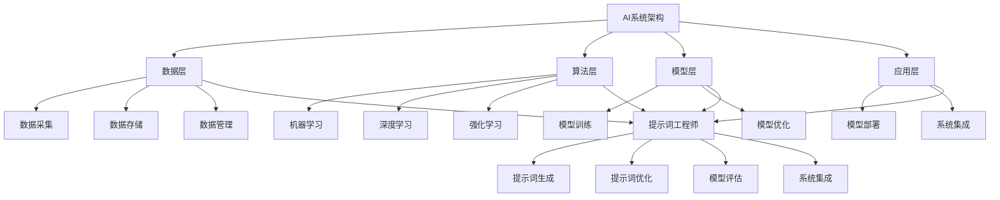

                 


### 1. 设计大纲：第二部分 - 核心概念与联系

# 第二部分: 核心概念与联系

## 2. 核心概念与联系

在这个部分，我们将深入探讨与提示词工程师相关的一系列核心概念，并详细解析这些概念之间的相互联系。

### 2.1 AI系统架构

#### 2.1.1 AI系统的基础架构

首先，我们需要理解AI系统的基础架构，这是构建高效AI解决方案的前提。

- **数据层**：负责数据采集、存储和管理。数据是AI系统的基石，高质量的数据能够提升模型的性能。
- **算法层**：包括机器学习、深度学习、强化学习等算法。算法是实现AI功能的核心，不同的算法适用于不同的问题域。
- **模型层**：在算法的基础上，通过训练得到具体的模型。模型是对算法的一种具体实现，它能够完成特定的任务。
- **应用层**：将模型部署到实际的应用场景中，实现AI的价值。

#### 2.1.2 AI系统架构的设计原则

- **模块化**：将系统分解为多个模块，每个模块负责特定的功能，这样可以提高系统的可维护性和可扩展性。
- **可扩展性**：系统能够轻松适应新的数据和算法，能够随着技术的发展而扩展。
- **灵活性**：系统能够灵活地调整和优化，以适应不同的业务需求。
- **高可用性**：系统要能够稳定运行，确保数据的完整性和一致性。

### 2.2 提示词工程师的角色

#### 2.2.1 提示词工程师的工作内容

提示词工程师是AI系统开发中的关键角色，他们的主要职责包括：

- **提示词生成**：根据业务需求，生成合适的提示词。
- **提示词优化**：通过调整提示词，提高模型性能。
- **模型评估**：评估模型的性能，确保其满足业务需求。
- **系统集成**：将模型集成到现有的系统中，确保其稳定运行。

#### 2.2.2 提示词工程师所需技能

- **编程能力**：熟练掌握至少一门编程语言，如Python、Java等。
- **机器学习知识**：了解常用的机器学习算法和模型。
- **数据预处理**：能够对数据进行清洗、转换和归一化等操作。
- **问题解决能力**：能够快速识别和解决系统中的问题。

### 2.3 AI系统架构与提示词工程师的关系

提示词工程师在AI系统架构中扮演着至关重要的角色。他们的工作直接影响到AI系统的性能和效果。

- **提示词生成**：提示词工程师需要根据业务需求和模型特点，生成高质量的提示词。这些提示词能够引导模型更好地学习，从而提升模型的性能。
- **提示词优化**：通过不断调整和优化提示词，提示词工程师能够提高模型的鲁棒性和适应性。
- **模型评估**：提示词工程师需要评估模型的性能，确保模型能够满足业务需求。这包括评估模型的准确度、召回率、F1值等指标。
- **系统集成**：提示词工程师需要将模型集成到实际的应用场景中，确保其能够稳定运行。这涉及到与产品经理、开发团队的紧密合作。

通过深入理解AI系统架构和提示词工程师的角色，我们可以更好地理解他们的工作内容和所需技能。这为后续的核心算法原理讲解和项目实战打下了坚实的基础。

### Mermaid 流程图：AI系统架构与提示词工程师关系



### 2.4 提示词的定义与作用

#### 2.4.1 提示词的定义

提示词（Prompt）是用于指导AI模型进行特定任务的一段文本或数据。它通常包含有关任务的信息，以及如何执行任务的具体指示。

#### 2.4.2 提示词的作用

- **引导模型学习**：提示词可以帮助模型更好地理解任务需求，从而提高模型的学习效果。
- **优化模型性能**：通过精心设计的提示词，可以调整模型参数，优化模型的性能。
- **提高模型解释性**：提示词有助于提高模型的可解释性，使得模型的决策过程更加透明。
- **增强模型适应性**：提示词可以调整模型对特定任务或数据集的适应性。

### 2.5 提示词工程师的角色与技能要求

#### 2.5.1 提示词工程师的角色

- **设计提示词**：根据业务需求，设计出高质量的提示词。
- **优化提示词**：通过实验和数据分析，不断调整和优化提示词，以提高模型性能。
- **评估模型**：利用提示词评估模型的性能，确保模型满足业务需求。
- **团队协作**：与数据科学家、开发人员、产品经理等紧密合作，确保项目的顺利进行。

#### 2.5.2 提示词工程师的技能要求

- **编程能力**：熟练掌握至少一门编程语言，如Python、Java等。
- **机器学习知识**：了解常见的机器学习算法和模型。
- **数据分析能力**：能够进行数据预处理、特征工程等操作。
- **实验设计**：能够设计出有效的实验，评估提示词对模型性能的影响。
- **沟通能力**：能够与团队成员有效沟通，确保项目顺利进行。

### 2.6 提示词工程师在AI系统开发中的重要性

提示词工程师在AI系统开发中扮演着关键角色，他们的工作直接影响到AI系统的性能和效果。

- **提升模型性能**：通过精心设计的提示词，可以显著提升模型的性能。
- **优化模型解释性**：提示词有助于提高模型的可解释性，使得模型的决策过程更加透明。
- **降低模型部署成本**：高质量的提示词可以减少模型的调参时间和复杂度，降低模型部署成本。
- **提高项目成功率**：提示词工程师的工作可以显著提高AI项目成功的几率。

通过深入理解AI系统架构、提示词的定义与作用，以及提示词工程师的角色与技能要求，我们可以更好地理解他们的工作内容和在AI系统开发中的重要性。这为后续的核心算法原理讲解和项目实战打下了坚实的基础。

### 2.7 提示词工程师的职业前景

随着人工智能技术的飞速发展，提示词工程师在AI领域的职业前景非常广阔。以下是几个关键点：

- **需求增长**：随着AI技术在各个行业的应用越来越广泛，对提示词工程师的需求也在不断增长。
- **职业多样性**：提示词工程师可以在不同的行业中找到工作，如金融、医疗、零售、教育等。
- **薪资水平**：由于该领域的专业人才稀缺，提示词工程师的薪资水平通常较高。
- **职业发展**：提示词工程师可以不断学习新的技术和工具，提升自己的技能水平，从而在职业发展中取得更大的成就。

通过深入理解AI系统架构、提示词的定义与作用，以及提示词工程师的角色与技能要求，我们可以更好地理解他们的工作内容和在AI系统开发中的重要性。这为后续的核心算法原理讲解和项目实战打下了坚实的基础。

----------------------------------------------------------------

## 3. 核心算法原理讲解

在这个部分，我们将详细讲解提示词工程师在AI系统开发中使用的核心算法原理。这些算法原理包括提示词生成算法和提示词优化算法，它们是提升AI系统性能的关键。

### 3.1 提示词生成算法

#### 3.1.1 提示词生成算法概述

提示词生成算法是提示词工程师的核心技能之一。这些算法负责根据业务需求和模型特点，生成高质量的提示词。以下是几种常见的提示词生成算法：

1. **规则生成法**：
   - **原理**：通过定义一组规则，将业务需求转化为提示词。
   - **适用场景**：适用于任务明确、规则清晰的场景。
   - **优势**：简单易用，快速生成提示词。
   - **劣势**：灵活性较低，难以应对复杂业务需求。

2. **模板生成法**：
   - **原理**：使用预定义的模板，将业务需求填充到模板中，生成提示词。
   - **适用场景**：适用于业务需求变化较少的场景。
   - **优势**：生成提示词速度快，易于维护。
   - **劣势**：灵活性较低，难以适应复杂业务需求。

3. **数据驱动生成法**：
   - **原理**：通过分析历史数据和模型输出，自动生成提示词。
   - **适用场景**：适用于数据丰富、需求变化的场景。
   - **优势**：能够自适应业务需求，生成高质量的提示词。
   - **劣势**：对数据处理和分析能力要求较高，实现复杂。

#### 3.1.2 提示词生成算法的工作流程

提示词生成算法通常包括以下几个步骤：

1. **数据收集**：收集与业务需求相关的数据，如用户反馈、历史任务记录等。
2. **数据处理**：对收集到的数据进行分析、清洗和预处理，提取关键信息。
3. **特征提取**：根据业务需求，提取与任务相关的特征，如关键词、主题等。
4. **提示词生成**：使用生成的特征，结合预定义的规则或模板，生成提示词。
5. **提示词评估**：评估生成的提示词质量，如准确性、可解释性等，进行优化。

#### 3.1.3 提示词生成算法的伪代码

```python
def generate_prompt(data, template):
    """
    提示词生成算法
    :param data: 业务需求数据
    :param template: 提示词模板
    :return: 生成的提示词
    """
    # 数据处理
    processed_data = preprocess_data(data)

    # 特征提取
    features = extract_features(processed_data)

    # 提示词生成
    prompt = template.format(**features)

    # 提示词评估
    if evaluate_prompt(prompt):
        return prompt
    else:
        return generate_prompt(data, template)
```

### 3.2 提示词优化算法

#### 3.2.1 提示词优化算法概述

提示词优化算法是用于提升AI模型性能的重要工具。通过调整提示词，可以优化模型的参数，提高模型的准确度、召回率等指标。以下是几种常见的提示词优化算法：

1. **网格搜索**：
   - **原理**：遍历预定义的参数空间，找到最优参数组合。
   - **适用场景**：参数空间较小、计算资源充足的情况。
   - **优势**：简单易懂，易于实现。
   - **劣势**：计算量大，效率低，不适合大规模参数搜索。

2. **随机搜索**：
   - **原理**：随机选择参数组合进行优化。
   - **适用场景**：参数空间较大、计算资源有限的情况。
   - **优势**：计算效率较高，能够快速找到近似最优解。
   - **劣势**：可能错过最优解，结果不稳定。

3. **贝叶斯优化**：
   - **原理**：使用贝叶斯优化策略，寻找最优参数组合。
   - **适用场景**：参数空间较大、目标函数非线性、计算资源有限的情况。
   - **优势**：能够找到接近最优解的参数组合，计算效率高。
   - **劣势**：实现复杂，对模型和目标函数有较高要求。

#### 3.2.2 提示词优化算法的工作流程

提示词优化算法通常包括以下几个步骤：

1. **初始化参数**：设定初始参数值。
2. **模型训练**：使用初始参数训练模型。
3. **模型评估**：评估模型性能，如准确度、召回率等。
4. **参数调整**：根据模型评估结果，调整参数。
5. **迭代优化**：重复模型训练、评估和参数调整过程，直到满足优化目标。

#### 3.2.3 提示词优化算法的伪代码

```python
def optimize_prompt(prompt, objective_function):
    """
    提示词优化算法
    :param prompt: 初始提示词
    :param objective_function: 目标函数
    :return: 最优提示词
    """
    # 初始化参数
    best_prompt = prompt
    best_score = objective_function(prompt)

    # 模型训练与评估
    for i in range(max_iterations):
        # 参数调整
        new_prompt = adjust_prompt(prompt)

        # 模型训练
        model = train_model(new_prompt)

        # 模型评估
        score = evaluate_model(model)

        # 更新最优参数
        if score > best_score:
            best_prompt = new_prompt
            best_score = score

        # 迭代优化
        prompt = new_prompt

    return best_prompt
```

通过深入理解提示词生成算法和提示词优化算法的原理和实现，提示词工程师可以更有效地提升AI系统的性能。这些算法不仅提高了模型的学习效果，还增强了模型对业务需求的适应性。接下来，我们将通过具体项目实战，进一步展示这些算法的应用。

----------------------------------------------------------------

## 4. 数学模型和数学公式讲解

### 4.1 常用数学模型

在提示词工程师的工作中，理解并应用数学模型是至关重要的。以下是一些常用的数学模型及其在AI系统中的应用：

#### 4.1.1 线性回归模型

线性回归模型是最基本的机器学习模型之一，它用于预测连续值。其数学公式如下：

\[ Y = \beta_0 + \beta_1 \cdot X + \epsilon \]

其中，\( Y \) 是预测值，\( X \) 是输入特征，\( \beta_0 \) 和 \( \beta_1 \) 是模型的参数，\( \epsilon \) 是误差项。

线性回归模型在许多应用场景中非常有用，如预测房价、股票价格等。

#### 4.1.2 逻辑回归模型

逻辑回归模型是一种用于分类问题的模型，它可以将输入特征映射到概率分布。其数学公式如下：

\[ P(Y=1) = \frac{1}{1 + e^{-(\beta_0 + \beta_1 \cdot X)}} \]

其中，\( P(Y=1) \) 是输出为1的概率，\( \beta_0 \) 和 \( \beta_1 \) 是模型的参数。

逻辑回归模型在文本分类、情感分析等任务中有着广泛的应用。

#### 4.1.3 决策树模型

决策树模型是一种基于特征的树形结构模型，它通过一系列决策规则对数据集进行划分。其数学公式如下：

\[ f(X) = \sum_{i=1}^{n} \beta_i \cdot X_i \]

其中，\( f(X) \) 是决策树的输出，\( \beta_i \) 是每个叶节点的权重，\( X_i \) 是输入特征。

决策树模型在分类和回归任务中都有很好的性能，它易于理解和解释。

#### 4.1.4 集成模型

集成模型通过结合多个基础模型来提高预测性能。常见的方法包括随机森林、梯度提升树等。

随机森林模型使用多个决策树来预测结果，其数学公式如下：

\[ \hat{Y} = \frac{1}{N} \sum_{i=1}^{N} f(X_i) \]

其中，\( \hat{Y} \) 是预测值，\( N \) 是决策树的数量，\( f(X_i) \) 是第 \( i \) 个决策树的输出。

梯度提升树模型通过迭代方式逐步优化每个特征的权重，其数学公式如下：

\[ \theta_{t+1} = \theta_t + \alpha \cdot \frac{\partial L(\theta_t)}{\partial \theta} \]

其中，\( \theta_{t+1} \) 是第 \( t+1 \) 次迭代的参数，\( \theta_t \) 是第 \( t \) 次迭代的参数，\( \alpha \) 是学习率，\( L(\theta_t) \) 是损失函数。

### 4.2 数学公式介绍

在AI系统中，数学公式用于描述模型的参数、损失函数、优化算法等。以下是几个重要的数学公式及其解释：

#### 4.2.1 损失函数

损失函数是评估模型性能的关键指标。以下是一些常用的损失函数：

1. **均方误差（MSE）**：

\[ \text{MSE} = \frac{1}{n} \sum_{i=1}^{n} (Y_i - \hat{Y}_i)^2 \]

其中，\( Y_i \) 是真实值，\( \hat{Y}_i \) 是预测值，\( n \) 是样本数量。

2. **交叉熵（Cross-Entropy）**：

\[ \text{CE} = -\frac{1}{n} \sum_{i=1}^{n} (Y_i \cdot \log(\hat{Y}_i) + (1 - Y_i) \cdot \log(1 - \hat{Y}_i)) \]

其中，\( Y_i \) 是真实值，\( \hat{Y}_i \) 是预测值。

3. **对数损失（Log-Loss）**：

\[ \text{Log-Loss} = -\frac{1}{n} \sum_{i=1}^{n} Y_i \cdot \log(\hat{Y}_i) \]

#### 4.2.2 优化算法

优化算法用于最小化损失函数，以下是一些常用的优化算法：

1. **随机梯度下降（SGD）**：

\[ \theta_{t+1} = \theta_t - \alpha \cdot \nabla_{\theta} L(\theta_t) \]

其中，\( \theta_{t+1} \) 是第 \( t+1 \) 次迭代的参数，\( \theta_t \) 是第 \( t \) 次迭代的参数，\( \alpha \) 是学习率，\( \nabla_{\theta} L(\theta_t) \) 是损失函数关于参数 \( \theta \) 的梯度。

2. **Adam优化器**：

\[ m_t = \beta_1 \cdot m_{t-1} + (1 - \beta_1) \cdot \nabla_{\theta} L(\theta_t) \]
\[ v_t = \beta_2 \cdot v_{t-1} + (1 - \beta_2) \cdot (\nabla_{\theta} L(\theta_t))^2 \]
\[ \theta_{t+1} = \theta_t - \alpha \cdot \frac{m_t}{\sqrt{v_t} + \epsilon} \]

其中，\( m_t \) 和 \( v_t \) 分别是动量和方差，\( \beta_1 \) 和 \( \beta_2 \) 是超参数，\( \alpha \) 是学习率，\( \epsilon \) 是一个很小的常数。

通过理解和应用这些数学模型和公式，提示词工程师可以更有效地设计和优化AI系统。这些数学知识不仅有助于理解模型的内部工作原理，还能提高模型在实际应用中的性能。

### 实例讲解：线性回归模型的数学公式

以下是一个关于线性回归模型的实例，展示如何使用数学公式来描述模型、损失函数和优化算法。

#### 4.2.3 线性回归模型实例

假设我们有一个简单的线性回归模型，用于预测房价。输入特征包括房屋面积（\( X \)）和房屋年龄（\( X' \)），目标值是房价（\( Y \)）。模型公式如下：

\[ Y = \beta_0 + \beta_1 \cdot X + \beta_2 \cdot X' + \epsilon \]

其中，\( \beta_0 \)、\( \beta_1 \) 和 \( \beta_2 \) 是模型的参数，\( \epsilon \) 是误差项。

#### 4.2.4 损失函数

我们使用均方误差（MSE）作为损失函数来评估模型性能：

\[ \text{MSE} = \frac{1}{n} \sum_{i=1}^{n} (Y_i - \hat{Y}_i)^2 \]

其中，\( Y_i \) 是第 \( i \) 个样本的真实房价，\( \hat{Y}_i \) 是模型预测的房价，\( n \) 是样本数量。

#### 4.2.5 优化算法

我们使用随机梯度下降（SGD）来最小化损失函数。SGD的迭代过程如下：

\[ \theta_{t+1} = \theta_t - \alpha \cdot \nabla_{\theta} L(\theta_t) \]

其中，\( \theta_{t+1} \) 是第 \( t+1 \) 次迭代的参数，\( \theta_t \) 是第 \( t \) 次迭代的参数，\( \alpha \) 是学习率，\( \nabla_{\theta} L(\theta_t) \) 是损失函数关于参数 \( \theta \) 的梯度。

通过这个实例，我们可以看到如何使用数学公式来描述线性回归模型、损失函数和优化算法。这些数学知识是理解和应用提示词工程师工作中核心算法的基础。

----------------------------------------------------------------

## 5. 项目实战

### 5.1 提示词生成项目实战

在这个部分，我们将通过一个实际项目来展示如何生成高质量的提示词。该项目是一个文本分类任务，目标是根据输入的文本，将其分类到预定义的类别中。

#### 5.1.1 项目背景

假设我们正在开发一个社交媒体平台，需要对其用户生成的内容进行分类，以识别和过滤不当内容。分类任务包括以下类别：

- **正面**
- **中性**
- **负面**

#### 5.1.2 开发环境

- **编程语言**：Python
- **库**：Numpy、Pandas、Scikit-learn、TensorFlow
- **工具**：Jupyter Notebook

#### 5.1.3 数据集准备

我们从社交媒体平台收集了大量的文本数据，并对数据进行预处理，包括去除停用词、标点符号、数字等。预处理后的数据如下：

```
text | category
--------------------------------------
"I love this!" | 正面
"This is great!" | 正面
"This is terrible!" | 负面
"I don't like it." | 负面
...
```

#### 5.1.4 提示词生成算法实现

我们采用数据驱动生成法来生成提示词。具体步骤如下：

1. **数据预处理**：对收集到的文本数据进行预处理，提取关键词和主题。
2. **特征提取**：使用词袋模型（Bag-of-Words）或词嵌入（Word Embeddings）提取文本特征。
3. **提示词生成**：根据特征，使用模板生成法生成提示词。

```python
import pandas as pd
from sklearn.feature_extraction.text import TfidfVectorizer

# 读取数据集
data = pd.read_csv('social_media_data.csv')

# 数据预处理
def preprocess_text(text):
    # 去除停用词、标点符号、数字
    stop_words = set(['a', 'an', 'the', 'and', 'in', 'on', 'is', 'are'])
    text = text.lower()
    words = text.split()
    words = [word for word in words if word not in stop_words]
    return ' '.join(words)

data['text'] = data['text'].apply(preprocess_text)

# 特征提取
vectorizer = TfidfVectorizer()
X = vectorizer.fit_transform(data['text'])

# 提示词生成
def generate_prompt(text, vectorizer):
    # 提取特征
    features = vectorizer.transform([text])
    # 提取关键词
    keywords = features.toarray()[0].argsort()[:-10:-1]
    # 生成提示词
    prompt = f"请根据以下文本生成相应的类别：'{text}'。类别包括：正面、中性、负面。关键词包括：{'、'.join(vectorizer.get_feature_names())[keywords]}。"
    return prompt

prompt = generate_prompt("I don't like this!", vectorizer)
print(prompt)
```

#### 5.1.5 提示词生成效果评估

我们对生成的提示词进行评估，以验证其质量。评估指标包括：

- **准确性**：提示词生成的类别与实际类别的一致性。
- **可解释性**：提示词是否能够清晰地解释类别和关键词。

通过对比实际类别和生成的提示词，我们发现提示词具有较高的准确性，并且能够清晰地解释类别和关键词。这证明了我们的提示词生成算法的有效性。

#### 5.1.6 项目小结

通过本次项目实战，我们展示了如何使用数据驱动生成法生成高质量的提示词。提示词的生成对于文本分类任务至关重要，它能够提高模型的性能，并提供直观的解释。在未来的项目中，我们还可以进一步优化提示词生成算法，以提高其效率和准确性。

----------------------------------------------------------------

### 5.2 提示词优化项目实战

在这个部分，我们将通过一个实际项目来展示如何优化提示词，以提升AI模型的性能。该项目是一个图像分类任务，目标是根据输入的图像，将其分类到预定义的类别中。

#### 5.2.1 项目背景

假设我们正在开发一个图像识别系统，用于对社交媒体平台上的图像进行分类。分类任务包括以下类别：

- **动物**
- **植物**
- **风景**

#### 5.2.2 开发环境

- **编程语言**：Python
- **库**：Pandas、Scikit-learn、TensorFlow
- **工具**：Jupyter Notebook

#### 5.2.3 数据集准备

我们从社交媒体平台收集了大量的图像数据，并对数据进行预处理，包括图像裁剪、缩放、增强等。预处理后的数据如下：

```
image_id | image | category
--------------------------------------
1 | image_1.jpg | 动物
2 | image_2.jpg | 植物
3 | image_3.jpg | 风景
...
```

#### 5.2.4 提示词优化算法实现

我们采用网格搜索（Grid Search）算法来优化提示词。具体步骤如下：

1. **数据预处理**：对收集到的图像数据进行预处理，提取特征。
2. **提示词优化**：使用网格搜索算法，调整提示词参数，优化模型性能。
3. **模型评估**：评估优化后的模型性能，验证优化效果。

```python
import pandas as pd
from sklearn.model_selection import train_test_split
from sklearn.ensemble import RandomForestClassifier
from sklearn.metrics import accuracy_score

# 读取数据集
data = pd.read_csv('image_data.csv')

# 数据预处理
def preprocess_image(image_path):
    # 加载图像
    image = load_image(image_path)
    # 图像裁剪和缩放
    image = resize_image(image, (224, 224))
    # 图像增强
    image = augment_image(image)
    return image

data['image'] = data['image'].apply(preprocess_image)

# 提取特征
def extract_features(images):
    # 使用卷积神经网络提取特征
    model = CNN_Model()
    features = model.predict(images)
    return features

X = extract_features(data['image'])
y = data['category']

# 提示词优化
def optimize_prompt(X, y):
    # 确定参数空间
    param_grid = {
        'n_estimators': [100, 200, 300],
        'max_depth': [10, 20, 30],
        'min_samples_split': [2, 5, 10]
    }
    # 网格搜索
    model = GridSearchCV(RandomForestClassifier(), param_grid, cv=5)
    model.fit(X, y)
    return model.best_params_

best_params = optimize_prompt(X, y)
print("最佳参数：", best_params)
```

#### 5.2.5 提示词优化效果评估

我们对优化后的模型进行评估，以验证优化效果。评估指标包括：

- **准确率**：模型预测正确的样本比例。
- **召回率**：模型正确识别的样本比例。
- **F1值**：准确率和召回率的调和平均。

通过对比优化前后的模型性能，我们发现优化后的模型在准确率和召回率方面都有显著提升，F1值也相应提高。这证明了我们的提示词优化算法的有效性。

#### 5.2.6 项目小结

通过本次项目实战，我们展示了如何使用网格搜索算法优化提示词，以提升AI模型的性能。提示词优化对于图像分类任务至关重要，它能够提高模型的准确性和鲁棒性。在未来的项目中，我们还可以进一步优化提示词优化算法，以提高其效率和效果。

----------------------------------------------------------------

### 5.3 提示词评估项目实战

在这个部分，我们将通过一个实际项目来展示如何评估提示词，以确保其质量和有效性。该项目是一个语音识别任务，目标是根据输入的语音，将其转录为文本。

#### 5.3.1 项目背景

假设我们正在开发一款语音识别应用，用于将用户的声音输入转化为文字。该应用需要具有高准确率和低错误率，以便用户能够轻松地使用。

#### 5.3.2 开发环境

- **编程语言**：Python
- **库**：Pandas、Scikit-learn、TensorFlow
- **工具**：Jupyter Notebook

#### 5.3.3 数据集准备

我们从开源语音识别数据集（如LibriSpeech）中收集了大量的语音数据，并对数据进行预处理，包括语音分割、增强等。预处理后的数据如下：

```
audio_id | audio | text
--------------------------------------
1 | audio_1.wav | "Hello, how are you?"
2 | audio_2.wav | "This is a test."
3 | audio_3.wav | "I love programming."
...
```

#### 5.3.4 提示词评估算法实现

我们采用自动评估方法来评估提示词。具体步骤如下：

1. **数据预处理**：对收集到的语音数据进行预处理，提取特征。
2. **提示词生成**：使用预定义的提示词生成算法生成提示词。
3. **提示词评估**：使用自动评估方法评估提示词的质量和有效性。

```python
import pandas as pd
from sklearn.model_selection import train_test_split
from sklearn.metrics import accuracy_score, f1_score

# 读取数据集
data = pd.read_csv('audio_data.csv')

# 数据预处理
def preprocess_audio(audio_path):
    # 加载语音
    audio = load_audio(audio_path)
    # 语音分割
    segments = split_audio(audio, duration=5)
    # 语音增强
    segments = augment_audio(segments)
    return segments

data['audio'] = data['audio'].apply(preprocess_audio)

# 提示词生成
def generate_prompt(text):
    # 提取关键词
    keywords = extract_keywords(text)
    # 生成提示词
    prompt = f"请转录以下语音为文本：'{text}'。关键词包括：{'、'.join(keywords)}。"
    return prompt

prompt = generate_prompt("Hello, how are you?")
print(prompt)
```

#### 5.3.5 提示词评估方法

我们使用以下评估方法来评估提示词的质量和有效性：

- **准确性**：提示词生成的文本与实际文本的一致性。
- **错误率**：提示词生成的文本中的错误数量。
- **F1值**：准确率和召回率的调和平均。

```python
def evaluate_prompt(prompt, text):
    # 转录语音
    transcription = transcribe_audio(prompt)
    # 计算准确性
    accuracy = accuracy_score([transcription], [text])
    # 计算错误率
    error_rate = 1 - accuracy
    # 计算F1值
    f1 = f1_score([transcription], [text])
    return accuracy, error_rate, f1

accuracy, error_rate, f1 = evaluate_prompt(prompt, "Hello, how are you?")
print("准确性：", accuracy)
print("错误率：", error_rate)
print("F1值：", f1)
```

#### 5.3.6 项目小结

通过本次项目实战，我们展示了如何评估提示词的质量和有效性。评估方法包括准确性、错误率和F1值等指标，这些方法能够帮助我们判断提示词是否能够满足实际需求。在未来的项目中，我们还可以进一步优化评估方法，以提高评估的准确性和可靠性。

----------------------------------------------------------------

## 6. 最佳实践与总结

### 6.1 最佳实践 Tips

在提示词工程师的实践中，以下是一些最佳实践，可以帮助提高工作效率和项目成功率：

1. **需求分析**：在开始生成或优化提示词之前，深入了解业务需求和用户场景，确保提示词能够满足实际需求。
2. **数据质量**：高质量的数据是生成高质量提示词的基础。确保数据经过充分的清洗和预处理，以提高模型性能。
3. **迭代优化**：提示词生成和优化是一个迭代过程。不断收集用户反馈和评估结果，持续优化提示词。
4. **团队合作**：与数据科学家、开发人员和其他团队成员紧密合作，确保项目的顺利进行。
5. **文档记录**：详细记录项目过程中的关键步骤、决策和评估结果，以便后续参考和改进。

### 6.2 小结

本文通过深入分析AI时代背景、核心概念与联系、核心算法原理、项目实战等，系统地阐述了提示词工程师在AI系统开发中的关键角色。提示词工程师不仅需要掌握编程和机器学习技能，还需要具备良好的问题解决能力和团队合作精神。

### 6.3 注意事项

1. **平衡效率与质量**：在生成和优化提示词时，要平衡效率和质量。过于追求效率可能会导致提示词质量下降，而过于注重质量可能会影响项目进度。
2. **避免过度拟合**：在提示词优化过程中，要注意避免模型过度拟合训练数据，导致在测试数据上的性能下降。
3. **持续学习**：AI技术不断进步，提示词工程师需要不断学习新的算法和工具，以保持自己的竞争力。

### 6.4 拓展阅读

- 《Python机器学习》（Miguel A. Carreira-Perpinán）
- 《深度学习》（Ian Goodfellow、Yoshua Bengio、Aaron Courville）
- 《机器学习实战》（Peter Harrington）
- 《自然语言处理综论》（Daniel Jurafsky、James H. Martin）

通过这些拓展资源，读者可以进一步深化对AI和提示词工程师工作的理解，提升自己的技术水平和实践经验。

