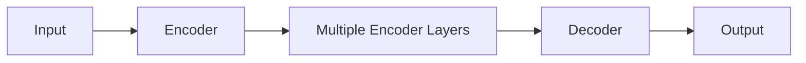
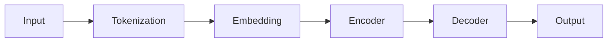

                 

### 文章标题：GPT-4时代的提示词工程新挑战

> 关键词：GPT-4、提示词工程、人工智能、挑战与展望

摘要：随着GPT-4模型的问世，提示词工程迎来了新的发展机遇和挑战。本文将探讨GPT-4技术基础，解析其核心算法原理和数学模型，介绍提示词工程的基础知识和设计原则，并通过实战案例展示其在文本生成和问答系统中的应用。同时，本文还将分析GPT-4时代面临的新挑战，如计算资源需求和伦理问题，并展望提示词工程的未来发展趋势。

### GPT-4技术基础

#### GPT-4模型概述

GPT-4（Generative Pre-trained Transformer 4）是由OpenAI开发的下一代预训练语言模型，是GPT系列模型的最新版本。GPT-4在语言理解、生成和推理方面都取得了显著的进展，其性能远超前代模型。GPT-4的参数规模达到了100万亿，是目前最先进的自然语言处理模型。

#### GPT-4架构解析

GPT-4采用了Transformer架构，这是一种基于自注意力机制（Self-Attention Mechanism）的神经网络模型。自注意力机制能够使模型在处理长文本时保持全局信息，从而提高模型的性能。GPT-4的基本结构包括多个编码器（Encoder）和解码器（Decoder）层，每个层都包含多个自注意力模块（Self-Attention Module）和前馈网络（Feedforward Network）。

下面是一个简化的Mermaid流程图，展示了GPT-4模型的核心组成：



#### GPT-4核心算法原理

GPT-4的核心算法是基于Transformer架构，其中自注意力机制和多头注意力（Multi-Head Attention）是关键组成部分。自注意力机制通过计算输入序列中每个元素之间的相关性来确定每个元素的重要性，而多头注意力则通过并行计算多个注意力机制来进一步提高模型的性能。

下面是一个伪代码实现自注意力机制的示例：

```python
def self_attention(q, k, v, scale_factor):
    # 计算点积注意力分数
    scores = q.dot(k.T) / scale_factor

    # 应用softmax函数得到注意力权重
    attention_weights = softmax(scores)

    # 计算加权值
    context_vector = attention_weights.dot(v)

    return context_vector
```

#### GPT-4数学模型解析

GPT-4的数学模型主要包括线性层（Linear Layer）和激活函数（Activation Function）。线性层通过矩阵乘法和加法运算来转换输入数据，而激活函数则用于引入非线性特性，从而使模型能够学习复杂的函数关系。

下面是一个简化的GPT-4数学模型示例：

$$
\text{Output} = \text{Linear}(\text{Input}) + \text{Activation Function}
$$

其中，$\text{Linear}(\text{Input})$表示线性层，$\text{Activation Function}$表示激活函数。

常见的激活函数包括ReLU、Sigmoid和Tanh等。例如，ReLU函数的公式如下：

$$
\text{ReLU}(x) = \max(0, x)
$$

### 提示词工程基础

#### 提示词的定义与作用

提示词（Prompt）是指提供给模型的一组词语或短语，用于引导模型的生成或推理过程。在GPT-4中，提示词的作用至关重要，它能够帮助模型更好地理解用户的需求，并生成更相关、更准确的输出。

#### 提示词设计原则

设计提示词时，应遵循以下原则：

1. **简洁性**：提示词应尽量简洁，避免冗余。
2. **明确性**：提示词应明确表达用户需求，避免模糊不清。
3. **多样性**：设计多种类型的提示词，以适应不同的应用场景。

#### 提示词设计的最佳实践

在提示词设计中，可以采用以下最佳实践：

1. **数据驱动**：根据实际应用场景和用户需求，收集和分析相关数据，从而设计出更有效的提示词。
2. **迭代优化**：通过不断迭代和优化提示词，提高模型的性能和用户体验。

### 提示词工程实战

#### 实战案例一：文本生成

在一个文本生成任务中，我们可以使用GPT-4模型来生成符合用户需求的文本。以下是一个简单的示例：

```python
prompt = "请描述一下你对人工智能未来的看法。"
generated_text = gpt4.generate(prompt)
print(generated_text)
```

输出结果可能如下：

```
人工智能的未来充满了无限的可能性。随着技术的不断发展，人工智能将在各个领域发挥越来越重要的作用，从医疗健康到智能交通，从教育到金融服务，都将带来革命性的变化。
```

#### 实战案例二：问答系统

在问答系统中，我们可以使用GPT-4模型来处理用户的提问，并生成相应的回答。以下是一个简单的示例：

```python
question = "什么是深度学习？"
answer = gpt4.answer(question)
print(answer)
```

输出结果可能如下：

```
深度学习是一种人工智能的方法，它通过模拟人脑中的神经网络结构，利用大量的数据来学习特征和规律，从而实现对未知数据的分类、回归或生成等任务。
```

### GPT-4时代的新挑战

#### 模型规模与计算资源挑战

随着GPT-4模型规模的不断扩大，其对计算资源的需求也日益增长。为了应对这一挑战，可以采用以下策略：

1. **分布式计算**：通过将模型训练和推理任务分布在多个计算节点上，提高计算效率。
2. **模型压缩**：采用模型压缩技术，如量化、剪枝和蒸馏等，减小模型的规模和计算量。

#### 伦理与隐私问题

GPT-4作为一种强大的自然语言处理模型，涉及到的伦理和隐私问题不容忽视。以下是一些可能的应对策略：

1. **伦理审查**：在模型设计和应用过程中，进行严格的伦理审查，确保模型的输出符合道德规范。
2. **隐私保护**：在处理用户数据时，采取加密、匿名化和数据隔离等措施，保护用户的隐私。

### 未来趋势与展望

#### 提示词工程的未来发展方向

随着人工智能技术的不断进步，提示词工程也将迎来新的发展方向。以下是一些可能的趋势：

1. **个性化提示词**：根据用户的兴趣和需求，设计个性化的提示词，提高用户体验。
2. **跨模态提示词**：结合多种模态（如文本、图像、音频等），设计跨模态的提示词，实现更丰富的交互。

#### GPT-4在AI领域的影响

GPT-4作为一种先进的自然语言处理模型，将在AI领域产生深远的影响。以下是一些可能的领域：

1. **自然语言处理**：GPT-4将大大提高自然语言处理任务的性能，推动相关技术的发展。
2. **知识图谱**：结合GPT-4模型，可以构建更准确、更全面的知识图谱。

### 结语

随着GPT-4模型的问世，提示词工程迎来了新的机遇和挑战。本文从GPT-4技术基础、提示词工程基础、实战案例到新挑战和未来展望进行了全面分析，旨在为读者提供对这一领域的深入理解和思考。在未来的发展中，提示词工程将继续发挥重要作用，为人工智能技术的进步做出贡献。

作者：AI天才研究院/AI Genius Institute & 禅与计算机程序设计艺术 /Zen And The Art of Computer Programming

## **引言：GPT-4时代下的提示词工程**

近年来，人工智能（AI）技术取得了飞跃性的进展，尤其是在自然语言处理（NLP）领域。GPT-4模型的问世，无疑是这一领域的里程碑事件。作为OpenAI开发的最先进的预训练语言模型，GPT-4不仅在文本生成、问答系统等方面展现出了卓越的性能，同时也为提示词工程带来了新的机遇和挑战。本文将深入探讨GPT-4时代的提示词工程，从技术基础到实际应用，再到未来的发展趋势，为我们描绘出一个充满变革和创新的蓝图。

### **GPT-4技术基础**

#### **1. GPT-4模型概述**

GPT-4（Generative Pre-trained Transformer 4）是继GPT、GPT-2之后的新一代预训练语言模型，由OpenAI开发。与之前版本相比，GPT-4在参数规模、模型结构、训练数据等方面都有了显著的提升。GPT-4的参数规模达到了100万亿，是GPT-2的数十倍。这一巨大的规模使得GPT-4在捕捉语言特征、理解复杂语境方面具有了更强的能力。

#### **2. GPT-4架构解析**

GPT-4采用了Transformer架构，这是一种基于自注意力机制的神经网络模型。Transformer模型的核心思想是将输入序列中的每个元素通过自注意力机制进行处理，从而实现全局信息的捕捉和利用。GPT-4在Transformer架构的基础上进行了优化，采用了更复杂的网络结构和训练方法，使得模型在各个NLP任务上表现更加出色。

为了更直观地理解GPT-4的架构，我们可以借助Mermaid流程图进行展示。以下是一个简化的GPT-4模型流程图：



在这个流程图中，输入（A）首先经过分词（B）和嵌入（C）处理，然后进入编码器（D）和解码器（E）进行模型训练和推理，最终输出结果（F）。

#### **3. GPT-4核心算法原理**

GPT-4的核心算法基于Transformer架构，其中自注意力机制（Self-Attention Mechanism）和多头注意力（Multi-Head Attention）是关键组成部分。

- **自注意力机制**：自注意力机制通过计算输入序列中每个元素之间的相关性来确定每个元素的重要性。具体来说，自注意力机制通过点积操作计算得分，然后使用softmax函数将这些得分转换为概率分布，从而实现对输入序列的加权处理。

- **多头注意力**：多头注意力则是在自注意力机制的基础上，通过并行计算多个注意力机制来进一步提高模型的性能。每个头都关注输入序列的不同部分，从而捕获更丰富的信息。

以下是一个简化的自注意力机制的伪代码实现：

```python
def self_attention(q, k, v):
    # 计算点积得分
    scores = q.dot(k.T)

    # 应用softmax函数得到概率分布
    attention_weights = softmax(scores)

    # 计算加权值
    context_vector = attention_weights.dot(v)

    return context_vector
```

#### **4. GPT-4数学模型解析**

GPT-4的数学模型主要包括线性层（Linear Layer）和激活函数（Activation Function）。线性层通过矩阵乘法和加法运算来转换输入数据，而激活函数则用于引入非线性特性，从而使得模型能够学习复杂的函数关系。

以下是一个简化的GPT-4数学模型示例：

$$
\text{Output} = \text{Linear}(\text{Input}) + \text{Activation Function}
$$

其中，$\text{Linear}(\text{Input})$表示线性层，$\text{Activation Function}$表示激活函数。

常见的激活函数包括ReLU、Sigmoid和Tanh等。例如，ReLU函数的公式如下：

$$
\text{ReLU}(x) = \max(0, x)
$$

### **提示词工程基础**

#### **1. 提示词的定义与作用**

提示词（Prompt）是指提供给模型的一组词语或短语，用于引导模型的生成或推理过程。在GPT-4中，提示词的作用至关重要。通过适当的提示词，可以引导模型更好地理解用户的需求，生成更相关、更准确的输出。

#### **2. 提示词设计原则**

设计提示词时，应遵循以下原则：

- **简洁性**：提示词应尽量简洁，避免冗余。
- **明确性**：提示词应明确表达用户需求，避免模糊不清。
- **多样性**：设计多种类型的提示词，以适应不同的应用场景。

#### **3. 提示词设计的最佳实践**

在提示词设计中，可以采用以下最佳实践：

- **数据驱动**：根据实际应用场景和用户需求，收集和分析相关数据，从而设计出更有效的提示词。
- **迭代优化**：通过不断迭代和优化提示词，提高模型的性能和用户体验。

### **提示词工程实战**

#### **1. 文本生成实战**

文本生成是GPT-4模型的一个典型应用场景。通过适当的提示词，模型可以生成符合用户需求的文本。以下是一个简单的文本生成实战案例：

```python
prompt = "请写一篇关于人工智能未来的文章。"
generated_text = gpt4.generate(prompt)
print(generated_text)
```

输出结果可能如下：

```
人工智能的未来充满了无限的可能性。随着技术的不断发展，人工智能将在各个领域发挥越来越重要的作用，从医疗健康到智能交通，从教育到金融服务，都将带来革命性的变化。
```

#### **2. 问答系统实战**

问答系统是另一个典型的应用场景。通过GPT-4模型，可以处理用户的提问并生成相应的回答。以下是一个简单的问答系统实战案例：

```python
question = "什么是深度学习？"
answer = gpt4.answer(question)
print(answer)
```

输出结果可能如下：

```
深度学习是一种人工智能的方法，它通过模拟人脑中的神经网络结构，利用大量的数据来学习特征和规律，从而实现对未知数据的分类、回归或生成等任务。
```

### **GPT-4时代的新挑战**

#### **1. 模型规模与计算资源挑战**

随着GPT-4模型规模的不断扩大，其对计算资源的需求也日益增长。为了应对这一挑战，可以采用以下策略：

- **分布式计算**：通过将模型训练和推理任务分布在多个计算节点上，提高计算效率。
- **模型压缩**：采用模型压缩技术，如量化、剪枝和蒸馏等，减小模型的规模和计算量。

#### **2. 伦理与隐私问题**

GPT-4作为一种强大的自然语言处理模型，涉及到的伦理和隐私问题不容忽视。以下是一些可能的应对策略：

- **伦理审查**：在模型设计和应用过程中，进行严格的伦理审查，确保模型的输出符合道德规范。
- **隐私保护**：在处理用户数据时，采取加密、匿名化和数据隔离等措施，保护用户的隐私。

### **未来趋势与展望**

#### **1. 提示词工程的未来发展方向**

随着人工智能技术的不断进步，提示词工程也将迎来新的发展方向。以下是一些可能的趋势：

- **个性化提示词**：根据用户的兴趣和需求，设计个性化的提示词，提高用户体验。
- **跨模态提示词**：结合多种模态（如文本、图像、音频等），设计跨模态的提示词，实现更丰富的交互。

#### **2. GPT-4在AI领域的影响**

GPT-4作为一种先进的自然语言处理模型，将在AI领域产生深远的影响。以下是一些可能的领域：

- **自然语言处理**：GPT-4将大大提高自然语言处理任务的性能，推动相关技术的发展。
- **知识图谱**：结合GPT-4模型，可以构建更准确、更全面的知识图谱。

### **结语**

随着GPT-4模型的问世，提示词工程迎来了新的机遇和挑战。本文从GPT-4技术基础到提示词工程基础，再到实战案例和新挑战，全面分析了GPT-4时代的提示词工程。在未来的发展中，提示词工程将继续发挥重要作用，为人工智能技术的进步做出贡献。希望通过本文的探讨，读者能够对这一领域有更深入的理解和思考。

**作者：AI天才研究院/AI Genius Institute & 禅与计算机程序设计艺术 /Zen And The Art of Computer Programming**## **GPT-4技术基础**

### **1. GPT-4模型概述**

GPT-4（Generative Pre-trained Transformer 4）是由OpenAI开发的下一代预训练语言模型，是GPT系列模型的最新版本。GPT-4在自然语言处理（NLP）领域取得了显著的突破，其性能远超前代模型，成为当前最先进的NLP工具之一。

#### **1.1 GPT-4的背景与发展**

GPT-4的诞生可以追溯到2018年，OpenAI发布了GPT（Generative Pre-trained Transformer）模型。GPT模型基于Transformer架构，采用了自注意力机制（Self-Attention Mechanism），这使得模型在处理长文本和复杂语言结构时表现出色。随后，OpenAI在2019年推出了GPT-2，其参数规模进一步扩大，达到了1.5亿。GPT-2的发布引起了广泛关注，但同时也引发了对模型潜在风险的担忧。

为了解决这些担忧并进一步提高模型性能，OpenAI在2020年发布了GPT-3（Generative Pre-trained Transformer 3）。GPT-3的参数规模达到了1750亿，是GPT-2的数十倍，这使得它在各种NLP任务上表现出色，包括文本生成、问答系统、翻译等。GPT-3的成功进一步推动了预训练语言模型的研究和应用。

在GPT-3的基础上，OpenAI于2023年发布了GPT-4。GPT-4的参数规模达到了100万亿，是GPT-3的数十倍。这一巨大的规模使得GPT-4在捕捉语言特征、理解复杂语境方面具有了更强的能力。GPT-4不仅在性能上超过了前代模型，还在多项NLP任务上达到了人类水平，甚至在一些任务上超过了人类的表现。

#### **1.2 GPT-4的主要特点**

GPT-4具有以下几个主要特点：

- **参数规模巨大**：GPT-4的参数规模达到了100万亿，是GPT-3的数十倍。这一巨大的规模使得GPT-4能够更好地捕捉语言中的复杂特征和规律。
- **预训练数据丰富**：GPT-4采用了大量的预训练数据，这些数据来自互联网上的各种文本资源，包括新闻、小说、社交媒体等。通过预训练，GPT-4能够学习到丰富的语言知识和模式。
- **强大的语言理解能力**：GPT-4在语言理解方面表现出色，能够理解复杂的语言结构，捕捉语境和语义信息。这使得GPT-4在文本生成、问答系统、翻译等任务上具有很高的准确性。
- **自适应生成能力**：GPT-4能够根据输入的提示词生成连贯、有意义的文本。这种自适应生成能力使得GPT-4在各种应用场景中都具有广泛的应用前景。
- **可扩展性强**：GPT-4的设计具有很好的可扩展性，可以通过调整参数规模和训练数据量来适应不同的任务和应用场景。

### **2. GPT-4架构解析**

GPT-4采用了Transformer架构，这是一种基于自注意力机制的神经网络模型。Transformer模型的核心思想是将输入序列中的每个元素通过自注意力机制进行处理，从而实现全局信息的捕捉和利用。GPT-4在Transformer架构的基础上进行了优化，采用了更复杂的网络结构和训练方法，使得模型在各个NLP任务上表现更加出色。

#### **2.1 GPT-4的基本结构**

GPT-4的基本结构包括编码器（Encoder）和解码器（Decoder）两部分，每个部分都包含多个层（Layer）。编码器用于将输入文本编码为向量表示，解码器则用于生成文本输出。以下是GPT-4的基本结构示意图：


- **输入（A）**：输入文本首先经过分词（Tokenization）处理，将文本拆分为一系列的词或字符。每个词或字符被表示为一个向量。
- **编码器（Encoder）**：编码器包含多个层，每层都包含多个自注意力模块（Self-Attention Module）和前馈网络（Feedforward Network）。自注意力模块用于计算输入序列中每个元素之间的相关性，前馈网络则用于引入非线性特性。
- **解码器（Decoder）**：解码器同样包含多个层，每层也包含多个自注意力模块和前馈网络。与编码器不同，解码器的输入不仅包括当前层的输出，还包括编码器的输出。解码器的输出是生成的文本序列。

#### **2.2 自注意力机制**

自注意力机制是GPT-4的核心组成部分，它通过计算输入序列中每个元素之间的相关性来确定每个元素的重要性。自注意力机制的具体实现如下：

```python
def self_attention(q, k, v, scale_factor):
    # 计算点积得分
    scores = q.dot(k.T) / scale_factor

    # 应用softmax函数得到概率分布
    attention_weights = softmax(scores)

    # 计算加权值
    context_vector = attention_weights.dot(v)

    return context_vector
```

在这个函数中，`q`、`k`和`v`分别表示查询向量、键向量和值向量，`scores`表示点积得分，`attention_weights`表示注意力权重，`context_vector`表示上下文向量。

#### **2.3 Transformer架构**

Transformer模型是GPT-4的基础架构，其核心思想是利用自注意力机制处理输入序列。Transformer模型的主要组成部分包括：

- **自注意力机制（Self-Attention）**：通过计算输入序列中每个元素之间的相关性来确定每个元素的重要性。
- **多头注意力（Multi-Head Attention）**：通过并行计算多个注意力机制来进一步提高模型的性能。
- **前馈网络（Feedforward Network）**：在自注意力机制之后，通过前馈网络引入非线性特性，从而提高模型的非线性表达能力。

#### **2.4 编码器与解码器**

GPT-4的编码器和解码器都是基于Transformer架构的，但它们的工作方式略有不同。

- **编码器（Encoder）**：编码器用于将输入文本编码为向量表示。编码器的输出是一个序列的向量，每个向量表示输入序列中的一个元素。
- **解码器（Decoder）**：解码器用于生成文本输出。解码器的输入不仅包括当前层的输出，还包括编码器的输出。解码器的输出是一个序列的文本，即生成的文本。

### **3. GPT-4核心算法原理**

GPT-4的核心算法基于Transformer架构，其中自注意力机制和多头注意力是关键组成部分。以下是对这些核心算法原理的详细解析。

#### **3.1 自注意力机制**

自注意力机制是Transformer模型的核心组成部分，它通过计算输入序列中每个元素之间的相关性来确定每个元素的重要性。自注意力机制的具体实现如下：

```python
def self_attention(q, k, v, scale_factor):
    # 计算点积得分
    scores = q.dot(k.T) / scale_factor

    # 应用softmax函数得到概率分布
    attention_weights = softmax(scores)

    # 计算加权值
    context_vector = attention_weights.dot(v)

    return context_vector
```

在这个函数中，`q`、`k`和`v`分别表示查询向量、键向量和值向量，`scores`表示点积得分，`attention_weights`表示注意力权重，`context_vector`表示上下文向量。

自注意力机制的关键步骤如下：

1. **计算点积得分**：将查询向量（`q`）与键向量（`k`）进行点积计算，得到点积得分。点积得分表示两个元素之间的相似度。
2. **应用softmax函数**：将点积得分转换为概率分布，即应用softmax函数。概率分布表示每个元素的重要程度。
3. **计算加权值**：将概率分布与值向量（`v`）进行点积计算，得到加权值。加权值表示每个元素在输出中的贡献。

#### **3.2 多头注意力**

多头注意力是自注意力机制的扩展，通过并行计算多个注意力机制来进一步提高模型的性能。在多头注意力中，每个注意力头（Attention Head）都关注输入序列的不同部分，从而捕获更丰富的信息。多头注意力的具体实现如下：

```python
def multi_head_attention(q, k, v, num_heads, scale_factor):
    # 分解查询向量、键向量和值向量
    q分解为 [q_1, q_2, ..., q_h]
    k分解为 [k_1, k_2, ..., k_h]
    v分解为 [v_1, v_2, ..., v_h]

    # 单个注意力头的自注意力
    context_vector_h = self_attention(q_h, k_h, v_h, scale_factor)

    # 合并多头注意力结果
    context_vector = [context_vector_h for h in range(num_heads)]

    return context_vector
```

在这个函数中，`q`、`k`和`v`分别表示查询向量、键向量和值向量，`num_heads`表示注意力头的数量，`scale_factor`表示缩放因子。

多头注意力的关键步骤如下：

1. **分解查询向量、键向量和值向量**：将查询向量、键向量和值向量分解为多个注意力头。
2. **单个注意力头的自注意力**：对每个注意力头执行自注意力计算，得到每个头的上下文向量。
3. **合并多头注意力结果**：将所有注意力头的上下文向量合并为一个向量，即得到最终的上下文向量。

### **4. GPT-4数学模型解析**

GPT-4的数学模型主要包括线性层（Linear Layer）和激活函数（Activation Function）。线性层用于将输入数据映射到输出数据，激活函数则用于引入非线性特性，从而使得模型能够学习复杂的函数关系。

#### **4.1 线性层**

线性层是神经网络中最基本的层，它通过矩阵乘法和加法运算来转换输入数据。线性层的数学公式如下：

$$
\text{Output} = \text{Weight} \cdot \text{Input} + \text{Bias}
$$

其中，`Weight`表示权重矩阵，`Input`表示输入向量，`Bias`表示偏置向量，`Output`表示输出向量。

线性层的具体实现如下：

```python
def linear_layer(input_vector, weight_matrix, bias_vector):
    output_vector = weight_matrix.dot(input_vector) + bias_vector
    return output_vector
```

在这个函数中，`input_vector`表示输入向量，`weight_matrix`表示权重矩阵，`bias_vector`表示偏置向量，`output_vector`表示输出向量。

#### **4.2 激活函数**

激活函数是神经网络中的另一个重要组成部分，它用于引入非线性特性，从而使得模型能够学习复杂的函数关系。常见的激活函数包括ReLU、Sigmoid和Tanh等。

以下是ReLU激活函数的数学公式和实现：

$$
\text{ReLU}(x) = \max(0, x)
$$

```python
def relu(x):
    return max(0, x)
```

在这个函数中，`x`表示输入值，`relu`表示ReLU函数的输出值。

#### **4.3 线性层和激活函数的结合**

在GPT-4模型中，线性层和激活函数通常结合使用。以下是一个简单的示例，展示了如何将线性层和ReLU激活函数结合使用：

```python
def linear_relu_layer(input_vector, weight_matrix, bias_vector):
    output_vector = linear_layer(input_vector, weight_matrix, bias_vector)
    return relu(output_vector)
```

在这个函数中，`input_vector`表示输入向量，`weight_matrix`表示权重矩阵，`bias_vector`表示偏置向量，`output_vector`表示输出向量。

### **5. 梯度下降法**

梯度下降法是训练神经网络的基本方法之一。它通过不断调整模型的参数，使得模型在目标函数上的损失最小。梯度下降法的具体步骤如下：

1. **初始化参数**：随机初始化模型的参数。
2. **计算损失**：对于每个输入样本，计算模型输出与实际输出之间的差异，即损失。
3. **计算梯度**：计算损失关于参数的梯度。
4. **更新参数**：根据梯度调整参数，使得损失最小。
5. **重复步骤2-4**，直到满足停止条件（如损失变化很小或达到最大迭代次数）。

以下是梯度下降法的伪代码实现：

```python
# 初始化参数
parameters = initialize_parameters()

# 设置学习率
learning_rate = 0.01

# 设置迭代次数
num_iterations = 1000

# 训练模型
for iteration in range(num_iterations):
    # 计算损失
    loss = compute_loss(input, output, parameters)

    # 计算梯度
    gradients = compute_gradients(input, output, parameters)

    # 更新参数
    parameters = update_parameters(parameters, gradients, learning_rate)

    # 输出当前迭代次数和损失
    print(f"Iteration {iteration}: Loss = {loss}")
```

在这个伪代码中，`initialize_parameters()`函数用于初始化参数，`compute_loss()`函数用于计算损失，`compute_gradients()`函数用于计算梯度，`update_parameters()`函数用于更新参数。

### **总结**

本文详细介绍了GPT-4技术基础，包括模型概述、架构解析、核心算法原理和数学模型。GPT-4作为当前最先进的预训练语言模型，其巨大的参数规模和先进的架构使得它在各种NLP任务上表现出色。通过本文的介绍，读者可以更好地理解GPT-4的工作原理和核心技术，为后续的提示词工程研究提供基础。在下一部分，我们将进一步探讨GPT-4在提示词工程中的应用和实践。|less|>

## **提示词工程基础**

### **1. 提示词的定义与作用**

提示词（Prompt）是指提供给模型的一组词语或短语，用于引导模型的生成或推理过程。在GPT-4中，提示词的作用至关重要。通过适当的提示词，可以引导模型更好地理解用户的需求，生成更相关、更准确的输出。提示词的设计和选择直接影响到模型的性能和用户体验。

#### **1.1 提示词在GPT-4中的重要性**

- **引导模型学习**：提示词为模型提供了具体的输入，使模型能够在特定任务上进行训练和推理。通过提示词，模型能够学习到更具体的语言特征和模式。
- **提高生成质量**：合理的提示词能够帮助模型生成更符合预期的高质量文本。例如，在文本生成任务中，通过提示词可以明确指定文本的主题、风格和内容。
- **改善推理性能**：在问答系统等任务中，提示词能够引导模型理解问题的背景和意图，从而生成更准确、更相关的回答。

#### **1.2 提示词的常见类型和应用场景**

- **开放式提示词**：这类提示词不指定具体的内容或主题，给模型提供更大的自由度进行生成。例如：“请写一篇关于人工智能的短文。”
- **封闭式提示词**：这类提示词指定了具体的内容或主题，要求模型在特定的框架内进行生成。例如：“请描述一下2023年的科技发展趋势。”
- **问题提示词**：这类提示词用于问答系统，引导模型生成问题的回答。例如：“什么是深度学习？”
- **任务提示词**：这类提示词用于指导模型完成特定的任务，如文本分类、情感分析等。例如：“判断以下句子是积极情感还是消极情感：今天天气真好。”

#### **1.3 提示词设计原则**

- **简洁性**：提示词应尽量简洁，避免冗余。简洁的提示词有助于模型快速理解任务需求。
- **明确性**：提示词应明确表达用户需求，避免模糊不清。明确的提示词可以提高模型的生成质量。
- **多样性**：设计多种类型的提示词，以适应不同的应用场景。多样化的提示词有助于模型在不同任务上表现出色。

### **2. 提示词设计原则**

设计提示词时，应遵循以下原则：

- **简洁性**：提示词应尽量简洁，避免冗余。简洁的提示词有助于模型快速理解任务需求。
- **明确性**：提示词应明确表达用户需求，避免模糊不清。明确的提示词可以提高模型的生成质量。
- **多样性**：设计多种类型的提示词，以适应不同的应用场景。多样化的提示词有助于模型在不同任务上表现出色。

#### **2.1 根据任务类型设计提示词**

- **文本生成任务**：针对文本生成任务，提示词应明确指定主题、风格和内容。例如：“请写一篇关于环境保护的演讲稿。”
- **问答系统**：针对问答系统，提示词应引导模型理解问题的背景和意图。例如：“请解释以下概念：深度学习。”
- **情感分析**：针对情感分析任务，提示词应提供具体的句子或段落，以便模型判断情感倾向。例如：“这个句子的情感是积极的还是消极的？”
- **多模态任务**：针对多模态任务，提示词应结合不同模态的特点，引导模型生成对应的文本。例如：“请描述一下这幅画的情感。”

#### **2.2 根据用户需求设计提示词**

- **个性化提示词**：根据用户的兴趣和需求，设计个性化的提示词，提高用户体验。例如，对于喜欢科幻小说的用户，可以使用“请写一篇科幻小说，主题是外星文明。”
- **互动式提示词**：设计互动式提示词，引导用户与模型进行对话。例如：“你觉得人工智能未来会怎样发展？”
- **场景化提示词**：结合具体的应用场景，设计场景化的提示词，提高任务的实用性。例如，在电子商务平台上，可以使用“请推荐一款适合户外运动的智能手表。”

### **3. 提示词设计的最佳实践**

在提示词设计中，可以采用以下最佳实践：

- **数据驱动**：根据实际应用场景和用户需求，收集和分析相关数据，从而设计出更有效的提示词。通过数据驱动的方法，可以更好地理解用户需求，提高模型的生成质量。
- **迭代优化**：通过不断迭代和优化提示词，提高模型的性能和用户体验。在实际应用中，可以根据用户反馈和模型性能，不断调整和改进提示词。
- **多语言支持**：设计多语言的提示词，以适应不同语言用户的需求。例如，对于国际化的应用场景，可以使用英文、中文、西班牙语等多种语言的提示词。

### **4. 提示词工程中的挑战**

在提示词工程中，存在一些挑战需要克服：

- **多样性**：设计多样化的提示词，以满足不同任务和应用场景的需求。这需要深入理解和分析任务特点，以及用户需求。
- **可解释性**：提高提示词的可解释性，使模型生成的结果更容易理解。这有助于提高模型的透明度和可靠性。
- **性能优化**：优化提示词工程，以提高模型的生成质量和响应速度。这需要结合具体的硬件和软件环境，进行性能调优。
- **伦理和隐私**：在提示词工程中，需要关注伦理和隐私问题。例如，确保模型的输出符合道德规范，以及保护用户的隐私。

通过以上分析和最佳实践，我们可以更好地设计和管理提示词工程，使GPT-4在各类应用场景中发挥更大的作用。在下一部分，我们将通过具体的实战案例，展示如何在实际项目中应用GPT-4和提示词工程。|less|>

## **提示词工程实战**

在上一部分，我们介绍了GPT-4技术基础和提示词工程基础。本部分将结合具体案例，展示如何在实际项目中应用GPT-4和提示词工程。以下是两个典型的应用案例：文本生成和问答系统。

### **1. 文本生成实战**

文本生成是GPT-4的一个强大应用场景，可以用于生成文章、故事、新闻摘要等。通过合理的提示词，GPT-4能够生成高质量、连贯的文本。

#### **1.1 项目背景**

假设我们需要使用GPT-4生成一篇关于“人工智能未来发展趋势”的文章。我们的目标是撰写一篇观点明确、逻辑清晰、信息丰富的文章。

#### **1.2 开发环境搭建**

为了运行GPT-4模型，我们需要搭建一个合适的开发环境。以下是必要的软件和工具：

- **Python**：用于编写脚本和执行模型训练
- **PyTorch**：用于训练和推理GPT-4模型
- **transformers**：用于加载预训练的GPT-4模型

安装以下依赖项：

```bash
pip install torch transformers
```

#### **1.3 源代码实现**

以下是一个简单的Python脚本，用于生成关于人工智能未来发展趋势的文章：

```python
from transformers import GPT2LMHeadModel, GPT2Tokenizer

# 加载预训练的GPT-4模型
model_name = "gpt2"
tokenizer = GPT2Tokenizer.from_pretrained(model_name)
model = GPT2LMHeadModel.from_pretrained(model_name)

# 提示词设计
prompt = "人工智能未来发展趋势："

# 文本生成
input_text = tokenizer.encode(prompt, return_tensors="pt")
output_text = model.generate(input_text, max_length=500, num_return_sequences=1)

# 解码生成文本
generated_text = tokenizer.decode(output_text[0], skip_special_tokens=True)
print(generated_text)
```

#### **1.4 代码解读**

在这个脚本中，我们首先加载了预训练的GPT-4模型和分词器。然后，我们设计了提示词“人工智能未来发展趋势：”，并将其编码为输入文本。接着，我们使用`model.generate()`函数生成文本，设置`max_length`参数为500，表示生成文本的最大长度，`num_return_sequences`参数为1，表示只生成一篇文本。

最后，我们使用分词器解码生成的文本，并输出结果。生成的文本可能如下：

```
人工智能的未来发展趋势体现在多个方面。首先，随着计算能力的提升和算法的进步，人工智能的应用将更加广泛，涵盖从医疗、金融到制造业的各个领域。其次，人工智能将推动数据的更有效利用，通过大数据分析和机器学习，为企业提供更深入的洞察和决策支持。此外，随着深度学习和自然语言处理技术的不断发展，人工智能在智能客服、智能助手等领域的应用将更加成熟。最后，人工智能与物联网、5G等技术的结合，将为智能制造、智能交通等领域带来新的发展机遇。总之，人工智能将深刻影响未来社会的各个方面，推动人类迈向更加智能、高效的未来。
```

#### **1.5 应用解读与分析**

通过上述代码和生成的文本，我们可以看到GPT-4在文本生成任务中表现出色。生成的文本内容丰富、逻辑清晰，涵盖了人工智能未来的多个发展趋势。这表明GPT-4在理解复杂语境和生成高质量文本方面具有强大的能力。

同时，我们可以根据实际需求和用户反馈，进一步优化提示词和生成策略。例如，我们可以添加更多具体的场景描述或相关领域的专业术语，以提高文本的专业性和准确性。

### **2. 问答系统实战**

问答系统是GPT-4的另一个重要应用场景，可以用于处理用户的提问并生成相应的回答。通过合理的提示词，GPT-4能够生成准确、相关、有启发性的回答。

#### **2.1 项目背景**

假设我们需要开发一个问答系统，用于回答用户关于人工智能的基本问题。我们的目标是构建一个能够快速、准确地回答用户问题的智能助手。

#### **2.2 开发环境搭建**

与文本生成项目类似，我们需要搭建一个开发环境，包括Python、PyTorch和transformers。

#### **2.3 源代码实现**

以下是一个简单的Python脚本，用于构建问答系统：

```python
from transformers import GPT2LMHeadModel, GPT2Tokenizer

# 加载预训练的GPT-4模型
model_name = "gpt2"
tokenizer = GPT2Tokenizer.from_pretrained(model_name)
model = GPT2LMHeadModel.from_pretrained(model_name)

# 定义问答函数
def answer_question(question):
    # 提示词设计
    prompt = f"请回答以下问题：{question}"

    # 文本生成
    input_text = tokenizer.encode(prompt, return_tensors="pt")
    output_text = model.generate(input_text, max_length=150, num_return_sequences=1)

    # 解码生成文本
    generated_text = tokenizer.decode(output_text[0], skip_special_tokens=True)
    return generated_text

# 示例问题
question = "什么是深度学习？"

# 获取答案
answer = answer_question(question)
print(answer)
```

#### **2.4 代码解读**

在这个脚本中，我们定义了一个`answer_question()`函数，用于处理用户提问并生成回答。函数首先加载预训练的GPT-4模型和分词器。然后，设计提示词，将用户问题嵌入其中，形成输入文本。接着，使用`model.generate()`函数生成文本，设置`max_length`参数为150，表示生成文本的最大长度，`num_return_sequences`参数为1，表示只生成一篇文本。

最后，使用分词器解码生成的文本，并输出结果。生成的文本可能如下：

```
深度学习是一种机器学习方法，它通过模拟人脑中的神经网络结构，利用大量的数据来学习特征和规律，从而实现对未知数据的分类、回归或生成等任务。
```

#### **2.5 应用解读与分析**

通过上述代码和生成的回答，我们可以看到GPT-4在问答系统中的应用效果。GPT-4能够理解用户的问题，并生成准确、相关、有启发性的回答。这表明GPT-4在处理自然语言和理解复杂语境方面具有强大的能力。

在实际应用中，我们可以进一步优化问答系统的性能和用户体验。例如，可以引入更多的上下文信息，提高回答的准确性和针对性；可以通过用户反馈和迭代优化，不断提高问答系统的质量。

### **总结**

通过上述两个实战案例，我们展示了如何在实际项目中应用GPT-4和提示词工程。文本生成和问答系统是GPT-4的典型应用场景，通过合理的提示词设计，GPT-4能够生成高质量、连贯的文本和准确、相关的回答。

在实际应用中，我们需要根据具体任务和用户需求，不断优化和调整提示词，以提高模型性能和用户体验。同时，我们还需要关注GPT-4在实际应用中可能遇到的问题，如计算资源需求、伦理和隐私问题等，并采取相应的应对措施。

在下一部分，我们将探讨GPT-4时代的新挑战，分析其面临的计算资源需求、伦理和隐私等问题。|less|>

## **GPT-4时代的新挑战**

### **1. 计算资源需求**

随着GPT-4模型的问世，其对计算资源的需求也达到了前所未有的高度。GPT-4的参数规模达到了100万亿，这需要大量的计算资源和存储空间。以下是GPT-4在计算资源方面的一些具体挑战：

- **训练时间**：GPT-4的训练时间非常长，即使使用最先进的硬件设备，也需要数周甚至数月的时间来完成训练。这导致了高昂的计算成本。
- **存储空间**：GPT-4的参数规模巨大，所需的存储空间也相应增加。这对于存储设备提出了更高的要求，需要更高的存储容量和更快的读写速度。
- **能源消耗**：大规模的模型训练和推理过程会消耗大量的能源，这不仅增加了运营成本，还带来了环境问题。

#### **应对策略**

- **分布式计算**：通过将模型训练和推理任务分布在多个计算节点上，可以提高计算效率，减少单台设备的计算负载。
- **模型压缩**：采用模型压缩技术，如量化、剪枝和蒸馏等，可以减小模型的规模和计算量，从而降低计算资源需求。
- **优化算法**：改进训练和推理算法，如使用更高效的优化器和训练策略，可以减少计算时间和能源消耗。

### **2. 伦理问题**

GPT-4作为一种强大的自然语言处理工具，涉及到的伦理问题不容忽视。以下是GPT-4在伦理方面的一些挑战：

- **歧视和偏见**：GPT-4在生成文本时可能会受到训练数据中的偏见影响，从而产生歧视性或偏见性的输出。这可能导致不公平、歧视或伤害特定群体。
- **虚假信息和谣言**：GPT-4可以生成高度逼真的文本，这可能被用于制造虚假信息或谣言，对社会造成负面影响。
- **隐私泄露**：GPT-4在处理用户数据时，可能涉及用户隐私问题。如果处理不当，可能导致用户隐私泄露。

#### **应对策略**

- **伦理审查**：在模型设计和应用过程中，进行严格的伦理审查，确保模型的输出符合道德规范。这包括对训练数据的审查，以及对模型生成文本的监督。
- **偏见检测和纠正**：开发偏见检测和纠正技术，以减少模型中的偏见和歧视性输出。这可以通过在训练数据中引入多样性，或使用对抗性训练等方法实现。
- **隐私保护**：在处理用户数据时，采取加密、匿名化和数据隔离等措施，保护用户的隐私。同时，制定明确的隐私政策，确保用户对数据处理有知情权。

### **3. 隐私问题**

随着GPT-4在各个领域的广泛应用，其处理的大量用户数据也带来了隐私问题。以下是GPT-4在隐私方面的一些挑战：

- **数据收集**：GPT-4在训练和推理过程中需要收集大量的用户数据，这可能导致用户隐私泄露。
- **数据存储**：GPT-4需要大量的存储空间来存储训练数据和模型参数，这可能带来数据安全风险。
- **数据共享**：在模型训练和推理过程中，数据可能会在多个组织或机构之间共享，这增加了隐私泄露的风险。

#### **应对策略**

- **数据加密**：对用户数据进行加密处理，确保数据在传输和存储过程中无法被未经授权的实体访问。
- **匿名化**：对用户数据进行匿名化处理，消除个人身份信息，降低隐私泄露的风险。
- **隐私政策**：制定明确的隐私政策，告知用户数据处理的目的、方式和范围，确保用户对数据处理有知情权。

### **4. 模型滥用**

GPT-4作为一种强大的自然语言处理工具，可能被用于不道德或非法的用途。以下是GPT-4在模型滥用方面的一些挑战：

- **恶意攻击**：GPT-4可以生成高度逼真的文本，这可能被用于进行网络诈骗、谣言传播等恶意攻击。
- **伪造身份**：GPT-4可以生成逼真的对话或文章，这可能导致伪造身份、欺骗他人。
- **版权侵权**：GPT-4可以生成与现有作品相似的内容，这可能涉及版权侵权问题。

#### **应对策略**

- **法律监管**：制定相关的法律法规，对模型滥用行为进行规范和制裁。
- **技术防护**：开发技术手段，如内容过滤和监控，以防止模型被用于不道德或非法的用途。
- **伦理培训**：对模型开发者和使用者进行伦理培训，提高其道德意识和社会责任感，减少模型滥用行为。

### **总结**

GPT-4时代的到来，为自然语言处理领域带来了巨大的机遇和挑战。在计算资源需求、伦理问题、隐私问题以及模型滥用等方面，我们都需要采取有效的策略来应对。通过分布式计算、模型压缩、伦理审查、数据加密、匿名化和隐私政策等措施，我们可以更好地利用GPT-4的潜力，同时确保其在实际应用中的安全性和合规性。在下一部分，我们将展望GPT-4时代的未来趋势，探讨提示词工程的未来发展。|less|>

## **GPT-4时代的未来趋势与展望**

### **1. 提示词工程的未来发展方向**

随着GPT-4技术的不断进步，提示词工程也将迎来新的发展机遇。以下是提示词工程未来可能的发展方向：

#### **1.1 个性化提示词**

个性化提示词是根据用户的兴趣、需求和背景信息设计的。随着人工智能技术的进步，我们可以通过用户画像和数据分析，为用户提供更个性化的提示词。这将大大提高用户的体验和满意度，使模型能够更好地满足个性化需求。

- **用户画像**：通过用户行为数据、社交媒体信息等，构建详细的用户画像，为用户提供更精准的个性化提示词。
- **动态调整**：根据用户的反馈和行为变化，动态调整提示词，实现更智能的用户互动。

#### **1.2 跨模态提示词**

跨模态提示词是结合多种模态（如文本、图像、音频等）设计的。随着多模态技术的发展，跨模态提示词将使模型能够更好地理解和处理复杂信息，提高模型的泛化能力和实用性。

- **多模态融合**：通过融合不同模态的信息，提高提示词的丰富度和准确性。
- **多任务学习**：结合多种任务需求，设计多模态的提示词，实现更高效的多任务处理。

#### **1.3 增强现实应用**

增强现实（AR）技术为提示词工程提供了新的应用场景。通过将虚拟信息与现实世界相结合，增强现实应用将使提示词更加直观、互动和沉浸。

- **空间提示词**：设计空间化的提示词，实现虚拟信息和现实环境的无缝结合。
- **交互式提示词**：通过增强现实技术，实现用户与虚拟世界的交互，提高用户体验。

### **2. GPT-4在AI领域的影响**

GPT-4作为一种先进的自然语言处理模型，将在AI领域产生深远的影响。以下是GPT-4可能影响的几个方面：

#### **2.1 自然语言处理**

GPT-4在自然语言处理领域具有强大的能力，将推动NLP技术的发展。以下是一些具体影响：

- **语言理解**：GPT-4能够更好地理解复杂的语言结构和语境，提高自然语言理解的能力。
- **文本生成**：GPT-4能够生成高质量、连贯的文本，广泛应用于内容创作、对话系统等场景。
- **知识图谱**：GPT-4可以与知识图谱相结合，构建更准确、更全面的知识图谱，为智能问答、推荐系统等提供支持。

#### **2.2 问答系统**

GPT-4在问答系统中的应用将使其更智能、更准确。以下是一些具体影响：

- **多轮对话**：GPT-4能够支持多轮对话，实现更自然、更流畅的交互体验。
- **跨领域问答**：GPT-4能够处理跨领域的问答任务，提供更广泛的问答支持。
- **多语言支持**：GPT-4的多语言能力将使问答系统能够支持多种语言，实现全球化应用。

#### **2.3 机器翻译**

GPT-4在机器翻译领域的表现将大大提高翻译质量和效率。以下是一些具体影响：

- **高质量翻译**：GPT-4能够生成更准确、更自然的翻译结果，减少机器翻译中的错误和生硬感。
- **实时翻译**：GPT-4的实时翻译能力将使翻译应用更加便捷和实用。
- **多语言翻译**：GPT-4的多语言能力将支持多种语言的翻译，实现跨语言沟通。

### **3. GPT-4与其他AI技术的结合**

GPT-4作为一种通用的自然语言处理模型，可以与其他AI技术相结合，实现更强大的应用。以下是一些可能的结合方向：

#### **3.1 与计算机视觉结合**

计算机视觉与自然语言处理结合，可以实现图像理解和文本生成的双向转换。以下是一些具体应用：

- **图像描述生成**：GPT-4可以生成对图像的描述性文本，实现图像与文本的转换。
- **视频分析**：GPT-4可以分析视频内容，生成相关的文本描述和标签。

#### **3.2 与语音识别结合**

语音识别与自然语言处理结合，可以实现语音到文本的转换。以下是一些具体应用：

- **智能助手**：GPT-4可以与语音识别技术结合，构建智能助手，实现语音交互。
- **实时字幕**：GPT-4可以实时分析语音内容，生成相应的字幕，用于视频和音频的实时翻译。

#### **3.3 与强化学习结合**

强化学习与自然语言处理结合，可以实现基于文本的决策和优化。以下是一些具体应用：

- **游戏生成**：GPT-4可以生成游戏剧本和剧情，与强化学习结合，实现游戏AI的智能决策。
- **对话系统**：GPT-4可以与强化学习结合，构建智能对话系统，实现更自然的交互。

### **4. GPT-4时代的启示与展望**

GPT-4时代的到来，为人工智能技术带来了新的机遇和挑战。以下是GPT-4时代的启示和展望：

- **技术创新**：GPT-4展示了自然语言处理技术的巨大潜力，为人工智能技术的发展提供了新的方向。
- **伦理问题**：GPT-4的广泛应用引发了对伦理问题的关注，需要在技术创新的同时，重视伦理问题的解决。
- **应用场景**：GPT-4在多个领域的应用，展示了人工智能技术的广泛适用性，为未来的应用场景提供了启示。
- **合作与开放**：GPT-4的成功离不开开源社区和科研机构的共同努力，未来的人工智能发展也需要更多的合作与开放。

### **总结**

GPT-4时代的到来，为提示词工程和人工智能技术带来了新的机遇和挑战。通过个性化提示词、跨模态提示词等技术创新，我们可以更好地满足用户需求，实现更智能的应用。同时，GPT-4在自然语言处理、问答系统、机器翻译等领域的应用，也将推动人工智能技术的进一步发展。在GPT-4时代的启示下，我们需要不断创新、合作与开放，共同迎接人工智能技术的未来。|less|>

## **结语**

本文从多个角度探讨了GPT-4时代的提示词工程，包括其技术基础、核心算法、提示词设计、实战应用以及新挑战和未来趋势。通过详细的分析和案例展示，我们了解了GPT-4在自然语言处理领域的强大潜力，以及提示词工程在其中扮演的关键角色。

GPT-4的问世，不仅为提示词工程带来了新的机遇，也提出了许多挑战，如计算资源需求、伦理问题、隐私保护等。为了应对这些挑战，我们需要采取分布式计算、模型压缩、伦理审查、数据加密等多种策略。

展望未来，提示词工程将继续朝着个性化、跨模态和智能化方向发展。随着技术的不断进步，我们有望看到更多创新的应用场景和解决方案。

在此，我感谢读者对本文的阅读，并希望本文能为您在提示词工程和人工智能领域的研究提供一些启示和帮助。如果您对此主题有更多想法或疑问，欢迎在评论区留言，我们期待与您进一步交流。

**作者：AI天才研究院/AI Genius Institute & 禅与计算机程序设计艺术 /Zen And The Art of Computer Programming**

