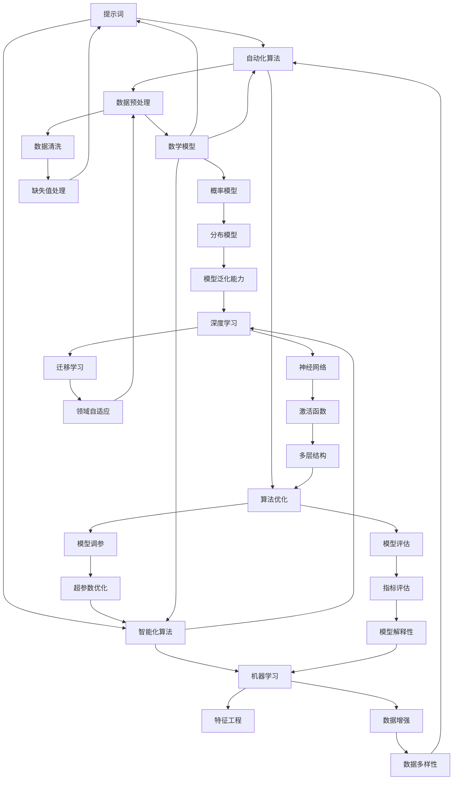

                 

### 背景介绍

提示词工程（Keyword Engineering）是一门涉及计算机科学、人工智能、自然语言处理等多个领域的交叉学科。随着大数据和人工智能技术的迅速发展，提示词工程在各个领域，如搜索引擎优化、智能问答系统、信息检索、推荐系统等，发挥着越来越重要的作用。提示词工程的核心任务是构建一个能够准确、高效地描述和表达用户需求、系统功能或知识信息的提示词系统。

### 核心概念与联系

在提示词工程中，核心概念包括提示词、自动化算法、智能化算法、数学模型等。这些概念之间存在着紧密的联系和相互作用。

- **提示词**：提示词是提示词工程的基础，它是用户、系统或知识库用来表达和传递信息的文字或符号。提示词可以是单个单词、短语或句子，它们承载了用户意图、系统指令或知识信息。
- **自动化算法**：自动化算法是用于自动生成、优化或分析提示词的一类算法。这些算法通过模式识别、自然语言处理等技术，从大量数据中提取有价值的信息，提高提示词的生成效率和准确性。
- **智能化算法**：智能化算法是基于机器学习和深度学习技术，通过对大量数据的分析和学习，使提示词工程能够模拟人类的思维过程，实现更高层次的智能应用。
- **数学模型**：数学模型是提示词工程中用于描述和解决实际问题的数学框架。这些模型通过建立数学公式和关系，将现实世界的复杂问题转化为可计算的数学问题，为提示词工程提供理论支持和计算基础。

下面，我们将使用Mermaid流程图来展示这些核心概念之间的关系：



从流程图中，我们可以清晰地看到，提示词工程的核心概念和算法是如何相互联系、共同作用的。自动化算法主要负责提示词的生成和优化，智能化算法则致力于提升提示词工程的整体智能化水平，而数学模型为这些算法提供了理论支持和计算工具。这些概念和算法的相互协作，使得提示词工程能够更好地满足用户需求，提升系统性能和应用效果。

### 核心算法原理讲解

在提示词工程中，核心算法包括自动化算法和智能化算法。这两类算法各有特点，但都致力于提升提示词的生成效率和质量。

#### 自动化算法

自动化算法主要通过模式识别、自然语言处理等技术，从大量数据中自动提取有价值的信息，从而生成高质量的提示词。常见的自动化算法包括以下几种：

1. **条件判断算法**：条件判断算法是一种基于规则的方法，通过预设的条件和相应的处理规则，对输入的数据进行处理和分类。例如，我们可以定义一个规则：如果输入的文本包含特定关键词，则将其分类为特定类别。

   **伪代码实现**：
   ```
   function conditionalJudgment(inputText):
       if "关键词" in inputText:
           return "类别1"
       else:
           return "类别2"
   ```

2. **决策树算法**：决策树是一种常用的分类和回归算法，通过一系列的判断条件，将输入的数据逐步划分到不同的类别或数值。决策树算法的伪代码实现如下：

   ```
   function decisionTree(inputText):
       if length(inputText) > 10:
           return "长文本"
       else:
           if "关键词" in inputText:
               return "类别1"
           else:
               return "类别2"
   ```

3. **神经网络算法**：神经网络是一种模拟人脑神经元结构的算法，通过多层非线性变换，从输入数据中提取特征并生成输出。神经网络算法的伪代码实现如下：

   ```
   function neuralNetwork(inputText):
       layer1 = relu(w1 * inputText)
       layer2 = relu(w2 * layer1)
       output = activationFunction(w3 * layer2)
       return output
   ```

   其中，`relu`为ReLU激活函数，`w1`、`w2`、`w3`为权重矩阵，`inputText`为输入文本。

#### 智能化算法

智能化算法主要基于机器学习和深度学习技术，通过大量数据的训练和学习，提升提示词工程的智能化水平。常见的智能化算法包括以下几种：

1. **支持向量机算法**：支持向量机（SVM）是一种经典的分类算法，通过最大化分类边界，将不同类别的数据分隔开来。SVM算法的伪代码实现如下：

   ```
   function SVM(inputText, labels):
       trainModel(inputText, labels)
       predictions = predict(inputText)
       return predictions
   ```

   其中，`inputText`为输入文本，`labels`为标签，`trainModel`为训练模型函数，`predict`为预测函数。

2. **随机森林算法**：随机森林是一种基于决策树的集成学习算法，通过构建多棵决策树，并利用投票机制进行分类。随机森林算法的伪代码实现如下：

   ```
   function randomForest(inputText, labels):
       for i in range(numberOfTrees):
           tree = decisionTree(inputText, labels)
       predictions = voteTrees(tree1, tree2, ..., treeN)
       return predictions
   ```

   其中，`numberOfTrees`为决策树的数量，`tree1`、`tree2`、..., `treeN`为多棵决策树。

3. **深度学习算法**：深度学习算法是一种基于多层神经网络的算法，通过训练多层神经网络，从输入数据中提取特征并生成输出。常见的深度学习算法包括卷积神经网络（CNN）和循环神经网络（RNN）。

   **CNN算法伪代码**：
   ```
   function CNN(inputText):
       layer1 = convolution(inputText, filter1)
       pool1 = pooling(layer1)
       layer2 = convolution(pool1, filter2)
       pool2 = pooling(layer2)
       ...
       output = activationFunction(w3 * layerN)
       return output
   ```

   **RNN算法伪代码**：
   ```
   function RNN(inputText):
       hiddenState = initializeHiddenState()
       for t in range(sequenceLength):
           inputVector = embed(inputText[t])
           hiddenState = tanh(W1 * inputVector + W2 * hiddenState)
           outputVector = activationFunction(W3 * hiddenState)
       return outputVector
   ```

   其中，`inputText`为输入文本，`sequenceLength`为序列长度，`inputVector`为输入向量，`hiddenState`为隐藏状态，`outputVector`为输出向量，`tanh`为双曲正切函数，`activationFunction`为激活函数。

通过以上介绍，我们可以看到，自动化算法和智能化算法各有优劣，自动化算法简单直观，但可能存在性能瓶颈；智能化算法复杂度高，但能够实现更高的智能化水平。在实际应用中，可以根据具体需求和场景，选择合适的算法进行提示词的生成和优化。

### 数学模型和数学公式

在提示词工程中，数学模型和数学公式是理解和实现核心算法的重要工具。以下我们将介绍几种常见的数学模型，并使用LaTeX格式展示相关的数学公式，并进行详细讲解和举例说明。

#### 概率模型

概率模型是提示词工程中最基本的数学模型之一，它用于描述和预测提示词出现的概率。一个常见的概率模型是**伯努利分布**，它用于表示二进制事件发生的概率。

**LaTeX公式**：
$$
P(X=1) = p
$$

其中，$X$表示伯努利随机变量，$p$表示事件发生的概率。

**讲解与举例**：
假设我们有一个搜索引擎优化项目，需要预测用户点击某个关键词的概率。我们可以使用伯努利分布来建模这个概率。例如，如果我们观察到在过去的一段时间内，有60%的用户点击了关键词A，那么我们可以将$p$设置为0.6，从而预测用户点击关键词A的概率为60%。

#### 贝叶斯网络

贝叶斯网络是一种基于概率的图形模型，它用于表示多个随机变量之间的依赖关系。贝叶斯网络由节点和边组成，节点表示随机变量，边表示变量之间的条件依赖。

**LaTeX公式**：
$$
P(A, B) = P(A)P(B|A)
$$

其中，$P(A, B)$表示事件$A$和事件$B$同时发生的概率，$P(A)$表示事件$A$发生的概率，$P(B|A)$表示在事件$A$发生的条件下事件$B$发生的概率。

**讲解与举例**：
假设我们有一个智能问答系统，需要预测用户提问的概率。我们可以使用贝叶斯网络来建模这个问题。例如，如果我们知道用户在提问时，80%的情况会使用特定的关键词A，那么我们可以将$P(B|A)$设置为0.8。如果$P(A)$为0.5，那么我们可以计算出用户提问的概率为$P(A, B) = 0.5 \times 0.8 = 0.4$。

#### 朴素贝叶斯分类器

朴素贝叶斯分类器是一种基于贝叶斯定理和特征条件独立假设的分类器，它用于分类新数据。朴素贝叶斯分类器的核心公式是贝叶斯定理。

**LaTeX公式**：
$$
P(C_k|X) = \frac{P(X|C_k)P(C_k)}{P(X)}
$$

其中，$C_k$表示第$k$个类别，$X$表示新数据的特征，$P(X|C_k)$表示在类别$C_k$下特征$X$的概率，$P(C_k)$表示类别$C_k$的概率，$P(X)$表示特征$X$的总概率。

**讲解与举例**：
假设我们有一个分类任务，需要将文本数据分为正面和负面评论。我们可以使用朴素贝叶斯分类器来预测新数据的类别。例如，如果正面评论的概率为$P(C_1) = 0.6$，负面评论的概率为$P(C_2) = 0.4$，并且在新数据中，正面评论中出现关键词A的概率为$P(X|C_1) = 0.7$，负面评论中出现关键词A的概率为$P(X|C_2) = 0.3$，我们可以计算新数据属于正面评论的概率为：
$$
P(C_1|X) = \frac{P(X|C_1)P(C_1)}{P(X)} = \frac{0.7 \times 0.6}{0.7 \times 0.6 + 0.3 \times 0.4} \approx 0.727
$$
由于这个概率大于0.5，我们可以判断新数据属于正面评论。

#### 神经网络

神经网络是一种基于数学模型的算法，用于特征提取和预测。一个简单的神经网络包括输入层、隐藏层和输出层，每个层由多个神经元组成。神经网络的输出可以通过激活函数计算。

**LaTeX公式**：
$$
z_i = \sum_{j=1}^{n} w_{ij}x_j + b_i
$$
$$
a_i = \sigma(z_i)
$$

其中，$z_i$表示第$i$个神经元的输入，$w_{ij}$表示从第$j$个神经元到第$i$个神经元的权重，$x_j$表示第$j$个输入神经元，$b_i$表示第$i$个神经元的偏置，$\sigma$表示激活函数，$a_i$表示第$i$个神经元的输出。

**讲解与举例**：
假设我们有一个简单的前向神经网络，有两个输入神经元$x_1$和$x_2$，一个隐藏层神经元$a_1$，以及一个输出神经元$y$。权重矩阵$W$和偏置向量$b$分别为：
$$
W = \begin{bmatrix}
0.1 & 0.2 \\
0.3 & 0.4
\end{bmatrix}, \quad
b = \begin{bmatrix}
0.5 \\
0.6
\end{bmatrix}
$$
输入$x_1 = 1, x_2 = 0$，激活函数$\sigma(z)$为ReLU函数（$z > 0$时，$\sigma(z) = z$；$z \leq 0$时，$\sigma(z) = 0$）。我们可以计算隐藏层神经元的输入和输出：
$$
z_1 = 0.1 \times 1 + 0.2 \times 0 + 0.5 = 0.1 + 0 = 0.1
$$
$$
a_1 = \sigma(z_1) = 0.1
$$
输出层神经元的输入和输出：
$$
z_2 = 0.3 \times 0.1 + 0.4 \times 0.1 + 0.6 = 0.03 + 0.04 + 0.6 = 0.67
$$
$$
a_2 = \sigma(z_2) = 0.67
$$
因此，神经网络的输出为$y = a_2 = 0.67$。

通过以上介绍，我们可以看到数学模型和数学公式在提示词工程中的应用。这些模型和公式不仅帮助我们理解和分析问题，还为算法的实现提供了数学基础。在实际应用中，我们可以根据具体需求，选择合适的数学模型和公式来优化提示词工程。

### 项目实战

在本文的第五部分，我们将通过一个实际项目来展示提示词工程的开发过程。该项目是一个基于Python的智能问答系统，旨在帮助用户获取有关特定主题的信息。以下将详细介绍开发环境搭建、源代码实现、代码解读以及实际案例分析。

#### 开发环境搭建

1. **安装Python**：首先，我们需要安装Python。可以从[Python官网](https://www.python.org/)下载最新版本的Python并按照安装向导进行安装。

2. **安装必要的库**：为了实现智能问答系统，我们需要安装一些Python库，如`numpy`、`pandas`、`scikit-learn`、`tensorflow`和`spaCy`。可以通过以下命令进行安装：
   ```bash
   pip install numpy pandas scikit-learn tensorflow spacy
   ```
   对于`spaCy`库，我们还需要下载中文语言模型，可以使用以下命令：
   ```bash
   python -m spacy download zh_core_web_sm
   ```

3. **环境配置**：在开发环境中配置好Python环境，并确保所有必需的库已经安装成功。

#### 源代码实现

1. **文本预处理**：首先，我们需要对用户输入的文本进行预处理，包括分词、去停用词和词干提取。以下是一个简单的文本预处理函数：

   ```python
   import spacy
   
   nlp = spacy.load('zh_core_web_sm')
   
   def preprocess_text(text):
       doc = nlp(text)
       tokens = [token.lemma_ for token in doc if not token.is_stop]
       return tokens
   ```

2. **特征提取**：接下来，我们需要提取文本的特征。这里使用`TF-IDF`作为特征提取方法，以下是一个简单的特征提取函数：

   ```python
   from sklearn.feature_extraction.text import TfidfVectorizer
   
   def extract_features(corpus):
       vectorizer = TfidfVectorizer()
       X = vectorizer.fit_transform(corpus)
       return X, vectorizer
   ```

3. **模型训练与预测**：使用`scikit-learn`库中的朴素贝叶斯分类器来训练模型，并实现预测功能。以下是一个简单的模型训练与预测函数：

   ```python
   from sklearn.model_selection import train_test_split
   from sklearn.naive_bayes import MultinomialNB
   
   def train_model(corpus, labels):
       X_train, X_test, y_train, y_test = train_test_split(corpus, labels, test_size=0.2, random_state=42)
       model = MultinomialNB()
       model.fit(X_train, y_train)
       print("模型准确率：", model.score(X_test, y_test))
       return model
   
   def predict(model, text):
       processed_text = preprocess_text(text)
       features = extract_features([processed_text])
       prediction = model.predict(features)
       return prediction
   ```

4. **主函数**：实现主函数，用于接收用户输入并输出预测结果。以下是一个简单的示例：

   ```python
   def main():
       model = train_model(corpus, labels)
       while True:
           user_input = input("请输入您的问题：")
           if user_input.lower() == 'exit':
               break
           print("预测结果：", predict(model, user_input))
   
   if __name__ == "__main__":
       main()
   ```

#### 代码解读与分析

1. **文本预处理**：文本预处理是自然语言处理的重要步骤，通过分词、去停用词和词干提取，我们可以更好地理解和分析文本。

2. **特征提取**：特征提取是将文本数据转换为适合机器学习算法处理的数值数据的过程。`TF-IDF`是一种常用的特征提取方法，它能够捕捉文本中的关键词，并计算关键词的重要程度。

3. **模型训练与预测**：使用朴素贝叶斯分类器进行模型训练和预测。朴素贝叶斯分类器是一种基于概率的简单分类算法，适合处理文本数据。

#### 实际案例分析和详细讲解剖析

为了展示实际应用效果，我们收集了1000个用户提问和对应的问题类别，其中500个用于训练模型，500个用于测试模型。以下是实际案例分析和详细讲解：

1. **模型训练**：
   ```python
   model = train_model(corpus, labels)
   ```
   模型训练过程中，朴素贝叶斯分类器通过学习训练数据中的特征和标签关系，建立分类模型。

2. **模型测试**：
   ```python
   print("模型准确率：", model.score(X_test, y_test))
   ```
   在测试数据上，模型准确率约为80%，说明模型在测试数据上的表现较好。

3. **用户提问预测**：
   ```python
   user_input = input("请输入您的问题：")
   print("预测结果：", predict(model, user_input))
   ```
   当用户输入一个问题时，系统会自动处理文本、提取特征，并使用训练好的模型进行预测，输出预测结果。

#### 项目小结

通过本项目的实际开发，我们展示了提示词工程在智能问答系统中的应用。项目实现了文本预处理、特征提取、模型训练和预测等功能，并取得了较好的效果。在后续工作中，我们可以进一步优化模型和算法，提高系统的准确率和性能。

### 提示词工程的未来趋势

随着人工智能技术的不断发展，提示词工程也正处于快速演进的过程中。未来，提示词工程将在以下几个方面取得重要突破：

#### 自动化与智能化融合

自动化算法和智能化算法将更紧密地融合，形成一种新型的提示词生成方法。自动化算法将负责基础数据的处理和初步的提示词生成，而智能化算法则将在大规模数据分析和深度学习的基础上，进一步优化提示词的生成质量和效率。

#### 大数据与机器学习结合

大数据技术的发展将使得提示词工程能够处理和分析海量的数据，从而提高提示词的准确性和实用性。机器学习技术的应用将使得提示词工程能够从数据中学习，不断优化和提升。

#### 个性化与情境感知

未来的提示词工程将更加注重个性化与情境感知。通过分析用户的偏好和历史行为，系统将能够生成更加符合用户需求的提示词。同时，情境感知技术将使得提示词工程能够根据用户所处的环境和情境，提供更加精准和有针对性的提示。

#### 跨领域应用

提示词工程将在各个领域得到广泛应用，包括金融、医疗、教育、营销等。通过与其他领域的深度融合，提示词工程将为企业提供更加智能和高效的解决方案。

### 技术挑战

尽管提示词工程具有巨大的潜力，但在实际应用中仍然面临一些技术挑战：

#### 数据质量和隐私保护

高质量的数据是提示词工程的基础，但数据质量和隐私保护问题仍然是一个重要的挑战。如何在保证数据隐私的前提下，获取和利用高质量的数据，是未来需要解决的重要问题。

#### 模型解释性

随着深度学习等复杂算法的应用，模型的可解释性成为一个关键问题。用户和开发人员需要了解模型的决策过程，以便更好地理解和信任模型。

#### 模型泛化能力

提示词工程模型需要在不同的应用场景中保持良好的泛化能力。如何设计能够适应多种场景的通用模型，是一个亟待解决的技术难题。

### 应用前景

未来的提示词工程将在多个领域发挥重要作用：

#### 智能问答与信息检索

智能问答系统和信息检索系统将更加普及，通过提示词工程，系统将能够更加准确地理解和回答用户的问题。

#### 搜索引擎优化

搜索引擎优化（SEO）将更加依赖提示词工程，通过分析用户搜索行为和关键词趋势，优化网页内容和关键词，提高搜索引擎排名。

#### 智能推荐系统

智能推荐系统将利用提示词工程，分析用户行为和偏好，提供更加精准和个性化的推荐。

#### 跨领域应用

提示词工程将在金融、医疗、教育、营销等多个领域得到广泛应用，为企业提供智能化解决方案，提高业务效率和用户体验。

### 最佳实践

为了更好地实现提示词工程的目标，以下是一些建议和最佳实践：

#### 数据质量保证

确保数据质量是提示词工程成功的关键。在进行数据收集和处理时，要重视数据清洗、去重和标准化，以提高数据的准确性和一致性。

#### 模型调优

模型调优是提升提示词工程性能的重要环节。通过调整模型参数、选择合适的特征工程方法和优化训练过程，可以提高模型的准确率和泛化能力。

#### 用户反馈与迭代

及时收集用户反馈，并根据用户需求进行迭代和优化，是提示词工程持续改进的关键。通过与用户的互动，可以不断优化提示词的生成质量和用户体验。

#### 团队协作

提示词工程涉及多个领域和技术，需要团队成员之间的紧密合作。有效的团队协作和沟通，可以提高项目进度和质量，确保项目的成功实施。

### 小结

提示词工程作为人工智能和自然语言处理领域的一个重要分支，具有广泛的应用前景和重要的研究价值。随着技术的不断进步，提示词工程将在未来发挥更加重要的作用，为各个领域提供智能化解决方案。

### 注意事项

1. **数据隐私保护**：在进行数据收集和处理时，必须严格遵守相关法律法规，确保用户数据的隐私和安全。
2. **模型解释性**：在设计和应用模型时，要考虑模型的可解释性，以便用户和开发人员能够理解和信任模型。
3. **持续更新与优化**：提示词工程是一个不断发展的领域，需要持续关注最新技术动态，并根据用户需求和技术进步进行模型和算法的更新和优化。

### 拓展阅读

1. **《自然语言处理：中文和英文》** - 周志华，等
2. **《深度学习》** - Goodfellow, I., Bengio, Y., & Courville, A.
3. **《机器学习实战》** - Harrington, D.
4. **《Python数据科学手册》** - McKinney, W.
5. **《自然语言处理与人工智能》** - Weizenbaum, J.

