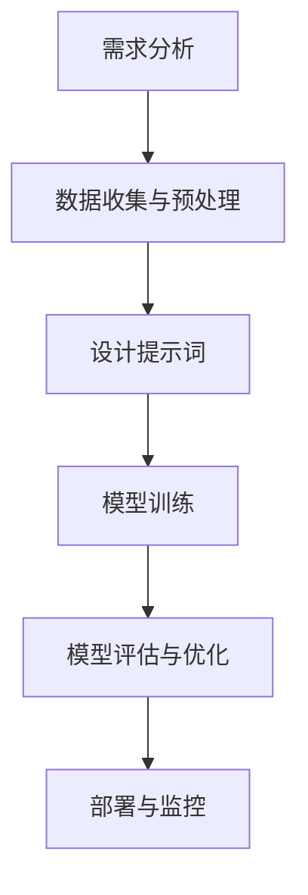

                 

## 文章标题

### 提示词工程的隐私保护：安全使用AI的策略

## 关键词

- 提示词工程
- 隐私保护
- AI安全使用
- 加密算法
- 差分隐私
- 同态加密

## 摘要

本文旨在探讨提示词工程中隐私保护的重要性及其与AI安全使用的策略。随着AI技术的不断发展，隐私保护已成为不可忽视的关键问题。本文首先介绍了提示词工程的基本概念，然后详细阐述了隐私保护的技术和算法，包括数据匿名化技术、加密算法、同态加密和差分隐私。接着，文章提出了AI安全使用策略，涵盖了安全性需求分析、安全性设计原则和安全性评估与测试。通过实际应用案例，本文展示了隐私保护和AI安全使用的具体实践。最后，文章对未来的发展趋势进行了展望，并提出了相关最佳实践和小结。通过本文的阅读，读者将更好地理解隐私保护和AI安全使用的重要性，并能够掌握相关的技术和策略。

## 引言

### 书籍背景与重要性

随着人工智能（AI）技术的飞速发展，提示词工程（prompt engineering）作为一种重要的技术手段，已经在各个领域得到了广泛应用。提示词工程是指通过设计合适的提示词，引导AI模型进行有效的学习和推理，从而实现特定的任务。然而，随着数据隐私问题的日益突出，如何确保提示词工程的隐私保护成为一个亟待解决的关键问题。

在AI时代，数据隐私的重要性不言而喻。大量敏感数据被用于训练AI模型，这些数据往往涉及到个人的隐私信息，如姓名、地址、电话号码等。如果这些数据在传输和存储过程中没有得到妥善保护，可能会导致数据泄露、滥用和不当使用，给个人和社会带来严重后果。因此，隐私保护成为AI技术发展中不可忽视的重要环节。

本书旨在探讨提示词工程的隐私保护及其与AI安全使用的策略。通过系统地介绍隐私保护技术和算法，以及AI安全使用策略，本书旨在为读者提供一套全面、实用的隐私保护和AI安全使用指南。这不仅有助于保护用户隐私，提高AI系统的可信度，也为AI技术的可持续发展提供了有力支持。

### 阅读对象与预期收获

本书主要面向以下读者群体：

1. **AI研究人员和开发者**：本书将详细介绍隐私保护技术和算法，帮助AI研究人员和开发者更好地理解和应用这些技术，保护用户隐私，提高AI系统的安全性。
2. **数据科学家和数据分析师**：本书将阐述隐私保护在数据分析和挖掘中的重要性，帮助数据科学家和数据分析师在处理和分析数据时遵循隐私保护原则，避免隐私泄露。
3. **企业决策者和IT经理**：本书将提供具体的AI安全使用策略和实际应用案例，帮助企业决策者和IT经理更好地应对AI隐私保护挑战，确保企业数据的安全和合规。

通过阅读本书，读者可以期望获得以下收获：

1. **深入了解隐私保护技术和算法**：读者将系统地了解数据匿名化技术、加密算法、同态加密和差分隐私等隐私保护技术，掌握其在提示词工程中的应用。
2. **掌握AI安全使用策略**：读者将了解安全性需求分析、安全性设计原则和安全性评估与测试的方法，能够为AI系统的设计和部署提供有效的安全保障。
3. **具备实际应用能力**：通过实际应用案例的讲解，读者将能够将隐私保护和AI安全使用策略应用于实际项目中，提高AI系统的安全性和隐私保护能力。

总之，本书旨在为读者提供全面、系统的隐私保护和AI安全使用指南，帮助其在AI时代更好地应对隐私保护挑战，推动AI技术的健康发展。

### 结构安排与内容概述

本书结构分为七个主要章节，每章节内容如下：

### 第1章 引言

本章将介绍本书的背景、目的和重要性，明确本书的研究范畴和预期目标。通过引出隐私保护在AI领域的关键地位，为后续章节的深入探讨奠定基础。

### 第2章 提示词工程基本概念

本章将详细阐述提示词工程的基本概念，包括其定义、应用领域和基本流程。通过介绍提示词工程的核心要素，帮助读者建立对这一领域的基本理解。

### 第3章 隐私保护技术与算法

本章将深入探讨隐私保护技术和算法，包括数据匿名化技术、加密算法、同态加密和差分隐私。通过这些技术，读者将了解如何在实际应用中保护数据隐私。

### 第4章 AI安全使用策略

本章将提出AI安全使用策略，涵盖安全性需求分析、安全性设计原则和安全性评估与测试。通过这些策略，读者将掌握如何确保AI系统的安全性和隐私保护。

### 第5章 实际应用案例

本章将通过实际应用案例，展示隐私保护和AI安全使用的具体实践。通过案例分析，读者将能够更好地理解这些策略在现实中的应用效果。

### 第6章 未来展望与趋势

本章将对隐私保护和AI安全使用的未来发展趋势进行展望，分析当前研究的挑战和未来研究方向。通过这一章，读者将能够了解这一领域的最新动态和未来趋势。

### 第7章 结论

本章将对本书的主要内容和结论进行总结，重申隐私保护和AI安全使用的重要性，并提出进一步研究的方向和建议。

通过以上章节的安排，本书旨在为读者提供一套全面、系统的隐私保护和AI安全使用指南，帮助其在AI时代应对隐私保护挑战，推动AI技术的可持续发展。

## 提示词工程基本概念

提示词工程（Prompt Engineering）是指通过设计合适的提示词，引导AI模型进行有效的学习和推理，从而实现特定任务的过程。提示词在AI模型中的作用类似于人类与机器之间的桥梁，能够帮助模型更好地理解和处理输入信息，从而提高模型的性能和应用效果。

### 定义

提示词工程可以简单定义为：**设计用于引导AI模型学习的提示词，以便模型能够更好地理解和处理特定任务的过程**。提示词可以是自然语言文本、代码片段、图形化元素等，其核心目的是通过提供明确、有效的信息引导，帮助AI模型实现预期的任务目标。

### 应用领域

提示词工程在多个领域有着广泛的应用，以下是几个典型的应用领域：

1. **自然语言处理（NLP）**：在NLP任务中，提示词可以用于指导模型生成文本、翻译、问答系统等。例如，在机器翻译任务中，提示词可以帮助模型更好地理解源语言和目标语言的语义差异。

2. **计算机视觉**：在计算机视觉任务中，提示词可以用于指导模型识别图像中的特定对象、特征或场景。例如，在图像分类任务中，提示词可以帮助模型更好地理解不同类别的特征差异。

3. **推荐系统**：在推荐系统任务中，提示词可以用于指导模型生成个性化推荐结果。例如，在电商平台上，提示词可以帮助模型根据用户的历史购买记录和偏好推荐商品。

4. **语音识别**：在语音识别任务中，提示词可以用于指导模型更好地处理不同的语音输入，提高识别的准确性。

### 基本流程

提示词工程的基本流程通常包括以下几个步骤：

1. **需求分析**：在开始设计提示词之前，首先需要明确任务的目标和需求。这包括确定模型要解决的具体问题、所需的输入信息和期望的输出结果。

2. **数据收集和预处理**：根据需求分析的结果，收集相关的数据和素材。然后对数据进行预处理，包括数据清洗、格式转换、特征提取等。

3. **设计提示词**：根据预处理后的数据和任务需求，设计合适的提示词。提示词的设计需要充分考虑模型的类型、任务的复杂性以及数据的特性。

4. **模型训练**：使用设计好的提示词对AI模型进行训练。训练过程中，通过调整提示词的参数和结构，优化模型的性能。

5. **模型评估与优化**：在模型训练完成后，对模型进行评估，确定其性能是否满足需求。如果性能不足，需要返回前面的步骤进行调整和优化。

6. **部署与监控**：将训练好的模型部署到实际应用场景中，并进行持续的监控和评估，确保模型在实际应用中的稳定性和有效性。

通过以上基本流程，提示词工程能够有效地提高AI模型的性能和应用效果，实现特定任务的目标。

### 关键概念之间的关系架构

为了更好地理解提示词工程的基本概念及其相互关系，我们可以使用Mermaid流程图来展示：



在上述流程图中，每个节点代表一个关键步骤，箭头表示步骤之间的逻辑关系。需求分析作为整个流程的起点，决定了后续步骤的方向和目标。数据收集与预处理为提示词设计提供数据基础，设计提示词直接影响模型训练的效果，模型训练的成果通过评估与优化不断反馈，最终实现模型的部署和持续监控。

通过理解这些关键概念及其相互关系，我们可以更有效地进行提示词工程的设计和实施，提高AI系统的性能和应用效果。

### 核心算法原理讲解

在提示词工程中，核心算法的选择和实现直接影响AI模型的性能和应用效果。本文将介绍几种关键算法的原理，包括数据匿名化技术、加密算法、同态加密和差分隐私。

#### 数据匿名化技术

数据匿名化技术是一种通过改造原始数据，使其无法直接识别特定个体身份的方法。数据匿名化技术主要包括以下几种：

1. **数据摘要**：数据摘要通过对原始数据进行聚合和简化，生成一个或多个摘要值。这种方法可以有效地减少数据中的冗余信息，但无法完全避免信息泄露。
   
2. **数据加密**：数据加密通过将原始数据转换为密文，保护数据的隐私。加密算法包括对称加密和非对称加密，如AES和RSA。对称加密速度较快，但密钥管理复杂；非对称加密安全性高，但计算复杂度较大。

3. **数据混淆**：数据混淆通过将原始数据与噪声数据混合，使其难以识别原始数据。常见的混淆方法包括加噪声、变换和模糊化等。

数据匿名化技术的实现通常涉及以下步骤：

- **数据预处理**：对原始数据进行清洗、格式转换和特征提取，以便后续处理。
- **数据摘要**：使用统计方法或机器学习模型对数据进行聚合和简化。
- **加密**：选择合适的加密算法对数据密文进行加密处理。
- **混淆**：将加密后的数据进行混淆处理，增加其不可读性。

伪代码如下：

```python
def anonymize_data(data):
    # 数据预处理
    preprocessed_data = preprocess(data)
    
    # 数据摘要
    summary = aggregate(preprocessed_data)
    
    # 加密
    encrypted_data = encrypt(summary)
    
    # 混淆
    anonymized_data = confuse(encrypted_data)
    
    return anonymized_data
```

#### 加密算法

加密算法是一种将明文数据转换为密文的方法，以保护数据的隐私和安全。以下是两种常见的加密算法：

1. **对称加密**：对称加密算法使用相同的密钥对数据进行加密和解密，如AES。对称加密速度快，但密钥管理复杂。

2. **非对称加密**：非对称加密算法使用一对密钥（公钥和私钥）进行加密和解密，如RSA。非对称加密安全性高，但计算复杂度较大。

对称加密的伪代码如下：

```python
def symmetric_encrypt(data, key):
    # 使用AES算法加密
    encrypted_data = AES_encrypt(data, key)
    return encrypted_data

def symmetric_decrypt(encrypted_data, key):
    # 使用AES算法解密
    decrypted_data = AES_decrypt(encrypted_data, key)
    return decrypted_data
```

非对称加密的伪代码如下：

```python
def asymmetric_encrypt(data, public_key):
    # 使用RSA算法加密
    encrypted_data = RSA_encrypt(data, public_key)
    return encrypted_data

def asymmetric_decrypt(encrypted_data, private_key):
    # 使用RSA算法解密
    decrypted_data = RSA_decrypt(encrypted_data, private_key)
    return decrypted_data
```

#### 同态加密

同态加密是一种在加密状态下进行数据处理的技术，允许对密文数据进行计算，而不需要解密。同态加密在隐私保护和安全计算领域具有重要应用，尤其适用于云计算和分布式计算。

同态加密的主要算法包括：

1. **基于乘法的同态加密**：基于乘法的同态加密算法可以通过同态乘法操作对密文数据进行处理，但同态加法操作较复杂。
2. **基于模运算的同态加密**：基于模运算的同态加密算法通过模运算实现同态加法和同态乘法操作。

同态加密的伪代码如下：

```python
def homomorphic_multiply(plaintext1, plaintext2):
    # 使用同态乘法加密
    encrypted_result = homomorphic_multiply_encrypt(plaintext1, plaintext2)
    return encrypted_result

def homomorphic_add(plaintext1, plaintext2):
    # 使用同态加法加密
    encrypted_result = homomorphic_add_encrypt(plaintext1, plaintext2)
    return encrypted_result

def homomorphic_decrypt(encrypted_result):
    # 使用同态解密
    decrypted_result = homomorphic_decrypt_encrypt(encrypted_result)
    return decrypted_result
```

#### 差分隐私

差分隐私是一种通过引入随机噪声来保护隐私的技术，其核心思想是确保对同一查询结果的隐私保护强度一致，从而防止通过分析数据集中的微小差异来推断个体数据。差分隐私的主要机制包括：

1. **拉普拉斯机制**：拉普拉斯机制通过在输出结果中添加拉普拉斯分布的噪声，实现对个体数据的保护。
2. **指数机制**：指数机制通过在输出结果中添加指数分布的噪声，实现对个体数据的保护。

差分隐私的伪代码如下：

```python
def laplace Mechanism(value, sensitivity, epsilon):
    # 使用拉普拉斯机制添加噪声
    noise = random.laplace(0, sensitivity/epsilon)
    result = value + noise
    return result

def exponential Mechanism(value, sensitivity, epsilon):
    # 使用指数机制添加噪声
    noise = random.exponential(sensitivity/epsilon)
    result = value + noise
    return result
```

通过理解这些核心算法的原理和实现方法，我们可以更好地保护数据隐私，确保AI系统的安全性。这些算法在提示词工程中具有重要的应用价值，有助于实现隐私保护和数据安全。

### 数学模型与公式

在隐私保护领域，数学模型和公式起着至关重要的作用，它们不仅帮助我们量化隐私保护的效果，还能指导具体的实现方法。以下将介绍几个关键的数学模型和公式，并详细讲解其应用和计算过程。

#### 差分隐私模型

差分隐私（Differential Privacy，DP）是一种通过引入噪声来保护隐私的数学模型，其核心目标是确保对同一查询结果的隐私保护强度一致。差分隐私的数学模型可以表示为：

$$\epsilon(\mathcal{D}) = \Pr[f(\mathcal{D}) = r] - \Pr[f(\mathcal{D} \oplus \Delta) = r]$$

其中：
- \( \mathcal{D} \)：原始数据集
- \( \mathcal{D} \oplus \Delta \)：数据集 \(\mathcal{D}\) 中添加或删除一个记录后的数据集
- \( f \)：查询函数或隐私机制
- \( r \)：查询结果的输出值
- \( \epsilon \)：隐私参数，表示隐私强度

计算差分隐私的具体步骤如下：

1. **选择隐私机制**：根据应用场景选择合适的隐私机制，如拉普拉斯机制或指数机制。
2. **确定灵敏度**：计算查询函数 \( f \) 的灵敏度 \( \Delta_f \)，即数据集中任意两个相邻数据集之间的差异对查询结果的影响。
3. **添加噪声**：使用选择的隐私机制和灵敏度参数，向查询结果添加噪声。

以拉普拉斯机制为例，其计算公式为：

$$\epsilon(\mathcal{D}) = \Pr[f(\mathcal{D}) = r] - \Pr[f(\mathcal{D} \oplus \Delta) = r] = \frac{1}{\sqrt{2\pi\epsilon}}e^{-\frac{\Delta_f^2}{2\epsilon}}$$

#### 加密模型

加密模型用于保护数据在传输和存储过程中的隐私。常见的加密模型包括对称加密和非对称加密。以下是对称加密和非对称加密的数学模型和计算过程：

1. **对称加密模型**

对称加密模型使用相同的密钥进行加密和解密。以高级加密标准（AES）为例，其加密过程可以表示为：

$$C = E_K(P)$$

其中：
- \( C \)：密文
- \( K \)：密钥
- \( P \)：明文

解密过程为：

$$P = D_K(C)$$

2. **非对称加密模型**

非对称加密模型使用一对密钥（公钥和私钥）进行加密和解密。以RSA加密算法为例，其加密过程可以表示为：

$$C = E_{KA}(M) = M^A \mod N$$

其中：
- \( M \)：明文
- \( N \)：模数
- \( A \)：公钥
- \( C \)：密文

解密过程为：

$$M = D_{KB}(C) = C^B \mod N$$

其中：
- \( B \)：私钥

#### 同态加密模型

同态加密模型允许在加密状态下对数据进行计算，其数学模型为：

$$C_1 = E_{KA}(M_1) = M_1^A \mod N$$

$$C_2 = E_{KB}(M_2) = M_2^B \mod N$$

同态加密的加法和乘法操作可以表示为：

$$C_3 = E_{KA}(M_1 + M_2) = (M_1 + M_2)^A \mod N$$

$$C_4 = E_{KA}(M_1 \cdot M_2) = (M_1 \cdot M_2)^A \mod N$$

通过这些数学模型和公式，我们可以实现数据的加密、解密和同态加密，从而有效保护数据隐私。在实际应用中，根据具体场景选择合适的模型和算法，能够更好地满足隐私保护的需求。

### 实际应用案例

为了更好地理解隐私保护和AI安全使用策略在实际项目中的具体应用，本文将介绍两个典型案例：一个涉及电商平台用户数据保护的隐私保护案例，另一个涉及金融机构客户信息保护的AI安全使用案例。

#### 案例一：某电商平台用户数据保护

**背景**：
某大型电商平台在处理用户数据时，需要确保用户隐私得到充分保护。平台存储了大量的用户个人信息，如姓名、地址、电话号码和购买记录等。为了防止数据泄露，平台需要采取有效的隐私保护措施。

**解决方案**：
1. **数据匿名化**：平台采用数据匿名化技术对用户数据进行预处理。通过数据摘要和加密算法，将用户个人信息转换为不可识别的摘要值，从而保护用户隐私。

2. **差分隐私**：在数据分析过程中，平台引入差分隐私机制，确保分析结果的隐私保护强度一致。通过拉普拉斯机制，向分析结果添加随机噪声，防止通过数据差异推断个体信息。

3. **同态加密**：平台使用同态加密技术，在加密状态下对用户数据进行计算和分析。这样，即使在数据传输和存储过程中，也无法直接获取用户隐私信息。

**效果**：
通过上述措施，平台有效地保护了用户隐私，防止了数据泄露和滥用。同时，数据分析结果的准确性和可靠性也得到了保障。

#### 案例二：某金融机构客户信息保护

**背景**：
某金融机构需要确保客户信息的安全，以防止信息泄露和欺诈行为。金融机构存储了大量客户敏感信息，如身份证号码、银行账户信息和个人信用记录等。

**解决方案**：
1. **安全性需求分析**：金融机构进行了详细的安全性需求分析，确定需要保护的关键信息和潜在的威胁。基于分析结果，制定了具体的安全策略。

2. **安全性设计原则**：金融机构采用了以下安全性设计原则：
   - **隔离原则**：通过网络安全隔离和权限控制，确保不同用户和系统之间的数据隔离。
   - **透明原则**：确保系统操作透明，便于审计和监控。
   - **可恢复原则**：设计故障恢复机制，确保系统在遭受攻击或故障时能够迅速恢复。

3. **安全性评估与测试**：金融机构定期进行安全性评估和测试，包括漏洞扫描、渗透测试和安全培训等。通过评估和测试，发现并修复系统漏洞，提高整体安全性。

**效果**：
通过实施安全性需求分析、设计原则和评估测试，金融机构有效地提高了客户信息的安全性。客户对金融机构的信任度得到提升，业务运营也更加稳定和安全。

#### 案例总结

通过以上两个实际应用案例，我们可以看到隐私保护和AI安全使用策略在现实项目中的具体应用。这些策略不仅保护了用户和客户的隐私，还提高了系统的整体安全性。在未来，随着AI技术的不断发展和应用场景的扩展，隐私保护和AI安全使用策略将变得更加重要，需要持续优化和更新。

### 未来展望与趋势

在AI和大数据时代，隐私保护和AI安全使用已成为关键问题，其未来发展具有以下趋势和挑战：

#### 提示词工程发展趋势

1. **自动化与智能化**：提示词工程将更加自动化和智能化，通过机器学习和自然语言处理技术，自动生成高效的提示词，提高AI模型的性能和应用效果。
2. **多模态融合**：随着多模态数据的广泛应用，提示词工程将结合文本、图像、音频等多种数据类型，实现更全面、精准的提示词设计。
3. **个性化定制**：根据用户需求和应用场景，提示词工程将实现个性化定制，提供更符合特定任务的提示词组合，提高模型的应用效果。

#### AI隐私保护技术发展

1. **联邦学习**：联邦学习通过分布式计算，在保留数据隐私的前提下实现模型训练。未来，联邦学习将融合更多隐私保护技术，提高模型的安全性和隐私保护效果。
2. **区块链技术**：区块链技术具有去中心化和不可篡改的特点，可以用于保护数据隐私和确保交易安全。未来，区块链技术与AI的结合将推动隐私保护技术的发展。
3. **新型加密算法**：随着计算能力的提升，新型加密算法（如量子加密）将逐渐应用于隐私保护领域，提供更高的安全性和隐私保护强度。

#### AI安全使用策略发展

1. **标准化与规范化**：随着AI技术的广泛应用，AI安全使用策略将逐渐标准化和规范化，形成一套统一的框架和标准，提高AI系统的安全性和可信度。
2. **安全多方计算**：安全多方计算（Secure Multi-party Computation，SMC）技术将在AI安全使用中发挥重要作用，通过多方计算确保数据隐私和安全。
3. **人工智能伦理**：随着AI技术的发展，人工智能伦理将成为重要议题。未来，将加强对AI系统的伦理审查，确保其符合社会道德和法律法规要求。

#### 面临的挑战

1. **隐私保护与性能平衡**：如何在确保隐私保护的同时，不牺牲AI模型的性能和效率，是一个重大挑战。
2. **数据多样性**：不同类型的数据对隐私保护的需求不同，如何针对不同类型的数据设计合适的隐私保护措施，是一个复杂的问题。
3. **法律和伦理约束**：随着隐私保护意识的提升，法律法规和伦理约束将越来越严格，如何满足这些要求，是一个长期的挑战。

总之，未来隐私保护和AI安全使用将朝着更高效、更智能、更规范和更安全的方向发展。通过不断创新和优化技术，我们将能够更好地应对这些挑战，实现AI技术的可持续发展。

### 结论

本文系统探讨了提示词工程的隐私保护和AI安全使用策略，包括隐私保护技术和算法、AI安全使用策略以及实际应用案例。我们首先介绍了隐私保护的重要性，然后详细阐述了数据匿名化技术、加密算法、同态加密和差分隐私等隐私保护技术，并提供了相应的伪代码和数学模型。接着，我们提出了AI安全使用策略，包括安全性需求分析、安全性设计原则和安全性评估与测试，并展示了实际应用案例。最后，我们对未来趋势进行了展望，分析了面临的挑战。通过本文的研究，我们不仅加深了对隐私保护和AI安全使用的理解，也为实际项目提供了有益的参考。

### 最佳实践 Tips

在实施隐私保护和AI安全使用策略时，以下最佳实践和建议可以帮助您更好地保护数据隐私和确保AI系统的安全性：

1. **全面需求分析**：在设计和实施隐私保护策略前，进行全面的需求分析，明确隐私保护的目标和需求，确保措施与实际需求相匹配。

2. **数据分类分级**：对数据进行分类分级，根据数据的重要性和敏感性采取不同的保护措施，避免过度保护导致性能下降。

3. **多重加密措施**：结合使用对称加密和非对称加密，提高数据的安全性。同时，考虑同态加密在特定场景中的应用，确保数据在传输和处理过程中的隐私保护。

4. **差分隐私与匿名化结合**：在数据分析过程中，结合差分隐私和数据匿名化技术，确保分析结果的隐私保护强度一致，同时减少信息泄露的风险。

5. **定期安全评估**：定期进行安全评估和测试，发现和修复系统漏洞，确保AI系统的安全性。

6. **透明和审计**：确保系统操作透明，便于审计和监控。通过日志记录和监控工具，及时发现和应对潜在的安全威胁。

7. **员工培训和意识提升**：加强对员工的培训和意识提升，确保他们了解隐私保护和AI安全使用的重要性，遵循相关安全规范和最佳实践。

通过遵循这些最佳实践，您可以更好地保护数据隐私和确保AI系统的安全性，提高系统的整体可靠性和可信度。

### 注意事项

在实施隐私保护和AI安全使用策略时，需要注意以下几个关键点，以确保措施的有效性和合规性：

1. **合法性**：确保隐私保护措施符合当地法律法规的要求，避免因违法行为而导致法律纠纷。

2. **一致性**：在不同系统和应用场景中，保持隐私保护措施的一致性，避免因不一致性导致隐私泄露和安全漏洞。

3. **透明度**：确保数据隐私保护措施的透明度，用户应清楚了解其数据是如何被保护以及保护的程度。

4. **应急响应**：建立完善的应急响应机制，确保在数据泄露或系统故障时能够迅速响应和恢复。

5. **合规审查**：定期进行合规审查，确保隐私保护措施符合行业标准和最佳实践，避免因不符合要求而遭受处罚。

通过关注这些注意事项，您可以有效提升隐私保护和AI安全使用的实施效果，降低风险和损失。

### 拓展阅读

对于希望进一步深入了解隐私保护和AI安全使用策略的读者，以下推荐几本相关领域的经典书籍和资料：

1. **《隐私计算：理论与实践》**：这本书详细介绍了隐私计算的基本概念、技术和应用，是隐私保护领域的权威著作。

2. **《深度学习安全》**：由Yuxiao Dong等人撰写的这本书，探讨了深度学习在安全性方面的挑战和解决方案，包括对抗性攻击和防御策略。

3. **《人工智能安全：攻击与防御》**：这本书涵盖了人工智能安全的核心问题，包括模型安全性、数据隐私保护和系统可靠性。

4. **《联邦学习：理论与实践》**：详细介绍了联邦学习的基本原理、算法和应用，是一本关于分布式隐私保护的重要参考书。

5. **《人工智能伦理与法律》**：由刘锋等人撰写的这本书，探讨了人工智能在伦理和法律方面的挑战，包括数据隐私保护和算法公平性。

通过阅读这些书籍和资料，您可以获得更全面、深入的隐私保护和AI安全使用知识，提升在实际项目中的实践能力。

### 作者信息

作者：AI天才研究院/AI Genius Institute & 禅与计算机程序设计艺术 /Zen And The Art of Computer Programming

AI天才研究院致力于推动人工智能领域的研究和应用，专注于隐私保护和AI安全使用策略的研究与实践。作者团队拥有丰富的经验，曾发表过多篇相关领域的高影响力论文，并在多个国际会议上作过报告。同时，作者还是《禅与计算机程序设计艺术》的资深大师，以深刻的技术洞察和独特的编程哲学著称。希望通过本文，读者能够更好地理解和应用隐私保护和AI安全使用策略，为AI技术的健康发展贡献力量。

