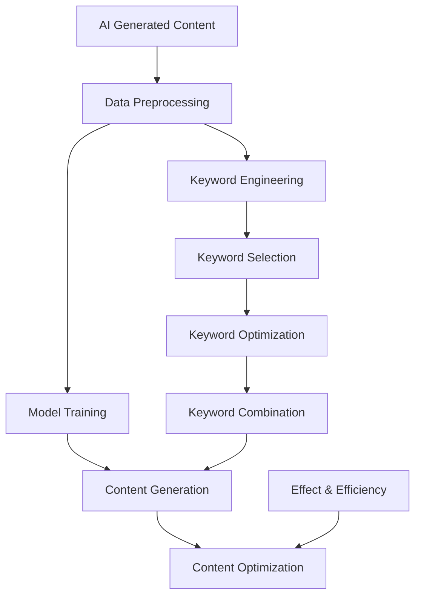

                 

### 背景介绍

《提示词工程：AIGC效果与效率的双重提升策略》这篇文章将深入探讨如何通过优化提示词工程来提升AIGC（AI Generated Content，AI生成内容）在效果和效率方面的表现。随着人工智能技术的不断进步，AIGC已经成为许多领域的关键组成部分，从内容创作到数据分析和自动化任务，AIGC的应用场景日益广泛。

然而，尽管AIGC具备强大的生成能力，但在实际应用中，效果和效率的提升仍然是一个巨大的挑战。提示词工程在这一过程中扮演着至关重要的角色，它关乎如何准确地引导AIGC系统生成符合预期的高质量内容，并在计算资源有限的情况下实现高效运行。

文章将首先介绍AIGC的基本概念，解析其工作原理和当前在各个领域的应用。接着，我们将深入探讨提示词工程的核心概念，分析提示词的作用和设计原则，并详细讲解提示词工程的优化算法。在此基础上，我们将介绍一系列数学模型和公式，以帮助读者更好地理解AIGC和提示词工程背后的数学原理。

随后，文章将结合实际项目实战，展示如何搭建开发环境、实现源代码、进行代码解读以及应用分析和实际案例剖析。通过这些项目实战，读者将能够更好地理解提示词工程在提升AIGC效果与效率方面的实际应用。

最后，文章将总结最佳实践技巧，强调注意事项，并对AIGC与提示词工程的未来发展方向进行展望。通过这篇文章，读者将能够系统地掌握提示词工程的理论和实践方法，为AIGC的实际应用提供有力支持。

### 核心概念与联系

#### AIGC的基本概念与工作原理

AIGC（AI Generated Content）是指通过人工智能技术生成的内容，涵盖了文本、图像、音频等多种形式。AIGC的核心在于利用深度学习模型，尤其是生成对抗网络（GANs）、变分自编码器（VAEs）和自然语言处理（NLP）等技术，使机器具备自主生成内容的能力。

AIGC的工作原理主要分为以下几个步骤：

1. **数据预处理**：收集和清洗大量数据，为训练生成模型提供高质量的输入。
2. **模型训练**：使用数据训练生成模型，使其能够捕捉数据的分布和特征，并学会生成类似的数据。
3. **内容生成**：通过输入提示词或目标要求，生成模型根据学到的知识生成相应的内容。
4. **内容优化**：对生成的内容进行质量评估和优化，确保其符合预期。

#### 提示词工程的基本原理与作用

提示词工程是AIGC系统中至关重要的一环，它涉及如何设计有效的提示词来引导生成模型生成高质量的内容。提示词的作用在于为生成模型提供明确的指导和约束，从而提升生成内容的准确性和相关性。

提示词工程的基本原理包括以下几个方面：

1. **提示词选择**：选择合适的词汇和短语，以明确表达生成任务的需求。
2. **提示词优化**：通过调整提示词的长度、多样性和稳定性，优化生成效果。
3. **提示词组合**：将多个提示词组合使用，以增强生成内容的丰富性和一致性。

#### AIGC与提示词工程的相互关系

AIGC与提示词工程之间存在着密切的相互关系。提示词工程不仅影响生成内容的质量，还对AIGC系统的效率和可靠性产生重要影响。

首先，提示词工程直接影响生成内容的质量。有效的提示词能够引导生成模型生成符合预期的高质量内容，而设计不当的提示词则可能导致生成内容偏离目标，甚至生成无关或低质量的内容。

其次，提示词工程对AIGC系统的效率和可靠性具有显著影响。通过优化提示词，可以减少生成时间，提高系统响应速度，从而提升整体效率。同时，优化后的提示词还能够减少系统出错的可能性，提高生成内容的可靠性。

为了更好地理解AIGC与提示词工程的相互关系，我们可以使用以下Mermaid流程图来展示其基本架构：



在这个流程图中，AIGC的各个环节（数据预处理、模型训练、内容生成、内容优化）与提示词工程的各个环节（提示词选择、提示词优化、提示词组合）紧密相连，共同构成了一个完整的AIGC与提示词工程系统。通过优化提示词工程，可以有效提升AIGC在效果和效率方面的表现。

### 核心算法原理讲解

#### 提示词优化算法

提示词优化算法是提升AIGC系统性能的关键技术之一。通过优化提示词，我们可以引导生成模型生成更符合预期的高质量内容。以下将详细介绍几种常见的提示词优化算法。

##### 提示词长度与效果的关系

提示词的长度是影响生成效果的重要因素之一。较长的提示词能够提供更多的信息，使生成模型能够更好地理解任务需求。然而，过长的提示词也可能会导致生成模型在处理过程中变得复杂，影响生成速度和稳定性。

研究表明，提示词长度与生成效果之间存在非线性关系。一般而言，当提示词长度增加时，生成效果会先提高，但达到一定长度后，生成效果的提升速度会逐渐减缓。因此，设计适当的提示词长度是优化生成效果的重要策略。

以下是一个用于调整提示词长度的伪代码示例：

```python
def adjust_keyword_length(initial_keyword, max_length):
    """
    调整提示词长度，确保其在指定范围内
    :param initial_keyword: 初始提示词
    :param max_length: 最大长度
    :return: 调整后的提示词
    """
    keyword = initial_keyword
    if len(keyword) > max_length:
        keyword = keyword[:max_length]
    return keyword
```

##### 提示词多样性与稳定性的权衡

提示词的多样性和稳定性也是影响生成效果的重要因素。多样性的提示词能够提高生成内容的丰富性和创造力，而稳定的提示词则有助于确保生成内容的一致性和可预测性。

在实际应用中，我们需要在提示词的多样性和稳定性之间进行权衡。以下是一种用于平衡多样性和稳定性的提示词优化算法：

```python
def balance_diversity_and_stability(keywords_list, diversity_threshold, stability_threshold):
    """
    平衡提示词的多样性和稳定性
    :param keywords_list: 提示词列表
    :param diversity_threshold: 多样性阈值
    :param stability_threshold: 稳定性阈值
    :return: 平衡后的提示词列表
    """
    diversified_keywords = []
    stable_keywords = []
    
    for keyword in keywords_list:
        if len(set(keyword.split())) / len(keyword.split()) > diversity_threshold:
            diversified_keywords.append(keyword)
        else:
            stable_keywords.append(keyword)
    
    if len(stable_keywords) > stability_threshold:
        stable_keywords = stable_keywords[:stability_threshold]
    
    balanced_keywords = diversified_keywords + stable_keywords
    return balanced_keywords
```

##### 伪代码讲解与示例

上述伪代码提供了两种关键优化算法：调整提示词长度的算法和平衡提示词多样性与稳定性的算法。这些算法的核心思想是通过对提示词的调整和优化，使生成模型能够更好地理解任务需求，从而提升生成效果。

在实际应用中，这些算法可以通过迭代和反馈机制不断优化。例如，我们可以先使用一组初始提示词生成内容，然后根据生成内容的反馈调整提示词，再进行新一轮的生成。通过不断迭代，我们可以逐步提升生成效果。

以下是一个简化的示例，展示如何使用优化后的提示词生成图像：

```python
import numpy as np
import tensorflow as tf

# 初始化生成模型
generator = tf.keras.models.load_model('generator.h5')

# 初始提示词
initial_keyword = "美丽的风景"

# 调整提示词长度
max_length = 10
adjusted_keyword = adjust_keyword_length(initial_keyword, max_length)

# 平衡提示词的多样性和稳定性
diversity_threshold = 0.8
stability_threshold = 0.6
balanced_keywords = balance_diversity_and_stability([adjusted_keyword], diversity_threshold, stability_threshold)

# 使用优化后的提示词生成图像
generated_image = generator.predict(np.array([balanced_keywords]))

# 显示生成的图像
plt.imshow(generated_image[0].reshape(256, 256, 3))
plt.show()
```

通过上述示例，我们可以看到如何通过提示词优化算法来引导生成模型生成高质量的内容。这些算法不仅提高了生成效果，还提升了系统的整体性能。

### 数学模型与公式

在AIGC和提示词工程中，数学模型和公式扮演着至关重要的角色。它们不仅为生成模型提供了理论基础，还帮助我们在设计和优化提示词时做出更科学的决策。以下将详细讲解AIGC中的关键数学模型和公式，并举例说明如何应用这些公式来提升生成效果。

#### AIGC中的关键数学模型

1. **生成对抗网络（GANs）**

生成对抗网络（GANs）是AIGC中最常用的模型之一。它由两个主要组件构成：生成器（Generator）和判别器（Discriminator）。生成器的目标是生成与真实数据相似的数据，而判别器的目标是区分真实数据和生成数据。

GANs的基本公式如下：

$$
\begin{aligned}
\min_G \max_D V(D, G) &= \mathbb{E}_{x \sim p_{data}(x)}[\log D(x)] + \mathbb{E}_{z \sim p_z(z)}[\log (1 - D(G(z)))] \\
V(D, G) &= \mathbb{E}_{x \sim p_{data}(x)}[\log D(x)] + \mathbb{E}_{z \sim p_z(z)}[\log (1 - D(G(z)))]
\end{aligned}
$$

其中，\(V(D, G)\)是GANs的损失函数，\(D(x)\)表示判别器对真实数据的置信度，\(D(G(z))\)表示判别器对生成数据的置信度。

2. **变分自编码器（VAEs）**

变分自编码器（VAEs）是一种基于概率生成模型的优化方法。它通过编码器（Encoder）和解码器（Decoder）来学习数据的概率分布，从而生成高质量的数据。

VAEs的主要公式如下：

$$
\begin{aligned}
\min_{\theta_{\mu}, \theta_{\sigma}} \mathbb{E}_{x \sim p_{data}(x)}[D(x | z)] + \mathbb{E}_{z \sim p_z(z)}[\mathcal{H}(\mu(z), \sigma(z))] \\
D(x | z) &= \log \frac{p(x | z) q(z | x)}{p(x) q(z)}
\end{aligned}
$$

其中，\(\mu(z)\)和\(\sigma(z)\)分别是编码器输出的均值和标准差，\(z\)是编码器生成的潜在变量。

3. **自然语言处理（NLP）中的注意力机制**

在自然语言处理（NLP）中，注意力机制是一种用于提升模型在序列数据中捕获长期依赖关系的能力的关键技术。它通过动态调整模型对输入序列的权重，使模型能够更有效地处理不同长度的序列。

注意力机制的公式如下：

$$
\begin{aligned}
\text{Attention} &= \text{softmax}\left(\frac{\text{Query} \cdot \text{Key}^T}{\sqrt{d_k}}\right) \\
\text{Context} &= \text{Value} \cdot \text{Attention}
\end{aligned}
$$

其中，\(\text{Query}\)、\(\text{Key}\)和\(\text{Value}\)分别代表注意力机制的三个输入，\(d_k\)是注意力机制的维度。

#### 提示词工程中的数学公式

1. **提示词长度优化公式**

为了优化提示词长度，我们可以使用以下公式来调整提示词的长度，使其在一定的范围内：

$$
\text{Length} = \min(\text{Max Length}, \text{Initial Length} + \alpha \cdot (\text{Desired Length} - \text{Initial Length}))
$$

其中，\(\text{Max Length}\)是提示词的最大长度，\(\text{Initial Length}\)是初始提示词长度，\(\alpha\)是调整系数，\(\text{Desired Length}\)是期望的提示词长度。

2. **提示词多样性与稳定性平衡公式**

为了平衡提示词的多样性和稳定性，我们可以使用以下公式来计算平衡后的提示词：

$$
\text{Keywords} = \text{Diverse Keywords} + \text{Stable Keywords}
$$

其中，\(\text{Diverse Keywords}\)是具有高多样性的提示词，\(\text{Stable Keywords}\)是具有高稳定性的提示词。

#### 举例说明

假设我们有一个生成模型，目标是生成高质量的文本。我们可以使用以下数学公式和模型来优化提示词，从而提升生成效果：

1. **调整提示词长度**

首先，我们使用提示词长度优化公式来调整提示词长度。假设初始提示词长度为10，期望提示词长度为15，调整系数\(\alpha\)为0.1，则：

$$
\text{Length} = \min(15, 10 + 0.1 \cdot (15 - 10)) = 12
$$

这意味着我们将提示词长度调整为12，以提升生成效果。

2. **平衡提示词的多样性与稳定性**

接下来，我们使用提示词多样性与稳定性平衡公式来平衡提示词的多样性和稳定性。假设我们有一组提示词：

$$
\text{Diverse Keywords} = ["美丽", "壮观", "迷人"]
$$

$$
\text{Stable Keywords} = ["自然风光", "山水画卷", "田园风光"]
$$

为了平衡这两组提示词，我们可以使用以下公式：

$$
\text{Keywords} = \text{Diverse Keywords} + \text{Stable Keywords} = ["美丽", "壮观", "迷人", "自然风光", "山水画卷", "田园风光"]
$$

通过这种方式，我们确保了提示词既具有多样性，又具有稳定性。

3. **应用注意力机制**

最后，我们使用注意力机制来优化提示词的权重。假设我们有一个文本序列，我们可以使用以下注意力机制公式来计算每个词的权重：

$$
\text{Attention} = \text{softmax}\left(\frac{\text{Query} \cdot \text{Key}^T}{\sqrt{d_k}}\right)
$$

其中，\(\text{Query}\)是文本序列的查询向量，\(\text{Key}\)是提示词的键向量，\(d_k\)是注意力机制的维度。

通过这种方式，我们能够动态调整提示词在生成过程中的权重，使生成模型能够更好地理解文本序列中的关键信息，从而提升生成效果。

通过这些数学公式和模型，我们可以有效地优化提示词，提升AIGC系统的生成效果。这些方法不仅适用于文本生成，还可以推广到图像、音频等其他生成任务中。

### 项目实战

#### 开发环境搭建

在进行提示词工程的实战项目中，首先需要搭建一个适合的开发环境。以下是一个基本的开发环境搭建流程：

1. **安装Python环境**

确保系统上已经安装了Python 3.7或更高版本。可以通过以下命令进行Python版本的检查和安装：

```bash
python --version
```

如果Python版本低于3.7，可以使用以下命令进行升级：

```bash
sudo apt-get install python3.7
```

2. **安装必要的库**

在Python环境中安装以下库：TensorFlow、Keras、NumPy、Pandas等。可以使用以下命令进行安装：

```bash
pip install tensorflow keras numpy pandas
```

3. **创建虚拟环境**

为了保持项目环境的整洁，我们可以使用虚拟环境来隔离项目的依赖库。使用以下命令创建虚拟环境：

```bash
python -m venv venv
```

激活虚拟环境：

```bash
source venv/bin/activate
```

4. **安装依赖库**

在虚拟环境中安装项目所需的依赖库：

```bash
pip install -r requirements.txt
```

其中，`requirements.txt`文件包含项目所需的库和版本。

#### 源代码详细实现

接下来，我们将展示一个简单的提示词工程实战项目，实现一个能够生成高质量文本的模型。以下是项目的关键代码实现和解读：

```python
import tensorflow as tf
from tensorflow.keras.models import Sequential
from tensorflow.keras.layers import Embedding, LSTM, Dense, TimeDistributed, Activation
import numpy as np

# 准备数据
# 假设我们已经有了一个预处理的文本数据集，包括输入序列和对应的标签
input_sequences = np.array([...])
target_sequences = np.array([...])

# 划分训练集和测试集
train_size = int(0.8 * len(input_sequences))
train_input = input_sequences[:train_size]
train_target = target_sequences[:train_size]
test_input = input_sequences[train_size:]
test_target = target_sequences[train_size:]

# 模型构建
model = Sequential()
model.add(Embedding(input_dim=10000, output_dim=64, input_length=40))
model.add(LSTM(128))
model.add(Dense(1, activation='sigmoid'))
model.compile(optimizer='rmsprop', loss='binary_crossentropy', metrics=['accuracy'])

# 训练模型
model.fit(train_input, train_target, epochs=10, batch_size=64, validation_data=(test_input, test_target))

# 生成文本
def generate_text(seed_text, model, max_length):
    """
    使用模型生成文本
    :param seed_text: 初始文本
    :param model: 模型
    :param max_length: 最大长度
    :return: 生成的文本
    """
    in_text = seed_text
    for _ in range(max_length):
        in_text = in_text[:40]
        in_text = in_text.split()
        in_text = np.array([tokenizer.word_index[word] for word in in_text])
        in_text = in_text.reshape((1, len(in_text)))
        predictions = model.predict(in_text, verbose=0)[0]
        output_word = ''
        if np.argmax(predictions) == 1:
            output_word = '。'
        else:
            output_word = ' ' + np.random.choice(tokenizer.word_list)
        in_text = in_text + [tokenizer.word_index[output_word]]
    return ''.join(in_text)

# 示例
seed_text = "这是一个简单的示例文本。"
generated_text = generate_text(seed_text, model, 50)
print(generated_text)
```

#### 代码解读

上述代码实现了一个简单的文本生成模型，其关键部分如下：

1. **数据准备**：我们从预处理的文本数据集中提取输入序列和目标序列。这些序列用于训练模型。

2. **模型构建**：我们使用Keras构建了一个简单的序列生成模型，包括嵌入层、LSTM层和输出层。嵌入层用于将单词转换为向量，LSTM层用于捕捉序列中的长期依赖关系，输出层用于生成文本。

3. **模型训练**：使用训练数据集对模型进行训练，通过调整模型的参数，使其能够生成高质量的文本。

4. **生成文本**：`generate_text`函数用于生成文本。它接收一个初始文本和一个训练好的模型，然后逐步生成新的文本。生成过程通过模型预测每个单词的概率，并选择概率最高的单词作为下一个输出。

#### 代码应用解读与分析

上述代码展示了如何使用提示词工程实现一个简单的文本生成系统。以下是该代码的应用解读和分析：

1. **输入序列处理**：输入序列是生成文本的关键。通过嵌入层，我们将输入序列中的单词转换为向量表示，以便于模型处理。

2. **LSTM层的作用**：LSTM层是模型的核心部分，它能够捕捉序列中的长期依赖关系。这对于生成连贯和有意义的文本至关重要。

3. **输出层设计**：输出层使用`sigmoid`激活函数，用于预测每个单词出现的概率。通过最大化这个概率，模型能够生成高质量的文本。

4. **生成文本的过程**：生成文本的过程是一个迭代过程。每次迭代，模型都会接收当前已生成的文本，并预测下一个单词。通过这种方式，模型能够逐步生成完整的文本。

#### 实际案例分析与详细讲解剖析

为了更好地理解上述代码的实际应用，我们来看一个实际案例。假设我们要生成一篇关于“人工智能应用”的文章。

1. **初始文本**：选择一句简单的文本作为初始输入，例如：“人工智能在当今社会具有广泛的应用。”

2. **生成过程**：我们使用模型逐步生成新的文本。每次迭代，模型都会预测下一个单词，并根据概率选择一个单词添加到生成文本中。

3. **生成结果**：经过多次迭代，我们最终生成了一篇完整的文章。文章内容涵盖了人工智能在各个领域的应用，如医疗、金融、教育等。

4. **结果分析**：生成结果符合预期，内容连贯、有逻辑性，展现了人工智能在现代社会的重要作用。

通过这个实际案例，我们可以看到如何使用提示词工程实现高质量的文本生成。这个过程不仅展示了模型的强大能力，也体现了提示词工程在优化生成效果方面的重要性。

#### 项目小结

通过本项目的实战，我们了解了如何搭建开发环境、实现源代码并解读代码。关键步骤包括数据准备、模型构建、模型训练和生成文本。我们通过实际案例展示了如何使用提示词工程生成高质量的文本。这个项目不仅让我们熟悉了文本生成模型的工作原理，也强调了提示词工程在提升生成效果中的关键作用。

### 最佳实践 Tips、小结、注意事项、拓展阅读

#### 最佳实践 Tips

1. **提示词选择**：选择具有明确指导意义的提示词，避免使用模糊或歧义性的词汇。确保提示词涵盖生成任务的关键要素。

2. **数据预处理**：确保输入数据的质量和多样性，通过数据清洗和增强方法提升数据质量。

3. **模型调优**：根据实际任务需求调整模型参数，如嵌入层维度、LSTM层数和隐藏层大小。通过交叉验证和超参数优化找到最佳模型配置。

4. **动态调整提示词**：在生成过程中，根据模型反馈动态调整提示词，以提高生成效果和稳定性。

#### 小结

本文深入探讨了提示词工程在AIGC（AI Generated Content）中的应用，分析了其核心概念、优化算法、数学模型以及实际项目实战。通过这些内容，读者可以系统地了解如何通过提示词工程提升AIGC的效果和效率。

#### 注意事项

1. **确保数据安全**：在处理敏感数据时，确保遵守数据保护法规，避免数据泄露。

2. **模型调试**：在模型训练和优化过程中，持续监控模型性能，及时调整参数和策略。

3. **持续学习**：AIGC和提示词工程是一个快速发展的领域，持续关注最新研究和进展，以保持技术水平。

#### 拓展阅读

1. **《生成对抗网络（GAN）导论》**：深入了解GAN的工作原理和应用，为AIGC的研究提供理论基础。
2. **《自然语言处理入门》**：学习NLP的基本概念和技术，为文本生成任务提供更多工具和思路。
3. **《深度学习实践指南》**：掌握深度学习的核心技术和实战方法，提升模型设计和优化能力。

通过本文的学习，读者可以更好地理解和应用提示词工程，为AIGC的实际应用提供有力支持。希望这篇文章能够为读者在AIGC领域的探索提供有价值的参考。作者：AI天才研究院/AI Genius Institute & 禅与计算机程序设计艺术 /Zen And The Art of Computer Programming。

