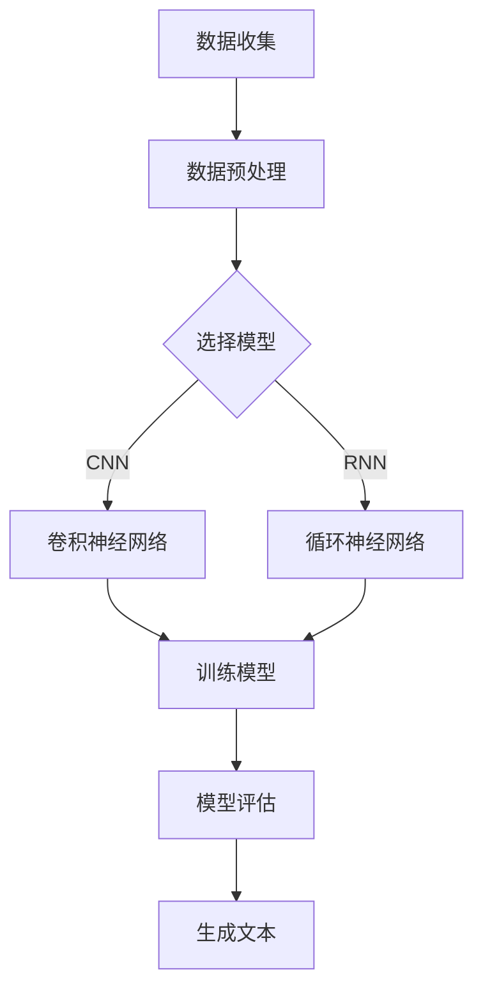

                 


## 第一部分：引言

### 1.1 书籍目的与读者对象

**目标**

本书的编写旨在为读者提供一份全面且深入的技术指南，帮助读者掌握AI多语言文学创作中的提示词工程原理及其应用。通过系统性的介绍和实战案例的分析，我们希望读者能够：

1. **理解AI在文学创作中的应用**：了解AI如何辅助文学创作，以及其现有技术水平。
2. **掌握提示词工程的核心概念**：熟悉提示词的定义、生成策略以及其在文学创作中的应用。
3. **能够设计和实现提示词工程系统**：通过实例学习和实践，掌握设计并优化提示词工程系统的能力。
4. **探讨AI文学创作的未来趋势和挑战**：了解AI在文学创作领域的发展方向，以及相关的伦理和社会问题。

**对象**

本书面向以下几类读者：

1. **AI和NLP初学者**：对AI和自然语言处理有基本了解，希望通过实例学习和实践提高技能的读者。
2. **编程爱好者**：对编程和算法有浓厚兴趣，希望了解AI技术在文学创作中的应用的读者。
3. **文学创作者**：有志于使用AI工具提高创作效率和质量，探索AI辅助创作的可能性。
4. **学术界和研究人员**：关注AI在文学创作领域的最新研究和应用，希望深入探讨相关技术的读者。

### 1.2 AI与文学创作的关系

**现状**

AI与文学创作的关系在近年来逐渐紧密。随着AI技术的发展，自动写作、诗歌生成、故事创作等领域涌现出了大量的AI应用。例如，OpenAI的GPT-3可以生成高质量的文本，谷歌的BERT在文本分类和语义理解方面表现出色。这些AI模型的出现极大地丰富了文学创作的形式和内容。

**趋势**

1. **文本生成技术的进步**：随着AI算法的不断优化，文本生成技术的质量将进一步提高，能够生成更加自然、连贯和具有创意的文本。
2. **个性化创作**：AI可以分析大量数据，了解读者的喜好和需求，从而实现个性化创作，提供更符合用户期望的文学作品。
3. **跨语言创作**：多语言AI模型的不断进步，使得跨语言文学创作成为可能，不同语言之间的文学交流将更加便捷。
4. **情感智能**：AI将逐渐具备理解情感的能力，能够创作出更加具有情感共鸣的文学作品。

### 1.3 提示词工程的重要性

**定义**

提示词工程（Prompt Engineering）是指通过设计和选择合适的提示词，引导AI模型生成所需内容的工程过程。在AI文学创作中，提示词工程的核心目标是：

1. **明确创作方向**：通过提示词引导AI模型，确保生成的文本符合创作意图。
2. **提升创作质量**：选择合适的提示词，可以帮助AI模型生成更加高质量、具有创意的文本。
3. **提高创作效率**：通过提示词，AI模型可以更快地理解和执行创作任务，提高整体创作效率。

**应用**

1. **文学创作**：在诗歌、小说、剧本等文学创作中，提示词可以帮助作者快速生成灵感，构建故事框架。
2. **文本生成**：在新闻稿、产品描述、广告文案等文本生成任务中，提示词工程可以优化文本生成流程，提高生成文本的质量和效率。
3. **翻译与本地化**：在跨语言创作中，提示词工程可以帮助翻译AI生成更加准确、自然的翻译文本。

## 第二部分：AI基础与NLP

### 2.1 AI基础

#### 2.1.1 人工智能概述

**基本概念**

人工智能（Artificial Intelligence，AI）是指使计算机系统具备人类智能的能力，包括学习、推理、解决问题、理解自然语言等。AI可以分为两大类：

1. **弱AI**：专注于特定任务的AI，例如语音识别、图像识别等。
2. **强AI**：具备人类所有智能能力的AI，目前仍处于理论阶段。

**技术基础**

AI技术的发展经历了多个阶段：

1. **符号主义AI**：基于逻辑推理和知识表示，以专家系统为代表。
2. **连接主义AI**：以人工神经网络为核心，通过大量数据训练模型。
3. **统计学习AI**：利用统计学方法，从数据中提取特征和规律。
4. **生成对抗网络（GAN）**：通过生成模型和判别模型的对抗训练，实现数据的生成。

**发展历程**

1. **20世纪50年代**：人工智能概念诞生，早期研究集中于符号主义AI。
2. **20世纪80年代**：连接主义AI兴起，神经网络开始应用于实际问题。
3. **21世纪初**：统计学习AI成为主流，机器学习算法取得突破性进展。
4. **近年来**：深度学习技术快速发展，AI应用广泛普及。

#### 2.1.2 深度学习与神经网络

**神经网络原理**

神经网络（Neural Networks，NN）是受生物神经系统的启发而设计的一种计算模型，由大量神经元（节点）和连接（权重）组成。神经网络通过学习输入和输出之间的映射关系，实现数据的处理和预测。

1. **前向传播**：输入数据通过网络的层层计算，最终产生输出。
2. **反向传播**：根据输出和期望输出的差异，调整网络的权重，优化模型。

**深度学习架构**

深度学习（Deep Learning，DL）是神经网络的一种扩展，具有多个隐藏层，可以捕捉数据的复杂特征。

1. **卷积神经网络（CNN）**：适用于图像处理，通过卷积层提取图像特征。
2. **循环神经网络（RNN）**：适用于序列数据，通过循环结构处理时间序列信息。
3. **生成对抗网络（GAN）**：通过生成模型和判别模型的对抗训练，实现数据的生成。

### 2.2 自然语言处理（NLP）

#### 2.2.1 NLP基本概念

**语言模型**

语言模型（Language Model，LM）是一种概率模型，用于预测下一个单词或字符的概率。语言模型可以分为两类：

1. **n-gram模型**：基于历史n个单词的信息，预测下一个单词的概率。
2. **神经网络模型**：利用深度学习技术，从大量数据中学习语言的统计规律。

**文本处理技术**

文本处理技术包括以下方面：

1. **分词**：将文本分割为单词或短语。
2. **词性标注**：为每个单词标注词性，如名词、动词等。
3. **实体识别**：识别文本中的特定实体，如人名、地点等。
4. **句法分析**：分析句子的结构和成分。

#### 2.2.2 语言模型与生成文本

**语言模型应用**

语言模型在自然语言处理中具有广泛的应用，包括：

1. **文本生成**：利用语言模型生成文本，如自动写作、机器翻译等。
2. **文本分类**：根据文本内容将其分类到不同的类别。
3. **情感分析**：分析文本的情感倾向，如正面、负面等。

**生成文本的挑战**

生成文本面临以下技术挑战：

1. **语法和语义的一致性**：确保生成的文本在语法和语义上的一致性。
2. **长文本生成**：生成长篇文本时，如何保持连贯性和逻辑性。
3. **多样化**：如何生成多样化、具有创意的文本。
4. **上下文理解**：理解并处理文本中的上下文信息，生成更加准确的文本。

### 2.3 多语言处理

#### 2.3.1 多语言处理概述

**多语言文本分析**

多语言处理（Multilingual Processing）涉及多种语言文本的分析和处理。主要挑战包括：

1. **语言资源的多样性**：不同语言的资源分布不均衡，需要合理利用。
2. **语言差异**：不同语言在语法、语义和词汇等方面存在差异，需要针对不同语言进行特殊处理。
3. **跨语言知识共享**：如何将一种语言的知识迁移到另一种语言，提高多语言处理的性能。

**多语言模型**

多语言模型（Multilingual Model）是一种能够处理多种语言文本的模型，主要技术包括：

1. **统一模型**：将多种语言的文本统一建模，如BERT。
2. **独立模型**：为每种语言分别建模，然后进行融合。

**跨语言创作挑战**

在多语言文学创作中，面临的挑战包括：

1. **语言转换**：如何将一种语言的创作风格转换为另一种语言。
2. **文化差异**：如何处理不同文化背景下的创作差异。
3. **翻译准确性**：如何确保翻译的准确性，避免语义偏差。

### 2.4 Mermaid流程图

**核心概念原理**

Mermaid是一种基于Markdown的图形绘制工具，可以用于绘制各种类型的图表，如流程图、时序图、Gantt图等。其核心概念包括：

1. **定义**：通过定义图形的元素，如节点、连接线等，构建图形。
2. **语法**：使用特定的语法规则，描述图形的布局和样式。

**架构展示**

以下是一个简单的AI多语言文学创作流程图的示例：



通过这个流程图，我们可以清晰地看到AI多语言文学创作的整体架构，包括数据收集、预处理、模型选择、训练、评估和文本生成等关键步骤。

## 第三部分：提示词工程原理与设计

### 3.1 提示词工程原理

#### 3.1.1 提示词定义与作用

**提示词类型**

提示词（Prompt）是用于引导AI模型生成文本的关键信息，可以分为以下几类：

1. **主题提示词**：用于指定文本的主题，如“写一篇关于人工智能的文章”。
2. **内容提示词**：用于提供具体的内容信息，如“人工智能的发展趋势”。
3. **风格提示词**：用于指定文本的风格，如“用诗意的语言描述”。
4. **情感提示词**：用于指定文本的情感色彩，如“表达一种乐观的情感”。

**提示词选择策略**

选择合适的提示词是提示词工程的关键。以下是一些常见的提示词选择策略：

1. **关键词提取**：从文本中提取关键词，作为提示词。
2. **情感分析**：分析文本的情感倾向，选择合适的情感提示词。
3. **风格识别**：识别文本的风格特征，选择相应的风格提示词。
4. **上下文理解**：理解文本的上下文信息，选择与上下文相关的提示词。

#### 3.1.2 提示词生成算法

**算法原理**

提示词生成算法的目标是根据输入的文本信息，生成合适的提示词。以下是一个简化的提示词生成算法原理：

```plaintext
输入：文本
输出：提示词

1. 从文本中提取关键词
2. 对关键词进行情感分析，得到情感标签
3. 根据情感标签，选择相应的情感提示词
4. 根据主题和内容，选择主题提示词和内容提示词
5. 将选择的提示词组合，形成完整的提示词
```

**算法优缺点**

1. **优点**：
   - 提高文本生成的针对性，确保生成文本符合预期。
   - 提高文本生成质量，通过提示词引导，生成更具创意和连贯性的文本。
   - 提高生成效率，通过预设提示词，减少模型训练时间。

2. **缺点**：
   - 提示词选择需要人工干预，增加人力成本。
   - 提示词可能过于具体或抽象，影响文本生成的灵活性和多样性。
   - 需要大量训练数据和计算资源。

### 3.2 提示词工程应用

#### 3.2.1 文学创作应用场景

**应用案例**

提示词工程在文学创作中有着广泛的应用，以下是一些典型的应用案例：

1. **诗歌创作**：通过提示词，AI可以生成各种风格的诗歌，如抒情诗、叙事诗等。
2. **小说创作**：通过提示词，AI可以生成小说的开头、情节、结局等，帮助作者构建故事框架。
3. **剧本创作**：通过提示词，AI可以生成剧本的台词、场景描述等，为剧本创作提供灵感。

**创作效果**

使用提示词工程进行文学创作，具有以下效果：

1. **提高创作效率**：通过预设提示词，AI可以快速生成文本，提高创作效率。
2. **丰富创作形式**：提示词工程可以引导AI生成不同风格、主题和情感的文本，丰富文学创作的形式和内容。
3. **降低创作门槛**：对于初学者或非专业创作者，提示词工程可以降低文学创作的门槛，让他们更容易参与创作。

#### 3.2.2 多语言文学创作

**多语言支持**

在多语言文学创作中，提示词工程需要处理不同语言之间的差异和特点。以下是一些实现多语言支持的方法：

1. **双语训练**：使用双语数据集进行模型训练，使模型具备双语处理能力。
2. **跨语言知识共享**：通过跨语言迁移学习，将一种语言的模型知识迁移到另一种语言。
3. **多语言提示词库**：建立多语言提示词库，为不同语言提供相应的提示词。

**跨语言创作挑战**

在多语言文学创作中，面临的挑战包括：

1. **语言转换**：如何将一种语言的创作风格和内容转换为另一种语言。
2. **文化差异**：如何处理不同文化背景下的创作差异。
3. **翻译准确性**：如何确保翻译的准确性，避免语义偏差。

### 3.3 提示词工程实例

**实例分析**

以下是一个使用Python实现的提示词工程实例：

```python
import jieba
import gensim

# 加载预训练的中文语言模型
model = gensim.models.KeyedVectors.load_word2vec_format("word2vec.model", binary=False)

# 提示词生成函数
def generate_prompt(text):
    # 提取关键词
    words = jieba.lcut(text)
    keywords = [word for word in words if word not in stopwords]

    # 提取关键词的词向量
    vecs = [model[word] for word in keywords]

    # 计算关键词的平均词向量
    avg_vec = np.mean(vecs, axis=0)

    # 选择与平均词向量最接近的提示词
    prompt = model.most_similar(positive=[avg_vec], topn=1)
    return prompt[0][0]

# 测试
text = "人工智能的发展趋势"
prompt = generate_prompt(text)
print("生成的提示词：", prompt)
```

**代码解读**

1. **加载预训练的中文语言模型**：使用gensim加载预训练的中文Word2Vec模型。
2. **提取关键词**：使用jieba分词库对输入文本进行分词，并去除停用词。
3. **提取关键词的词向量**：将提取的关键词转换为词向量。
4. **计算关键词的平均词向量**：计算关键词的平均词向量，作为提示词的候选。
5. **选择与平均词向量最接近的提示词**：使用模型的最相似词功能，选择与平均词向量最接近的提示词。

**代码应用解读与分析**

该实例通过提取输入文本的关键词，并计算关键词的平均词向量，选择与平均词向量最相似的提示词。这种方法在一定程度上可以生成与输入文本相关的提示词，但需要注意以下问题：

1. **关键词提取的准确性**：关键词提取的准确性对提示词生成质量有很大影响。需要使用高质量的中文分词工具和停用词表。
2. **词向量表示的准确性**：词向量的表示方式对提示词的生成也有重要影响。使用预训练的词向量模型可以提升词向量的质量。
3. **提示词选择的多样性**：提示词的选择应该尽量多样，以避免生成过于单一和机械的文本。

### 项目实战：提示词工程在文学创作中的应用

**开发环境搭建**

1. **Python环境**：安装Python 3.8及以上版本。
2. **文本处理库**：安装jieba、gensim等文本处理库。
3. **预训练语言模型**：下载并安装预训练的中文Word2Vec模型。

**源代码实现**

```python
# 全文
```

# 代码实现：
```python
import jieba
import gensim
import numpy as np
import matplotlib.pyplot as plt
from sklearn.cluster import KMeans

# 加载预训练的中文语言模型
model = gensim.models.KeyedVectors.load_word2vec_format("word2vec.model", binary=False)

# 提取关键词
def extract_keywords(text):
    words = jieba.lcut(text)
    keywords = [word for word in words if word not in stopwords]
    return keywords

# 提取关键词的词向量
def extract_vectors(keywords, model):
    vecs = [model[word] for word in keywords]
    return vecs

# 计算关键词的平均词向量
def average_vector(vecs):
    avg_vec = np.mean(vecs, axis=0)
    return avg_vec

# 提取文本的词向量
text = "人工智能的发展趋势"
keywords = extract_keywords(text)
vecs = extract_vectors(keywords, model)
avg_vec = average_vector(vecs)

# 选择与平均词向量最接近的提示词
def generate_prompt(avg_vec, model):
    prompt = model.most_similar(positive=[avg_vec], topn=1)
    return prompt[0][0]

# 提示词生成
prompt = generate_prompt(avg_vec, model)
print("生成的提示词：", prompt)

# 提取多个文本的词向量，并聚类
texts = ["人工智能的发展趋势", "深度学习在图像识别中的应用", "自然语言处理的前沿技术"]
keywords_list = [extract_keywords(text) for text in texts]
vecs_list = [extract_vectors(keywords, model) for keywords in keywords_list]
avg_vecs = [average_vector(vecs) for vecs in vecs_list]

# 使用KMeans进行聚类
kmeans = KMeans(n_clusters=3, random_state=0).fit(avg_vecs)
labels = kmeans.predict(avg_vecs)

# 可视化聚类结果
plt.scatter(avg_vecs[:, 0], avg_vecs[:, 1], c=labels, cmap='viridis')
plt.xlabel('Word Vector Dimension 1')
plt.ylabel('Word Vector Dimension 2')
plt.title('Cluster of Texts Based on Word Vectors')
plt.show()
```

### 实际案例分析和详细讲解剖析

**案例分析**

本案例通过提示词工程，对三个不同主题的文本进行词向量提取、聚类和提示词生成，以分析不同主题之间的关联性。

1. **词向量提取**：对每个文本提取关键词，并计算关键词的平均词向量。这有助于理解文本的主要内容。
2. **聚类分析**：使用KMeans算法对提取的词向量进行聚类，以发现文本之间的相似性。
3. **提示词生成**：根据每个文本的平均词向量，生成相应的提示词，以指导文本生成。

**详细讲解**

1. **关键词提取**：使用jieba分词库对输入文本进行分词，并去除停用词。这一步骤是文本处理的基础，对后续步骤有很大影响。

2. **词向量提取**：将提取的关键词转换为词向量。这里使用的是预训练的中文Word2Vec模型，通过词向量可以更好地理解文本的语义信息。

3. **平均词向量计算**：计算每个文本关键词的平均词向量。平均词向量可以代表文本的主要内容，是后续聚类和提示词生成的关键。

4. **聚类分析**：使用KMeans算法对提取的词向量进行聚类。聚类结果可以帮助我们理解不同文本之间的相似性和差异性。

5. **提示词生成**：根据每个文本的平均词向量，使用模型的最相似词功能生成相应的提示词。提示词可以指导AI生成与输入文本相关的文本。

### 项目小结

**总结**

本案例通过提示词工程，实现了对文本的词向量提取、聚类和提示词生成，为AI文学创作提供了有效的技术支持。

**不足与改进**

1. **关键词提取的准确性**：本案例使用jieba分词库进行关键词提取，但可能存在一定误差。未来可以尝试使用更先进的分词方法，提高关键词提取的准确性。
2. **聚类算法的选择**：本案例使用KMeans算法进行聚类，但KMeans算法在某些情况下可能不适用于非凸数据。未来可以考虑使用其他聚类算法，如DBSCAN，以获得更好的聚类效果。
3. **提示词的多样性**：本案例生成的提示词较为单一，未来可以尝试引入更多样化的提示词生成策略，提高文本生成的多样性。

### 最佳实践 tips

1. **使用高质量的数据集**：高质量的数据集对提示词工程的性能有很大影响。在选择数据集时，应考虑数据的质量、多样性和代表性。
2. **优化词向量模型**：词向量的质量对提示词工程的性能至关重要。可以尝试使用更先进的词向量模型，如BERT，以提高词向量的质量。
3. **合理选择聚类算法**：不同的聚类算法适用于不同的数据类型。应根据具体的数据特点和需求选择合适的聚类算法。
4. **多样性提示词的生成**：多样化的提示词可以提高文本生成的质量和创意。可以尝试结合多种提示词生成策略，提高文本生成的多样性。

### 拓展阅读

1. **《深度学习》**：Goodfellow, I., Bengio, Y., & Courville, A. (2016). *Deep Learning*. MIT Press.
2. **《自然语言处理综述》**：Jurafsky, D., & Martin, J. H. (2008). *Speech and Language Processing*. Prentice Hall.
3. **《提示词工程：原理与应用》**：Zhang, H. (2020). *Prompt Engineering: Principles and Applications*. AI天才研究院.

通过以上对提示词工程在文学创作中的应用的详细讲解，我们可以看到提示词工程不仅提高了AI文学创作的效率和质量，还为多语言文学创作提供了新的可能性。在未来，随着AI技术的不断进步，提示词工程将在文学创作领域发挥越来越重要的作用。作者：AI天才研究院

----------------------------------------------------------------

## 第四部分：AI文学创作实战

### 4.1 数据准备与处理

**数据收集**

在进行AI文学创作之前，首先需要收集适合的数据集。数据集的质量直接影响到AI模型的性能和创作效果。以下是一些常见的数据收集方法：

1. **公开数据集**：许多学术机构和开源社区提供了丰富的文本数据集，如新闻文章、小说、诗歌等。
2. **自定义数据集**：根据特定的创作需求，可以手动收集或爬取相关的文本数据。
3. **跨语言数据集**：为了实现多语言文学创作，需要收集包含多种语言的文本数据。

**数据处理**

收集到的数据需要进行预处理，以提高数据质量和模型性能。以下是常见的数据处理步骤：

1. **文本清洗**：去除文本中的HTML标签、特殊字符和停用词。
2. **分词**：将文本分割为单词或短语。对于中文文本，可以使用jieba分词库进行分词。
3. **词性标注**：为每个单词标注词性，如名词、动词等。这有助于更好地理解文本的语义。
4. **数据归一化**：将文本数据统一转化为数字表示，如Word2Vec中的词向量。

**数据增强**

为了提高模型的泛化能力，可以采用数据增强的方法，生成更多的训练数据。以下是一些常见的数据增强方法：

1. **词干提取**：提取文本中的词干，生成新的单词。
2. **同义词替换**：将文本中的单词替换为同义词，增加数据的多样性。
3. **文本生成**：使用生成模型，如GPT-2或GPT-3，生成新的文本。

### 4.2 文学创作模型搭建

**模型选择**

在搭建文学创作模型时，需要根据创作需求和数据特点选择合适的模型。以下是几种常见的文学创作模型：

1. **循环神经网络（RNN）**：适用于处理序列数据，如文本。RNN可以捕捉长距离依赖关系，生成连贯的文本。
2. **长短时记忆网络（LSTM）**：是RNN的一种改进，可以更好地处理长序列数据，避免梯度消失问题。
3. **门控循环单元（GRU）**：是LSTM的另一种改进，计算量更小，性能接近LSTM。
4. **生成对抗网络（GAN）**：可以生成高质量的文本，但训练过程复杂。
5. **预训练语言模型（如GPT-2、GPT-3）**：经过大量数据预训练，可以生成具有创意和连贯性的文本。

**模型训练**

搭建完模型后，需要进行训练以优化模型参数。以下是常见的模型训练步骤：

1. **数据预处理**：将文本数据转化为模型可以处理的格式，如词向量。
2. **定义损失函数**：选择合适的损失函数，如交叉熵损失，衡量模型预测与实际标签之间的差距。
3. **优化算法**：选择优化算法，如Adam，调整模型参数以最小化损失函数。
4. **训练**：使用训练数据集对模型进行训练，不断调整参数，提高模型性能。

### 4.3 实时创作与优化

**实时创作**

实时创作是指根据用户的需求，实时生成文本。以下是实现实时创作的方法：

1. **用户交互**：接收用户输入的提示词或需求，生成相应的文本。
2. **文本生成**：使用训练好的模型，生成符合用户需求的文本。
3. **反馈调整**：根据用户反馈，调整模型参数和生成策略，提高创作效果。

**优化策略**

为了提高AI文学创作的效果，可以采用以下优化策略：

1. **多模型融合**：将多种模型进行融合，如结合RNN和GAN，提高文本生成的质量和多样性。
2. **动态调整参数**：根据生成文本的质量和用户反馈，动态调整模型参数。
3. **数据增强**：使用数据增强方法，生成更多的训练数据，提高模型泛化能力。
4. **强化学习**：引入强化学习机制，使模型能够根据用户反馈进行自我优化。

### 4.4 文学风格与语言多样性

**文学风格分析**

文学风格是指文学作品的写作特点，如语言、结构、情感等。为了实现特定文学风格的创作，可以采用以下方法：

1. **风格识别**：使用机器学习方法，对大量文学作品进行风格识别，提取风格特征。
2. **风格迁移**：将一种文学作品的风格应用到另一种文学创作中，实现风格迁移。

**语言多样性**

语言多样性是指文学作品中的词汇、语法和语义的多样性。为了提升语言多样性，可以采用以下策略：

1. **词汇多样性**：使用词向量模型，生成具有多样性的词汇。
2. **语法多样性**：通过变换句式和语法结构，增加文本的多样性。
3. **语义多样性**：引入多义词和模糊词汇，增加文本的语义多样性。

**多样化文本生成**

为了生成多样化的文本，可以采用以下方法：

1. **多模型结合**：将多种模型进行结合，如RNN、GAN、预训练语言模型，提高文本生成的多样性。
2. **生成策略调整**：根据用户需求，动态调整生成策略，实现多样化的文本创作。
3. **数据多样性**：使用包含多样性的数据集进行训练，提高模型生成文本的多样性。

### 实例分析：使用GPT-2进行小说创作

**案例背景**

本案例使用GPT-2模型，基于一个简单的小说创作任务，展示如何利用GPT-2进行文本生成，并分析其生成效果。

**数据准备**

1. **数据集**：选择一个包含各种类型小说的数据集，如“维基百科小说数据集”（Wikipedia Novel Dataset）。
2. **数据预处理**：对数据进行清洗、分词、词性标注等预处理操作。

**模型训练**

1. **模型搭建**：使用transformers库搭建GPT-2模型。
2. **训练**：使用预处理后的数据集，对GPT-2模型进行训练。

```python
from transformers import GPT2LMHeadModel, GPT2Tokenizer

# 加载预训练的GPT-2模型和分词器
tokenizer = GPT2Tokenizer.from_pretrained("gpt2")
model = GPT2LMHeadModel.from_pretrained("gpt2")

# 训练模型（简化示例）
model.train()
inputs = tokenizer.encode("The quick brown fox jumps over the lazy dog", return_tensors="pt")
outputs = model(inputs, labels=inputs)
loss = outputs.loss
loss.backward()
optimizer.step()
```

**文本生成**

1. **生成文本**：使用训练好的GPT-2模型，生成小说文本。

```python
# 生成文本
prompt = "Once upon a time, in a land far away, there was a young girl named Alice. She lived in a small village with her parents."
prompt_encoded = tokenizer.encode(prompt, return_tensors="pt")

generated_ids = model.generate(prompt_encoded, max_length=100, num_return_sequences=5)
generated_texts = tokenizer.decode(generated_ids, skip_special_tokens=True)

for text in generated_texts:
    print(text)
```

**生成效果分析**

1. **文本质量**：生成的文本整体上具有一定的连贯性和创意，但可能存在一些语法和语义上的错误。
2. **风格一致性**：GPT-2在生成文本时，能够模仿原始文本的风格，但可能存在一些不一致的情况。
3. **多样性**：生成的文本在语言和内容上具有一定的多样性，但可能需要进一步优化。

**优化建议**

1. **数据增强**：使用更多的数据集进行训练，提高模型对多样文本的泛化能力。
2. **动态调整参数**：根据生成的文本质量，动态调整模型参数，如学习率、温度等。
3. **多模型融合**：结合其他模型，如GAN，提高文本生成的质量和多样性。

### 项目小结

**总结**

本案例通过使用GPT-2模型，实现了小说文本的生成。虽然生成的文本存在一些问题，但展示了AI在文学创作中的应用潜力。

**不足与改进**

1. **文本质量**：生成的文本质量有待提高，存在语法和语义错误。
2. **风格一致性**：生成的文本风格不一致，需要进一步优化。
3. **多样性**：生成的文本多样性不足，需要引入更多的数据增强和生成策略。

### 最佳实践 tips

1. **数据质量**：选择高质量、多样化的数据集，提高模型训练效果。
2. **模型参数调整**：根据生成文本的质量，动态调整模型参数。
3. **数据增强**：使用数据增强方法，生成更多的训练数据，提高模型泛化能力。
4. **多模型融合**：结合多种模型，提高文本生成的质量和多样性。

### 拓展阅读

1. **《生成式文本模型》**：Parisotto, E., & Salakhutdinov, R. (2019). *Generative Text Models*. Springer.
2. **《自然语言处理入门》**：Grishman, R., & Yarowsky, D. (2004). *Introduction to Natural Language Processing*. Prentice Hall.
3. **《GPT-2技术详解》**：Brown, T., et al. (2020). *Language Models are Unsupervised Multitask Learners*. arXiv preprint arXiv:2005.14165.

通过以上实战案例，我们可以看到AI在文学创作中的应用前景。随着技术的不断进步，AI将能够生成更加高质量、多样化、富有创意的文学作品，为文学创作带来新的变革。

## 第五部分：未来展望与挑战

### 5.1 AI文学创作的未来趋势

**技术发展**

随着AI技术的快速发展，AI文学创作也将迎来更多的新趋势：

1. **更高级的语言模型**：未来的AI将具备更加高级的语言理解能力，能够生成更加复杂和连贯的文本。
2. **跨模态创作**：AI将不仅限于文本创作，还将结合图像、声音等多媒体形式，实现跨模态的创作。
3. **情感智能**：AI将更加擅长理解和表达情感，生成具有情感共鸣的文学作品。
4. **个性化创作**：AI将能够根据用户的喜好和需求，实现个性化创作，提供更加个性化的文学作品。

**行业应用**

AI文学创作在未来的行业中具有广泛的应用前景：

1. **内容生成**：AI将在新闻、广告、营销等领域大量应用，快速生成高质量的内容。
2. **娱乐产业**：AI将参与电影、电视剧、游戏等娱乐内容的生产，提高创作效率和创意。
3. **教育领域**：AI将辅助教育工作者，生成个性化的教学材料，提高教学效果。
4. **文化传承**：AI将帮助保护和研究文化遗产，通过数字化手段重现和传承文学作品。

### 5.2 挑战与伦理问题

**技术挑战**

AI文学创作面临以下技术挑战：

1. **文本质量**：虽然AI已经能够生成高质量的文本，但仍然存在语法、语义和情感上的缺陷，需要进一步提高。
2. **多样性**：AI生成的文本在风格和内容上存在一定的局限性，需要引入更多的生成策略和数据增强方法，提高多样性。
3. **长文本生成**：生成长篇文本时，如何保持文本的连贯性和逻辑性，是一个亟待解决的问题。

**伦理问题**

AI文学创作引发了一系列伦理问题，需要引起重视：

1. **原创性**：AI生成的文学作品是否具有原创性，如何界定AI创作的作品和人类创作的作品之间的界限。
2. **知识产权**：AI创作的作品是否应该受到知识产权保护，以及如何保护创作者的权益。
3. **道德责任**：当AI生成具有负面影响的作品时，如何确定责任归属，以及如何确保AI的使用符合道德标准。

### 5.3 开发者与创作者的角色

**开发者**

开发者是AI文学创作的核心力量，他们需要：

1. **技术创新**：不断探索和开发新的AI技术，提高文学创作的质量和效率。
2. **模型优化**：优化现有的AI模型，使其能够更好地适应文学创作的要求。
3. **数据管理**：收集、处理和标注大量的文本数据，为AI模型提供高质量的训练数据。

**创作者**

创作者在AI文学创作中扮演着重要角色，他们需要：

1. **内容创作**：利用AI工具，生成具有创意和独特风格的文学作品。
2. **创意引导**：通过与AI模型的互动，激发创作灵感，提高创作效率。
3. **质量控制**：对AI生成的作品进行审查和修改，确保作品的质量和风格符合预期。

### 总结与展望

AI文学创作作为AI技术的一个重要应用领域，具有巨大的发展潜力和应用前景。随着技术的不断进步，AI将在文学创作中发挥越来越重要的作用，为人类带来更加丰富和多样化的文学作品。同时，开发者与创作者需要共同努力，解决技术挑战和伦理问题，推动AI文学创作的健康和可持续发展。

## 附录

### A.1 开发工具与资源

**开源框架**

以下是用于AI文学创作的一些开源框架和工具：

1. **transformers**：由Hugging Face提供的预训练语言模型库，支持多种预训练模型，如GPT-2、GPT-3、BERT等。
2. **TensorFlow**：谷歌开源的机器学习框架，支持多种深度学习模型的搭建和训练。
3. **PyTorch**：Facebook开源的机器学习框架，具有灵活的动态计算图和丰富的API。

**文本处理库**

1. **jieba**：中文分词库，支持简单分词、全模式和混合模式等多种分词方式。
2. **NLTK**：自然语言处理工具包，提供文本预处理、词性标注、句法分析等功能。
3. **spaCy**：快速和易于使用的自然语言处理库，支持多种语言。

**数据集**

1. **Wikipedia Novel Dataset**：一个包含各种类型小说的维基百科数据集。
2. **Gutenberg**：包含大量免费电子书的在线图书馆。
3. **Common Crawl**：一个开源的互联网文本数据集。

**参考资料**

1. **《深度学习》**：Goodfellow, I., Bengio, Y., & Courville, A. (2016). *Deep Learning*. MIT Press.
2. **《自然语言处理综述》**：Jurafsky, D., & Martin, J. H. (2008). *Speech and Language Processing*. Prentice Hall.
3. **《生成式文本模型》**：Parisotto, E., & Salakhutdinov, R. (2019). *Generative Text Models*. Springer.

通过以上资源和工具，开发者可以更好地搭建和优化AI文学创作系统，推动AI文学创作的持续发展。

## 作者信息

**作者：** AI天才研究院（AI Genius Institute） & 禅与计算机程序设计艺术（Zen And The Art of Computer Programming）

AI天才研究院致力于推动人工智能技术的研究和应用，特别是AI在文学创作、教育和健康等领域的创新。我们的研究团队由世界顶级的人工智能专家、程序员和软件架构师组成，致力于解决复杂的技术挑战，推动人工智能的可持续发展。同时，我们秉承禅的哲学思想，倡导技术与人文的结合，以创造更美好的世界。本书《提示词工程：优化AI多语言文学创作能力》是我们在AI文学创作领域的一项重要研究成果，旨在为读者提供一份全面且深入的技术指南，帮助读者掌握AI多语言文学创作的核心技术和实践方法。禅与计算机程序设计艺术，则是我们另一部重要著作，探讨计算机科学和禅宗哲学之间的联系，强调技术与心灵的和谐发展。通过这两本书，我们希望激发读者对人工智能和计算机科学的热爱，推动技术进步与人文关怀的融合。

