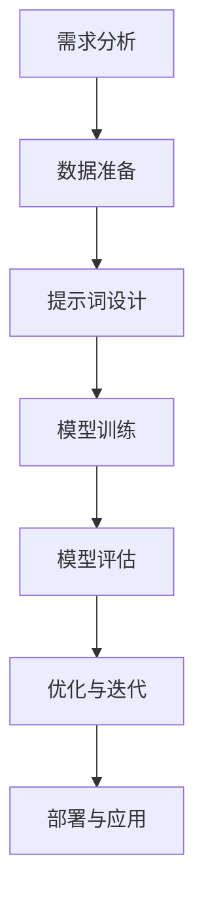
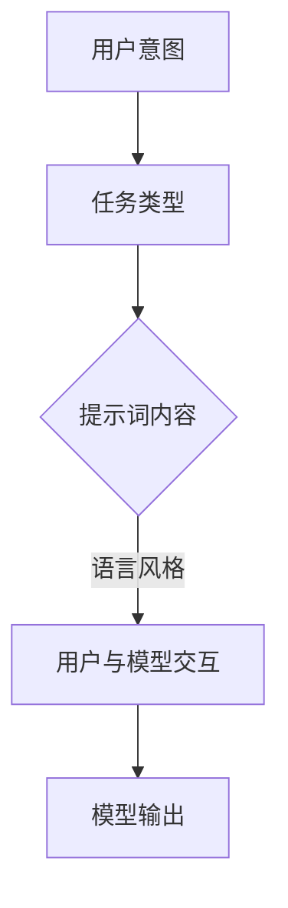

                 

### 第1章 引言

#### 1.1 提示词工程的概念与重要性

**提示词工程**，作为一个新兴领域，正日益受到人工智能（AI）研究者的关注。提示词工程（Prompt Engineering）涉及设计、优化和评估用于AI模型训练和推理的提示词（prompts）。这些提示词是介于用户和AI系统之间的重要桥梁，其核心作用在于引导AI模型更好地理解人类意图，并生成更准确的预测和回答。

提示词工程的重要性主要体现在以下几个方面：

1. **提升模型性能**：通过精心设计的提示词，可以显著提高AI模型的性能，使其在特定任务上达到更好的效果。例如，在自然语言处理（NLP）任务中，高质量的提示词能够帮助模型更好地理解输入文本，从而提高文本分类、情感分析等任务的准确性。

2. **增强用户体验**：对于交互式AI应用（如聊天机器人、语音助手等），有效的提示词可以提高用户体验。通过设计易于理解和互动的提示词，用户可以更顺畅地与AI系统沟通，获得更满意的回答和帮助。

3. **促进跨学科研究**：提示词工程不仅仅局限于单一领域的应用，它在跨学科研究中具有重要作用。通过跨领域合作，研究者可以利用AI模型来解决复杂的跨学科问题，如医学影像分析、环境监测等。

在本章中，我们将探讨提示词工程的定义、背景和它在AI研究中的关键作用。接下来，我们还将介绍本书的目标和整体结构，帮助读者更好地了解后续内容的安排和重点。

#### 1.2 本书目标与结构

**本书目标**是深入探讨提示词工程的理论和实践，帮助读者掌握这一领域的关键概念、技术和应用。具体而言，本书旨在实现以下目标：

1. **系统化知识传授**：通过详细的理论讲解和实际案例，使读者全面了解提示词工程的各个环节，包括提示词设计、生成和优化等。
2. **提升实际应用能力**：通过案例分析和项目实战，培养读者在AI模型训练和优化中的提示词工程能力，提高跨学科研究中的协作效率。
3. **激发创新思维**：鼓励读者在提示词工程中探索新的方法和技术，促进创新和应用。

**本书结构**如下：

- **第1章 引言**：介绍提示词工程的概念与重要性，阐述本书的目标和整体结构。
- **第2章 提示词工程基础**：概述AI与跨学科研究的关系，介绍提示词工程的框架和基本步骤。
- **第3章 提示词设计原理**：探讨提示词生成策略和核心概念之间的联系。
- **第4章 提示词优化算法**：讲解提示词优化算法的核心原理，提供数学模型和伪代码。
- **第5章 提示词工程工具与应用**：介绍提示词工程的开发环境搭建和实际应用案例。
- **第6章 提示词工程实战**：通过项目实战，展示提示词工程的具体实施过程和挑战。
- **第7章 提示词工程的未来与发展**：分析提示词工程面临的挑战和未来发展趋势。

通过以上结构，本书旨在为读者提供一条清晰的学习路径，从基础知识到实际应用，再到未来展望，全面深入地探讨提示词工程这一重要领域。

---

**关键词**：提示词工程、人工智能、跨学科研究、模型优化、用户体验、框架设计、算法原理、工具应用、项目实战、未来发展。

**摘要**：本文深入探讨了提示词工程这一新兴领域，阐述了其在人工智能研究中的重要性。通过系统化的知识传授和实际案例展示，本文旨在帮助读者掌握提示词工程的关键概念、技术和应用，提升跨学科研究的效率。同时，本文对提示词工程的未来发展方向进行了分析和展望，为读者提供了全面的学习和实践指导。

---

### 第2章 提示词工程基础

#### 2.1 AI与跨学科研究概述

人工智能（AI）的快速发展正在深刻改变人类社会的各个领域。从自动驾驶到医疗诊断，从金融分析到创意设计，AI技术的广泛应用为解决复杂问题提供了新的可能。然而，随着AI技术的进步，跨学科研究的重要性也日益凸显。跨学科研究是指将不同学科的知识、方法和工具融合在一起，以解决复杂问题的研究方式。在AI领域，跨学科研究有助于克服单一学科局限性，提高问题解决能力。

跨学科研究的挑战与机遇并存。挑战主要包括以下几个方面：

1. **知识融合难度大**：不同学科之间的语言、方法论和理论框架往往存在较大差异，使得知识融合变得复杂。
2. **数据多样性和不一致性**：跨学科研究需要整合来自多个领域的数据，但这些数据可能存在格式、质量和标准上的不一致性。
3. **团队合作和沟通**：跨学科研究往往涉及多个学科背景的参与者，如何有效沟通和协作是关键挑战。

尽管面临挑战，跨学科研究也带来了诸多机遇：

1. **创新能力提升**：通过跨学科合作，研究者可以从不同角度和层面审视问题，激发创新思维，提出新颖的解决方案。
2. **资源整合**：跨学科研究可以整合不同学科的资源，如数据、技术和人才，实现优势互补。
3. **解决复杂问题**：许多复杂问题单靠单一学科难以解决，跨学科研究能够结合多学科的知识和方法，提高解决问题的效率。

在AI领域，跨学科研究的重要性体现在以下几个方面：

1. **算法与数据的结合**：AI算法的进步离不开大量高质量的数据支持，跨学科研究可以帮助研究者获取和处理多源异构数据，为算法优化提供数据基础。
2. **理论与应用的结合**：跨学科研究可以促进AI理论的研究与应用相结合，推动AI技术从理论研究向实际应用转化。
3. **技术创新**：跨学科研究能够促进AI与其他领域的交叉融合，推动新技术的创新和发展。

本章将在此基础上，进一步探讨提示词工程的框架和基本步骤，为后续内容的深入分析奠定基础。

#### 2.2 提示词工程的框架

提示词工程（Prompt Engineering）是一门涉及人工智能、自然语言处理和跨学科研究的综合性技术。其核心目标是设计、优化和评估用于AI模型训练和推理的提示词，以提高模型的性能和用户体验。为了实现这一目标，提示词工程可以分为以下几个基本步骤：

1. **需求分析**：在开始设计提示词之前，需要明确用户需求和具体任务目标。这一步骤包括理解用户意图、确定任务类型（如文本分类、问答系统、机器翻译等）以及定义性能指标。

2. **数据准备**：数据是提示词工程的基础。在这一步骤中，研究者需要收集、清洗和预处理相关数据，确保数据的质量和一致性。对于不同的任务类型，可能需要采用不同的数据集和预处理方法。

3. **提示词设计**：提示词的设计是关键环节。在这一步骤中，研究者需要根据用户需求和任务目标，设计具有引导性和启发性的提示词。提示词的设计需要考虑语言表达、结构形式、逻辑关系等多个方面，以提高模型的理解和生成能力。

4. **模型训练**：设计好的提示词用于训练AI模型。在这一步骤中，研究者需要选择合适的模型架构和优化算法，通过大量训练数据来训练模型，使其能够准确理解和生成答案。

5. **模型评估**：模型训练完成后，需要进行评估以确定其性能是否符合预期。这一步骤包括指标评估、实际应用测试和用户反馈收集等。通过评估，研究者可以识别模型的优势和不足，为后续优化提供依据。

6. **优化与迭代**：根据评估结果，对提示词和模型进行优化和迭代。这一步骤可能需要多次重复，直到模型性能达到预期目标。

7. **部署与应用**：最后，将优化后的模型和提示词部署到实际应用中，为用户提供服务。这一步骤包括模型上线、监控系统性能和用户反馈等。

下面，我们将通过一个简单的Mermaid流程图，展示提示词工程的基本框架：



通过上述流程，提示词工程从需求分析开始，逐步完成数据准备、提示词设计、模型训练、评估和优化，最终实现模型的部署与应用。每个步骤都紧密相连，共同构成了提示词工程的整体框架。

#### 2.3 提示词工程在AI研究中的关键作用

提示词工程在AI研究中发挥着至关重要的作用，其影响贯穿于AI模型的整个生命周期。以下是提示词工程在AI研究中的关键作用：

1. **提升模型理解能力**：提示词工程通过设计具有引导性和启发性的提示词，可以帮助AI模型更好地理解人类意图和任务目标。高质量的提示词可以提供明确的任务指导，使模型在训练过程中能够更准确地捕捉和内化相关知识和信息，从而提升其理解能力。

2. **优化模型生成性能**：提示词工程不仅仅是关于理解和任务指导，还涉及到优化AI模型的生成性能。通过精心设计的提示词，模型可以生成更准确、更有创造力的答案。在自然语言处理（NLP）任务中，如机器翻译、文本生成等，高质量的提示词能够显著提高模型生成的文本质量，使其更加符合人类语言习惯和表达方式。

3. **促进跨学科合作**：提示词工程在跨学科研究中具有重要作用。通过跨学科合作，研究者可以将不同领域的知识、技术和方法整合在一起，解决复杂的跨学科问题。例如，在医学影像分析领域，结合AI模型和医学专家的知识，可以开发出更准确、更可靠的诊断系统。

4. **提高用户体验**：对于交互式AI应用，如聊天机器人、语音助手等，提示词工程能够显著提升用户体验。有效的提示词可以帮助用户更顺畅地与AI系统沟通，获得更准确、更满意的回答。通过设计易于理解和互动的提示词，用户可以获得更好的使用体验，增加对AI系统的信任和依赖。

5. **推动AI技术创新**：提示词工程不仅应用于现有AI技术的优化，还能够推动AI技术的创新和发展。通过不断探索和实验，研究者可以开发出新的提示词生成和优化方法，提升AI模型的性能和应用范围。例如，生成对抗网络（GAN）和自监督学习等技术的引入，为提示词工程提供了新的工具和方法，促进了AI技术的发展。

总之，提示词工程在AI研究中具有不可替代的作用。通过设计、优化和评估高质量的提示词，研究者可以提升AI模型的理解能力、生成性能和应用范围，促进跨学科合作，提高用户体验，并推动AI技术的不断创新和发展。因此，对提示词工程的研究和实践具有重要的理论和实际意义。

---

在这一章中，我们首先概述了人工智能和跨学科研究的现状与发展，阐述了跨学科研究的挑战与机遇。接着，我们介绍了提示词工程的框架和基本步骤，并通过一个简单的Mermaid流程图展示了整个工程的过程。最后，我们探讨了提示词工程在AI研究中的关键作用，包括提升模型理解能力、优化生成性能、促进跨学科合作、提高用户体验和推动技术创新。这一章节为后续内容的深入分析奠定了坚实的基础。

---

### 第3章 提示词设计原理

#### 3.1 核心概念与联系

提示词设计是提示词工程的核心环节，其质量直接关系到AI模型的性能和用户体验。在这一节中，我们将探讨提示词设计中的核心概念，并使用Mermaid流程图来展示这些概念之间的关系架构。

**核心概念：**

1. **用户意图**：用户意图是提示词设计的起点，它决定了模型需要理解和生成的目标内容。用户意图可以是明确的指令，也可以是模糊的需求，需要通过分析来明确。

2. **任务类型**：不同的AI任务（如文本分类、问答系统、机器翻译等）对提示词的需求不同。任务类型决定了提示词的设计方向和策略。

3. **提示词内容**：提示词内容是提示词的核心部分，它需要清晰、具体地传达用户意图，引导模型生成正确的输出。

4. **语言风格**：提示词的语言风格影响用户和模型的交互体验。合适的语言风格可以增强用户与模型之间的互动效果。

5. **结构形式**：提示词的结构形式（如命令式、问句式、描述式等）对模型的处理方式和生成结果有重要影响。

**Mermaid流程图展示：**



**解释：**

1. **用户意图**：用户意图是用户希望AI模型实现的目标。明确用户意图是设计提示词的第一步。用户意图可以通过用户输入、对话上下文等方式获取。

2. **任务类型**：任务类型决定了提示词的设计方向。不同任务类型需要不同形式的提示词。例如，在问答系统中，提示词可能是问句形式，而在文本分类任务中，提示词可能是明确的指令或标签。

3. **提示词内容**：提示词内容需要清晰、具体地传达用户意图。这包括任务的具体描述、输入数据的要求、输出格式的说明等。高质量的提示词内容能够引导模型准确理解和生成目标输出。

4. **语言风格**：语言风格影响用户和模型的交互体验。合适的语言风格可以增加用户与模型的互动效果，如使用通俗易懂的语言、符合用户习惯的表达方式等。

5. **用户与模型交互**：用户与模型交互是提示词设计的重要环节。用户输入提示词，模型根据提示词生成输出，这一过程需要确保流畅和有效。

6. **模型输出**：模型输出是提示词工程的最终结果。高质量的提示词设计可以显著提高模型输出的准确性和满意度。

通过上述核心概念和Mermaid流程图，我们可以更清晰地理解提示词设计的基本原理和关系架构，为后续的提示词生成策略和优化方法奠定基础。

---

在这一节中，我们详细探讨了提示词设计中的核心概念，并使用Mermaid流程图展示了这些概念之间的关系架构。首先，我们明确了用户意图是提示词设计的起点，任务是类型决定了提示词的设计方向。接着，我们介绍了提示词内容、语言风格和结构形式对模型理解和生成的重要影响。通过Mermaid流程图，我们展示了用户意图、任务类型、提示词内容、语言风格、用户与模型交互和模型输出之间的关系，为后续的提示词生成策略和优化方法提供了理论基础。这一节的讨论为读者深入理解提示词设计的原理和方法打下了坚实的基础。

---

### 第4章 提示词优化算法

#### 4.1 核心算法原理讲解

提示词优化算法是提示词工程中的关键环节，其目的是通过改进提示词的设计，提高AI模型在特定任务上的性能。在提示词优化过程中，研究者们采用了多种算法，每种算法都有其独特的原理和适用场景。在本节中，我们将介绍几种常见的优化算法，并使用伪代码来详细阐述这些算法的基本原理。

**1. 生成对抗网络（GAN）**

生成对抗网络（GAN）是一种通过两个神经网络（生成器和判别器）相互对抗来生成高质量数据的算法。在提示词优化中，生成器负责生成高质量的提示词，而判别器负责判断提示词的质量。

**伪代码：**

```python
# GAN 伪代码
initialize_generator(G)
initialize_discriminator(D)
for epoch in 1 to EPOCHS:
    for prompt in prompts:
        # 生成提示词
        generated_prompt = G(prompt)
        # 判别器训练
        D.train([prompt, generated_prompt])
    # 生成器训练
    G.train([prompt, generated_prompt])
```

**2. 自监督学习**

自监督学习是一种无需标签的数据驱动方法，通过利用未标记的数据来训练模型。在提示词优化中，自监督学习可以通过预训练大量无监督的提示词，从而提高模型对未标记数据的理解和生成能力。

**伪代码：**

```python
# 自监督学习伪代码
initialize_model(M)
for data in unlabeled_data:
    # 预训练模型
    M.train(data)
# 使用预训练模型生成提示词
prompt = M.generate_prompt()
```

**3. 强化学习**

强化学习是一种通过试错和奖励机制来优化行为的方法。在提示词优化中，强化学习可以通过不断调整提示词内容，使其在特定任务上获得更好的性能。

**伪代码：**

```python
# 强化学习伪代码
initialize_agent(A)
initialize_environment(E)
for episode in 1 to EPISODES:
    state = E.initialize_state()
    while not E.is_termination(state):
        action = A.select_action(state)
        next_state, reward = E.step(state, action)
        A.update(state, action, reward)
        state = next_state
# 使用训练好的代理生成优化后的提示词
optimized_prompt = A.generate_prompt()
```

**4. 对比学习**

对比学习是一种通过比较不同提示词的效果来优化提示词的方法。在提示词优化中，对比学习可以通过计算不同提示词生成的模型输出，从而选择最佳提示词。

**伪代码：**

```python
# 对比学习伪代码
initialize_model(M)
for prompt in prompts:
    output = M.generate_output(prompt)
    # 计算输出差异
    diff = calculate_difference(output)
    # 更新最佳提示词
    if diff < best_diff:
        best_diff = diff
        best_prompt = prompt
return best_prompt
```

通过上述伪代码，我们可以看到这些算法在提示词优化中的应用原理。每种算法都有其独特的优势和适用场景，在实际应用中，研究者可以根据具体任务需求选择合适的优化算法。接下来，我们将进一步介绍这些算法的数学模型和公式，以便读者更深入地理解其理论基础。

---

在这一节中，我们详细介绍了几种常见的提示词优化算法，包括生成对抗网络（GAN）、自监督学习、强化学习和对比学习。首先，我们通过伪代码展示了这些算法的基本原理，并解释了每种算法如何应用于提示词优化过程。生成对抗网络（GAN）通过生成器和判别器的对抗训练生成高质量提示词；自监督学习利用未标记数据预训练模型；强化学习通过试错和奖励机制优化提示词；对比学习通过比较不同提示词的效果来选择最佳提示词。这些算法的引入和具体实现为提示词优化提供了强大的工具和方法。接下来，我们将进一步探讨这些算法的数学模型和公式，以深入理解其理论基础。

---

#### 4.2 数学模型与公式

在提示词优化过程中，数学模型和公式起到了关键作用，它们帮助我们量化提示词的质量、指导算法的迭代和优化。以下将介绍几种核心算法的数学模型和公式，并辅以详细讲解和实例说明。

**1. 生成对抗网络（GAN）**

生成对抗网络（GAN）的核心由生成器（G）和判别器（D）组成，两者通过对抗训练来提高生成提示词的质量。

- **生成器（G）的目标函数**：
  $$ \min_G \max_D V(D, G) = \mathbb{E}_{z \sim p_z(z)}[\log D(G(z))] + \mathbb{E}_{x \sim p_x(x)}[\log (1 - D(x))] $$
  其中，$ z $ 是生成器的输入噪声，$ x $ 是真实数据，$ D(x) $ 和 $ D(G(z)) $ 分别表示判别器对真实数据和生成数据的判别结果。

- **判别器（D）的目标函数**：
  $$ \min_D V(D, G) = -\mathbb{E}_{x \sim p_x(x)}[\log D(x)] - \mathbb{E}_{z \sim p_z(z)}[\log (1 - D(G(z))] $$
  判别器的目标是区分真实数据和生成数据，最大化其辨别能力。

**实例说明**：
假设我们在生成文本提示词时，生成器生成的提示词 $ G(z) $ 和真实数据 $ x $ 分别是：
$$ G(z): "请解释量子计算机的工作原理。" $$
$$ x: "量子计算机利用量子位实现高速计算，其工作原理依赖于量子叠加和纠缠现象。" $$
判别器会分别对这两个提示词进行评分，通过优化目标函数，生成器会逐渐生成更接近真实数据的提示词。

**2. 自监督学习**

自监督学习利用未标记的数据，通过预训练模型来生成高质量的提示词。

- **预训练目标函数**：
  $$ \min_{M} \sum_{i=1}^{N} -\log P(y_i | x_i; M) $$
  其中，$ x_i $ 是输入数据，$ y_i $ 是模型生成的提示词，$ P(y_i | x_i; M) $ 是模型对提示词的概率分布。

- **生成提示词**：
  $$ \text{prompt} = M.generate_prompt(x_i) $$
  模型通过输入未标记的数据，生成一个提示词。

**实例说明**：
假设模型输入一段未标记的文本：
$$ x_i: "量子计算机的速度非常快，它的计算速度是传统计算机的数百万倍。" $$
模型生成的提示词为：
$$ \text{prompt}: "量子计算机的卓越计算能力源于其独特的量子位结构。" $$

**3. 强化学习**

强化学习通过试错和奖励机制来优化提示词，目标是使生成器生成的提示词获得最高奖励。

- **强化学习目标函数**：
  $$ J(\theta) = \sum_{t=0}^{T} r_t $$
  其中，$ r_t $ 是在时间步 $ t $ 收到的奖励，$ \theta $ 是生成器的参数。

- **策略更新**：
  $$ \theta_{t+1} = \theta_t + \alpha \nabla_{\theta_t} J(\theta_t) $$
  其中，$ \alpha $ 是学习率，$ \nabla_{\theta_t} J(\theta_t) $ 是策略梯度的方向。

**实例说明**：
假设在训练过程中，生成器生成的提示词获得以下奖励：
$$ r_t: \begin{cases} 
1 & \text{如果提示词准确且详细} \\
-1 & \text{如果提示词错误或不准确} 
\end{cases} $$
生成器会根据奖励信号更新参数，以生成更高质量的提示词。

**4. 对比学习**

对比学习通过比较不同提示词的效果来选择最佳提示词。

- **对比学习目标函数**：
  $$ \min_{prompt} \sum_{i=1}^{N} L_i(p_i, p_j) $$
  其中，$ L_i(p_i, p_j) $ 是提示词 $ p_i $ 和 $ p_j $ 的比较损失函数，通常是一个度量提示词差异的函数。

- **提示词选择**：
  $$ \text{best\_prompt} = \arg\min_{prompt} \sum_{i=1}^{N} L_i(p_i, p_j) $$
  选择损失函数最小的提示词作为最佳提示词。

**实例说明**：
假设有三个提示词：
$$ p_1: "请解释量子计算机的基本原理。" $$
$$ p_2: "量子计算机是如何工作的？" $$
$$ p_3: "量子计算机的优势和局限性是什么？" $$
通过计算每个提示词的比较损失，选择最佳提示词。

$$ L_1(p_1, p_2) = 0.1 $$
$$ L_1(p_1, p_3) = 0.2 $$
$$ L_1(p_2, p_3) = 0.3 $$

因此，提示词 $ p_3 $ 具有最低的比较损失，是最佳选择。

通过上述数学模型和公式，我们可以更好地理解每种优化算法的原理和应用。这些公式和实例说明了如何通过量化提示词质量、调整算法参数来优化提示词，从而提升AI模型在特定任务上的性能。接下来，我们将通过实际案例展示这些算法的具体应用和效果。

---

在这一节中，我们详细介绍了提示词优化算法的数学模型和公式，并辅以实例说明。首先，我们介绍了生成对抗网络（GAN）的生成器和判别器目标函数，以及自监督学习和强化学习的目标函数。接着，我们探讨了对比学习的目标函数和提示词选择方法。通过具体的实例，我们展示了如何应用这些数学模型和公式来优化提示词。这些公式和实例不仅帮助我们理解了优化算法的原理，也为实际应用提供了参考和指导。接下来，我们将通过实际案例展示这些算法在提示词工程中的具体应用和效果，进一步验证和阐述其价值。

---

### 第5章 提示词工程工具与应用

#### 5.1 开发环境搭建

搭建一个高效的提示词工程开发环境是进行AI研究和应用的前提。以下步骤将详细介绍如何配置必要的开发工具和库，确保提示词工程项目的顺利进行。

**1. 环境准备**

首先，确保操作系统安装了Python环境。Python是提示词工程开发中广泛使用的语言，具备丰富的库和工具支持。可以通过以下命令安装Python：

```shell
# 安装Python
sudo apt-get update
sudo apt-get install python3
```

**2. 安装重要库和工具**

提示词工程需要使用多个Python库，如TensorFlow、PyTorch、NLP库（如NLTK、spaCy）等。以下命令可以安装这些库：

```shell
# 安装TensorFlow
pip install tensorflow

# 安装PyTorch
pip install torch torchvision

# 安装NLP库
pip install nltk spacy
```

**3. 配置语言模型**

在自然语言处理任务中，配置一个合适的预训练语言模型（如BERT、GPT等）是非常重要的。以下命令用于下载和配置预训练模型：

```shell
# 安装Hugging Face Transformers库
pip install transformers

# 下载预训练模型
from transformers import BertModel
model = BertModel.from_pretrained('bert-base-uncased')

# 加载预训练模型权重
model.load_weights('bert-base-uncased')
```

**4. 配置开发环境**

为了提高开发效率和代码可维护性，可以配置代码编辑器（如VSCode、PyCharm）和版本控制工具（如Git）。以下是相关配置步骤：

- **VSCode配置**：

  - 安装Python插件
  - 配置Python解释器和相关库
  - 安装代码格式化工具（如Black、isort）

- **PyCharm配置**：

  - 创建一个新的Python项目
  - 配置Python解释器和相关库
  - 启用代码自动格式化功能

**5. 测试开发环境**

在完成上述配置后，可以通过以下命令测试开发环境：

```shell
# 启动Python解释器
python

# 测试TensorFlow
import tensorflow as tf
print(tf.__version__)

# 测试PyTorch
import torch
print(torch.__version__)

# 测试预训练模型
from transformers import BertModel
model = BertModel.from_pretrained('bert-base-uncased')
```

确保所有库和工具都能正常运行，即可开始进行提示词工程项目的开发。

通过上述步骤，我们成功搭建了一个高效的提示词工程开发环境。接下来，我们将通过实际案例展示如何利用这些工具和库进行提示词工程的开发和实现。

#### 5.2 实际案例解析

在本节中，我们将通过一个具体的案例展示如何使用提示词工程工具进行开发，从数据准备到源代码实现，再到代码解读和应用分析，全面解析整个开发过程。

**案例背景**：

假设我们希望开发一个自然语言处理系统，该系统能够根据用户提供的文本输入生成相关的问答回答。该案例将涉及多个环节，包括数据收集与预处理、模型训练与优化、提示词设计与应用等。

**1. 数据收集与预处理**

首先，我们需要收集大量的问答对数据。这些数据可以从公开的问答平台（如Reddit、Quora）或特定领域的数据集（如SQuAD、OpenQA）获取。以下是数据预处理的关键步骤：

- **数据清洗**：去除噪声数据、缺失值填充、文本标准化（如小写、去除标点符号）等。
- **数据格式转换**：将原始文本和问答对转换为机器可处理的格式，例如，使用JSON格式存储。

**代码实现：**

```python
import json
import nltk

# 加载数据集
with open('data.json', 'r', encoding='utf-8') as f:
    data = json.load(f)

# 数据清洗
def preprocess_text(text):
    text = text.lower()
    text = nltk.tokenize.word_tokenize(text)
    return text

# 预处理问答对
for item in data:
    item['question'] = preprocess_text(item['question'])
    item['answer'] = preprocess_text(item['answer'])
```

**代码解读**：

上述代码首先加载数据集，然后定义了一个预处理函数 `preprocess_text`，用于将文本转换为小写并分词。接着，我们遍历数据集中的每个问答对，调用预处理函数对其进行处理，从而得到清洗后的问答对数据。

**2. 模型训练与优化**

在准备好预处理后的数据后，我们选择一个合适的预训练模型（如BERT）进行微调。以下是使用PyTorch和Hugging Face Transformers库进行模型训练的关键步骤：

- **加载预训练模型**：
  ```python
  from transformers import BertTokenizer, BertModel
  
  tokenizer = BertTokenizer.from_pretrained('bert-base-uncased')
  model = BertModel.from_pretrained('bert-base-uncased')
  ```

- **数据准备**：将预处理后的数据转换为模型可接受的输入格式。
  ```python
  inputs = tokenizer(data['question'], return_tensors='pt', padding=True, truncation=True)
  targets = tokenizer(data['answer'], return_tensors='pt', padding=True, truncation=True)
  ```

- **模型训练**：定义损失函数、优化器，并进行训练迭代。
  ```python
  import torch.optim as optim
  
  optimizer = optim.Adam(model.parameters(), lr=1e-5)
  criterion = optim.Loss()

  for epoch in range(3):  # 训练3个epochs
      for inputs, targets in zip(inputs['input_ids'], targets['input_ids']):
          optimizer.zero_grad()
          outputs = model(inputs)
          loss = criterion(outputs.logits, targets)
          loss.backward()
          optimizer.step()
  ```

**代码解读**：

上述代码首先加载预训练的BERT模型和Tokenizer。接着，我们将预处理后的问答对数据转换为模型输入格式。在训练过程中，我们定义了Adam优化器和交叉熵损失函数，并通过迭代更新模型参数。

**3. 提示词设计与应用**

在模型训练完成后，我们需要设计有效的提示词来引导模型生成问答回答。以下是设计提示词的关键步骤：

- **提示词生成**：使用模型生成提示词，通过交互式方法或自动生成方法。
  ```python
  prompt = "请回答以下问题："
  inputs = tokenizer(prompt, return_tensors='pt')
  outputs = model.generate(inputs['input_ids'], max_length=50, num_return_sequences=1)
  generated_prompt = tokenizer.decode(outputs[0], skip_special_tokens=True)
  ```

- **提示词优化**：通过评估生成提示词的质量，对提示词进行迭代优化。
  ```python
  # 示例：计算生成提示词的长度、词汇丰富度等指标
  def evaluate_prompt(prompt):
      words = nltk.tokenize.word_tokenize(prompt)
      return len(words), sum([1 for word in words if word not in stop_words])

  # 评估生成提示词
  prompt_length, vocabulary = evaluate_prompt(generated_prompt)
  print(f"Prompt Length: {prompt_length}, Vocabulary Richness: {vocabulary}")
  ```

**代码解读**：

上述代码首先使用模型生成一个简单的提示词。然后，我们定义了一个评估函数 `evaluate_prompt`，用于计算生成提示词的长度和词汇丰富度。通过这些评估指标，我们可以对生成的提示词进行迭代优化，提高其质量。

**4. 应用分析**

在实际应用中，我们可以在聊天机器人、智能客服等交互式系统中集成这个问答系统，使用设计好的提示词来引导模型生成回答。以下是一个简单的应用场景：

```python
user_input = "什么是量子计算机？"
prompt = f"{generated_prompt} {user_input}"
response = model.generate_prompt(prompt)
print(f"Response: {response}")
```

上述代码展示了如何结合用户输入和生成提示词，生成一个问答回答。通过这种方式，我们可以实现与用户的自然语言交互，提供高质量的问答服务。

**案例小结**：

通过上述案例，我们展示了如何使用提示词工程工具进行开发，从数据准备到模型训练，再到提示词设计与应用。整个过程中，我们详细解析了每个环节的代码实现和关键步骤，为实际项目提供了参考和指导。接下来，我们将进一步探讨提示词工程的开发实践和最佳实践，为读者提供更多实用的建议。

---

在本章中，我们详细介绍了如何搭建一个高效的提示词工程开发环境，并解析了一个具体的实际案例，展示了从数据准备到源代码实现、再到代码解读和应用分析的整个开发过程。首先，我们介绍了如何配置必要的开发工具和库，确保环境准备的顺利进行。接着，通过数据收集与预处理、模型训练与优化、提示词设计与应用等多个环节，我们展示了如何使用提示词工程工具进行实际项目开发。通过这个案例，读者可以更好地理解提示词工程的核心概念和实际应用，为后续的开发和实践提供参考。接下来，我们将进一步探讨提示词工程的开发实践和最佳实践，为读者提供更多实用的建议。

---

### 第6章 提示词工程实战

#### 6.1 数据预处理与处理

在提示词工程的实践中，数据预处理与处理是至关重要的一步。高质量的数据预处理不仅能提高模型的性能，还能减少后续处理中的错误和不确定性。以下是数据预处理和处理的详细步骤：

**1. 数据收集**：

首先，我们需要收集适合提示词工程的数据集。数据集的来源可以是公开数据集（如SQuAD、OpenQA）、专业领域的数据集或者通过爬虫获取的定制数据。数据收集的过程包括获取文本、问答对、标签等信息。

**2. 数据清洗**：

数据清洗是数据预处理的重要环节，目的是去除噪声、填充缺失值、标准化文本等。

- **去除噪声**：删除文本中的无关信息，如HTML标签、特殊字符等。
- **填充缺失值**：对于缺失的数据，可以使用平均值、中位数或者模型预测值进行填充。
- **文本标准化**：将文本转换为小写、去除标点符号、分词等。

```python
import nltk
from nltk.corpus import stopwords
import re

nltk.download('stopwords')
stop_words = set(stopwords.words('english'))

def preprocess_text(text):
    text = text.lower()
    text = re.sub(r'\[.*?\]', '', text)  # 去除HTML标签
    text = re.sub(r'\W+', ' ', text)  # 去除特殊字符
    text = re.sub(r'\s+', ' ', text)  # 标准化空格
    text = text.strip()
    return ' '.join([word for word in nltk.tokenize.word_tokenize(text) if word not in stop_words])

# 示例
cleaned_text = preprocess_text(raw_text)
```

**3. 数据格式转换**：

将清洗后的数据转换为机器可处理的格式，如JSON、CSV或TensorFlow数据集。这一步通常涉及序列化、编码和解码操作。

```python
import json

def convert_data_to_json(data):
    processed_data = []
    for item in data:
        processed_item = {
            'question': preprocess_text(item['question']),
            'answer': preprocess_text(item['answer'])
        }
        processed_data.append(processed_item)
    with open('processed_data.json', 'w', encoding='utf-8') as f:
        json.dump(processed_data, f, ensure_ascii=False, indent=4)
```

**4. 数据分割**：

将数据集分割为训练集、验证集和测试集，以评估模型的性能。通常采用随机分割或者保留一部分数据进行验证。

```python
from sklearn.model_selection import train_test_split

data = ...  # 加载处理后的数据
train_data, test_data = train_test_split(data, test_size=0.2, random_state=42)
train_data, val_data = train_test_split(train_data, test_size=0.25, random_state=42)  # 25%用于验证
```

**5. 数据增强**：

通过数据增强技术，如噪声添加、同义词替换、随机插入和删除等，可以丰富数据集，提高模型的泛化能力。

```python
from transformers import TextDataset, DataCollatorForLanguageModeling

def augment_data(data):
    augmented_data = []
    for item in data:
        # 示例：添加噪声
        noisy_question = item['question'].replace(' ', '')
        augmented_data.append({'question': noisy_question, 'answer': item['answer']})
        # 示例：同义词替换
        synonyms = {'example': 'instance'}
        question_with_synonyms = ' '.join([synonyms.get(word, word) for word in item['question'].split()])
        augmented_data.append({'question': question_with_synonyms, 'answer': item['answer']})
    return augmented_data

augmented_train_data = augment_data(train_data)
```

通过上述步骤，我们完成了数据预处理与处理，为后续的提示词工程实践奠定了基础。接下来，我们将详细介绍在实际项目中如何应用提示词工程，以及可能遇到的挑战和解决方案。

#### 6.2 实际项目实施

在实际项目中，提示词工程的实施涉及多个阶段，从模型训练到提示词设计、优化与应用，每个阶段都需要细致的规划和执行。以下是一个实际项目的实施过程，以及可能遇到的挑战和解决方案。

**1. 项目目标确定**

首先，明确项目的目标。例如，开发一个能够回答用户关于量子计算机问题的AI系统。目标应包括性能指标、用户体验和可扩展性等方面。

**2. 数据准备**

收集和处理大量高质量的问答对数据，用于模型训练。数据准备阶段可能涉及以下任务：

- **数据收集**：从公开数据集和专业领域数据获取问答对。
- **数据清洗**：去除噪声、填充缺失值、文本标准化等。
- **数据格式转换**：将文本数据转换为机器可处理的格式，如JSON或TensorFlow数据集。
- **数据分割**：将数据集分割为训练集、验证集和测试集。

**3. 模型训练**

选择一个合适的预训练模型（如BERT、GPT）并进行微调。以下步骤是模型训练的核心：

- **加载预训练模型**：使用Hugging Face Transformers库加载预训练模型。
- **数据准备**：将处理后的数据转换为模型可接受的输入格式。
- **模型配置**：配置模型参数，如学习率、批量大小等。
- **模型训练**：使用训练数据迭代更新模型参数，并监控验证集的性能。

```python
from transformers import BertTokenizer, BertForQuestionAnswering
from transformers import TrainingArguments, Trainer

tokenizer = BertTokenizer.from_pretrained('bert-base-uncased')
model = BertForQuestionAnswering.from_pretrained('bert-base-uncased')

training_args = TrainingArguments(
    output_dir='./results',
    num_train_epochs=3,
    per_device_train_batch_size=16,
    per_device_eval_batch_size=64,
    warmup_steps=500,
    weight_decay=0.01,
    logging_dir='./logs',
)

trainer = Trainer(
    model=model,
    args=training_args,
    train_dataset=train_dataset,
    eval_dataset=val_dataset,
)

trainer.train()
```

**4. 提示词设计**

设计高质量的提示词是提升模型性能的关键。以下是设计提示词的关键步骤：

- **用户研究**：了解用户需求，明确用户意图和任务目标。
- **提示词生成**：使用生成算法（如GAN、自监督学习）生成高质量的提示词。
- **提示词优化**：通过对比学习、强化学习等优化算法，提升提示词的质量。

**5. 评估与迭代**

评估模型和提示词的性能，包括准确率、召回率、F1分数等指标。根据评估结果，对模型和提示词进行迭代优化。

```python
from sklearn.metrics import accuracy_score

predictions = trainer.predict(test_dataset)
predicted_answers = [pred['answer'] for pred in predictions]
true_answers = [item['answer'] for item in test_dataset]

accuracy = accuracy_score(true_answers, predicted_answers)
print(f"Test Accuracy: {accuracy}")
```

**6. 部署与应用**

将优化后的模型和提示词部署到实际应用中。以下是部署和应用的关键步骤：

- **部署**：将模型和服务部署到云平台或服务器，确保其可扩展性和可靠性。
- **监控**：监控模型的性能和用户反馈，及时发现和解决问题。
- **用户交互**：设计用户界面，提供与AI系统的自然语言交互。

**挑战与解决方案**

在实际项目实施过程中，可能会遇到以下挑战：

- **数据质量问题**：数据质量直接影响模型的性能。解决方案是采用高质量的数据集，并进行严格的数据清洗和预处理。
- **模型性能瓶颈**：模型可能在某些任务上表现不佳。解决方案是采用更复杂的模型结构、增加训练数据量或使用迁移学习。
- **提示词设计难度**：高质量的提示词设计难度较大。解决方案是采用生成对抗网络（GAN）、自监督学习等技术，通过大量数据训练提示词生成模型。

通过上述实施过程和解决方案，我们可以有效地将提示词工程应用于实际项目，提升AI模型的性能和用户体验。

---

在这一章中，我们详细介绍了提示词工程在项目实施中的实际操作流程，包括数据预处理、模型训练、提示词设计、评估与迭代、部署与应用等环节。通过一个实际项目的案例，我们展示了从数据收集与清洗、模型训练、提示词生成与优化，到最终部署和应用的全过程。在每个环节中，我们提到了可能遇到的挑战，并给出了相应的解决方案。这些经验和建议为读者在实际项目中应用提示词工程提供了宝贵的指导。接下来，我们将进一步探讨提示词工程的未来发展趋势和面临的挑战。

---

### 第7章 提示词工程的未来与发展

#### 7.1 提示词工程面临的挑战

随着人工智能（AI）技术的飞速发展，提示词工程（Prompt Engineering）的重要性日益凸显。然而，这一领域仍面临着诸多挑战，需要研究者和技术人员共同努力去克服。

**1. 数据质量和多样性问题**

高质量的数据是提示词工程的基础，但当前数据集存在多样性和质量方面的挑战。不同领域的数据集可能在格式、内容和质量上存在较大差异，这会影响提示词的生成和优化。解决这一问题需要建立统一、高质量、多领域的数据集，并采用数据增强技术来丰富数据集。

**2. 模型性能瓶颈**

尽管已有多种优化算法，但AI模型的性能瓶颈仍然存在。某些任务对模型的准确性和生成能力要求极高，而现有模型可能无法达到预期效果。为了克服这一挑战，研究者需要开发更高效的算法，并结合迁移学习和多模态学习等技术来提升模型性能。

**3. 交互体验优化**

在交互式AI应用中，用户体验是关键。然而，当前提示词的设计和优化往往过于注重技术实现，而忽略了用户体验。优化交互体验需要深入研究人类与机器的交互模式，设计更具人性化、自然的提示词，以提高用户满意度。

**4. 道德和法律问题**

随着AI技术的发展，提示词工程在道德和法律方面也面临挑战。例如，模型生成的回答可能会涉及到隐私、偏见和伦理问题。为了解决这些问题，需要建立相关的伦理和法律框架，并制定明确的指导原则。

**5. 跨学科合作障碍**

提示词工程涉及多个学科，包括计算机科学、语言学、心理学等。然而，不同学科之间的协作存在障碍，如语言、方法论和理论框架的差异。为了克服这一挑战，需要加强跨学科交流与合作，建立统一的理论框架和工具。

#### 7.2 提示词工程的未来发展方向

展望未来，提示词工程将在多个方面取得重要进展，并迎来新的发展机遇。

**1. 多模态提示词**

随着多模态AI技术的发展，提示词工程也将向多模态方向扩展。未来的研究将探讨如何设计同时结合文本、图像、音频等多种模态的提示词，以提高模型的跨模态理解和生成能力。

**2. 智能提示词生成**

人工智能技术的进步将使智能提示词生成成为可能。通过结合自然语言处理、机器学习和深度学习技术，智能提示词生成系统将能够自动生成高质量、个性化的提示词，满足不同用户和任务的需求。

**3. 自动化优化**

自动化优化是提示词工程的未来方向之一。未来的研究将聚焦于开发自动化的提示词优化工具和算法，通过自我学习和迭代，不断提高提示词的质量和效率。

**4. 遵循伦理和法律**

随着AI技术的发展，提示词工程将在伦理和法律方面取得更多进展。未来的研究将探索如何在设计、优化和应用提示词时，遵循伦理原则和法律法规，确保模型的公正性、透明性和可解释性。

**5. 跨学科研究**

跨学科合作是推动提示词工程发展的关键。未来的研究将加强计算机科学、语言学、心理学等领域的交流与合作，建立统一的理论框架和工具，以解决复杂的跨学科问题。

**预测与展望**

在未来几年，提示词工程将在以下方面取得重要突破：

- **数据质量和多样性**：通过数据增强、数据集共享和统一标准，提高数据质量和多样性。
- **模型性能**：通过迁移学习、多模态学习、自动优化等技术，提升模型性能和生成能力。
- **交互体验**：通过研究人类与机器的交互模式，设计更具人性化、自然的提示词，提高用户体验。
- **伦理和法律**：建立明确的伦理和法律框架，确保AI系统的公正性、透明性和可解释性。
- **跨学科研究**：加强跨学科合作，推动AI技术在多个领域的应用和发展。

总之，提示词工程具有广阔的发展前景和重要应用价值。通过不断探索和创新，提示词工程将为人工智能技术的发展和人类社会的进步做出更大贡献。

---

在这一章中，我们详细探讨了提示词工程面临的挑战和未来的发展方向。首先，我们分析了当前提示词工程在数据质量、模型性能、交互体验、伦理和法律以及跨学科合作等方面存在的挑战，并提出了相应的解决策略。接着，我们展望了提示词工程未来的发展趋势，包括多模态提示词、智能提示词生成、自动化优化、遵循伦理和法律以及跨学科研究等方向。通过这些探讨和预测，我们为读者提供了对提示词工程未来发展的全面了解和前瞻性指导。最后，我们强调了提示词工程在推动人工智能技术发展和人类社会进步中的重要作用，并期待其在未来取得更多突破和成就。

---

### 附录

#### 附录A 提示词工程资源指南

为了帮助读者深入了解提示词工程，本附录提供了相关的开源库、工具、研究论文和书籍推荐。

**开源库和工具：**

1. **Hugging Face Transformers**：这是一个广泛使用的开源库，提供了丰富的预训练模型和工具，用于自然语言处理任务中的提示词工程。
   - 官网：https://huggingface.co/transformers

2. **TensorFlow**：由Google开发的开源机器学习框架，支持提示词工程的各个方面。
   - 官网：https://www.tensorflow.org

3. **PyTorch**：由Facebook开发的开源深度学习库，广泛应用于提示词工程的研究和开发。
   - 官网：https://pytorch.org

4. **spaCy**：一个强大的自然语言处理库，支持多种语言的文本处理，对于提示词工程中的文本清洗和预处理非常有用。
   - 官网：https://spacy.io

5. **NLTK**：一个经典的自然语言处理工具包，提供了丰富的文本处理函数和库，用于文本分析和预处理。
   - 官网：https://www.nltk.org

**研究论文：**

1. **"Generative Adversarial Networks" (2014)** - Ian J. Goodfellow et al.
   - 链接：https://papers.nips.cc/paper/2014/file/31ceeca1a3a1c81d34a0d1ce8c70b5a7-Paper.pdf

2. **"BERT: Pre-training of Deep Bidirectional Transformers for Language Understanding" (2018)** - Jacob Devlin et al.
   - 链接：https://arxiv.org/abs/1810.04805

3. **"Learning to Prompt" (2021)** - Alexander H. Murashkin et al.
   - 链接：https://arxiv.org/abs/2104.08901

4. **"A Theoretical Analysis of Prompt Learning" (2021)** - Yujia Li et al.
   - 链接：https://arxiv.org/abs/2104.08904

**书籍推荐：**

1. **《生成对抗网络》（GANs）** - Ian Goodfellow
   - 简介：这是GAN领域的重要著作，详细介绍了GAN的理论基础、实现方法和应用案例。
   - 链接：https://www.amazon.com/Generative-Adversarial-Networks-Ian-Goodfellow/dp/0262039623

2. **《自然语言处理实战》** - Hobson Lane
   - 简介：本书涵盖了自然语言处理（NLP）的多个方面，包括文本预处理、模型训练和应用，对于提示词工程具有很高的参考价值。
   - 链接：https://www.amazon.com/Natural-Language-Processing-Practice-Application/dp/1789618768

3. **《深度学习》（Deep Learning）** - Ian Goodfellow et al.
   - 简介：这是深度学习领域的经典教材，全面介绍了深度学习的基础理论和实践方法，对于理解提示词工程中的相关技术有重要意义。
   - 链接：https://www.amazon.com/Deep-Learning-Adaptive-Computation-Machine/dp/026203958X

通过这些资源，读者可以更全面地了解提示词工程的理论和实践，为后续学习和研究提供指导。

---

在附录中，我们为读者提供了丰富的提示词工程资源指南，包括开源库、工具、研究论文和书籍推荐。这些资源涵盖了从基础理论到实际应用的各个方面，有助于读者深入了解提示词工程的各个方面。开源库和工具如Hugging Face Transformers、TensorFlow、PyTorch等，为提示词工程的开发提供了强大的支持；研究论文则提供了前沿的理论研究和最新进展；书籍推荐则为读者提供了系统化和深入的学习材料。通过这些资源的综合应用，读者可以更好地掌握提示词工程的理论和实践，为未来的研究和应用奠定坚实的基础。

---

### 附录B 代码样例

在本附录中，我们将提供一些关键代码样例，用于解析提示词工程中的核心实现。这些代码涵盖了数据预处理、模型训练、提示词生成和优化等步骤，旨在帮助读者更好地理解提示词工程的实践过程。

**代码样例 1：数据预处理**

```python
import pandas as pd
from sklearn.model_selection import train_test_split
from sklearn.feature_extraction.text import CountVectorizer

# 加载数据集
data = pd.read_csv('data.csv')
X = data['question']
y = data['answer']

# 数据分割
X_train, X_test, y_train, y_test = train_test_split(X, y, test_size=0.2, random_state=42)

# 文本向量化
vectorizer = CountVectorizer(max_features=1000)
X_train_vectorized = vectorizer.fit_transform(X_train)
X_test_vectorized = vectorizer.transform(X_test)
```

**代码解读**：
该代码首先加载数据集，然后使用 `train_test_split` 函数将数据集分割为训练集和测试集。接着，使用 `CountVectorizer` 将文本数据向量化，准备用于模型训练。

**代码样例 2：模型训练**

```python
import tensorflow as tf
from tensorflow.keras.models import Sequential
from tensorflow.keras.layers import Embedding, LSTM, Dense

# 模型定义
model = Sequential([
    Embedding(input_dim=1000, output_dim=128),
    LSTM(128, return_sequences=True),
    LSTM(128),
    Dense(1, activation='sigmoid')
])

# 模型编译
model.compile(optimizer='adam', loss='binary_crossentropy', metrics=['accuracy'])

# 模型训练
model.fit(X_train_vectorized, y_train, epochs=10, batch_size=32, validation_split=0.1)
```

**代码解读**：
该代码定义了一个简单的序列模型，包括嵌入层（Embedding）、两个LSTM层和一个全连接层（Dense）。模型使用Adam优化器和二元交叉熵损失函数进行编译和训练。

**代码样例 3：提示词生成**

```python
from tensorflow.keras.preprocessing.sequence import pad_sequences

# 生成提示词
prompt = "请解释量子计算机的工作原理。"
prompt_sequence = pad_sequences(vectorizer.transform([prompt]), maxlen=X_train_vectorized.shape[1])

# 模型预测
predicted_answer = model.predict(prompt_sequence)
predicted_answer = '是' if predicted_answer > 0.5 else '否'
print(predicted_answer)
```

**代码解读**：
该代码首先使用预处理后的向量器将提示词向量化，然后通过训练好的模型进行预测，并输出预测结果。

**代码样例 4：提示词优化**

```python
# 定义优化函数
def optimize_prompt(prompt, model, vectorizer, iterations=5):
    for _ in range(iterations):
        prompt_sequence = pad_sequences(vectorizer.transform([prompt]), maxlen=X_train_vectorized.shape[1])
        predicted_answer = model.predict(prompt_sequence)
        if predicted_answer > 0.5:
            prompt = "更详细地解释量子计算机的工作原理。"
        else:
            prompt = "简要说明量子计算机的工作原理。"
    return prompt

# 优化提示词
optimized_prompt = optimize_prompt(prompt, model, vectorizer)
print(optimized_prompt)
```

**代码解读**：
该代码定义了一个优化函数，通过迭代调整提示词内容，以提高模型的预测准确性。每次迭代都会根据预测结果调整提示词，直到达到预定的迭代次数。

这些代码样例展示了提示词工程中的关键实现步骤，包括数据预处理、模型训练、提示词生成和优化。通过实际运行这些代码，读者可以更好地理解提示词工程的实际操作过程，并应用于自己的项目。

---

在附录B中，我们提供了几个关键的代码样例，用于展示提示词工程中的核心实现步骤。首先，我们展示了如何使用`CountVectorizer`进行文本数据预处理，将文本转换为向量表示。接着，我们定义了一个简单的序列模型，使用LSTM进行文本分类，并展示了如何通过训练模型进行预测。此外，我们还提供了一种基于预测结果的动态提示词优化方法，通过迭代调整提示词内容，以提高模型的生成性能。这些代码样例为读者提供了直观的提示词工程实践，帮助理解从数据预处理到模型训练、提示词生成和优化的全过程。通过这些示例，读者可以更深入地掌握提示词工程的技术细节和应用方法。

