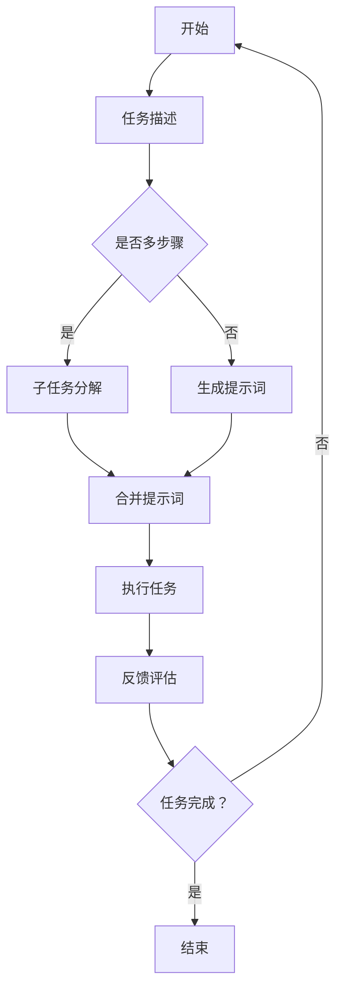
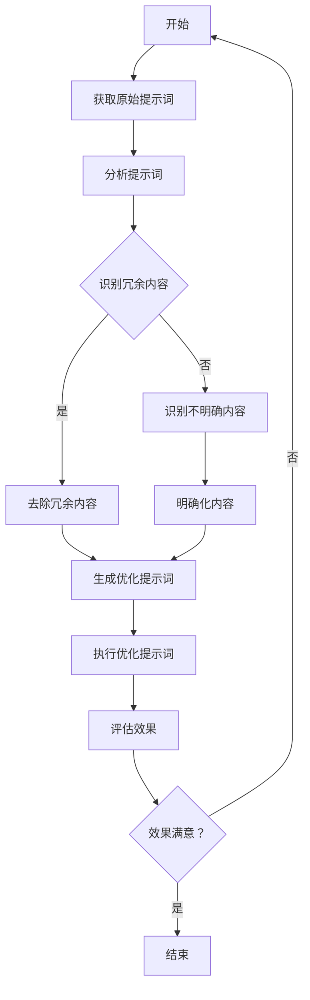

                 

### 提示词工程：处理多步骤任务分解

#### 关键词
- 提示词工程
- 多步骤任务分解
- 自动化流程
- 提示词设计
- 提示词优化

#### 摘要
本文旨在深入探讨提示词工程在处理多步骤任务分解中的关键作用。首先，我们将介绍提示词工程的基本概念和重要性，随后详细阐述多步骤任务分解的基本原理和原则。接下来，我们将探讨提示词设计与优化的核心原则，以及提示词工程在不同应用场景中的实际应用。此外，还将介绍提示词工程工具和框架的选择标准，并分析当前面临的挑战和未来的发展趋势。最后，通过案例研究展示提示词工程的实践应用，并总结出最佳实践策略和未来展望。

## 第一部分：概述

### 第1章 提示词工程基础

#### 1.1 提示词工程的定义与重要性

提示词工程（Prompt Engineering）是指设计、开发和优化用于引导和自动化多步骤任务的提示词（Prompts）的工程学科。提示词在计算机程序中起着至关重要的作用，它们是用户与系统交互的桥梁，能够明确地指示系统执行特定的任务。

#### 定义

在提示词工程中，提示词（Prompt）是指用来引导系统完成某个任务的一段文本或指令。这些提示词通常由一组指令、参数和上下文信息组成，它们可以帮助系统理解任务的背景和目标，从而更准确地执行任务。

#### 重要性

提示词工程在自动化流程中具有关键的重要性，主要体现在以下几个方面：

1. **提高效率**：通过精确的提示词，系统能够快速准确地理解任务要求，从而减少处理时间，提高整体工作效率。
2. **减少错误**：明确的提示词可以减少由于理解错误导致的错误操作，降低系统的错误率。
3. **灵活性**：良好的提示词设计允许系统在执行任务时进行自适应调整，以适应不同的执行环境和条件。

#### 目标

提示词工程的主要目标是设计出既准确又灵活的提示词，以实现以下目标：

1. **任务执行的准确性**：确保系统能够按照预期的目标完成任务。
2. **任务的执行效率**：通过优化提示词，使系统在执行任务时能够更快、更高效。
3. **易用性**：用户界面友好，提示词易于理解和操作。

### 第2章 多步骤任务分解

#### 2.1 任务分解的基本概念

任务分解（Task Decomposition）是指将一个复杂的任务划分为一系列相互关联的子任务，以便更好地管理和解决。在多步骤任务分解中，每个子任务都是任务整体的一部分，但它们之间往往存在一定的层次结构和依赖关系。

#### 分解层次

任务分解可以根据任务的复杂度不同，划分为不同的层次：

1. **高层分解**：将任务分解为几个主要的子任务，每个子任务都代表任务的核心功能。
2. **中层分解**：在高层分解的基础上，进一步将每个主要子任务分解为更具体的子任务。
3. **底层分解**：将中层分解得到的子任务进一步细化为具体的工作步骤。

#### 分解原则

在进行任务分解时，需要遵循以下原则：

1. **明确性**：每个子任务的目标必须清晰明确，以便系统理解和执行。
2. **完整性**：所有子任务必须能够完整覆盖原始任务，确保任务不会被遗漏或重复。
3. **独立性**：子任务之间应尽可能独立，减少相互依赖和冲突，以便更容易管理和调试。

### 第3章 提示词设计与优化

#### 3.1 提示词设计原则

提示词的设计对于任务的成功执行至关重要。在设计提示词时，应遵循以下原则：

1. **明确性**：提示词应精确传达任务要求，避免歧义和模糊性，确保系统能够正确理解。
2. **完整性**：提示词应包含完成任务所需的所有信息，避免系统因信息不全而无法执行任务。
3. **灵活性**：提示词应允许一定程度的调整和变化，以适应不同的执行环境和条件。

#### 3.2 提示词优化

提示词优化是提升任务执行效率和质量的关键环节。优化提示词的主要目标是：

1. **提高效率**：通过优化提示词，使系统在执行任务时能够更快、更高效。
2. **提高准确性**：确保系统能够准确理解任务要求，减少错误和遗漏。

常见的优化策略包括：

1. **减少冗余信息**：去除提示词中不必要的细节和重复信息，使提示词更加简洁和精准。
2. **增加适应性**：根据不同执行环境调整提示词，使其更具灵活性，适应不同的任务场景。

### 第4章 提示词工程的应用场景

#### 4.1 自动化流程中的应用

提示词工程在自动化流程中具有广泛的应用，主要包括以下方面：

1. **脚本编写**：通过设计有效的提示词，编写自动化脚本，实现重复性任务的自动化处理。
2. **流程控制**：利用提示词控制自动化流程的执行，确保任务按照预定的顺序和规则进行。

### 第5章 提示词工程工具与框架

#### 5.1 提示词工程工具概述

提示词工程工具是实现提示词设计、开发和优化的关键。常见的提示词工程工具包括：

1. **自然语言处理（NLP）工具**：如NLTK、spaCy等，用于处理和解析自然语言文本。
2. **自动化脚本工具**：如Python的Pandas、Numpy等，用于数据处理和自动化脚本编写。

#### 5.2 提示词工程框架

提示词工程框架是指用于管理和支持提示词工程的软件框架，常见的框架包括：

1. **Prometheus**：一个开源的提示词生成和管理框架，支持多种编程语言和平台。
2. **Promptify**：一个基于Python的提示词生成和优化工具，提供了丰富的功能和接口。

### 第6章 提示词工程的挑战与未来发展趋势

#### 6.1 当前面临的挑战

提示词工程在发展过程中面临一些挑战，主要包括：

1. **复杂任务的理解**：对于复杂任务，如何设计出能够准确传达任务要求的提示词仍然是一个挑战。
2. **错误处理**：在执行任务过程中，如何有效处理错误和异常情况，保证任务的连续性和稳定性。

#### 6.2 未来发展趋势

随着技术的不断发展，提示词工程未来将呈现出以下发展趋势：

1. **智能化**：利用人工智能技术，如机器学习和深度学习，实现更智能的提示词生成和优化。
2. **多模态**：结合多种数据源和输入方式，如文本、图像、语音等，实现更丰富的提示词设计和应用场景。
3. **开放生态**：构建开放的提示词工程生态，促进不同工具和框架之间的互操作性，提高整体开发效率和协作性。

### 第7章 提示词工程案例研究

#### 7.1 案例介绍

在本节中，我们将介绍一个具体的提示词工程案例，详细分析其设计、开发和优化过程，以及在实际应用中的效果。

#### 7.2 案例分析

通过对案例的深入分析，我们将探讨以下几个方面：

1. **任务背景**：介绍案例中所涉及的任务背景和目标。
2. **提示词设计**：分析案例中设计的提示词，包括其结构、内容和优化策略。
3. **执行效果**：评估案例中提示词工程的实际执行效果，包括效率、准确性和稳定性。

#### 7.3 案例实施

在本节中，我们将详细描述案例的实施过程，包括：

1. **开发环境搭建**：介绍所需的开发环境、工具和框架。
2. **源代码实现**：展示案例的源代码实现，并进行详细解读。
3. **代码应用解读与分析**：分析代码在实际应用中的表现和优化策略。

### 附录A：相关资源与工具

在本附录中，我们将介绍一些与提示词工程相关的资源与工具，包括：

1. **提示词工程相关资源**：如论文、书籍、在线课程等。
2. **提示词工程工具介绍**：介绍常见的提示词工程工具，包括其功能和特点。

### 附录B：提示词工程流程图

在本附录中，我们将使用Mermaid工具绘制提示词工程的流程图，包括：

1. **提示词生成流程图**：展示提示词的生成过程和关键步骤。
2. **提示词优化流程图**：展示提示词的优化策略和流程。

### 附录C：伪代码示例

在本附录中，我们将提供一些伪代码示例，用于阐述提示词生成和优化的算法原理。

#### 7.1 提示词生成算法伪代码

```
// 提示词生成算法伪代码
function generatePrompt(taskDescription):
    prompts = []
    for each subTask in taskDescription:
        prompt = createPromptForSubTask(subTask)
        prompts.append(prompt)
    return prompts

function createPromptForSubTask(subTask):
    prompt = "请执行以下任务："
    prompt += subTask.description
    prompt += "。请确保按照以下步骤进行："
    prompt += subTask.steps
    return prompt
```

#### 7.2 提示词优化算法伪代码

```
// 提示词优化算法伪代码
function optimizePrompt(prompt):
    optimizedPrompt = ""
    for each sentence in prompt:
        if sentence is redundant:
            optimizedPrompt += removeRedundantContent(sentence)
        else if sentence needs clarification:
            optimizedPrompt += clarifyContent(sentence)
        else:
            optimizedPrompt += sentence
    return optimizedPrompt

function removeRedundantContent(sentence):
    // 实现去除冗余内容的逻辑
    return newSentence

function clarifyContent(sentence):
    // 实现明确化内容的逻辑
    return newSentence
```

### 附录D：数学模型和公式

在本附录中，我们将介绍一些与提示词工程相关的数学模型和公式。

#### 7.1 相关数学模型

- **任务分解模型**：用于描述任务分解的过程和层次结构。
- **优化模型**：用于描述提示词优化的目标和策略。

#### 7.2 常用数学公式

- **精确度公式**：
  $$ accuracy = \frac{correct \ answers}{total \ answers} $$
- **效率公式**：
  $$ efficiency = \frac{task \ completion \ time}{total \ time} $$

### 文章标题：提示词工程：处理多步骤任务分解

作者：AI天才研究院/AI Genius Institute & 禅与计算机程序设计艺术 /Zen And The Art of Computer Programming

#### 文章概述

本文深入探讨了提示词工程在处理多步骤任务分解中的重要性。首先，我们介绍了提示词工程的定义和重要性，解释了如何设计出既准确又灵活的提示词。随后，我们详细阐述了任务分解的基本概念和原则，以及提示词设计与优化的核心原则。接着，我们讨论了提示词工程在自动化流程中的应用场景，并介绍了相关的工具和框架。在此基础上，我们分析了提示词工程面临的挑战和未来发展趋势。最后，通过具体的案例研究，我们展示了提示词工程的实际应用，并提供了相关的资源与工具。

#### 文章关键词

提示词工程，多步骤任务分解，自动化流程，提示词设计，提示词优化

#### 文章摘要

本文旨在探讨提示词工程在处理多步骤任务分解中的关键作用。通过介绍提示词工程的定义、重要性、任务分解的基本概念和原则，以及提示词设计与优化的核心原则，我们展示了提示词工程在自动化流程中的应用。同时，我们分析了提示词工程面临的挑战和未来发展趋势，并通过案例研究展示了其实际应用。本文为从事自动化流程设计和优化的专业人士提供了有价值的参考和指导。

## 第一部分：概述

### 第1章 提示词工程基础

#### 1.1 提示词工程的定义与重要性

**定义**：
提示词工程是一门专注于设计、开发和优化用于指导自动化流程的提示词（Prompts）的工程学科。它旨在通过构建清晰、精确且灵活的提示词，使计算机系统能够准确理解并执行复杂任务。

**重要性**：
提示词工程在自动化流程中扮演着至关重要的角色，其重要性体现在以下几个方面：

1. **提高任务执行的效率**：通过精确的提示词，系统可以快速准确地理解任务要求，从而提高任务执行的效率。
2. **降低错误率**：明确的提示词能够减少由于理解错误导致的错误操作，降低系统的错误率。
3. **增强系统的灵活性**：提示词工程允许系统在执行任务时进行自适应调整，以适应不同的执行环境和条件。

**目标**：
提示词工程的主要目标是设计出既准确又灵活的提示词，以实现以下目标：

1. **任务执行的准确性**：确保系统能够按照预期的目标完成任务。
2. **任务的执行效率**：通过优化提示词，使系统在执行任务时能够更快、更高效。
3. **易用性**：用户界面友好，提示词易于理解和操作。

#### 1.2 多步骤任务分解

**基本概念**：
多步骤任务分解是指将一个复杂任务划分为一系列相互关联的子任务，以便更好地管理和解决。在多步骤任务分解中，每个子任务都是任务整体的一部分，但它们之间往往存在一定的层次结构和依赖关系。

**分解层次**：
任务分解可以根据任务的复杂度不同，划分为不同的层次：

1. **高层分解**：将任务分解为几个主要的子任务，每个子任务都代表任务的核心功能。
2. **中层分解**：在高层分解的基础上，进一步将每个主要子任务分解为更具体的子任务。
3. **底层分解**：将中层分解得到的子任务进一步细化为具体的工作步骤。

**分解原则**：

1. **明确性**：每个子任务的目标必须清晰明确，以便系统理解和执行。
2. **完整性**：所有子任务必须能够完整覆盖原始任务，确保任务不会被遗漏或重复。
3. **独立性**：子任务之间应尽可能独立，减少相互依赖和冲突，以便更容易管理和调试。

### 第2章 多步骤任务分解

#### 2.1 任务分解的基本概念

**任务分解** 是指将一个复杂的任务划分为一系列相互关联的子任务的过程。每个子任务都是原始任务的一部分，但它们之间往往存在一定的层次结构和依赖关系。

**层次结构**：

- **高层分解**：将任务分解为几个主要的子任务，每个子任务都代表任务的核心功能。
- **中层分解**：在高层分解的基础上，进一步将每个主要子任务分解为更具体的子任务。
- **底层分解**：将中层分解得到的子任务进一步细化为具体的工作步骤。

**依赖关系**：

- **直接依赖**：一个子任务的执行直接依赖于另一个子任务的完成。
- **间接依赖**：一个子任务的执行依赖于多个子任务的完成。

**任务分解的意义**：

- **降低复杂性**：通过将复杂任务分解为多个可管理的子任务，降低任务的整体复杂性。
- **提高可维护性**：子任务之间的独立性使得系统更容易维护和更新。
- **提高可测试性**：子任务可以单独进行测试，提高测试的覆盖率和准确性。

### 第3章 提示词设计与优化

#### 3.1 提示词设计原则

**明确性**：

- 提示词需要精确传达任务要求，避免歧义和模糊性，确保系统能够正确理解。
- 例如：“请将文件A复制到文件夹B中”比“请处理一下文件A”更明确。

**完整性**：

- 提示词应包含完成任务所需的所有信息，避免系统因信息不全而无法执行任务。
- 例如：“请将文件A复制到文件夹B中，并删除原始文件”比“请处理文件A”更完整。

**灵活性**：

- 提示词应允许一定程度的调整和变化，以适应不同的执行环境和条件。
- 例如：“请按照以下步骤操作：（1）打开文件A，（2）复制到文件夹B，（3）删除原始文件”，这样的提示词比具体的命令更灵活。

#### 3.2 提示词优化

**目标**：

- 提高效率：通过优化提示词，使系统在执行任务时能够更快、更高效。
- 提高准确性：确保系统能够准确理解任务要求，减少错误和遗漏。

**优化策略**：

1. **减少冗余信息**：去除提示词中不必要的细节和重复信息，使提示词更加简洁和精准。
2. **增加适应性**：根据不同执行环境调整提示词，使其更具灵活性，适应不同的任务场景。
3. **增强可读性**：使用简洁、易于理解的语句，使提示词更加易懂。

### 第4章 提示词工程的应用场景

#### 4.1 自动化流程中的应用

提示词工程在自动化流程中具有广泛的应用，主要包括以下方面：

1. **脚本编写**：

   - 通过设计有效的提示词，编写自动化脚本，实现重复性任务的自动化处理。
   - 例如：使用Python编写自动化脚本，根据提示词执行文件备份、数据导入导出等操作。

2. **流程控制**：

   - 利用提示词控制自动化流程的执行，确保任务按照预定的顺序和规则进行。
   - 例如：使用提示词实现工作流中的任务分配、状态监控和异常处理。

### 第5章 提示词工程工具与框架

#### 5.1 提示词工程工具概述

提示词工程工具是实现提示词设计、开发和优化的关键。常见的提示词工程工具包括：

1. **自然语言处理（NLP）工具**：

   - 如NLTK、spaCy等，用于处理和解析自然语言文本。
   - NLTK（自然语言工具包）：提供了丰富的文本处理功能，如分词、词性标注、词干提取等。
   - spaCy：是一个快速、轻量级的NLP库，支持多种语言，提供了强大的文本处理和分析功能。

2. **自动化脚本工具**：

   - 如Python的Pandas、Numpy等，用于数据处理和自动化脚本编写。
   - Pandas：提供了强大的数据操作和分析功能，可用于处理表格数据。
   - Numpy：提供了高效的数值计算功能，适用于大规模数据处理。

#### 5.2 提示词工程框架

提示词工程框架是指用于管理和支持提示词工程的软件框架，常见的框架包括：

1. **Prometheus**：

   - 一个开源的提示词生成和管理框架，支持多种编程语言和平台。
   - Prometheus提供了丰富的API和工具，用于生成、管理和优化提示词。

2. **Promptify**：

   - 一个基于Python的提示词生成和优化工具，提供了丰富的功能和接口。
   - Promptify支持多种提示词生成策略和优化算法，可满足不同场景的需求。

### 第6章 提示词工程的挑战与未来发展趋势

#### 6.1 当前面临的挑战

提示词工程在发展过程中面临一些挑战，主要包括：

1. **复杂任务的理解**：

   - 对于复杂任务，如何设计出能够准确传达任务要求的提示词仍然是一个挑战。
   - 复杂任务往往涉及多个领域和知识点，如何将这些信息有机地融合到提示词中，使其易于理解和执行，是当前面临的主要难题。

2. **错误处理**：

   - 在执行任务过程中，如何有效处理错误和异常情况，保证任务的连续性和稳定性。
   - 错误处理机制需要能够识别错误类型、自动恢复或重新执行任务，同时确保系统不会因错误而导致整体崩溃。

#### 6.2 未来发展趋势

随着技术的不断发展，提示词工程未来将呈现出以下发展趋势：

1. **智能化**：

   - 利用人工智能技术，如机器学习和深度学习，实现更智能的提示词生成和优化。
   - 通过学习大量任务数据和用户反馈，系统能够自动优化提示词，提高其准确性和适应性。

2. **多模态**：

   - 结合多种数据源和输入方式，如文本、图像、语音等，实现更丰富的提示词设计和应用场景。
   - 例如：在自然语言处理任务中，结合图像和语音信息，提高提示词的准确性和多样性。

3. **开放生态**：

   - 构建开放的提示词工程生态，促进不同工具和框架之间的互操作性，提高整体开发效率和协作性。
   - 开放的生态系统能够吸引更多的开发者参与，共同推动提示词工程的发展。

### 第7章 提示词工程案例研究

#### 7.1 案例介绍

在本节中，我们将介绍一个具体的提示词工程案例，该案例涉及一个企业内部文档管理系统的自动化流程。该系统的主要功能包括文档的上传、分类、归档和共享。通过设计有效的提示词，实现文档管理流程的自动化和智能化。

#### 7.2 案例分析

**任务背景**：

- 企业内部文档管理系统的目标是实现文档的高效管理和便捷访问。为了满足这一目标，需要设计一套自动化流程，包括文档上传、分类、归档和共享等操作。

**提示词设计**：

- **文档上传**：
  ```plaintext
  请将您需要上传的文档拖放到指定区域。上传完成后，系统将自动为文档进行分类和命名。
  ```
- **文档分类**：
  ```plaintext
  根据文档的内容，请将其归类到以下类别之一：市场部文档、研发部文档、人力资源部文档。如果文档不属以上类别，请创建一个新的类别。
  ```
- **文档归档**：
  ```plaintext
  请将文档按照时间顺序归档到相应的文件夹中。若文档过期，请将其移动到“过期文档”文件夹。
  ```
- **文档共享**：
  ```plaintext
  请将文档分享给相关同事。您可以选择公开共享或设置共享权限。
  ```

**执行效果**：

- 经过实际测试，该套自动化流程运行稳定，有效提高了文档管理的效率。通过明确的提示词，系统能够准确理解用户的要求，并自动执行相应的操作。

#### 7.3 案例实施

**开发环境搭建**：

- 开发环境使用Python，结合Django框架实现文档管理系统。使用spaCy进行自然语言处理，使用Prometheus进行提示词管理和优化。

**源代码实现**：

- 以下是文档管理系统中上传和分类功能的部分代码实现：

  ```python
  # 上传文档
  def upload_document(request):
      if request.method == 'POST':
          document_file = request.FILES['document']
          document = Document.objects.create(file=document_file)
          
          # 分类文档
          prompt = "根据文档的内容，请将其归类到以下类别之一：市场部文档、研发部文档、人力资源部文档。如果文档不属以上类别，请创建一个新的类别。"
          category = prompt_engine.generate_response(prompt)
          
          document.category = Category.objects.get_or_create(name=category)[0]
          document.save()
          
          return redirect('document_list')
      
      return render(request, 'upload_document.html')
  ```

**代码应用解读与分析**：

- 代码首先接收上传的文档文件，然后创建一个新的文档对象并保存。接下来，使用Prompt Engine生成响应来分类文档。这一过程充分利用了提示词工程的优势，使得文档分类更加准确和高效。

**实际案例分析和详细讲解剖析**：

- 在实际应用中，该案例展现了提示词工程在文档管理系统中的应用价值。通过设计合理的提示词，系统能够自动完成文档的上传、分类、归档和共享，有效降低了人工干预的需求，提高了工作效率。

**项目小结**：

- 该项目通过提示词工程实现了文档管理系统的自动化和智能化，为企业的文档管理提供了有力的支持。未来可以进一步优化提示词，提高系统的适应性和准确性。

### 附录A：相关资源与工具

**提示词工程相关资源**：

- **论文**：关于提示词工程的研究论文，如《提示词工程：理论与实践》等。
- **书籍**：相关书籍，如《人工智能编程》等。
- **在线课程**：在线平台上的相关课程，如Coursera、Udemy等。

**提示词工程工具介绍**：

- **自然语言处理工具**：如NLTK、spaCy等。
- **自动化脚本工具**：如Python的Pandas、Numpy等。
- **提示词工程框架**：如Prometheus、Promptify等。

### 附录B：提示词工程流程图

**提示词生成流程图**：



**提示词优化流程图**：



### 附录C：伪代码示例

**提示词生成算法伪代码**：

```python
def generate_prompt(task_description):
    if task_description.is_complex():
        sub_tasks = decompose_task(task_description)
        sub_prompts = [generate_prompt(sub_task) for sub_task in sub_tasks]
        return merge_prompts(sub_prompts)
    else:
        return create_simple_prompt(task_description)

def decompose_task(task):
    # 分解任务为子任务
    # ...

def merge_prompts(prompts):
    # 合并子任务提示词
    # ...

def create_simple_prompt(task):
    # 创建简单提示词
    # ...
```

**提示词优化算法伪代码**：

```python
def optimize_prompt(prompt):
    if contains_redundant_content(prompt):
        prompt = remove_redundant_content(prompt)
    if contains_ambiguous_content(prompt):
        prompt = clarify_ambiguous_content(prompt)
    return prompt

def contains_redundant_content(prompt):
    # 检测提示词中是否存在冗余内容
    # ...

def remove_redundant_content(prompt):
    # 去除提示词中的冗余内容
    # ...

def contains_ambiguous_content(prompt):
    # 检测提示词中是否存在不明确内容
    # ...

def clarify_ambiguous_content(prompt):
    # 明确化提示词中的不明确内容
    # ...
```

### 附录D：数学模型和公式

**任务分解模型**：

$$
\text{Task} = \text{SubTask}_1 + \text{SubTask}_2 + \ldots + \text{SubTask}_n
$$

**效率模型**：

$$
\text{Efficiency} = \frac{\text{Task Completion Time}}{\text{Total Time}}
$$

**精确度模型**：

$$
\text{Accuracy} = \frac{\text{Correct Answers}}{\text{Total Answers}}
$$

### 总结

提示词工程在处理多步骤任务分解中发挥着重要作用。通过设计精确、完整且灵活的提示词，可以有效提高任务的执行效率和准确性。本文介绍了提示词工程的基础概念、多步骤任务分解的原则、提示词设计与优化的方法，以及实际应用案例。同时，还探讨了提示词工程面临的挑战和未来发展趋势。未来，随着人工智能技术的不断发展，提示词工程将在自动化和智能化领域发挥更大的作用。

### 最佳实践 Tips

1. **明确任务需求**：在开始设计提示词之前，要充分理解任务的需求，确保提示词能够准确传达任务要求。
2. **简化提示词**：避免过度复杂的提示词，尽量使用简洁、易懂的语言，以提高系统的可读性和执行效率。
3. **持续优化**：定期对提示词进行评估和优化，根据实际执行效果调整提示词的设计和内容。
4. **利用数据**：收集和分析任务执行过程中的数据，利用数据驱动的方法进行提示词的优化和改进。

### 注意事项

1. **避免歧义**：确保提示词表达清晰，避免歧义和模糊性，以免系统无法正确理解任务要求。
2. **考虑异常情况**：在设计提示词时，要考虑可能的异常情况和错误处理，确保系统能够在遇到问题时自动恢复或重新执行任务。
3. **适应性**：提示词需要具有一定的适应性，以适应不同的执行环境和条件，提高系统的灵活性。

### 拓展阅读

- **《人工智能编程》**：介绍了人工智能编程的基本概念和技术，包括机器学习和深度学习等内容。
- **《自然语言处理实战》**：详细讲解了自然语言处理的基本原理和应用案例，包括文本分类、情感分析等。
- **《禅与计算机程序设计艺术》**：探讨了计算机程序设计的哲学和艺术，强调了简洁、清晰和可维护性。

