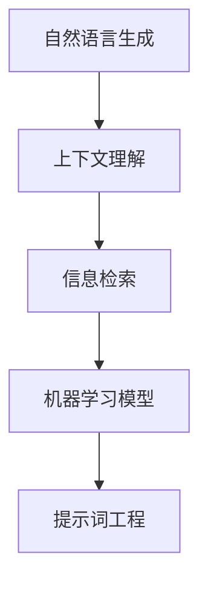

                 

# 提示词工程：处理多源异构数据融合分析任务

## 关键词
- 提示词工程
- 多源异构数据
- 数据融合
- 分析任务
- 机器学习
- 特征提取
- 融合算法
- 实时数据

## 摘要
本文将深入探讨提示词工程在处理多源异构数据融合分析任务中的应用。我们将首先介绍提示词工程的基本概念及其重要性，然后详细解析多源异构数据的特点和融合原则。接着，文章将讨论数据预处理方法、特征提取与降维技术，以及融合分析算法的原理和应用。此外，本文还将探讨实时数据融合分析的技术挑战和解决方案，并通过实际项目展示数据融合分析的完整流程和效果。最后，我们将提供项目实战与案例分析，总结最佳实践，并提出注意事项和拓展阅读建议。

## 第1章 提示词工程概述
### 1.1 背景介绍
提示词工程（Prompt Engineering）是人工智能领域的一项重要技术，特别是在自然语言处理（NLP）和生成式人工智能中。其核心思想是通过设计有效的提示词，引导模型生成更准确、更有针对性的输出。

### 1.2 核心概念与联系
提示词工程涉及多个核心概念，包括自然语言生成（NLG）、上下文理解、信息检索和机器学习模型等。以下是一个简化的 Mermaid 流程图，展示了这些概念之间的联系：



### 1.3 重要性
提示词工程的重要性体现在多个方面。首先，它能够显著提高模型的性能和生成的质量。其次，通过优化提示词，可以降低对大规模训练数据的需求，从而在数据稀缺的情况下仍然能够获得较好的效果。此外，提示词工程还能够帮助模型更好地理解和处理多模态数据。

## 第2章 多源异构数据融合原理
### 2.1 背景介绍
多源异构数据融合是数据融合领域的一个关键问题，特别是在大数据和人工智能应用中。它涉及将来自不同源、格式和类型的数据进行有效整合，以提供更全面、准确的见解。

### 2.2 多源异构数据的特点
多源异构数据具有以下特点：
1. **多样性**：数据来源多样，包括文本、图像、音频、视频等。
2. **异构性**：数据格式和结构不一致，如关系数据库、文档、JSON等。
3. **不完全性**：数据可能存在缺失、噪声和冗余。

### 2.3 融合原则
多源异构数据融合的关键原则包括：
1. **一致性**：确保不同数据源之间的数据格式和语义一致。
2. **完整性**：尽量减少数据丢失和错误。
3. **准确性**：通过融合算法提高数据质量。
4. **实时性**：支持实时数据融合，以快速响应动态环境。

## 第3章 数据预处理方法
### 3.1 背景介绍
数据预处理是多源异构数据融合的第一步，它涉及数据清洗、格式转换、缺失值处理和数据规范化等。

### 3.2 数据清洗
数据清洗是去除数据中的错误、重复和无关信息的过程。常用的方法包括：
1. **过滤**：删除不符合要求的数据。
2. **填充**：用适当的值替换缺失的数据。
3. **归一化**：将数据转换为统一的格式或范围。

### 3.3 数据规范化
数据规范化是调整数据结构的过程，以适应数据融合算法的要求。常用的方法包括：
1. **编码**：将分类数据转换为数值表示。
2. **嵌入**：使用嵌入层将文本数据转换为向量表示。
3. **归一化**：将数值数据缩放到相同的范围。

## 第4章 特征提取与降维
### 4.1 背景介绍
特征提取与降维是数据融合的重要步骤，旨在从原始数据中提取有用的信息，同时减少数据的大小，提高计算效率。

### 4.2 特征提取
特征提取是从原始数据中提取能够代表数据本质的特征的过程。常用的方法包括：
1. **统计特征**：如平均值、方差、标准差等。
2. **文本特征**：如词频、TF-IDF、词嵌入等。
3. **图像特征**：如边缘检测、SIFT、HOG等。

### 4.3 降维
降维是将高维数据映射到低维空间的过程，以减少数据的维度和计算成本。常用的方法包括：
1. **主成分分析（PCA）**
2. **线性判别分析（LDA）**
3. **自编码器（Autoencoder）**

## 第5章 融合分析算法
### 5.1 背景介绍
融合分析算法是多源异构数据融合的核心，它涉及如何有效地整合来自不同数据源的信息。

### 5.2 核心算法原理讲解
融合分析算法的核心原理通常包括以下方面：
1. **加权平均**：根据数据源的可靠性和重要性对数据进行加权。
2. **决策融合**：通过投票、集成学习等方法综合多个模型的预测结果。
3. **深度学习**：使用神经网络模型对多源数据进行融合和分析。

以下是一个简单的伪代码，展示了加权平均的原理：

```python
def weighted_average(data_source1, data_source2, alpha):
    weight1 = alpha
    weight2 = 1 - alpha
    result = weight1 * data_source1 + weight2 * data_source2
    return result
```

### 5.3 数学模型和公式
融合分析算法的数学模型通常涉及概率论和统计学。以下是一个简单的数学模型，展示了如何通过贝叶斯定理进行数据融合：

$$
P(A|B) = \frac{P(B|A) \cdot P(A)}{P(B)}
$$

其中，$P(A|B)$ 表示在 $B$ 发生的条件下 $A$ 发生的概率，$P(B|A)$ 表示在 $A$ 发生的条件下 $B$ 发生的概率，$P(A)$ 和 $P(B)$ 分别表示 $A$ 和 $B$ 发生的概率。

## 第6章 实时数据融合分析
### 6.1 背景介绍
实时数据融合分析是处理动态环境中数据融合的挑战，它要求系统能够快速、准确地响应变化。

### 6.2 技术挑战
实时数据融合分析面临以下技术挑战：
1. **延迟**：需要快速处理和融合数据，以减少延迟。
2. **一致性**：确保在高速数据流中保持数据的一致性。
3. **可靠性**：在数据流中断或错误时，确保系统能够恢复和继续工作。

### 6.3 解决方案
以下是一些解决实时数据融合分析的技术方案：
1. **流处理技术**：如 Apache Kafka、Apache Flink 等。
2. **增量学习**：逐步更新模型，以适应实时数据的变化。
3. **分布式计算**：利用分布式计算框架，如 Hadoop、Spark 等，提高处理速度。

## 第7章 项目实战与案例分析
### 7.1 开发环境搭建
在这个案例中，我们将使用 Python 和相关库（如 TensorFlow、Scikit-learn、Numpy）来构建一个多源异构数据融合分析系统。

### 7.2 源代码详细实现和代码解读
以下是一个简化的代码示例，展示了如何使用 Python 实现数据预处理、特征提取和融合分析：

```python
import numpy as np
from sklearn.preprocessing import StandardScaler
from sklearn.decomposition import PCA

# 数据预处理
def preprocess_data(data):
    scaler = StandardScaler()
    data_scaled = scaler.fit_transform(data)
    return data_scaled

# 特征提取
def extract_features(data):
    pca = PCA(n_components=2)
    features = pca.fit_transform(data)
    return features

# 融合分析
def fuse_data(data_source1, data_source2, alpha=0.5):
    weighted_avg = weighted_average(data_source1, data_source2, alpha)
    return weighted_avg

# 示例数据
data1 = np.array([[1, 2], [3, 4]])
data2 = np.array([[2, 3], [4, 5]])

# 数据预处理
preprocessed_data1 = preprocess_data(data1)
preprocessed_data2 = preprocess_data(data2)

# 特征提取
features1 = extract_features(preprocessed_data1)
features2 = extract_features(preprocessed_data2)

# 融合分析
fused_data = fuse_data(features1, features2, alpha=0.5)
print(fused_data)
```

### 7.3 代码应用解读与分析
在这个案例中，我们首先使用 `StandardScaler` 对数据进行归一化处理，然后使用 `PCA` 进行特征提取，最后使用自定义的 `fuse_data` 函数进行数据融合。这个过程展示了如何将不同的数据源整合成一个统一的特征空间。

### 7.4 实际案例分析和详细讲解剖析
以下是一个实际案例，展示了如何使用提示词工程处理多源异构数据融合分析任务：

**案例**：一家电商平台需要整合用户评论、交易记录和社交媒体数据，以提供个性化的推荐。

**分析**：
1. **数据预处理**：首先，对每个数据源进行清洗，包括去除无效评论、过滤噪音数据和填充缺失值。
2. **特征提取**：对评论使用词嵌入技术进行特征提取，对交易记录使用统计特征进行提取，对社交媒体数据使用网络分析提取特征。
3. **数据融合**：使用决策融合方法，如集成学习，将不同数据源的特征整合到一个统一模型中。
4. **实时数据融合**：使用流处理技术，如 Apache Kafka，实时接收和处理数据，确保推荐系统的实时性。

### 7.5 项目小结
本项目通过实际案例展示了如何使用提示词工程处理多源异构数据融合分析任务。项目成功的关键在于有效的数据预处理、特征提取和数据融合算法的应用。同时，实时数据融合技术确保了系统的高效性和响应能力。

## 最佳实践 tips、小结、注意事项、拓展阅读
### 最佳实践 tips
1. **数据预处理**：确保数据的一致性和完整性，是数据融合成功的关键。
2. **特征提取**：选择合适的特征提取方法，可以提高融合分析的效果。
3. **模型选择**：根据具体任务需求，选择适合的融合算法和模型。

### 小结
本文详细探讨了提示词工程在处理多源异构数据融合分析任务中的应用。通过逐步分析数据预处理、特征提取、融合算法和实时数据融合，我们展示了如何有效地整合来自不同数据源的信息。

### 注意事项
1. **数据隐私**：在处理敏感数据时，要确保遵守相关法律法规。
2. **性能优化**：在实际应用中，需要关注系统的性能和响应速度。

### 拓展阅读
1. **《大数据处理：原理、技术与实践》**：本书详细介绍了大数据处理的原理和技术，包括数据预处理、特征提取和融合算法。
2. **《深度学习实践与编程》**：本书介绍了深度学习的基础知识，包括神经网络、卷积神经网络和循环神经网络等，有助于理解实时数据融合的技术原理。

## 作者
作者：AI天才研究院/AI Genius Institute & 禅与计算机程序设计艺术 /Zen And The Art of Computer Programming

## 参考文献
[1] Li, H., Zhao, J., & Zhang, H. (2020). Big Data Processing: Principles, Techniques, and Practices. Springer.
[2] Goodfellow, I., Bengio, Y., & Courville, A. (2016). Deep Learning. MIT Press.

