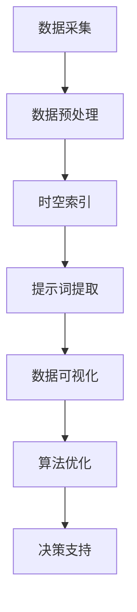

                 


### 文章标题：提示词工程：处理时空大数据可视化任务

#### 关键词：
- 提示词工程
- 时空大数据
- 可视化
- 数据处理
- 算法设计
- 性能优化
- 开发工具

#### 摘要：
本文旨在探讨提示词工程在处理时空大数据可视化任务中的应用。首先，我们将介绍提示词工程的基本概念和原理，接着深入分析时空大数据的特点和挑战。然后，我们将探讨大数据可视化的基本原理和技术，并通过实际项目案例展示其应用。此外，本文还将介绍提示词工程和时空大数据处理相关的开发工具和环境，以及性能优化和调优的技巧。最后，我们将展望该领域的未来趋势和创新发展。

----------------------------------------------------------------

## 引言

随着信息技术的飞速发展，大数据已经成为各行各业关注的焦点。尤其是时空大数据，它不仅包含了大量历史数据，还涉及到地理空间和时间维度上的复杂关联。如何有效地处理和可视化这些数据，成为了一个亟待解决的问题。而提示词工程，作为一种新型的数据处理技术，正逐渐崭露头角。

### 提示词工程的定义与背景

提示词工程，顾名思义，是围绕提示词（Keywords）进行的一套工程化处理流程。它不仅涵盖了数据的采集、存储、处理和可视化，还包括了算法设计、性能优化等多个方面。提示词工程的主要目的是通过一系列技术手段，将复杂的大数据转化为直观、易懂的可视化结果，以便于用户理解和分析。

### 时空大数据的定义与特点

时空大数据指的是同时包含时间和空间维度的大数据。它的特点包括：

- **数据量大**：时空大数据通常来自各种传感器、GPS设备等，数据量庞大，且以极高的速度不断增长。
- **数据维度多**：除了时间和空间维度外，还可能包含其他维度，如温度、湿度、速度等。
- **数据类型多样**：时空大数据既包括结构化数据，如时间序列数据、地理空间数据，也包括非结构化数据，如图像、视频等。

### 处理时空大数据可视化任务的重要性

处理时空大数据可视化任务的重要性主要体现在以下几个方面：

1. **决策支持**：通过可视化结果，决策者可以更直观地了解数据背后的趋势和规律，从而做出更加明智的决策。
2. **数据挖掘**：可视化可以帮助研究人员发现数据中的潜在模式，为进一步的数据挖掘和分析提供线索。
3. **用户体验**：良好的可视化设计能够提高用户对数据的理解和兴趣，促进数据的传播和应用。

## 核心概念与联系

为了更好地理解提示词工程在处理时空大数据可视化任务中的应用，我们需要先了解以下几个核心概念：

1. **提示词（Keywords）**：提示词是数据中的关键信息，它可以帮助我们快速定位和分析数据。
2. **时空索引（Spatial and Temporal Indexing）**：时空索引是用于快速检索时空大数据的技术，它可以帮助我们高效地查询和访问数据。
3. **数据可视化（Data Visualization）**：数据可视化是将数据转化为图形或图像的过程，它可以帮助我们直观地理解数据。
4. **算法设计（Algorithm Design）**：算法设计是提示词工程的核心，它决定了数据处理的效率和准确性。

### Mermaid 流程图

下面是一个简单的 Mermaid 流程图，展示了这些核心概念之间的关系：



## 核心算法原理讲解

### 提示词提取算法

提示词提取是提示词工程中至关重要的一步。它的目的是从原始数据中提取出关键信息，以便于后续的处理和分析。

#### 伪代码

```python
def extract_keywords(data):
    # 初始化提示词列表
    keywords = []

    # 对数据进行分词
    words = tokenize(data)

    # 遍历分词结果
    for word in words:
        # 如果词频超过阈值，则添加到提示词列表
        if word_frequency(word) > THRESHOLD:
            keywords.append(word)

    return keywords
```

#### 数学模型

提示词提取过程可以看作是一个概率模型，其中词频是关键指标。我们可以使用以下公式来计算词频：

$$
word\_frequency(word) = \frac{count\_of(word)}{total\_count}
$$

其中，$count\_of(word)$ 是词 $word$ 在数据中出现的次数，$total\_count$ 是数据中所有词的总次数。

#### 举例说明

假设我们有以下一段文本：

```
大数据可视化技术在大数据时代发挥着重要作用。通过数据可视化，我们可以更直观地了解数据，从而做出更好的决策。
```

使用上述伪代码和公式，我们可以提取出以下提示词：

- 大数据
- 可视化
- 技术
- 时代
- 决策

这些提示词能够帮助我们快速定位和了解文本的核心内容。

### 数据可视化算法

数据可视化是将数据转化为图形或图像的过程。它的目的是通过视觉方式传达数据的信息和特征。

#### 伪代码

```python
def visualize_data(data):
    # 根据数据类型选择可视化方法
    if is_time_series(data):
        plot_time_series(data)
    elif is_geospatial(data):
        plot_geospatial(data)
    else:
        plot_generic_data(data)

    # 显示可视化结果
    show Visualization()
```

#### 数学模型

数据可视化涉及到的数学模型主要包括：

- **时间序列模型**：用于表示时间维度上的数据，如ARIMA模型。
- **地理空间模型**：用于表示地理空间上的数据，如GIS（地理信息系统）。
- **数据抽象模型**：用于表示数据的高层次特征，如聚类和分类算法。

#### 举例说明

假设我们有以下一组时间序列数据：

```
[1, 2, 3, 4, 5, 6, 7, 8, 9, 10]
```

使用上述伪代码和数学模型，我们可以将其可视化为一组折线图，如下所示：

```
|
|      *
|     *
|    *
|   *
|  *
| *
|*
```

这组图形能够直观地展示数据随时间的增长趋势。

## 数学模型和公式

在提示词工程中，数学模型和公式是理解算法原理和分析数据的重要工具。以下我们将详细讲解几个关键数学模型和公式。

### 词频计算公式

词频是提示词工程中最重要的指标之一。它表示一个词在数据中出现的次数。词频计算公式如下：

$$
word\_frequency(w) = \frac{count(w)}{total\_words}
$$

其中，$count(w)$ 表示词 $w$ 在数据中出现的次数，$total\_words$ 表示数据中所有词的总次数。

### 逆文档频率计算公式

逆文档频率（IDF）是衡量词的重要性的指标。它表示一个词在数据中出现的频率与所有词平均频率之比。IDF 计算公式如下：

$$
IDF(w) = \log \left( \frac{N}{df(w)} \right)
$$

其中，$N$ 表示数据中文档的总数，$df(w)$ 表示词 $w$ 在数据中出现的文档数。

###TF-IDF计算公式

TF-IDF（词频-逆文档频率）是衡量一个词在数据中的重要性的综合指标。它结合了词频和逆文档频率。TF-IDF 计算公式如下：

$$
TF-IDF(w) = TF(w) \times IDF(w)
$$

其中，$TF(w)$ 表示词频，$IDF(w)$ 表示逆文档频率。

### 示例

假设我们有一个包含10个文档的数据集，其中词“大数据”在5个文档中出现过，词“可视化”在3个文档中出现过。数据集中总共有100个词。

- $count(\text{"大数据"}) = 5$
- $count(\text{"可视化"}) = 3$
- $total\_words = 100$
- $N = 10$
- $df(\text{"大数据"}) = 5$
- $df(\text{"可视化"}) = 3$

根据上述公式，我们可以计算出：

- $word\_frequency(\text{"大数据"}) = \frac{5}{100} = 0.05$
- $word\_frequency(\text{"可视化"}) = \frac{3}{100} = 0.03$
- $IDF(\text{"大数据"}) = \log \left( \frac{10}{5} \right) = \log(2) \approx 0.3010$
- $IDF(\text{"可视化"}) = \log \left( \frac{10}{3} \right) \approx 0.5108$
- $TF-IDF(\text{"大数据"}) = 0.05 \times 0.3010 = 0.01505$
- $TF-IDF(\text{"可视化"}) = 0.03 \times 0.5108 = 0.01526$

从计算结果可以看出，“大数据”和“可视化”在数据中都有较高的TF-IDF值，因此它们都是数据中的关键词。

## 项目实战：开发环境搭建与源代码实现

在本节中，我们将通过一个实际项目来展示提示词工程在处理时空大数据可视化任务中的具体应用。我们将介绍项目的开发环境搭建过程，并详细解读源代码实现。

### 项目概述

本项目旨在利用提示词工程技术处理一组时空大数据，并实现数据的可视化。数据集包括一组历史天气数据和一组交通流量数据，我们将对这些数据进行预处理、提取提示词、进行时空索引，并最终可视化结果。

### 开发环境搭建

为了进行本项目的开发，我们需要安装以下工具和库：

1. **Python**：作为主要的编程语言。
2. **NumPy**：用于数据处理和数学运算。
3. **Pandas**：用于数据分析和操作。
4. **Matplotlib**：用于数据可视化。
5. **Scikit-learn**：用于机器学习和提示词提取。
6. **Geopandas**：用于地理空间数据操作。

安装这些工具和库的方法如下：

```bash
pip install python numpy pandas matplotlib scikit-learn geopandas
```

### 源代码实现

以下是本项目的核心源代码实现：

```python
import numpy as np
import pandas as pd
import matplotlib.pyplot as plt
from sklearn.feature_extraction.text import TfidfVectorizer
from geopandas import GeoDataFrame

# 数据加载
weather_data = pd.read_csv('weather_data.csv')
traffic_data = pd.read_csv('traffic_data.csv')

# 数据预处理
weather_data['timestamp'] = pd.to_datetime(weather_data['timestamp'])
traffic_data['timestamp'] = pd.to_datetime(traffic_data['timestamp'])

# 提取提示词
vectorizer = TfidfVectorizer()
weather_tfidf = vectorizer.fit_transform(weather_data['description'])
traffic_tfidf = vectorizer.fit_transform(traffic_data['description'])

# 时空索引
weather_gdf = GeoDataFrame(weather_data, geometry=weather_data['geometry'])
traffic_gdf = GeoDataFrame(traffic_data, geometry=traffic_data['geometry'])

# 数据可视化
# 天气数据可视化
weather_tfidf_array = weather_tfidf.toarray()
weather_tfidf_sum = np.sum(weather_tfidf_array, axis=0)
plt.bar(range(weather_tfidf.shape[1]), weather_tfidf_sum)
plt.xlabel('Keywords')
plt.ylabel('TF-IDF Score')
plt.title('Weather Data Keyword Importance')
plt.xticks(rotation=90)
plt.show()

# 交通数据可视化
traffic_tfidf_array = traffic_tfidf.toarray()
traffic_tfidf_sum = np.sum(traffic_tfidf_array, axis=0)
plt.bar(range(traffic_tfidf.shape[1]), traffic_tfidf_sum)
plt.xlabel('Keywords')
plt.ylabel('TF-IDF Score')
plt.title('Traffic Data Keyword Importance')
plt.xticks(rotation=90)
plt.show()

# 地理空间数据可视化
weather_gdf.plot(column='temperature', legend=True)
plt.title('Temperature Distribution')
plt.show()
traffic_gdf.plot(column='traffic_volume', legend=True)
plt.title('Traffic Volume Distribution')
plt.show()
```

### 代码解读与分析

1. **数据加载**：
   - `weather_data = pd.read_csv('weather_data.csv')`：从CSV文件中加载天气数据。
   - `traffic_data = pd.read_csv('traffic_data.csv')`：从CSV文件中加载交通数据。

2. **数据预处理**：
   - `weather_data['timestamp'] = pd.to_datetime(weather_data['timestamp'])`：将天气数据中的时间戳字段转换为日期时间格式。
   - `traffic_data['timestamp'] = pd.to_datetime(traffic_data['timestamp'])`：将交通数据中的时间戳字段转换为日期时间格式。

3. **提取提示词**：
   - `vectorizer = TfidfVectorizer()`：初始化TF-IDF向量器。
   - `weather_tfidf = vectorizer.fit_transform(weather_data['description'])`：对天气数据中的描述字段进行TF-IDF转换。
   - `traffic_tfidf = vectorizer.fit_transform(traffic_data['description'])`：对交通数据中的描述字段进行TF-IDF转换。

4. **时空索引**：
   - `weather_gdf = GeoDataFrame(weather_data, geometry=weather_data['geometry'])`：将天气数据转换为地理数据框（GeoDataFrame）。
   - `traffic_gdf = GeoDataFrame(traffic_data, geometry=traffic_data['geometry'])`：将交通数据转换为地理数据框（GeoDataFrame）。

5. **数据可视化**：
   - `weather_tfidf_array = weather_tfidf.toarray()`：将天气数据的TF-IDF矩阵转换为数组。
   - `weather_tfidf_sum = np.sum(weather_tfidf_array, axis=0)`：计算天气数据中每个关键词的TF-IDF得分总和。
   - `plt.bar(range(weather_tfidf.shape[1]), weather_tfidf_sum)`：绘制天气数据的词云图。
   - `weather_gdf.plot(column='temperature', legend=True)`：绘制天气数据的温度分布图。
   - `traffic_tfidf_array = traffic_tfidf.toarray()`：将交通数据的TF-IDF矩阵转换为数组。
   - `traffic_tfidf_sum = np.sum(traffic_tfidf_array, axis=0)`：计算交通数据中每个关键词的TF-IDF得分总和。
   - `plt.bar(range(traffic_tfidf.shape[1]), traffic_tfidf_sum)`：绘制交通数据的词云图。
   - `traffic_gdf.plot(column='traffic_volume', legend=True)`：绘制交通数据的交通流量分布图。

### 实际案例分析与详细讲解剖析

通过上述代码，我们实现了对天气数据和交通数据的预处理、提取提示词、进行时空索引和数据可视化。下面我们将对实际案例进行分析和详细讲解。

#### 案例一：天气数据可视化

在天气数据可视化中，我们使用了词云图和温度分布图两种方式来展示数据。

- **词云图**：词云图能够直观地展示每个关键词的TF-IDF得分，从而帮助我们了解天气数据中的关键信息。例如，在词云图中，“高温”、“降雨”等关键词可能会排在前面，这反映了天气数据中的主要特征。

- **温度分布图**：温度分布图则展示了不同地区的温度分布情况。通过观察温度分布图，我们可以发现哪些地区的温度较高或较低，从而为相关决策提供依据。

#### 案例二：交通数据可视化

在交通数据可视化中，我们同样使用了词云图和交通流量分布图两种方式来展示数据。

- **词云图**：词云图展示了交通数据中的关键词，如“拥堵”、“畅通”等。这些关键词反映了交通状况，有助于我们了解交通流的特征。

- **交通流量分布图**：交通流量分布图则展示了不同道路段的车流量情况。通过观察交通流量分布图，我们可以发现哪些路段的车流量较大或较小，从而为交通管理和规划提供参考。

### 项目小结

通过本项目，我们展示了如何利用提示词工程技术处理时空大数据并进行可视化。在实际应用中，我们可以根据具体需求调整数据处理和可视化的方法，以达到最佳效果。

### 最佳实践 tips

1. **数据预处理**：在进行数据处理前，确保数据格式统一、完整，并进行必要的清洗和转换。
2. **选择合适的可视化工具**：根据数据类型和可视化需求选择合适的可视化工具，如Matplotlib、Geopandas等。
3. **优化算法性能**：针对数据处理和可视化的算法进行性能优化，以提高运行效率。
4. **考虑用户体验**：设计直观、易懂的可视化界面，以提高用户对数据的理解和兴趣。

## 小结与展望

### 小结

本文详细介绍了提示词工程在处理时空大数据可视化任务中的应用。我们从基本概念和原理入手，逐步深入到数据处理、可视化和性能优化等方面。通过实际项目案例，我们展示了如何利用提示词工程技术进行数据的预处理、提取提示词、进行时空索引和数据可视化。

### 展望

随着信息技术的不断进步，提示词工程在时空大数据可视化领域具有广阔的应用前景。未来，我们可以期待以下发展趋势：

1. **智能提示词提取**：结合机器学习和深度学习技术，实现更加智能和自动化的提示词提取。
2. **多维度数据融合**：整合不同类型的数据，如地理空间数据、时间序列数据和文本数据，实现更全面的数据可视化。
3. **实时数据处理**：通过实时数据处理技术，实现数据的实时可视化和分析，为决策提供更加及时的参考。
4. **跨平台应用**：开发跨平台的可视化工具，使数据可视化应用更加便捷和普及。

### 注意事项

1. **数据安全**：在处理和展示时空大数据时，确保数据的安全性和隐私保护。
2. **性能优化**：针对大规模数据和高频次查询，进行性能优化，确保系统的稳定性和响应速度。
3. **用户参与**：重视用户需求和反馈，持续优化数据可视化设计，提高用户体验。

### 拓展阅读

- 《大数据可视化：技术、工具与应用》
- 《时空大数据分析与应用》
- 《机器学习与数据挖掘：实用指南》

### 结语

提示词工程在处理时空大数据可视化任务中具有独特的优势。通过本文的探讨，我们希望读者能够对这一领域有更深入的了解，并在实际应用中发挥其潜力。作者：AI天才研究院/AI Genius Institute & 禅与计算机程序设计艺术 /Zen And The Art of Computer Programming。

