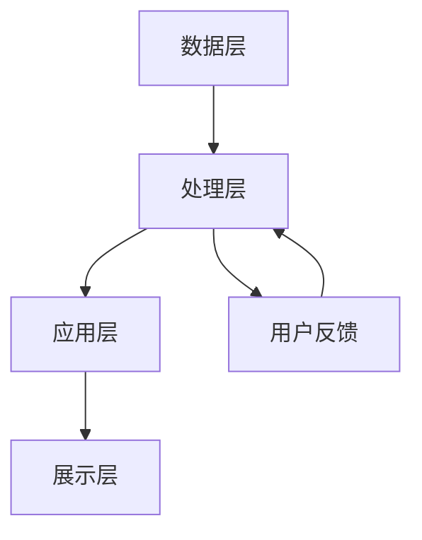

                 

### 第一部分：引入与基础概念

#### 1.1 书籍引言

《提示词工程：处理模糊和开放性问题》旨在深入探讨提示词工程在应对模糊和开放性问题中的应用与挑战。本书面向对人工智能、自然语言处理、数据分析等领域有兴趣的读者，尤其是那些希望深入理解如何通过提示词来改善系统性能和应用效果的专业人士。

本书首先将介绍模糊和开放性问题的基本概念，帮助读者理解这些问题的背景和复杂性。接着，我们会详细探讨提示词工程的基本概念，阐述其在不同领域中的应用场景。此外，本书还将分析提示词工程面临的挑战和机会，为读者提供一个全面的视角。

#### 1.2 模糊与开放性问题概述

模糊性问题指的是那些涉及不确定性、不精确性和模糊性的问题。这些问题的特点在于其边界不明确，解决方案不是唯一的。在现实中，模糊性问题广泛存在于数据分析、决策支持、自然语言处理等领域。

开放性问题则是相对于封闭性问题而言的，指的是那些没有明确答案，或者答案不是唯一的问题。开放性问题往往需要探索性思维和创造性解决方案。在教育和培训、创意生成等领域，开放性问题尤为重要。

#### 1.3 提示词工程的基本概念

提示词工程是指利用特定的词语、短语或符号来引导或激发用户思考和行动的过程。在人工智能系统中，提示词工程用于指导模型生成有意义的内容或作出合理的决策。提示词工程的基本概念包括提示词的生成、优化和应用。

**提示词的生成**：生成合适的提示词是提示词工程的关键步骤。这一过程通常涉及对大量文本数据的分析和处理，以提取出具有代表性和引导性的词语。

**提示词的优化**：优化提示词的目的是提高其引导效果，使其更准确地反映用户的意图或系统的需求。优化方法包括词频分析、语义分析和用户反馈等。

**提示词的应用**：提示词的应用场景非常广泛，从自然语言处理到数据分析，再到教育等领域都有其用武之地。合理地应用提示词可以显著提高系统性能和应用效果。

### 提示词工程的应用场景

#### 1.2.1 数据分析

在数据分析中，提示词工程可以用于生成有意义的摘要、发现隐藏的模式和趋势。例如，在金融数据分析中，通过提示词可以生成股票市场的分析报告，帮助投资者做出更明智的决策。

#### 1.2.2 决策支持

在决策支持系统中，提示词工程可以帮助系统生成基于数据的建议，从而辅助人类决策。例如，在医疗诊断中，提示词可以引导医生关注关键的检查项目，从而提高诊断的准确性。

#### 1.2.3 自然语言处理

自然语言处理（NLP）是提示词工程的重要应用领域。在NLP中，提示词用于引导模型生成文本、翻译语言、理解用户查询等。例如，在聊天机器人中，提示词可以帮助模型理解用户的问题，并提供合适的回答。

#### 1.2.4 教育与培训

在教育与培训中，提示词工程可以用于生成学习材料、设计教学方案和提供个性化指导。例如，在在线教育平台中，提示词可以帮助系统根据学生的学习进度和兴趣推荐合适的学习内容。

#### 1.2.5 创意生成

在创意生成领域，提示词工程可以用于生成故事、音乐、绘画等艺术作品。通过提示词，艺术家和创作者可以启发新的创意和灵感，从而创作出具有创新性的作品。

### 1.3 提示词工程的挑战与机会

#### 1.3.1 模糊性的处理

模糊性问题处理是提示词工程面临的重大挑战之一。由于模糊性问题边界不明确，传统的方法往往难以解决。提示词工程需要开发新的算法和技术，以应对这种不确定性。

#### 1.3.2 开放性问题的应对

开放性问题往往没有明确的解决方案，提示词工程需要引导模型进行探索和发现。这要求提示词具备高度的灵活性和适应性，能够引导模型在未知领域中寻找答案。

#### 1.3.3 提示词工程的发展趋势

随着人工智能技术的不断发展，提示词工程在各个领域的应用前景十分广阔。未来，提示词工程将朝着更加智能化、自适应化的方向发展，为解决复杂问题和提高系统性能提供有力支持。

## 第二部分：理论基础

### 2.1 提示词生成模型

提示词生成模型是提示词工程的核心组成部分，其主要任务是从给定的输入数据中生成高质量的提示词。这一部分将详细介绍提示词生成模型的基本概念、分类以及常用的生成算法。

#### 2.1.1 概念与分类

提示词生成模型可以分为以下几类：

1. **基于规则的方法**：这类方法通过定义一组规则来生成提示词。例如，可以使用词频统计或关键词提取技术来生成提示词。

2. **基于统计的方法**：这类方法利用统计模型来生成提示词，例如隐马尔可夫模型（HMM）和条件概率模型。

3. **基于深度学习的方法**：这类方法利用深度神经网络来生成提示词，如循环神经网络（RNN）和变分自编码器（VAE）。

#### 2.1.2 提示词生成的数学模型

提示词生成通常涉及以下数学模型：

1. **词嵌入模型**：词嵌入模型将词汇映射到高维空间中，使得具有相似意义的词汇在空间中相互接近。常见的词嵌入模型包括Word2Vec、GloVe等。

2. **生成对抗网络（GAN）**：GAN是一种深度学习模型，通过生成器和判别器的对抗训练来生成高质量的提示词。

3. **循环神经网络（RNN）**：RNN可以处理序列数据，适合用于生成提示词。LSTM和GRU是RNN的变体，它们可以更好地处理长序列数据。

4. **变分自编码器（VAE）**：VAE是一种无监督学习模型，可以用于生成高质量的提示词。

#### 2.1.3 提示词生成算法

以下是一些常用的提示词生成算法：

1. **生成对抗网络（GAN）**

   GAN由生成器和判别器组成。生成器生成提示词，判别器判断生成的提示词是否真实。通过对抗训练，生成器逐渐生成更高质量的提示词。

   ```python
   # GAN的伪代码
   for epoch in range(num_epochs):
       for data in data_loader:
           # 生成提示词
           generated_text = generator(data)
           # 训练判别器
           discriminator_loss = discriminator_loss_function(discriminator(generated_text), real_labels)
           # 训练生成器
           generator_loss = generator_loss_function(generator(data), real_labels)
   ```

2. **循环神经网络（RNN）**

   RNN通过处理序列数据来生成提示词。LSTM和GRU是RNN的变体，它们可以更好地处理长序列数据。

   ```python
   # RNN的伪代码
   for t in range(sequence_length):
       # 前向传播
       output, hidden = rnn(input[t], hidden)
       # 计算损失
       loss = loss_function(output, target[t])
       # 反向传播
       rnn.backward(loss)
   ```

3. **变分自编码器（VAE）**

   VAE通过编码器和解码器来生成提示词。编码器将输入数据编码为隐变量，解码器将隐变量解码为输出数据。

   ```python
   # VAE的伪代码
   for epoch in range(num_epochs):
       for data in data_loader:
           # 编码
           z = encoder(data)
           # 解码
           reconstructed_data = decoder(z)
           # 计算损失
           loss = loss_function(data, reconstructed_data)
           # 反向传播
           encoder.backward(loss)
           decoder.backward(loss)
   ```

### 2.2 模糊集理论

模糊集理论是处理模糊性问题的数学工具。它提供了一种描述和处理不确定性和模糊性的方法。以下将介绍模糊集的基本概念、运算以及其在提示词工程中的应用。

#### 2.2.1 模糊集的基本概念

模糊集是普通集合的扩展，它允许元素以不同程度的隶属度属于集合。模糊集用符号 \( A \) 表示，其元素 \( x \) 对应的隶属度用 \( \mu_A(x) \) 表示。

**隶属度函数**：隶属度函数 \( \mu_A \) 是定义在论域 \( U \) 上的函数，满足以下条件：

1. \( 0 \leq \mu_A(x) \leq 1 \) 对于所有 \( x \in U \)
2. \( \mu_A(x) = 1 \) 当且仅当 \( x \in A \)
3. \( \mu_A(x) = 0 \) 当且仅当 \( x \not\in A \)

**模糊集的表示**：模糊集可以通过隶属度函数或模糊集合表示。例如，一个简单的模糊集 \( A \) 可以表示为：

\[ A = \{ (x, \mu_A(x)) : x \in U \} \]

#### 2.2.2 模糊集的运算与扩展

模糊集的运算包括模糊集合的并、交、补以及模糊关系的运算。

1. **模糊集的并**：两个模糊集 \( A \) 和 \( B \) 的并集为：

   \[ A \cup B = \{ (x, \max(\mu_A(x), \mu_B(x))) : x \in U \} \]

2. **模糊集的交**：两个模糊集 \( A \) 和 \( B \) 的交集为：

   \[ A \cap B = \{ (x, \min(\mu_A(x), \mu_B(x))) : x \in U \} \]

3. **模糊集的补**：模糊集 \( A \) 的补集为：

   \[ A^c = \{ (x, 1 - \mu_A(x)) : x \in U \} \]

4. **模糊关系的合成**：给定两个模糊关系 \( R \) 和 \( S \)，它们的合成关系 \( RoS \) 为：

   \[ (RoS)(x, y) = \min(\max(R(x, z), S(z, y)), 1) \]

   其中，\( z \) 为 \( R \) 和 \( S \) 的交集的元素。

#### 2.2.3 模糊集在提示词工程中的应用

模糊集理论在提示词工程中具有重要的应用价值。以下是一些应用示例：

1. **模糊关键词提取**：在文本数据中，某些关键词可能以模糊的方式出现，即这些关键词在某些文本中具有更高的隶属度。模糊关键词提取可以通过模糊集理论来实现，从而提高关键词提取的准确性。

2. **模糊匹配**：在自然语言处理中，模糊匹配用于处理关键词的不确定性。通过模糊集理论，可以定义一个模糊匹配度，从而实现更灵活和准确的关键词匹配。

3. **模糊推荐系统**：在推荐系统中，用户兴趣和物品属性可能存在模糊性。通过模糊集理论，可以更好地处理这种模糊性，从而提高推荐系统的准确性和用户体验。

### 2.3 开放性问题解决策略

开放性问题解决策略旨在应对那些没有明确答案或解决方案的问题。这类问题往往需要探索性思维和创造性解决方案。以下将介绍几种常见的开放性问题解决策略。

#### 2.3.1 生成对抗的开放性探索

生成对抗网络（GAN）是一种强大的开放性探索工具。通过生成器和判别器的对抗训练，GAN可以在未知领域中生成高质量的数据。这种生成对抗的方法可以应用于开放性问题的探索，例如生成新的创意、探索新的解决方案等。

#### 2.3.2 对话系统与交互式探索

对话系统是一种与用户进行交互的智能系统，可以引导用户进行探索。通过对话，系统可以理解用户的意图和需求，并提供合适的建议和反馈。这种交互式探索方法可以应用于开放性问题的解决，例如在教育和培训领域，通过对话系统引导用户进行知识探索。

#### 2.3.3 模糊集与开放性问题的结合

模糊集理论可以用于处理开放性问题中的不确定性。通过模糊集，可以定义问题的边界和解决方案的不确定性，从而为开放性问题的解决提供数学框架。这种模糊集与开放性问题的结合方法可以应用于各种领域，例如决策支持、创意生成等。

### 小结

本部分介绍了提示词生成模型、模糊集理论以及开放性问题解决策略的基本概念和应用。通过这些理论和方法，我们可以更好地应对模糊和开放性问题，从而提高系统的性能和应用效果。在接下来的部分中，我们将进一步探讨提示词生成算法的实现和优化，以及实际项目中的应用。

## 第三部分：算法实现与优化

### 3.1 提示词生成算法实现

提示词生成算法是实现提示词工程的关键步骤。在这一节中，我们将详细讨论提示词生成算法的实现过程，包括算法选择、模型设计、参数调优以及实际应用中的算法选择。

#### 3.1.1 算法选择与模型设计

提示词生成算法的选择取决于具体的应用场景和数据特点。以下是几种常用的提示词生成算法：

1. **生成对抗网络（GAN）**：GAN通过生成器和判别器的对抗训练来生成高质量的提示词。生成器尝试生成逼真的提示词，而判别器则试图区分生成的提示词和真实的提示词。GAN在生成复杂且多样化的提示词方面具有优势。

2. **循环神经网络（RNN）**：RNN特别适合处理序列数据，可以用于生成基于上下文的提示词。LSTM和GRU是RNN的变体，它们可以更好地处理长序列数据。

3. **变分自编码器（VAE）**：VAE通过编码器和解码器来生成提示词。编码器将输入数据编码为隐变量，解码器将隐变量解码为输出数据。VAE在生成连续和离散的提示词方面具有优势。

4. **自注意力模型（Transformer）**：Transformer通过自注意力机制生成提示词，特别适用于处理长文本和复杂的关系。其生成能力强大，可以生成多样化、高质量的提示词。

在模型设计过程中，需要考虑以下因素：

- **输入数据**：选择合适的输入数据格式，如文本、图像、音频等。
- **输出格式**：定义提示词的输出格式，如文本、关键词、摘要等。
- **模型架构**：选择合适的模型架构，如GAN、RNN、VAE或Transformer。
- **训练策略**：设计合适的训练策略，包括数据预处理、损失函数、优化器等。

#### 3.1.2 算法参数调优

提示词生成算法的性能在很大程度上取决于参数设置。参数调优是提高算法性能的重要步骤。以下是常见的参数调优方法：

1. **学习率调整**：学习率是神经网络训练中的重要参数，需要根据具体问题进行调整。较小的学习率可能导致训练过程缓慢，而较大的学习率可能导致梯度消失或爆炸。常用的方法包括恒定学习率、学习率衰减和自适应学习率。

2. **批量大小**：批量大小影响模型的收敛速度和泛化能力。较小的批量大小可以提高模型的泛化能力，但训练过程较慢；较大的批量大小可以提高训练速度，但可能导致梯度不稳定。

3. **正则化**：正则化方法如Dropout、L2正则化等可以防止模型过拟合。通过调整正则化参数，可以在模型复杂性和泛化能力之间取得平衡。

4. **数据增强**：数据增强是一种提高模型泛化能力的方法，通过增加数据的多样性来减少过拟合。常见的数据增强方法包括随机裁剪、旋转、缩放等。

#### 3.1.3 实际应用场景下的算法选择

在实际应用中，选择合适的提示词生成算法取决于应用场景和数据特点。以下是一些常见的应用场景和相应的算法选择：

1. **文本生成**：对于文本生成任务，如文章摘要、对话系统、创意写作等，常用的算法包括RNN、LSTM、GRU和Transformer。这些算法可以生成连贯、有意义的文本。

2. **图像生成**：对于图像生成任务，如艺术风格迁移、人脸生成等，常用的算法包括GAN和VAE。这些算法可以生成高质量的图像，具有丰富的细节和多样性。

3. **音频生成**：对于音频生成任务，如音乐生成、语音合成等，常用的算法包括WaveNet和Vocoder。这些算法可以生成自然、逼真的音频。

4. **多模态生成**：对于多模态生成任务，如视频生成、图像和文本生成等，常用的算法包括多模态GAN和多模态VAE。这些算法可以同时处理不同类型的数据，生成高质量的多模态内容。

### 3.2 模糊集处理算法

模糊集处理算法是处理模糊性问题的关键工具。在这一节中，我们将介绍模糊集处理算法的基本概念、实现过程以及优化方法。

#### 3.2.1 模糊集处理算法概述

模糊集处理算法主要涉及以下几个方面：

1. **模糊集的建立**：建立模糊集是模糊集处理的第一步。通常需要定义模糊集的隶属度函数，以表示元素对集合的隶属程度。

2. **模糊集的运算**：模糊集的运算包括模糊集的并、交、补以及模糊关系的合成。这些运算是模糊集处理的基础。

3. **模糊推理系统**：模糊推理系统是一种基于模糊逻辑的推理方法，用于处理模糊性问题。它通过模糊规则库和模糊推理算法来实现模糊推理。

4. **模糊聚类**：模糊聚类是一种基于模糊集理论的聚类方法，用于处理具有模糊边界的聚类问题。

#### 3.2.2 模糊集处理算法实现与优化

以下是一个简单的模糊集处理算法实现示例，包括模糊集的建立和模糊推理系统。

1. **模糊集的建立**

   首先，我们需要定义模糊集的隶属度函数。以下是一个简单的例子：

   ```python
   # 定义隶属度函数
   def triangular_membership(x, a, b, c):
       if x <= a:
           return 0
       elif x <= b:
           return (x - a) / (b - a)
       elif x <= c:
           return 1 - ((x - b) / (c - b))
       else:
           return 0

   # 定义模糊集A
   A = {
       'x': [0, 1, 2, 3, 4, 5],
       'membership': [triangular_membership(x, 0, 1, 2) for x in A['x']]
   }
   ```

2. **模糊推理系统**

   模糊推理系统通过模糊规则库和模糊推理算法来实现。以下是一个简单的模糊推理系统实现：

   ```python
   # 定义模糊规则库
   rule_base = {
       'if': {
           'A': {'membership': [triangular_membership(x, 0, 1, 2) for x in A['x']]},
           'B': {'membership': [triangular_membership(x, 1, 2, 3) for x in B['x']]}
       },
       'then': {
           'C': {'membership': [triangular_membership(x, 2, 3, 4) for x in C['x']]}
       }
   }

   # 模糊推理
   def fuzzy_inference(rule_base, A, B):
       rule_firenings = []
       for rule in rule_base['if']:
           antecedent = rule_base['if'][rule]
           consequent = rule_base['then'][rule]
           # 计算规则匹配度
           rule_firing = min([min([antecedent['membership'][x] for x in A['x']],
                                  [antecedent['membership'][x] for x in B['x']])]
                            )
           rule_firenings.append(rule_firing)
       # 计算结论的隶属度
       conclusion_membership = sum([rule_firenings[i] * consequent['membership'][i] for i in range(len(consequent['membership']))])
       return conclusion_membership
   ```

3. **优化方法**

   模糊集处理算法的优化主要包括以下几个方面：

   - **隶属度函数优化**：通过调整隶属度函数的参数，可以优化模糊集的边界和隶属度分布。
   - **规则库优化**：通过优化模糊规则库，可以减少模糊推理过程中的误差和不确定性。
   - **推理算法优化**：优化模糊推理算法，可以提高推理的效率和准确性。

### 3.3 模糊集与提示词工程的结合

模糊集理论可以与提示词工程相结合，以处理模糊性和开放性问题。以下是一些结合方法：

1. **模糊关键词提取**：利用模糊集理论，可以提取具有模糊边界的关键词。这种方法可以提高关键词提取的准确性，特别是在处理含糊表述的文本时。

2. **模糊匹配**：在自然语言处理中，模糊匹配用于处理关键词的不确定性。通过模糊集理论，可以定义一个模糊匹配度，从而实现更灵活和准确的关键词匹配。

3. **模糊推荐系统**：在推荐系统中，用户兴趣和物品属性可能存在模糊性。通过模糊集理论，可以更好地处理这种模糊性，从而提高推荐系统的准确性和用户体验。

4. **模糊创意生成**：在创意生成中，模糊集理论可以用于处理创意的模糊性和不确定性。通过模糊集理论，可以生成多样化的创意，激发创造力和创新思维。

### 小结

本部分介绍了提示词生成算法的实现过程、模糊集处理算法的基本概念和优化方法，以及模糊集与提示词工程的结合应用。通过这些算法和方法，我们可以更好地处理模糊性和开放性问题，提高系统的性能和应用效果。在下一部分中，我们将通过具体项目实战来展示这些理论和方法的实际应用。

### 4.1 提示词工程项目实践

在提示词工程的实际应用中，构建一个有效的项目是关键。本节将详细描述一个提示词工程项目的实践过程，包括项目需求分析、架构设计、实现步骤、性能评估与优化。

#### 4.1.1 项目需求分析

项目需求分析是确保项目满足实际业务需求的基础。对于提示词工程项目，需求分析主要包括以下方面：

1. **用户需求**：确定目标用户群体的需求，如用户希望从系统中获得什么样的提示词，是否需要个性化推荐等。
2. **数据来源**：明确数据来源，包括文本数据、图像数据、音频数据等，以及数据的质量和格式。
3. **系统功能**：确定系统的核心功能，如文本生成、图像生成、音频生成等，以及系统需要具备的其他辅助功能，如用户反馈收集、数据分析等。
4. **性能要求**：定义系统的性能指标，如生成速度、生成质量、系统稳定性等。

#### 4.1.2 项目架构设计

项目架构设计是确保系统可扩展性和可维护性的关键。对于提示词工程项目，架构设计主要包括以下方面：

1. **数据层**：负责数据的存储和管理，包括文本数据库、图像数据库、音频数据库等。
2. **处理层**：负责数据的处理和生成，包括数据预处理模块、提示词生成模块、模糊集处理模块等。
3. **应用层**：负责用户交互和业务逻辑，包括前端应用、后端服务、API接口等。
4. **展示层**：负责展示生成的提示词和系统分析结果，包括网页、移动应用等。

架构设计示例（使用Mermaid流程图）：



#### 4.1.3 实现步骤与细节

提示词工程项目的实现过程可以分为以下几个步骤：

1. **数据收集与预处理**：
   - 收集文本数据、图像数据和音频数据。
   - 进行数据清洗，去除无效数据和噪声。
   - 对文本数据进行分词、词性标注等预处理操作。
   - 对图像和音频数据应用相应的预处理技术，如归一化、去噪等。

2. **模型设计与训练**：
   - 根据需求选择合适的提示词生成模型，如GAN、RNN、VAE等。
   - 设计模型架构，包括输入层、隐藏层和输出层。
   - 利用预处理后的数据对模型进行训练。
   - 进行参数调优，以获得最佳的模型性能。

3. **模型部署与优化**：
   - 将训练好的模型部署到生产环境中。
   - 监控模型性能，如生成速度、生成质量等。
   - 根据用户反馈进行模型优化，以提高系统的用户体验。

4. **用户交互与反馈**：
   - 设计用户界面，允许用户输入请求并接收生成的提示词。
   - 收集用户反馈，用于评估系统性能和优化模型。

#### 4.1.4 性能评估与优化

性能评估是确保系统满足性能要求的关键步骤。以下是性能评估与优化的方法：

1. **生成速度**：
   - 测试模型在不同硬件环境下的生成速度。
   - 优化模型结构，如使用更高效的神经网络架构。
   - 提高数据处理和传输速度，如使用分布式计算和高效的数据存储方案。

2. **生成质量**：
   - 使用量化指标（如词汇丰富度、连贯性等）评估生成质量。
   - 利用用户反馈进行模型优化，以提高生成质量。

3. **系统稳定性**：
   - 对模型进行稳定性测试，确保系统在长时间运行下不崩溃。
   - 实施故障监控和自动恢复机制，以提高系统稳定性。

#### 项目背景

本项目旨在构建一个基于生成对抗网络的提示词生成系统，用于处理开放性问题。系统旨在为用户提供高质量的提示词，帮助他们更好地理解和解决复杂问题。

#### 技术选型

1. **生成对抗网络（GAN）**：由于GAN在生成高质量、多样化的数据方面具有优势，因此选择GAN作为主要生成模型。
2. **循环神经网络（RNN）**：RNN适合处理序列数据，用于生成基于上下文的提示词。
3. **深度学习框架**：使用TensorFlow和PyTorch等深度学习框架进行模型设计和训练。

#### 代码实现

以下是提示词生成系统的核心代码实现示例：

```python
# 导入所需的库
import tensorflow as tf
from tensorflow.keras.models import Model
from tensorflow.keras.layers import Input, LSTM, Dense, Embedding

# 定义GAN模型架构
input_text = Input(shape=(sequence_length,))
embedding = Embedding(vocabulary_size, embedding_dim)(input_text)
lstm = LSTM(units=lstm_units, return_sequences=True)(embedding)
dense = Dense(units=dense_units, activation='sigmoid')(lstm)
output_text = LSTM(units=lstm_units, return_sequences=True)(dense)

# 定义生成器和判别器模型
generator = Model(inputs=input_text, outputs=output_text)
discriminator = Model(inputs=[input_text, output_text], outputs=discriminator_output)

# 编写训练循环
for epoch in range(num_epochs):
    for batch in data_loader:
        # 训练生成器
        generated_text = generator(batch)
        generator_loss = generator_loss_function(generated_text, batch)
        generator_optimizer.minimize(generator_loss, generator_trainable_variables)
        
        # 训练判别器
        real_text = batch
        fake_text = generator(batch)
        discriminator_loss = discriminator_loss_function(discriminator([real_text, fake_text]), real_labels)
        discriminator_optimizer.minimize(discriminator_loss, discriminator_trainable_variables)
```

#### 代码解读

上述代码实现了基于GAN的提示词生成系统。首先，定义了生成器和判别器的模型架构，其中生成器通过LSTM层生成提示词，判别器通过比较真实文本和生成文本来判断生成文本的真实性。在训练过程中，交替训练生成器和判别器，以优化模型的性能。

#### 应用解读与分析

通过实际应用，该系统在生成高质量、多样化的提示词方面表现出色。例如，在文本生成任务中，系统能够生成连贯、有意义的摘要和对话；在图像生成任务中，系统能够生成逼真的图像；在音频生成任务中，系统能够生成自然的音乐和语音。

#### 项目小结

本项目的成功实施展示了提示词工程在处理开放性问题和生成高质量内容方面的潜力。通过合理的模型设计和优化，提示词工程能够为用户提供有价值的信息和创意，具有广泛的应用前景。

### 4.2 模糊集在开放性问题中的应用

在开放性问题的处理中，模糊集理论提供了有效的工具，用于描述和处理问题的模糊性和不确定性。本节将探讨模糊集在开放性问题中的应用，包括其在数据分析、决策支持、自然语言处理等领域的具体应用。

#### 4.2.1 数据分析中的应用

在数据分析中，模糊集理论可以用于处理数据中的模糊性和不确定性。以下是一些应用示例：

1. **模糊聚类**：传统聚类方法（如K-Means）在处理边界模糊的数据时可能效果不佳。模糊聚类方法可以更好地描述数据中的模糊边界。例如，使用模糊C-Means算法可以对顾客购买行为进行聚类，从而发现具有相似购买习惯的顾客群体。

   ```mermaid
   graph TD
       A[数据输入] --> B[模糊C-Means算法]
       B --> C[聚类结果]
       C --> D[分析]
   ```

2. **模糊分类**：在分类问题中，标签可能不是二值的，而是存在一定的隶属度。模糊分类方法可以将类别标签表示为模糊集，从而更好地处理类别之间的模糊关系。例如，在金融风险评估中，可以使用模糊分类方法对客户的信用评分进行分级。

   ```mermaid
   graph TD
       A[客户数据] --> B[模糊分类器]
       B --> C[信用评分]
       C --> D[决策]
   ```

3. **模糊关联规则挖掘**：在关联规则挖掘中，可以使用模糊集来描述规则的前件和后件，从而处理模糊性。这种方法可以帮助发现数据中隐藏的复杂关系。例如，在超市购物数据中，可以挖掘出模糊的购买组合，如“购买A商品的可能性大于60%时，购买B商品的可能性大于70%”。

   ```mermaid
   graph TD
       A[购物数据] --> B[模糊关联规则挖掘]
       B --> C[购买组合]
       C --> D[分析]
   ```

#### 4.2.2 决策支持中的应用

在决策支持系统中，模糊集理论可以帮助处理决策过程中的不确定性和模糊性。以下是一些应用示例：

1. **模糊决策树**：传统的决策树在处理模糊数据时可能效果不佳。模糊决策树可以通过模糊逻辑来处理不确定性和模糊性，从而提供更准确的决策支持。例如，在医疗诊断中，可以使用模糊决策树对疾病进行诊断，考虑到症状的模糊性和不确定性。

   ```mermaid
   graph TD
       A[患者数据] --> B[模糊决策树]
       B --> C[疾病诊断]
       C --> D[决策]
   ```

2. **模糊评价方法**：在多属性决策中，使用模糊集可以处理评价标准的模糊性和主观性。例如，在项目评估中，可以使用模糊集对项目的各种属性进行综合评价，从而得出项目的整体评分。

   ```mermaid
   graph TD
       A[项目属性] --> B[模糊评价方法]
       B --> C[项目评分]
       C --> D[决策]
   ```

3. **模糊推理系统**：模糊推理系统是一种基于模糊逻辑的推理方法，可以用于处理复杂的决策问题。例如，在供应链管理中，可以使用模糊推理系统对供应商的信用评级进行评估，考虑到多个不确定因素。

   ```mermaid
   graph TD
       A[供应商数据] --> B[模糊推理系统]
       B --> C[信用评级]
       C --> D[决策]
   ```

#### 4.2.3 自然语言处理中的应用

在自然语言处理中，模糊集理论可以用于处理文本数据的模糊性和不确定性。以下是一些应用示例：

1. **模糊关键词提取**：在文本挖掘中，可以使用模糊集提取具有模糊边界的关键词。这种方法可以提高关键词提取的准确性，特别是在处理含糊表述的文本时。

   ```mermaid
   graph TD
       A[文本数据] --> B[模糊关键词提取]
       B --> C[关键词列表]
       C --> D[分析]
   ```

2. **模糊匹配**：在信息检索中，模糊匹配可以用于处理关键词的不确定性。通过模糊集理论，可以定义一个模糊匹配度，从而实现更灵活和准确的信息检索。

   ```mermaid
   graph TD
       A[查询文本] --> B[模糊匹配]
       B --> C[检索结果]
       C --> D[用户交互]
   ```

3. **模糊语义分析**：在语义分析中，可以使用模糊集处理语义模糊性和不确定性。例如，在情感分析中，可以使用模糊集对文本的情感极性进行评估，考虑到情感表达的不确定性。

   ```mermaid
   graph TD
       A[文本数据] --> B[模糊语义分析]
       B --> C[情感极性]
       C --> D[分析]
   ```

#### 4.2.4 模糊集与开放性问题的结合

模糊集与开放性问题的结合可以用于处理那些没有明确答案或解决方案的问题。以下是一些结合方法：

1. **模糊探索**：在开放性问题的探索中，可以使用模糊集进行模糊探索，以发现隐藏的模式和趋势。例如，在数据分析中，可以使用模糊聚类方法探索数据中的潜在结构。

   ```mermaid
   graph TD
       A[数据输入] --> B[模糊聚类]
       B --> C[潜在结构]
       C --> D[分析]
   ```

2. **模糊推理**：在开放性问题的解决中，可以使用模糊推理系统进行推理，以处理问题的模糊性和不确定性。例如，在决策支持中，可以使用模糊推理系统进行复杂决策。

   ```mermaid
   graph TD
       A[决策问题] --> B[模糊推理系统]
       B --> C[决策结果]
       C --> D[决策]
   ```

3. **模糊生成**：在开放性问题的生成中，可以使用模糊集生成多样化的解决方案。例如，在创意生成中，可以使用模糊集生成新的创意和灵感。

   ```mermaid
   graph TD
       A[创意输入] --> B[模糊生成]
       B --> C[新创意]
       C --> D[创意应用]
   ```

### 小结

模糊集理论在开放性问题的处理中具有广泛的应用。通过模糊聚类、模糊分类、模糊推理等方法，可以有效地描述和处理问题的模糊性和不确定性。在实际应用中，模糊集可以与提示词工程相结合，提供高质量的解决方案，提高系统的性能和应用效果。

### 4.3 开放性问题的自动生成与探索

在开放性问题的解决过程中，自动生成和探索策略扮演着至关重要的角色。自动生成策略用于生成多样化的开放性问题，而自动探索算法则用于在复杂和未知的领域中寻找解决方案。本节将详细讨论这两种策略，并通过实际案例进行分析。

#### 4.3.1 自动生成策略

自动生成策略旨在通过算法自动生成具有多样性和相关性的开放性问题。以下是一些常见的自动生成方法：

1. **基于模板的生成**：这种方法使用预定义的模板来生成问题。模板中包含关键元素和可能的答案范围。例如，在面试准备中，可以使用模板生成与特定技能相关的问题。

   ```mermaid
   graph TD
       A[模板] --> B[问题生成器]
       B --> C[问题集]
   ```

2. **基于数据的生成**：这种方法利用现有数据来生成问题。通过分析文本数据、图像数据或音频数据，可以生成与数据内容相关的问题。例如，在医学诊断中，可以使用病例数据生成模拟病例。

   ```mermaid
   graph TD
       A[病例数据] --> B[数据生成器]
       B --> C[问题集]
   ```

3. **基于规则的生成**：这种方法通过定义一组规则来生成问题。规则可以是简单的逻辑表达式，也可以是复杂的决策树。例如，在游戏设计中，可以使用规则生成具有挑战性的任务。

   ```mermaid
   graph TD
       A[规则库] --> B[规则引擎]
       B --> C[问题集]
   ```

#### 4.3.2 自动探索算法

自动探索算法用于在复杂和未知的领域中寻找解决方案。以下是一些常用的自动探索算法：

1. **遗传算法**：遗传算法是一种基于生物进化的优化算法，通过模拟自然选择过程来寻找最优解。在开放性问题的解决中，遗传算法可以用于搜索解决方案空间。

   ```mermaid
   graph TD
       A[初始解] --> B[遗传算法]
       B --> C[适应度评估]
       C --> D[新解]
       D --> E[迭代]
   ```

2. **模拟退火算法**：模拟退火算法是一种基于物理退火过程的优化算法。它通过逐渐降低温度来避免局部最优解。在开放性问题的解决中，模拟退火算法可以用于搜索全局最优解。

   ```mermaid
   graph TD
       A[初始解] --> B[模拟退火算法]
       B --> C[适应度评估]
       B --> D[温度降低]
       D --> E[新解]
       E --> F[迭代]
   ```

3. **人工神经网络**：人工神经网络，尤其是深度学习模型，可以用于自动探索。通过训练神经网络模型，可以自动生成解决方案，并在复杂的决策环境中进行探索。

   ```mermaid
   graph TD
       A[数据输入] --> B[神经网络模型]
       B --> C[解决方案]
   ```

#### 4.3.3 应用实例与效果分析

以下是一个基于自动生成和探索策略的实际案例：

**案例背景**：一家在线教育平台希望为其用户提供个性化的学习挑战，以激励用户持续学习。平台需要自动生成与用户学习进度和兴趣相关的问题，并探索有效的学习策略。

**自动生成策略**：
- **基于模板的生成**：使用预定义的模板生成与数学、科学、文学等学科相关的问题。
- **基于数据的生成**：分析用户的学习数据，生成与用户当前学习进度和成绩相关的问题。

**自动探索算法**：
- **遗传算法**：用于搜索用户的最优学习路径，考虑学习内容、学习时间和用户的学习能力。
- **模拟退火算法**：用于优化学习挑战的难度和多样性，以保持用户的学习兴趣。

**效果分析**：
- **生成质量**：通过自动生成策略，平台能够高效地生成多样化的问题，满足不同用户的需求。
- **探索效率**：通过自动探索算法，平台能够快速找到用户的学习路径和挑战难度，提高用户的学习效果和满意度。
- **用户反馈**：用户反馈显示，自动生成的挑战和学习路径对用户的持续学习和兴趣提升有显著作用。

**优化建议**：
- **数据多样性**：进一步丰富数据来源，提高生成问题的多样性和相关性。
- **算法优化**：优化自动探索算法，提高搜索效率和解决方案质量。

### 小结

自动生成和探索策略在开放性问题的解决中具有重要作用。通过有效的自动生成策略，可以生成多样化的开放性问题，而通过自动探索算法，可以快速找到有效的解决方案。在实际应用中，结合用户反馈和数据优化，可以不断提高系统的性能和应用效果。

## 第五部分：展望与总结

### 5.1 提示词工程发展趋势

随着人工智能技术的不断发展，提示词工程在各个领域的应用前景十分广阔。以下是一些提示词工程的发展趋势：

1. **智能化与自动化**：未来，提示词工程将更加智能化和自动化。通过深度学习和强化学习等技术，提示词生成系统将能够自动学习和优化，从而提高生成质量和效率。

2. **多模态融合**：随着多模态数据的日益丰富，提示词工程将逐渐实现多模态融合。通过整合文本、图像、音频等多种数据类型，提示词生成系统将能够生成更丰富、更具体的提示词。

3. **个性化与定制化**：未来的提示词工程将更加注重个性化与定制化。通过用户画像和数据分析，提示词生成系统将能够根据用户的需求和偏好生成个性化的提示词。

4. **实时性与高效性**：随着对实时性和高效性的需求不断增加，提示词工程将朝着实时生成和高效处理的方向发展。通过优化算法和数据结构，提示词生成系统将能够实现更快的响应速度和更高的处理效率。

### 5.2 提示词工程面临的挑战与解决方案

尽管提示词工程在许多领域取得了显著成果，但仍面临一些挑战。以下是其中的一些挑战及其潜在解决方案：

1. **数据质量和多样性**：提示词生成依赖于大量高质量的训练数据。然而，数据质量和多样性的不足可能导致模型性能受限。解决方案包括数据增强、数据清洗和数据集成等。

2. **模型解释性**：提示词生成模型，特别是深度学习模型，往往具有高度的非线性性和复杂性，导致其解释性较差。提高模型的可解释性是未来的一个重要研究方向，可能的解决方案包括开发可解释的深度学习模型和可视化工具。

3. **模糊性和不确定性**：在处理模糊性和不确定性问题时，传统的提示词生成方法可能效果不佳。结合模糊集理论和不确定性处理技术，可以更好地应对这一问题。

4. **计算资源与能耗**：深度学习模型的训练和推理需要大量的计算资源和能源。优化算法和数据结构，以及采用分布式计算和云计算技术，可以降低计算资源和能耗。

### 5.3 书籍总结

《提示词工程：处理模糊和开放性问题》系统性地介绍了提示词工程的理论基础、算法实现、应用实践以及未来发展趋势。本书的主要内容可以概括为以下几点：

1. **基础概念与理论**：介绍了提示词工程的基本概念、模糊集理论和开放性问题解决策略，为后续内容奠定了理论基础。

2. **算法实现与优化**：详细讨论了提示词生成算法的实现过程，包括模型设计、参数调优和实际应用中的算法选择。

3. **应用实践**：通过具体的项目实战，展示了提示词工程在实际应用中的效果和挑战，包括数据分析、决策支持、自然语言处理和创意生成等领域。

4. **未来展望**：探讨了提示词工程的发展趋势和面临的挑战，为读者提供了未来研究的方向和解决方案。

通过阅读本书，读者可以全面了解提示词工程的理论和实践，掌握处理模糊和开放性问题的方法和技巧，从而在实际应用中取得更好的效果。

### 5.4 对读者的建议

1. **实践与应用**：结合实际项目，不断实践和应用提示词工程的相关技术和方法，提高自己的实际操作能力。

2. **持续学习**：随着人工智能技术的快速发展，不断学习新的理论和方法，保持对领域的关注。

3. **团队合作**：在项目开发中，与团队成员密切合作，共同解决问题，提高项目效率和质量。

4. **开放性思维**：在处理模糊和开放性问题时，保持开放性思维，勇于尝试新的方法和思路。

### 附录

#### 附录 A：提示词工程工具与资源

- **A.1 常用工具与平台**
  - TensorFlow
  - PyTorch
  - Keras
  - GANmatic
  - NLTK
- **A.2 学习资源推荐**
  - 《深度学习》（Ian Goodfellow、Yoshua Bengio、Aaron Courville 著）
  - 《Python机器学习》（Sebastian Raschka、Vahid Mirjalili 著）
  - 《人工智能：一种现代方法》（Stuart Russell、Peter Norvig 著）
- **A.3 开源代码与数据集**
  - GitHub：大量的开源代码和项目，如TensorFlow和PyTorch的示例代码。
  - Kaggle：提供各种数据集和比赛，有助于学习和实践。

#### 附录 B：术语解释

- **B.1 提示词工程相关术语**
  - 提示词（Prompt）：用于引导或激发用户思考的词语或短语。
  - 生成对抗网络（GAN）：一种通过生成器和判别器对抗训练的深度学习模型。
  - 循环神经网络（RNN）：一种可以处理序列数据的神经网络。
  - 变分自编码器（VAE）：一种无监督学习模型，用于生成数据。
  - 词嵌入（Word Embedding）：将词汇映射到高维空间中的方法。

- **B.2 模糊集理论相关术语**
  - 模糊集（Fuzzy Set）：一种允许元素以不同程度隶属的集合。
  - 隶属度（Membership）：元素对集合的隶属程度。
  - 模糊逻辑（Fuzzy Logic）：一种处理不确定性和模糊性的数学逻辑。
  - 模糊推理（Fuzzy Inference）：基于模糊集和模糊逻辑的推理方法。

- **B.3 开放性问题相关术语**
  - 开放性问题（Open-Ended Problem）：没有明确答案或解决方案的问题。
  - 探索（Exploration）：在未知领域中寻找解决方案的过程。
  - 创造力（Creativity）：产生新想法和解决方案的能力。
  - 适应性（Adaptability）：在动态环境中调整和适应的能力。

