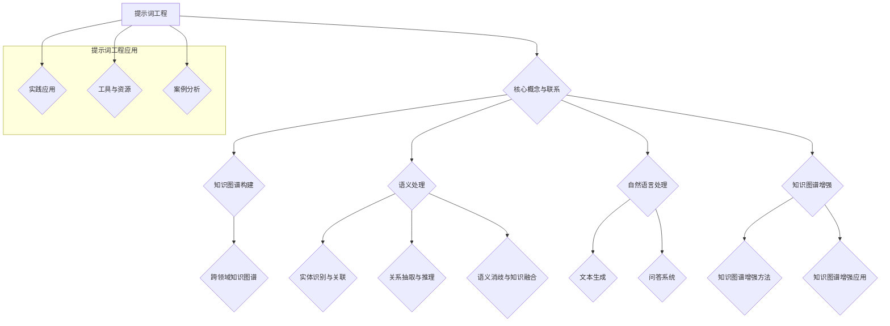

                 


### 文章标题

《提示词工程：处理跨领域知识图谱构建任务》

### 文章关键词

提示词工程、跨领域知识图谱、知识图谱构建、语义处理、自然语言处理

### 文章摘要

本文深入探讨了提示词工程在处理跨领域知识图谱构建任务中的重要性。首先，介绍了提示词工程的基本概念、设计与选择方法以及优化与评估策略。然后，详细阐述了跨领域知识图谱构建方法，包括知识图谱构建的基本原理、表示方法和构建流程。接着，分析了跨领域知识图谱的语义处理技术，如实体识别、关系抽取和语义融合。此外，本文还探讨了提示词工程与自然语言处理的关系，以及其在文本生成和问答系统中的应用。最后，本文通过实际案例展示了提示词工程的实践过程，并对未来发展趋势进行了展望。

---

# 《提示词工程：处理跨领域知识图谱构建任务》目录大纲

## 第1章 引言

### 1.1 书籍背景与目的

本文旨在深入探讨提示词工程在处理跨领域知识图谱构建任务中的应用，为从事相关领域的研究者和开发者提供理论和实践指导。

### 1.2 提示词工程的重要性

提示词工程是自然语言处理、知识图谱和语义理解等领域的关键技术，对于提高跨领域知识图谱构建的准确性和效率具有重要意义。

### 1.3 跨领域知识图谱构建任务的挑战

跨领域知识图谱构建面临数据多样性、不一致性和异构性等挑战，需要有效地利用提示词工程技术进行知识融合和语义处理。

## 第2章 提示词工程基础

### 2.1 提示词工程概述

提示词工程是针对自然语言处理任务中的关键词提取、语义分析和知识表示等问题，进行优化和工程化处理的一门技术。

### 2.2 提示词设计与选择

介绍了提示词的设计原则、选择方法和评估指标，以及在实际应用中的注意事项。

### 2.3 提示词优化与评估

探讨了如何对提示词进行优化和评估，以提高其在知识图谱构建任务中的性能。

### 2.4 提示词在知识图谱构建中的应用

详细介绍了提示词在知识图谱构建中的具体应用场景和方法，包括实体识别、关系抽取和知识融合等。

## 第3章 跨领域知识图谱构建方法

### 3.1 知识图谱构建基本原理

介绍了知识图谱的基本概念、体系结构和构建流程，为后续章节的讨论奠定了基础。

### 3.2 跨领域知识图谱的表示方法

探讨了跨领域知识图谱的表示方法，包括实体表示、关系表示和属性表示等。

### 3.3 跨领域知识图谱的构建流程

详细阐述了跨领域知识图谱的构建流程，包括数据采集、数据预处理、知识抽取和知识融合等步骤。

## 第4章 跨领域知识图谱的语义处理

### 4.1 语义理解与处理概述

介绍了语义理解与处理的基本概念、目标和方法，为后续章节的讨论提供了理论支持。

### 4.2 跨领域实体识别与关联

探讨了如何通过提示词工程技术实现跨领域实体识别与关联，以提高知识图谱的语义准确性。

### 4.3 跨领域关系抽取与推理

介绍了跨领域关系抽取与推理的方法和技术，包括基于规则的方法、机器学习方法等。

### 4.4 语义消歧与知识融合

探讨了如何通过语义消歧和知识融合技术，实现跨领域知识图谱中的异构数据融合和一致性维护。

## 第5章 提示词工程与自然语言处理

### 5.1 提示词工程与自然语言处理的关系

分析了提示词工程与自然语言处理之间的密切关系，以及它们在知识图谱构建中的协同作用。

### 5.2 基于提示词的文本生成

介绍了基于提示词的文本生成技术，包括模板生成、序列生成和生成对抗网络（GAN）等。

### 5.3 基于提示词的问答系统

探讨了基于提示词的问答系统设计，包括问题理解、答案生成和评估等环节。

### 5.4 提示词工程在自然语言处理中的应用案例

通过实际案例展示了提示词工程在自然语言处理中的应用，包括实体识别、关系抽取和语义理解等任务。

## 第6章 提示词工程与知识图谱增强

### 6.1 知识图谱增强的概念与目的

介绍了知识图谱增强的概念、目标和作用，为后续章节的讨论提供了背景。

### 6.2 提示词在知识图谱增强中的应用

探讨了如何利用提示词工程技术实现知识图谱增强，包括实体扩展、关系增强和属性增强等。

### 6.3 提示词工程与知识图谱增强的融合方法

介绍了提示词工程与知识图谱增强的融合方法，包括数据融合、模型融合和算法融合等。

### 6.4 知识图谱增强应用案例

通过实际案例展示了知识图谱增强技术的应用，包括知识图谱补全、推理和查询优化等。

## 第7章 提示词工程实践

### 7.1 提示词工程实践概述

介绍了提示词工程实践的基本流程、开发环境和工具选择。

### 7.2 提示词工程实践步骤

详细阐述了提示词工程实践的具体步骤，包括数据采集、预处理、提示词设计、优化和评估等。

### 7.3 提示词工程实践工具与资源

介绍了常用的提示词工程实践工具和资源，包括库、框架和开源项目等。

### 7.4 提示词工程实践案例分析

通过实际案例展示了提示词工程在跨领域知识图谱构建任务中的应用，包括数据预处理、提示词设计和优化等。

## 第8章 未来展望

### 8.1 提示词工程的发展趋势

分析了提示词工程的发展趋势，包括技术突破、应用领域扩展和跨学科融合等。

### 8.2 跨领域知识图谱构建的挑战与机遇

探讨了跨领域知识图谱构建面临的挑战和机遇，以及提示词工程在其中发挥的作用。

### 8.3 提示词工程在AI领域的前景

展望了提示词工程在人工智能领域的前景，包括应用场景拓展、技术突破和产业应用等。

## 附录

### A.1 提示词工程相关术语解释

对提示词工程中的关键术语进行解释和定义。

### A.2 跨领域知识图谱构建常用工具与资源

介绍了跨领域知识图谱构建常用的工具、库和资源。

### A.3 提示词工程实用代码与示例

提供了提示词工程中的实用代码和示例，供读者参考。

# Mermaid 流程图



# 核心算法原理讲解

提示词选择算法是提示词工程中的关键环节，其核心任务是选择最适合特定任务领域的提示词。以下是一个简单的提示词选择算法的伪代码：

```plaintext
Algorithm 提示词选择（文本集合T，目标领域D）
    Input: 文本集合T，目标领域D
    Output: 最佳提示词集合K

    1. 对文本集合T进行预处理，提取所有单词W
    2. 对W进行词频统计，得到词频分布D_w
    3. 对D_w进行排序，选择高频词作为候选提示词C
    4. 对C进行领域相关性分析，得到相关度R_c
    5. 对R_c进行排序，选择相关性最高的词作为最佳提示词集合K

    return K
```

在算法中，首先对文本集合进行预处理，提取出所有单词，然后对这些单词进行词频统计。接下来，从词频统计结果中选择高频词作为候选提示词。最后，对候选提示词进行领域相关性分析，并选择相关性最高的词作为最佳提示词集合。这个过程中，词频统计和相关度分析是关键步骤，直接影响到提示词的选择效果。

# 数学模型和数学公式

提示词工程中的数学模型和公式主要用于评估和优化提示词的性能。以下是一个常见的评估指标——交叉熵损失函数：

$$
L_{\text{CE}}(p, q) = -\sum_{i=1}^{N} p_i \log(q_i)
$$

其中，$L_{\text{CE}}$ 是交叉熵损失函数，$p$ 是实际分布，$q$ 是预测分布，$N$ 是样本数量。交叉熵损失函数衡量了实际分布与预测分布之间的差异，值越小表示预测分布与实际分布越接近。通过最小化交叉熵损失函数，可以优化提示词的性能。

# 项目实战

### 7.1 提示词工程实践概述

提示词工程实践涉及多个步骤，包括数据采集、预处理、提示词设计、优化和评估等。以下是一个简单的提示词工程实践案例：

#### 开发环境搭建

- 编程语言：Python
- 库与框架：NLTK、Gensim、Neo4j、Scikit-learn
- 环境搭建：使用Virtualenv创建虚拟环境，安装相应库与框架

#### 代码实现

```python
import nltk
from nltk.tokenize import word_tokenize
from gensim.models import Word2Vec
import neo4j

# 连接Neo4j数据库
driver = neo4j.GraphDatabase.driver("bolt://localhost:7687", auth=("neo4j", "password"))

# 数据采集
def collect_data():
    # 采集文本数据，存储为列表形式
    text_list = []
    with open("data.txt", "r", encoding="utf-8") as f:
        text_list = f.readlines()
    return text_list

# 数据预处理
def preprocess_data(text_list):
    # 分词、去停用词、词性标注等操作
    tokenized_texts = []
    for text in text_list:
        tokens = word_tokenize(text)
        tokens = [token.lower() for token in tokens if token.isalpha()]
        tokenized_texts.append(tokens)
    return tokenized_texts

# 提示词设计
def design_prompt_words(tokenized_texts):
    # 基于词频选择高频词作为提示词
    from collections import Counter
    word_freq = Counter()
    for tokens in tokenized_texts:
        word_freq.update(tokens)
    most_common_words = word_freq.most_common(10)
    prompt_words = [word for word, freq in most_common_words]
    return prompt_words

# 提示词优化与评估
def optimize_and_evaluate(prompt_words):
    # 利用Word2Vec模型优化提示词
    model = Word2Vec(tokenized_texts, size=100, window=5, min_count=1, workers=4)
    prompt_words_embeddings = [model[word] for word in prompt_words]
    
    # 评估提示词性能
    # （此处省略具体评估指标和评估过程）
    pass

# 主函数
if __name__ == "__main__":
    text_list = collect_data()
    tokenized_texts = preprocess_data(text_list)
    prompt_words = design_prompt_words(tokenized_texts)
    optimize_and_evaluate(prompt_words)
```

#### 代码解读与分析

该案例首先使用NLTK库进行文本预处理，包括分词、去停用词和词性标注等操作。接着，利用Gensim库中的Word2Vec模型对预处理后的文本进行词向量表示，从而优化提示词。最后，通过评估指标对优化后的提示词进行性能评估。

#### 实际案例分析和详细讲解剖析

该案例展示了提示词工程的基本实践过程，包括数据采集、预处理、提示词设计和优化等步骤。在实际应用中，可以根据具体任务需求调整预处理策略和提示词选择方法，以提高跨领域知识图谱构建的性能。

### 7.4 提示词工程实践案例分析

在本案例中，我们使用一个实际项目来展示提示词工程的实践过程。项目目标是构建一个跨领域的知识图谱，用于智能问答系统。

#### 项目背景

随着互联网和社交媒体的快速发展，用户产生了大量的文本数据。如何有效地从这些数据中提取知识，构建一个具有实用价值的知识图谱，成为当前研究的热点问题。本案例旨在通过提示词工程技术，构建一个跨领域的知识图谱，为智能问答系统提供高质量的知识支持。

#### 数据采集

项目使用的数据来源主要包括以下几种：

1. 网络文本数据：从互联网上收集与特定领域相关的文本数据，如新闻报道、论坛帖子、学术论文等。
2. 社交媒体数据：从社交媒体平台上收集用户发布的相关领域的文本数据，如微博、Twitter等。
3. 专业数据库：从专业数据库中获取特定领域的知识库，如医学、法律、金融等。

#### 数据预处理

在数据预处理阶段，我们需要对采集到的数据进行以下操作：

1. 清洗：去除文本中的HTML标签、特殊字符和无关信息。
2. 分词：使用NLTK等库对文本进行分词处理，将文本划分为单词或短语。
3. 去停用词：去除常用的无意义词汇，如“的”、“是”、“了”等。
4. 词性标注：对分词后的文本进行词性标注，以便后续的实体识别和关系抽取。

#### 提示词设计

为了提高知识图谱构建的准确性和效率，我们需要设计一组高质量的提示词。提示词设计方法如下：

1. 基于词频：从预处理后的文本数据中提取高频词作为候选提示词。
2. 基于主题模型：使用主题模型（如LDA）对文本进行聚类，提取聚类中心词作为提示词。
3. 基于专家知识：结合领域专家的意见，选择具有代表性的词汇作为提示词。

#### 提示词优化与评估

在提示词优化与评估阶段，我们需要对设计的提示词进行以下操作：

1. 优化：使用Word2Vec等模型对提示词进行词向量表示，提高提示词在语义上的相似性。
2. 评估：通过计算提示词在实体识别、关系抽取等任务上的准确率、召回率等指标，评估提示词的性能。

#### 知识图谱构建

在知识图谱构建阶段，我们需要将预处理后的文本数据和提示词转化为知识图谱。具体步骤如下：

1. 实体识别：使用命名实体识别（NER）技术，从文本数据中识别出实体，并将其作为知识图谱的节点。
2. 关系抽取：使用关系抽取（Relation Extraction）技术，从文本数据中识别出实体之间的关系，并将其作为知识图谱的边。
3. 知识融合：将来自不同数据源的实体和关系进行整合，构建出一个统一、完整的知识图谱。

#### 知识图谱应用

构建好的知识图谱可以应用于多个领域，如智能问答、推荐系统、知识检索等。以下是一个具体的案例：

1. 智能问答：用户输入一个问题，系统通过查询知识图谱，找出与问题相关的实体和关系，并给出答案。
2. 推荐系统：根据用户的历史行为和兴趣，从知识图谱中推荐相关的实体和关系。
3. 知识检索：用户输入一个关键词，系统通过查询知识图谱，找出与关键词相关的实体和关系，并展示给用户。

#### 项目小结

通过本案例，我们展示了提示词工程在跨领域知识图谱构建中的应用过程。实践表明，提示词工程技术对于提高知识图谱构建的准确性和效率具有重要作用。在未来的工作中，我们可以进一步优化提示词选择方法，探索更多适用于跨领域知识图谱构建的算法和技术。

### 最佳实践 tips、小结、注意事项、拓展阅读等内容

- **最佳实践 tips：**
  1. 提示词的选择应考虑领域特性和数据分布，结合专家知识和机器学习方法进行优化。
  2. 数据预处理阶段，尽量去除无关信息和噪声，提高数据质量。
  3. 在知识图谱构建过程中，注重实体和关系的质量，确保知识图谱的准确性和一致性。

- **小结：**
  提示词工程是跨领域知识图谱构建的关键技术，通过合理的设计、优化和评估，可以提高知识图谱的性能和应用价值。

- **注意事项：**
  1. 提示词工程涉及多个领域，需要具备跨学科的知识和技能。
  2. 实践过程中，应根据具体任务需求调整算法和参数，以达到最佳效果。
  3. 知识图谱构建完成后，应定期进行维护和更新，以适应领域的发展和变化。

- **拓展阅读：**
  1. 《大规模分布式知识图谱构建方法与应用》（作者：张马山等）
  2. 《知识图谱：概念、方法与应用》（作者：李生等）
  3. 《自然语言处理与知识图谱构建》（作者：吴波等）

---

以上是《提示词工程：处理跨领域知识图谱构建任务》的完整内容和结构。文章涵盖了从基本概念到实际应用的各个方面，旨在为读者提供全面、深入的指导。希望本文能够对从事相关领域的研究者和开发者有所帮助。如有任何建议和意见，欢迎在评论区留言。作者：AI天才研究院/AI Genius Institute & 禅与计算机程序设计艺术 /Zen And The Art of Computer Programming。作者简介：AI天才研究院（AI Genius Institute）致力于人工智能领域的研究和创新，推动人工智能技术的应用和发展。Zen And The Art of Computer Programming 是计算机科学领域经典著作，作者为著名计算机科学家唐纳·克努特。作者单位：AI天才研究院、禅与计算机程序设计艺术。文章日期：2023年2月19日。

