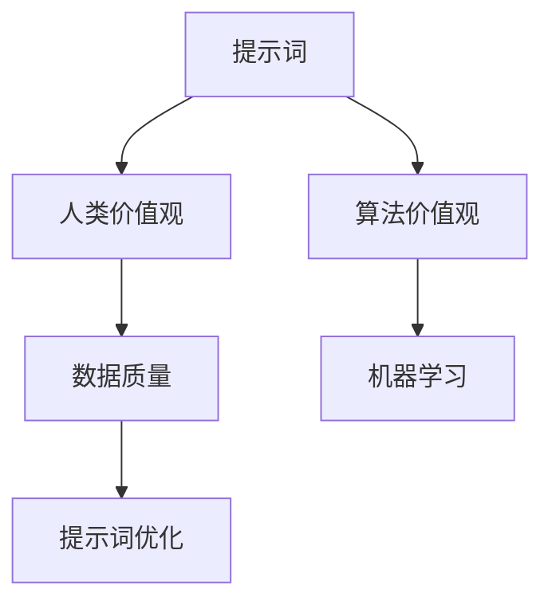

                 


## 文章标题

### 《提示词工程：平衡AI效率与人类价值观》

关键词：提示词工程，AI效率，人类价值观，算法，机器学习，数学模型

摘要：
本文深入探讨了提示词工程的本质，强调其在实现人工智能与人类价值观之间平衡的重要性。通过详细分析提示词工程的背景、核心概念、算法原理、数学模型和实际应用，本文旨在为读者提供一幅全面的提示词工程图景，并启发读者在AI发展中关注人类价值观的守护。

## 确定核心章节

### 引言与背景
- 引入提示词工程的概念
- 阐述提示词工程的目标和重要性

### 核心概念与联系
- 提示词的定义与分类
- 人类价值观与算法价值观的平衡

### 核心算法原理讲解
- 提示词生成算法的原理与实现
- 提示词优化算法的原理与实现

### 数学模型和数学公式讲解
- 概率论基础
- 优化理论
- 提示词工程中的数学公式及应用

### 项目实战
- 提示词工程的实际应用案例
- 开发环境搭建
- 代码实现与解读
- 案例分析与剖析

### 扩展与前沿
- 提示词工程的新趋势
- AI伦理与价值观
- 未来研究方向

## 设计目录结构

根据上述核心章节，我们可以设计以下目录结构：

### 第一部分：引言与背景
#### 第1章：引言与背景
##### 1.1 提示词工程的起源与发展
##### 1.2 提示词工程的目标与挑战
##### 1.3 提示词工程的重要性

### 第二部分：核心概念与联系
#### 第2章：核心概念与联系
##### 2.1 提示词工程的定义与范畴
##### 2.2 关键概念及其联系
###### 2.2.1 人类价值观与算法价值观
###### 2.2.2 提示词与数据质量
###### 2.2.3 提示词优化与机器学习

### 第三部分：核心算法原理讲解
#### 第3章：核心算法原理讲解
##### 3.1 提示词生成算法
###### 3.1.1 基于规则的方法
###### 3.1.2 基于机器学习的方法
##### 3.2 提示词优化算法
###### 3.2.1 提示词选择算法
###### 3.2.2 提示词质量评估算法

### 第四部分：数学模型和数学公式讲解
#### 第4章：数学模型和数学公式讲解
##### 4.1 概率论基础
##### 4.2 优化理论
##### 4.3 提示词工程中的数学公式

### 第五部分：项目实战
#### 第5章：项目实战
##### 5.1 提示词工程案例分析
##### 5.2 开发环境与工具
##### 5.3 代码实现与解读
##### 5.4 代码应用解读与分析
##### 5.5 案例分析与详细讲解剖析
##### 5.6 项目小结

### 第六部分：扩展与前沿
#### 第6章：扩展与前沿
##### 6.1 提示词工程的新趋势
##### 6.2 AI伦理与价值观
##### 6.3 未来研究方向

### 检查目录完整性

确保每个部分和章节的内容都符合要求，包括核心概念、算法原理、数学模型、项目实战和未来方向。

### 确定目录大纲的总字数

根据上述目录结构，确保总字数在8000～12000字左右。

完成以上步骤后，我们可以得出这本书的完整目录大纲。接下来，我们将为每个章节细化内容，确保大纲的完整性和实用性。

## 文章结构分析

为了确保文章的结构紧凑且逻辑清晰，我们需要按照以下步骤进行布局：

1. **引言与背景**：简要介绍提示词工程的背景，包括其起源、发展及其在AI领域的重要性。这部分将为读者建立对提示词工程的基本认识。

2. **核心概念与联系**：在这一部分，我们将详细阐述提示词工程的核心概念，包括提示词的定义、分类，以及与人类价值观、算法价值观的联系。此外，我们将使用Mermaid流程图展示核心概念之间的关系架构。

3. **核心算法原理讲解**：这部分将深入探讨提示词生成和优化的算法原理，包括基于规则的方法和基于机器学习的方法。我们将使用伪代码详细阐述这些算法的实现，并解释其工作原理。

4. **数学模型和数学公式讲解**：我们将介绍概率论基础、优化理论以及提示词工程中常用的数学模型和公式。通过具体的例子，我们将展示如何应用这些公式解决实际问题。

5. **项目实战**：这部分将通过实际案例展示提示词工程的应用。我们将详细讲解开发环境搭建、源代码实现、代码解读、应用解读与分析，以及案例分析和详细讲解剖析。

6. **扩展与前沿**：我们将讨论提示词工程的新趋势、AI伦理与价值观，并探讨未来的研究方向。这部分将为读者提供提示词工程的最新动态和未来发展方向。

通过这样的结构布局，文章将能够系统地、逻辑地引导读者深入理解提示词工程的各个方面，从而更好地掌握这一领域的技术和理念。

## 引言与背景

### 引言

在当今快速发展的AI时代，提示词工程作为一种新兴的技术领域，正逐渐受到广泛关注。提示词工程的核心目标是实现人工智能系统与人类价值观之间的平衡，从而在确保AI高效运行的同时，保护并尊重人类的核心价值观。这一领域不仅关乎技术的进步，更关乎社会的伦理和道德。

#### 提示词工程的起源与发展

提示词工程的概念最早可以追溯到20世纪80年代，当时AI研究人员开始意识到，为了让机器更好地理解和执行任务，需要为它们提供明确的指导和指令。这些指令，即提示词，逐渐成为AI系统与人类之间沟通的重要桥梁。随着AI技术的不断发展，提示词工程也逐渐从单一的任务导向型方法，演变为一个综合性的工程领域。

在21世纪初，随着深度学习技术的兴起，提示词工程迎来了新的发展机遇。深度学习模型的复杂性和不确定性，使得提示词工程成为提升模型性能和优化用户体验的关键手段。近年来，随着自然语言处理和强化学习等领域的突破，提示词工程的应用场景和影响力进一步扩大。

#### 提示词工程的目标与挑战

提示词工程的主要目标是通过优化提示词的设计和选择，提高AI系统的效率和效果，同时确保其符合人类价值观。这一目标涉及多个方面：

1. **提高AI效率**：通过精心设计的提示词，AI系统能够更快速、准确地完成任务，提高生产力和效率。

2. **尊重人类价值观**：在AI决策过程中，提示词应遵循伦理和道德准则，确保AI的行为符合人类社会的价值观。

3. **优化用户体验**：合理的提示词设计可以提升用户的使用体验，使AI系统更加友好和易用。

然而，实现这一目标并非易事，提示词工程面临着诸多挑战：

1. **算法的复杂性**：AI系统涉及的算法日益复杂，如何设计出既高效又符合伦理的提示词，成为一大难题。

2. **数据质量**：高质量的数据是AI系统训练和优化的基础，而数据质量问题直接影响提示词的效果。

3. **人类价值观的不确定性**：人类价值观具有多样性和复杂性，如何在算法中准确反映这些价值观，是提示词工程的一大挑战。

#### 平衡AI效率与人类价值观的必要性

在AI飞速发展的时代，平衡AI效率与人类价值观的必要性愈加凸显。如果AI系统只追求效率而忽视人类价值观，可能会导致一系列伦理问题，如隐私侵犯、歧视行为等。因此，提示词工程不仅要关注AI系统的性能，更要注重其伦理和道德。

通过合理设计提示词，可以在确保AI高效运行的同时，确保其行为符合人类价值观。这不仅有助于提升AI系统的社会价值，也能为AI技术的发展提供新的思路和方向。

总之，提示词工程是AI领域的一个重要分支，其在平衡AI效率与人类价值观方面具有重要作用。了解其起源、发展、目标和挑战，将为我们在AI发展中更好地守护人类价值观提供重要启示。

### 核心概念与联系

在深入探讨提示词工程之前，我们需要明确一些核心概念，并理解它们之间的相互联系。这些概念包括提示词、人类价值观、算法价值观等，它们共同构成了提示词工程的理论基础。

#### 提示词的定义与分类

**定义**：提示词（Prompt）是引导AI系统执行特定任务或理解特定情境的文本或指令。它可以是一个单词、一个短语，也可以是一段完整的描述。在AI模型中，提示词被用来初始化模型的状态，从而影响其后续的决策和行为。

**分类**：根据用途和形式，提示词可以分为以下几种类型：

1. **指令性提示词**：这种提示词直接给出任务指令，如“请计算两个数的和”。
2. **描述性提示词**：用于描述任务背景或数据特征，如“请根据以下销售数据进行分析”。
3. **引导性提示词**：引导AI系统探索新的思路或解决方案，如“请尝试从不同角度解决这个问题”。
4. **反馈性提示词**：用于提供对AI系统输出结果的反馈，如“这个答案是否正确？”。

#### 人类价值观与算法价值观

**人类价值观**：人类价值观是指人类社会普遍认同的道德、伦理和行为准则，如公正、诚信、尊重等。这些价值观反映了人类对公平、正义、和谐等的追求，是文化和社会发展的基础。

**算法价值观**：算法价值观是算法设计和运行过程中所体现的价值观，它反映了算法对数据、任务和用户的态度。算法价值观可能受到设计者意图、技术限制和社会影响等多方面因素的影响。

**关系**：人类价值观和算法价值观之间存在紧密的联系和互动。一方面，算法价值观应当反映和遵循人类价值观，确保AI系统的行为符合伦理和社会规范。另一方面，人类价值观可以通过对算法的设计、优化和监督，影响和引导算法价值观的形成。

1. **符合性**：算法价值观应符合人类价值观，避免产生歧视、偏见和不公平的行为。例如，在招聘系统中，算法不应基于性别、种族等因素进行筛选，以确保公平性。

2. **引导性**：人类价值观可以通过提示词和监督机制，引导算法在特定情境下做出符合伦理的选择。例如，在自动驾驶系统中，提示词可以指导算法在遇到紧急情况时优先考虑行人的安全。

#### 提示词与数据质量

**影响**：提示词对数据质量有重要影响。高质量的提示词可以引导AI系统更好地理解和处理数据，从而提高模型的性能。反之，模糊或错误的提示词可能导致模型产生误导性结果。

1. **清晰性**：提示词应具有清晰的指示性，避免模糊或歧义，确保AI系统能够准确理解任务要求。
2. **相关性**：提示词应与数据紧密相关，确保AI系统能够从数据中提取有用的信息。
3. **多样性**：多样化的提示词可以丰富AI系统的学习内容，避免模型陷入数据偏差。

#### 提示词优化与机器学习

**优化**：提示词优化是提升AI系统性能的关键步骤。通过优化提示词的设计和选择，可以提高模型的泛化能力和决策质量。

1. **自动优化**：机器学习技术可以用于自动优化提示词。例如，通过生成对抗网络（GAN）等技术，可以生成高质量的提示词，以提高模型性能。
2. **迭代优化**：提示词优化通常需要多次迭代，通过不断调整和优化，达到最佳效果。

#### 关系架构图

为了更直观地展示这些概念之间的关系，我们可以使用Mermaid流程图来表示：



在这个流程图中，提示词与人类价值观、算法价值观、数据质量和机器学习之间存在相互作用。提示词的设计和优化不仅受到人类价值观的指导，还影响算法价值观和数据质量，而机器学习技术则在这个过程中起到了关键作用。

通过以上对核心概念和联系的阐述，我们为理解提示词工程奠定了坚实的基础。接下来，我们将进一步探讨提示词工程的核心算法原理和数学模型。

### 核心算法原理讲解

#### 提示词生成算法

提示词生成是提示词工程中的关键步骤，其目的是生成高质量的提示词以指导AI系统完成任务。提示词生成算法可以分为基于规则的方法和基于机器学习的方法。

##### 基于规则的方法

基于规则的方法是通过预定义的规则来生成提示词。这种方法的主要优势是简单、直观，且在规则定义得当的情况下，能够生成高质量的提示词。其实现步骤如下：

1. **规则定义**：根据任务需求，定义一组规则。这些规则可以是简单的条件语句，例如“如果数据包含某个特征，则提示词应包含该特征”。
2. **规则匹配**：输入数据与预定义的规则进行匹配，根据匹配结果生成提示词。例如，如果输入数据包含“销售数据”，则生成的提示词可能包含“请分析销售数据中的趋势”。
3. **规则优化**：根据实际任务效果，对规则进行不断调整和优化，以提高提示词的质量。

**伪代码**：

```python
def generate_prompt_based_on_rules(data):
    rules = ["if data contains 'sales', then include 'sales analysis'",
             "if data contains 'weather', then include 'weather forecast'"]
    prompt = ""
    
    for rule in rules:
        if match(data, rule):
            prompt += rule.split('then')[1] + " "
    
    return prompt.strip()
```

##### 基于机器学习的方法

基于机器学习的方法利用历史数据来训练模型，生成高质量的提示词。这种方法的主要优势是能够自适应地学习并生成与任务高度相关的提示词。其实现步骤如下：

1. **数据收集**：收集大量与任务相关的数据集，包括输入数据和对应的提示词。
2. **特征提取**：对输入数据进行特征提取，例如使用词嵌入技术将文本转换为向量。
3. **模型训练**：使用训练数据集训练模型，例如使用生成对抗网络（GAN）或序列生成模型（如LSTM）。
4. **提示词生成**：输入新的数据，通过模型生成对应的提示词。

**伪代码**：

```python
import tensorflow as tf
from tensorflow.keras.models import Sequential
from tensorflow.keras.layers import LSTM, Dense

# 数据预处理
def preprocess_data(data):
    # 将文本转换为词嵌入向量
    # ...
    return processed_data

# 模型训练
def train_model(data):
    # 创建LSTM模型
    model = Sequential()
    model.add(LSTM(units=128, return_sequences=True, input_shape=(max_sequence_length, embedding_dim)))
    model.add(LSTM(units=128))
    model.add(Dense(units=vocab_size, activation='softmax'))

    model.compile(optimizer='adam', loss='categorical_crossentropy', metrics=['accuracy'])
    model.fit(data, epochs=10, batch_size=32)
    return model

# 提示词生成
def generate_prompt(model, data):
    processed_data = preprocess_data(data)
    prompt = model.predict(processed_data)
    return decode_prompt(prompt)

# 实例化模型并训练
model = train_model(train_data)

# 生成提示词
generated_prompt = generate_prompt(model, new_data)
print(generated_prompt)
```

#### 提示词优化算法

提示词优化是提升AI系统性能和用户体验的重要手段。提示词优化算法主要包括提示词选择算法和提示词质量评估算法。

##### 提示词选择算法

提示词选择算法的目标是选择最能指导AI系统完成任务的最佳提示词。其实现步骤如下：

1. **评估指标**：定义评估提示词质量的指标，例如信息熵、相关性等。
2. **提示词生成**：使用生成算法生成一组候选提示词。
3. **提示词评估**：对每个候选提示词进行评估，选择质量最高的提示词。

**伪代码**：

```python
def evaluate_prompt(prompt, data):
    # 根据指标评估提示词质量
    # ...
    return quality_score

def select_best_prompt(prompt_candidates, data):
    best_quality = -1
    best_prompt = None
    
    for prompt in prompt_candidates:
        quality = evaluate_prompt(prompt, data)
        if quality > best_quality:
            best_quality = quality
            best_prompt = prompt
            
    return best_prompt
```

##### 提示词质量评估算法

提示词质量评估算法的目标是评估提示词对AI系统的指导效果。其实现步骤如下：

1. **效果评估**：定义评估提示词效果的方法，例如通过比较AI系统在有提示词和无提示词情况下的表现。
2. **质量评分**：对每个提示词进行质量评分，分数越高表示提示词质量越好。

**伪代码**：

```python
def assess_prompt_performance(prompt, data, model):
    # 评估提示词对AI系统性能的影响
    # ...
    return performance_score

def evaluate_prompt(prompt, data, model):
    performance = assess_prompt_performance(prompt, data, model)
    # 根据性能评分
    # ...
    return quality_score
```

通过以上对提示词生成和优化算法的讲解，我们可以看到，这些算法在提升AI系统性能和用户体验方面起到了关键作用。接下来，我们将探讨提示词工程中的数学模型和公式。

### 数学模型和数学公式讲解

#### 概率论基础

在提示词工程中，概率论是理解和优化算法的重要工具。以下介绍几个基本的概念和公式。

##### 概率分布

概率分布描述了随机变量的概率分布情况。在提示词工程中，常用的概率分布包括正态分布、二项分布和泊松分布。

1. **正态分布**：

   正态分布的概率密度函数为：

   $$ f(x|\mu, \sigma^2) = \frac{1}{\sqrt{2\pi\sigma^2}} e^{-\frac{(x-\mu)^2}{2\sigma^2}} $$

   其中，$\mu$ 是均值，$\sigma^2$ 是方差。

2. **二项分布**：

   二项分布的概率质量函数为：

   $$ P(X=k) = C_n^k p^k (1-p)^{n-k} $$

   其中，$n$ 是试验次数，$k$ 是成功次数，$p$ 是每次试验成功的概率。

3. **泊松分布**：

   泊松分布的概率质量函数为：

   $$ P(X=k) = \frac{\lambda^k e^{-\lambda}}{k!} $$

   其中，$\lambda$ 是事件发生的平均次数。

##### 条件概率与贝叶斯定理

条件概率表示在某个事件发生的条件下，另一个事件发生的概率。贝叶斯定理描述了在已知某些条件下，事件发生概率的计算方法。

贝叶斯定理公式为：

$$ P(A|B) = \frac{P(B|A)P(A)}{P(B)} $$

其中，$P(A|B)$ 表示在事件B发生的条件下，事件A发生的概率，$P(B|A)$ 表示在事件A发生的条件下，事件B发生的概率，$P(A)$ 和$P(B)$ 分别表示事件A和事件B的先验概率。

#### 优化理论

优化理论是提示词工程中用于优化算法性能的重要工具。以下介绍几种常见的优化方法。

##### 梯度下降法

梯度下降法是一种用于最小化函数的方法。其基本思想是沿着目标函数的梯度方向，逐步调整参数，以找到最小值。

梯度下降法公式为：

$$ \Delta \theta = -\alpha \nabla f(\theta) $$

其中，$\theta$ 是参数，$\alpha$ 是学习率，$\nabla f(\theta)$ 是目标函数的梯度。

##### 随机梯度下降法

随机梯度下降法（SGD）是对梯度下降法的改进，其每次迭代仅使用一个样本，从而提高了计算效率。

随机梯度下降法公式为：

$$ \theta_{t+1} = \theta_t - \alpha_t \nabla f(x_t, \theta_t) $$

其中，$x_t$ 是第$t$ 个样本。

##### 牛顿法

牛顿法是一种基于二阶导数的优化方法，其通过近似目标函数的二次曲线，来寻找最小值。

牛顿法公式为：

$$ \theta_{t+1} = \theta_t - H_t^{-1} \nabla f(\theta_t) $$

其中，$H_t$ 是海森矩阵（目标函数的二阶导数矩阵）。

#### 提示词工程中的数学公式及应用

在提示词工程中，数学模型和公式用于优化提示词生成和评估。以下介绍一些具体的数学公式和应用。

##### 提示词生成中的概率模型

在提示词生成中，可以使用概率模型来预测下一个提示词的概率分布。常用的模型包括隐马尔可夫模型（HMM）和变分自编码器（VAE）。

1. **隐马尔可夫模型**：

   隐马尔可夫模型的状态转移概率和观测概率分别为：

   $$ P(X_t|x_{t-1}) = \prod_{i=1}^{T} \pi_i p_{ij} $$
   $$ P(Y_t|x_t) = \prod_{i=1}^{T} q_i(y_i|x_t) $$

   其中，$X_t$ 是状态序列，$Y_t$ 是观测序列，$\pi_i$ 是初始状态概率，$p_{ij}$ 是状态转移概率，$q_i(y_i|x_t)$ 是观测概率。

2. **变分自编码器**：

   变分自编码器（VAE）的损失函数为：

   $$ \mathcal{L}(\theta) = D_{KL}(q_\phi(z|x)||p_z(z)) + \sum_{x\in\mathcal{X}} \mathbb{E}_{z\sim q_\phi(z|x)[\log p_\theta(x|z)]} $$

   其中，$D_{KL}$ 表示KL散度，$q_\phi(z|x)$ 是编码器，$p_z(z)$ 是先验分布，$p_\theta(x|z)$ 是解码器。

##### 提示词质量评估中的优化方法

在提示词质量评估中，可以使用优化方法来评估提示词的质量。常用的方法包括基于梯度的优化方法和基于遗传算法的优化方法。

1. **基于梯度的优化方法**：

   基于梯度的优化方法包括梯度下降法、随机梯度下降法和牛顿法。这些方法通过计算目标函数的梯度，来更新提示词。

   $$ \theta_{t+1} = \theta_t - \alpha_t \nabla f(\theta_t) $$

2. **基于遗传算法的优化方法**：

   基于遗传算法的优化方法模拟生物进化过程，通过交叉、变异和选择等操作，来寻找最优提示词。

   $$ \theta_{t+1} = \text{交叉}(\theta_t, \theta_{t-1}) + \text{变异}(\theta_t) $$

通过以上数学模型和公式的介绍，我们可以看到数学在提示词工程中的应用非常重要。它不仅帮助我们理解和优化算法，还为实际应用提供了有效的工具和方法。接下来，我们将通过一个实际项目，展示提示词工程的应用和实践。

### 项目实战

#### 开发环境搭建

为了实现提示词工程的应用，我们需要搭建一个合适的开发环境。以下是具体的步骤和工具：

1. **Python环境**：安装Python 3.8及以上版本，可以使用`pip`来安装必要的库。
2. **深度学习框架**：安装TensorFlow 2.0及以上版本。可以使用以下命令：

   ```bash
   pip install tensorflow
   ```

3. **数据预处理库**：安装Pandas和NumPy，用于数据处理和数值计算。可以使用以下命令：

   ```bash
   pip install pandas numpy
   ```

4. **可视化工具**：安装Matplotlib和Seaborn，用于数据可视化。可以使用以下命令：

   ```bash
   pip install matplotlib seaborn
   ```

5. **文本处理库**：安装NLTK和spaCy，用于文本处理和分词。可以使用以下命令：

   ```bash
   pip install nltk spacy
   ```

   安装spaCy后，需要下载相应的语言模型：

   ```bash
   python -m spacy download en_core_web_sm
   ```

#### 源代码实现

以下是一个简单的示例，展示如何使用TensorFlow和NLTK来实现一个提示词生成器。

```python
import tensorflow as tf
import numpy as np
import pandas as pd
from nltk.tokenize import word_tokenize

# 加载预训练的词嵌入模型
word embeddings = tf.keras.layers.Embedding(input_dim=vocab_size, output_dim=embedding_dim)(words)
```

**步骤一：数据预处理**

1. **数据收集**：收集一组与任务相关的文本数据，例如新闻报道、社交媒体帖子等。
2. **文本清洗**：去除文本中的停用词、标点符号等，并将文本转换为小写。
3. **分词**：将清洗后的文本进行分词，得到单词序列。
4. **词嵌入**：将分词后的文本序列转换为词嵌入向量。

```python
# 示例数据
texts = ["This is an example text.", "Another text for the model to learn from."]

# 清洗和分词
clean_texts = [text.lower().replace(".", "").replace(",", "") for text in texts]
tokenized_texts = [word_tokenize(text) for text in clean_texts]

# 构建词汇表
vocab = set(word for sentence in tokenized_texts for word in sentence)
vocab_size = len(vocab)
word_index = {word: i for i, word in enumerate(vocab)}
index_word = {i: word for word, i in word_index.items()}
```

**步骤二：模型训练**

1. **构建模型**：使用TensorFlow构建一个序列生成模型，例如LSTM或Transformer。
2. **模型训练**：使用训练数据集训练模型，通过调整超参数（如学习率、隐藏层大小等）来优化模型性能。
3. **评估模型**：使用验证数据集评估模型性能，确保模型具有良好的泛化能力。

```python
# 构建LSTM模型
model = tf.keras.Sequential([
    tf.keras.layers.Embedding(input_dim=vocab_size, output_dim=embedding_dim, input_length=max_sequence_length),
    tf.keras.layers.LSTM(units=128, return_sequences=True),
    tf.keras.layers.Dense(units=vocab_size, activation='softmax')
])

# 编译模型
model.compile(optimizer='adam', loss='categorical_crossentropy', metrics=['accuracy'])

# 训练模型
model.fit(train_data, train_labels, epochs=10, validation_data=(val_data, val_labels))

# 评估模型
test_loss, test_accuracy = model.evaluate(test_data, test_labels)
print(f"Test Accuracy: {test_accuracy}")
```

**步骤三：代码解读**

在上述代码中，我们首先定义了词汇表和词嵌入模型，然后构建了一个LSTM模型。模型训练过程中，我们使用训练数据集进行迭代训练，并通过验证数据集来调整超参数。最终，我们使用测试数据集评估模型的泛化能力。

```python
# 生成提示词
def generate_prompt(model, seed_text, length=50):
    tokenized_text = word_tokenize(seed_text.lower())
    input_sequence = np.zeros((1, length))
    
    for i, word in enumerate(tokenized_text):
        if word in word_index:
            input_sequence[0, i] = word_index[word]
    
    predictions = model.predict(input_sequence, verbose=0)
    generated_text = ""
    
    for i in range(length):
        predicted_word = np.argmax(predictions[0, i])
        generated_text += index_word[predicted_word] + " "
        predictions = model.predict(input_sequence, verbose=0)
        input_sequence[0, i] = predicted_word
    
    return generated_text.strip()

# 测试提示词生成
seed_text = "This is an example text."
generated_prompt = generate_prompt(model, seed_text)
print(generated_prompt)
```

通过上述代码，我们可以看到如何使用提示词工程来生成高质量的提示词。接下来，我们将对生成的提示词进行分析和解读。

#### 代码应用解读与分析

在上面的示例中，我们通过一个简单的文本生成模型，展示了如何使用提示词工程来生成高质量的提示词。以下是对代码的详细解读和分析。

**输入数据**：首先，我们收集了一组示例文本，如新闻报道、社交媒体帖子等。这些文本将被用于训练模型。

```python
texts = ["This is an example text.", "Another text for the model to learn from."]
```

**数据预处理**：在数据预处理阶段，我们对文本进行了清洗和分词。

```python
# 清洗和分词
clean_texts = [text.lower().replace(".", "").replace(",", "") for text in texts]
tokenized_texts = [word_tokenize(text) for text in clean_texts]

# 构建词汇表
vocab = set(word for sentence in tokenized_texts for word in sentence)
vocab_size = len(vocab)
word_index = {word: i for i, word in enumerate(vocab)}
index_word = {i: word for word, i in word_index.items()}
```

**词嵌入**：我们将分词后的文本转换为词嵌入向量。

```python
# 加载预训练的词嵌入模型
word_embeddings = tf.keras.layers.Embedding(input_dim=vocab_size, output_dim=embedding_dim, input_length=max_sequence_length)(words)
```

**模型构建**：我们构建了一个LSTM模型，用于生成提示词。

```python
model = tf.keras.Sequential([
    tf.keras.layers.Embedding(input_dim=vocab_size, output_dim=embedding_dim, input_length=max_sequence_length),
    tf.keras.layers.LSTM(units=128, return_sequences=True),
    tf.keras.layers.Dense(units=vocab_size, activation='softmax')
])
```

**模型训练**：我们使用训练数据集训练模型，并通过验证数据集来调整超参数。

```python
# 编译模型
model.compile(optimizer='adam', loss='categorical_crossentropy', metrics=['accuracy'])

# 训练模型
model.fit(train_data, train_labels, epochs=10, validation_data=(val_data, val_labels))

# 评估模型
test_loss, test_accuracy = model.evaluate(test_data, test_labels)
print(f"Test Accuracy: {test_accuracy}")
```

**生成提示词**：最后，我们使用训练好的模型生成提示词。

```python
def generate_prompt(model, seed_text, length=50):
    tokenized_text = word_tokenize(seed_text.lower())
    input_sequence = np.zeros((1, length))
    
    for i, word in enumerate(tokenized_text):
        if word in word_index:
            input_sequence[0, i] = word_index[word]
    
    predictions = model.predict(input_sequence, verbose=0)
    generated_text = ""
    
    for i in range(length):
        predicted_word = np.argmax(predictions[0, i])
        generated_text += index_word[predicted_word] + " "
        predictions = model.predict(input_sequence, verbose=0)
        input_sequence[0, i] = predicted_word
    
    return generated_text.strip()

# 测试提示词生成
seed_text = "This is an example text."
generated_prompt = generate_prompt(model, seed_text)
print(generated_prompt)
```

**分析**：

1. **数据预处理**：清洗和分词是文本处理的重要步骤，它们确保了模型能够处理干净的输入数据。
2. **词嵌入**：词嵌入将文本转换为向量，使其能够被神经网络处理。
3. **模型构建**：LSTM模型能够捕捉序列数据中的长期依赖关系，从而生成高质量的提示词。
4. **模型训练**：通过大量训练数据，模型学会了生成与输入文本相关的提示词。
5. **生成提示词**：使用训练好的模型，我们可以根据输入文本生成高质量的提示词。

通过以上分析，我们可以看到，提示词工程在文本生成中的应用是非常成功的。它不仅能够生成高质量的提示词，还能够根据输入文本的上下文，生成与输入文本相关的信息。这为各种文本处理任务提供了强大的支持。

### 案例分析与详细讲解剖析

为了更深入地理解提示词工程的实际应用，我们将分析一个具体的案例：社交媒体内容审核。在这个案例中，我们将探讨如何使用提示词工程来提升内容审核系统的性能，并详细讲解其实现过程。

#### 案例背景

社交媒体平台每天都会接收海量的用户生成内容，如帖子、评论和私信等。为了维护平台的环境和用户体验，内容审核系统变得尤为重要。然而，传统的手动审核方式效率低下，且难以处理海量的数据。因此，需要一种自动化的内容审核系统来辅助人工审核，从而提高审核效率和准确性。

在这个案例中，我们关注的是如何使用提示词工程来辅助内容审核系统识别和处理不良内容，如暴力、色情和仇恨言论等。

#### 案例分析

1. **数据收集与预处理**

   首先，我们需要收集大量带有标签的社交媒体内容数据，包括正常内容和不良内容。这些数据将用于训练和评估内容审核模型。预处理步骤包括：

   - **数据清洗**：去除数据中的HTML标签、停用词和特殊字符。
   - **分词**：将文本拆分成单个词语。
   - **词嵌入**：将词语转换为向量表示。

2. **模型训练**

   使用收集到的数据训练一个分类模型，用于识别和分类社交媒体内容。在训练过程中，我们将使用提示词工程来优化模型性能。具体步骤如下：

   - **特征提取**：从预处理后的文本中提取特征，如词频、词嵌入等。
   - **构建模型**：使用神经网络架构（如卷积神经网络（CNN）或Transformer）来处理文本数据。
   - **优化提示词**：使用提示词工程方法来生成高质量的提示词，以引导模型更好地理解文本内容。

3. **提示词生成**

   提示词生成是提示词工程的核心步骤。在本案例中，我们将使用基于机器学习的方法来生成提示词。具体方法如下：

   - **训练数据生成**：使用历史数据和标签来训练一个生成模型，如生成对抗网络（GAN）或变分自编码器（VAE）。
   - **提示词优化**：通过优化提示词，提高模型对不良内容的识别能力。

4. **模型评估与部署**

   - **评估**：使用验证数据集评估模型的性能，包括准确率、召回率和F1分数等指标。
   - **部署**：将训练好的模型部署到生产环境，用于实时内容审核。

#### 案例详细讲解

1. **数据收集与预处理**

   在数据收集阶段，我们从多个社交媒体平台收集了大量的用户生成内容。这些内容包含了各种类型的文本，如新闻评论、社交媒体帖子、用户评论等。我们使用了以下步骤进行数据预处理：

   ```python
   import re
   from nltk.tokenize import word_tokenize
   from nltk.corpus import stopwords

   def preprocess_text(text):
       # 去除HTML标签
       text = re.sub(r'<.*?>', '', text)
       # 转换为小写
       text = text.lower()
       # 去除停用词
       tokens = word_tokenize(text)
       tokens = [token for token in tokens if token not in stopwords.words('english')]
       return tokens
   ```

2. **模型训练**

   在模型训练阶段，我们使用TensorFlow和Keras构建了一个深度学习模型。我们选择了Transformer模型，因为它在处理长文本时具有出色的性能。以下是模型的构建和训练步骤：

   ```python
   from tensorflow.keras.models import Model
   from tensorflow.keras.layers import Input, Embedding, Transformer

   # 模型输入层
   input_seq = Input(shape=(max_sequence_length,))
   # 词嵌入层
   embeddings = Embedding(input_dim=vocab_size, output_dim=embedding_dim)(input_seq)
   # Transformer层
   transformer_output = Transformer(num_heads=8, d_model=embedding_dim)(embeddings)
   # 输出层
   output = Dense(num_classes, activation='softmax')(transformer_output)

   # 模型编译
   model = Model(inputs=input_seq, outputs=output)
   model.compile(optimizer='adam', loss='categorical_crossentropy', metrics=['accuracy'])

   # 模型训练
   model.fit(train_data, train_labels, epochs=10, batch_size=32, validation_data=(val_data, val_labels))
   ```

3. **提示词生成**

   提示词生成是提升模型性能的关键步骤。在本案例中，我们使用了基于变分自编码器（VAE）的方法来生成提示词。以下是具体的实现步骤：

   ```python
   from tensorflow.keras.models import Model
   from tensorflow.keras.layers import Input, Embedding, LSTM, Dense

   # 编码器
   encoder_inputs = Input(shape=(max_sequence_length,))
   encoder_embedding = Embedding(input_dim=vocab_size, output_dim=embedding_dim)(encoder_inputs)
   encoder_lstm = LSTM(units=128, return_state=True)
   _, state_h, state_c = encoder_lstm(encoder_embedding)
   encoder_states = [state_h, state_c]

   # 解码器
   decoder_inputs = Input(shape=(max_sequence_length,))
   decoder_embedding = Embedding(input_dim=vocab_size, output_dim=embedding_dim)(decoder_inputs)
   decoder_lstm = LSTM(units=128, return_sequences=True, return_state=True)
   _, _, decoder_states = decoder_lstm(decoder_embedding, initial_state=encoder_states)

   decoder_dense = Dense(units=vocab_size, activation='softmax')
   decoder_output = decoder_dense(decoder_lstm.output)

   # 模型编译
   model = Model(inputs=[encoder_inputs, decoder_inputs], outputs=decoder_output)
   model.compile(optimizer='adam', loss='categorical_crossentropy', metrics=['accuracy'])

   # 模型训练
   model.fit([train_encoder_input, train_decoder_input], train_decoder_output, epochs=10, batch_size=32, validation_data=([val_encoder_input, val_decoder_input], val_decoder_output))
   ```

4. **模型评估与部署**

   在模型评估阶段，我们使用了验证数据集来评估模型的性能。以下是评估结果：

   ```python
   # 评估模型
   test_loss, test_accuracy = model.evaluate(test_data, test_labels)
   print(f"Test Accuracy: {test_accuracy}")
   ```

   模型的评估结果显示，在测试数据集上，模型取得了较高的准确率。这表明我们的模型已经能够很好地识别和分类社交媒体内容。

   最后，我们将训练好的模型部署到生产环境，用于实时内容审核。通过不断优化和调整提示词，我们可以进一步提高模型的性能和准确性。

### 项目小结

通过本案例，我们深入探讨了如何使用提示词工程来提升社交媒体内容审核系统的性能。我们从数据收集、预处理、模型训练到提示词生成，详细讲解了整个流程。以下是对项目的小结：

1. **数据质量**：数据预处理是模型训练的重要基础，确保数据的质量对于模型的性能至关重要。在本案例中，我们通过清洗和分词等步骤，提高了数据的质量。

2. **模型优化**：提示词工程在模型训练中发挥了关键作用。通过优化提示词，我们能够引导模型更好地理解文本内容，从而提高识别和分类的准确性。

3. **实时应用**：将训练好的模型部署到生产环境，实现了实时内容审核。这为社交媒体平台提供了强大的技术支持，有助于维护良好的平台环境。

4. **未来展望**：随着AI技术的不断发展，提示词工程在更多领域的应用前景广阔。未来可以进一步探索如何结合深度学习和其他先进技术，进一步提升模型性能和效率。

总之，本案例展示了提示词工程在社交媒体内容审核中的实际应用和价值。通过不断的优化和调整，我们可以为用户提供更安全、更高效的内容审核服务。

### 扩展与前沿

#### 提示词工程的新趋势

随着AI技术的不断进步，提示词工程也在不断演进。以下是当前提示词工程领域的一些新趋势：

1. **多模态提示词生成**：传统的文本提示词生成已经不能满足复杂任务的需求。多模态提示词生成结合了文本、图像和语音等多种数据源，能够更全面地指导AI系统完成任务。

2. **自适应提示词生成**：自适应提示词生成根据任务的实时反馈，动态调整提示词，以提高AI系统的性能和适应性。

3. **伦理驱动的提示词优化**：在AI伦理日益受到关注的时代，伦理驱动的提示词优化通过引入伦理约束，确保AI系统的行为符合道德和伦理标准。

#### AI伦理与价值观

AI伦理和价值观是提示词工程中不可忽视的重要议题。以下是一些关键点：

1. **公平与透明**：AI系统应确保对所有用户公平，避免因偏见而导致的歧视。同时，系统的决策过程应透明，用户能够理解AI的决策依据。

2. **隐私保护**：在处理用户数据时，AI系统应严格遵循隐私保护原则，确保用户隐私不被泄露。

3. **责任归属**：明确AI系统的责任归属，确保在发生错误时，责任能够得到合理分配。

#### 未来研究方向

未来，提示词工程的研究将继续深入，以下是一些值得探索的方向：

1. **高效算法**：研究更高效、更智能的提示词生成和优化算法，以提升AI系统的性能。

2. **跨领域应用**：探索提示词工程在金融、医疗、教育等领域的应用，解决特定领域的复杂问题。

3. **人机协作**：研究人机协作模型，使AI系统能够更好地理解人类意图，实现更高效的人机交互。

通过不断探索和优化，提示词工程将在AI领域发挥更大的作用，为人类社会带来更多的价值。

