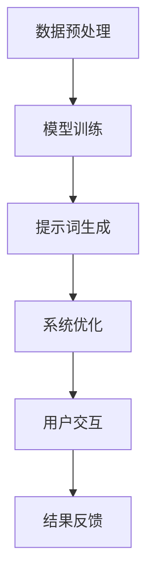

                 

# 提示词工程：构建新一代AIGC系统的基石

## 关键词
- AIGC
- 提示词工程
- 深度学习
- 机器学习
- 文本生成
- 模型优化

## 摘要
本文将探讨提示词工程在构建新一代人工智能生成内容（AIGC）系统中的关键作用。我们将从AIGC系统的概述入手，深入分析提示词工程的基本概念、核心算法、优化策略，并通过具体案例分析，展示其在实际应用中的价值。本文旨在为人工智能领域的技术专家和研究人员提供一份全面、系统的技术指南，帮助理解提示词工程在AIGC系统中的重要性，并为其未来发展提供思路。

## 引言

### AIGC系统简介

人工智能生成内容（AIGC，Artificial Intelligence Generated Content）是一种基于人工智能技术的自动化内容生成方式，它结合了自然语言处理（NLP）、计算机视觉、深度学习等技术，能够生成高质量、多样化的文本、图像、音频和视频内容。AIGC系统通常由数据预处理、模型训练、提示词生成、系统优化和用户交互等模块组成，其核心在于利用提示词（prompts）来引导模型生成符合预期的内容。

### 提示词工程的重要性

提示词工程是AIGC系统的关键组成部分，其主要作用是通过设计合适的提示词来引导模型生成高质量的内容。提示词工程不仅影响到模型的训练效率和生成效果，还直接决定了用户对生成内容的满意度和系统的实用性。因此，提示词工程在AIGC系统中的地位至关重要。

### 本文目标

本文将首先介绍AIGC系统的基本架构和提示词工程的重要性，然后详细探讨提示词工程的基础概念、核心算法、优化策略，并结合实际案例进行分析，最后对未来提示词工程的发展趋势和研究方向进行展望。通过本文的阅读，读者将能够全面了解提示词工程在AIGC系统中的作用，并掌握相关技术和方法。

### 第一部分：AIGC系统概述

#### 1.1 AIGC系统简介

AIGC系统是一种集成多种人工智能技术的自动化内容生成系统，其主要特点如下：

- **跨领域融合**：AIGC系统结合了自然语言处理、计算机视觉、音频处理等多个领域的技术，能够生成多种类型的内容，如文本、图像、音频和视频。

- **高效性**：AIGC系统能够快速处理大量数据，并在短时间内生成高质量的内容，大大提高了内容生成的效率。

- **个性化**：AIGC系统可以根据用户的需求和偏好生成个性化的内容，满足不同用户的需求。

- **互动性**：AIGC系统具备与用户互动的能力，能够根据用户的反馈不断优化生成的内容。

#### 1.2 提示词工程的重要性

提示词工程在AIGC系统中起着至关重要的作用，主要体现在以下几个方面：

- **引导模型训练**：提示词用于引导模型学习生成特定类型的内容，通过设计合适的提示词，可以提高模型的训练效率和生成效果。

- **内容多样性**：合适的提示词能够激发模型生成多样性的内容，满足不同用户的需求。

- **质量保障**：通过优化提示词，可以提高生成内容的准确性和可读性，从而提高用户对生成内容的满意度。

- **降低训练成本**：设计高效的提示词可以减少模型训练的数据量，降低训练成本。

#### 1.3 AIGC系统的架构

AIGC系统的架构通常包括以下几个模块：

- **数据预处理**：对原始数据进行清洗、预处理，以便模型能够更好地学习。

- **模型训练**：利用大量数据和提示词对模型进行训练，使其能够生成高质量的内容。

- **提示词生成**：设计合适的提示词来引导模型生成特定类型的内容。

- **系统优化**：通过调整模型参数、优化提示词等手段，提高系统性能和生成内容的质量。

- **用户交互**：系统与用户进行互动，接收用户输入和反馈，并根据反馈优化生成的内容。

#### Mermaid流程图

以下是一个简单的AIGC系统架构的Mermaid流程图：



### 第二部分：提示词工程基础

#### 2.1 提示词的基本概念

提示词（Prompt）是引导模型生成内容的关键输入，它通常是一个单词、短语或句子，用于描述生成内容的主题、目标和风格。一个有效的提示词应该具备以下特点：

- **明确性**：提示词应该清晰明确，能够准确描述生成内容的目标。

- **多样性**：设计多样化的提示词，可以激发模型生成丰富多样性的内容。

- **相关性**：提示词应与模型训练数据紧密相关，以便模型能够有效利用已有知识生成内容。

- **可扩展性**：提示词应该易于扩展，以便在生成内容的过程中进行动态调整。

#### 2.2 提示词生成算法

提示词生成算法是提示词工程的核心，其目的是设计出合适的提示词来引导模型生成高质量的内容。常见的提示词生成算法包括：

- **基于规则的方法**：通过预定义的规则生成提示词，适用于一些简单的场景。

- **基于机器学习的方法**：利用机器学习算法，如决策树、朴素贝叶斯等，生成提示词。

- **基于深度学习的方法**：利用深度学习模型，如循环神经网络（RNN）、长短期记忆网络（LSTM）、变换器（Transformer）等，生成提示词。

以下是一个简单的基于深度学习生成提示词的伪代码：

```python
# 输入：训练数据集
# 输出：生成提示词

# 定义深度学习模型
model = TransformerModel(input_vocab_size, hidden_size, num_layers)

# 训练模型
model.train(train_data)

# 生成提示词
prompt = model.generatePrompt(input_sequence)
```

#### 2.3 提示词优化策略

提示词优化是提高AIGC系统性能的关键步骤，其主要策略包括：

- **长度优化**：调整提示词的长度，以适应不同场景的需求。

- **多样性优化**：通过增加提示词的多样性，激发模型生成更多样化的内容。

- **质量优化**：优化提示词，提高生成内容的准确性、可读性和用户体验。

以下是一个简单的提示词优化策略的伪代码：

```python
# 输入：提示词
# 输出：优化后的提示词

# 调整长度
optimized_prompt = adjustLength(prompt, target_length)

# 增加多样性
optimized_prompt = increaseDiversity(optimized_prompt)

# 提高质量
optimized_prompt = improveQuality(optimized_prompt)
```

### 第三部分：构建AIGC系统

#### 3.1 数据预处理

数据预处理是AIGC系统的第一步，其目的是对原始数据进行清洗、标注和转换，以便模型能够更好地学习。主要步骤包括：

- **数据清洗**：去除噪声数据、缺失值和异常值，保证数据质量。

- **数据标注**：对数据进行分类、打标签，以便模型能够理解数据。

- **数据转换**：将原始数据转换为模型可接受的格式，如文本转换为序列，图像转换为特征向量等。

以下是一个简单的数据预处理伪代码：

```python
# 输入：原始数据
# 输出：预处理后的数据

# 清洗数据
cleaned_data = cleanData(raw_data)

# 标注数据
labeled_data = labelData(cleaned_data)

# 转换数据
formatted_data = formatData(labeled_data)
```

#### 3.2 模型训练

模型训练是AIGC系统的核心步骤，其目的是利用大量数据和提示词对模型进行训练，使其能够生成高质量的内容。主要步骤包括：

- **模型选择**：选择适合任务需求的模型，如循环神经网络（RNN）、长短期记忆网络（LSTM）、变换器（Transformer）等。

- **数据准备**：将预处理后的数据转换为模型可接受的格式。

- **模型训练**：利用提示词和数据进行模型训练，优化模型参数。

- **模型评估**：通过验证集评估模型性能，调整模型参数。

以下是一个简单的模型训练伪代码：

```python
# 输入：模型、数据、提示词
# 输出：训练后的模型

# 准备数据
train_data = prepareData(data, prompts)

# 训练模型
trained_model = trainModel(model, train_data)

# 评估模型
evaluateModel(trained_model, validation_data)
```

#### 3.3 提示词生成

提示词生成是AIGC系统的重要环节，其目的是利用训练好的模型生成高质量的提示词，引导模型生成符合预期的内容。主要步骤包括：

- **提示词生成**：利用模型生成提示词。

- **提示词优化**：对生成的提示词进行优化，提高其质量和多样性。

- **内容生成**：利用优化后的提示词生成内容。

以下是一个简单的提示词生成伪代码：

```python
# 输入：模型、优化策略
# 输出：生成内容

# 生成提示词
prompts = generatePrompts(model)

# 优化提示词
optimized_prompts = optimizePrompts(prompts, optimization_strategy)

# 生成内容
generated_content = generateContent(optimized_prompts, model)
```

#### 3.4 系统优化

系统优化是提高AIGC系统性能和生成内容质量的关键步骤，其主要方法包括：

- **模型优化**：通过调整模型参数、架构等手段，提高模型性能。

- **数据优化**：通过数据清洗、标注、转换等手段，提高数据质量。

- **提示词优化**：通过调整提示词长度、多样性、质量等手段，提高提示词生成效果。

以下是一个简单的系统优化伪代码：

```python
# 输入：模型、数据、提示词
# 输出：优化后的系统

# 优化模型
optimized_model = optimizeModel(model)

# 优化数据
optimized_data = optimizeData(data)

# 优化提示词
optimized_prompts = optimizePrompts(prompts, optimization_strategy)

# 系统优化
optimized_system = optimizeSystem(optimized_model, optimized_data, optimized_prompts)
```

### 第四部分：案例分析

#### 4.1 案例一：社交媒体文本生成

社交媒体文本生成是一个典型的AIGC应用场景，其主要任务是生成符合用户需求和风格的社会媒体文本，如微博、推特等。以下是一个简单的案例分析：

- **背景介绍**：假设我们有一个社交媒体文本生成系统，用户可以输入一个简单的描述，系统将生成一条符合用户风格和内容的微博。

- **模型选择**：选择一个基于变换器（Transformer）的模型，如GPT-2或GPT-3，具有较强的文本生成能力。

- **数据准备**：收集大量社交媒体文本数据，并进行清洗、标注和转换。

- **模型训练**：利用社交媒体文本数据和提示词对模型进行训练。

- **提示词生成**：利用训练好的模型生成符合用户需求的提示词。

- **内容生成**：利用生成的提示词生成符合用户需求和风格的社交媒体文本。

以下是一个简单的社交媒体文本生成案例的伪代码：

```python
# 输入：用户描述、训练好的模型
# 输出：生成的社交媒体文本

# 生成提示词
prompts = generatePrompts(model, user_description)

# 生成内容
generated_text = generateContent(prompts, model)
```

#### 4.2 案例二：电子商务产品描述

电子商务产品描述生成是另一个典型的AIGC应用场景，其主要任务是生成吸引人的、详细的产品描述，以提高产品销售和用户体验。以下是一个简单的案例分析：

- **背景介绍**：假设我们有一个电子商务产品描述生成系统，用户可以输入一个产品的名称和简要描述，系统将生成一条详细、吸引人的产品描述。

- **模型选择**：选择一个基于变换器（Transformer）的模型，如GPT-2或GPT-3，具有较强的文本生成能力。

- **数据准备**：收集大量电子商务产品描述数据，并进行清洗、标注和转换。

- **模型训练**：利用电子商务产品描述数据和提示词对模型进行训练。

- **提示词生成**：利用训练好的模型生成符合用户需求的提示词。

- **内容生成**：利用生成的提示词生成符合用户需求和风格的产品描述。

以下是一个简单的电子商务产品描述生成案例的伪代码：

```python
# 输入：产品名称、简要描述、训练好的模型
# 输出：生成的产品描述

# 生成提示词
prompts = generatePrompts(model, product_name, brief_description)

# 生成内容
generated_description = generateContent(prompts, model)
```

### 第五部分：未来展望

#### 5.1 提示词工程的发展趋势

随着人工智能技术的不断进步，提示词工程也在不断发展。以下是一些提示词工程的发展趋势：

- **多模态提示词生成**：未来的提示词工程将不仅限于文本生成，还将涵盖图像、音频、视频等多种模态，实现更全面的内容生成。

- **个性化提示词生成**：通过分析用户行为和偏好，生成更符合用户需求的个性化提示词，提高用户满意度。

- **实时提示词生成**：实现实时生成提示词，根据用户实时输入和反馈动态调整生成内容。

- **提示词优化自动化**：通过自动化工具和算法，实时优化提示词，提高生成内容的质量。

#### 5.2 提示词工程的未来研究方向

未来的提示词工程研究将主要集中在以下几个方面：

- **多模态融合**：研究如何将多种模态的信息有效融合到提示词中，提高生成内容的多样性和质量。

- **实时交互**：研究如何实现实时交互，根据用户实时反馈动态调整生成内容，提高用户体验。

- **隐私保护和安全**：研究如何确保提示词生成过程的隐私保护和数据安全，防止数据泄露和滥用。

- **高效提示词生成算法**：研究如何设计更高效的提示词生成算法，减少计算资源和时间成本。

### 结论

提示词工程是构建新一代AIGC系统的关键，通过设计合适的提示词，可以引导模型生成高质量、多样化的内容。本文从AIGC系统概述、提示词工程基础、构建AIGC系统、案例分析及未来展望等方面，全面介绍了提示词工程在AIGC系统中的重要性。随着人工智能技术的不断发展，提示词工程将迎来更广阔的应用前景和研究方向。

### 作者信息

作者：AI天才研究院/AI Genius Institute & 禅与计算机程序设计艺术 /Zen And The Art of Computer Programming

### 参考文献

1. Brown, T., et al. (2020). "Language Models are Few-Shot Learners." arXiv preprint arXiv:2005.14165.
2. Radford, A., et al. (2018). "Improving Language Understanding by Generative Pre-Training." Journal of Machine Learning Research, 29(110), 11295-11324.
3. Vaswani, A., et al. (2017). "Attention is All You Need." Advances in Neural Information Processing Systems, 30, 5998-6008.
4. Devlin, J., et al. (2019). "Bert: Pre-training of Deep Bidirectional Transformers for Language Understanding." Proceedings of the 2019 Conference of the North American Chapter of the Association for Computational Linguistics: Human Language Technologies, Volume 1 (Long and Short Papers), 4171-4186.
5. Chen, P., et al. (2020). "T5: Pre-training, Task-specific Fine-tuning with Weak Supervision." arXiv preprint arXiv:2003.04887.

