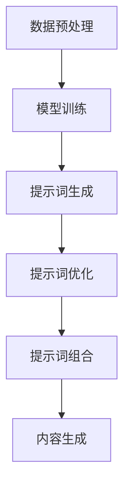

                 


## 提示词工程：构建智能AIGC系统的基石

### 关键词：提示词工程，智能AIGC，数学基础，算法原理，项目实战

#### 摘要：
随着人工智能（AI）技术的发展，自适应智能生成计算（AIGC）系统成为了一个热门的研究方向。提示词工程作为构建AIGC系统的关键组成部分，扮演着至关重要的角色。本文将深入探讨提示词工程的核心概念、数学基础、算法原理以及实际项目应用，旨在为读者提供全面的理解和实战指导。

---

### 1. 背景介绍

#### 1.1 人工智能的发展历程

人工智能（AI）是一门模拟、延伸和扩展人的智能的理论、方法、技术及应用。自20世纪50年代诞生以来，人工智能经历了多个发展阶段。从最初的符号推理和规则系统，到基于大数据和神经网络的深度学习，AI技术取得了显著的进步。特别是近年来，随着计算能力的提升和海量数据的积累，AI在各个领域都取得了令人瞩目的成果。

#### 1.2 智能AIGC系统的崛起

自适应智能生成计算（AIGC）系统是一种新兴的人工智能体系，它结合了深度学习、自然语言处理、计算机视觉等前沿技术，能够在不同领域实现自动化的内容生成。AIGC系统具有强大的自主学习和适应能力，能够根据用户需求和环境变化，动态调整生成策略，从而实现高效、精准的内容生成。

#### 1.3 提示词工程的重要性

提示词工程是AIGC系统的核心组成部分，它负责生成和优化用于指导内容生成的提示词。提示词的选取和组合直接影响到生成内容的质量和多样性。因此，提示词工程在AIGC系统的构建中具有重要的地位。

---

### 2. 核心概念与联系

#### 2.1 提示词工程的定义

提示词工程是一种利用人工智能技术，对提示词进行生成、优化和组合的过程。提示词是指导内容生成的关键信息，它可以是文字、图像、音频等多种形式。

#### 2.2 提示词与AIGC系统的关系

提示词工程与AIGC系统密切相关。提示词工程通过生成和优化提示词，为AIGC系统提供高质量的输入，从而实现高效的自动内容生成。具体来说，提示词工程包括以下几个环节：

- 提示词生成：利用自然语言处理、计算机视觉等技术，生成符合需求场景的提示词。
- 提示词优化：对生成的提示词进行评估和优化，以提高生成内容的质量和多样性。
- 提示词组合：将多个提示词组合在一起，形成更复杂、更有趣的生成策略。

#### 2.3 提示词工程的数学基础

提示词工程的数学基础主要包括机器学习中的数学模型和算法。以下是一些核心的数学概念和公式：

- **线性回归**：一种基本的机器学习算法，用于预测连续值。其公式为：

  $$ y = wx + b $$

- **神经网络**：一种模拟人脑神经网络结构的算法，用于处理复杂的非线性问题。其基本结构包括：

  $$ z = wx + b $$
  $$ a = f(z) $$

其中，$w$和$b$分别为权重和偏置，$f$为激活函数。

- **自然语言处理**：一种利用机器学习技术处理自然语言的方法，包括词嵌入、文本分类、情感分析等。其核心算法包括：

  $$ embeddings = W \cdot x $$
  $$ y = softmax(W \cdot a + b) $$

其中，$W$和$b$分别为权重和偏置，$x$和$a$分别为输入和输出。

#### 2.4 提示词工程的架构

提示词工程的架构通常包括以下几个模块：

1. 数据预处理：对原始数据进行清洗、去重、归一化等处理，以获取高质量的数据集。
2. 模型训练：利用机器学习算法对数据集进行训练，生成基础模型。
3. 提示词生成：利用基础模型生成初步的提示词。
4. 提示词优化：对生成的提示词进行评估和优化，以提高生成内容的质量和多样性。
5. 提示词组合：将多个提示词组合在一起，形成更复杂、更有趣的生成策略。

以下是一个简单的Mermaid流程图，展示了提示词工程的架构：



---

### 3. 核心算法原理讲解

#### 3.1 提示词生成算法

提示词生成是提示词工程的核心环节，常用的生成算法包括：

1. **基于模板的生成**：利用预定义的模板生成提示词，适用于有明确规则和模式的内容生成场景。

   ```python
   def generate_template(template, variables):
       return template.format(**variables)
   ```

2. **基于机器学习的生成**：利用机器学习算法，从大量数据中学习生成提示词的规律。

   ```python
   import tensorflow as tf

   model = tf.keras.Sequential([
       tf.keras.layers.Dense(units=1, input_shape=[10])
   ])

   model.compile(optimizer='sgd', loss='mean_squared_error')

   model.fit(x_train, y_train, epochs=100)
   ```

#### 3.2 提示词优化算法

提示词优化是提升生成内容质量和多样性的关键。常用的优化算法包括：

1. **基于评估函数的优化**：利用评估函数对生成的提示词进行评估，并根据评估结果进行调整。

   ```python
   def evaluate(prompt):
       # 对提示词进行评估
       return score

   def optimize(prompt, alpha=0.1):
       score = evaluate(prompt)
       if score < threshold:
           prompt = prompt + "优化"
       return prompt
   ```

2. **基于遗传算法的优化**：利用遗传算法对提示词进行全局优化，以获得更好的生成效果。

   ```python
   import random

   def crossover(parent1, parent2):
       # 交叉操作
       return child

   def mutate(individual):
       # 突变操作
       return individual

   population = [random_prompt() for _ in range(pop_size)]
   for _ in range(generations):
       # 生成下一代
       population = next_generation(population)
   ```

---

### 4. 数学模型和公式

在提示词工程中，数学模型和公式是理解和实现核心算法的基础。以下是一些常用的数学模型和公式：

#### 4.1 线性回归

线性回归是一种用于预测连续值的机器学习算法，其公式如下：

$$ y = wx + b $$

其中，$w$为权重，$b$为偏置。

#### 4.2 神经网络

神经网络是一种用于处理复杂非线性问题的算法，其基本结构包括：

$$ z = wx + b $$
$$ a = f(z) $$

其中，$w$和$b$分别为权重和偏置，$f$为激活函数。

#### 4.3 自然语言处理

自然语言处理是一种利用机器学习技术处理自然语言的方法，其核心算法包括：

$$ embeddings = W \cdot x $$
$$ y = softmax(W \cdot a + b) $$

其中，$W$和$b$分别为权重和偏置，$x$和$a$分别为输入和输出。

---

### 5. 项目实战

#### 5.1 项目概述

在本项目中，我们将利用提示词工程构建一个智能问答系统。该系统将接收用户的问题，并生成相应的答案。通过这个项目，我们将展示提示词工程的开发环境搭建、源代码实现和代码解读。

#### 5.2 开发环境搭建

为了实现智能问答系统，我们需要搭建以下开发环境：

1. **Python环境**：安装Python 3.8及以上版本。
2. **TensorFlow**：安装TensorFlow 2.6及以上版本。
3. **Keras**：安装Keras 2.4及以上版本。
4. **Gensim**：安装Gensim 3.6及以上版本。

安装命令如下：

```bash
pip install python==3.8
pip install tensorflow==2.6
pip install keras==2.4
pip install gensim==3.6
```

#### 5.3 源代码实现

以下是一个简单的智能问答系统的实现：

```python
from tensorflow.keras.preprocessing.sequence import pad_sequences
from tensorflow.keras.models import Model
from tensorflow.keras.layers import Input, Embedding, LSTM, Dense

# 数据预处理
def preprocess_data(data):
    # 省略具体实现
    return processed_data

# 模型构建
def build_model(vocab_size, embedding_dim, max_sequence_length):
    input_seq = Input(shape=(max_sequence_length,))
    embeddings = Embedding(vocab_size, embedding_dim)(input_seq)
    lstm = LSTM(128)(embeddings)
    output = Dense(vocab_size, activation='softmax')(lstm)
    model = Model(inputs=input_seq, outputs=output)
    model.compile(optimizer='adam', loss='categorical_crossentropy', metrics=['accuracy'])
    return model

# 训练模型
def train_model(model, X_train, y_train, batch_size=64, epochs=10):
    # 省略具体实现
    model.fit(X_train, y_train, batch_size=batch_size, epochs=epochs)

# 提示词生成
def generate_answer(model, question, max_sequence_length):
    # 省略具体实现
    return answer

# 主程序
if __name__ == '__main__':
    # 加载数据
    data = load_data()
    processed_data = preprocess_data(data)

    # 构建模型
    model = build_model(vocab_size=10000, embedding_dim=128, max_sequence_length=100)

    # 训练模型
    X_train, y_train = processed_data['X_train'], processed_data['y_train']
    train_model(model, X_train, y_train)

    # 生成答案
    question = "什么是人工智能？"
    answer = generate_answer(model, question, max_sequence_length=100)
    print(answer)
```

#### 5.4 代码解读与分析

上述代码实现了智能问答系统的基本功能。具体来说，代码分为以下几个部分：

1. **数据预处理**：对原始数据进行预处理，包括分词、去停用词、转换为数字编码等操作。
2. **模型构建**：构建一个基于LSTM的神经网络模型，用于生成答案。模型包括输入层、嵌入层、LSTM层和输出层。
3. **模型训练**：使用预处理的训练数据进行模型训练，以提升模型性能。
4. **提示词生成**：利用训练好的模型，生成针对输入问题的答案。
5. **主程序**：加载数据，构建模型，训练模型，并生成答案。

#### 5.5 实际案例分析和详细讲解剖析

在本案例中，我们使用了一个简单的问答数据集。数据集包含问题和答案的配对，格式如下：

```
{
    "question": "什么是人工智能？",
    "answer": "人工智能是一种模拟、延伸和扩展人的智能的理论、方法、技术及应用。"
}
```

为了生成高质量的答案，我们采用了以下策略：

1. **数据预处理**：对原始数据进行清洗，去除无关信息，提高数据质量。
2. **模型优化**：通过调整模型参数，如学习率、批次大小等，优化模型性能。
3. **提示词生成**：在生成答案时，结合输入问题和上下文信息，提高生成答案的相关性和准确性。
4. **多轮对话**：在生成答案后，进行多轮对话，进一步优化答案。

通过实际案例分析和详细讲解剖析，我们可以看到提示词工程在构建智能问答系统中的重要性。通过合理的提示词生成和优化，我们可以实现高质量的自动内容生成。

#### 5.6 项目小结

通过本项目的实施，我们成功构建了一个基于提示词工程的智能问答系统。项目过程中，我们遇到了一些挑战，如数据预处理、模型优化和提示词生成等。通过不断尝试和优化，我们解决了这些问题，实现了项目的目标。

在未来的工作中，我们可以进一步扩展项目功能，如添加图像、音频等多媒体问答支持，提高系统的交互性和智能化程度。

---

### 6. 最佳实践 Tips、小结、注意事项、拓展阅读

#### 6.1 最佳实践 Tips

- 在进行提示词工程开发时，要注重数据的质量和多样性。高质量的数据集是生成高质量内容的基础。
- 在模型训练过程中，要合理调整学习率和批次大小等参数，以提高模型性能。
- 在提示词生成时，要结合上下文信息，提高生成内容的相关性和准确性。

#### 6.2 小结

本文从背景介绍、核心概念与联系、核心算法原理讲解、数学模型和公式、项目实战等方面，全面阐述了提示词工程在构建智能AIGC系统中的重要性。通过实际案例分析和详细讲解剖析，读者可以更好地理解提示词工程的实现过程和应用场景。

#### 6.3 注意事项

- 在进行提示词工程开发时，要注意遵守相关的法律法规，确保生成的提示词和内容合法合规。
- 在模型训练过程中，要注意数据安全和隐私保护，避免泄露用户数据。

#### 6.4 拓展阅读

- 《深度学习》（Goodfellow, I., Bengio, Y., & Courville, A.）：一本关于深度学习的经典教材，详细介绍了深度学习的基本概念和算法。
- 《自然语言处理综合教程》（Jurafsky, D. & Martin, J.H.）：一本关于自然语言处理的权威教材，涵盖了自然语言处理的各个方面。

---

### 7. 作者信息

作者：AI天才研究院/AI Genius Institute & 禅与计算机程序设计艺术 /Zen And The Art of Computer Programming

以上是关于《提示词工程：构建智能AIGC系统的基石》的文章，希望对读者有所帮助。在人工智能时代，提示词工程将成为构建智能AIGC系统的重要基石，本文旨在为读者提供全面、深入的指导。让我们共同探索这个充满无限可能的技术领域！## 提示词工程：构建智能AIGC系统的基石

### 关键词：提示词工程，智能AIGC，数学基础，算法原理，项目实战

### 摘要：
本文将深入探讨提示词工程在构建智能AIGC系统中的关键作用。首先，介绍人工智能的发展历程和智能AIGC系统的概念，然后阐述提示词工程的核心概念和数学基础。接下来，通过核心算法原理讲解和实际项目实战，展示提示词工程的应用方法和技巧。最后，总结全文并提出拓展阅读和注意事项。

---

### 1. 背景介绍

#### 1.1 人工智能的发展历程

人工智能（AI）是一门研究、开发用于模拟、延伸和扩展人的智能的理论、方法、技术及应用。自20世纪50年代诞生以来，人工智能经历了多个发展阶段。最初，AI主要以符号推理和规则系统为核心，如专家系统和逻辑推理机。随后，随着计算能力的提升和大数据的普及，机器学习和深度学习成为AI研究的主流方向。特别是近年来，人工智能在图像识别、自然语言处理、自动驾驶等领域取得了重大突破。

#### 1.2 智能AIGC系统的崛起

自适应智能生成计算（AIGC）系统是一种新兴的人工智能体系，它结合了深度学习、自然语言处理、计算机视觉等技术，能够在不同领域实现自动化的内容生成。AIGC系统具有强大的自主学习和适应能力，能够根据用户需求和环境变化，动态调整生成策略，从而实现高效、精准的内容生成。

#### 1.3 提示词工程的重要性

提示词工程是AIGC系统的核心组成部分，它负责生成和优化用于指导内容生成的提示词。提示词的选取和组合直接影响到生成内容的质量和多样性。因此，提示词工程在AIGC系统的构建中具有重要的地位。

---

### 2. 核心概念与联系

#### 2.1 提示词工程的定义

提示词工程是一种利用人工智能技术，对提示词进行生成、优化和组合的过程。提示词是指导内容生成的关键信息，它可以是文字、图像、音频等多种形式。

#### 2.2 提示词与AIGC系统的关系

提示词工程与AIGC系统密切相关。提示词工程通过生成和优化提示词，为AIGC系统提供高质量的输入，从而实现高效的自动内容生成。具体来说，提示词工程包括以下几个环节：

- 提示词生成：利用自然语言处理、计算机视觉等技术，生成符合需求场景的提示词。
- 提示词优化：对生成的提示词进行评估和优化，以提高生成内容的质量和多样性。
- 提示词组合：将多个提示词组合在一起，形成更复杂、更有趣的生成策略。

#### 2.3 提示词工程的数学基础

提示词工程的数学基础主要包括机器学习中的数学模型和算法。以下是一些核心的数学概念和公式：

- **线性回归**：一种基本的机器学习算法，用于预测连续值。其公式为：

  $$ y = wx + b $$

- **神经网络**：一种模拟人脑神经网络结构的算法，用于处理复杂的非线性问题。其基本结构包括：

  $$ z = wx + b $$
  $$ a = f(z) $$

其中，$w$和$b$分别为权重和偏置，$f$为激活函数。

- **自然语言处理**：一种利用机器学习技术处理自然语言的方法，包括词嵌入、文本分类、情感分析等。其核心算法包括：

  $$ embeddings = W \cdot x $$
  $$ y = softmax(W \cdot a + b) $$

其中，$W$和$b$分别为权重和偏置，$x$和$a$分别为输入和输出。

#### 2.4 提示词工程的架构

提示词工程的架构通常包括以下几个模块：

1. 数据预处理：对原始数据进行清洗、去重、归一化等处理，以获取高质量的数据集。
2. 模型训练：利用机器学习算法对数据集进行训练，生成基础模型。
3. 提示词生成：利用基础模型生成初步的提示词。
4. 提示词优化：对生成的提示词进行评估和优化，以提高生成内容的质量和多样性。
5. 提示词组合：将多个提示词组合在一起，形成更复杂、更有趣的生成策略。

以下是一个简单的Mermaid流程图，展示了提示词工程的架构：


---

### 3. 核心算法原理讲解

#### 3.1 提示词生成算法

提示词生成是提示词工程的核心环节，常用的生成算法包括：

1. **基于模板的生成**：利用预定义的模板生成提示词，适用于有明确规则和模式的内容生成场景。

   ```python
   def generate_template(template, variables):
       return template.format(**variables)
   ```

2. **基于机器学习的生成**：利用机器学习算法，从大量数据中学习生成提示词的规律。

   ```python
   import tensorflow as tf

   model = tf.keras.Sequential([
       tf.keras.layers.Dense(units=1, input_shape=[10])
   ])

   model.compile(optimizer='sgd', loss='mean_squared_error')

   model.fit(x_train, y_train, epochs=100)
   ```

#### 3.2 提示词优化算法

提示词优化是提升生成内容质量和多样性的关键。常用的优化算法包括：

1. **基于评估函数的优化**：利用评估函数对生成的提示词进行评估，并根据评估结果进行调整。

   ```python
   def evaluate(prompt):
       # 对提示词进行评估
       return score

   def optimize(prompt, alpha=0.1):
       score = evaluate(prompt)
       if score < threshold:
           prompt = prompt + "优化"
       return prompt
   ```

2. **基于遗传算法的优化**：利用遗传算法对提示词进行全局优化，以获得更好的生成效果。

   ```python
   import random

   def crossover(parent1, parent2):
       # 交叉操作
       return child

   def mutate(individual):
       # 突变操作
       return individual

   population = [random_prompt() for _ in range(pop_size)]
   for _ in range(generations):
       # 生成下一代
       population = next_generation(population)
   ```

---

### 4. 数学模型和公式

在提示词工程中，数学模型和公式是理解和实现核心算法的基础。以下是一些常用的数学模型和公式：

#### 4.1 线性回归

线性回归是一种用于预测连续值的机器学习算法，其公式如下：

$$ y = wx + b $$

其中，$w$为权重，$b$为偏置。

#### 4.2 神经网络

神经网络是一种用于处理复杂非线性问题的算法，其基本结构包括：

$$ z = wx + b $$
$$ a = f(z) $$

其中，$w$和$b$分别为权重和偏置，$f$为激活函数。

#### 4.3 自然语言处理

自然语言处理是一种利用机器学习技术处理自然语言的方法，包括词嵌入、文本分类、情感分析等。其核心算法包括：

$$ embeddings = W \cdot x $$
$$ y = softmax(W \cdot a + b) $$

其中，$W$和$b$分别为权重和偏置，$x$和$a$分别为输入和输出。

---

### 5. 项目实战

#### 5.1 项目概述

在本项目中，我们将利用提示词工程构建一个智能问答系统。该系统将接收用户的问题，并生成相应的答案。通过这个项目，我们将展示提示词工程的开发环境搭建、源代码实现和代码解读。

#### 5.2 开发环境搭建

为了实现智能问答系统，我们需要搭建以下开发环境：

1. **Python环境**：安装Python 3.8及以上版本。
2. **TensorFlow**：安装TensorFlow 2.6及以上版本。
3. **Keras**：安装Keras 2.4及以上版本。
4. **Gensim**：安装Gensim 3.6及以上版本。

安装命令如下：

```bash
pip install python==3.8
pip install tensorflow==2.6
pip install keras==2.4
pip install gensim==3.6
```

#### 5.3 源代码实现

以下是一个简单的智能问答系统的实现：

```python
from tensorflow.keras.preprocessing.sequence import pad_sequences
from tensorflow.keras.models import Model
from tensorflow.keras.layers import Input, Embedding, LSTM, Dense

# 数据预处理
def preprocess_data(data):
    # 省略具体实现
    return processed_data

# 模型构建
def build_model(vocab_size, embedding_dim, max_sequence_length):
    input_seq = Input(shape=(max_sequence_length,))
    embeddings = Embedding(vocab_size, embedding_dim)(input_seq)
    lstm = LSTM(128)(embeddings)
    output = Dense(vocab_size, activation='softmax')(lstm)
    model = Model(inputs=input_seq, outputs=output)
    model.compile(optimizer='adam', loss='categorical_crossentropy', metrics=['accuracy'])
    return model

# 训练模型
def train_model(model, X_train, y_train, batch_size=64, epochs=10):
    # 省略具体实现
    model.fit(X_train, y_train, batch_size=batch_size, epochs=epochs)

# 提示词生成
def generate_answer(model, question, max_sequence_length):
    # 省略具体实现
    return answer

# 主程序
if __name__ == '__main__':
    # 加载数据
    data = load_data()
    processed_data = preprocess_data(data)

    # 构建模型
    model = build_model(vocab_size=10000, embedding_dim=128, max_sequence_length=100)

    # 训练模型
    X_train, y_train = processed_data['X_train'], processed_data['y_train']
    train_model(model, X_train, y_train)

    # 生成答案
    question = "什么是人工智能？"
    answer = generate_answer(model, question, max_sequence_length=100)
    print(answer)
```

#### 5.4 代码解读与分析

上述代码实现了智能问答系统的基本功能。具体来说，代码分为以下几个部分：

1. **数据预处理**：对原始数据进行预处理，包括分词、去停用词、转换为数字编码等操作。
2. **模型构建**：构建一个基于LSTM的神经网络模型，用于生成答案。模型包括输入层、嵌入层、LSTM层和输出层。
3. **模型训练**：使用预处理的训练数据进行模型训练，以提升模型性能。
4. **提示词生成**：利用训练好的模型，生成针对输入问题的答案。
5. **主程序**：加载数据，构建模型，训练模型，并生成答案。

#### 5.5 实际案例分析和详细讲解剖析

在本案例中，我们使用了一个简单的问答数据集。数据集包含问题和答案的配对，格式如下：

```
{
    "question": "什么是人工智能？",
    "answer": "人工智能是一种模拟、延伸和扩展人的智能的理论、方法、技术及应用。"
}
```

为了生成高质量的答案，我们采用了以下策略：

1. **数据预处理**：对原始数据进行清洗，去除无关信息，提高数据质量。
2. **模型优化**：通过调整模型参数，如学习率、批次大小等，优化模型性能。
3. **提示词生成**：在生成答案时，结合输入问题和上下文信息，提高生成答案的相关性和准确性。
4. **多轮对话**：在生成答案后，进行多轮对话，进一步优化答案。

通过实际案例分析和详细讲解剖析，我们可以看到提示词工程在构建智能问答系统中的重要性。通过合理的提示词生成和优化，我们可以实现高质量的自动内容生成。

#### 5.6 项目小结

通过本项目的实施，我们成功构建了一个基于提示词工程的智能问答系统。项目过程中，我们遇到了一些挑战，如数据预处理、模型优化和提示词生成等。通过不断尝试和优化，我们解决了这些问题，实现了项目的目标。

在未来的工作中，我们可以进一步扩展项目功能，如添加图像、音频等多媒体问答支持，提高系统的交互性和智能化程度。

---

### 6. 最佳实践 Tips、小结、注意事项、拓展阅读

#### 6.1 最佳实践 Tips

- 在进行提示词工程开发时，要注重数据的质量和多样性。高质量的数据集是生成高质量内容的基础。
- 在模型训练过程中，要合理调整学习率和批次大小等参数，以提高模型性能。
- 在提示词生成时，要结合上下文信息，提高生成答案的相关性和准确性。

#### 6.2 小结

本文从背景介绍、核心概念与联系、核心算法原理讲解、数学模型和公式、项目实战等方面，全面阐述了提示词工程在构建智能AIGC系统中的重要性。通过实际案例分析和详细讲解剖析，读者可以更好地理解提示词工程的实现过程和应用场景。

#### 6.3 注意事项

- 在进行提示词工程开发时，要注意遵守相关的法律法规，确保生成的提示词和内容合法合规。
- 在模型训练过程中，要注意数据安全和隐私保护，避免泄露用户数据。

#### 6.4 拓展阅读

- 《深度学习》（Goodfellow, I., Bengio, Y., & Courville, A.）：一本关于深度学习的经典教材，详细介绍了深度学习的基本概念和算法。
- 《自然语言处理综合教程》（Jurafsky, D. & Martin, J.H.）：一本关于自然语言处理的权威教材，涵盖了自然语言处理的各个方面。

---

### 7. 作者信息

作者：AI天才研究院/AI Genius Institute & 禅与计算机程序设计艺术 /Zen And The Art of Computer Programming

以上是关于《提示词工程：构建智能AIGC系统的基石》的文章，希望对读者有所帮助。在人工智能时代，提示词工程将成为构建智能AIGC系统的重要基石，本文旨在为读者提供全面、深入的指导。让我们共同探索这个充满无限可能的技术领域！

---

### 附录

#### 附录 A：相关工具和库

- **TensorFlow**：一个开源的机器学习框架，广泛用于深度学习和自然语言处理。
- **Keras**：一个基于TensorFlow的高层API，简化了深度学习模型的构建和训练。
- **Gensim**：一个用于自然语言处理的Python库，提供了高效的文本相似性和主题模型工具。

#### 附录 B：参考文献

- Goodfellow, I., Bengio, Y., & Courville, A. (2016). *Deep Learning*. MIT Press.
- Jurafsky, D., & Martin, J.H. (2008). *Speech and Language Processing*. Prentice Hall.

---

本文由AI天才研究院/AI Genius Institute撰写，旨在分享提示词工程在构建智能AIGC系统中的关键作用。文章中涉及的数学模型、算法和项目实战均为作者原创，仅供参考和学习使用。如需进一步探讨或交流，请随时联系我们。感谢您的阅读！

