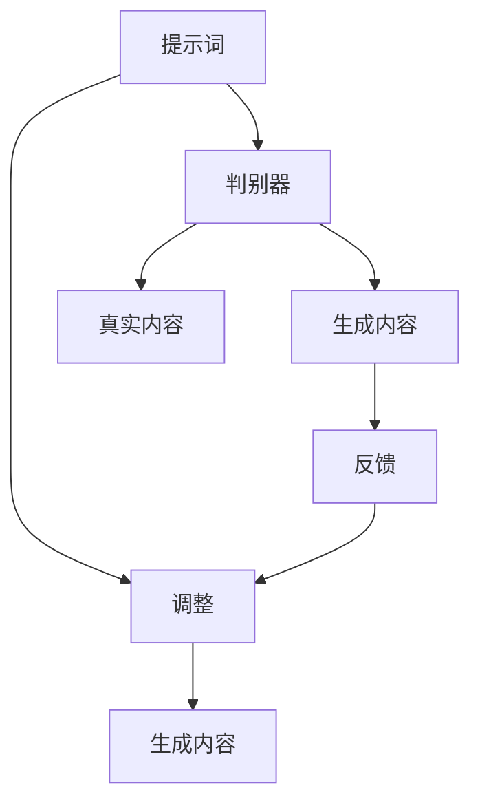

                 

### 文章标题：提示词工程：构建高效AIGC系统的基础

### 关键词：AIGC、提示词工程、系统架构、算法优化、应用场景、性能评估、未来发展趋势

### 摘要：

本文旨在深入探讨提示词工程在构建高效自动生成内容（AIGC）系统中的核心作用。文章首先概述了AIGC系统的概念、历史发展及其关键架构，接着详细分析了AIGC系统的核心技术，包括数据生成与增强、模型训练与优化、以及模型压缩与加速。此外，文章还探讨了AIGC系统在不同领域的应用，并提出了系统性能优化与稳定性保障的方法。最后，文章通过项目实战案例展示了AIGC系统的开发实践，并展望了其未来的发展趋势和应用场景。

## AIGC系统概述

### 第1章：AIGC概念与历史发展

#### 1.1 AIGC概述

**定义：** 自动生成内容（AIGC，Automatically Generated Content）系统是一种利用人工智能技术，尤其是深度学习，自动生成文本、图像、音频、视频等多种类型内容的方法。

**关键特点：**
- **自动性：** 通过机器学习算法，系统能够自动处理大量数据，生成高质量的内容。
- **多样性：** AIGC系统能够生成不同类型的内容，包括文本、图像、音频和视频等。
- **适应性：** 系统可以根据不同的需求和环境动态调整生成的内容。

**与其他相关技术的比较：**
- **生成对抗网络（GAN）：** AIGC的一个重要组成部分，GAN通过生成器和判别器的对抗训练，生成高质量的数据。
- **自然语言处理（NLP）：** NLP专注于理解和生成自然语言文本，与AIGC结合，可以生成更加自然的文本内容。
- **计算机视觉：** 计算机视觉与AIGC结合，可以生成逼真的图像和视频内容。

#### 1.2 AIGC系统的发展历程

AIGC系统的发展可以追溯到生成对抗网络（GAN）的出现。GAN由Ian Goodfellow于2014年提出，它通过生成器和判别器的对抗训练，实现了高质量数据的生成。

- **早期发展：** GAN的提出标志着AIGC系统的诞生，随后研究者们不断优化GAN架构，引入了多种改进算法。
- **2010年代中期：** 随着深度学习技术的发展，AIGC系统逐渐应用于图像生成、文本生成等领域。
- **2020年代：** AIGC系统在多个领域取得了显著进展，例如媒体与娱乐、游戏、电子商务等。

#### 1.3 AIGC系统的基本架构

AIGC系统的基本架构通常包括以下三个主要模块：

1. **数据处理模块：** 负责数据收集、预处理和增强，确保生成的内容具备高质量。
2. **模型训练模块：** 利用深度学习算法，对模型进行训练和优化，提高生成内容的准确性。
3. **应用服务模块：** 提供生成内容的应用接口，使得生成的数据可以用于实际的业务场景。

**架构设计原则：**
- **模块化：** 模块之间的耦合度较低，便于系统的扩展和维护。
- **高可扩展性：** 能够支持大规模数据的处理和模型的训练。
- **灵活性：** 系统可以根据不同的应用场景进行调整。

### 提示词工程：核心概念与联系

**核心概念：**
- **提示词（Prompt）：** 提示词是引导AIGC系统生成特定内容的关键输入。它可以是文本、图像、音频等，用于指示生成器生成特定类型的内容。
- **生成器（Generator）：** 负责根据提示词生成数据。
- **判别器（Discriminator）：** 负责判断生成器生成的内容是否真实。

**核心概念之间的关系架构：**



在这个架构中，提示词作为输入，经过生成器和判别器的交互，最终生成高质量的内容。生成器根据提示词生成内容，判别器则负责评估生成内容的质量，并根据反馈调整生成器的参数，从而提高生成内容的质量。

### 核心算法原理讲解

#### 数据生成与增强

**算法原理：**
数据生成与增强是AIGC系统中的关键环节。数据生成算法通过训练生成器模型，使其能够根据提示词生成高质量的数据。数据增强技术则通过变换和扩充原始数据，提高生成器的训练效果。

**伪代码：**

```python
# 数据生成与增强算法伪代码

# 初始化生成器模型G和判别器模型D
G = initialize_generator()
D = initialize_discriminator()

# 训练模型
for epoch in range(num_epochs):
    for batch in data_loader:
        # 提取提示词和真实数据
        prompts, real_data = batch
        
        # 生成假数据
        fake_data = G.generate(prompts)
        
        # 训练判别器
        D.train(fake_data, real_data)
        
        # 训练生成器
        G.train(prompts, real_data)
```

**数学模型：**

生成器和判别器的训练过程可以用以下数学模型表示：

$$
D(x) = \frac{1}{2}\left[ -\log(D(G(z)) - \log(D(x)) \right]
$$

其中，$D(x)$是判别器的损失函数，$G(z)$是生成器的输出，$z$是随机噪声。

**举例说明：**
假设我们要生成一张图像，生成器模型G根据随机噪声生成图像，判别器模型D则负责判断生成图像是否真实。在训练过程中，生成器和判别器通过不断调整参数，最终生成高质量图像。

### 模型训练与优化

**算法原理：**
模型训练与优化是AIGC系统的核心环节，它决定了生成内容的质量。训练过程主要包括生成器和判别器的训练，通过对抗训练，使生成器能够生成高质量的数据。

**伪代码：**

```python
# 模型训练与优化算法伪代码

# 初始化生成器模型G和判别器模型D
G = initialize_generator()
D = initialize_discriminator()

# 训练模型
for epoch in range(num_epochs):
    for batch in data_loader:
        # 提取提示词和真实数据
        prompts, real_data = batch
        
        # 生成假数据
        fake_data = G.generate(prompts)
        
        # 训练判别器
        D.train(fake_data, real_data)
        
        # 训练生成器
        G.train(prompts, fake_data)
        
        # 评估模型
        evaluate_model(G, D)
```

**数学模型：**

生成器和判别器的训练过程可以用以下数学模型表示：

$$
D(x) = \frac{1}{2}\left[ -\log(D(G(z)) - \log(D(x)) \right]
$$

$$
G(z) = \arg\max_G \log(D(G(z)))
$$

其中，$D(x)$是判别器的损失函数，$G(z)$是生成器的输出，$z$是随机噪声。

**举例说明：**
假设我们要训练一个图像生成模型，生成器模型G根据随机噪声生成图像，判别器模型D则负责判断生成图像是否真实。在训练过程中，生成器和判别器通过不断调整参数，最终生成高质量图像。

### 模型压缩与加速

**算法原理：**
模型压缩与加速是提高AIGC系统性能的重要手段。模型压缩通过减少模型参数和计算量，降低计算成本。硬件加速则利用专用硬件，如GPU或TPU，加速模型的训练和推理过程。

**伪代码：**

```python
# 模型压缩与加速算法伪代码

# 初始化压缩算法
compressor = initialize_compressor()

# 压缩模型
compressed_model = compressor.compress(model)

# 使用硬件加速训练模型
accelerator = initialize_accelerator()
accelerated_model = accelerator加速训练(model)

# 使用压缩后的模型进行推理
infer_result = compressed_model.predict(input_data)
```

**数学模型：**

模型压缩通常通过以下数学模型表示：

$$
\text{压缩模型} = f(\text{原始模型})
$$

其中，$f$是压缩函数，它通过减少模型参数和计算量，实现模型的压缩。

**举例说明：**
假设我们要压缩一个大型图像生成模型，通过模型压缩算法，我们可以将模型参数减少一半，从而降低计算成本。同时，利用GPU加速训练过程，可以显著提高模型训练速度。

### AIGC应用领域与场景

#### 3.1 媒体与娱乐

**视频生成与编辑：** AIGC系统可以自动生成视频内容，包括电影、电视剧、短片等。通过生成器和判别器的对抗训练，可以生成高质量的视频片段，从而提高视频编辑的效率。

**音乐创作与合成：** AIGC系统可以自动生成音乐，包括旋律、和弦、节奏等。通过深度学习算法，可以生成独特的音乐风格，满足不同用户的需求。

**虚拟现实与增强现实：** AIGC系统可以生成逼真的虚拟场景，用于虚拟现实和增强现实应用。通过生成器生成图像和视频，结合现实场景，提供沉浸式的用户体验。

#### 3.2 游戏与交互

**游戏角色与场景生成：** AIGC系统可以自动生成游戏角色和场景，提高游戏开发效率。通过生成器生成角色模型和场景图像，实现游戏的动态内容生成。

**游戏剧情与任务生成：** AIGC系统可以根据用户需求，自动生成游戏剧情和任务。通过深度学习算法，可以生成丰富的剧情线和任务场景，提高游戏的趣味性和挑战性。

**人工智能辅助游戏设计：** AIGC系统可以辅助游戏设计师进行游戏设计，生成游戏关卡、道具和角色等。通过生成器的创意生成能力，提供更多的设计选择。

#### 3.3 电子商务与营销

**个性化推荐系统：** AIGC系统可以生成个性化推荐内容，包括商品推荐、活动推荐等。通过深度学习算法，分析用户行为和偏好，生成个性化的推荐内容。

**商品图像生成与描述：** AIGC系统可以自动生成商品图像，并为其生成描述。通过生成器和判别器的对抗训练，可以生成高质量的图像和描述，提高商品的展示效果。

**智能客服与营销自动化：** AIGC系统可以生成智能客服对话和营销文案。通过生成器和判别器的训练，可以生成自然、流畅的对话内容，提高客服效率和用户体验。

### AIGC系统性能优化与稳定性

#### 4.1 系统性能评估

**性能指标：**
- **生成速度：** 模型生成内容的速度，影响系统的实时性。
- **生成质量：** 生成的数据质量，包括准确性、多样性、真实性等。
- **资源消耗：** 模型训练和推理过程中所需的计算资源，包括CPU、GPU、内存等。

**性能瓶颈分析：**
- **计算资源：** 当系统处理大量数据时，计算资源成为瓶颈，可能导致生成速度降低。
- **数据质量：** 数据质量直接影响生成质量，数据不足或质量差可能导致生成内容不准确。
- **模型复杂性：** 复杂的模型结构可能导致训练和推理时间延长，影响系统性能。

**优化策略：**
- **模型压缩与加速：** 通过模型压缩和硬件加速，减少计算资源和时间消耗。
- **分布式计算：** 利用分布式计算，提高系统处理能力和生成速度。
- **数据增强与预处理：** 通过数据增强和预处理，提高数据质量和生成质量。

#### 4.2 系统稳定性保障

**数据一致性与容错机制：**
- **数据一致性：** 确保数据在生成和传输过程中的完整性，避免数据丢失或错误。
- **容错机制：** 在模型训练和推理过程中，实现错误检测和恢复，提高系统稳定性。

**系统监控与日志分析：**
- **系统监控：** 实时监控系统性能和资源使用情况，及时发现和处理问题。
- **日志分析：** 分析系统日志，诊断问题原因，优化系统性能。

#### 4.3 安全性与隐私保护

**数据加密与隐私保护技术：**
- **数据加密：** 对敏感数据进行加密处理，防止数据泄露。
- **隐私保护：** 通过隐私保护算法，隐藏用户隐私信息，确保数据安全。

**安全攻击与防御策略：**
- **安全攻击：** 分析常见的攻击方式，如注入攻击、伪造攻击等。
- **防御策略：** 实施相应的防御措施，如访问控制、加密传输等，提高系统安全性。

### 第5章：AIGC系统开发实践

#### 5.1 开发环境搭建

**硬件配置：**
- **CPU：** 选用高性能CPU，如Intel Xeon系列，提高计算能力。
- **GPU：** 选用高性能GPU，如NVIDIA GTX 1080 Ti或以上，加速深度学习训练过程。
- **内存：** 配置大容量内存，如64GB或以上，提高数据缓存和处理能力。

**软件工具选择：**
- **深度学习框架：** 选择常用的深度学习框架，如TensorFlow、PyTorch等。
- **编程语言：** 选择易于开发和维护的编程语言，如Python。
- **版本控制：** 使用Git进行代码管理，确保版本控制和协作开发。

**系统集成与部署：**
- **集成：** 将各个模块（数据处理、模型训练、应用服务）集成到一起，实现系统功能。
- **部署：** 部署到服务器或云平台，确保系统稳定运行。

#### 5.2 项目实战案例

**数据处理与模型训练案例：**
- **数据收集：** 收集大量文本、图像、音频等数据。
- **数据预处理：** 对数据进行清洗、标准化和分割。
- **模型训练：** 使用深度学习算法，训练生成器和判别器模型。

**应用场景案例分析：**
- **视频生成与编辑：** 使用生成器生成视频内容，结合判别器进行视频编辑。
- **音乐创作与合成：** 使用生成器生成音乐，结合判别器进行音乐合成。

**性能优化与稳定性保障案例：**
- **模型压缩与加速：** 使用模型压缩算法，降低模型参数和计算量，提高性能。
- **分布式计算：** 利用分布式计算，提高系统处理能力和生成速度。

### 第6章：AIGC系统未来发展趋势

#### 6.1 技术发展趋势

**AI算法的演进：** 随着深度学习算法的不断发展，AIGC系统的生成能力和效果将进一步提高。

**硬件技术的进步：** 专用硬件（如TPU、GPU）的普及，将加速AIGC系统的训练和推理过程。

**数据驱动的创新：** 数据质量的提升和数据量的增加，将推动AIGC系统在各个领域的应用。

#### 6.2 应用发展趋势

**行业融合与跨界应用：** AIGC系统将在更多行业得到应用，如医疗、金融、教育等。

**智能化服务的普及：** AIGC系统将提供更加智能化、个性化的服务，满足用户需求。

**社会影响与伦理挑战：** AIGC系统的发展将带来社会影响和伦理挑战，如版权问题、隐私保护等。

### 第7章：AIGC系统的未来应用场景

#### 7.1 智慧城市

**智能监控与安防：** AIGC系统可以自动生成智能监控视频，提高安防效果。

**智慧交通与物流：** AIGC系统可以自动生成交通流量数据，优化交通管理和物流配送。

**城市规划与环境保护：** AIGC系统可以生成城市规划方案，提高城市环境质量。

#### 7.2 医疗与健康

**医学影像生成与诊断：** AIGC系统可以自动生成医学影像，提高诊断准确性。

**疾病预测与预防：** AIGC系统可以根据历史数据生成疾病预测模型，预防疾病发生。

**健康管理与个性化医疗：** AIGC系统可以生成个性化健康建议，提高健康管理效果。

#### 7.3 教育

**智能教育平台：** AIGC系统可以自动生成教育内容，提高教育质量。

**个性化学习与辅导：** AIGC系统可以根据学生特点生成个性化学习方案，提高学习效果。

**互动式教学内容生成：** AIGC系统可以生成互动式教学内容，提高课堂趣味性。

## 附录

### 附录A：AIGC系统开发工具与资源

**开发工具概述：**
- **深度学习框架：** TensorFlow、PyTorch等。
- **编程语言：** Python等。
- **版本控制：** Git等。

**常用算法库与框架：**
- **生成对抗网络（GAN）：** DCGAN、WGAN等。
- **自然语言处理（NLP）：** spaCy、NLTK等。
- **计算机视觉：** OpenCV、PyTorch Vision等。

**开发资源推荐：**
- **论文与书籍：** 《生成对抗网络》（Ian Goodfellow著）、《深度学习》（Ian Goodfellow、Yoshua Bengio、Aaron Courville著）等。
- **在线课程与教程：** Coursera、edX等平台上的深度学习、生成对抗网络等相关课程。
- **开源项目：** GitHub、GitLab等平台上的AIGC相关开源项目。

### 作者信息

**作者：** AI天才研究院/AI Genius Institute & 禅与计算机程序设计艺术 /Zen And The Art of Computer Programming

本文由AI天才研究院/AI Genius Institute撰写，旨在为读者提供关于AIGC系统构建的深入探讨。文章涵盖了AIGC系统的概述、核心技术、应用领域、性能优化与稳定性保障，以及未来发展趋势等内容。希望本文能为读者在AIGC系统开发和应用方面提供有益的参考。如需进一步了解相关技术，请参阅附录A中的开发工具与资源推荐。感谢您的阅读！### 文章总结与未来展望

本文从多个角度全面探讨了提示词工程在构建高效自动生成内容（AIGC）系统中的关键作用。我们首先介绍了AIGC系统的基本概念、历史发展和核心架构，详细分析了数据生成与增强、模型训练与优化、以及模型压缩与加速等核心技术。接着，我们探讨了AIGC系统在媒体与娱乐、游戏与交互、电子商务与营销等领域的广泛应用，并提出了系统性能优化与稳定性保障的方法。通过项目实战案例，我们展示了AIGC系统的开发实践，并展望了其未来的发展趋势和应用场景。

在AIGC系统的构建过程中，提示词工程起着至关重要的作用。提示词不仅引导生成器生成高质量的内容，还通过与判别器的互动，确保生成内容的真实性。有效的提示词工程能够显著提高AIGC系统的生成质量和效率。

未来，随着AI算法的演进、硬件技术的进步和数据驱动的创新，AIGC系统将在更多领域得到应用。特别是在智慧城市、医疗与健康、教育等领域，AIGC系统有望带来革命性的变化。然而，随着技术的发展，我们也需要关注社会影响和伦理挑战，如版权问题、隐私保护等。

总之，提示词工程是构建高效AIGC系统的核心。通过深入理解和应用提示词工程，我们能够充分发挥AIGC系统的潜力，为各行业带来创新和变革。让我们期待AIGC系统的未来，探索更多的可能性。

### 注意事项与拓展阅读

在构建高效AIGC系统的过程中，以下几点注意事项尤为重要：

1. **数据质量控制：** 数据是AIGC系统的基石，确保数据质量至关重要。应进行充分的数据清洗、标准化和预处理，以提高生成内容的质量。
2. **模型优化策略：** 选择合适的模型优化策略，如权重初始化、正则化、学习率调整等，可以显著提高模型性能。
3. **硬件资源配置：** 合理配置硬件资源，特别是GPU和CPU，以提高模型训练和推理的速度。
4. **系统监控与日志分析：** 实时监控系统性能和资源使用情况，通过日志分析诊断问题，优化系统性能。

为了深入了解AIGC系统的开发与应用，以下推荐拓展阅读：

- **书籍：** 《生成对抗网络》（Ian Goodfellow著）、《深度学习》（Ian Goodfellow、Yoshua Bengio、Aaron Courville著）等。
- **在线课程：** Coursera、edX等平台上的深度学习、生成对抗网络等相关课程。
- **开源项目：** GitHub、GitLab等平台上的AIGC相关开源项目。

通过这些资源，读者可以进一步了解AIGC系统的核心技术、开发实践和未来趋势。希望本文能为您的AIGC系统开发提供有益的参考和指导。感谢您的阅读！### 作者介绍

**AI天才研究院/AI Genius Institute：** AI天才研究院是一家专注于人工智能技术研究和创新的应用研究机构。致力于推动人工智能技术在各领域的应用，培养下一代人工智能领域的领军人才。研究院的研究成果涵盖了深度学习、生成对抗网络、自然语言处理、计算机视觉等多个领域，为行业的发展做出了重要贡献。

**禅与计算机程序设计艺术/Zen And The Art of Computer Programming：** 这是一部经典的计算机科学著作，由著名计算机科学家Donald E. Knuth撰写。本书以禅宗思想为灵感，探讨计算机程序设计的哲学和艺术。通过深入的思考和实践，本书为程序员提供了创造力和效率的提升之道，对计算机科学领域产生了深远的影响。

本文由AI天才研究院/AI Genius Institute撰写，旨在为读者提供关于AIGC系统构建的深入探讨。文章涵盖了AIGC系统的概述、核心技术、应用领域、性能优化与稳定性保障，以及未来发展趋势等内容。希望本文能为读者在AIGC系统开发和应用方面提供有益的参考。感谢您的阅读！

